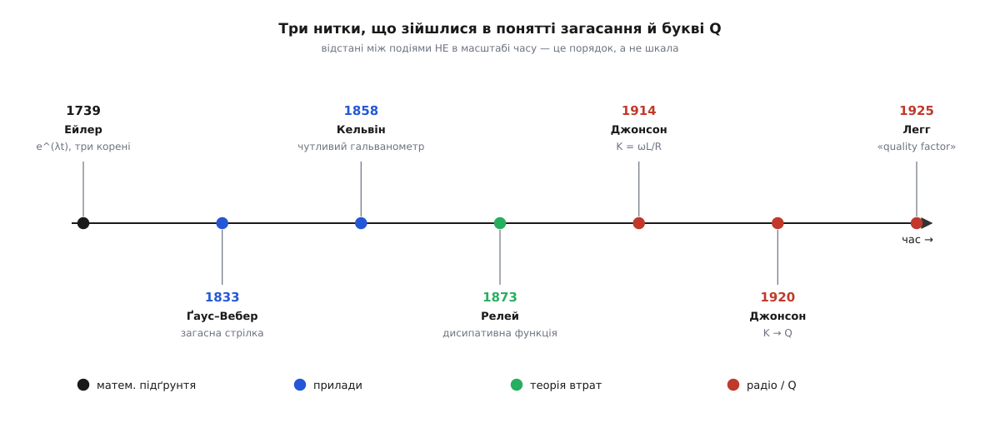

# 📜 Звідки взялися загасання, критичне демпфування й буква Q

Одне рівняння — `m·ẍ + c·ẋ + k·x = 0` — керує і дзвоном камертона, і плавністю ходу авто, і тиканням кварцу в годиннику. Але слова, якими ми називаємо його частини, зійшлися докупи не одразу й геть не там, де можна було б гадати. «Загасання» піднялося з вугільної шахти. Математику, що описує три долі осцилятора, розв'язали майже за століття до того, як хтось приклав її до реальної пружини. А буква Q, якою міряють «дзвінкість», дісталася інженерові з Bell просто тому, що решту абетки вже розібрали. Три нитки — слово, число й формула — тяглися майже сто вісімдесят років порізно, аж поки не сплелися в одне поняття.


*Три окремі струмки, що врешті злилися в одне: чиста математика Ейлера, боротьба з «дзвоном» у вимірювальних приладах і радіотехнічна погоня за якістю котушок. Відстані на смузі — порядок подій, а не шкала часу.*

### Слово, що піднялося з шахти

Почнімо з найнесподіванішого — з самого слова. «Демпфувати» (від англ. *to damp*) звучить як сухий технічний термін, але корінь у нього похмурий і цілком тілесний. Англійське *damp* у ранньому XIV столітті означало не «вологу», а **ядучу пару в шахті** — задушливий, часто отруйний газ, що збирався у вибоях. Звідси й досі живі шахтарські *firedamp* (рудниковий метан, що вибухає) і *choke-damp* (задушливий вуглекислий газ, від якого гасне лампа й людина). Саме слово прийшло, найпевніше, із середньонижньонімецького *damp* і зрештою з праґерманського *dampaz* — того самого кореня, що дав німецьке *Dampf* «пара, дим».

І ось найважливіше для нас: коли з іменника «пара» народилося дієслово *to damp*, воно означало **задушити, приглушити, погасити** — спершу буквально (загасити вогонь, звести нанівець ядуче повітря наприкінці XIV ст.), а вже з 1540-х — переносно: *to damp the spirits*, «приглушити запал, збити порив». Аж набагато пізніше фізики й інженери позичили це дієслово для свого: *to damp* — приборкати коливання, перетворивши їхню енергію на тепло.

Українська тут дає навдивовижу точну паралель. Ми **гасимо** вогонь — і ми ж **гасимо** коливання; те саме дієслово, та сама інтуїція придушення того, що спалахнуло. У цьому й уся суть демпфера: він не забороняє системі коливатися — він **не дає розгойданню розгорітися**. Загашений вогонь не перестає бути вогнем — він перестає буяти; загасний осцилятор не перестає бути осцилятором — він перестає дзвеніти. Слово знало фізику ще до того, як з'явилася фізика.

### Математика, що випередила фізику: Ейлер і три корені

Дивовижно, але саме рівняння загасного осцилятора вміли розв'язувати задовго до того, як хтось прив'язав його до пружини з демпфером, — і розв'язали не як фізику, а як чисту алгебру. Зробив це швейцарський математик **Леонард Ейлер** (Leonhard Euler). У листі до Йоганна Бернуллі від 15 вересня 1739 року й у працях 1740-х він виклав загальний спосіб для лінійних диференціальних рівнянь зі сталими коефіцієнтами — рівнянь рівно того самого крою, що й наше.

Ідея Ейлера гранично проста й досі лежить у серці кожного підручника. Підставмо в рівняння пробну функцію `x = e^(λt)` — просту експоненту з поки невідомим показником λ. Кожна похідна множить її на λ, спільний множник `e^(λt)` скорочується, і від диференціального рівняння лишається звичайне **алгебраїчне**:

```
m·λ² + c·λ + k = 0        ← «характеристичне» рівняння
```

Це квадратне рівняння на λ. А тепер найкрасивіше: **три долі осцилятора — це просто три випадки коренів квадратного рівняння**. Усе вирішує підкореневий вираз, дискримінант `c² − 4·m·k`:

```
c² < 4mk  →  два комплексні корені   →  синус під спадною обвідною (недозагашений)
c² > 4mk  →  два різні дійсні корені →  дві згасні експоненти, повзе (перезагашений)
c² = 4mk  →  один подвійний корінь   →  рівно межа (критичне загасання)
```

Ейлер не думав ні про підвіску авто, ні про гальванометр — він розбирав коливання струн і навантажених стрижнів. Та вся історія про «недо-», «критичне» й «пере-» загасання вже сиділа в тому дискримінанті, на сто років раніше за будь-який реальний демпфер. Критичне загасання, ζ = 1, — це, коли докопатися до дна, не що інше, як **алгебра подвійного кореня**: та особлива точка, де два дійсні корені збігаються в один. Фізика лиш дала цій точці ім'я й ужиток; сама точка була в математиці від початку.

### Прилад, який мусив НЕ дзвеніти

Що ж перетворило загасання з математичної цікавинки й прикрої вади на **свідомо задане число**? Потреба точно вимірювати — і мучитися з приладами, що ніяк не хотіли завмерти на поділці.

Перший яскравий приклад — магнітометр **Карла Фрідріха Ґауса** (Carl Friedrich Gauß) і **Вільгельма Вебера** (Wilhelm Weber), збудований у Ґеттінгені близько 1833 року. Це буквально механічний осцилятор на службі: важкий намагнічений брусок, підвішений на тонкій нитці, гойдається туди-сюди, і **період його гойдання** видає напруженість земного магнітного поля. Тут загасання було ворогом: опір повітря й тертя нитки повільно збивали розмах і псували відлік. Ґаус воював із ним як міг — брав важчі бруски (щоб протяги менше їх зносили), знімав покази здалеку в зорову трубу, щоб не колихати повітря диханням. Демпфування ще не було параметром, який підбирають, — воно було завадою, яку тлумлять.

Перелом настав із **гальванометром** — приладом, де легенька стрілка чи дзеркальце на підвісі відхиляється струмом. Британський фізик **Вільям Томсон** (William Thomson), згодом лорд Кельвін, запатентував чутливий **дзеркальний гальванометр** 1858 року — для трансатлантичного телеграфного кабелю: крихітне дзеркальце на підвішеній котушці кидало світлову пляму на далеку шкалу, обертаючи мізерний струм на добре видиме відхилення. Шотландець **Джеймс Клерк Максвелл** (James Clerk Maxwell) 1865 року відточив «балістичний» спосіб вимірювання ним. І тут усіх допікала одна й та сама біда: чутлива стрілка, штовхнута струмом, **гойдається туди-сюди, ніяк не спиняючись**, — сядь і чекай, поки перестане, або лови середнє на око.

Ліки виявилися рівно в тому, про що вся ця тема. Треба додати **саме стільки** загасання, щоб стрілка плавно з'їхала на своє значення й зупинилася — жодного разу його не перескочивши й не почавши хитатися назад. Такий гальванометр назвали **«dead-beat»** (англ. «без відбою, без перельоту») або **аперіодичним** (гр. *a-* «не» + *periodos* «оберт, цикл» — тобто таким, що взагалі не робить циклу). А «саме стільки» — це рівно ζ = 1, критичне загасання. Інженерна теорія цього дозрівала на початку XX століття цілком предметно: 1914 року в *Physical Review* вийшла праця про підбір «демпфувального прямокутника» для критичного загасання рухомої котушки, а 1916 року **Френк Веннер** (Frank Wenner) з Бюро стандартів США видав докладний посібник «General design of critically damped galvanometers». Отже, число ζ = 1 дістало ім'я й фах — «прилад, що дає один чистий відлік, а не дзвенить» — задовго до того, як «критичне загасання» стало рядком у підручнику. Уся користь критичного режиму, що описана в теорії, — найшвидше осісти без перельоту — це буквально причина, з якої його винайшли: стрілку, яка ще танцює, не прочитаєш.

### Загальний закон утрат: дисипативна функція Релея

Досі кожне тертя описували поодинці, на свій лад — для цієї пружини так, для тієї стрілки інак. Загальний, єдиний апарат для сил тертя, **пропорційних швидкості**, дав англійський фізик **Джон Вільям Стретт, 3-й барон Релей** (John William Strutt, 3rd Baron Rayleigh; 1842–1919) — той самий, що згодом отримає Нобелівську премію 1904 року за відкриття аргону (разом із Вільямом Ремзі) і чиїм ім'ям названо розсіяння світла, від якого небо синє.

У праці «Some general theorems relating to vibrations», яку Релей подав Лондонському математичному товариству 12 червня 1873 року, а потім розгорнув у двотомній «The Theory of Sound» (1877–1878), він увів те, що ми тепер звемо **дисипативною функцією Релея**. Думка тонка й ощадлива. Замість того щоб виписувати силу тертя для кожної координати окремо, Релей запропонував одну-єдину скалярну величину — по суті, **половину потужності, яку система просто зараз перетворює на тепло**:

```
F = ½·c·v²        (для однієї координати)

сила тертя = −∂F/∂v = −c·v        ← наша знайома −c·v
потужність утрат = c·v² = 2·F
```

Похідна цієї однієї функції за швидкістю одразу дає силу загасання на відповідній координаті — і то для **скільки завгодно** зчеплених осциляторів разом. Наша `−c·v` для однієї маси на пружині — лише найпростіший окремий випадок цієї загальної машинерії. Головне, що дисипативна функція гладко вклалася в елегантний апарат аналітичної механіки: там, де рух виводять із [принципу найменшої дії](book:physics/least-action-principle) — коли систему описують не силами поокремо, а єдиними функціями енергії, — доданок Релея став тим самим містком, яким у цю бездисипативну картину нарешті пустили тертя. Контекст у Релея був акустичний: чому звук згасає в повітрі, чому тон ударяного тіла тане. Але апарат вийшов універсальний — і саме він стоїть за спокійним записом `−c·v`, хай скільки мас, пружин і демпферів зчеплено докупи.

### Буква, що дісталася з решток абетки

І нарешті — головна героїня, буква **Q**. Вона прийшла не з механіки й не з акустики, а з телефонно-радіотехнічної інженерії, і історія її на диво земна.

На початку XX століття телефонні лінії напихали котушками індуктивності, щоб вирівняти передачу мови. Котушка тим краща, чим більше енергії вона запасає й чим менше марно розсіює на своєму опорі теплом. Інженер **Кеннет С. Джонсон** (Kenneth S. Johnson) з інженерного відділу компанії Western Electric — тієї самої, що згодом стала Bell Telephone Laboratories — близько **1914 року** ввів для цієї «чистоти» котушки величину, яку спершу позначив буквою **K**:

```
K = ω·L / R        ← «індуктивна чистота» котушки
```

— велика, коли котушка з індуктивністю L та опором R на частоті ω втрачає мало; по суті, обернена до «коефіцієнта втрат» (dissipation factor). Це вже впізнавана добротність, лише під іншою літерою.

А тепер найсмачніше. До **1920 року** Джонсон змінив позначку: буква K була «перевантажена», нею позначали забагато всього, тож він узяв натомість **Q**. І взяв її, як свідчить класичний нарис **Естілла Ґріна** (Estill I. Green) «The Story of Q» (*American Scientist*, 1955), **не тому, що Q — від «quality»**. Причина була цілком прозаїчна: усі зручніші літери абетки на той час були вже зайняті. Словами самого переказу — вибір символу Q був лиш тому, що *«all other letters of the alphabet were taken»* (усі інші літери абетки були розібрані). Жодного глибокого змісту: просто вільна буква.

«Якість» приклеїли до Q згодом. Колега Джонсона по Bell Labs — інженер з магнітних матеріалів **Віктор Е. Легг** (Victor E. Legg) — першим ужив для його символу словосполучення **«quality factor»** (фактор якості, добротність), і цей термін розійшовся десь після 1925 року. Так число, що каже, скільки разів дзенькне дзвіночок, наскільки чистий тон у кварцу, наскільки гострий пік у резонансу, — носить літеру, обрану **методом виключення**, і назву, **пришиту заднім числом**. Обидва — історична випадковість; фізика під ними — ні. Хто хоче не історію букви, а що саме вона [фізично міряє](book:physics/q-factor) — енергію, запасену проти втраченої за цикл, — знайде це окремо.

### Три словники, одне рівняння

Варто відступити на крок і побачити цілість. Те саме рівняння `m·ẍ + c·ẋ + k·x = 0` говорить трьома говірками, бо три різні спільноти намацали той самий кістяк і назвали кожна свою кістку.

**Механіка й акустика** дали йому слово «загасання» (те, що прийшло з шахти) і загальний закон утрат — дисипативну функцію Релея. **Приладобудування** дало «критичне» й «аперіодичне» загасання — режим стрілки, яка мусить дати один чистий відлік, а не дзвеніти. **Радіотехніка** дала число Q і — запізніло — слово «добротність». Коли ви пишете `ζ = c/(2·√(m·k))` й `Q = 1/(2·ζ)`, ви вживаєте словник, що збирався майже сто вісімдесят років людьми, які здебільшого дивилися зовсім не на вашу задачу — хто на струну, хто на телеграфну стрілку, хто на телефонну котушку.

І це не вада, а якраз пояснення, **чому** ті самі кілька символів однаково точно лягають і на гойдалку, і на гальванометр, і на кварцовий резонатор: кожна спільнота натрапила на той самий скелет загасного осцилятора — і лиш назвала іншу його кістку. Слово, число й формула, що народилися порізно, зрештою описують одну-єдину річ.
