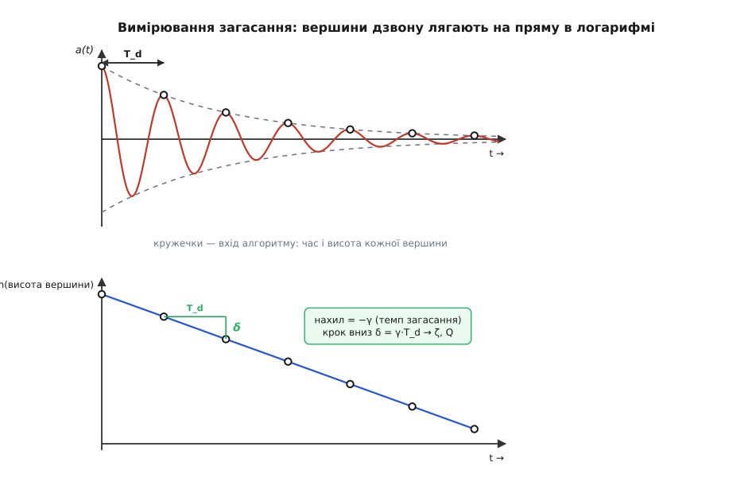
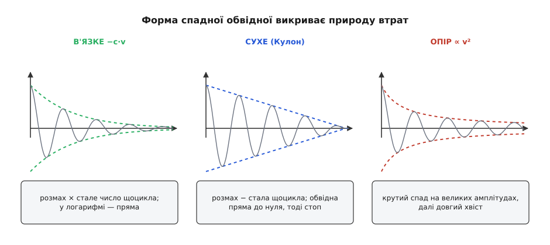

# ⚙️ Дзвін розповідає про себе: ζ, γ і Q із самого запису

Стукніть по келиху й піднесіть до нього телефон — мікрофон запише, як чистий тон народжується й за секунду-другу тане. Наклейте акселерометр на кузов і переїдьте вибоїну — дістанете криву, що гойднеться і згасне. Легенько вдарте по мосту й слухайте датчиком вібрації — той самий спадний слід. У кожному разі на руках у вас лишається одне: масив чисел, відліки коливання в часі. І цього масиву цілком досить, щоб прочитати всі числа загасання — темп γ, міру ζ, добротність Q, — навіть не знаючи ані маси, ані жорсткості, ані навіть того, що саме той датчик міряє. Як це зробити чесно, з робочим кодом і без самообману щодо шуму, — і є наша задача.

## Задача

Дано послідовність відліків a₀, a₁, a₂, … , знятих через рівний крок часу Δt = 1/f_s, де f_s — частота дискретизації. Це може бути звук із мікрофона, прискорення з акселерометра, напруга з тензодатчика — байдуже. Осцилятор до запису хтось один раз штовхнув і полишив: жодної зовнішньої сили під час дзвону немає, він вільно згасає.

Треба з цього масиву дістати три числа:

```
γ    — темп загасання, 1/с   (як швидко тане розмах)
ζ    — міра загасання, безрозмірна
Q    — добротність            (скільки циклів продзвенить)
```

І головна умова, що робить задачу цікавою: жодного з параметрів системи — маси m, жорсткості k, коефіцієнта c — ми **не знаємо наперед** і знати не мусимо. На вході лише числа з датчика.

## Одна ідея, на якій усе тримається

Вільний дзвін недозагашеного осцилятора — це синусоїда під спадною експоненційною обвідною плюс трохи шуму:

```
a(t) = A · e⁻ᵞᵗ · cos(ω_d·t + φ) + шум
```

Тут заховано дві прості речі, і кожна робить половину роботи.

**Перша: сусідні вершини стоять у сталому відношенні.** Дві однознакові вершини розділяє рівно один період T_d = 2π/ω_d. За цей час обвідна множиться на e⁻ᵞᵀᵈ — те саме число щоразу. Тому висоти вершин сідають, як члени геометричної прогресії: кожна в стільки ж разів нижча за попередню. А що робить логарифм із геометричною прогресією? Перетворює її на **арифметичну** — рівні сходинки вниз. Отже, якщо відкласти логарифм висоти вершини проти часу, точки лягають на **пряму**, і нахил тієї прямої — це якраз −γ. Уся хитрість вимірювання загасання зводиться до «проведи пряму крізь логарифми вершин».

**Друга, менш очевидна і дуже визвольна: γ і ω_d живуть у будь-якому сигналі моди.** Що б датчик не повертав — зміщення x, швидкість ẋ чи прискорення ẍ, — усі вони є похідними однієї й тієї самої x(t) = A·e⁻ᵞᵗ·cos(ω_d·t + φ). А похідна згасної синусоїди — знову згасна синусоїда з **тим самим** γ і **тим самим** ω_d, лише з іншою амплітудою й зсувом фази. Тому темп загасання й частота дзвону — це властивості самої моди, і вони проступають у будь-якому чесному записі коливання. Ось чому не треба ні калібрувати датчик, ні знати m і k: γ та ω_d видно навіть у некаліброваних, безрозмірних «попугаях» АЦП.

З цих двох фактів виростають два способи, і обидва варті того, щоб їх мати під рукою:

- **По двох піках** — узяти відношення двох вершин, дістати ζ одним рядком. Мінімальний інструмент; незамінний, коли вершин обмаль.
- **По всіх піках** — провести пряму крізь логарифми всіх вершин (нахил дає γ), а частоту взяти з відстані між ними. Стійкий до шуму спосіб для дзвінких, високодобротних систем.

## Найкоротший шлях: логарифмічний декремент по двох піках

Візьмімо дві сусідні однознакові вершини, aₙ і aₙ₊₁. Їхнє відношення — стале e⁻ᵞᵀᵈ, а його логарифм називають **логарифмічним декрементом** δ (лат. *decrementum* — спад):

```
δ = ln(aₙ / aₙ₊₁) = γ·T_d
```

Тепер підставмо T_d = 2π/ω_d і згадаймо, що γ = ζ·ω₀, ω_d = ω₀·√(1−ζ²). Множник ω₀ скорочується, і лишається чистий зв'язок декремента з мірою загасання:

```
δ = 2π·ζ / √(1 − ζ²)
```

Це рівняння легко обернути й дістати ζ прямо з виміряного δ:

```
ζ = δ / √(4π² + δ²)            (для слабкого загасання ζ ≈ δ/(2π))
Q = 1 / (2ζ) ≈ π/δ
```

**Приклад (підвіска після вибоїни).** Датчик спіймав дві перші однознакові вершини кузова: 0.0336 і 0.0047 (в яких одиницях — байдуже). Тоді:

```
δ = ln(0.0336 / 0.0047) = ln(7.15)      = 1.976
ζ = 1.976 / √(4π² + 1.976²)
  = 1.976 / √(39.48 + 3.90) = 1.976/6.586 = 0.300
Q = 1/(2·0.300)                          = 1.67
```

Дві вершини — і ми знаємо, що підвіска має ζ = 0.30, хоча про масу кузова й жорсткість пружини не спитали жодного разу.

Один запобіжник варто вбудувати одразу. Одне відношення вразливе до шуму: смикнеться одна вершина — попливе весь результат. Тому беруть не сусідні, а **першу й N-ту** вершину, і ділять логарифм на кількість циклів між ними — шум усереднюється:

```
δ = (1/N) · ln(a₀ / a_N)
```

> 🔧 **Навіщо це.** Прочитати ζ і Q з одного удару — це щоденний інструмент, а не вправа. На заводі дзвонів чи музичних інструментів **тап-тест** (легкий удар + запис) відсіює тріснуту відливку за секунди: тріщина з'їдає добротність, і Q падає. Автовиробник так перевіряє, чи підвіска зійшла з конвеєра з тим ζ, що заклали конструктори. Будівельники «дзвонять» по мосту чи перекриттю й міряють загасання його власних мод — раптове падіння Q виказує втому металу чи розхитаний вузол. У мікромеханіці той самий Q гіроскопа чи резонатора визначає його чутливість, і його міряють рівно цим дзвоном. Скрізь одна дія: стукни, запиши, прочитай ζ.

## Робочий конвеєр: пряма крізь логарифми всіх вершин

Коли осцилятор дзвінкий і вершин багато (камертон, келих, кварц), гріх обмежуватися двома точками — краще провести пряму крізь **усі**. Нахил дасть γ надійніше за будь-яку окрему пару, а розкид точок навколо прямої одразу покаже, чи модель узагалі годиться.

Наведений нижче код на Python робить це від початку до кінця. Мова тут не випадкова: обробка масиву відліків — рідна стихія `numpy`/`scipy`, де пошук піків, перетворення Фур'є й найменші квадрати вже готові й читаються майже як формули. Спершу — генератор тестового запису (щоб було на чому перевіряти й із чим порівнювати), далі — сам оцінювач.

```python
import numpy as np
from scipy.signal import find_peaks

def make_ringdown(fs=2000.0, T=4.0, f_d=45.0, zeta=0.05, A=1.0,
                  phi=0.0, noise=0.01, seed=0):
    """Синтез запису вільного дзвону з відомими параметрами + шум.
    Потрібен, щоб перевіряти оцінювач: знаємо правду — бачимо похибку."""
    rng = np.random.default_rng(seed)
    t = np.arange(0.0, T, 1.0 / fs)
    w_d = 2 * np.pi * f_d
    gamma = zeta * w_d / np.sqrt(1 - zeta**2)      # γ = ζ·ω₀, ω₀ = ω_d/√(1−ζ²)
    x = A * np.exp(-gamma * t) * np.cos(w_d * t + phi)
    return t, x + noise * rng.standard_normal(t.size)

def rough_freq(a, fs):
    """Груба частота дзвону з піка спектра — щоб знати, як далеко стоять вершини."""
    A = np.abs(np.fft.rfft(a - np.mean(a)))
    f = np.fft.rfftfreq(len(a), 1.0 / fs)
    return f[1 + np.argmax(A[1:])]                 # пропускаємо нульову (сталу) складову

def refine_peak(a, i):
    """Параболою по трьох точках уточнюємо вершину між відліками:
    повертає (зсув у частках кроку, справжню висоту вершини)."""
    y0, y1, y2 = a[i - 1], a[i], a[i + 1]
    den = y0 - 2 * y1 + y2
    if den == 0:
        return 0.0, y1
    d = 0.5 * (y0 - y2) / den                      # |d| < 0.5 — де насправді вершина
    return d, y1 - 0.25 * (y0 - y2) * d

def estimate_damping(t, a):
    fs = 1.0 / (t[1] - t[0])
    noise_rms = np.std(a[int(0.9 * len(a)):])      # хвіст запису = сам шум
    f0 = rough_freq(a, fs)
    dist = max(1, int(0.6 * fs / f0))              # вершини не ближче за пів періоду
    amax = np.max(np.abs(a))
    floor = max(0.04 * amax, 6 * noise_rms)        # довіряємо лише виразним вершинам
    idx, _ = find_peaks(a, distance=dist, height=floor)
    idx = idx[(idx > 0) & (idx < len(a) - 1)]

    tp, ap = [], []
    for i in idx:                                  # уточнюємо кожну вершину параболою
        d, apk = refine_peak(a, i)
        tp.append(t[i] + d / fs); ap.append(apk)
    tp, ap = np.array(tp), np.array(ap)
    if len(ap) < 3:
        raise ValueError("замало вершин — довший запис або менший шум")

    T_d = np.mean(np.diff(tp)); w_d = 2 * np.pi / T_d          # частота — з кроку вершин
    slope, _ = np.polyfit(tp, np.log(ap), 1, w=ap)             # пряма крізь ln(вершини),
    gamma = -slope                                             # вага ∝ висота (великим віри більше)

    w0 = np.hypot(gamma, w_d)                                  # ω₀ = √(γ² + ω_d²) — без m, k!
    zeta = gamma / w0
    Q = w0 / (2 * gamma)

    delta = np.log(ap[0] / ap[-1]) / (len(ap) - 1)             # перехресна перевірка:
    zeta_ld = delta / np.sqrt(4 * np.pi**2 + delta**2)         # лог-декремент по краях

    return dict(f_d=w_d / (2 * np.pi), gamma=gamma, w0=w0,
                zeta=zeta, Q=Q, zeta_ld=zeta_ld, n=len(ap))

t, a = make_ringdown(noise=0.01)                   # «дзвін» із ζ=0.05, f_d=45 Гц, шум 1%
r = estimate_damping(t, a)
print(f"частота дзвону  f_d = {r['f_d']:.2f} Гц")
print(f"темп загасання  γ   = {r['gamma']:.2f} 1/с")
print(f"власна частота  ω₀  = {r['w0']:.1f} рад/с")
print(f"ζ (обвідна)         = {r['zeta']:.4f}")
print(f"ζ (лог-декремент)   = {r['zeta_ld']:.4f}")
print(f"добротність     Q   = {r['Q']:.1f}   (по {r['n']} вершинах)")
```

На записі із закладеними ζ = 0.05 і f_d = 45 Гц (частота дискретизації 2 кГц, шум 1 %) виходить:

```
частота дзвону  f_d = 45.07 Гц
темп загасання  γ   = 13.33 1/с
власна частота  ω₀  = 283.5 рад/с
ζ (обвідна)         = 0.0470
ζ (лог-декремент)   = 0.0435
добротність     Q   = 10.6   (по 10 вершинах)
```

Закладено ζ = 0.0500, Q = 10.0 — прочитано ζ ≈ 0.047, Q ≈ 10.6. Похибка кілька відсотків при відчутному шумі, і що важливо — **обидва** незалежні способи (пряма по всіх вершинах і лог-декремент по краях) дали близькі числа. Це вбудований детектор брехні: якщо вони розходяться, модель «одна згасна синусоїда» до цього запису не пасує (домішалася друга мода, є нелінійність — про це нижче).


*Дві половини одного вимірювання. Угорі алгоритм бере лише вершини (кружечки) — їхній час і висоту. Унизу ті самі висоти в логарифмі: геометрична прогресія розпрямляється в пряму, тож увесь дзвін описують два числа — нахил (−γ) і крок сходинки δ = γ·T_d, з яких і виходять ζ та Q.*

Варто розібрати, що саме роблять непоказні рядки конвеєра, — бо кожен з них відповідає на конкретну пастку.

- **`rough_freq` через перетворення Фур'є.** Швидке перетворення Фур'є розкладає запис на складові частоти й показує, на якій із них зосереджена енергія — так за один прохід видно головну частоту дзвону (і чи не сидять поруч інші моди). Тут вона потрібна для дрібниці: знаючи приблизну частоту, ми кажемо шукачеві піків, що вершини стоять не ближче, ніж за пів періоду, — і він не приймає дрібні брижі шуму за вершини. Механіку перетворення розібрано окремо ([швидке перетворення Фур'є](book:algorithms/fft)).
- **`find_peaks` із `distance` і `height`.** Два запобіжники проти шуму: мінімальна відстань між вершинами (з попереднього пункту) і поріг висоти. Поріг не з голови: ми оцінюємо рівень шуму як розкид у мертвому хвості запису (де дзвін уже стих) і довіряємо лише вершинам, що височіють над ним хоча б у шість разів.
- **`refine_peak` — парабола.** Дискретизація майже ніколи не влучає відліком точно в гребінь; ми ловимо сусідній відлік, трохи нижчий і трохи зсунутий у часі. Парабола по трьох точках навколо вершини відновлює, де гребінь був насправді, — це прибирає систематичне заниження висоти й похибку в часі, з яких інакше поповзли б і γ, і ω_d.
- **`np.polyfit(..., w=ap)` — зважена пряма.** Пряму крізь хмару точок проводять методом найменших квадратів: так, щоб сума квадратів вертикальних відхилень була найменша; для прямої він дає замкнену формулу нахилу й зсуву ([найменші квадрати](book:math/least-squares)). Вага ∝ висота вершини каже: великим, чистим вершинам віри більше, ніж дрібним і зашумленим під кінець запису.

## Замкнути коло: інтегратор і настроювання підвіски

Оцінювач треба на чомусь перевіряти, а конструкторові — ще й підбирати демпфер під бажану поведінку, ще не торкаючись заліза. І те, й те дає простий чисельний інтегратор рівняння руху m·ẍ + c·ẋ + k·x = 0. Диференціальне рівняння інтегрують числом, крокуючи стан [x, v] маленькими кроками; метод Рунге–Кутти 4-го порядку на кожному кроці робить чотири проби похідної й дає точність, якої тут вистачає з головою ([числові методи розв'язку ОДУ](book:algorithms/numerical-ode)).

```python
def simulate(m, k, c, x0=0.0, v0=0.0, T=3.0, fs=2000.0):
    """RK4-інтегрування m·ẍ + c·ẋ + k·x = 0. Стан s = [x, v]."""
    w0 = np.sqrt(k / m); two_zw = c / m            # c/m = 2ζω₀
    def deriv(s):
        x, v = s
        return np.array([v, -w0 * w0 * x - two_zw * v])
    dt = 1.0 / fs; n = int(T * fs); t = np.arange(n) * dt
    s = np.array([x0, v0]); out = np.empty(n)
    for i in range(n):
        out[i] = s[0]
        k1 = deriv(s); k2 = deriv(s + 0.5 * dt * k1)
        k3 = deriv(s + 0.5 * dt * k2); k4 = deriv(s + dt * k3)
        s = s + (dt / 6.0) * (k1 + 2 * k2 + 2 * k3 + k4)
    return t, out

def c_for_zeta(m, k, zeta):
    """Коефіцієнт демпфера під заданий ζ: c = 2ζ·√(m·k)."""
    return 2.0 * zeta * np.sqrt(m * k)

# Чверть кузова: m = 300 кг, k = 30000 Н/м. Який c дає бажаний ζ?
m, k = 300.0, 30000.0
print("c критичне (ζ=1) =", c_for_zeta(m, k, 1.0), "Н·с/м")
print("c для ζ = 0.3    =", c_for_zeta(m, k, 0.3), "Н·с/м")

# Симулюємо кузов після поштовху й «міряємо» ζ з двох перших вершин
t, x = simulate(m, k, c_for_zeta(m, k, 0.3), x0=0.0, v0=0.5)
idx, _ = find_peaks(x, height=0.02 * np.max(np.abs(x)))
p1, p2 = x[idx[0]], x[idx[1]]
delta = np.log(p1 / p2)
zeta = delta / np.sqrt(4 * np.pi**2 + delta**2)
print(f"дві вершини: {p1:.4f} → {p2:.4f}  →  δ={delta:.3f}, ζ={zeta:.3f}, Q={1/(2*zeta):.2f}")
```

```
c критичне (ζ=1) = 6000.0 Н·с/м
c для ζ = 0.3    = 1800.0 Н·с/м
дві вершини: 0.0336 → 0.0047  →  δ=1.976, ζ=0.300, Q=1.67
```

Коло замкнулося. Ми задали бажаний ζ = 0.3, порахували під нього демпфер (c = 1800 Н·с/м), проінтегрували відгук на поштовх, витягли з нього дві вершини — і оцінювач повернув рівно ζ = 0.300. Тобто ще до першої вибоїни на реальній дорозі можна впевнитися, що і формула демпфера, і алгоритм читання злагоджені. І тут-таки виринає жива обставина: при ζ = 0.3 кузов устигає дати лише **дві** виразні вершини, перш ніж заспокоїтися, — на пряму по багатьох точках даних немає, і єдиний придатний інструмент — саме лог-декремент по двох піках. А для дзвінкого келиха з десятками вершин, навпаки, засяє пряма по всіх. Обидва способи потрібні не для краси — вони покривають різні кінці шкали добротності.

## На мікроконтролері: потоковий Q без numpy

Коли дзвін треба читати не на ноутбуці post factum, а прямо в приладі — у датчику вібрації, що сам стежить за станом підшипника, — картина інша. Немає ні `numpy`, ні всього запису в пам'яті: відліки течуть по одному, пам'ять і такти лічені. Тут доречна C — мова, що лягає на голе залізо без прошарків. Хитрість у тому, щоб не зберігати сигнал, а ловити вершини **на льоту**: тримати попередній відлік і прапорець «росли», і в мить, коли ріст змінюється спадом, оголошувати попередню точку вершиною. По першій і останній прийнятій вершині — той самий усереднений лог-декремент.

```c
#include <math.h>
#include <stdint.h>

#define FOUR_PI2  39.4784176f          /* 4·π² */

typedef struct {
    float    fs, floor, prev;
    int      rising, peaks;
    float    a_first, a_last;          /* висоти першої й останньої вершини */
    uint32_t n_first, n_last, idx;     /* їхні номери відліків */
} Ring;

void ring_init(Ring *r, float fs, float noise_floor) {
    r->fs = fs; r->floor = 6.0f * noise_floor;    /* довіра лише над шумом */
    r->prev = 0.0f; r->rising = 0; r->peaks = 0;
    r->a_first = r->a_last = 0.0f;
    r->n_first = r->n_last = 0; r->idx = 0;
}

/* Годуємо по одному відліку; повертає 1, коли щойно прийнято нову вершину.
   Детектор варто «зводити» після удару, коли сигнал уже піднявся над floor. */
int ring_push(Ring *r, float x) {
    int got = 0;
    if (r->rising && x < r->prev && r->prev > r->floor) {
        if (r->peaks == 0) { r->a_first = r->prev; r->n_first = r->idx - 1; }
        r->a_last = r->prev; r->n_last = r->idx - 1;
        r->peaks++; got = 1;
    }
    r->rising = (x > r->prev);
    r->prev = x; r->idx++;
    return got;
}

/* Коли вершин зібралося досить — витягуємо ζ, Q, f_d. 0, якщо замало. */
int ring_result(const Ring *r, float *zeta, float *Q, float *f_d) {
    if (r->peaks < 3) return 0;
    int   cycles = r->peaks - 1;
    float delta  = logf(r->a_first / r->a_last) / (float)cycles;
    float z      = delta / sqrtf(FOUR_PI2 + delta * delta);
    float Td     = (float)(r->n_last - r->n_first) / (r->fs * (float)cycles);
    *zeta = z;
    *Q    = 1.0f / (2.0f * z);
    *f_d  = 1.0f / Td;
    return 1;
}
```

Ця жменька коду не тримає в пам'яті нічого, крім кількох чисел, і робить сталу роботу на кожен відлік — тож крутиться хоч на найдешевшому мікроконтролері в перерві між зчитуваннями акселерометра. Знадобилися лише `logf` і `sqrtf`; ні буфера сигналу, ні перетворення Фур'є, ні динамічної пам'яті. Ту саму фізику, що на ноутбуці читалася `numpy`-масивом, тут прочитано трьома змінними стану.

## Складність і пастки

Обчислювально все дешеве. Пошук піків і найменші квадрати — це один прохід по масиву, O(n) від числа відліків; перетворення Фур'є для грубої частоти — O(n·log n), і воно ж найдорожче, але одноразове. На мікроконтролері вартість узагалі стала на відлік. Складність тут не в тактах, а в тому, щоб число, яке ти дістав, не було вигадкою. Ось де підстерігають пастки.

**Шум збиває пошук піків.** Це головна морока, і саме проти неї вибудувано половину конвеєра. На дрібній вершині шум легко домальовує кілька фальшивих гребінців поряд, і наївний шукач приймає їх усі — частота стрибає, нахил пливе. Три заслони рятують: мінімальна відстань між вершинами (з грубої частоти), поріг у кілька шумів над рівнем мертвого хвоста і зважування прямої на користь високих чистих вершин. Якщо шуму багато, чесніше **відкинути** зашумлений хвіст і рахувати ζ по кількох перших вершинах, ніж тягнути пряму крізь кашу: інакше шум систематично **завищує** Q (дрібні вершини він піднімає, спад здається пологішим, ніж є).

**Замала частота дискретизації.** Дві біди одразу. Перша: щоб дискретний запис вірно передавав частоту, брати відліки треба частіше за подвоєну найвищу частоту сигналу — це критерій Найквіста; інакше швидке коливання «перевернеться» в оманливо повільне, і виміряна f_d буде просто хибною ([Найквіст і аліасинг](book:communications/nyquist-aliasing)). Друга, підступніша, живе задовго до межі Найквіста: навіть коли частота передається без аліасингу, при жменьці відліків на період ти майже завжди ловиш точку **збоку** від гребеня, а не на ньому, — і систематично занижуєш висоту вершини. Звідси похибка в γ. Ліки — брати з запасом (двадцять і більше відліків на період для надійної висоти) і уточнювати гребінь параболою, як у коді вище.

**Нелінійність при великих амплітудах.** Уся побудова спирається на те, що загасання в'язке, −c·v, — тоді й тільки тоді спад строго експоненційний, а вершини строго в сталому відношенні. На великих амплітудах це часто неправда: демпфер може віддавати силу ∝ v² (турбулентний опір), а в реальних вузлах домішується сухе тертя ковзання. І тоді обвідна вже не експонента, а її **форма викриває природу втрат** — це безцінний діагностичний бонус, а не лише пастка.


*Обвідна — це підпис тертя. В'язке −c·v: розмах меншає в стале число разів щоцикла, у логарифмі — пряма. Сухе (кулонівське) тертя знімає з амплітуди сталий шматок за цикл — обвідна спадає **прямою** до нуля й різко спиняється в мертвій зоні. Квадратичний опір ∝ v² лютує на великих швидкостях і кисне на малих — крутий спад спершу, довгий хвіст потім.*

Практичний висновок простий: якщо логарифми вершин **не** лягають на пряму (вгинаються чи вигинаються), не тягни одну експоненту крізь усе. Або міряй ζ на **малих** амплітудах — по останніх кількох циклах, де майже будь-яке тертя вже майже в'язке й спад майже прямий, — або визнай, що загасання нелінійне, і опиши його чесно. Розбіжність двох способів оцінки (пряма проти лог-декремента по краях) — якраз перший сигнал, що модель дала тріщину.

**Дві близькі моди й дрейф.** Якщо конструкція дзвенить не на одній частоті, а на двох близьких, у записі проступлять биття, і єдина згасна синусоїда їх не опише — вершини «дихатимуть». Тут і згодиться перший погляд через перетворення Фур'є: якщо в спектрі не один пік, а два поруч, спершу відсій потрібну моду вузькою смугою, а вже тоді читай її загасання. І остання дрібниця, що псує багато вимірювань: стала складова чи повільний дрейф датчика зсуває «нуль», і висоти вершин рахуються від хибної осі. Тому в конвеєрі й стоїть `a - np.mean(a)` перед перетворенням, а в акуратнішому варіанті — віднімання повільного тренду.

## Підсумок

Вільний дзвін несе в собі повний паспорт свого загасання, і щоб його прочитати, вистачає масиву відліків — без маси, без жорсткості, без каліброваного датчика. Уся фізика зводиться до одного факту: вершини сідають у сталому відношенні, тож у логарифмі вони — пряма. Звідси два інструменти на різні випадки: **лог-декремент по двох піках** (δ = ln(aₙ/aₙ₊₁), далі ζ = δ/√(4π²+δ²), Q = 1/(2ζ)) — коли вершин мало, і **зважена пряма крізь усі вершини** (нахил −γ, крок δ) — коли їх багато. Частоту дзвону дає відстань між вершинами, а власну частоту відновлює ω₀ = √(γ² + ω_d²). Робочий код — десяток рядків на Python для аналізу цілого запису й три змінні стану на C для потокової оцінки в мікроконтролері. А головна пильність — не до тактів, а до правди числа: шум, замала дискретизація й нелінійність спотворюють результат тихо, і найкращий сторож проти них — щоб два незалежні способи дали одне й те саме ζ.
