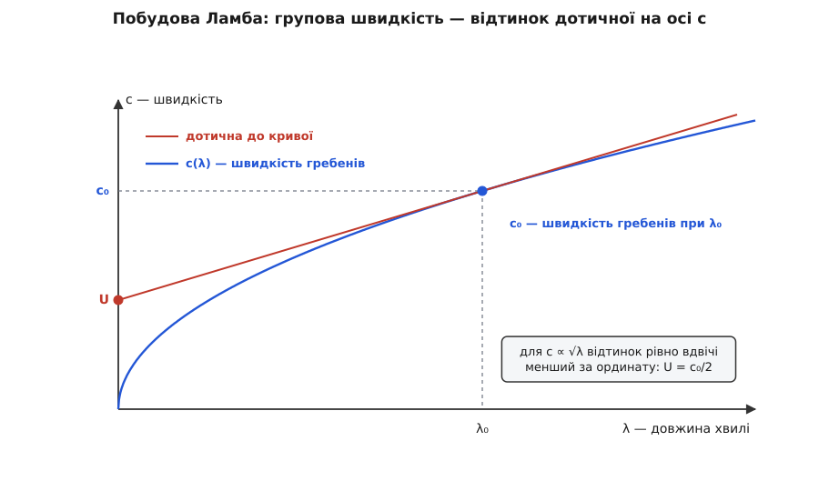
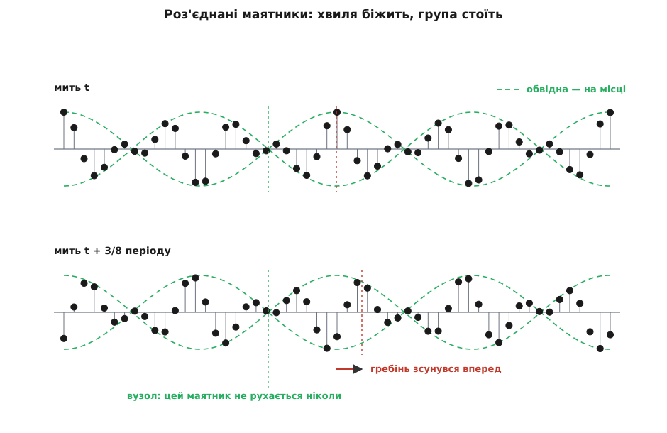

# 📜 Як група хвиль здобула власну швидкість

Те, що зграйка хвиль пливе повільніше за окремі гребені всередині неї, видно з будь-якого містка над ставком — і все ж формулу для швидкості групи вперше записали 1839 року в Дубліні, оприлюднили 1876-го як задачу на кембриджському іспиті, а справжнього автора розшукали аж 1914-го. Сімдесят п'ять років між правильною відповіддю й тим, хто нею скористався, — не випадковість: доки не з'явилося практичне питання, спостереження нікому не було потрібне.

## Спостереження, до якого не було питання

Джон Скотт Расселл (John Scott Russell, 1808–1882), шотландський корабельний інженер, у доповіді «Report on Waves» Британській асоціації сприяння науці 1844 року описав те, що бачив на воді: група хвиль просувається повільніше за окремі хвилі в ній, кожна хвиля народжується позаду групи, пробігає її наскрізь і згасає на передньому краї. Горацій Ламб (Horace Lamb) у «Гідродинаміці» й Томас Гейвлок (Thomas Havelock) у трактаті 1914 року посилаються саме на цю сторінку — 369-ту звіту — як на перший письмовий запис явища.

Той самий звіт зробив Расселла знаменитим, але зовсім іншим місцем: там-таки він описав самотню хвилю, яку 1834 року наздоганяв верхи вздовж каналу. А запис про групи не викликав жодного зацікавлення. Причина проста: він ні на що не відповідав. Щоб «швидкість групи» стала величиною, а не картинкою, хтось мав спитати, коли саме група кудись прибуде.

## Гамільтон рахує ланцюжок частинок

Питання поставили — але з протилежного боку. 1839 року Вільям Роуен Гамільтон (William Rowan Hamilton, 1805–1865), ірландський математик, професор астрономії Триніті-коледжу в Дубліні й директор Данзінкської обсерваторії, подав Королівській ірландській академії дві короткі анотації під назвою «Researches respecting vibration, connected with the theory of light» (Proc. Roy. Irish Acad., т. I, с. 267 і 341). Його цікавила не вода, а світло: як коливання проникає в ту частину середовища, що ще не колихалася.

Модель він узяв найпростішу з можливих — нескінченний ланцюжок однакових частинок на однакових проміжках, кожна тягне лише двох найближчих сусідів. У такому ланцюжку частота залежить від хвильового числа не прямо пропорційно, і саме через це дві швидкості розходяться:

```
крок ланцюжка d,  θ = k·d/2
ω(k)  = 2·a·sin θ                   частота коливання з хвильовим числом k
v_ф   = ω/k   = a·d·sin θ / θ       з якою швидкістю фаза переходить від частинки до частинки
v_гр  = dω/dk = a·d·cos θ           з якою швидкістю збурення захоплює нові частинки
```

Оскільки tg θ > θ, дріб sin θ/θ завжди більший за cos θ — отже, збурення відстає від фази. Наскільки саме:

**Ланцюжок, у якому на одну довжину хвилі припадає 10 частинок.**

```
θ        = π/10                    = 0.3142 рад
sin θ                              = 0.3090
cos θ                              = 0.9511
v_гр/v_ф = θ·cos θ / sin θ = 0.3142·0.9511/0.3090 = 0.967
```

Три відсотки — «на скінченну, хоч і малу величину», як писав сам Гамільтон. Він одразу переклав це на оптику: якщо швидкість світла в речовині залежить від кольору, то швидкість, з якою світло цього кольору «долає темряву», трохи менша за ту, з якою біжить його фаза. Це і є [різниця між фазовою і груповою швидкістю](topic:physics/phase-group-velocity): фазова каже, як швидко переміщується окремий гребінь, групова — як швидко переміщується сама збурена ділянка, і збігаються вони лише там, де швидкість не залежить від довжини хвилі.

Далі сталося те, через що ім'я Гамільтона зникло з цієї історії на три чверті століття. В анотаціях він послався на повний мемуар, який мав вийти в «Transactions» академії. Мемуар не вийшов ніколи — Гейвлок 1914 року не зміг знайти його в жодному виданні. Надруковано, і водночас ніби й немає.

## Фруд і питання, яке коштувало грошей

Вільям Фруд (William Froude, 1810–1879), англійський корабельний інженер, який першим поставив випробування моделей суден на наукову основу, дивився на хвилі з практичного боку. Довгі пологі хвилі, що приходять на англійське узбережжя від далекого шторму, дозволяють судити, де шторм і коли чекати негоди: період хвилі на місці спостереження пов'язаний з її довжиною, а довжина — зі швидкістю. Тільки от оцінки, зроблені за швидкістю гребенів, систематично обіцяли прихід раніше, ніж хвилі приходили насправді.

17 січня 1873 року Фруд написав про свої спостереження Стоксові — лист надруковано в посмертному зібранні листування Стокса (1907). Суть зауваження: рахувати треба не за гребенем, бо приходить група. Про те саме Фруд розповів і Релеєві; той у статті 1877 року окремо зазначив, що увагу до предмета йому привернув «містер Фруд» роки за два перед тим.

Ім'я Фруда з переказів цієї історії зазвичай випадає — лишаються Стокс і Релей. Але саме він передав обом одне й те саме питання, і це задокументовано з двох незалежних боків: листуванням Стокса й приміткою Релея.

## Задача на іспиті

Джордж Ґабріель Стокс (George Gabriel Stokes, 1819–1903) народився у Скріні, графство Слайґо, в Ірландії, а з 1849 року й до смерті обіймав Лукасівську кафедру математики в Кембриджі. Далекі шторми його вже цікавили з власного приводу: він розумів, що довші хвилі йдуть швидше, а тому спостережений період хвиль від далекого шторму мусить із часом спадати, і з цього можна дістати відстань до шторму.

1876 року Стокс написав Джорджу Бідделлу Ері (George Biddell Airy) про результат, який вважав новим: у глибокій воді група йде вдвічі повільніше за окремі хвилі. А оприлюднив він його дивним чином — задачею екзаменаційного аркуша на премію Сміта (Smith's Prize), кембриджського математичного конкурсу; аркуш датовано 2 лютого 1876 року, згодом його передрукували в п'ятому томі зібрання праць Стокса. Сам він здобув цю премію 1841-го, коли її складав.

Хід міркування — той, що потім став стандартним: замінити групу [сумою двох нескінченних синусоїд](topic:physics/wave-superposition) однакової амплітуди й майже однакової довжини хвилі. У лінійному середовищі хвилі просто додаються, а суму двох близьких синусоїд можна переписати як добуток швидкого носія на повільну обвідну — і швидкість обвідної тоді рахується прямо, без жодних додаткових припущень.

А чому саме половина — видно навіть без викладок, якщо накреслити швидкість гребенів як функцію довжини хвилі.



*Побудова, яку Ламб опублікував 1900 року в «Manchester Memoirs»: групова швидкість — це відтинок, який дотична лишає на осі швидкостей.*

Для гравітаційних хвиль на глибокій воді c ∝ √λ, крива стає параболою, і дотична відтинає на осі рівно половину. Отже, «половина» походить не з води як такої, а з показника ½ у цьому степені.

Обидва пізніші класики приписують пояснення Стоксові обережно: Ламб пише, що воно «здається, вперше було дане Стоксом», Релей — що явище «наскільки я знаю, вперше пояснив Стокс». Обережність тут доречна: єдине першоджерело — екзаменаційний аркуш.

## Одна формула на всі хвилі

Джон Вільям Стретт, третій барон Релей (John William Strutt, Lord Rayleigh, 1842–1919), дійшов того самого незалежно й пішов далі. У статті «On progressive waves» (Proc. London Math. Soc., т. IX, с. 21, 1877), яку він потім передрукував додатком до «Theory of Sound», з'являється формула вже не для води, а для чого завгодно:

```
U = V − λ·dV/dλ = d(k·V)/dk        V — швидкість гребенів, U — швидкість групи
якщо V ∝ λⁿ, то  U = (1 − n)·V
```

І одразу — таблиця випадків, яку варто прочитати уважно:

```
V ∝ λ           n =  1      U = 0         роз'єднані маятники Рейнольдса
V ∝ λ^(1/2)     n =  1/2    U = V/2       гравітаційні хвилі на глибокій воді
V ∝ λ⁰          n =  0      U = V         звук у повітрі
V ∝ λ^(−1/2)    n = −1/2    U = 1.5·V     капілярні брижі
V ∝ λ^(−1)      n = −1      U = 2·V       згинні хвилі в стрижні
```

Головне в цій таблиці — не «половина», а те, що половина тут ні до чого: усе вирішує показник n. У капілярних брижах, де форму повертає [поверхневий натяг](topic:physics/surface-tension) — стягування поверхні рідини, яке зменшує її площу, — а не тяжіння, група випереджає гребені в півтора раза. У згинних хвилях стрижня — удвічі. Загальну теорію Релей виклав, до речі, не в розділі про воду, а в розділі про поперечні коливання стрижнів; вода згадана там приміткою.

## Рейнольдс: енергії не вистачає

Осборн Рейнольдс (Osborne Reynolds, 1842–1912), народжений в Ірландії професор інженерії Манчестерського університету, підійшов з іншого боку — і саме його підхід дав груповій швидкості фізичний зміст. Доповідь він виголосив на зборах Британської асоціації в Плімуті, а 23 серпня 1877 року вона вийшла в «Nature» під назвою «On the rate of progression of groups of waves and the rate at which energy is transmitted by waves» (т. XVI, с. 343).

Рейнольдс порахував не хвилі, а роботу. Уявіть у воді вертикальну площину, крізь яку проходить потяг хвиль. Вода з одного боку тисне на воду з другого й рухає її — тобто крізь площину перекачується енергія. Рейнольдс обчислив цю перекачку і дістав рівно половину тієї енергії, яку несуть хвилі, що за той самий час площину перетнули. Висновок звідси невідворотний: якщо потяг хвиль обмежений, його передній край не може просуватися зі швидкістю окремих хвиль, бо на це просто не надходить енергії. Мусить бути вдвічі повільніше.

Релей одразу помітив, що аргумент працює й у зворотний бік. Відношення перекачаної енергії до енергії хвиль, які пройшли, дорівнює U : V — а отже, там, де U більша за V, енергії передається більше, ніж «належить» хвилям, що проминули площину. У загальному вигляді це звучить так: енергія, передана за одиницю часу, поділена на енергію, запасену в одиниці довжини, і є групова швидкість. Ламб зазначає, що це ототожнення Релей поширив на всі види хвиль.

> 🔧 **Навіщо це.** Саме з енергетичного прочитання групова швидкість і стала тією швидкістю, про яку говорять, коли питають «як швидко дійде». Швидкість гребенів такого статусу не має взагалі: у хвилеводі чи в плазмі вона спокійно буває більшою за швидкість світла, і нікого це не бентежить, бо гребінь нічого не переносить. Переносить група.

Рейнольдс не обмежився обчисленням — він побудував модель. За описом Ламба це ряд однакових маятників, чиї тягарці з'єднані ниткою; вона показує різницю двох швидкостей напрочуд яскраво. Крайній випадок цієї моделі стоїть першим рядком у таблиці Релея — «роз'єднані маятники Рейнольдса»:

```
однакові маятники, кожен зі своїм періодом, зв'язку між ними немає
ω(k) = ω₀ = const              частота не залежить від хвильового числа
v_ф  = ω₀/k                    яка завгодно: залежить лише від заданого зсуву фаз
v_гр = dω/dk = 0               група не рухається зовсім
```

Запустіть ряд однакових маятників так, щоб кожен наступний відставав від сусіда на однаковий кут, — уздовж ряду побіжить хвиля. Вона біжить, бо фази зсунуті; вона не переносить нічого, бо маятники не з'єднані. Група в такому ряду стоїть.



*Хвиля пробігає рядом маятників, а обвідна не рухається: у вузлах маятники стоять весь час.*

## Від брижів до світла

17 травня 1881 року Джеймс Янг і Джордж Форбс (James Young, George Forbes) оголосили Королівському товариству, що синє світло у вакуумі летить приблизно на 1.8 % швидше за червоне. Релей відгукнувся двома нотатками в «Nature» (т. XXIV, с. 382 і т. XXV, с. 52, 1881) — і почав не зі спору, а з питання: що взагалі міряє такий дослід?

Окрему світлову хвилю позначити неможливо — на ній немає мітки, за якою її потім упізнаєш. Тому в кожному наземному вимірі роблять одне й те саме: накладають на рівний потік хвиль якусь особливість — переривають промінь зубчастим колесом або зрізають дзеркалом, що обертається, — і засікають, коли ця особливість повернеться. Але особливість і є група. Отже, [класичні виміри швидкості світла](topic:physics/speed-of-light-measurement) дають групову швидкість, а не швидкість гребенів. У порожнечі це те саме; у речовині — ні. У цих самих нотатках з'являється і сам термін: group-velocity, групова швидкість.

Далі почалася суперечка, бо одна річ — сказати «прилад міряє групу», інша — порахувати, що саме показує обертове дзеркало. Релей спершу дістав V²/U і згодом свій висновок відкликав; Артур Шустер (Arthur Schuster) дав V²/(2V − U) (Nature, т. XXXIII, с. 439, 1886); Джозая Віллард Ґіббс (Josiah Willard Gibbs) — просто U (там-таки, с. 582).

Розсудив дослід. Альберт Абрагам Майкельсон (Albert Abraham Michelson, 1852–1931; народжений у Стшельні в прусській провінції Позен, тепер це Польща, у польсько-єврейській родині, до США вивезений дворічною дитиною) пропустив промінь між дзеркалами крізь сірковуглець — рідину з надзвичайно сильною [оптичною дисперсією](topic:physics/optical-dispersion), тобто таку, де швидкість світла помітно різна для різних кольорів, а тому U і V розходяться. Прилад дав c/V′ = 1.76 ± 0.02, тоді як обчислення давали 1.745 за Ґіббсом і 1.758 за Шустером. Гейвлок формулює обережно: дослід «схилявся на користь» Ґіббса — між кандидатами лише 0.013, а похибка вдвічі більша.

Зате сама розбіжність із [показником заломлення](topic:physics/refractive-index) — числом, яке каже, у скільки разів фаза світла йде в речовині повільніше, ніж у порожнечі, — сумнівів не лишала:

**Сірковуглець, жовте натрієве світло λ ≈ 589 нм.**

```
n = 1.627                       звичайний показник заломлення, c/v_ф
N = c/v_гр = 1.745              те, що фактично показує прилад
N = n − λ·dn/dλ                 зв'язок між ними
λ·dn/dλ = n − N = −0.118
dn/dλ   = −0.118/589 нм = −2.0·10⁻⁴ на нанометр
```

Перевірка на здоровий глузд: на видимому діапазоні від 486 до 656 нм такий нахил дає падіння показника приблизно на 170·2.0·10⁻⁴ ≈ 0.034 — саме такою величезною дисперсією сірковуглець і відомий. Тому Майкельсон його й вибрав: різниця між 1.63 і 1.75 надто велика, щоб її списати на похибку.

Незалежно від Релея загальний випадок групи — не дві синусоїди, а довільний набір близьких хвиль — розібрав французький фізик Луї Жорж Ґуї (Louis Georges Gouy, 1854–1926) з Ліона, і теж в оптичному контексті (Comptes Rendus, т. CI, с. 502, 1885; Ann. de Chim. et de Phys., т. XVI, с. 262, 1889). Ламб у «Гідродинаміці» приписує це узагальнення їм двом разом.

## Гамільтона знаходять — 1914

1914 року Гейвлок видав у кембриджській серії математичних трактатів невелику книжку «The Propagation of Disturbances in Dispersive Media». Уже на шостій сторінці він зауважив: аналітичний вираз групової швидкості звично приписують Стоксові 1876 року з подальшим розвитком у Релея, але ще 1839-го те саме дослідив Гамільтон, чиї праці вийшли самими анотаціями й лишалися цілком непоміченими. Далі Гейвлок переказав головні результати Гамільтона — ланцюжок частинок, дві швидкості, s/κ проти ds/dκ. Ламб додав цю примітку до наступних видань «Гідродинаміки».

Тож порядок подій — із позначкою, наскільки кожна ланка тверда:

- **1839, Гамільтон** — перший записаний вираз для швидкості групи, в оптичному контексті. Факт документований, але виявлений лише 1914-го; на розвиток теми не вплинув ніяк.
- **1844, Скотт Расселл** — перший письмовий опис самого явища на воді. Приписування усталене (Ламб, Гейвлок), але це саме опис, без міри й без формули.
- **1873, Фруд** — перетворив спостереження на практичне питання й передав його Стоксові й Релеєві. Документовано листом і приміткою Релея.
- **1876, Стокс** — пояснення через дві синусоїди й результат «половина» для глибокої води. Форма публікації — екзаменаційний аркуш, тому й Ламб, і Релей приписують обережно.
- **1877, Релей** — загальна формула U = V − λ·dV/dλ для будь-яких хвиль; 1881-го — перенесення на світло й сам термін.
- **1877, Рейнольдс** — енергетичний зміст: групова швидкість є швидкістю передавання енергії.
- **1885–1889, Ґуї** — незалежне узагальнення на довільну групу, знову в оптиці.

Доля Гамільтонових анотацій показує при цьому, як насправді працює першість. Дві сторінки в записках дублінської академії, з посиланням на мемуар, що так і не вийшов, пролежали сімдесят п'ять років — і за цей час та сама формула встигла народитися вдруге, дістати ім'я, посваритися через обертове дзеркало й перекочувати в підручники.
