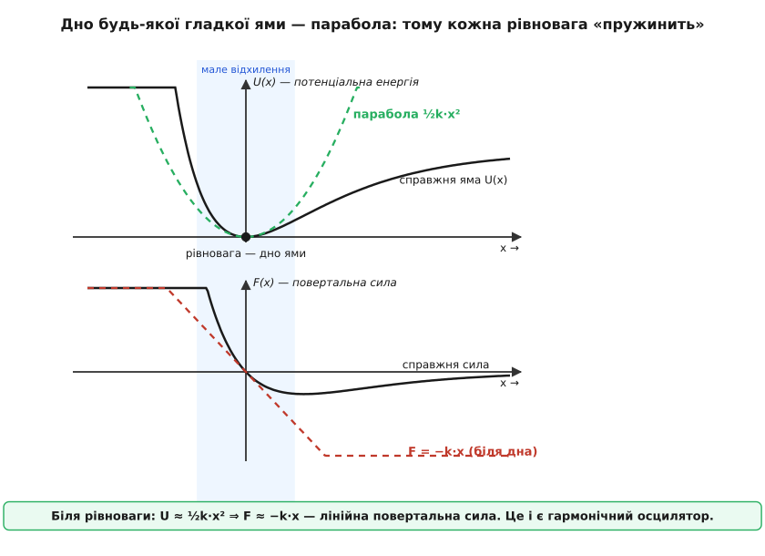
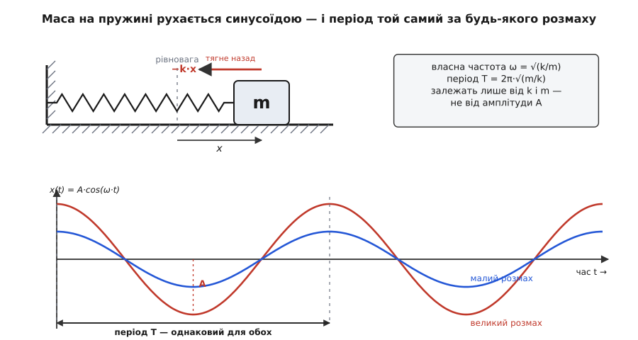
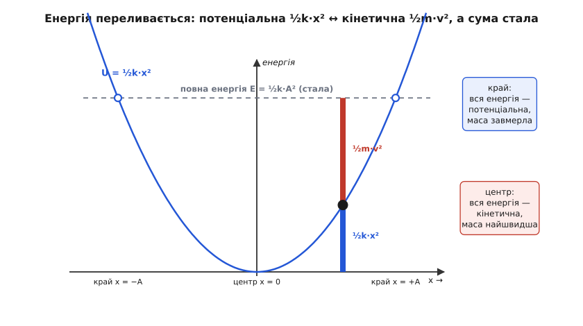

# Гармонічний осцилятор

<preknowlist>
- [Закон Гука](topic:physics/hookes-law) — повертальна сила пружини пропорційна відхиленню, F = −k·x.
- [Другий закон Ньютона](topic:physics/newtons-second-law) — сила задає прискорення, F = m·a.
- [Похідна](topic:math/derivative) — швидкість і прискорення як швидкість зміни величини в часі.
- [Синусоїда](topic:physics/sine-wave) — форма плавного періодичного коливання, її амплітуда й частота.
- [Потенціальна енергія](topic:physics/potential-energy) — запас енергії за положенням; рівновага як «дно ями».
</preknowlist>

Штовхніть кульку, що лежить на дні миски, — вона не просто скотиться назад до дна, а перескочить його, вибіжить на протилежний бік, повернеться й знову перескочить. Відхиліть маятник і відпустіть — він гойдається туди-сюди. Смикніть струну, вдарте по камертоні, натисніть і відпустіть вантаж на пружині — щоразу те саме: тіло, виведене зі спокою, не повертається до нього тихо, а починає **гойдатися** навколо нього. Ба більше, гойдається на диво **однаково** — плавним, рівним ритмом, байдуже, пружина то, маятник, струна чи навіть атом у кристалі. Чому та сама поведінка повторюється всюди? Відповідь ховається в одному простому механізмі, а система, що йому підкоряється, зветься **гармонічним осцилятором** (лат. *oscillare* — гойдатися; *гармонічний* — гр. *harmonía*, суголосся, бо рух виходить чистий, як одна музична нота).

### Повертальна сила й проскок

Почнімо з того, що спільне всім прикладам. Кулька на дні миски, вантаж на нерозтягнутій пружині, маятник унизу — усі вони в **рівновазі**: полишені самі, лишаються на місці. Виведіть будь-який з рівноваги — і з'явиться сила, що тягне його **назад**: розтягнута пружина тягне вантаж до себе, стиснута — відштовхує, відхилений маятник тягне донизу вага. Це **повертальна сила**, завжди напрямлена до рівноваги, ніби система не терпить, коли її звідти зрушують.

Але сама лише повертальна сила пояснила б хіба тихе повернення, а не гойдання. Гойдання виникає тому, що тіло, розігнане цією силою до рівноваги, **набирає швидкості** й через інерцію проскакує точку спокою наскрізь. Тепер воно по інший бік — і повертальна сила тягне назад уже звідти. Так інерція й повертальна сила по черзі перекидають тіло з боку в бік: розгін до центру, проскок, гальмування, знову розгін. Оце безупинне перекидання і є коливання.

### Чому осцилятори такі схожі

Тепер найважливіше. Придивімося до повертальної сили зблизька. Найпростіший її вид дає пружина: сила рівно **пропорційна** відхиленню — удвічі далі відтягнув, удвічі сильніше тягне назад. Це [закон Гука](topic:physics/hookes-law), F = −k·x, де x — відхилення від рівноваги, k — жорсткість пружини, а знак «мінус» каже, що сила дивиться проти відхилення. І виявляється, що це не окрема примха пружини, а **майже загальне правило біля будь-якої рівноваги**.

Ось звідки воно береться. Стан рівноваги — це дно «ями» [потенціальної енергії](topic:physics/potential-energy): щоб зрушити тіло з рівноваги, треба виконати роботу, тобто підняти його по стінці ями. А тепер погляньте на дно **будь-якої** гладкої ями зблизька — воно завжди має ту саму форму: **параболу**. Круту чи пологу, симетричну чи ні — біля самого дна всякий гладкий мінімум виглядає параболою ½k·x². А параболічна яма означає рівно лінійну повертальну силу F = −k·x, бо сила — це крутість схилу ями, а в параболи крутість наростає прямо пропорційно відходу від дна. Тому **для малих відхилень майже все на світі коливається за законом Гука** — не тому, що всюди пружини, а тому, що дно всякої ями параболічне. У цьому й таємниця універсальності: гармонічний осцилятор — це перше наближення до будь-якої рівноваги. Строге обґрунтування, чому дно ями неминуче параболічне й що таке k у формулі, — у [математичній вставці про малі коливання](topic:physics/harmonic-oscillator/math-small-oscillations.md).


*Угорі — потенціальна яма U(x): справжня крива й припасована до дна парабола ½k·x² зливаються біля мінімуму. Унизу — повертальна сила: справжня крива та лінійна F = −k·x збігаються для малих відхилень. Тому дно будь-якої гладкої ями — параболічне, а сила біля нього — лінійна.*

### Від сили до руху: чому саме синусоїда

Маючи силу, знайдемо рух. Підставмо F = −k·x у [другий закон Ньютона](topic:physics/newtons-second-law) F = m·a:

```
m·a = −k·x
```

Прискорення a — це друга похідна координати за часом, тобто наскільки швидко міняється швидкість. Поділивши на m, дістаємо визначальну властивість осцилятора одним рядком:

```
a = −(k/m)·x
```

Прочитаймо її словами: **прискорення пропорційне відхиленню й напрямлене протилежно**. Що далі тіло від рівноваги, то дужче його жене назад; у самій рівновазі (x = 0) розгону нема зовсім. Лишилося знайти таку функцію часу x(t), чия друга похідна — це вона сама, узята зі знаком мінус. Є рівно одна знайома функція з такою поведінкою: **косинус** (і його близнюк синус). Продиференціюйте косинус двічі — і він повернеться сам собою, лише від'ємним. Отже, рух осцилятора — чиста [синусоїда](topic:physics/sine-wave):

```
x(t) = A·cos(ω·t + φ)
```

де A — амплітуда (найбільше відхилення), φ — початкова фаза (звідки стартували в момент t = 0), а ω задає темп гойдання. Підставивши цю x(t) назад у рівняння, знаходимо, чому дорівнює ω:

```
ω = √(k/m)
```

Це **власна частота** осцилятора (кутова, у радіанах за секунду).

### Ізохронність: той самий ритм за будь-якого розмаху

І ось найголовніший урок цієї формули: ω залежить **тільки** від жорсткості k і маси m — і **зовсім не залежить від амплітуди** A. Розгойдайте осцилятор широко чи ледь зруште — він гойдатиметься з **тим самим періодом**. Велика дуга просто проходиться швидше, мала — повільніше, і рівно так, щоб час одного повного циклу лишився незмінним. Цю властивість — сталість періоду попри зміну розмаху — називають **ізохронністю** (гр. *ísos* — рівний, *chrónos* — час). Період і частоту зв'язує звичне співвідношення:

```
T = 2π/ω = 2π·√(m/k)
```

тож важча маса чи м'якша пружина дають повільніше гойдання.


*Маса на пружині, відхилена від рівноваги, зазнає повертальної сили −k·x. Її рух у часі — косинусоїда x(t) = A·cos(ω·t). Дві криві — великий і малий розмах: піки настають одночасно, період T однаковий. Саме ця незалежність періоду від амплітуди зробила осцилятор годинником.*

**Приклад (вантаж на пружині).** Маса m = 0.2 кг на пружині жорсткістю k = 50 Н/м. З якою частотою вона коливатиметься?

```
ω = √(k/m) = √(50/0.2) = √250    ≈ 15.8 рад/с   ← кутова частота
f = ω/(2·π) = 15.8/6.283          ≈ 2.5 Гц       ← 2.5 гойдання за секунду
T = 1/f = 1/2.5                    = 0.40 с       ← один повний цикл
```

Відхилите ви вантаж на сантиметр чи на п'ять — ці числа не зміняться: період завжди 0.40 с, бо в ω = √(k/m) амплітуди немає.

> 🔧 **Навіщо це.** Власна частота ω = √(k/m) — перше число, яке рахують для будь-чого, що здатне дрижати: прольоту моста, плеча дрона, кварцового кристала, чутливого елемента давача. Оскільки ізохронність робить ω сталим «підписом» системи, на цьому тримається одразу три речі. Годинники: маятник чи кварцовий балансир відмірюють рівні проміжки часу, бо їхній період не пливе від того, наскільки згас розмах. Вимірювання «на слух»: тріснута деталь дзвенить на іншій частоті, ніж ціла, а мікроваги важать домішку за зсувом власного тону. І, навпаки, безпека: зовнішні поштовхи тримають подалі від ω, інакше система входить у [резонанс](topic:physics/resonance) і може розхитати себе до руйнування.

### Енергія переливається

На гойдання корисно глянути й з боку **енергії**. У крайніх точках (x = ±A) тіло на мить завмирає — уся енергія схована в пружині як потенціальна, ½k·A². Пролітаючи рівновагу (x = 0), воно найшвидше — уся енергія тепер [кінетична](topic:physics/kinetic-energy), ½m·v². Між цими крайнощами енергія **переливається** з потенціальної в кінетичну й назад, а її сума лишається сталою (тертям ми знехтували). Гармонічний осцилятор — це, по суті, безупинне переливання одного й того самого запасу енергії між двома посудинами: пружиною й рухом.


*Потенціальна енергія ½k·x² росте параболою від дна. Повна енергія E = ½k·A² стала (пунктир). У будь-якій точці різниця між ними — кінетична енергія: на краях (x = ±A) вона нульова й маса завмирає, у центрі — найбільша й маса летить найшвидше.*

### Те саме всюди

Тепер видно, чому маса на пружині, маятник, коливальний контур і атом у кристалі — «одне й те саме». В усіх є **інерція** (щось, що проскакує рівновагу) і **повертальна сила**, лінійна біля рівноваги, — а більше для гармонічного гойдання нічого й не треба. Маятник на малих кутах гойдається з ω = √(g/L); електричний [коливальний контур](topic:physics/lc-circuit) «гойдає» заряд між ємністю й котушкою з ω = √(1/(L·C)); атом у ґратці дрижить біля свого місця. Скрізь та сама формула ω = √(жорсткість/інерція) і та сама синусоїда. Гармонічний осцилятор — не одна система, а **спільний кістяк** їх усіх; від відкриття ізохронності, яке народило перші точні годинники, і тягнеться [історія цього поняття](topic:physics/harmonic-oscillator/hist-oscillator.md).

Реальність, звісно, багатша за ідеал. Додайте втрати — тертя, опір — і розмах почне спадати: осцилятор стає [загасним](topic:physics/damped-oscillator). Почніть підштовхувати його зовнішньою силою в такт власній частоті — і амплітуда злетить угору: це [резонанс](topic:physics/resonance). Але і загасання, і резонанс — надбудови над тим самим кістяком: маса, повертальна сила, власна частота ω = √(k/m). Спершу — гармонічний осцилятор; усе інше нарощується на нього.
