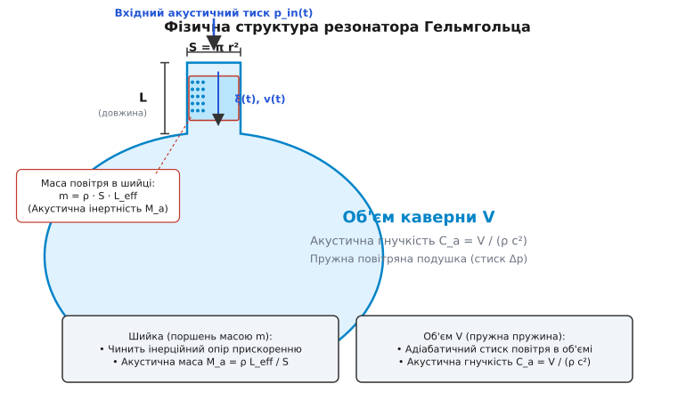
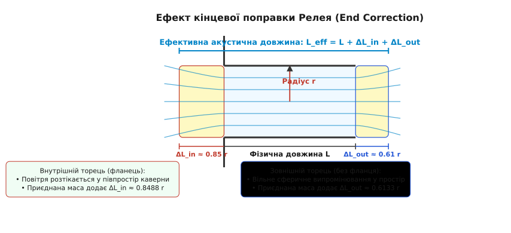
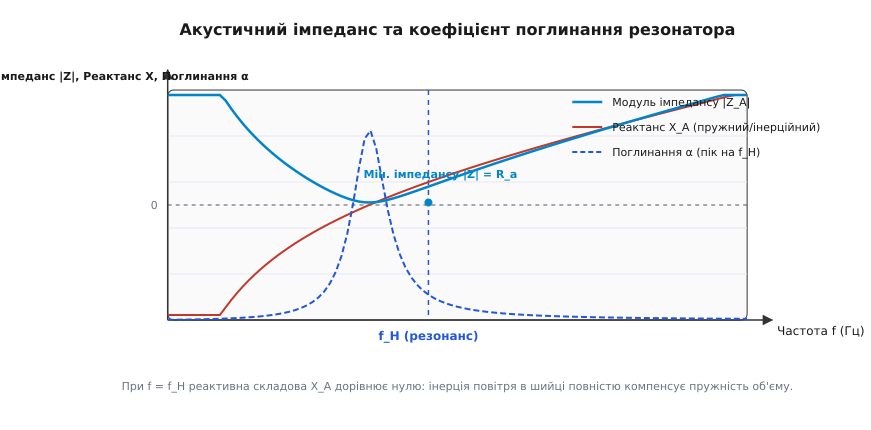
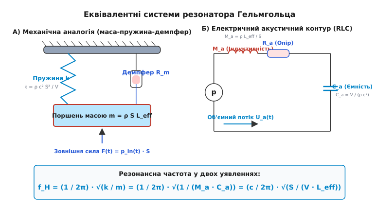

# Резонатор Гельмгольца: акустичний осцилятор із зосередженими параметрами

<preknowlist>
- [Гармонічний осцилятор](book:physics/oscillations-waves/harmonic-oscillator) — механічна система, у якій сила повернення пропорційна зміщенню від стану рівноваги.
- [Акустичний імпеданс](book:physics/oscillations-waves/acoustic-impedance) — комплексне відношення акустичного тиску до об'ємної швидкості звукового потоку.
- [Резонанс](book:physics/oscillations-waves/resonance) — явище різкого зростання амплітуди коливань при збігу частоти зовнішнього збудження з власною частотою системи.
- [Згасаючий осцилятор](book:physics/oscillations-waves/damped-oscillator) — осцилятор із розсіюванням енергії через тертя, в'язкість або випромінювання.
- [Хвильове рівняння](book:physics/oscillations-waves/wave-equation) — рівняння в частинних похідних, що описує поширення акустичних хвиль у середовищі.
</preknowlist>

Якщо дмухнути уздовж зрізу горлечка порожньої скляної пляшки з-під газованої води об'ємом один літр, посудина видасть низький, чисто тональний гул на частоті близько `110` Гц. Якщо ж узяти відкриту з обох кінців органну трубу тієї самої довжини, що й шийка пляшки (близько `5` см), її найнижча резонансна частота становитиме понад `3400` Гц. Для того щоб отримати частоту `110` Гц за допомогою звичайної відкритої труби, її фізична довжина мала б сягати понад `1.5` метра. Чому ж компактна судина з вузькою шийкою та замкненим об'ємом резонує на акустичних частотах, довжина хвилі яких (`λ ≈ 3.1` м) у десятки разів перевищує її власні фізичні габарити?

Відповідь на це питання полягає в особливому фізичному механізмі — акустичному резонансі системи із **зосередженими параметрами** (*lumped element parameter system*), відомої як **резонатор Гельмгольца** (*Helmholtz resonator*). На відміну від довгих труб або струн, де хвиля поширюється у просторі й утворює стоячі хвилі вздовж усієї довжини, у резонаторі Гельмгольца відбувається чіткий розподіл фізичних ролей: маса повітря, зосереджена у вузькій шийці, працює як важкий інертний поршень, а пружне повітря у великому об'ємі каверни поводиться як невагома стиснута пружина.

### 1. Чому пляшка гуде: фізична інтуїція акустичного осцилятора

Щоб збудувати наочне розуміння механізму коливань, простежимо за послідовністю подій при створенні звуку над відкритим горлечком судини.

Коли потік повітря пролітає над відкритим отвором шийки, частина газу внаслідок ефекту Бернуллі підхоплюється й вдмухується всередину отвору. Це невелике додаткове повітря входить у шийку й зміщує повітряний прошарок всередині каналу вбік каверни. Повітряний стовпчик у шийці має цілком відчутну масу `m = ρ · S · L` (де `ρ` — густина повітря, `S` — площа перерізу шийки, а `L` — її довжина). Рухаючись углиб, цей повітряний поршень втискує додатковий об'єм газу у замкнену каверну.

Оскільки стінки каверни жорсткі й непорушні, втискування газу спричиняє адіабатичний стиск повітря всередині судини. Тиск у каверні підвищується на величину `Δp`. Це підвищення тиску діє на внутрішній торець повітряного поршня в шийці як стиснута механічна пружина, намагаючись виштовхнути його назад назовні.

```
[Потік повітря над шийкою]  →  [Вдмухування газу в шийку]  →  [Зміщення поршня масою m углиб]
                                                                        │
[Повернення поршня назад]  ←  [Виштовхувальна сила Δp·S]  ←  [Підвищення тиску Δp в об'ємі V]
```

Опинившись під дією сили надлишкового тиску `F = Δp · S`, повітряний поршень у шийці починає прискорюватися назовні. Провівши поршень через початкове положення рівноваги, інерція маси `m` не дозволяє йому зупинитися миттєво. Поршень вискочує далі назовні, висмоктуючи частину газу з каверни. Це створює в каверні розрідження (зниження тиску нижче рівноважного `p₀`), яке зупиняє поршень і знову втягує його всередину.

Фазові співвідношення між тиском і швидкістю у резонаторі Гельмгольца суттєво відрізняються від біжучої хвилі:
* У **біжучій плоскій хвилі** надлишковий акустичний тиск `p(t)` та коливальна швидкість частинок `v(t)` перебувають у точній **синфазності** (зсув фази `0°`). Де тиск максимальний, там і швидкість частинок максимальна.
* У **резонаторі Гельмгольца** коливальна швидкість повітря у шийці `v(t)` та надлишковий тиск у каверні `Δp(t)` зсунуті за фазою на `90°` (квадратура). Коли тиск у каверні сягає свого максимуму (найбільший стиск), швидкість поршня в цей момент перетворюється на нуль. І навпаки, коли поршень пролітає стан рівноваги з максимальною швидкістю, тиск всередині каверни дорівнює атмосферному.

Таким чином виникає стійкий процес гармонічних коливань: маса повітря в шийці безперервно коливається туди-сюди, а повітряний об'єм у каверні почергово стискається та розширюється. Детальний огляд історичного шляху від античних акустичних глечиків у театрах до латунних сфер Гельмгольца викладено у вставці [Історія винайдення та застосування резонатора](book:physics/oscillations-waves/helmholtz-resonator/hist-helmholtz-resonator.md).

Ключова відмінність резонатора Гельмгольца від хвильових резонаторів (таких як органна труба або струна) полягає у відсутності хвильового розподілу тиску всередині каверни:
* У **хвильовому резонаторі** довжина пристрою `L` порівнянна з довжиною хвилі `λ` (`L ≈ λ / 2` або `λ / 4`). Тиск і швидкість частинок міняються від точки до точки за синусоїдальним законом, утворюючи вузли та пучності.
* У **резонаторі Гельмгольца** об'єм каверни `V` компактний, а довжина хвилі `λ` значно більша за розміри посудини (`λ ≫ V^(1/3)`). Тиск усередині усієї каверни в будь-який момент часу є **просторово однорідним** — уся повітряна подушка стискається і розширюється синхронно.


*Схема резонатора Гельмгольца: маса повітря m в шийці довжиною L та площею S поводиться як інерційний поршень, а повітря в об'ємі V виконує роль пружної подушки з акустичною гнучкістю C_a.*

### 2. Математичний механізм: звідки береться власна частота

Виведемо математичний вираз для власної резонансної частоти системи, спираючись на аналогію зі звичайним механічним осцилятором «маса на пружині».

Розглянемо мале зміщення повітряного поршня в шийці на відстань `ξ(t)` у напрямку каверни. При цьому об'єм газу всередині каверни зменшується на величину:

```
ΔV = −S · ξ
```

За законами термодинаміки адіабатичний стиск ідеального газу описується рівнянням Пуассона `p · V^γ = const`, де `γ` — показник адіабати (`γ ≈ 1.40` для двохатомних газів, таких як азот і кисень). Диференціюючи це співвідношення, знаходимо зв'язок між відносною зміною об'єму та зміною тиску `Δp`:

```
Δp = −γ · p₀ · (ΔV / V)
= (γ · p₀ · S / V) · ξ
```

Згадавши, що швидкість звуку в газі визначається співвідношенням `c = √(γ · p₀ / ρ)`, підставимо `γ · p₀ = ρ · c²` у вираз для надлишкового тиску:

```
Δp = (ρ · c² · S / V) · ξ
```

Надлишковий тиск у каверні створює повертальний механічну силу `F`, що діє проти напрямку зміщення `ξ`:

```
F = −Δp · S
= −(ρ · c² · S² / V) · ξ
```

Отриманий вираз має точну форму **закону Гука** `F = −k · ξ`, де коефіцієнт еквівалентної механічної жорсткості повітряної подушки `k` дорівнює:

```
k = ρ · c² · S² / V
```

Застосуємо другий закон Ньютона до руху повітряного поршня масою `m = ρ · S · L_eff` у шийці:

```
m · (d²ξ / dt²) = F
⇒ (ρ · S · L_eff) · (d²ξ / dt²) + (ρ · c² · S² / V) · ξ = 0
```

Розділивши обидві частини рівняння на масу `ρ · S · L_eff`, отримуємо стандартне рівняння незагасаючих гармонічних коливань:

```
d²ξ / dt² + (c² · S / (V · L_eff)) · ξ = 0
```

Квадрат власної колової частоти `ω₀²` дорівнює коефіцієнту при `ξ`:

```
ω₀² = c² · S / (V · L_eff)
⇒ ω₀ = c · √(S / (V · L_eff))
```

Переходячи від колової частоти `ω₀` до звичайної частоти `f_H = ω₀ / (2π)` у Герцах, отримуємо фундаментальну **формулу Гельмгольца**:

```
f_H = (c / 2π) · √(S / (V · L_eff))
```

Аналіз цієї формули розкриває важливі фізичні залежності:
1. **Залежність від площі шийки `S`:** Чим ширша шийка, тим більша повертальна сила діє на одиницю маси, і тим вища резонансна частота (`f_H ∝ √S`).
2. **Залежність від об'єму каверни `V`:** Чим більша каверна, тим м'якшою є повітряна подушка (менша жорсткість `k`), що зумовлює низьку частоту резонансу (`f_H ∝ 1 / √V`).
3. **Залежність від довжини шийки `L_eff`:** Чим довша шийка, тим більша маса поршня `m`, що робить коливання повільнішими (`f_H ∝ 1 / √L_eff`).
4. **Залежність від швидкості звуку `c`:** Резонансна частота прямо пропорційна швидкості звуку в газі (`f_H ∝ c`). Якщо наповнити пляшку гелієм (де `c ≈ 1007` м/с проти `343` м/с у повітрі), частота гудіння зросте майже у три рази.

Окрім зміщення `ξ(t)`, можна записати аналогічне диференціальне рівняння безпосередньо для надлишкового акустичного тиску `p(t)` всередині каверни:

```
d²p / dt² + ω₀² · p = 0
```

Це підтверджує, що тиск у каверні змінюється строго гармонічно з тією ж самою власною частотою `f_H`. Строгий вивід цієї формули з рівнянь Ейлера — Лагранжа та варіаційного принципу розібрано у вставці [Математичний вивід та акустичні втрати](book:physics/oscillations-waves/helmholtz-resonator/math-helmholtz-resonator.md).

### 3. Кінцева поправка Релея (End Correction): чому коливається більше повітря, ніж є в шийці

Якщо підставити у формулу Гельмгольца геометричну довжину шийки `L`, розрахована частота виявиться помітно вищою за реально виміряну на експерименті. Різниця може сягати `15–30%`. Чому виникає ця розбіжність?

Причина полягає в тому, що маса повітря, яка бере участь у коливальному русі, **не обмежується строго внутрішнім об'ємом циліндра шийки**. Коли повітряний поршень вилітає з шийки назовні або входить у каверну, він захоплює за собою сусідні шари спокійного повітря біля відкритих зрізів. Утворюється так звана **приєднана маса** (*associated radiation mass*).

```
┌─────────────────────────────────────────────────────────┐
│              Зовнішній відкритий простір                │
│             (сферичні лінії швидкості)                  │
│                      ( ( ( ( ) ) ) )                    │
│   ═══════════════════════╗   ╔═══════════════════════   │
│                          ║   ║                          │
│     Фізична шийка        ║   ║  Приєднана маса ΔL_out   │
│     довжиною L           ║   ║                          │
│                          ║   ║                          │
│   ═══════════════════════╝   ╚═══════════════════════   │
│                      ( ( ( ( ) ) ) )                    │
│               Внутрішня каверна резонатора              │
│               (приєднана маса ΔL_in)                    │
└─────────────────────────────────────────────────────────┘
```

Лорд Релей у 1877 році довів, що вплив приєднаної маси можна математично врахувати шляхом збільшення фізичної довжини шийки `L` на додаткову **кінцеву поправку** (*end correction*) `ΔL`:

```
L_eff = L + ΔL_in + ΔL_out
```

Величина кінцевої поправки залежить від радіуса шийки `r` та наявності плоского фланця (стінки) на зрізі отвору:

* **Зовнішній торець без фланця (*unflanged end*):** Якщо шийка стирчить у відкритий простір у вигляді тонкостінної трубки, повітря розтікається по сферичному куту `4π` стерадіан. Розрахунок за методом Вінера — Гопфа дає поправку:
  ```
  ΔL_out ≈ 0.6133 · r
  ```
* **Внутрішній торець з фланцем (*flanged end*):** Якщо отвір шийки виходить у плоску стінку каверни, повітря розтікається у півпростір `2π` стерадіан. Інтеграл Релея по круговому поршню дає більшу поправку:
  ```
  ΔL_in = (8 / (3π)) · r ≈ 0.8488 · r
  ```

Для стандартного резонатора з гладкою зовнішньою шийкою та внутрішнім фланцевим переходом у каверну повна ефективна довжина становить:

```
L_eff = L + 0.8488 · r + 0.6133 · r
= L + 1.4621 · r
```


*Розподіл ліній току акустичної швидкості коло відкритих торців шийки. Приєднана маса газу створює ефективне подовження шийки L_eff = L + ΔL_in + ΔL_out.*

Для ще складніших геометрій отвору (наприклад, для прямокутних або щілиноподібних шийок шириною `w` та довжиною `h`) використовують еквівалентний гідравлічний радіус `r_eq = √(S / π)`. Якщо отвір шийки знаходиться близько до кута або стінки каверни, виникає додаткова взаємна індуктивність приєднаних мас, яку описують поправкою Караля (*Karal correction*).

Якщо шийка взагалі відсутня (просто круглий отвір радіусом `r` у тонкій стінці каверни, тобто `L = 0`), резонатор Гельмгольца все одно працює! Його ефективна довжина повністю визначається сумою двох кінцевих поправок:

```
L_eff = ΔL_in + ΔL_out ≈ 1.70 · r          [для тонкого отвору у стінці]
```

Саме тому отвір у гітарі або скрипці резонує на чітко визначеній частоті, хоча дерев'яна стінка не має виступаючої шийки.

### 4. Акустичний імпеданс та втрати енергії: добротність Q

Розглянемо поводження резонатора Гельмгольца при дії зовнішньої акустичної хвилі з частотою `f`. Згідно з концепцією [акустичного імпедансу](book:physics/oscillations-waves/acoustic-impedance), резонатор чинить опір зовнішньому тиску `p_in`.

Введемо **акустичний імпеданс перерізу шийки** `Z_A(ω)`, що дорівнює відношенню тиску `p_in` до об'ємної швидкості потоку `U_A = v · S`:

```
Z_A(ω) = R_A + j · X_A(ω)
```

Дійсна частина `R_A` описує **активний опір втрат** (дисипацію енергії), а уявна частина `X_A(ω)` — **реактивний опір**, що складається з інерційного та пружного внесків:

```
X_A(ω) = ω · M_A − (1 / (ω · C_A))

де акустична маса (інертність шийки):
M_A = ρ · L_eff / S

та акустична гнучкість (ємність каверни):
C_A = V / (ρ · c²)
```

На резонансній частоті `f = f_H` інерційний реактивний опір шийки `ω · M_A` повністю компенсується пружним реактивним опором каверни `1 / (ω · C_A)`. Реактанс перетворюється на нуль (`X_A = 0`), а модуль акустичного імпедансу досягає свого **глобального мінімуму**:

```
|Z_A(f_H)| = R_A          [мінімум імпедансу на резонансі]
```


*Частотна характеристика акустичного імпедансу |Z_A| та коефіцієнта поглинання α. На частоті f_H реактивний опір X_A перетинає нуль, імпеданс мінімальний, а поглинання досягає максимуму.*

Оскільки на резонансній частоті імпеданс резонатора стає мінімальним, він починає інтенсивно смоктати акустичну енергію з навколишнього середовища. Повітря у шийці розганяється до максимальних амплітуд швидкості `v_max`.

Енергія коливань у резонаторі розсіюється через три паралельні фізичні механізми:
1. **Акустичне випромінювання (`R_rad`):** Коливальний рух повітря в шийці створює зовнішню сферичну хвилю, яка випромінює частину енергії назад у простір. Опір випромінювання пропорційний квадрату частоти: `R_rad = (ρ · ω²) / (2π · c)`.
2. **В'язке тертя у межовому шарі (`R_visc`):** На внутрішніх стінках шийки внаслідок в'язкості повітря `μ` виникає зсувний межовий шар товщиною `δ_v = √(2μ / (ρ ω))`. Тертя шарів газу один об одного перетворює кінетичну енергію на тепло. Опір в'язкості дорівнює: `R_visc = (√(2ρμω) / (π r³)) · L_eff`.
3. **Теплопровідність стінок каверни (`R_therm`):** При адіабатичному стиску газ у центрі каверни нагрівається, а коло холодних стінок віддає тепло. Цей незворотний теплообмін додатково гасить коливання.

Повний активний опір дорівнює сумі трьох компонентів: `R_A = R_rad + R_visc + R_therm`.

У вузьких шийках (`r < 5` мм) домінує в'язкий опір `R_visc`, тоді як у широких коротких отворах основними стають втрати на випромінювання `R_rad`.

Гострота резонансного піку та здатність накопичувати енергію описуються **добротністю** `Q` (згідно з теорією [згасаючих осциляторів](book:physics/oscillations-waves/damped-oscillator)):

```
Q = ω₀ · M_A / R_A
= (1 / R_A) · √(M_A / C_A)
```

Для незаглушеної скляної чи латунної пляшки добротність становить `Q ≈ 30…80`. Це означає, що після припинення зовнішнього збудження пляшка здатна здійснити кілька десятків згасаючих коливань на власній частоті.

### 5. Еквівалентні електромеханічні схеми: резонатор як RLC-контур

В акустичній інженерії для розрахунку складних систем (акустичних колонок, глушників, звукоізоляційних панелей) використовується метод **електромеханічних аналогій**. Резонатор Гельмгольца моделюється як послідовний електричний [LC-контур](book:physics/oscillations-waves/lc-circuit).

| Акустичний елемент | Механічна аналогія | Електрична аналогія | Фізична величина |
| :--- | :--- | :--- | :--- |
| **Акустичний тиск `p(t)`** | Зовнішня сила `F(t)` | Напруга `u(t)` | Паскаль (Па) ↔ Вольт (В) |
| **Об'ємний потік `U_A(t)`** | Швидкість поршня `v(t)` | Електричний струм `i(t)` | м³/с ↔ Ампер (А) |
| **Маса шийки `M_A`** | Маса поршня `m` | Індуктивність `L_e` | кг/м⁴ ↔ Генрі (Гн) |
| **Гнучкість каверни `C_A`** | Обернена жорсткість `1/k` | Ємність `C_e` | м⁵/Н ↔ Фарад (Ф) |
| **Опір втрат `R_A`** | Коефіцієнт демпфування `R_m`| Активний опір `R_e` | Па·с/м³ ↔ Ом (Ом) |


*Еквівалентність три вимірів фізики: А) Механічна система маса-пружина-демпфер; Б) Електричний послідовний RLC-контур.*

Завдяки такій аналогії поводження резонатора Гельмгольца повністю збігається з поводженням послідовного резонансного контуру:
* На **низьких частотах (`f ≪ f_H`)** домінує ємнісний (пружний) опір каверни `1 / (ω · C_A)`. Резонатор поводиться як замкнена акустична ємність.
* На **високих частотах (`f ≫ f_H`)** домінує індуктивний (інерційний) опір шийки `ω · M_A`. Повітря в шийці не встигає розганятися, і резонатор заблокований власною інерцією.
* На **резонансній частоті (`f = f_H`)** реактивні опори взаємно знищуються, струм (об'ємний потік `U_A`) досягає максимуму, а опір падає до мінімального значення `R_A`.

Якщо резонатор Гельмгольца підключити як бічну відгалужену гілку (*side-branch resonator*) до акустичної труби або повітропроводу, він працює як **режекторний акустичний фільтр** (*notch filter*). На частоті `f_H` він «коротко замикає» акустичну лінію на землю, повністю відбиваючи й поглинаючи звукову хвилю цієї частоти й не перешкоджаючи проходженню всіх інших частот.

У матричному формулюванні методом матриць передачі (TMM) бічний резонатор описується матрицею зв'язку `T_res`:

```
┌           ┐   ┌                   ┐ ┌           ┐
│ p_out     │ = │   1         0     │ │ p_in      │
│ U_out     │   │ 1/Z_A(ω)    1     │ │ U_in      │
└           ┘   └                   ┘ └           ┘
```

Це дозволяє легко інтегрувати резонатори Гельмгольца у розрахунки складних багатовузлових розгалужених трубопроводів.

### 6. Акустичні фазоінвертори: розширення басового діапазону гучномовців

Одним із найпоширеніших застосувань резонатора Гельмгольца у споживчій електроніці є **фазоінверторні акустичні системи** (*bass-reflex enclosures*).

При роботі електродинамічного гучномовця (динаміка) його дифузор рухається туди-сюди, створюючи дві акустичні хвилі:
1. **Передня хвиля:** Випромінюється передньою поверхнею дифузора безпосередньо у кімнату.
2. **Задня хвиля:** Випромінюється тильною поверхнею дифузора всередину корпусу колонки з протилежною фазою (зсув фази `180°`).

Якщо залишити динамік без корпусу (у відкритому просторі), на низьких частотах задня хвиля обігне краї дифузора та повністю погасить передню хвилю (явище **акустичного короткого замикання**). Замкнений корпус розв'язує цю проблему, затримуючи задню хвилю всередині, але при цьому пружність стиснутого у корпусі повітря збільшує жорсткість підвісу дифузора, піднімаючи резонансну частоту динаміка й погіршуючи відтворення низьких басів.

```
[Дифузор рухається вглиб]  →  [Стиск повітря V всередині корпусу]
                                            │
[Виліт повітря з порту назовні]  ←  [Прискорення маси повітря в порту L_eff]
   (Зсув фази ще на 180°)
```

Встановлення в корпус акустичного порту (циліндричної трубки з ефективною довжиною `L_eff` та площею `S`) перетворює корпус колонки на резонатор Гельмгольца:
* На частотах, значно вищих за резонанс порту (`f ≫ f_H`), маса повітря в трубі не встигає рухатися внаслідок інерції, і корпус поводиться як звичайний замкнений ящик.
* На частоті резонансу порту `f_H` маса повітря в трубі розганяється до максимальних амплітуд. При цьому фаза руху повітряного поршня в трубі зміщується відносно тиску всередині корпусу на `90°`, а відносно руху дифузора динаміка — на цілих `180°`.
* Внаслідок цього подвійного інвертування фази (`180° + 180° = 360° = 0°`) повітря вилітає з отвору фазоінвертора **синфазно** з переднім рухом дифузора динаміка.

Завдяки цьому акустична система з фазоінвертором ефективно підсилює випромінювання низьких частот на рівні `f_H`, дозволяючи малогабаритним колонками відтворювати глибокий бас без збільшення розмірів корпусу.

### 7. Біоакустика та людський мовний апарат як резонатор

Цікавим фізичним аспектом є те, що біологічні системи створення звуку в живій природі спираються на принципи резонатора Гельмгольца.

Мовний апарат людини складається з джерела первинного звуку (голосових зв'язок у гортані, що переривають потік повітря з легень із частотою основного тону `f₀ ≈ 100…250` Гц) та голосового тракту (ротової, носової та глоткової порожнин).

```
[Голосові зв'язки (джерело f₀)]  →  [Ротова порожнина (V)]  →  [Губи/зуби (шийка S, L)]
                                              ↓
                             [Формантні резонансні піки]
```

Ротова порожнина з відносно звуженим відкриттям губ працює як перестроюваний акустичний резонатор Гельмгольца. Змінюючи положення язика (що змінює об'єм каверни `V`) та форму губ (що змінює площу `S` і довжину `L` шийки), людина змінює резонансну частоту ротового резонатора.

Ці резонансні частоти голосового тракту називаються **формантами** (*formants*):
* Для вимови голосного звуку **«У»** губи витягуються вперед (довга шийка `L`, малий отвір `S`), а язик відсувається назад (великий об'єм `V`). Це створює низьку першу форманту `F₁ ≈ 300` Гц.
* Для вимови голосного звуку **«А»** рот широко відкривається (велика площа `S`), а об'єм ротової порожнини зменшується. Це піднімає першу форманту до `F₁ ≈ 800` Гц.

У тваринному світі (наприклад, у деяких видів жаб, птахів та мавп-ревунів) використовуються спеціальні горлові мішки-резонатори, які є великогабаритними біологічними резонаторами Гельмгольца. Вони дозволяють дрібним істотам видавати надзвичайно низькі й гучні звуки, які поширюються на багато кілометрів.

### 8. Нелінійні ефекти та вихроутворення при високих рівнях звуку

У класичній лінійній теорії Гельмгольца передбачається, що опір тертя `R_A` є константою, яка залежить лише від в'язкості газу `μ` та геометрії. Проте при високих рівнях звукового тиску (`SPL > 130` дБ) у поводженні резонатора виникають виражені **нелінійні ефекти**.

Коли амплітуда коливальної швидкості газу в шийці `v₀` зростає до десятків метрів за секунду, виникає явище **відриву межевого шару та вихроутворення** (*vortex shedding*).

```
   Високоамплітудний потік v₀
═════════════════════════════════╗
                                 ║   ( ( Гідродинамічний ) )
    Шийка резонатора             ║   ( (    вихор        ) )
                                 ║      🌀       🌀
═════════════════════════════════╝
```

Під час фази вискочування повітря з шийки потік газу утворює вузький струмінь (*acoustic jet*). На гострих зрізах шийки виникають кільцеві вихори, які відриваються від стінок і виносять кінетичну енергію у навколишній простір. Під час зворотної фази всмоктування газ втягується рівномірно з усіх напрямків (сферично).

Ця асиметрія між всмоктуванням та виприскуванням створює додатковий **нелінійний опір вихроутворення** `R_nonlin`:

```
R_nonlin = (c_v · ρ / S²) · |U_A|
```

де `c_v ≈ 0.5…1.0` — безрозмірний коефіцієнт втрат на вихроутворення, `|U_A|` — амплітуда об'ємного потоку.

Внаслідок вихроутворення при високих рівнях гучності виникають три важливі інженерні наслідки:
1. **Падіння добротності:** Акустична добротність резонатора `Q` падає з `50…80` до `2…5`, перетворюючи вузькосмуговий резонатор на широкосмуговий поглинач.
2. **Акустичне демпфування ракетних двигунів:** Саме цей нелінійний опір вихроутворення дозволяє резонаторам Гельмгольца ефективно гасити катастрофічні скачки тиску у камерах згоряння ракетних двигунів (наприклад, Saturn V та Falcon 9).
3. **Акустичний вітер (*acoustic streaming*):** Постійний вихровий потік створює постійну складову тиску, яка може викликати циркуляцію газу всередині каверни.

### 9. Чисельний розрахунок та довідник параметрів

Для практичного обчислення акустичних характеристик резонаторів розроблені спеціалізовані математичні алгоритми та структури даних.

З алгоритмами чисельного моделювання, розрахунком спектрів імпедансу та готовими модулями мовами C і C++ можна ознайомитися у вставці [Чисельний розрахунок та симуляція резонатора](book:physics/oscillations-waves/helmholtz-resonator/proj-helmholtz-resonator.md).

Систематизований інженерний довідник параметрів, термодинамічні таблиці залежностей від температури газу та специфікований заголовочний інтерфейс програми C/C++ API наведено у вставці [Довідник параметрів та інтерфейс проектування](book:physics/oscillations-waves/helmholtz-resonator/api-helmholtz-resonator.md).

### 10. Покроковий розрахунок прикладу

Обчислимо власну частоту та добротність реального акустичного резонатора.

**Умова задачі:** Скляна пляшка має сферичний об'єм `V = 0.75` літра (`0.00075` м³), циліндричну шийку довжиною `L = 6.0` см (`0.06` м) та внутрішнім радіусом `r = 1.2` см (`0.012` м). Температура повітря `T = 20` °C (швидкість звуку `c = 343.2` м/с, густина `ρ = 1.204` кг/м³, в'язкість `μ = 1.81 · 10⁻⁵` Па·с). Вважаємо внутрішній торець фланцевим (`ΔL_in = 0.8488 · r`), а зовнішній — вільним (`ΔL_out = 0.6133 · r`).

```
[Крок 1: Площа перерізу шийки S]
S = π · r² = π · (0.012)² ≈ 4.5239 · 10⁻⁴ м²

[Крок 2: Ефективна довжина шийки L_eff]
ΔL = (0.8488 + 0.6133) · 0.012 = 1.4621 · 0.012 ≈ 0.01754 м  (1.75 см)
L_eff = L + ΔL = 0.06 + 0.01754 = 0.07754 м  (7.75 см)

[Крок 3: Акустична маса M_A та гнучкість C_A]
M_A = ρ · L_eff / S = 1.204 · 0.07754 / (4.5239 · 10⁻⁴) ≈ 206.37 кг/м⁴
C_A = V / (ρ · c²) = 0.00075 / (1.204 · 343.2²) ≈ 5.2905 · 10⁻⁹ м⁵/Н

[Крок 4: Резонансна частота f_H]
f_H = 1 / (2π · √(M_A · C_A))
= 1 / (2π · √(206.37 · 5.2905 · 10⁻⁹))
= 1 / (2π · √(1.0918 · 10⁻⁶))
= 1 / (2π · 0.0010449) ≈ 152.3 Гц

[Крок 5: Розрахунок втрат і добротності Q]
ω₀ = 2π · 152.3 ≈ 956.9 рад/с
R_rad = ρ · ω₀² / (2π · c) = 1.204 · 956.9² / (2π · 343.2) ≈ 511.6 Па·с/м³
R_visc = (√(2 · ρ · μ · ω₀) / (π · r³)) · L_eff
       = (√(2 · 1.204 · 1.81·10⁻⁵ · 956.9) / (π · 0.012³)) · 0.07754
       = (0.2041 / (5.4287 · 10⁻⁶)) · 0.07754 ≈ 2915.2 Па·с/м³
R_total = R_rad + R_visc = 511.6 + 2915.2 = 3426.8 Па·s/м³

Q = ω₀ · M_A / R_total = 956.9 · 206.37 / 3426.8 ≈ 57.6
```

Обчислимо також часову константу згасання коливань `τ` та ширину смуги резонансу `Δf`:

```
τ = 2 · Q / ω₀ = 2 · 57.6 / 956.9 ≈ 0.120 с  (120 мс)
Δf = f_H / Q = 152.3 / 57.6 ≈ 2.64 Гц
```

**Висновок:** Дана пляшка резонуватиме на частоті `152.3` Гц (нота Ре великої октави) з високою добротністю `Q ≈ 57.6` та дуже вузькою смугою поглинання `2.64` Гц. Основну частину втрат енергії (`85%`) становить в'язке тертя повітря об стінки шийки, і лише `15%` випромінюється у вигляді звуку назовні.

### 11. Практичне застосування та інженерні пастки

Резонатори Гельмгольца оточують нас у повсякденному житті й використовуються у найскладніших галузях високотехнологічної інженерії.

> 🔧 **Навіщо це.**
> Знання механіки резонатора Гельмгольца дозволяє інженерам вирішувати дві протилежні задачі: **підсилювати низькі частоти** там, де дефіцит габаритів не дозволяє поставити довгі хвилеводи (фазоінвертори акустичних колонок, музичні інструменти), або **придушувати небажаний шум і вібрації** у вузькому частотному діапазоні (глушники авто, звукоізоляційні панелі в аеропортах, гасники нестійкостей у ракетних двигунах).

#### А. Автомобільні глушники та системи випуску
Двигун внутрішнього згоряння випускає вихлопні гази імпульсами, створюючи потужний низькочастотний шум на частоті спалахів циліндрів (наприклад, `100` Гц при `3000` об/хв для 4-циліндрового двигуна). Звичайні пористі глушники погано гасять низькі частоти.

Інженери вбудовують у корпус глушника каверну Гельмгольца, з'єднану з перфорованою вихлопною трубою. На резонансній частоті акустична хвиля вихлопу затягується в резонатор і відбивається у протифазі, гасячи гудіння вихлопу на `15–25` дБ без створення додаткового опору для виходу газів.

#### Б. Акустична коригування приміщень і концертних залів
Для боротьби з низькочастотним «гудінням» кімнат (стоїчими хвилями на частотах `40–150` Гц) застосовують **панельні резонатори Гельмгольца**. Вони являють собою дерев'яні або гіпсокартонні плити з перфорацією (масивом отворів), за якими розташовано повітряний прошарок з мінеральною ватою. Кожен отвір є шийкою, а об'єм позаду нього — каверною. Настроєні на частоти гудіння кімнати, такі панелі поглинають до `95%` енергії небажаного басу.

#### В. Придушення нестійкостей у ракетних двигунах
У камерах згоряння рідинних ракетних двигунів (наприклад, Falcon 9 або Starship) згоряння тисяч літрів палива за секунду викликає термоакустичні автоколивання тиску. Якщо ці коливання увійдуть у резонанс із подачею палива, виникає стрибок тиску амплітудою в сотні атмосфер, що розриває двигун за частки секунди.

Щоб запобігти катастрофі, стінки камери згоряння біля форсуночної головки роблять перфорованими з сотнями мікрокаверн Гельмгольца. Вони працюють як потужні акустичні демпфери, гасячи пульсації тиску на стадії їхнього виникнення.

#### Г. Акустичні метаматеріали та звукові кристали
У XXI столітті масиви мікроскопічних резонаторів Гельмгольца використовують для створення **акустичних метаматеріалів**. На частотах, трохи вищих за резонанс `f_H`, ефективний модуль стиску середовища `K_eff(ω)` стає **негативним**. Це дозволяє створювати надтонкі панелі товщиною в декілька міліметрів, які повністю відбивають низькочастотний шум з довжиною хвилі в кілька метрів, а також будувати акустичні лінзи надроздільності та акустичні «плащі-невидимки».

#### Інженерні пастки та як їх уникати:
1. **Ефект нелінійності при високій гучності (SPL > 130 дБ):** Якщо швидкість повітря у шийці перевищує `10–15` м/с, на крайках отвору виникають турбулентні вихори. Розрахункова добротність `Q` різко падає, а резонансна частота зміщується. У високопотужних фазоінверторах торці трубок завжди роблять **закругленими (раструбом)** для запобігання відриву потоку.
2. **Температурний дрейф частоти:** В автомобільних глушниках або ракетних двигунах температура газів змінюється від `20` °C до `600` °C. Швидкість звуку зростає у понад два рази (`c ∝ √T`), що зміщує резонансну частоту на десятки відсотків. Інженер мусить розраховувати геометрію під реальну робочу температуру газу.
3. **Нехтування стінковим тертям у вузьких отворах:** Спроба зробити резонатор на низьку частоту за рахунок дуже вузької шийки (`r < 1` мм) призводить до того, що в'язкий межовий шар повністю перекриває переріз шийки. Коливання повністю заблокуються тертям, а добротність впаде до нуля (`Q < 1`).
