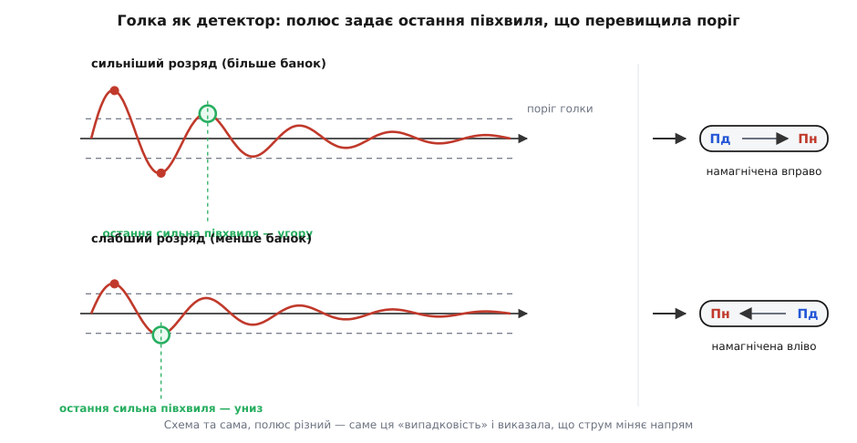
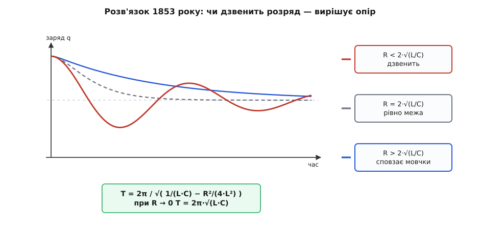

# 📜 Звідки взялася Томсонова формула

Вираз `T = 2π·√(L·C)` записала 1853 року людина, яка ніколи не бачила електричного коливання й не могла побачити: жоден тодішній прилад не розрізняв мільйонних часток секунди. Знімок такого коливання зробили ще через шість років. А почалося все не з теорії, а з прикрості, що років двадцять скидалася на неохайний дослід: сталеві голки виходили з однієї й тієї самої установки намагнічені то одним полюсом, то протилежним.

### Розряд, який мав скінчитися за один раз

Лейденська банка — перший конденсатор, названий за Лейденом, де його докладно дослідили в середині 1740-х, — у XVIII столітті була головною іграшкою й головним інструментом електрики. Картина того, що в ній діється, здавалася очевидною. Електрику вважали плином: на одній обкладці його забагато, на другій замало, і щойно з'єднати їх дротом, надлишок перебігає — з тріском, з іскрою, і на цьому все. Одноразове перетікання, як вода з повного відра в порожнє.

Заперечити було нічим — не тому, що ніхто не сумнівався, а тому, що сумнів нікуди було подіти. Уся подія триває мільйонні частки секунди; найшвидший наявний прилад — людське око, а воно бачить лиш одну спалахнулу іскру. Питання «а скільки разів заряд туди-сюди перебіг усередині цієї іскри» було не хибним, а просто недосяжним: ані годинника такої точності, ані способу розтягти подію в часі.

### Голка, що показала не той полюс

Вихід знайшовся збоку. Коли 1820 року данець Ганс Крістіан Ерстед (Hans Christian Ørsted) показав, що струм повертає компасну стрілку, з'явився і спосіб намагнічувати струмом сталеву голку: намотати на неї дріт і пропустити розряд. Голка ставала єдиним доступним детектором для струму, який не встигаєш побачити.

І детектор цей поводився дивно. Усталений виклад історії LC-кола відносить перше таке спостереження до 1826 року й пов'язує з французьким астрономом і фізиком Феліксом Саварі (Félix Savary, 1797–1841), співпрацівником Ампера. Розряджаючи банку крізь дріт, намотаний на голку, він виявив, що знак намагніченості голки не тримається сталим: він залежав від того, скільки банок розряджають, який дріт, як далеко він від голки. Напрям розряду при цьому не мінявся жодного разу.

Розгадка ховається в тому, що сталева голка — не вимірювач, а пам'ять. Слабке поле не робить із нею нічого: доки поле не перевищило порогу (коерцитивної сили), намагніченість лишається такою, як була. А щойно поріг перейдено, голка перекидається цілком у новий бік і забуває попередній стан. Тому голка зберігає рівно один біт: знак останньої півхвилі, якої вистачило її перемагнітити. Ця межа «нижче порогу — байдуже, вище — цілковитий переворот» — і є [гістерезис із насиченням](topic:physics/saturation-hysteresis): намагніченість відстає від поля й запам'ятовує його історію, а не поточне значення.

Тепер видно, чому полюс «стрибав». Якщо струм справді йде туди-сюди, слабшаючи з кожним разом, то доля голки залежить від того, яка за ліком півхвиля була останньою, що дотяглася до порогу. Додайте банок — розряд сильніший, до порогу дотягуються чотири півхвилі замість трьох, і остання з них уже протилежного знаку. Голка лягає навпаки.


*Схема та сама, знак намагніченості різний: голка запам'ятовує лише останню півхвилю, що перевищила поріг, а її номер міняється разом із силою розряду.*

Варто спинитися на цьому окремо, бо випадок рідкісний. Дослідник не має приладу, здатного побачити процес, — і все одно дістає відповідь, вичитавши її не з окремого досліду, а з **закономірності самої прикрості**. Одна перевернута голка — це похибка. Полюс, який правильно перекидається щоразу, коли додаєш банку, — це вже свідчення.

### Генрі: сказано вголос

Що Саварі радше запідозрив, американець Джозеф Генрі (Joseph Henry, 1797–1878), професор у Принстоні, 1842 року повторив і сказав уголос. Розряд конденсатора за певних умов, писав він, складається з «головного розряду в одному напрямі, а потім кількох зворотних дій туди й назад, кожна слабша за попередню, аж поки настане рівновага» (*a principal discharge in one direction, and then several reflex actions backward and forward, each more feeble than the preceding until equilibrium is attained*).

У цій фразі вже є все, крім чисел: і зміна напряму, і загасання — «кожна слабша за попередню». Іронія в тому, що Генрі тримав у руках і другу половину механізму. Саме він, будуючи електромагніти, натрапив на самоіндукцію — на те, що котушка чинить опір зміні **власного** струму. Без цієї [електромагнітної індукції](topic:physics/electromagnetic-induction), яка обертає зміну струму на зустрічну напругу, жодного коливання не було б: не було б інерції, яка гнала б струм далі, коли банка вже порожня.

Але слова лишалися словами. «Кілька», «слабша за попередню» — за цим не стоїть ні періоду, ні умови, за якої коливання взагалі буває. Перевірити таке твердження неможливо; спростувати теж.

### Аргумент, який робив коливання неминучим

Опір цій картині брався не з упертості. Приймати коливання означало повірити в те, чого ніхто не бачив, на підставі намагніченої залізяки. Вирішальний доказ прийшов не з досліду, а з енергії.

Простежте мить, коли банка розрядилася дощенту. Напруга нуль — але струм у цю мить найбільший, а разом зі струмом існує магнітне поле, і в ньому сидить уся енергія, що була в банці. Енергія не має куди подітися: єдине місце, куди її можна повернути, — та сама банка, тільки тепер зарядом протилежного знаку. Відмовити розрядові в коливанні означає дозволити енергії зникнути в цю саму мить. [Закон збереження енергії](topic:physics/energy-conservation) — те, що енергія не зникає й не з'являється, а лише міняє форму, — забороняє таку розв'язку.

Німецький фізик і фізіолог Герман фон Гельмгольц (Hermann von Helmholtz), один із авторів цього закону («Über die Erhaltung der Kraft», 1847), пристав на тлумачення Генрі. Через багато років, 30 квітня 1869 року, він читав у Гейдельберзі доповідь «Про електричні коливання», де описував загасні коливання в котушці, під'єднаній до лейденської банки.

### 1853: Томсон дає число

Вільям Томсон (William Thomson) народився 26 червня 1824 року в Белфасті, у родині ольстерських шотландців; 1833 року сім'я перебралася до Глазго, де він у двадцять два роки (1846) обійняв кафедру натурфілософії, а титул лорда Кельвіна дістав значно пізніше. 1853 року він надрукував у *Philosophical Magazine* працю «On Transient Electric Currents» — «Про перехідні електричні струми».

Хід, який усе вирішив, полягав у тому, щоб перестати сперечатися, чим розряд «є», і просто записати рівновагу напруг уздовж петлі. Доданків три: напруга банки, спад на опорі дроту й зустрічна напруга самоіндукції цього ж дроту. Разом виходить звичайне лінійне рівняння зі сталими коефіцієнтами — рівно того крою, який математики вміли розв'язувати вже століття, розбираючи вантаж на пружині з тертям:

```
L·(d²q/dt²) + R·(dq/dt) + q/C = 0
```

Відповідь після цього не залежить від нічиєї інтуїції — її вирішує дискримінант квадратного рівняння `L·λ² + R·λ + 1/C = 0`:

```
R² < 4·L/C   →  спад із коливаннями: розряд «дзвенить»
R² = 4·L/C   →  рівно межа
R² > 4·L/C   →  заряд просто сповзає до нуля, жодного коливання
```

А якщо коливання є, його період визначений однозначно:

```
T = 2π / √( 1/(L·C) − R²/(4·L²) )
```

Коли опір малий, другий доданок під коренем зникає, і лишається те, що ми й називаємо Томсоновою формулою:

```
T = 2π·√(L·C)
```


*Томсон показав не лише період, а й межу: за R ≥ 2·√(L/C) коливання немає взагалі — саме це й робило передбачення перевірним.*

Позначень L і C у нинішньому сенсі тоді ще не існувало: Томсон писав про ємність банки й про величину, що описує електродинамічну інерцію дроту; звичні літери й усталені назви прийшли пізніше. Зміст, однак, був саме цей.

І ось що це дало такого, чого не дали ні Саварі, ні Генрі: твердження стало **спростовним**. Не «іноді розряд коливається», а «з цією банкою й цим дротом період дорівнює стільком-то мільйонним часткам секунди, а якщо взяти тонкий дріт із великим опором, коливання не буде взагалі». Таке можна виміряти — і на такому можна впійматися на помилці. Це і є різниця між тлумаченням і теорією.

Мимохідь Томсонова умова дала відповідь на питання, яке досі мучить кожного, хто збирає контур: опір не просто з'їдає розмах, а за `R ≥ 2·√(L/C)` вбиває коливання назовсім — коло стає [загасним осцилятором](topic:physics/damped-oscillator) у тій його частині, де гойдання вже не лишилося.

### 1859: іскру нарешті побачили

Шість років передбачення трималося без прямого підтвердження, бо не було чим дивитися. Період звичайного кола з банкою — мікросекунди; ні затвор, ні око туди не дістають.

Розв'язок знайшов німецький фізик Беренд Вільгельм Федерсен (Berend Wilhelm Feddersen, 1832, Шлезвіг — 1918, Ляйпциг), який від 1858 року працював у Ляйпцигу приватним ученим; його дисертація 1850-х так і називалася — «Beiträge zur Kenntniss des elektrischen Funkens», «Внески до пізнання електричної іскри».

Думка Федерсена вивертала задачу навиворіт. Не намагатися спинити час, а **розмазати** його. Хай зображення іскри падає на пластинку не крізь нерухоме дзеркало, а крізь швидко обертове: поки триває розряд, дзеркало встигає трохи повернутися й протягти зображення вздовж пластинки. Час стає координатою на знімку. Якби розряд справді був одноразовим перетіканням, на пластинці лишилася б одна розмазана смуга. Лишався натомість рядок окремих спалахів, кожен слабший за попередній.

1859 року Федерсен показав саме це: іскровий розряд складається з загасних коливань. Не «мусить складатися», а «ось воно на пластинці». Свої прилади він згодом віддав Німецькому музею в Мюнхені, де вони й досі стоять у фізичній експозиції під назвою «Електромагнітні коливання».

Наскільки тонка це була робота, видно з простої прикидки.

**Скільки місця лишає на пластинці розряд тривалістю близько двох мікросекунд**

```
банка C = 20 нФ, петля дроту L = 5 мкГн
L·C = 5.0e-6 · 2.0e-8 = 1.0e-13
T   = 2π·√(L·C) = 6.283 · 3.16e-7 ≈ 2.0e-6 с      (≈ 2 мкс, f ≈ 500 кГц)

дзеркало: n = 100 обертів/с, плече до пластинки r = 1 м
відбитий промінь повертається удвічі швидше за дзеркало:
v = 2·(2π·n)·r = 4π·n·r = 4·3.1416·100·1 ≈ 1.26e3 м/с ≈ 1.3 мм/мкс
за час T зображення проїде  1.3 · 2 ≈ 2.5 мм
```

Увесь ланцюжок спалахів вкладається в кілька міліметрів пластинки — тож потрібні були і яскрава іскра, і чутлива емульсія, і оптика без люфтів. Саме тому передбачення й підтвердження розділили шість років, а не шість тижнів.

Міряючи період для різних банок і різних дротів, Федерсен міг зіставити його з формулою. Усталений виклад історії LC-кола зараховує ці вимірювання за експериментальне підтвердження Томсонового передбачення; сам по собі знімок доводить лише факт коливань, кількісна ж перевірка спиралася на серії, а не на один кадр.

### Чому іскра, що дзвенить, — уже передавач

Далі історія прискорилася, і саме з цієї точки. Струм, який міняє напрям сотні тисяч разів на секунду, — це не просто цікавинка в банці: він випромінює. Німець Генріх Герц (Heinrich Hertz) 1886–1888 років збудував досліди рівно на цьому: іскровий проміжок у колі з відомим періодом як джерело, а друге коло, налаштоване на той самий період, — як приймач. У його праці 1887 року з'явилася перша електрична резонансна крива: довжина іскри в приймачі як функція частоти. Так коливання, знайдене колись у сліді на голці, обернулося на [електромагнітну хвилю](topic:physics/em-wave), що йде крізь порожню кімнату.

Ще на крок далі — «синтонні банки» англійця Олівера Лоджа (Oliver Lodge) близько 1889 року: два кола з банок, налаштовані на однаковий період, озиваються одне одному й не помічають розладнаних. Це вже прямий предок ручки настройки в приймачі.

І останнє — про ім'я. Формулу звуть Томсоновою не тому, що він відкрив коливання: слід від них побачив Саварі, назвав їх Генрі, сфотографував Федерсен. Вона зветься його ім'ям тому, що він перший сказав, **скільки триває одне гойдання** — і за якої умови воно взагалі буває. У фізиці явище зазвичай дістає ім'я того, хто дав йому число, і це чесно: доки числа немає, немає ні про що сперечатися, ні з чого будувати.
