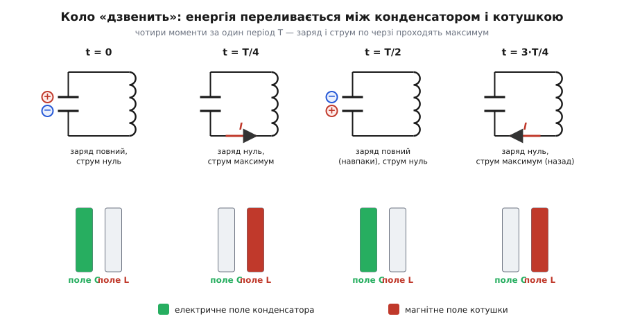
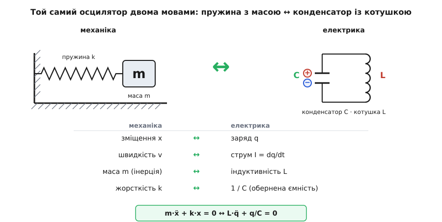

# LC-контур

<preknowlist>
- [Конденсатор](book:electronics/capacitor) — накопичує заряд і енергію в електричному полі між обкладками; його напруга пропорційна заряду, U = q/C.
- [Котушка індуктивності](book:electronics/inductor-coil) — накопичує енергію в магнітному полі струму й опирається будь-якій зміні цього струму.
- [Електромагнітна індукція](book:physics/electromagnetic-induction) — зміна струму в котушці породжує напругу, спрямовану проти цієї зміни; це і є «електрична інерція» котушки.
- [Гармонічний осцилятор](book:physics/harmonic-oscillator) — тіло на пружині, що гойдається біля рівноваги; звідси беруться частота ω, період і синусоїда, до яких усе тут зводиться.
</preknowlist>

Візьміть заряджений конденсатор і замкніть його на котушку — і більше нічого: ні батареї, ні лампочки. Здоровий глузд підказує просту розв'язку: заряд перетече з однієї обкладки на іншу, напруга спаде до нуля, і на цьому все скінчиться. Насправді коло не заспокоюється — воно починає «дзвеніти»: заряд збігає, вертається назад, знову збігає, і так багато разів на секунду. Чому проста петля (контур — від фр. *contour*, обвід, тут замкнена петля кола) із двох деталей поводиться, як маятник?

Розгадка в тому, що кожна з двох деталей уміє запасати енергію — але в різних формах, і жодна не віддає її вмить. Ці двоє й дали контуру назву: C — ємність конденсатора, L — індуктивність котушки.

Заряджений конденсатор тримає енергію в електричному полі між обкладками. Щойно заряд дістає шлях, він рушає — виникає струм. Але струм іде через котушку, а котушка опирається будь-якій раптовій зміні струму: наростання струму наводить у ній зустрічну напругу, спрямовану проти наростання. Тому струм не стрибає одразу до максимуму, а розганяється поступово — котушка поводиться як інерція, як маса, яку не зрушиш умить.

Поки конденсатор розряджається, струм росте, а з ним росте й магнітне поле в котушці — туди перетікає енергія. У мить, коли конденсатор розрядився дощенту (заряд нуль, напруга нуль), струм найбільший: уся енергія тепер у магнітному полі.

Здавалося б, тут струмові й спинитися — гнати його вже нічому. Але інерція котушки не дає струмові обірватися вмить: він тече далі в той самий бік і тепер наганяє заряд на конденсатор — уже з протилежним знаком. Струм слабшає, конденсатор заряджається у зворотну полярність; коли струм нарешті впав до нуля, конденсатор заряджений повністю — дзеркально до початку. Далі все повторюється у зворотному напрямку. Енергія раз по раз переливається: електричне поле конденсатора ⇄ магнітне поле котушки. Оце переливання і є коливання.


*За чверть періоду вся енергія перетікає з електричного поля конденсатора в магнітне поле котушки, за наступну чверть повертається — уже з оберненим знаком заряду.*

Придивімося, що керує цим переливанням. Конденсатор завжди штовхає заряд так, щоб зменшити власну напругу, — це повертальна сила, точнісінько як пружина тягне тіло до рівноваги. Котушка ж не дає струмові мінятися стрибком — це інерція, як маса тіла. Повертальна сила плюс інерція — саме з цієї пари й народжується гармонічне коливання, байдуже, механічне воно чи електричне. Тому LC-контур — це той самий [гармонічний осцилятор](book:physics/harmonic-oscillator), лише гойдається в ньому не тіло на пружині, а заряд між двома формами поля.

Відповідність точна, деталь за деталлю:

```
зміщення x            ↔   заряд q
швидкість v           ↔   струм I = dq/dt
маса m  (інерція)     ↔   індуктивність L
жорсткість k          ↔   1/C  (обернена ємність)
½·m·v²  (кінетична)   ↔   ½·L·I²   (магнітна)
½·k·x²  (потенціальна)↔   q²/(2C)  (електрична)
```


*Конденсатор грає роль пружини (повертає), котушка — роль маси (несе інерцію струму); рівняння руху й синусоїда в обох випадках однакові.*

Ту саму відповідність видно й у рівнянні. Обійшовши петлю, напруга конденсатора q/C і напруга котушки L·(dI/dt) мусять зрівноважитися, а струм зменшує заряд обкладки, тож I = −dq/dt. Разом це дає

```
L·(d²q/dt²) + q/C = 0
```

— те саме рівняння, що й для тіла на пружині m·x″ + k·x = 0, у якому маса стала індуктивністю, а жорсткість — оберненою ємністю. Його розв'язок — синусоїда:

```
q(t) = q₀·cos(ω₀·t)
```

а частота власних коливань виходить із заміни k → 1/C, m → L у знайомій ω₀ = √(k/m):

```
ω₀ = 1 / √(L·C)
```

Період же дає [Томсонова формула](book:physics/lc-circuit/hist-oscillation-discovery.md):

```
T = 2π·√(L·C)
```

Контур дзвенить тим швидше, чим менші L і C: маленька ємність швидко «спорожняється», мала індуктивність слабко «інерційна». [Повне виведення цього рівняння з перевіркою збереження енергії](book:physics/lc-circuit/math-lc-derivation.md) розкладає кожен крок алгебри й геометрії.

**Скільки разів на секунду дзвенить контур із L = 100 мкГн і C = 100 пФ**

```
L·C    = 1.0e-4 Гн · 1.0e-10 Ф = 1.0e-14
√(L·C) = 1.0e-7 с
f      = 1 / (2π·√(L·C)) = 1 / (6.283e-7) ≈ 1.59e6 Гц ≈ 1.59 МГц
```

Це середина діапазону AM-радіо — і це не збіг.

Енергія при всьому цьому не зникає й не з'являється — вона лише міняє форму. Заряд змінюється як cos, а струм — як sin, тож коли одне максимальне, друге якраз нульове: вони зсунуті на чверть періоду. Через це електрична енергія (∝ cos²) і магнітна (∝ sin²) гойдаються у протифазі, а їхня сума лишається сталою:

```
q²/(2C) + L·I²/2 = q₀²/(2C) = const
```


*Верхня пара — заряд і струм; нижня — дві енергії, чия сума (пунктир угорі) не змінюється: те, що втратив конденсатор, точно отримала котушка.* [Це переливання можна простежити й на числовій моделі контуру](book:physics/lc-circuit/proj-lc-simulation.md).

> 🔧 **Навіщо це.** Антена ловить одразу всі радіостанції — сотні частот упереміш. LC-контур відгукується лише на одну, свою власну ω₀, і глушить решту: саме він виокремлює станцію з ефіру. Крутячи ручку налаштування, ви змінюєте ємність змінного конденсатора (рідше — індуктивність), а з нею й ω₀ — і контур «перестрибує» з однієї станції на іншу. На тій самій вибірковості біля [резонансу](book:physics/resonance) стоять фільтри, а також задавачі частоти в генераторах і годинниках.

Ідеальний контур дзвенів би вічно. Та у справжньому дроті є опір: щоцикла він перетворює частину енергії на тепло, тож коливання поволі згасають — виходить [загасний осцилятор](book:physics/damped-oscillator). Наскільки повільно вони згасають — скільки разів контур гойднеться, перш ніж завмерти, — міряють [добротністю](book:physics/q-factor).

Отже, LC-контур — це електричне втілення гармонічного осцилятора: та сама повертальна сила, та сама інерція, та сама синусоїда, тільки грають їх заряд і два поля. І саме звідси починається радіо: якщо змусити такий контур коливатися дуже швидко й «відкрити» його в простір, електричне й магнітне поля, що переливаються одне в одне, відриваються від кола й летять геть — [електромагнітною хвилею](book:physics/em-wave).
