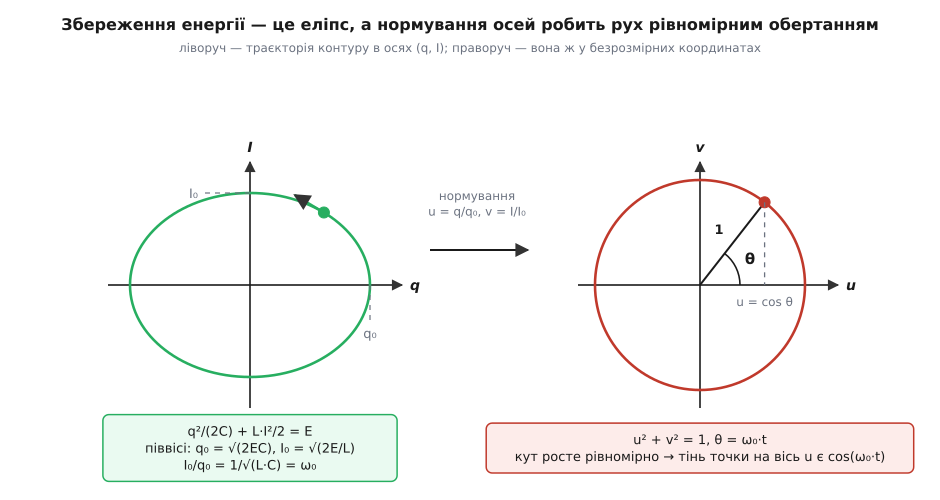
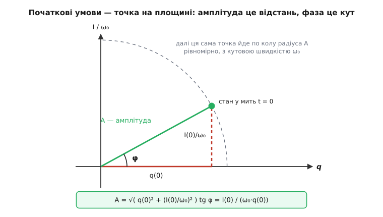

# 🧮 Виведення рівняння LC-контуру: три шляхи до синусоїди й перевірка енергією

Замкнена петля з конденсатора та котушки описується рівнянням `L·q̈ + q/C = 0`, а дзвенить із частотою `ω₀ = 1/√(L·C)` — і подають це зазвичай так гладко, що лишається неприємний осад: звідки взявся мінус, чому корінь і чому розв'язок неодмінно синусоїда, а не якась інша плавна крива. Тут кожен крок розкладено окремо: спершу знаки в петлі, далі три незалежні виведення того самого розв'язку — підстановкою, через збережену енергію та через геометрію на площині станів. Збереження енергії при цьому не прикраса наприкінці: воно доводить, що розв'язок єдиний, і саме, без жодного вгадування, вибирає частоту з-поміж усіх можливих.

## Знаки: єдине місце, де тут легко схибити

Дві букви, q та I, описують той самий процес із двох боків, і рівняння вийде правильним лише тоді, коли ми один раз домовимося, що кожна з них означає, і далі не відступимо.

Нехай q — заряд **верхньої** обкладки конденсатора; нижня несе −q, бо петля замкнена й сумарний заряд у ній не міняється. Додатним напрямком струму I оберемо той, у якому додатний заряд **тікає** з верхньої обкладки: з неї в дріт, крізь котушку, до нижньої. За час dt через переріз проходить заряд I·dt, і рівно стільки ж верхня обкладка втрачає:

```
dq/dt = −I
```

Мінус тут не фізика, а бухгалтерія: він каже тільки те, що ми міряємо струм у бік розряджання.

Далі — два співвідношення, з яких і складається все рівняння. [Конденсатор](book:electronics/capacitor) — це дві обкладки, розділені ізолятором; накопичений на них заряд створює між ними напругу, пропорційну самому зарядові, U = q/C, і ця напруга штовхає заряд назад. [Котушка](book:electronics/inductor-coil) — навпаки, відгукується не на струм, а на його **зміну**: наростання струму наводить у витках зустрічну напругу самоіндукції u = L·(dI/dt), відраховану від того виводу, у який струм заходить, до того, з якого виходить.

Тепер обійдімо петлю. Верхня обкладка має заряд +q, тож її потенціал вищий за потенціал нижньої рівно на q/C. Дротів між конденсатором і котушкою два, і в ідеальному контурі вони нічого не з'їдають — отже, та сама різниця потенціалів прикладена до котушки, причому плюсом до виводу, у який струм заходить. Дві величини описують ту саму пару точок, тож вони рівні:

```
L·(dI/dt) = q/C
```

Лишилося позбутися I. Підставляємо I = −dq/dt і переносимо все ліворуч:

```
L·(d²q/dt²) = −q/C        →        L·q̈ + q/C = 0
```

(дві крапки — друга похідна за часом; далі пишемо так, бо вирази стають довгі).

**Знак можна перевірити, нічого не рахуючи.** Перепишімо рівняння як q̈ = −q/(L·C). Хоч би яким був заряд, його «прискорення» дивиться в протилежний бік: заряд додатний — q̈ від'ємне, заряд від'ємний — q̈ додатне. Це і є повертання до нуля, тобто коливання. Якби ми десь загубили мінус і дістали q̈ = +q/(L·C), розв'язком була б показникова функція q ∝ e^(t/√(L·C)) — заряд у замкненій петлі без жодного джерела ріс би до нескінченності. Неможливість цього — не естетичне міркування, а безкоштовна перевірка знаку.

**А чи не залежить результат від наших домовленостей?** Домовмося навпаки: хай I додатний, коли він **заряджає** верхню обкладку, тобто dq/dt = +I. Тоді струм заходить у котушку з нижнього виводу, і напруга L·(dI/dt) відрахована знизу вгору — а це вже −q/C. Виходить L·(dI/dt) = −q/C, і після підстановки I = +q̇ маємо те саме L·q̈ + q/C = 0. Вибір напрямку міняє знак струму, а не рівняння для заряду.

## Чи може √(L·C) взагалі бути часом

Перш ніж щось розв'язувати, варто спитати, чи має обіцяна відповідь право на існування. Перевірка [розмірностей](book:math/dimensional-analysis) — це порівняння одиниць по обидва боки рівності: якщо в комбінації L·C не вийдуть секунди у квадраті, далі можна не рахувати, десь помилка.

Одиниці беремо з тих самих двох означень, з яких складено рівняння. З U = q/C: фарад — це кулон на вольт, Ф = Кл/В. З u = L·(dI/dt): генрі — це вольт на ампер-за-секунду, Гн = В·с/А. Перемножуємо, пам'ятаючи, що кулон — це ампер-секунда:

```
Гн · Ф = (В·с/А) · (Кл/В) = с·Кл/А = с·(А·с)/А = с²
```

Отже √(L·C) — час, а 1/√(L·C) — обернений час, тобто частота (радіан безрозмірний, тож рад/с і 1/с — те саме). Для L = 100 мкГн і C = 100 пФ це √(1.0e-14 с²) = 1.0e-7 с, десята частка мікросекунди. Самої формули ми ще не вивели, але вже знаємо тверде обмеження: час у відповіді може з'явитися лише через цю комбінацію й ніяк інакше.

## Перший шлях: підставити пробну функцію

Приберімо L з очей: поділимо рівняння на L і назвімо ω₀² = 1/(L·C) — поки що це просто скорочення, без претензій на слово «частота».

```
q̈ + ω₀²·q = 0
```

Яка функція може це задовольнити? Вимога жорсткіша, ніж здається: сума самої функції та її другої похідної мусить давати нуль **у кожну мить**, а не в окремі. Отже, друга похідна зобов'язана бути тією самою функцією, помноженою на сталу, — інакше два доданки не скорочуватимуться весь час. Функція, що відтворює себе при диференціюванні, одна — [показникова](book:math/exponential-ode) e^(λt), у якої перша похідна λ·e^(λt), а друга λ²·e^(λt). Пробуємо саме її, лишивши λ невідомим:

```
λ²·e^(λt) + ω₀²·e^(λt) = 0
```

Множник e^(λt) спільний і ніколи не дорівнює нулю, тож ділимо на нього — і від диференціального рівняння лишається алгебраїчне:

```
λ² + ω₀² = 0        →        λ² = −ω₀²
```

Дійсного кореня немає: квадрат дійсного числа не буває від'ємним. Це не глухий кут, а вказівка, що корінь треба брати серед комплексних, λ = ±i·ω₀. Обидва підходять, а сума двох розв'язків лінійного рівняння знову розв'язок, тож загальний вигляд такий:

```
q(t) = A·e^(i·ω₀·t) + B·e^(−i·ω₀·t)
```

Комплексні експоненти тут — не інша фізика, а зручний запис обертання: за [формулою Ейлера](book:math/euler-formula) e^(iθ) = cos θ + i·sin θ, тобто e^(iθ) — це точка одиничного кола під кутом θ. Заряд — величина дійсна, тож A і B мусять бути комплексно спряженими; тоді уявні частини двох експонент гасять одна одну, а лишається пара звичайних дійсних функцій, cos(ω₀t) і sin(ω₀t):

```
q(t) = C₁·cos(ω₀·t) + C₂·sin(ω₀·t)
```

Сталих рівно дві — і це саме те, що треба: рівняння другого порядку, а щоб визначити рух, слід задати дві речі — скільки заряду й скільки струму було на старті. Візьмімо найпростіший старт: конденсатор заряджений повністю, струму немає, тобто q(0) = q₀ і q̇(0) = −I(0) = 0. Перша умова дає C₁ = q₀, друга — C₂ = 0:

```
q(t) = q₀·cos(ω₀·t)
```

Тепер найважливіше — не повірити, а підставити. [Похідна косинуса](book:math/sine-derivative) — мінус синус, тож:

```
q̇  = −q₀·ω₀·sin(ω₀·t)
q̈  = −q₀·ω₀²·cos(ω₀·t)
q̈ + ω₀²·q = −q₀·ω₀²·cos(ω₀·t) + ω₀²·q₀·cos(ω₀·t) = 0
```

Нуль виходить тотожно, за будь-якого t і будь-якого q₀, — а це і є означення розв'язку. Струм при цьому I = −q̇ = q₀·ω₀·sin(ω₀·t): починає з нуля, доходить до максимуму I₀ = q₀·ω₀ тоді, коли ω₀t = π/2, тобто через чверть періоду після повного заряду. Сам період — це час, за який аргумент косинуса виростає на 2π:

```
ω₀·T = 2π        →        T = 2π/ω₀ = 2π·√(L·C)
```

Підстановка довела, що ця функція задовольняє рівняння. Вона не довела іншого — що з тим самим стартом не буває ще якогось руху; це зробить енергія.

## Енергія як перший інтеграл

З рівняння можна дістати ще дещо, навіть не розв'язуючи його, — величину, яка з часом не міняється. Рецепт короткий: помножити рівняння на q̇. Схоже на трюк, але це не трюк: рівняння L·q̈ + q/C = 0 — рівність напруг, а напруга, помножена на струм, — потужність. Оскільки q̇ = −I, множення на q̇ і є переходом від балансу напруг до балансу потужностей.

```
L·q̈·q̇ + (q/C)·q̇ = 0
```

Обидва доданки — уже готові похідні, треба лише впізнати їх за правилом складеної функції:

```
d/dt (q̇²/2) = q̇·q̈        →        L·q̈·q̇  = d/dt ( L·q̇²/2 )
d/dt (q²/2)  = q·q̇        →        (q/C)·q̇ = d/dt ( q²/(2C) )
```

Отже вся ліва частина — похідна однієї величини, і ця похідна дорівнює нулю:

```
d/dt [ L·q̇²/2 + q²/(2C) ] = 0        →        L·q̇²/2 + q²/(2C) = const
```

Величина в дужках стала на **будь-якому** розв'язку — таке називають першим інтегралом рівняння. І це не абстракція: q̇² = I², тож перший доданок — магнітна енергія котушки L·I²/2, а другий — електрична енергія конденсатора q²/(2C). Множення на q̇ дослівно читається так: потужність (q/C)·I, яку віддає конденсатор, у кожну мить дорівнює потужності L·(dI/dt)·I, яку забирає котушка.

Практична вигода негайна: замість рівняння другого порядку маємо рівняння першого — а таке вже розв'язується прямим інтегруванням.

## Другий шлях: розв'язати сам закон збереження

Сталу знайдемо з тієї миті, коли струму ще нема: тоді вся енергія електрична, E = q₀²/(2C). Для всіх інших моментів:

```
L·q̇²/2 + q²/(2C) = q₀²/(2C)
```

Виражаємо q̇² і виносимо 1/(L·C) = ω₀²:

```
q̇² = (q₀² − q²)/(L·C) = ω₀²·(q₀² − q²)
```

Зверніть увагу, що L і C поодинці зникли — лишилася тільки їхня комбінація ω₀. Поки конденсатор розряджається, заряд спадає, тобто q̇ < 0, і з двох знаків кореня беремо мінус:

```
q̇ = −ω₀·√(q₀² − q²)
```

Тепер це треба зінтегрувати, а для цього — упізнати в лівій частині похідну чогось знайомого. Поділімо обидві частини на √(q₀² − q²): ліворуч лишиться q̇/√(q₀² − q²), праворуч — стала −ω₀. Саме така комбінація стоїть у похідній арккосинуса, бо похідна arccos x дорівнює −1/√(1 − x²); для x = q/q₀ це дає

```
d/dt arccos(q/q₀) = −(1/√(1 − q²/q₀²))·(q̇/q₀) = −q̇/√(q₀² − q²) = ω₀
```

Величина, похідна якої стала й дорівнює ω₀, — це ω₀·t плюс стала. У мить t = 0 маємо q = q₀ і arccos 1 = 0, отже стала нульова:

```
arccos(q/q₀) = ω₀·t        →        q(t) = q₀·cos(ω₀·t)
```

Той самий розв'язок — і цього разу його ніхто не вгадував: косинус видала сама збережена енергія. Чесна засторога: вибраний знак кореня діє, поки заряд спадає, тобто пів періоду, від q₀ до −q₀; далі струм міняє напрямок і корінь береться з плюсом. Косинус зшиває обидві гілки гладко, а що нічого іншого там статися не може, гарантує єдиність розв'язку — і доводить її знову ж таки енергія.

## Частоту вибирає збереження енергії

Досі ω₀ був скороченням для 1/√(L·C), яке ми внесли руками. Тепер зробімо навпаки: припустімо тільки, що коливання синусоїдне з **невідомою** частотою ω, і зажадаймо лише одного — щоб повна енергія не мінялася. Візьмімо q = q₀·cos(ω·t), звідки I = −q̇ = q₀·ω·sin(ω·t), і випишімо обидві енергії:

```
Wₑ = q²/(2C)  = ( q₀²/(2C) )·cos²(ω·t)
Wₘ = L·I²/2   = ( L·q₀²·ω²/2 )·sin²(ω·t)
```

Заміна sin² = 1 − cos² зводить суму до одного змінного доданка:

```
Wₑ + Wₘ = L·q₀²·ω²/2 + [ q₀²/(2C) − L·q₀²·ω²/2 ]·cos²(ω·t)
```

Множник cos²(ω·t) із часом справді змінюється, тож сума лишається сталою тоді й лише тоді, коли квадратна дужка дорівнює нулю:

```
q₀²/(2C) = L·q₀²·ω²/2        →        ω² = 1/(L·C)
```

Ось і вся відповідь, здобута з одного тільки збереження. Читається вона так: у мить повного заряду вся енергія електрична, у мить максимального струму — вся магнітна, і повна передача можлива лише тоді, коли обидві «посудини» однакові за місткістю. Якби контур дзвенів швидше, амплітуда струму ω·q₀ була б завеликою й магнітний пік перевищив би електричний — енергії не було б звідки взятися. Якби повільніше — на піку струму частина енергії мусила б зникнути. Годиться рівно одна частота.

**Куди подівається енергія в контурі L = 100 мкГн, C = 100 пФ, зарядженому до 10 В, через шосту частину періоду**

```
q₀ = C·U₀    = 1.0e-10 Ф · 10 В        = 1.0e-9 Кл = 1 нКл
E  = C·U₀²/2 = 1.0e-10 · 100 / 2       = 5.0e-9 Дж = 5 нДж
ω₀ = 1/√(L·C) = 1/1.0e-7               = 1.0e7 рад/с
I₀ = ω₀·q₀   = 1.0e7 · 1.0e-9          = 1.0e-2 А = 10 мА
T  = 2π/ω₀ = 6.283e-7 с;   t = T/6 = 1.047e-7 с;   ω₀·t = π/3

q  = q₀·cos(π/3) = 1.0e-9 · 0.5        = 5.0e-10 Кл
I  = I₀·sin(π/3) = 1.0e-2 · 0.8660     = 8.660e-3 А
Wₑ = q²/(2C)  = (5.0e-10)² / 2.0e-10   = 1.25e-9 Дж = 1.25 нДж
Wₘ = L·I²/2   = 1.0e-4 · (8.660e-3)²/2 = 3.75e-9 Дж = 3.75 нДж
Wₑ + Wₘ = 5.0e-9 Дж = E                ✔
```

Чверть енергії ще в конденсаторі, три чверті вже в котушці, сума до останньої цифри та сама. І контрольна точка для рівності «посудин»: на піку струму L·I₀²/2 = 1.0e-4 · 1.0e-4 / 2 = 5.0e-9 Дж — рівно вся енергія, як і має бути за щойно виведеною умовою.

## Третій шлях: геометрія площини станів

Замість двох функцій часу подивімося на стан контуру як на **одну точку** з координатами (q, I) — це [фазова площина](book:physics/phase-portrait), де кожній парі «скільки заряду й скільки струму» відповідає одна точка, а рух зображається кривою. Закон збереження одразу каже, де ця точка може бути:

```
q²/(2C) + L·I²/2 = E
```

Поділивши на E, дістаємо канонічний запис [еліпса](book:math/ellipse) з центром у початку координат:

```
q²/a² + I²/b² = 1,     a = √(2·E·C),     b = √(2·E/L)
```

Обидві піввісі мають прямий зміст: a — найбільший заряд (у ту мить струм нульовий), b — найбільший струм (у ту мить заряд нульовий), тобто a = q₀, b = I₀. А їхнє відношення дає вже знайоме число:

```
I₀/q₀ = √(2E/L) / √(2·E·C) = √( 1/(L·C) ) = ω₀
```

Частота, виявляється, захована у **формі** еліпса: витягнутий по горизонталі — повільний контур, витягнутий угору — швидкий.

Тепер поділімо кожну вісь на свою піввісь, u = q/q₀ і v = I/I₀. Еліпс стає одиничним колом u² + v² = 1, і на колі будь-яку точку можна записати як u = cos θ, v = sin θ, де θ — поки невідома функція часу. Підставмо це в обидва рівняння контуру й подивімося, як має рухатися кут:

```
з  dq/dt = −I :    q₀·(−sin θ)·θ̇ = −I₀·sin θ    →    θ̇ = I₀/q₀ = ω₀
з  L·dI/dt = q/C : L·I₀·(cos θ)·θ̇ = q₀·cos θ/C  →    θ̇ = q₀/(L·C·I₀) = 1/(L·C·ω₀) = ω₀
```

Обидва рівняння дають те саме стале θ̇ — суперечності немає, і кут росте рівномірно. Отже в нормованих осях стан контуру просто **обертається по колу зі сталою кутовою швидкістю ω₀**. Синусоїда після цього не припущення, а наслідок: горизонтальна координата рівномірно обертової точки — це косинус, тож q = q₀·cos(ω₀·t). І період стає геометрично очевидним: повний оберт — це 2π кута при швидкості ω₀, тобто T = 2π/ω₀ = 2π·√(L·C).


*Збережена енергія прив'язує стан до еліпса; поділ осей на піввісі перетворює його на коло, де рух — рівномірне обертання, а заряд — просто тінь точки на горизонтальну вісь.*

У цієї картинки є ще один бік, який дає точне число. Якщо на вертикальну вісь відкласти не струм, а p = L·I — величину, що стоїть в осциляторі на місці імпульсу m·v, — еліпс набуває вигляду q²/(2C) + p²/(2L) = E з піввісями √(2EC) і √(2EL), а площа еліпса π·a·b дорівнює

```
π·√(2·E·C)·√(2·E·L) = 2π·E·√(L·C) = 2π·E/ω₀ = E·T
```

Охоплена траєкторією площа — це просто добуток енергії на період. Для нашого прикладу 5 нДж · 0.6283 мкс = 3.14e-15 Дж·с, і хоч би як ми міняли початковий заряд, ця площа зростатиме рівно пропорційно до енергії.

## Чи це єдиний розв'язок

Підстановка дала розв'язок, інтегрування збереженої енергії привело до того самого — але жодне з двох не забороняє існування ще якогось руху з тим самим стартом. Енергія закриває це питання за три рядки.

Нехай q₁ і q₂ обидва задовольняють рівняння й обидва починають з однаковим зарядом і однаковим струмом. Рівняння лінійне, тож їхня різниця d = q₁ − q₂ теж його розв'язок:

```
L·d̈ + d/C = (L·q̈₁ + q₁/C) − (L·q̈₂ + q₂/C) = 0 − 0 = 0
```

Стартує ця різниця з нуля в обох координатах: d(0) = 0 і ḋ(0) = 0. Її «енергія» зберігається тим самим обчисленням, що й для справжнього контуру, а на старті вона нульова:

```
L·ḋ²/2 + d²/(2C) = 0    для всіх t
```

Обидва доданки невід'ємні, а сума їхня нуль — отже, кожен нуль окремо, а значить d(t) ≡ 0 і q₁ = q₂. Це і робить q₀·cos(ω₀·t) **тим самим** розв'язком, а не одним із багатьох можливих. Заразом стає законним зшивання гілок кореня: після півперіоду продовження єдине, і косинус його дає.

## Будь-який старт: амплітуда й фаза

Реальний контур не зобов'язаний починати з повного заряду й нульового струму — у ньому може вже текти струм. Загальний розв'язок зручніше писати не сумою косинуса й синуса, а одним косинусом зі зсувом:

```
q(t) = A·cos(ω₀·t + φ)
I(t) = −q̇ = A·ω₀·sin(ω₀·t + φ)
```

У мить t = 0 це дає два рівняння на дві невідомі:

```
q(0) = A·cos φ
I(0) = A·ω₀·sin φ
```

Друге поділімо на ω₀, обидва піднесімо до квадрата й додаймо — за тотожністю cos² + sin² = 1 кут зникає, і лишається амплітуда; поділивши ж одне на одне, дістаємо фазу:

```
A = √( q(0)² + (I(0)/ω₀)² )
tg φ = I(0) / (ω₀·q(0))          (яка саме чверть — за знаками обох рівностей)
```

Геометрично це просто полярні координати. Візьміть площину, де горизонтально відкладено q, а вертикально I/ω₀; початковий стан — одна точка на ній; A — її відстань від початку, φ — її кут. Далі точка нікуди не дівається з кола радіуса A й обходить його рівномірно.


*Амплітуда — це довжина гіпотенузи за теоремою Піфагора, фаза — кут при основі; обидві визначені початковим станом і далі не змінюються.*

Формулу амплітуди варто перевірити тією ж енергією. Повна енергія на старті складається з двох внесків, а через амплітуду вона мала б дорівнювати A²/(2C):

```
A²/(2C) = [ q(0)² + I(0)²/ω₀² ] / (2C) = q(0)²/(2C) + I(0)²·L·C/(2C)
        = q(0)²/(2C) + L·I(0)²/2 = E                                    ✔
```

Збіг точний, і він показує, що формула амплітуди — це одна коротка фраза, записана буквами: у мить максимального заряду вся енергія вміщається в конденсаторі. Звідси й наслідок — два різні старти з однаковою енергією дають однакову амплітуду й відрізняються лише фазою: на картинці це дві точки на одному колі.

## Побічний виграш: розмах напруги проти розмаху струму

Умова однакової місткості двох «посудин», з якої ми здобули частоту, має ще одне прочитання. Запишімо її через розмахи напруги й струму:

```
C·U₀²/2 = L·I₀²/2        →        U₀/I₀ = √(L/C) ≡ ρ
```

Той самий результат виходить і з амплітуд: U₀ = q₀/C та I₀ = ω₀·q₀ дають U₀/I₀ = 1/(ω₀·C) = √(L·C)/C = √(L/C). Розмірність цієї комбінації варта окремої уваги:

```
√(Гн/Ф) = √( (В·с/А) / (А·с/В) ) = √( В²/А² ) = В/А = Ом
```

Виходять оми — хоча в петлі немає жодного резистора. Це не опір, що гріє, а відношення двох розмахів: скільки вольт коливання «коштує» на кожен ампер. Для наших чисел ρ = √(1.0e-4/1.0e-10) = √(1.0e6) = 1000 Ом, тож заряджений до 10 В контур розгойдується струмом 10 В / 1000 Ом = 10 мА — рівно те I₀, що вийшло з ω₀·q₀.

> 🔧 **Навіщо це.** Дві однакові за частотою петлі можуть дзвеніти зовсім по-різному: √(L·C) в обох те саме, а √(L/C) відрізняється в сотні разів. Контур із малим ρ гойдає великий струм при скромній напрузі, з великим ρ — навпаки, наганяє на конденсаторі сотні вольт при мізерному струмі. Тому те, що вціліє чи згорить на паразитному дзвоні в схемі, вирішує саме ρ, а не частота.

Уся ця алгебра трималася на одному припущенні: з петлі нічого не витікає. У справжньому дроті це не так — опір R додає в рівняння доданок R·q̇, і воно стає L·q̈ + R·q̇ + q/C = 0. Те саме множення на q̇ тепер дає не нуль праворуч, а від'ємну величину:

```
d/dt [ L·q̇²/2 + q²/(2C) ] = −R·q̇² = −R·I²
```

Енергія спадає рівно з тією потужністю, з якою опір гріє дріт, — і замість замкненого еліпса точка йде спіраллю до початку координат. [Алгебра цього випадку](book:physics/damped-oscillator/math-damped-solution.md) починається з тієї самої пробної підстановки, тільки характеристичне рівняння там повне квадратне, і його дискримінант розводить контур на три різні долі.
