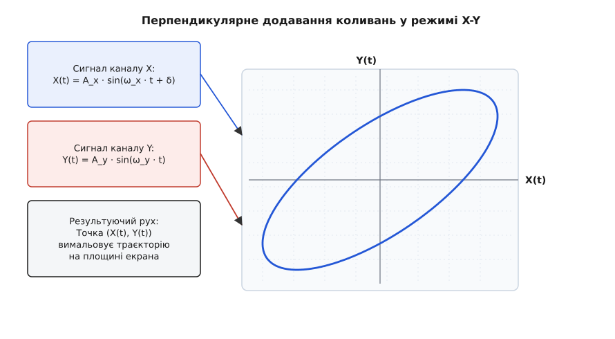
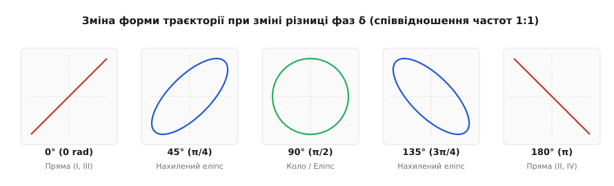
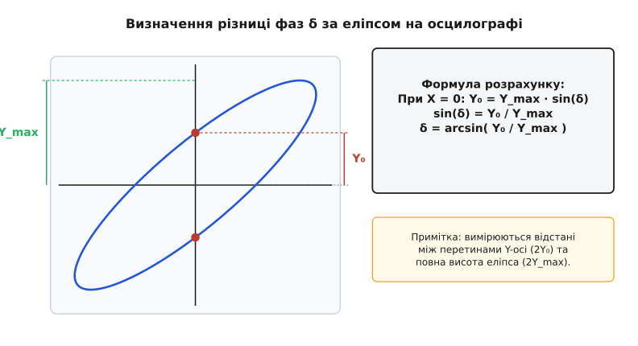
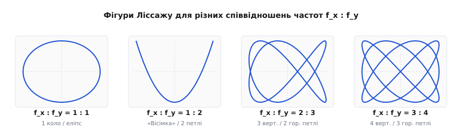
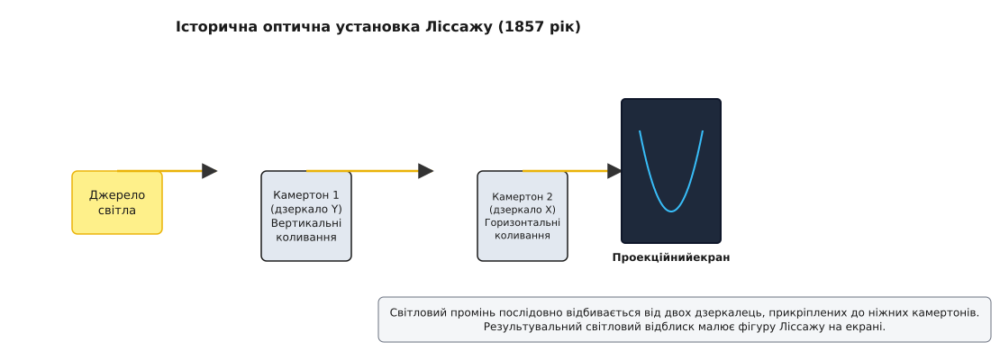

# Фігури Ліссажу: ортогональний синтез коливань, фазові візерунки та вимірювальна геометрія

<preknowlist>
- [Гармонічний осцилятор](topic:physics/harmonic-oscillator)
- [Фаза](topic:physics/phase)
- [Амплітуда й частота](topic:physics/amplitude-frequency)
- [Суперпозиція хвиль](topic:physics/wave-superposition)
</preknowlist>

Коли фізична система піддається одночасному впливу двох взаємно перпендикулярних гармонічних сил, її просторова траєкторія перестає бути одновимірним коливанням уздовж прямої і перетворюється на плоску двовимірну криву. У радіотехніці, оптиці, акустиці та атомній фізиці підключення двох незалежних джерел змінного сигналу до ортогональних каналів відхилення створює замкнені або відкриті замкнені траєкторії, які називаються **фігурами Ліссажу**. За геометричною формою цієї траєкторії — кількістю самоперетинів, кутом нахилу головної осі, відношенням ширини до висоти та напрямком обертання променя — інженер чи фізик може з мікросекундною точністю визначити різницю фаз між сигналами, розрахувати кратність їхніх частот і діагностувати нелінійні спотворення тракту без застосування складних цифрових спектроаналізатора.

---

### 1. Фізична природа перпендикулярної суперпозиції коливальних процесів

У класичній механіці додавання коливань традиційно розглядають у двох принципово різних геометріях: паралельній та перпендикулярній. 

При паралельному додаванні двох гармонік одинакової напрямку результуючий рух відбувається вздовж тієї ж самої осі `X`, утворюючи біття або інтерференційну хвилю. Закони та історичні передумови дослідження ортогонального синтезу коливальних систем детально розібрано в [історичній вставці](hist-lissajous-bowditch.md).

При перпендикулярній суперпозиції перша гармонічна сила зміщує матеріальну точку або електронний промінь уздовж горизонтальної осі `X`, а друга — уздовж вертикальної осі `Y`. Кожне з коливань є абсолютно незалежним у своєму напрямку:

```
x(t) = A_x · sin(ω_x · t + δ)
y(t) = A_y · sin(ω_y · t)
```

де `A_x` та `A_y` — амплітуди зміщення по відповідних осях, `ω_x = 2π · f_x` та `ω_y = 2π · f_y` — циклічні частоти, а `δ` — початкова різниця фаз між каналом `X` та каналом `Y`.


*Принцип формування двовимірної траєкторії Ліссажу при перпендикулярній суперпозиції гармонічних сигналів.*

#### Динаміка двовимірного потенціального поля та механічні аналоги:
З фізичної точки зору матеріальна точка маси `m`, яка рухається під дією двох квазіпружних сил `F_x = −k_x · x` та `F_y = −k_y · y`, перебуває у двовимірній потенціальній ямі з потенціальною енергією:

```
U(x, y) = (1/2) · k_x · x² + (1/2) · k_y · y²
```

Власними частотами коливань уздовж координатних осей є `ω_x = √(k_x / m)` та `ω_y = √(k_y / m)`. Якщо жорсткості `k_x` та `k_y` відрізняються (наприклад, у стержня прямокутного перерізу або в анізотропному кристалі), власний рух тіла відбувається за траєкторією Ліссажу.

Класичним механічним приладом для демонстрування таких траєкторій є **маятник Блекберна** (Blackburn pendulum), у якому підвіс виконано у формі V-подібного підвішеного шнура. Завдяки різним ефективним довжинам підвісу `L_x` та `L_y` період коливань у площині V-подібної вилки відрізняється від періоду коливань у перпендикулярній площині. Тягарець з піском, висипаючись на стіл, малює на поверхні вишукані двовимірні фігури Ліссажу.

Повна механічна енергія системи зберігається і дорівнює сумі енергій двох незалежних осциляторів:

```
E_total = E_x + E_y = (1/2) · m · A_x² · ω_x² + (1/2) · m · A_y² · ω_y²
```

#### Матричне формулювання системи двох осциляторів:
У векторно-матричній формі рівняння руху двовимірного гармонічного осцилятора записуються як:

```
d²R/dt² + Ω² · R = 0
```

де `R = [x, y]^T` — вектор зміщення, а `Ω² = diag(ω_x², ω_y²)` — діагональна матриця квадратів власних частот. Оскільки матриця `Ω²` є діагональною, координати `x` та `y` є нормальними координатами системи, а їхні коливання відбуваються повністю незалежно одне від одного.

#### Фазовий простір та траєкторії в чотиривимірному просторі станів:
Повний фазовий простір двовимірного осцилятора є чотиривимірним і описується вектором станів `(x, v_x, y, v_y)`. Фігури Ліссажу на координатному екрані є плоскими проекціями цього чотиривимірного фазового атрактора на декартову координаційну площину `(x, y)`. Кожна точка траєкторії Ліссажу однозначно відображає поточний стан потенціальної та кінетичної енергій двох незалежних ступенів вільностей осцилятора.

#### Кінематичні вектори швидкості та прискорення:
Диференціюючи координати по часу, отримуємо компоненти вектора швидкості `V(t) = [v_x(t), v_y(t)]^T`:

```
v_x(t) = dx/dt = A_x · ω_x · cos(ω_x · t + δ)
v_y(t) = dy/dt = A_y · ω_y · cos(ω_y · t)
```

Модуль миттєвої швидкості руху точки уздовж траєкторії Ліссажу обчислюється як:

```
|V(t)| = √[ A_x² · ω_x² · cos²(ω_x · t + δ) + A_y² · ω_y² · cos²(ω_y · t) ]
```

У точках повернення (де `x = ±A_x` або `y = ±A_y`) відповідна компонента швидкості перетворюється на нуль, а промінь на екрані сповільнюється, залишаючи більш яскравий слід люмінофора. Цей ефект кінематичного сповільнення променя в крайових точках створює характерне підсилення яскравості по контуру фігури, яке легко спостерігається на аналогових осцилографах. У цифрових осцилографах для відтворення цього ефекту використовують алгоритми цифрового накопичення та підсвічування щільності відліків (Digital Phosphor Technology).

Фізичний механізм формування плоского руху спирається на вилучення спільного параметру часу `t` із системи двох параметричних рівнянь. Залежно від співвідношення частот `ω_x / ω_y` результуюча траєкторія точки `P(x(t), y(t))` утворює або замкнену статичну геометричну криву, або динамічну смугу заповнення, яка рівномірно вкриває прямокутну область розміром `2A_x × 2A_y`.

---

### 2. Геометрія фазового еліпса при однаковій частоті (Співвідношення частот 1:1)

Розглянемо фундаментальний випадок, коли частоти коливань строго рівні між собою: `ω_x = ω_y = ω`. У цьому випадку співвідношення частот становить `1:1`, а система параметричних рівнянь набуває вигляду:

```
x(t) = A_x · sin(ωt + δ)
y(t) = A_y · sin(ωt)
```

Для знаходження неявного аналітичного рівняння траєкторії в декартових координатах `(x, y)` розкладемо вираз для `x(t)` за тригонометричною формулою синуса суми:

```
x / A_x = sin(ωt) · cos(δ) + cos(ωt) · sin(δ)
```

З другого рівняння випливає, що `sin(ωt) = y / A_y`. Тоді за основною тригонометричною тотожністю `cos(ωt) = √(1 − (y / A_y)²)`. Підставляючи ці значення у вираз для `x / A_x`, отримуємо:

```
x / A_x = (y / A_y) · cos(δ) + √[ 1 − (y / A_y)² ] · sin(δ)
```

Перенесемо перший доданок у ліву частину та піднесемо обидві частини рівняння до квадрата для позбавлення від знака квадратного кореня:

```
[ (x / A_x) − (y / A_y) · cos(δ) ]² = [ 1 − (y / A_y)² ] · sin²(δ)
```

Розкриваючи квадрат двочлена у лівій частині та зводячи подібні доданки, одержуємо класичне канонічне квадратичне рівняння фазового еліпса Ліссажу:

```
(x / A_x)² − 2 · (x / A_x) · (y / A_y) · cos(δ) + (y / A_y)² = sin²(δ)
```

Детальний математичний вивід параметрів головних осей, площі еліпса та поліномів Чебишова наведено в [математичній вставці](math-lissajous-geometry.md).


*Еволюція геометрії еліпса Ліссажу при співвідношенні частот 1:1 та послідовній зміні різниці фаз від 0° до 180°.*

#### Фізичний аналіз граничних форм еліпса:
Аналіз отриманого квадратичного рівняння показує, що залежно від величини фазового зсуву `δ` траєкторія приймає наступні граничні геометричні форми:

1. **Синфазність (`δ = 0` або `δ = 2π`):**
   Оскільки `cos(0) = 1` та `sin(0) = 0`, рівняння спрощується до виразу `(x / A_x − y / A_y)² = 0`, що дає рівняння прямої лінії:
   ```
   y = (A_y / A_x) · x
   ```
   Траєкторія є відрізком прямої, розташованим у першому та третьому координатному квадрантах із додатним нахилом.

2. **Квадратура (`δ = π/2 = 90°` або `δ = 3π/2 = 270°`):**
   Оскільки `cos(90°) = 0` та `sin(90°) = 1`, рівняння набуває канонічного вигляду еліпса зі взаємно перпендикулярними осями, орієнтованими уздовж осей координат:
   ```
   (x / A_x)² + (y / A_y)² = 1
   ```
   Якщо амплітуди додатково рівні (`A_x = A_y = A`), еліпс перетворюється на правильне коло радіуса `A`.

3. **Протифаза (`δ = π = 180°`):**
   Оскільки `cos(180°) = −1` та `sin(180°) = 0`, рівняння спрощується до `(x / A_x + y / A_y)² = 0`, що відповідає прямій лінії з від'ємним нахилом:
   ```
   y = −(A_y / A_x) · x
   ```
   Траєкторія є відрізком прямої у другому та четвертому координатному квадрантах.

4. **Проміжні значення фази (`0 < δ < π`):**
   Траєкторія є похилим еліпсом, вписаним у прямокутник розмірами `2A_x × 2A_y`. Кут нахилу головної осі еліпса `θ` до осі `X` розраховується за формулою:
   ```
   tan(2θ) = (2 · A_x · A_y · cos δ) / (A_x² − A_y²)
   ```

#### Напрямок обертання та вектор площинної швидкості:
Важливою фізичною характеристикою руху точки по еліпсу є напрямок її обертання (за годинниковою стрілкою чи проти неї). Для визначення напрямку знайдемо z-компоненту вектора кутового моменту або секторну швидкість:

```
L_z = x · dy/dt − y · dx/dt = A_x · A_y · ω · sin(δ)
```

- Якщо `sin(δ) > 0` (`0 < δ < π`), значення `L_z > 0`, і точка обертається **проти годинникової стрілки**.
- Якщо `sin(δ) < 0` (`π < δ < 2π`), значення `L_z < 0`, і точка обертається **за годинниковою стрілкою**.

Площа `S`, охоплена еліпсом Ліссажу за один повний період коливання, інтегрується за теоремою Гріна і прямо пропорційна синусу різниці фаз:

```
S = π · A_x · A_y · |sin(δ)|
```

При синфазних коливаннях (`δ = 0`) площа дорівнює нулю (еліпс схлопується у лінію), а при фазовому зсуві `90°` площа досягає абсолютного максимуму `S_max = π · A_x · A_y`.

---

### 3. Точний геометричний метод вимірювання зсуву фаз за осцилограмою

На практиці осцилографічний метод Ліссажу є найшвидшим та найпростішим способом вимірювання фазового зсуву `δ`, внесеного двополюсником, фільтром або підсилювачем.

Для вимірювання фази електронний промінь осцилографа відцентровують на сітці екрана. Потім зчитують два геометричних параметри траєкторії, як показано на схемі:


*Схема геометричного обчислення різниці фаз за відношенням вертикального перетину осі Y₀ до пікового значення Y_max.*

#### Алгоритм покрокового вимірювання:
1. Вимірюють повну вертикальну висоту еліпса `2Y_max` (від найнижчої точки кривої до найвищої).
2. Вимірюють довжину вертикального відрізка `2Y_0`, який вирізається еліпсом на центральній осі `Y` (при `x = 0`).
3. Підставляють `x = 0` у початкове параметричне рівняння `x(t) = A_x · sin(ωt + δ) = 0`. Звідси випливає, що момент часу перетину осі відповідає `ωt = −δ`.
4. Підставляючи цей момент часу у рівняння для `y(t)`, отримуємо значення ординати перетину:
   ```
   y(t) = Y_0 = A_y · sin(−δ) = −A_y · sin(δ)
   ```
5. Ураховуючи, що максимальне відхилення по осі `Y` дорівнює амплітуді `Y_max = A_y`, шуканий модуль різниці фаз розраховується за основною формулою:
   ```
   sin(δ) = Y_0 / Y_max   ⇒   δ = arcsin( Y_0 / Y_max )
   ```

Аналогічно, різницю фаз можна виміряти через відрізки на горизонтальній осі `X`:

```
sin(δ) = X_0 / X_max   ⇒   δ = arcsin( X_0 / X_max )
```

де `2X_0` — відстань між точками перетину еліпса з горизонтальною віссю `Y = 0`, а `2X_max` — повна ширина еліпса по осі `X`.

Детальні інженерні протоколи, правила налаштування каналів, вибір вхідного зв'язку AC/DC та оцінку похибки вимірювань наведено у [довідковій вставці](api-oscilloscope-xy.md).

---

### 4. Згасаючі коливання та спіральні траєкторії Ліссажу

У реальних физичних системах завжди присутня дисипація енергії за рахунок в'язкого тертя або омічного опору. При перпендикулярному складанні двох згасаючих гармонічних коливань рівняння руху набувають вигляду:

```
x(t) = A_x · exp(−γ_x · t) · sin(ω_x · t + δ)
y(t) = A_y · exp(−γ_y · t) · sin(ω_y · t)
```

де `γ_x` та `γ_y` — коефіцієнти згасання уздовж осей `X` та `Y`.

#### Фізичні особливості згасаючих траєкторій:
- **Рівні коефіцієнти згасання (`γ_x = γ_y = γ`):** Огинаюча прямокутника обмеження стискається експоненційно з часом, перетворюючи статичну фігуру Ліссажу на сходинкову **спіраль, що скручується до центру `(0, 0)`**. При цьому співвідношення частот `ω_x / ω_y` залишається незмінним, тому кількість петель та вузлів зберігається протягом усього процесу загасання.
- **Різні коефіцієнти згасання (`γ_x ≠ γ_y`):** Форма траєкторії неперервно деформується під час скручування: еліпс поступово сплющується вздовж осі з більшим коефіцієнтом згасання.

---

### 5. Кратні та раціональні співвідношення частот (1:2, 2:3, 3:4)

Якщо частоти двох ортогональних сигналів не рівні між собою, але їхнє відношення є раціональним числом вида `ω_x / ω_y = n_x / n_y` (де `n_x` та `n_y` — взаємно прості цілі числа), матеріальна точка здійснює періодичний рух і за час `T_total = 2π · n_y / ω_x = 2π · n_x / ω_y` повертається у початкову точку. На екрані утворюється стійка замкнена фігура Ліссажу.


*Конфігурація траєкторій Ліссажу при кратних та раціональних співвідношеннях частот.*

#### Метод дотичних для підрахунку співвідношення частот:
Для визначення невідомої частоти `f_x` за відомою частотою `f_y` навколо фігури Ліссажу уявно описують прямокутник, сторони якого паралельні осям координат. Потім підраховують кількість точок дотику кривої до верхньої (або нижньої) горизонтальної межі `N_horiz` та до лівої (або правої) вертикальної межі `N_vert`.

Співвідношення частот виражається зворотною пропорцією кількості точок дотику:

```
f_x / f_y = N_horiz / N_vert
```

наприклад:
- При `f_x / f_y = 1 / 2` (співвідношення 1:2) крива утворює фігуру «вісімки» (лемніскату). Вона має `N_horiz = 1` дотик до горизонтальної межі та `N_vert = 2` дотики до вертикальної межі.
- При `f_x / f_y = 2 / 3` крива торкається горизонтальної межі у 2 точках, а вертикальної — у 3 точках.

#### Кількість самоперетинів та вузлів траєкторії:
Загальна кількість внутрішніх точок самоперетину (вузлів) замкненої фігури Ліссажу для співвідношення `n_x : n_y` при фазі `δ`, яка не робить вершини крайніми кутами, розраховується за формулою:

```
N_nodes = (n_x − 1) · n_y + (n_y − 1) · n_x − N_corner
```

Ці вузлові точки утворюють симетричну просторову ґратку. Зміна фазового зсуву `δ` розгортає вузли, перетворюючи їх на самоперетиналися петлі.

#### Зв'язок із ортогональними поліномами Чебишова:
У випадку, коли різниця фаз дорівнює `δ = 90°`, параметричне рівняння фігури Ліссажу при кратному співвідношенні частот `1 : n` описується формулами:

```
x(t) = sin(t)
y(t) = sin(n·t + π/2) = cos(n·t)
```

Виражаючи `cos(n·t)` через `x = sin(t)`, ми отримуємо класичні **поліноми Чебишова першого роду** `T_n(x)`:

```
y = T_n(x)
```

Наприклад:
- При `n = 1`: `y = T_1(x) = x` (пряма лінія під кутом 45°).
- При `n = 2`: `y = T_2(x) = 2x² − 1` (парабола).
- При `n = 3`: `y = T_3(x) = 4x³ − 3x` (кубічна парабола з трьома екстремумами).

Таким чином, дуги Чебишова на екрані осцилографа є відкритими фігурами Ліссажу для співвідношення частот 1:n при фазовому зсуві 90°.

#### Тривимірні вузли Ліссажу (Lissajous Knots):
Якщо до системи двох ортогональних коливань додати третю вертикальну осі `Z` із власною частотою `ω_z`:

```
x(t) = A_x · sin(n_x · t + δ_x)
y(t) = A_y · sin(n_y · t + δ_y)
z(t) = A_z · sin(n_z · t + δ_z)
```

параметрична траєкторія у тривимірному просторі `(x, y, z)` утворює так званий **вузол Ліссажу**. У топології тривимірні вузли Ліссажу класифікують за числами вращення та досліджують при аналізі траєкторій заряджених частинок у тривимірних електромагнітних пастках.

---

### 6. Нерозмірні співвідношення частот, фазовий дрейф та ергодичність

Якщо співвідношення частот `ω_x / ω_y = α` є **ірраціональним числом** (наприклад, `√2` або `π`), періоди повернення по осях `X` та `Y` є несумірними. Траєкторія точки ніколи не замикається і ніде не перетинає саму себе у тій самій фазі.

#### Ергодична теорема Кронекера-Вейля:
Згідно з теоремою Кронекера-Вейля з теорії динамічних систем, при ірраціональному співвідношенні частот траєкторія Ліссажу є щільною у прямокутнику обмеження `[−A_x, A_x] × [−A_y, A_y]`. Це означає, що з часом промінь пройде як завгодно близько до будь-якої точки всередині цього прямокутника, рівномірно заповнюючи його площу «сіткою» світла.

На фазовому торі `T² = S¹ × S¹` такий рух відповідає незамкненій обмотці тора, яка нескінченно щільно покриває всю його двовимірну поверхню. Час повернення Пуанкаре для такої системи прямує до нескінченності, а часова середня інтенсивність світіння пікселів кадру прямує до дворежисного розподілу ймовірностей:

```
p(x, y) = 1 / (π² · √(A_x² − x²) · √(A_y² − y²))
```

Цей вираз показує, що промінь максимальний час перебуває біля зовнішніх меж прямокутника, де швидкість руху `dx/dt` та `dy/dt` прямує до нуля.

#### Спостереження фазового дрейфу при майже рівних частотах:
На практиці, коли частоти двох генераторів `f_x` та `f_y` відрізняються на дуже малу величину `Δf = |f_x − f_y| ≪ f_x`, початкова різниця фаз `δ(t) = 2π · Δf · t` повільно змінюється у часі.

На екрані спостерігач бачить еліпс Ліссажу, який плавно обертається в просторі, послідовно трансформуючись за ланцюжком:
```
Пряма лінія (0°) → Еліпс (45°) → Коло (90°) → Еліпс (135°) → Пряма лінія (180°)
```
Період одного повного оберту еліпса `T_rot = 1 / Δf` дозволяє вимірювати різницю частот двох високостабільних генераторів із точністю до тисячних часток герца.

---

### 7. Оптична схема Жюля Ліссажу та історичні експерименти

До винаходу електронно-променевих трубок та цифрових осцилографів єдиним способом візуалізації швидких механічних та акустичних коливань була оптична проекційна система.

У 1857 році французький фізик Жюль Антуан Ліссажу створив експериментальну установку для оптичного дослідження звукових хвиль від двох камертонів.


*Оптична схема Жюля Ліссажу для візуалізації звукових коливань за допомогою відбивання світлового променя від дзеркал на камертонах.*

#### Оптичний механізм проекції:
1. На ніжки двох масивних сталевих камертонів закріплювалися маленькі плоскі дзеркала.
2. Камертони розташовувалися так, щоб осі їхніх коливань були взаємно перпендикулярними (один коливався горизонтально, другій — вертикально).
3. Точкове джерело світла спрямовувало вузький промінь на перше дзеркало. Відбитий промінь попадав на друге дзеркало і далі проектувався на білий екран.
4. При збудженні камертонів смичком світлова пляма на екрані малювала яскраві світлові візерунки за рахунок інерції людського зору (інерція сітківки зберігає зображення протягом `~0.1` секунди).

Оптичний метод Ліссажу став першим у історії фізики інструментом точного порівняння частот музичних тонів та настройки еталонних камертонів.

---

### 8. Фігури Ліссажу у хвильовій оптиці та поляризації світла

Прямою фізичною аналогією перпендикулярного додавання механічних коливань у оптиці є **поляризація світлової хвилі**.

Світлова хвиля, яка поширюється вздовж осі `Z`, описується двома взаємно перпендикулярними векторами напруженості електричного поля `E_x(z, t)` та `E_y(z, t)`:

```
E_x(z, t) = E_0x · cos(k·z − ω·t + δ_x)
E_y(z, t) = E_0y · cos(k·z − ω·t + δ_y)
```

У фіксованій площині `z = 0` кінець результуючого вектора електричного поля `E(t) = E_x(t) · i + E_y(t) · j` здійснює рух уздовж фазового еліпса Ліссажу.

#### Класифікація станів поляризації світла за допомогою фігур Ліссажу:
- **Лінійна поляризація (`δ = δ_x − δ_y = 0` або `π`):** Електричний вектор коливається вздовж однієї прямої лінії.
- **Циркулярна (кругова) поляризація (`E_0x = E_0y` та `δ = ±90°`):** Кінець вектора `E` описує коло. При `δ = +90°` поляризація є правою, при `δ = −90°` — лівою.
- **Еліптична поляризація (довільні `E_0x, E_0y, δ`):** Загальний випадок, коли вектор `E` малює похилий еліпс Ліссажу.

Аналіз поляризації світла через параметри Стокса `(S_0, S_1, S_2, S_3)` спирається саме на геометричні характеристики фазового еліпса Ліссажу на сферичній поверхні Пуанкаре.

---

### 9. Аналіз нелінійних спотворень за допомогою спотворених еліпсів

Окрім вимірювання частоти та фази, режим X-Y дозволяє проводити швидку експрес-діагностику нелінійних спотворень аналогових підсилювачів та радіотехнічних трактах.

Коли на вхід підсилювача подається чисто синусоїдальний сигнал `x(t) = A_x · sin(ωt)`, а вихідний сигнал `y(t)` знімається з виходу підсилювача, ідеальний лінійний тракт утворює правильний еліпс Ліссажу.

#### Вплив вищих гармонік на форму фігури:
1. **Друга гармоніка (Асиметрична передавальна характеристика `y = a1·x + a2·x²`):**
   Еліпс втрачає симетрію відносно центру `(0, 0)` і набуває форм параболічно вигнутої краплі або яйцеподібної кривої.
2. **Третя гармоніка (Симетричне обмеження / Нелінійність насичення `y = a1·x − a3·x³`):**
   Вершини еліпса випрямляються та розплющуються, перетворюючи еліпс на S-подібну криву або паралелограм із закругленими кутами.
3. **Гістерезисні петлі в феромагнетиках (Петля гістерезису B-H):**
   При подачі струму намагнічування на канал `X` та індукованої напруги на канал `Y` траєкторія Ліссажу перетворюється на класичну петлю гістерезису феромагнітного сердечника. Площа цієї петлі дорівнює питомим втратам на перемагнічування за один цикл.

---

### 10. Електроенергетичний аналіз: потужність у кола змінного струму

У електротехніці при вимірюваннях напруги `v(t) = V_m · sin(ωt + φ)` та струму `i(t) = I_m · sin(ωt)` траєкторія Ліссажу на площині `(v, i)` будує замкнену криву.

Площа `S_vi`, вписана в цю траєкторію за один період мережі `T = 20 мс`, прямо пропорційна реактивній потужності кола `Q`:

```
Q = (1 / (2π)) · S_vi = V_rms · I_rms · sin(φ)
```

Активна потужність `P = V_rms · I_rms · cos(φ)` визначає кут нахилу головної осі еліпса. Це робить режим X-Y осцилографа швидким аналоговим ваттметром для оцінки коефіцієнта потужності `cos φ` силового обладнання.

---

### 11. Квантовомеханічний аналог: 2D квантовий осцилятор та функції Вігнера

У квантовій механіці аналогом двовимірного класичного гармонічного осцилятора є квантовомеханічна система з гамільтоніаном:

```
H = (p_x² + p_y²) / (2m) + (1/2) · m · ω_x² · x² + (1/2) · m · ω_y² · y²
```

Стаціонарні хвильові функції діляться на добуток двох одновимірних функцій Гаусса-Ерміта `Ψ_{n_x, n_y}(x, y) = ψ_{n_x}(x) · ψ_{n_y}(y)`.

За принципом відповідності Бора, при великих квантових числах `n_x, n_y ≫ 1` густина ймовірності знаходження частинки `|Ψ(x, y)|²` та її функція квазіймовірності Вігнера `W(x, y, p_x, p_y)` сконцентровані вздовж класичної траєкторії фігури Ліссажу. Квантові когерентні стани малюють яскраві «рухомі пакети», які описують класичний фазовий еліпс без зміни своєї формы.

---

### 12. Фігури Ліссажу у сучасному цифровому зв'язку (Констеляційні діаграми I/Q)

У цифрових радіоканалах (Wi-Fi, 4G/5G, супутникове мовлення) носійні частоти модулюються за квадратурними компонентами `I` (In-Phase) та `Q` (Quadrature).

При відображенні `I(t)` по осі `X` та `Q(t)` по осі `Y` на вектороскопі траєкторія Ліссажу перетворюється на **констеляційну діаграму**. Для 16-QAM або 64-QAM фазові точки утворюють регулярну дискретну матрицю точок, а будь-які відхилення від ідеальної сітки (фазовий шум, міжсимвольна інтерференція ISI) розмивають ці точки у розтягнуті еліпси Ліссажу.

---

### 13. Автоматизоване підганяння та чисельне витягування фази

У цифрових осцилографах та науковому софті (Python / SciPy / MATLAB) обчислення фази `δ` здійснюється не ручним вимірюванням перетинів, а методом апроксимації кривої другого порядку (Least Squares Ellipse Fitting).

Загальне рівняння конічного перетину записується у вигляді:

```
A·x² + B·x·y + C·y² + D·x + E·y + F = 0
```

За знайденими коефіцієнтами `A, B, C` розраховують неінваріантний фазовий кут:

```
cos(δ) = −B / (2 · √(A · C))
```

Це забезпечує визначення різниці фаз із точністю до `0.001°`, незалежно від наявності постійного зсуву або невеликого шуму на вхідних каналах осцилографа.

---

### 14. Алгоритми фазової автопідстройки частоти (ФАПЧ / PLL) на базі фазового детектора Ліссажу

У системи зв'язку та цифрових вимірювальних приладах фігури Ліссажу є основою роботи фазових детекторів у кільці ФАПЧ (Phase-Locked Loop).

Коли вхідний сигнал `x(t)` подається на аналоговий перемножувач (змішувач) разом із квадратурними сигналами внутрішнього генератора `y_0(t) = cos(ω_0 t)` та `y_90(t) = sin(ω_0 t)`, вихідна площа перетинів траєкторії Ліссажу дає сигнал помилки розсогласування фаз `e(t) = K_det · sin(Δφ)`. Цей сигнал помилки подається на фільтр нижніх частот та керує числово керованим генератором (NCO) для автозахоплення частоти джерела.

---

### 15. Фігури Ліссажу у фізиці плазми та векторних аналізаторах кіл (VNA)

У фізиці високочастотного розряду та фізиці плазми підключення напруги электроду до осі `X` та зміщення заряду плазми `Q(t)` до осі `Y` утворює Вольт-Кулонну траєкторію Ліссажу (V-Q diagram).

Площа цієї Вольт-Кулонної фігури Ліссажу дорівнює енергії `E_dis`, яка дисипується в бар'єрному диелектричному розряді за один період високочастотного поля. Цей геометричний вимір є єдиним стандартним інженерним методом визначення електричної потужності холодного плазмового розряду.

У векторних аналізаторах кіл (VNA) відображення комплексних коефіцієнтів відбиття `S_11` на діаграмі Вольперта-Сміта спирається на розкладання ортогональних компонентів фазового еліпса Ліссажу. Аналогічно, в атомно-силових мікроскопах сканування поверхні наноструктур траєкторією Ліссажу дозволяє уникати механічних резонансів п'єзосканера, які виникають при класичному растровому скануванні пилоподібним сигналом.

---

### 16. Практичні застосування в інженерії, акустиці та комп'ютерній графіці

Геометричні властивості фігур Ліссажу широко застосовуються у сучасних високотехнологічних галузях:

1. **Калібрування генераторів та вимірювання частоти:**
   Підключення досліджуваного джерела до каналу `Y` та еталонного кварцового генератора до каналу `X` дає змогу калібрувати частоту з відносною похибкою до `10⁻⁸`.

2. **Стереовектороскопи у звукозапису (Goniometers):**
   У професійних звукових студіях стереосигнал подають на осцилограф у режимі X-Y: лівий канал `L` підключають до каналу `X`, а правий `R` — до каналу `Y`. Вертикальна лінія свідчить про чисто монофонічний сигнал (повна фазова сумісність), коло або овал — про багату стереопанораму, а горизонтальна лінія — про небезпечну противофазу каналів.

3. **Лазерні шоу та світлові проектори:**
   У концертному обладнанні промінь лазера відбивається від двох мікроскопічних дзеркал, закріплених на електромеханічних гальванометрах. Подача синусоїдальних напруг різної частоти й фази на гальванометри дозволяє промальовувати у повітрі та на будинках складні світлові фігури. Алгоритми симуляції та розрахунку буфера кадру показано у [програмній вставці](proj-lissajous-scope.md).

4. **Атомно-силова мікроскопія (АСМ) та квадрапольні пастки:**
   У сканувальних зондових мікроскопах двовимірне сканування поверхні кристала голкою кантилевера часто виконується за траєкторіями Ліссажу. Це забезпечує більш рівномірне зношення зонда та виключає механічні удари при розвороті на краях кадру. У квадрапольних мас-спектрометрах електричні поля з частотами Ліссажу утримують йони у визначеному просторовому об'ємі.

---

### 17. Типові пастки та крайові випадки при спостереженні фігур Ліссажу

При виконанні лабораторних робіт та інженерних вимірювань виникають типові помилки інтерпретації зображень:

1. **Амплітудне перевантаження входів (Clipping):**
   Якщо амплітуда сигналу перевищує лінійний діапазон підсилювача осцилографа, верхівки синусоїди «зрізаються». В результаті плавний фазовий еліпс перетворюється на прямокутник зі зрізаними кутами, що робить неможливим точний розрахунок фази за формулою `arcsin(Y_0 / Y_max)`.

2. **Вплив фазового зсуву самого осцилографа на високих частотах:**
   Канали `CH1` та `CH2` аналогових осцилографів мають невідомі міжканальні затримки часу (Channel Skew). На частотах понад `10 МГц` різниця довжин внутрішніх дротів у `10 см` створює фазовий зсув до `1.2°`. Перед вимірюванням фази високочастотного сигналу обидва канали підключають до одного й того ж генератора та ручкою `Deskew` добиваються схлопування еліпса в тонкий відрізок.

3. **Паразитні наводки мережевої частоти 50 Гц:**
   При високому вхідному опорі `1 МОм` неузгоджені вимірювальні щупи наводють шум мережі живлення. Це призводить до розмиття лінії Ліссажу в широкий шар або появі дрібних додаткових петель на основній траєкторії. Інженер повинен використати заземлений екранований кабель та увімкнути фільтр нижніх частот Осцилографа.

---

> 🔧 **Навіщо це.**
> Розуміння геометричних властивостей фігур Ліссажу дозволяє інженеру-електрику або фахівцю з обробки сигналів проводити миттєву діагностику вимірювальних кіл без підключення коштовних цифрових аналізаторів спектра.
>
> За формою фігури на екрані осцилографа можна за частку секунди виявити ємнісний або індуктивний характер навантаження, визначити коефіцієнт потужності `cos φ` у силових мережах, скомпенсувати фазову затримку у високочастотних трактів зв'язку та встановити фактори нелінійних спотворень у підсилювачах низької частоти.
