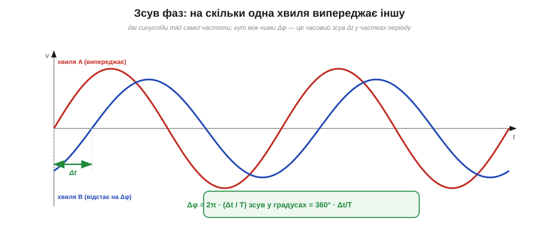

# Фаза й зсув фаз

[Амплітуда й частота](book:physics/amplitude-frequency) описують одну хвилю — наскільки вона висока і як часто повторюється. Та в реальному колі хвиль майже завжди **дві або більше**: напруга й струм, вхід і вихід підсилювача, дві лінії шини, сигнал та його відлуння. І щойно хвиль стає кілька, виникає нове питання, на яке амплітуда з частотою відповісти не можуть: **як вони розташовані одна відносно одної в часі** — разом ідуть, чи одна попереду? На це відповідає останній параметр синусоїди — **фаза**. Без неї опис змінного струму неповний, а половина його найважливіших явищ (від потужності до резонансу) просто не існує.

Фаза — поняття, від якого спершу мружаться, бо воно нібито «про той самий синус, тільки трохи зсунутий». Та насправді саме фаза робить теорію змінного струму багатою. Розберемося спершу, що таке фаза в **однієї** хвилі, а тоді — найважливіше — що таке **зсув фаз** між двома.

### Фаза однієї хвилі: з якої точки циклу вона стартує

Запишімо формулу синуса повністю — з доданком, який часто лишають осторонь:

```
v(t) = Vm · sin(ωt + φ)
```

Той доданок φ (фі) і є **фаза** (гр. *phásis* — поява, прояв; точніше тут — **початкова фаза**, *phase*). Подивімося, що він робить. Аргумент синуса — це кут; ωt — кут, що рівномірно росте з часом (фазор крутиться), а φ — **стала добавка** до цього кута. Інакше кажучи, φ задає, **під яким кутом стрілка-фазор стояла в момент t = 0**, з якої точки свого циклу хвиля почала. При φ = 0 синус стартує з нуля й іде вгору. При φ = +90° (тобто +π/2) хвиля на старті вже на піку — а це рівно косинус. При φ = 180° (π) вона стартує з нуля, але йде вниз — дзеркальний синус. Тобто φ просто **зсуває всю хвилю** вздовж осі часу, не міняючи ні висоти, ні частоти.


*Той самий синус із різною початковою фазою φ. φ = 0 — стартує з нуля вгору; φ = +90° — стартує з піка (це косинус); φ = 180° — стартує з нуля, але вниз. Фаза не міняє ні амплітуди, ні частоти — лише посуває всю хвилю по горизонталі.*

Фазу міряють у тих самих одиницях, що й будь-який кут, — у **градусах** (повний цикл = 360°) або в **радіанах** (повний цикл = 2π). Чверть циклу — 90° або π/2, півцикла — 180° або π. Це природно: адже фаза — це кут обертового фазора, а цикл синуса і є один оберт. Тому й кажуть «зсунути на 90 градусів», маючи на увазі «на чверть періоду».

Сама по собі початкова фаза однієї-єдиної хвилі — річ доволі умовна: вона залежить лише від того, **звідки ми почали лічити час**. Зрушимо початок відліку — і φ зміниться, хоча хвиля та сама. Тому фаза однієї ізольованої хвилі майже не несе фізики. Уся сила поняття вмикається, коли хвиль **дві**.

### Зсув фаз: на скільки одна хвиля попереду іншої

Ось де народжується головне. Візьмімо дві синусоїди **однакової частоти** і покладімо їх на один графік. Якщо їхні початкові фази різні, одна хвиля виявиться зсунутою відносно іншої — її піки настають раніше або пізніше. Цю різницю й називають **зсувом фаз** (*phase shift*, *phase difference*, Δφ): це різниця початкових фаз двох хвиль, Δφ = φ₁ − φ₂.

І, на відміну від фази однієї хвилі, зсув фаз — річ **абсолютно реальна й від вибору початку відліку не залежна**. Зруште момент t = 0 — обидві фази зміняться **на однакову величину**, а їхня різниця лишиться тією самою. Зсув фаз каже об'єктивну річ: **наскільки одна хвиля випереджає (або відстає від) іншу**.


*Дві синусоїди однакової частоти, зсунуті по фазі. Хвиля A проходить свої точки раніше — вона **випереджає** (*leads*); хвиля B настає пізніше — **відстає** (*lags*). Зсув можна міряти і як кут Δφ (тут 60°), і як час Δt між однаковими точками; вони зв'язані через період.*

Тут з'являються два слова, які треба засвоїти твердо, бо їх уживають на кожному кроці. Хвиля, чиї піки настають **раніше**, **випереджає** (*leads*) — вона «попереду». Хвиля, чиї піки настають **пізніше**, **відстає** (*lags*) — вона «позаду». Англійські lead і lag трапляються в даташитах і теорії постійно («current lags voltage by 90°» — струм відстає від напруги на 90°), тож варто звикнути до них одразу.

Зсув фаз можна виражати **двояко** — і це знову та сама річ двома мовами, як період і частота. Можна — **кутом** Δφ (у градусах чи радіанах): «зсунуті на 90°». А можна — **часом** Δt: «хвиля B настає на 5 мілісекунд пізніше». Зв'язує їх період: повний цикл — це 360° і водночас час T, тож частка циклу в кутах і в часі — одна:

```
Δφ / 360°  =  Δt / T          →          Δφ = 360° · (Δt / T)
```

Іншими словами, зсув у градусах — це просто частка періоду, виражена в градусах. Зсув на чверть періоду (Δt = T/4) — це 90°; на півперіоду (T/2) — 180°. Перехід «час ↔ градуси» через цю пропорцію — звичайна щоденна арифметика інженера.

**Приклад (від часу до градусів і назад).** Дві хвилі в мережі 50 Гц (T = 20 мс) зсунуті на Δt = 1.67 мс. На скільки градусів вони розійшлися? І навпаки — який часовий зсув дає 120°?

```
T = 1/50 = 20 мс
Δφ = 360° · (Δt/T) = 360° · (1.67/20)  ≈ 30°       ← часовий зсув у градусах
Δt = T · (Δφ/360°) = 20 мс · (120/360)  ≈ 6.67 мс  ← 120° у часі (третина періоду)
```

Зверніть увагу на 120°: це третина повного циклу. Саме на третину періоду зсунуті одна від одної три напруги в [**трифазній** мережі](book:physics/dc-vs-ac) — три синусоїди, рознесені рівно на 360°/3 = 120°. Зсув фаз тут — не абстракція, а буквальна конструкція енергосистеми.

### Три зсуви, які треба впізнавати з першого погляду

Хоч зсув фаз буває яким завгодно, три його значення трапляються так часто й важать так багато, що їх варто впізнавати миттєво.


*Три характерні зсуви. **0° (синфазно)** — піки збігаються, хвилі йдуть нога в ногу. **90° (квадратура)** — одна зсунута на чверть періоду; коли одна на піку, друга проходить нуль. **180° (протифаза)** — піки однієї проти западин іншої; складені, такі хвилі гасять одна одну.*

- **Зсув 0° — синфазно** (*in phase*). Хвилі піднімаються й опускаються разом, піки збігаються. Складені, вони підсилюють одна одну (амплітуди додаються).
- **Зсув 90° — квадратура** (*quadrature*). Одна хвиля рівно на чверть періоду попереду: коли перша на піку, друга саме проходить нуль. Це особливий, дуже важливий зсув — рівно таку чверть періоду дають [конденсатор і котушка між струмом і напругою](book:electronics/phase-shift). Назва «квадратура» — від латинського *quadra* (чотирикутник, чверть кола): 90° — це рівно чверть повного оберту.
- **Зсув 180° — протифаза** (*anti-phase*, *out of phase*). Хвилі дзеркальні: пік однієї точно над западиною іншої. Складені, вони **гасять** одна одну — а якщо амплітуди рівні, гасять повністю, у нуль. На цьому стоїть, наприклад, активне гасіння шуму (навушники додають до зовнішнього звуку його ж протифазу).

Ці три випадки — як три ноти, з яких складається вся «гармонія» взаємодії хвиль: збіг, чверть зсуву й повна протилежність. Решта зсувів лежать десь поміж ними.

> 🔧 **Навіщо це.** Зсув фаз — не геометрична забаганка, а ключ до найважливіших речей у змінному струмі. По-перше, **потужність**: коли струм і напруга синфазні, прилад бере від мережі повну потужність; коли вони в квадратурі (90°), середня потужність — нуль, енергія лише гойдається туди-сюди, дарма гріючи дроти (це знаменитий «косинус фі» в електриці). По-друге, **зв'язок між сигналами**: вимірявши зсув фаз між входом і виходом, дізнаються, що коло робить із сигналом, і чи не «завертає» воно його настільки, що підсилювач почне самозбуджуватися. По-третє, **синхронізація**: щоб під'єднати генератор до мережі, його напругу спершу зводять з мережевою у фазу (зсув 0°), інакше — потужний удар. Тому фаза — це той параметр, повз який не пройде жоден серйозний розрахунок або налагодження кола змінного струму.
