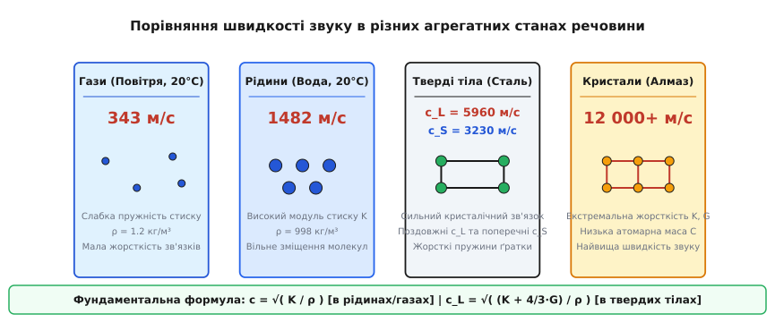
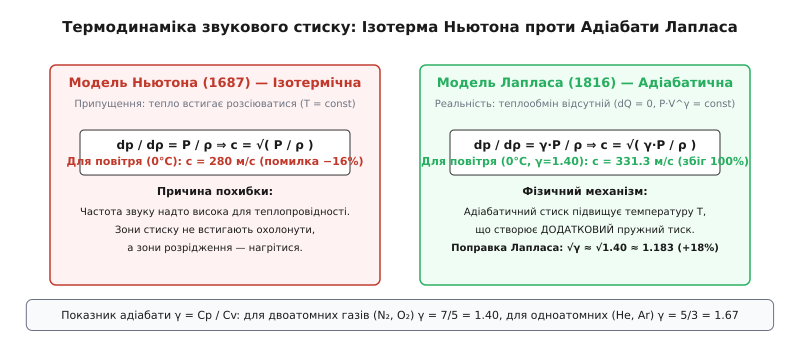
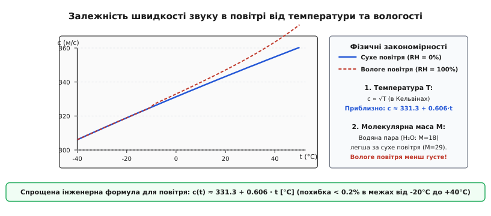
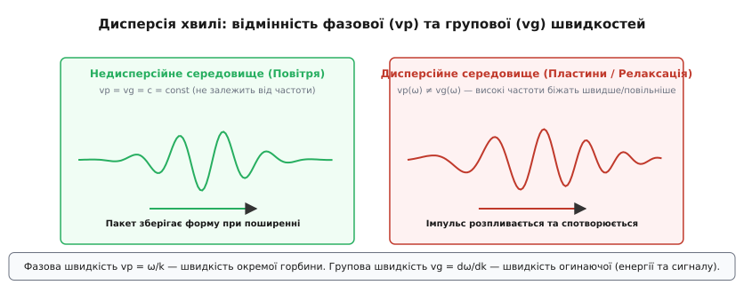

# Швидкість звуку: механіка поширення пружних збурень у матерії

<preknowlist>
- [Хвильове рівняння](topic:physics/wave-equation) — математичний опис поширення коливань у часі й просторі.
- [Акустичний імпеданс](topic:physics/acoustic-impedance) — опис опору середовища зміщенню частинок та тиску.
- [Модуль пружності](topic:physics/elastic-modulus) — міра здатності матеріалу чинити опір механічній деформації.
- [Густина](topic:physics/density) — маса одиниці об'єму, що визначає інертність елементарного об'єму.
</preknowlist>

Спалах блискавки на відстані трьох кілометрів досягає ока спостерігача за десять мікросекунд, тоді як перший відголосок громового удару докочується лише через вісім і пів секунди. Якщо ж ударити важким молотом по залізничній рейці на тій самій трикілометровій дистанції, спостерігач, приклавши вухо до сталі, почує виразний металевий дзвін уже через пів секунди, і лише через вісім секунд до нього прибуде той самий гук через повітря. Ця майже шістнадцятиразова різниця у часі приходу двох сигналів від однієї механічної події демонструє, що швидкість звуку не є фундаментальною константою порожнього простору, а є динамічною характеристикою суцільного пружного середовища, яке здатне передавати механічну деформацію від молекули до молекули.

### 1. Механічна природа звуку: як збурення передається від атома до атома

Звук у своїй фізичній основі є поздовжньою механічною хвилею — періодичним збуренням густини й тиску, яке поширюється у речовині. На відміну від електромагнітного випромінювання, здатного долати космічний вакуум, звукова хвиля фізично не здатна існувати без матеріального носія. У порожнечі немає частинок, здатних зіштовхуватися й передавати імпульс сусіднім шарам.

Щоб зрозуміти мікроскопічний механізм поширення звуку, уявимо будь-яку речовину — газ, рідину чи твердий кристал — у вигляді тривимірної ґратки масивних кульок (атомів або молекул), з'єднаних між собою мікроскопічними пружними пружинками (міжмолекулярними або міжкристалічними силами зв'язку). Маса кожної кульки задається густиною середовища `ρ`, а жорсткість пружинок — модулем пружності `K`.


*Швидкість звуку визначається балансом між пружною жорсткістю міжмолекулярних зв'язків K (відновлювальна сила) та густиною середовища ρ (інертність). Перехід від газів до твердих кристалів збільшує швидкість звуку від 343 м/с до понад 12 000 м/с.*

Коли зовнішнє джерело — наприклад, дифузор гучномовця або поршень у циліндрі — різко зсувається вперед, воно штовхає прилеглий шар частинок. Цей шар стискається, його локальна густина й тиск зростають. Стиснута група частинок починає тиснути на сусідній шар, передаючи йому кінетичну енергію та накопичену потенціальну енергію деформації. Зсунувшись, перший шар зупиняється й повертається назад під дією зворотного тиску, створюючи зону розрідження, тоді як область стиску зміщується у просторі далі.

У суцільному середовищі перенесення механічного імпульсу відбувається за рахунок двох послідовних процесів:
1. **Накопичення потенціальної енергії:** малий елементарний об'єм речовини деформується під дією градієнта тиску. Густина потенціальної енергії пружної деформації дорівнює `w_p = p'² / (2 · ρ₀ · c²)`. Чим жорсткіший матеріал (чим більший модуль пружності `K`), тим вищий відновлювальний тиск створюється при даній деформації.
2. **Перетворення на кінетичну енергію:** виниклий тиск прискорює сусідні маси речовини. Густина кінетичної енергії становить `w_k = (1/2) · ρ₀ · v'²`. Чим менша густина `ρ`, тим більшого прискорення набувають частинки, і тим швидше передається імпульс наступному шару.

У плоскій біжучій хвилі спостерігається строгий рівнорозподіл енергії: в кожній точці простору густина потенціальної енергії дорівнює густині кінетичної енергії `w_p = w_k`. Вектор густини потоку акустичної енергії (вектор Умова-Пойнтінга в акустиці) дорівнює добутку акустичного тиску на коливальну швидкість: `I⃗ = p' · v⃗`. Середня інтенсивність хвилі пов'язана зі швидкістю звуку співвідношенням `I = p_rms² / (ρ · c)`.

Важливо суворо розрізняти дві кардинально різні швидкості, які часто плутають початківці:

* **Коливальна швидкість частинок `v`** (вимірюється в міліметрах чи сантиметрах за секунду) — це швидкість, із якою окрема молекула дрижить туди-сюди коло свого тимчасового положення рівноваги під дією хвилі. Наприклад, для звуку комфортної гучності мовлення (близько 60 дБ SPL) надлишковий акустичний тиск становить лише `p' ≈ 0.02 Па`, а амплітуда коливальної швидкості молекул повітря складає всього `v = p' / (ρ·c) ≈ 0.00005 м/с` (50 мікрометрів за секунду) при зміщенні частинок менше ніж на один нанометр!
* **Швидкість поширення звукової хвилі `c`** (вимірюється в сотнях чи тисячах метрів за секунду) — це швидкість, із якою у просторі біжить сама фаза стиску та акустичний сигнал. Швидкість хвилі є властивістю середовища і не залежить від амплітуди коливань частинок у межах лінійної акустики.

Співвідношення між тиском і коливальною швидкістю визначається питомим акустичним імпедансом середовища `z₀ = ρ · c`. Детальніше про акустичний опір і відбиття хвиль написано в статті [Акустичний імпеданс](topic:physics/acoustic-impedance).

Швидкість, із якою збурення передається від шару до шару, визначається двома конкуруючими фізичними факторами:

* **Відновлювальна сила (Пружність):** Чим жорсткіші міжатомні пружини (чим вищий модуль пружності `K`), тим більшу силу прискорення отримує сусідній шар частинок при деформації, і тим швидше передається збурення.
* **Інертність (Маса):** Чим важчі частинки (чим більша густина `ρ`), тим повільніше вони прискорюються під дією тієї ж сили, і тим довше затримується передача імпульсу наступному шару.

Звідси негайно випливає якісний фізичний висновок: швидкість звуку повинна зростати зі збільшенням жорсткості середовища й зменшуватися зі зростанням його густини. Точний аналіз розмірностей підтверджує цей зв'язок:

```
[K / ρ] = (Па) / (кг/м³) = (Н / м²) / (кг/м³) = (кг · м / с² / м²) / (кг/м³) = м² / с²
```

Взявши квадратний корінь із відношення пружності до густини, отримуємо фундаментальну формулу швидкості поздовжньої акустичної хвилі в суцільному середовищі:

```
c = √( K / ρ )
```

У газах і рідинах роль модуля жорсткості відіграє модуль об'ємного стиску `K = −V · (dp / dV)`. Проте спроба прямим чином застосувати цю формулу до газів затьмарила розум найбільших фізиків XVII століття майже на сто п'ятдесят років.

### 2. Швидкість звуку в газах: від Ньютона до Лапласа та термодинамічні тонкощі

Першим, хто спробував розрахувати швидкість звуку теоретично на основі законів механіки, був Ісаак Ньютон у 1687 році. Детальний опис історичних суперечок навколо цього розрахунку наведено в [історичній вставці](topic:physics/speed-of-sound/hist-speed-of-sound.md).

Ньютон припустив, що під час стиску й розрідження повітря температура газу залишається сталою. Для ізотермічного процесу (`T = const`) тиск прямо пропорційний густині за законом Бойля-Маріотта (`p = C · ρ`), звідки ізотермічний модуль пружності дорівнює статичному тиску: `K_iso = p`. Підставивши це значення у формулу швидкості, Ньютон отримав `c_iso = √(p / ρ)`. Для повітря за нормальних умов цей розрахунок давав `280 м/с`, що на `16%` відрізнялося від експериментального значення `331 м/с`.


*Причиною похибки Ньютона стало припущення про ізотермічний стиск. Звукові коливання відбуваються настільки швидко, що тепло не встигає розсіюватися. Адіабатичний розрахунок Лапласа збільшує пружність у γ разів, повністю усуваючи похибку.*

Розгадку знайшов П'єр-Симон Лаплас у 1816 році. Він усвідомив, що акустичні коливання відбуваються з високою частотою. За час одного півперіоду стиску (мікросекунди або мілісекунди) теплота, що виділяється при локальному стиску газу, просто не встигає відвестися у сусідні шари шляхом теплопровідності.

Фізичним критерієм адіабатичності є порівняння довжини звукової хвилі `λ` із тепловою довжиною релаксації `L_th = √(χ / ω)`, де `χ` — коефіцієнт температуропровідності газу, а `ω` — кругова частота звуку. Для повітря за нормальних умов `χ ≈ 2 · 10⁻⁵ м²/с`. На частоті 1 кГц довжина хвилі дорівнює `λ = 34 см`, тоді як теплова довжина становить всього `L_th ≈ 0.05 мм`. Оскільки `L_th ≪ λ`, вирівнювання температури між зонами стиску й розрідження є неможливим. Отже, процес поширення звуку у газах є строго **адіабатичним** (`dQ = 0`)!

При адіабатичному стиску стан газу описується адіабатою Пуассона `p · V^γ = const`, де `γ = Cp / Cv` — показник адіабати (коефіцієнт Пуассона), який дорівнює відношенню теплоємності при постійному тиску до теплоємності при постійному об'ємі.

Диференціюючи рівняння адіабати `p = C · ρ^γ` за густиною `ρ`, отримуємо адіабатичний модуль пружності:

```
K_adb = ρ · (dp / dρ)_s = γ · p
```

Підставляючи адіабатичний модуль пружності `K_adb` у формулу швидкості, отримуємо знамениту **формулу Лапласа для швидкості звуку в газах**:

```
c = √( γ · p / ρ )
```

Скориставшись рівнянням стану ідеального газу Менделєєва-Клапейрона `p / ρ = R · T / M` (де `R = 8.314 Дж/(моль·К)` — універсальна газова стала, `T` — абсолютна температура в Кельвінах, а `M` — молярна маса газу в кг/моль), перепишемо формулу Лапласа у температурній формі:

```
c = √( γ · R · T / M )
```

Ця формула відкриває мікроскопічний зв'язок між швидкістю звуку та хаотичним тепловим рухом молекул. Середньоквадратична теплова швидкість молекул ідеального газу дорівнює `v_rms = √(3·R·T / M)`. Порівнюючи її зі швидкістю звуку, бачимо:

```
c = √(γ / 3) · v_rms
```

Для двоатомних газів (`γ = 1.40`) отримаємо `c ≈ 0.68 · v_rms`. Звук — це не що інше, як колективна хвиля спрямованого зсуву, яка поширюється зі швидкістю того ж порядку, що й середня теплова швидкість хаотичного польоту окремих молекул між зіткненнями!

Розглянемо чотири фундаментальні закономірності акустики газів, які випливають з формули Лапласа:

#### 1. Залежність від абсолютної температури

Швидкість звуку в газі пропорційна квадратному кореню з абсолютної температури `c ∝ √T`. При нагріванні газу молекули починають рухатися з більшими тепловими швидкостями. Оскільки акустичний імпульс передається саме під час зіткнень молекул одна з одною, зростання швидкості хаотичного польоту молекул безпосередньо прискорює поширення акустичної хвилі.

Якщо виразити температуру в градусах Цельсія `t` (`T = 273.15 + t`), формула розкладається в ряд Тейлора для невеликих відхилень від нуля:

```
c(t) = 331.3 · √( 1 + t / 273.15 ) ≈ 331.3 + 0.606 · t  [м/с]
```

Таким чином, для кожного підвищення температури повітря на один градус Цельсія швидкість звуку зростає приблизно на `0.606 м/с` (або `0.6 м/с`).


*Залежність швидкості звуку у повітрі від температури t (°C) та відносної вологості. Нагрівання збільшує теплову швидкість молекул, а додавання легких молекул H₂O зменшує середню молярну масу суміші.*

#### 2. Незалежність від атмосферного тиску

Уважний розгляд формули `c = √(γ · p / ρ)` виявляє парадоксальний на перший погляд факт: при постійній температурі швидкість звуку **взагалі не залежить від барометричного тиску або розрідження повітря**!

При стиску газу вдвічі (зростання тиску `p` у 2 рази) його густина `ρ` за законом Бойля-Маріотта також зростає рівно вдвічі. Відношення `p / ρ` залишається строго постійним. Тому на вершині Евересту, де тиск становить лише третину від морського, швидкість звуку нижча не через низький тиск, а виключно через низьку температуру повітря (`−35°C` або `238 К`).

Ця правило діє доти, доки газ залишається суцільним середовищем. Якщо повітря розріджувати далі, то на висотах понад 100 км середня довжина вільного пробігу молекул `λ_mfp` стає порівнянною з довжиною звукової хвилі `λ`. У цьому випадку поняття суцільного середовища втрачає сенс, хвиля затухає на відстані одного пробігу, і звук припиняє поширюватися.

#### 3. Вплив молярної маси та атомності газу

Швидкість звуку обернено пропорційна квадратному кореню з молярної маси `c ∝ 1 / √M`. Чим легші молекули газу, тим швидше вони розганяються під час зіткнень і тим швидше передають акустичний імпульс. Окрім того, значення показника адіабати `γ` залежить від кількості ступенів свободи молекули:
* **Одноатомні гази (He, Ar, Ne):** 3 поступальні ступені свободи (`Cv = 3/2 R`, `Cp = 5/2 R`), звідси `γ = 5/3 ≈ 1.67`.
* **Двоатомні гази (N₂, O₂, повітря):** 3 поступальні + 2 обертальні ступені свободи (`Cv = 5/2 R`, `Cp = 7/2 R`), звідси `γ = 7/5 = 1.40`.
* **Багатоатомні гази (CO₂, CH₄, SF₆):** додаються обертальні та коливальні ступені свободи (`γ ≈ 1.20 ... 1.30`).

Порівняємо три гази при температурі `20°C` (`293.15 К`):
* **Гексафторид сірки (`SF₆`, M = 0.146 кг/моль, γ = 1.09):** дуже важкі багатоатомні молекули, `c ≈ 152 м/с`. Людина, яка вдихнула `SF₆`, говорить неприродно низьким, «басовим» голосом.
* **Повітря (M = 0.029 кг/моль, γ = 1.40):** середня молярна маса, `c = 343 м/с`.
* **Гелій (`He`, M = 0.004 кг/моль, γ = 1.67):** дуже легкий одноатомний газ, `c ≈ 1007 м/с`. Вдихання гелію зсуває резонансні частоти голосового тракту вгору, створюючи знаменитий «мультяшний» високий тембр голосу Дональда Дака.

#### 4. Вплив відносної вологості повітря

Молярна маса водяної пари (`H₂O`) становить `18 г/моль`, тоді як середня молярна маса сухого повітря (`N₂` та `O₂`) дорівнює `28.97 г/моль`. Оскільки молекули води легші за молекули азоту й кисню, вологе повітря за того самого тиску й температури є **менш густим**, ніж сухе повітря!

Зменшення густини суміші при додаванні водяної пари призводить до того, що у вологому повітрі швидкість звуку трохи вища, ніж у сухому. При температурі `20°C` та вологості `100% RH` швидкість звуку перевищує значення для сухого повітря на `1.3 м/с` (близько `0.35%`).

### 3. Повне виведення та математичний апарат хвилі стиску

Для суворого опису процесів виникнення та поширення акустичних хвиль використовують рівняння гідродинаміки та теорії пружності. Детальний математичний вивід з рівнянь нерозривності та рівнянь Ейлера наведено у [математичній вставці](topic:physics/speed-of-sound/math-speed-of-sound-derivation.md).

Коротко підсумуємо ланцюжок диференціальних перетворень. Мале акустичне збурення описується лінеаризованим рівнянням нерозривності та лінеаризованим рівнянням руху Ейлера:

```
∂ρ' / ∂t + ρ₀ · (∂v' / ∂x) = 0                       [збереження маси]
ρ₀ · (∂v' / ∂t) = −∂p' / ∂x                          [другий закон Ньютона]
```

Поєднуючи ці диференціальні рівняння через термодинамічну залежність тиску від густини `p' = c² · ρ'`, отримуємо скалярне диференціальне **хвильове рівняння второго порядку**:

```
∂²p' / ∂t² = c² · (∂²p' / ∂x²)
```

Коефіцієнт `c²`, який стоїть перед просторовою другою похідною, дорівнює частинній похідній тиску за густиною при постійній ентропії `S` (адіабатичний процес):

```
c = √( (∂p / ∂ρ)_s )
```

Це рівняння є загальним для будь-яких стисливих середовищ — від ідеальних газів до плазми та рідкого гелію.

### 4. Швидкість звуку в рідинах і твердих тілах: поздовжні, поперечні та поверхневі хвилі

У рідинах і твердих тілах відстані між атомами значно менші, ніж у газах, а сили міжмолекулярної взаємодії — на кілька порядків більші. Це призводить до того, що модуль об'ємного стиску рідин перевищує модуль стиску газів у тисячі разів.

#### Швидкість звуку в рідинах

Модуль об'ємного стиску чистої води становить `K ≈ 2.2 ГПа` (`2.2 · 10⁹ Па`), а її густина — `ρ ≈ 998 кг/м³`. Підставивши ці значення у формулу `c = √(K / ρ)`, отримуємо:

```
c_water = √( 2.2 · 10⁹ / 998 ) ≈ 1482 м/с
```

Швидкість звуку у воді майже у 4.3 раза перевищує швидкість звуку в повітрі.

Оскільки рідини практично не стискаються, їхня температура при адіабатичному стиску змінюється незначно, а показник адіабати `γ` близький до одиниці (`γ_water ≈ 1.01`). Проте швидкість звуку в рідинах має складну нелінійну залежність від температури, солоності та тиску (глибини).

На відміну від газів, де швидкість звуку завжди зростає з температурою, у прісній воді спостерігається унікальний максимум: при нагріванні від `0°C` до `74°C` швидкість звуку зростає від `1402 м/с` до максимуму `1555 м/с`, після чого починає зменшуватися. Це пояснюється розпадом асоційованих водневих зв'язків у структурі води при помірному нагріванні, що робить її більш жорсткою.

В океані комбінація зміни температури з глибиною та зростання гідростатичного тиску створює унікальне явище — **підводний акустичний канал SOFAR** (*Sound Fixing and Ranging*). На глибині близько `1000 метрів` швидкість звуку сягає свого глобального мінімуму (`~1480 м/с`). Шари води вище й нижче цього горизонту мають більшу швидкість звуку і працюють як акустична лінза. За законом Снеліуса для акустики `c₁ / sin(θ₁) = c₂ / sin(θ₂)` акустичні промені постійно заломлюються у бік горизонту з мінімальною швидкістю звуку. Звук низької частоти, випромінений у канал SOFAR, затискається всередині хвилеводу і здатний поширюватися на відстані у тисячі кілометрів без згасання.

#### Швидкість звуку в твердих тілах

У твердих тілах атоми жорстко зафіковані у вузлах кристалічної ґратки. Окрім опору стиску (модуль `K`), тверде тіло чинить опір зміщенню атомних шарів один відносно одного — це описується **модулем зсуву `G`**.

Завдяки наявності зсувної жорсткості у суцільному твердому тілі можуть поширюватися **два незалежних типи об'ємних акустичних хвиль**:

1. **Поздовжня хвиля (P-хвиля, хвиля стиску):** частинки середовища коливаються паралельно напрямку поширення хвилі.
2. **Поперечна хвиля (S-хвиля, зсувна хвиля):** частинки середовища коливаються перпендикулярно до напрямку поширення хвилі.

Швидкості поздовжньої (`c_L`) та поперечної (`c_S`) хвиль у безмежному ізотропному твердому тілі виражаються через сталі Ляме `λ` та `μ = G`, або через модуль Юнга `E` та коефіцієнт Пуассона `ν`:

```
c_L = √[ (K + 4/3·G) / ρ ] = √[ (E · (1 − ν)) / (ρ · (1 + ν) · (1 − 2ν)) ]
c_S = √[ G / ρ ] = √[ E / (2 · ρ · (1 + ν)) ]
```

Оскільки коефіцієнт Пуассона для більшості матеріалів перебуває в межах `0.2 < ν < 0.35`, поздовжня швидкість завжди суттєво перевищує поперечну:

```
c_L ≈ 1.7 ... 2.0 · c_S
```

Наприклад, у конструкційній сталі поздовжня швидкість становить `c_L = 5940 м/с`, а поперечна — `c_S = 3220 м/с`. У сейсмології це явище дозволяє визначати відстань до епіцентру землетрусу за часовою затримкою між прибуттям першої P-хвилі та наступної S-хвилі.

#### Геофізична акустика та сейсмічне зондування Надр Землі

Вимірювання швидкостей P-хвиль та S-хвиль стало головним інструментом геофізиків у дослідженні внутрішньої будови Землі. У верхній мантії Землі швидкість поздовжніх сейсмічних хвиль становить `c_L ≈ 8 км/с`, а на межі з ядром досягає `c_L ≈ 13.7 км/с`.

У 1914 році німецько-американський геофізик Бенно Гутенберг виявив, що на глибині `2900 кілометрів` поперечні S-хвилі раптово зникають і припиняють поширюватися взагалі (`c_S = 0`). Оскільки зсувний модуль `G = 0` є фундаментальною ознакою рідкого стану речовини, це стало незаперечним доказом того, що зовнішнє ядро Землі є рідким! Натомість внутрішнє ядро Землі під дією колосального тиску знову є твердим, що підтверджується виникненням у ньому характерних поздовжніх і поперечних сейсмічних хвиль.

Якщо тверде тіло є не безмежним масивом, а тонким стрижнем (діаметр якого набагато менший за довжину хвилі `d ≪ λ`), бічні поверхні стрижня вільно розширюються при стиску. Це знімає поперечні напруження, і швидкість поздовжньої хвилі у стрижні зменшується до:

```
c_rod = √( E / ρ )
```

На поверхні твердого тіла виникає третій тип хвиль — **поверхневі хвилі Релея**, швидкість яких є трохи меншою за поперечну швидкість: `c_R ≈ 0.9 · c_S`.

### 5. Дисперсія, нелінійність та надзвукові явища

У класичному наближенні швидкість звуку вважається постійною величинами, незалежною від частоти. Проте у реальних середовищах при певних умовах виникають явища дисперсії та нелінійності.

#### Дисперсія акустичних хвиль

**Дисперсія звуку** — це залежність фазової швидкості хвилі `v_p = ω / k` від її частоти `ω`.

У звичайному повітрі й чистій воді у чутному діапазоні частот (від 20 Гц до 20 кГц) дисперсія практично відсутня: басові й високі звуки музичного інструменту долають кілометрову відстань за одинаковий час.


*Відмінність між фазовою та груповою швидкостями. У середовищі без дисперсії акустичний імпульс зберігає свою форму. У дисперсійному середовищі високі й низькі частоти біжать із різною швидкістю, розмиваючи хвильовий пакет.*

Проте на високих частотах (ультразвук і гіперзвук мегагерцового й гігагерцового діапазонів) проявляється **молекулярна релаксація**. Звукова хвиля передає енергію не лише поступальному руху молекул, але й їхнім обертальним та коливальним ступеням свободи. Якщо період акустичної хвилі стає порівнянним із часом релаксації `τ` міжмолекулярного обміну енергією, середовище стає дисперсійним. При цьому фазова швидкість `v_p` перестає дорівнювати **груповій швидкості `v_g = dω / dk`**, яка задає швидкість перенесення енергії та акустичного сигналу.

#### Акустичні левітатори та стоячі хвилі

Цікавим застосуванням високої інтенсивності акустичних хвиль є **акустична левітація**. Коли у замкненому об'ємі між випромінювачем і відбивачем виникає стояча акустична хвиля, у вузлах коливальної швидкості виникає градієнт акустичного радіаційного тиску. Сила радіаційного тиску `F_rad = −∇U_ac` компенсує силу тяжіння, дозволяючи утримувати у повітрі безконтактно дрібні краплі рідини, біологічні зразки чи мікросхеми.

#### Нелінійні хвилі та ударні хвилі

При малій амплітуді акустичного тиску стиск і розрідження є симетричними. Проте при дуже високій інтенсивності звуку (понад 160 дБ) проявляється нелінійність середовища: у зонах стиску температура й швидкість частинок зростають, тому фаза стиску біжить трохи швидше, ніж фаза розрідження (`c_local = c₀ + ε · v`).

У результаті передній фронт хвилі стає все більш крутим, поки не перетвориться на розрив — **ударну хвилю**. Стрибок тиску, густини й температури на фронті ударної хвилі описується співвідношеннями Ренкіна-Гюгоньо.

Коли фізичне тіло (літак, куля, метеорит) рухається у середовищі зі швидкістю `v`, що перевищує швидкість звуку `c`, воно випереджає власні акустичні збурення. Усі звукові хвилі, випромінені об'єктом, огинаються у вузький **конус Маха**.

Число Маха задає відношення швидкості об'єкта до швидкості звуку:

```
Ma = v / c
```

Кут розкриття конуса Маха `θ` визначається геометричним співвідношенням:

```
sin(θ) = 1 / Ma = c / v
```

Коли фронт конуса Маха, перетинаючи простір, досягає землі, спостерігач чує різкий клацаючий вибух — акустичний удар (*sonic boom*).

> 🔧 **Навіщо це.**
> Знання точної швидкості звуку є фундаментальною основою сучасних вимірювальних технологій. Ультразвукові датчики відстані (наприклад, мікроконтролерні модулі HC-SR04 або автопарктроніки) вимірюють час прольоту акустичного імпульсу до перешкоди й назад `t_echo`. Відстань обчислюється як `d = (c · t_echo) / 2`. Якщо алгоритм не компенсує зміну температури повітря, то при зміні температури від `−10°C` до `+30°C` похибка вимірювання відстані перевищить `7%`. В ультразвуковій медичній діагностиці (УЗД) прилад розраховує глибину залягання внутрішніх органів за середньою швидкістю звуку у м'яких тканинах (`1540 м/с`); помилка в оцінці імпедансу чи швидкості призведе до геометричних спотворень анатомічної карти. У промисловій ультразвуковій дефектоскопії металів за часом приходу відбитого імпульсу визначають точні координати тріщин у сталевих балонах та рейках.

### 6. Практична інженерія та приклади розрахунків

Для інженерного використання та програмного моделювання акустичних процесів створено спеціалізовані математичні бібліотеки. Повні нормативні таблиці констант матеріалів та специфікацію програмного інтерфейсу наведено у [довідковій вставці](topic:physics/speed-of-sound/api-acoustic-constants.md), а приклад реального коду калькулятора мовами C та C++ міститься у [практичній вставці](topic:physics/speed-of-sound/proj-speed-of-sound-calc.md).

#### Приклад 1. Гідролокаційне вимірювання глибини океану
Судновий ехолот посилає акустичний імпульс частотою 50 кГц до дна й фіксує повернення відлуння через `t_echo = 1.314 секунди`. Виміряна середня температура води становить `15°C`, солоність `35‰`, середня глибина близько 1000 м. За формулою Медевіна швидкість звуку у морській воді дорівнює `c = 1522.5 м/с`. Розрахунок глибини дна:

```
h = (c · t_echo) / 2 = (1522.5 · 1.314) / 2 = 1000.28 метрів
```

Якщо припустити спрощену швидкість прісної води `1480 м/с`, похибка обчислення глибини складе понад `27 метрів`, що є критичним при навігації суден у мілководних протоках.

#### Приклад 2. Промисловий ультразвуковий витратомір газу
В ультразвуковому витратомірі газу імпульси посилаються за потоком і проти потоку сухого метану (`CH₄`, молярна маса `M = 0.01604 кг/моль`, показник адіабати `γ = 1.31`) при температурі `20°C` (`293.15 К`). Обчислимо теоретичну швидкість звуку у метані за формулою Лапласа:

```
c = √( γ · R · T / M ) = √( 1.31 · 8.31446 · 293.15 / 0.01604 ) = √( 199146.7 ) ≈ 446.25 м/с
```

#### Приклад 3. Ультразвукова дефектоскопія рельсових колій
При неруйнівному контролі сталевих залізничних рейкових балок п'єзоелектричний датчик випромінює поздовжній ультразвуковий імпульс `c_L = 5940 м/с` уздовж головки рейки. Якщо дефектоскоп фіксує відбитий ехо-імпульс від внутрішньої тріщини через час `t_crack = 505.0 мікросекунд` (`0.000505 с`), то відстань від датчика до тріщини становить:

```
L = (c_L · t_crack) / 2 = (5940 · 0.000505) / 2 = 1.4998 метра
```

Таким чином, ультразвукова дефектоскопія дозволяє точно встановити дефект усередині сталевого масиву задовго до виникнення зовнішнього розлому рейки.

#### Приклад 4. Ультразвукова аналітика композитних вуглепластикових матеріалів
У сучасній авіаційній промисловості для контролю якості елементів фюзеляжу пасажирських лайнерів із вуглепластику (композит із густиною `ρ = 1550 кг/м³`) вимірюють швидкість ультразвуку. Для якісного монолітного вуглепластику модуль пружності становить `E = 95 ГПа`, що дає теоретичну поздовжню швидкість `c_L = √(E/ρ) ≈ 2475 м/с`. При наявності прихованих мікроскопічних розшарувань (деламінацій) або повітряних пор модуль пружності матеріалу падає, викликаючи зниження швидкості поздовжньої хвилі до `2100 м/с`. Автоматизовані дефектоскопи фіксують це падіння швидкості як локальну аномалію, дозволяючи бракувати дефектну деталь задовго до її монтажу на літак.

#### Приклад 5. Оцінка швидкості звуку в сумішах технічних газів
На нафтопереробних комбінатах контроль складу природного газу (суміш метану `CH₄` та етану `C₂H₆`) здійснюється акустичним методом. Зростання частки важчого етану (`M_ethane = 0.03007 кг/моль`) підвищує середню молярну масу суміші від `0.01604` до `0.01900 кг/моль`, що при постійній температурі `20°C` зменшує швидкість звуку від `446.25 м/с` до `409.80 м/с`. Фіксуючи швидкість звуку з точністю до `0.05 м/с`, аналізатор безперервно обчислює поточний відсотковий склад газового потоку у трубопроводі.

Зведемо основні робочі формули для розрахунку швидкості звуку в різних середовищах у єдиний підсумковий блок:

```
c_air(t) ≈ 331.3 + 0.606 · t [°C]                 [Повітря, спрощена інженерна]
c_air(T) = √( γ · R · T / M )                     [Гази, формула Лапласа]
c_water(t, S, z) ≈ 1449.2 + 4.6·t − 0.055·t² + ... [Морська вода, модель Медевіна]
c_rod = √( E / ρ )                                [Тонкий металевий стрижень]
c_L = √[ (K + 4/3·G) / ρ ]                        [Поздовжня хвиля в твердому тілі]
c_S = √( G / ρ )                                  [Поперечна зсувна хвиля]
```

Швидкість звуку виступає як міст між мікроскопічним світом міжмолекулярних сил та макроскопічним світом механічних хвиль. Вона поєднує термодинаміку газів, гідродинаміку рідин та теорію пружності твердих тіл у єдину цілісну фізичну картину.
