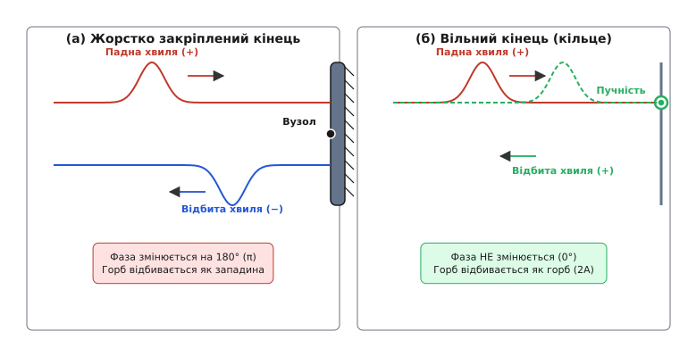
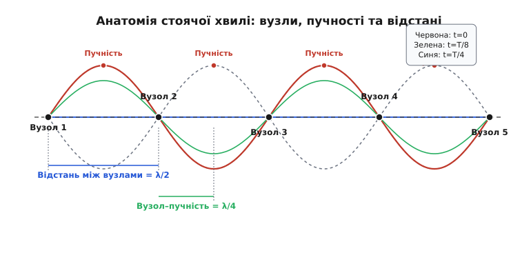
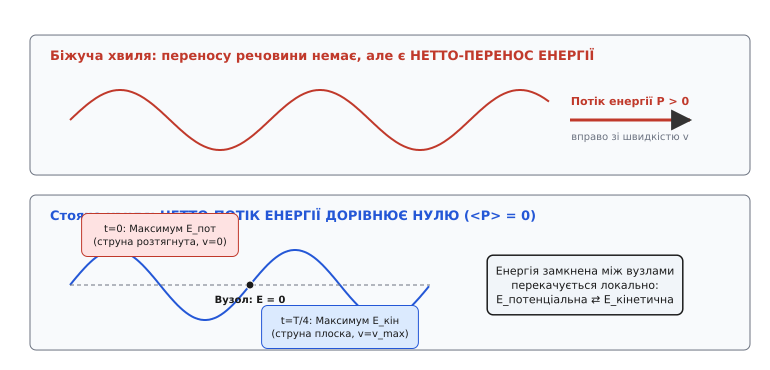
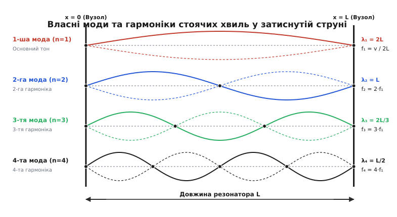
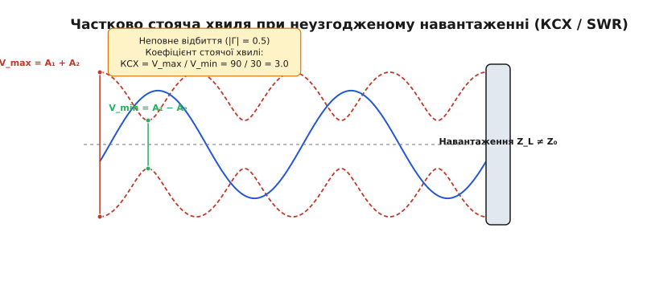

# Стояча хвиля: коли дві хвилі завмирають у вічний непорушний візерунок

<preknowlist>
- [Суперпозиція хвиль](topic:physics/wave-superposition) — як додаються дві протилежні біжучі хвилі.
- [Синусоїда](topic:physics/sine-wave) — гармонічна форма, у якій матерія коливається навколо рівноваги.
- [Фаза](topic:physics/phase) — кутовий стан коливання та зсув фаз при відбиванні від межі.
- [Резонанс](topic:physics/resonance) — утворення й накопичення коливальної енергії на власних частотах.
- [Хвильове рівняння](topic:physics/wave-equation) — фундаментальне рівняння поширення збурень у середовищі.
- [Акустичний імпеданс](topic:physics/acoustic-impedance) — чому хвилі відбиваються від границі двох середовищ.
</preknowlist>

Дерніть затиснуту гітарну струну або подмухайте в отвір флейти. Струна миттєво розпливається у напівпрозору широку смугу, проте на її кінцях і в кількох чітких точках посередині матерія залишається абсолютно непорушною. Покладіть сиру тарілку з їжею в мікрохвильову піч без поворотного столика — і за хвилину ви виявите, що сир розплавився гарячими плямами через кожні шість сантиметрів, тоді як ділянки між ними залишилися абсолютно холодними. У кімнаті з високим гулом бас-гітари зробіть кілька кроків від кутка до центра — в одному місці звук болісно тисне на вуха, а за два кроки повністю зникає, хоча комбопідсилювач продовжує ревти на повну потужність. Усі ці явища виростають з одного фундаментального ефекту: коли дві однакові хвилі біжать назустріч одна одній, їхня сума перестає рухатися простором і застигає у стаціонарний візерунок, який називається **стоячою хвилею** (англ. *standing wave* або *stationary wave*).

Звичайна біжуча хвиля є перенощиком руху й енергії: гребінь біжить за гребенем від джерела в далечінь, і кожна точка середовища по черзі переживає підйом і падіння до однакової амплітуди. При цьому середовище здійснює роботу з трансляції хвильового фронту вздовж усієї лінії поширення. Стояча хвиля поводиться кардинально інакше. Її гребені не біжать ні вліво, ні вправо, а лише ритмічно пульсують на місці: там, де було максимум відхилення, виникає нуль, а потім відхилення в протилежний бік. При цьому в просторі виникають точки, де матерія не рухається взагалі ніколи. З'ясуймо детально, як з поєднання двох біжучих рухів народжується цей нерухомий візерунок, як у ньому розподіляється енергія та чому саме стоячі хвилі визначають спектри всіх музичних інструментів і квантову будову атомів.

---

### Завмерлий коливальний візерунок: як рух утворює спокій

Щоб зрозуміти геометричний та фізичний механізм народження стоячої хвилі, уявимо довгий гнучкий шнур, по якому назустріч один одному біжать два однакові синусоїдальні імпульси однаковості амплітуди й частоти. У момент зустрічі, за [принципом суперпозиції](topic:physics/wave-superposition), відхилення струни в кожній точці дорівнює алгебраїчній сумі відхилень обох хвиль.

Коли горб першої хвилі накладається на горб другої, вони підсилюють один одного, утворюючи подвійне підняття. Та за чверть періоду обидві хвилі просуваються назустріч на чверть довжини хвилі. Тепер горб першої хвилі лягає точно на западину другої. У цей момент відхилення в усіх точках струни стає рівним нулю: струна на мить випрямляється в абсолютну лінію, хоча її елементи рухаються з максимальною швидкістю. Ще за чверть періоду утворюється подвійна западина.

Якщо такі хвилі біжать безперервно, додавання двох протилежних процесів створює картину, де простір чітко розділяється на два типи точок:
1. **Вузли** (лат. *nodus* — вузол) — точки середовища, у яких падаюча й відбита хвилі **завжди** приходять у протифазі й повністю гасять одна одну. У вузлах амплітуда коливань тотожно дорівнює нулю: середовище там нерухоме назавжди.
2. **Пучності** (лат. *venter* — живіт, пузо) — точки середовища, посередині між вузлами, куди хвилі **завжди** приходять у фазі. Тут середовище розгойдується з максимально можливою амплітудою, яка дорівнює подвійній амплітуді вихідних хвиль `2·A`.

На відміну від біжучої хвилі, де кожна точка середовища рано чи пізно досягає пікової амплітуди `A`, у стоячій хвилі кожна точка має свою **власну фіксовану амплітуду коливань**, яка залежить лише від її координати `x`.

---

### Механізм народження: зустріч падаючої та відбитої хвилі

Для утворення стоячої хвилі не потрібні два незалежні випромінювачі, ідеально синхронізовані між собою. У реальному світі дві зустрічні хвилі майже завжди народжуються з **одного джерела** завдяки явищу відбивання від границі середовища.

Коли хвиля, біжучи вздовж струни чи труби, доходить до межі, вона не може продовжувати рух у тому самому середовищі. Зміна [акустичного імпедансу](topic:physics/acoustic-impedance) або механічного опору середовища на межі змушує хвилю частково або повністю відбитися й побігти назад. Накладання падної хвилі на її власне відбиття й створює стоячу хвилю. Проте характер відбивання та розташування вузлів суттєво залежать від того, як саме оформлена межа середовища.


*Відбивання хвилі від меж різного типу. У випадку жорстко закріпленого кінця (а) сила реакції стіни повертає імпульс із перевертанням фази на 180° — горб відбивається як западина, утворюючи у точці контакта нерухомий вузол. У випадку вільного кінця (б) кільце вільно ковзає вздовж стержня, фаза не змінюється, і горб відбивається як горб, утворюючи на межі пучність із подвійною амплітудою.*

#### 1. Жорстко закріплена межа (Нерухомий кінець / Високий імпеданс)
Уявимо струну, міцно прив'язану до масивної нерухомої стіни, або коаксіальний кабель, замкнений накоротко, або акустичну трубу, закриту масивною заглушкою. Коли горб хвилі доходить до стіни, він тягне її вгору. За третім законом Ньютона стіна тисне на струну з рівною за модулем, але протилежно спрямованою силою — донизу. Стіна формує протилежно спрямований імпульс.

З точки зору імпедансу, межа має імпеданс `Z_L → ∞`, що набагато перевищує хвильовий імпеданс середовища `Z₀`. Амплітудний коефіцієнт відбиття дорівнює:

```
Γ = (Z₀ − Z_L) / (Z₀ + Z_L) → −1.0
```

Наслідок цього — **фаза відбитої хвилі змінюється на 180° (`π` радіан)**. Горб відбивається як западина, а западина — як горб. У самій точці закріплення падаюча й відбита хвилі завжди мають однакову величину і протилежні знаки, тому їхня сума тотожно дорівнює нулю. На жорсткій межі **завжди утворюється вузол зміщення (або вузол напруги у ВЧ-лінії)**.

#### 2. Вільна межа (Вільний кінець / Низький імпеданс)
Тепер уявимо, що кінець струни прив'язаний до легкого кільця, яке без тертя ковзає по вертикальному гладкому стержню, або акустичну трубу з відкритим кінцем, або лінію передачі в режимі холостого ходу. На межі імпеданс `Z_L → 0`. Коефіцієнт відбиття за амплітудою дорівнює:

```
Γ = (Z₀ − 0) / (Z₀ + 0) = +1.0
```

Коли горб доходить до вільного кінця, кільце піднімається вгору за інерцією, розтягуючи струну дужче, ніж у середній частині. Піднявшись на подвійну висоту, кільце захоплює струну й посилає назад горб.

Наслідок — **фаза хвилі при відбиванні НЕ змінюється (зсув `0°`)**. Горб відбивається як горб. У точці вільного кінця падаюча й відбита хвилі складаються у фазі, підсилюючи одна одну. На вільній межі **завжди утворюється пучність зміщення (або пучність напруги / тиску)**.

Давню історію того, як фізики XVIII–XIX століть відкривали ці закономірності на струнах, металевих пластинах Хладні та скляних трубках, описує окрема вставка:

> 📜 **Історичний екскурс:** [Історія відкриття стоячих хвиль: від Совера та Хладні до досліду Мельде](topic:physics/standing-wave/hist-standing-waves.md) — як Жозеф Совер увів терміни «вузол» та «пучність», як Ернст Хладні візуалізував стоячі хвилі піском на вібруючих пластинах, і як досліди Мельде й Кундта допомогли виміряти швидкість звуку та підтвердити хвильове рівняння.

---

### Анатомія стоячої хвилі: де ховаються вузли й пучності

Опишемо математично стоячу хвилю, що утворюється при додаванні двох зустрічних хвиль з амплітудою `A`, частотою `ω` та хвильовим числом `k = 2·π / λ`. Застосувавши тригонометричну тотожність для суми синусів, отримуємо рівняння стоячої хвилі:

```
y(x, t) = 2·A·sin(k·x)·cos(ω·t)   [рівняння стоячої хвилі]
```

Це рівняння виразно демонструє розділення просторової та часової поведінки:
- Величина `2·A·sin(k·x)` — це **просторова амплітуда** `A(x)`. Вона визначає розмах коливань у точці з координатою `x` і абсолютно не залежить від часу.
- Величина `cos(ω·t)` — **часовий множник**. Він показує, що абсолютно всі точки середовища (крім вузлів) коливаються одночасно, проходитимуть нуль в один і той самий момент часу і досягатимуть своїх локальних максимумів синхронно.


*Розподіл вузлів та пучностей у стоячій хвилі. Пунктиром показано обвідну максимальних відхилень 2A|sin(kx)|. Кольорові суцільні лінії показують профіль струни в різні моменти часу: червона відповідає t=0 (максимальний вигин), зелена — t=T/8, синя — t=T/4 (проходження через рівновагу, струна випрямлена). Відстань між сусідніми вузлами дорівнює λ/2, а відстань від вузла до пучності — λ/4.*

З аналізу просторової амплітуди `A(x) = 2·A·|sin(k·x)|` випливають ключові геометричні співвідношення стоячої хвилі:

1. **Положення вузлів:** Вузли виникають у точках, де `sin(k·x) = 0`, тобто `k·x = n·π` (де `n = 0, 1, 2, ...`). Звідси координати вузлів:
   ```
   x_n = n · (λ / 2) = 0,  λ/2,  λ,  3λ/2,  2λ...
   ```
   **Відстань між двома сусідніми вузлами дорівнює точно півхвилі `λ / 2`.**

2. **Положення пучностей:** Пучності виникають там, де `|sin(k·x)| = 1`, тобто `k·x = (2n + 1)·(π / 2)`. Звідси координати пучностей:
   ```
   x_a = (2n + 1) · (λ / 4) = λ/4,  3λ/4,  5λ/4,  7λ/4...
   ```
   **Відстань між двома сусідніми пучностями також дорівнює півхвилі `λ / 2`.**

3. **Відстань між вузлом і найближчою пучністю дорівнює чверті хвилі `λ / 4`.**

Оскільки відстань між сусідніми вузлами `λ / 2` легко виміряти лінійкою (наприклад, оцінивши відстань між нерухомими точками струни чи купками піску в трубі Кундта), це дає найпростіший спосіб визначити довжину хвилі `λ = 2 · Δx_вузлів` та обчислити швидкість поширення хвилі `v = f · λ`.

#### Поперечні та поздовжні стоячі хвилі: протифазність дуальних величин
У фізиці стоячі хвилі утворюються як у поперечних системах (струни, електромагнітні хвилі), так і в поздовжніх (звук у газах і твердих тілах).

В акустичних стоячих хвилях виникає важливий взаємозв'язок між двома дуальними величинами — **поздовжнім зміщенням молекул (або коливальною швидкістю `v`)** та **надлишковим акустичним тиском `p`**. Вони зміщені одна відносно одної на чверть хвилі (`λ / 4`):
- **У вузлі коливальної швидкості (`v = 0`):** Молекули повітря з обох боків стискаються й розходяться назустріч одна одній, тому там утворюється **пучність акустичного тиску**. Саме біля закритого кінця труби тиск зазнає найбільших пульсацій.
- **У пучності коливальної швидкості (`v = v_max`):** Молекули здійснюють максимальний розгон, але стискання газу не відбувається, тому там утворюється **вузол акустичного тиску (`p = 0`)**. Біля відкритого кінця труби тиск повітря дорівнює атмосферному, але швидкість руху молекул максимальна.

Аналогічно у високовольтних фідерних лініях передачі вузли напруги `V = 0` завжди збігаються з пучностями струму `I = I_max`, а пучності напруги — з вузлами струму.

---

### Енергія стоячої хвилі: чому вона замкнена між вузлами

Головна фізична відмінність стоячої хвилі від біжучої ховається в **механізмі переносу енергії**. 

Біжуча хвиля є транспортною артерією: джерело безперервно закачує енергію в середовище, і ця енергія біжить уздовж простору зі швидкістю хвилі `v`. Середній потік потужності через будь-який переріз є додатним і дорівнює `P = (1/2)·μ·ω²·A²·v`.

У стоячій хвилі нетто-перенос енергії уздовж середовища **дорівнює нулю** (`<P> = 0`). Енергія виявляється «зачиненою» всередині окремих відрізків між вузлами, не маючи змоги перетнути нерухомі точки середовища.


*Порівняння енергетичних процесів. У біжучій хвилі (згори) енергія безперервно тече вправо. У стоячій хвилі (знизу) потік енергії крізь вузли дорівнює нулю. Енергія замкнена всередині кожної півхвилі й локально перекачується між потенціальною енергією натягу (t=0, струна зігнута) та кінетичною енергією руху (t=T/4, струна випрямлена, але біжить з max швидкістю).*

Що ж відбувається з енергією всередині одного сегмента між сусідніми вузлами? Вона постійно перекачується з однієї форми в іншу:

- **У момент максимального відхилення (`t = 0` або `t = T/2`):** Усі точки струни на мить спиняються в крайніх положеннях (`v_y = ∂y/∂t = 0`). Кінетична енергія дорівнює нулю. Проте струна максимально деформована й розтягнута — **вся енергія стоячої хвилі зосереджена у формі потенціальної енергії пружної деформації**. При цьому найбільша густина потенціальної енергії спостерігається у **вузлах**, де кут нахилу струни `∂y/∂x` максимальний.
- **У момент проходження через рівновагу (`t = T/4` або `t = 3T/4`):** Струна стає абсолютно прямою (`y = 0`), тому її деформація та потенціальна енергія перетворюються на нуль. Але елементи струни рухаються з максимальними поперечними швидкостями — **вся енергія повністю переходить у кінетичну енергію**. Найбільша густина кінетичної енергії зосереджена в **пучностях**, де швидкість руху матерії сягає максимуму `v_max = 2·A·ω`.

Таким чином, у стоячій хвилі відбувається безперервний локальний обмін: **Потенціальна енергія у вузлах ⇄ Кінетична енергія у пучностях**. Енергія пульсує туди-назад із подвоєною частотою `2·ω`, але ніколи не виходить за межі суміжних вузлів.

Фізична причина припинення переносу енергії полягає в тому, що падаюча хвиля несе потік енергії вправо `P_вправо = +P₀`, а відбита хвиля несе точно такий самий потік енергії у протилежний бік `P_вліво = −P₀`. У сумі результуючий потік потужності в кожній точці дорівнює нулю: `P_сума = P_вправо + P_вліво = 0`.

В акустиці це означає, що стоячі хвилі в замкненому об'ємі не переносять акустичну потужність у далечінь, але створюють зони високого акустичного тиску у вузлах коливальної швидкості. Це має першорядне значення при розрахунку акустики студій та шуму в кабінах транспортних засобів.

Строге математичне доведення збереження повної енергії та обчислення миттєвого потоку Пойнтінга наведено у вставці:

> 🧮 **Математична вставка:** [Математична вставка: тригонометричний вивід стоячої хвилі та розподіл енергії](topic:physics/standing-wave/math-standing-wave-derivation.md) — вивід рівняння стоячої хвилі через тригонометричні тотожності, інтегрування густини кінетичної та потенціальної енергії вздовж півхвилі та доведення того, що часове середнє потоку потужності <P(x)> дорівнює нулю в кожній точці.

---

### Резонатори та власні моди: чому природа «вибирає» лише певні частоти

Якщо необмежене середовище дозволяє поширювати хвилі будь-якої довжини й частоти, то обмежена система — **резонатор** (лат. *resonare* — відгукуватися) — поводиться як жорсткий фільтр. Вона відмовляється тримати довільні хвилі й «погоджується» лише на певний дискретний набір частот, які називаються **власними частотами** або **модами коливань** (лат. *modus* — міра, спосіб).

Причина цієї вибірковості є суто геометричною: стояча хвиля може тривало існувати в резонаторі довжиною `L` лише тоді, коли її вузли та пучності тотожно збігаються з граничними умовами на обох кінцях.


*Перші чотири власні моди стоячих хвиль для струни, жорстко затиснутої з обох кінців. Довжина струни L мусить вміщувати ціле число півхвиль n·(λ/2). Основний тон (n=1) має найдовшу хвилю λ₁=2L і найнижчу частоту f₁. Вищі гармоніки мають кратності частот 2f₁, 3f₁, 4f₁.*

Розглянемо найважливіші типи резонаторів у різних вимірах:

#### 1. Одновимірні резонатори (Струни та акустичні труби)
- **Напівхвильовий резонатор (Оба кінці однакові):** Якщо струна затиснута з обох боків, на обох межах `x = 0` та `x = L` мусять утворитися вузли. Довжина резонатора `L` вміщує ціле число півхвиль `L = n · (λ[n] / 2)`. Спектр дозволених частот є строго цілочисельним:
  ```
  f[n] = n · (v / (2·L)) = n · f₁   [де n = 1, 2, 3, 4...]
  ```
  Найнижча частота `f₁ = v / (2·L)` називається **основною частотою** (або основним тоном). Усі вищі дозволені частоти є цілими кратними від основної (`2·f₁`, `3·f₁`, `4·f₁`...) і називаються **вищими гармоніками** або **обертонами**.

- **Чвертьхвильовий резонатор (Кінці різного типу):** Якщо труба закрита з одного кінця (вузол швидкості) і відкрита з іншого (пучність швидкості), відстань між межами мусить дорівнювати непарному числу чвертей хвилі `L = (2n − 1) · (λ[n] / 4)`. Спектр містить **лише непарні гармоніки**:
  ```
  f[n] = (2n − 1) · (v / (4·L)) = (2n − 1) · f₁   [де n = 1, 2, 3...]
  ```
  Закрита органна труба звучить на октаву нижче за відкриту трубу такої самої довжини і має геть інший, «порожнистий» тембр через відсутність парних гармонік.

#### Покроковий розрахунок гітарної струни
Обчислимо модові частоти для шостої струни гітари (нота Мі низька, E2).
1. Вхідні параметри струни: довжина мензури `L = 0.65 м`, сила натягу `T₀ = 70.3 Н`, лінійна густина струни `μ = 0.0068 кг/м`.
2. Швидкість хвилі в струні за формулою Мельде:
   ```
   v = √( T₀ / μ ) = √( 70.3 / 0.0068 ) = √( 10338.2 ) ≈ 101.68 м/с
   ```
3. Частота основного тону `n = 1`:
   ```
   f₁ = v / (2·L) = 101.68 / (2 · 0.65) = 101.68 / 1.30 ≈ 78.2 Гц   (нота E2)
   ```
4. Частоти вищих гармонік струни:
   ```
   2-га гармоніка (n = 2):  f₂ = 2 · 78.2 = 156.4 Гц  (нота E3, октава)
   3-тя гармоніка (n = 3):  f₃ = 3 · 78.2 = 234.6 Гц  (нота B3, квінта)
   4-та гармоніка (n = 4):  f₄ = 4 · 78.2 = 312.8 Гц  (нота E4, дві октави)
   ```
Музикант, злегка торкаючись струни па пальцем точно посередині (`x = L/2`), пригнічує основний тон `f₁` (у якого там була пучність) і залишає звучати лише парні гармоніки `f₂, f₄...`, отримуючи чистий та дзвінкий прийом грані — **флажолет**.

#### 2. Двовимірні та тривимірні резонатори (Пластини, Кімнати, НВЧ-камери)
У двовимірних системах (наприклад, металевій пластині Хладні чи круглій мембрані барабана) стоячі хвилі формують не окремі вузлові точки, а суцільні **вузлові лінії** та **вузлові кола**.

У тривимірних прямокутних приміщеннях (дикторські студії, концертні зали) стоячі акустичні хвилі виникають між протилежними паралельними стінами, підлогою та стелею. Частоти цих так званих **кімнатних мод** (англ. *room modes* або *standing room waves*) розраховуються за формулою:

```
f[l, m, n] = (v / 2) · √[ (l / L_x)² + (m / L_y)² + (n / L_z)² ]
```

де `L_x, L_y, L_z` — довжина, ширина та висота кімнати, а `l, m, n` — модові індекси. На низьких частотах (наприклад, `35–150 Гц`) кімнатні моди створюють виразні плями «гудіння басу» в кутках приміщення та тиші в центрі. Акустична обробка студій (басові пастки, розсіювачі) покликана пригнічувати ці стоячі хвилі для досягнення рівної амплітудно-частотної характеристики.

Повний зведення формул, модових спектрів та геометричних умов наведено в довіднику:

> 📋 **Інтерфейсний довідник:** [Довідник граничних умов, модових частот та коефіцієнтів відбиття](topic:physics/standing-wave/api-boundary-conditions.md) — зведені таблиці граничних умов для механічних, акустичних та радіофізичних систем, формули модових частот 3D резонаторів і прямокутних кімнат, а також розрахунок коефіцієнтів відбиття.

---

### Неповне відбиття та коефіцієнт стоячої хвилі (КСХ / SWR)

У реальному інженерному житті відбивання хвилі рідко буває абсолютним (`100%`). Частина енергії падної хвилі поглинається навантаженням або випромінюється в простір. У такому випадку відбита хвиля має меншу амплітуду `A₂ = |Γ| · A₁`, де `|Γ| < 1` — модуль коефіцієнта відбиття.

Наслідок неповного відбивання — утворення **частково стоячої хвилі**. Падаюча й відбита хвилі вже не можуть повністю погасити одна одну у вузлах.


*Частково стояча хвиля у фідерній лінії при неповному відбиванні (|Γ| = 0.5). Обвідна напруги (пунктир) не опускається до нуля у мінімумах. Коефіцієнт стоячої хвилі дорівнює відношенню максимальної напруги до мінімальної: КСХ = V_max / V_min = (A₁ + A₂) / (A₁ − A₂) = (60+30)/(60-30) = 3.0.*

У частково стоячій хвилі середовище розпадається на ділянки максимуму та мінімуму, проте амплітуда в мінімумах не дорівнює нулю:
- **Максимальне значення амплітуди (у пучностях):** `V_max = A₁ + A₂ = A₁ · (1 + |Γ|)`
- **Мінімальне значення амплітуди (у вузлах):** `V_min = A₁ − A₂ = A₁ · (1 − |Γ|)`

Для кількісної оцінки міри «стоячості» хвилі в інженерній радіофізиці та зв'язку використовують **коефіцієнт стоячої хвилі по напрузі (КСХ / SWR)**:

```
SWR = V_max / V_min = (1 + |Γ|) / (1 − |Γ|)   [формула КСХ / SWR]
```

Паралельно з КСХ в інженерії використовують показник **втрат на відбиття (Return Loss, RL)**, який виражає відношення падаючої та відбитої потужностей у децибелах:

```
RL = −20 · log₁₀(|Γ|)   [дБ]
```

**Числовий приклад розрахунку:** Нехай до коаксіального кабелю з хвильовим імпедансом `Z₀ = 50 Ом` підключено антену з опором `Z_L = 150 Ом`.
1. Модуль коефіцієнта відбиття дорівнює:
   ```
   |Γ| = | (150 − 50) / (150 + 50) | = 100 / 200 = 0.5
   ```
2. Коефіцієнт стоячої хвилі дорівнює:
   ```
   SWR = (1 + 0.5) / (1 − 0.5) = 1.5 / 0.5 = 3.0
   ```
3. Частка відбитої потужності дорівнює `|Γ|² = (0.5)² = 0.25` (тобто `25%` всієї потужності передавача повертається назад у кабель у формі відбитої хвилі).
4. Втрати на відбиття становлять:
   ```
   RL = −20 · log₁₀(0.5) ≈ 6.02 дБ
   ```

Розглянемо два крайніх випадки:
1. **Ідеально узгоджена лінія (`|Γ| = 0`):** `SWR = 1.0`, `RL = ∞ дБ`. Відбита хвиля відсутня взагалі. Вздовж лінії біжить чиста біжуча хвиля, амплітуда скрізь однакова (`V_max = V_min`), а вся енергія генератора передається в навантаження.
2. **Абсолютне відбиття (`|Γ| = 1.0`):** `SWR = ∞`, `RL = 0 дБ`. Утворюється чиста стояча хвиля з нульовими мінімумами (`V_min = 0`). Енергія взагалі не передається в навантаження, а повертається назад до генератора.

> 🔧 **Навіщо це.** У високочастотній техніці та радіозв'язку високий КСХ — це катастрофа. Якщо антена погано узгоджена з коаксіальним кабелем (`SWR > 2.0`), відбита радіохвиля повертається в передавач і розсіюється у вигляді тепла на вихідних транзисторах, викликаючи їхній перегрів і згоряння. Крім того, у пучностях напруги при високому КСХ напруга може перевищити пробійну міцність діелектрика кабелю й спричинити дуговий електричний пробій. Тому радіоінженери завжди прагнуть налаштувати систему так, щоб `SWR` був якомога ближчим до `1.0`.

---

### Стоячі хвилі в матеріальному світі: від струн до квантових орбіт

Явище стоячих хвиль є універсальним фундаментом, на якому тримаються різноманітні природні процеси та інженерні технології:

- **Музичні інструменти:** Натягнута струна гітари чи рояля тримає стоячі механічні хвилі, створюючи чисті ноти та багаті оновні обертони. Повітряний стовп у флейті, кларнеті чи трубі формує стоячі акустичні хвилі тиску, де частота визначається довжиною труби та наявністю відкритих клапанів.
- **Лазери та оптичні резонатори:** Серцем будь-якого лазера є резонатор Фабрі — Перо — два паралельних дзеркала, між якими утворюється стояча світлова хвиля. Світло підсилюється лише на тих оптичних частотах, довжина хвилі яких вміщується ціле число разів між дзеркалами, що забезпечує високу монохроматичність лазерного променя.
- **Мікрохвильова піч:** Металевий корпус печі є тривимірним електромагнітним резонатором для хвилі з частотою `2.45 ГГц` (`λ ≈ 12.2 см`). Усередині камери виникає 3D стояча хвиля. У пучностях електричного поля молекули води інтенсивно гойдаються й гріють їжу, а у вузлах нагрів відсутній. Відстань між гарячими плямами дорівнює півхвилі `λ / 2 ≈ 6.1 см` — саме для компенсації цих вузлів у піч вбудовують поворотний столик.
- **Кварцові та MEMS-резонатори:** Маленький кристал кварцю в електронному годиннику або мікроконтролері стискається й розширюється завдяки п'єзоефекту. На своїй власній моді стоячих механічних коливань (зазвичай `32 768 Гц`) кристал має надзвичайно високу добротність, забезпечуючи високостабільний відлік часу.
- **Акустична левітація:** Якщо спрямувати потужний ультразвук на відбивач, у повітрі утворюється стояча хвиля тиску. У вузлах коливальної швидкості (які є пучностями тиску) градієнт акустичного тиску створює силу, здатну утримувати в повітрі дрібні краплі рідини, кристали чи мікродеталі без жодного механічного контакту.
- **Квантова структура атомів:** У квантовій механіці електрон у полі ядра атома описується хвильовою функцією. Стаціонарні електронні орбіти атома Гейзенберга — Бор — Шредінгера — це стоячі хвилі матерії (хвилі де Бройля), замкнені в тривимірному потенціальному колодязі ядра. Умова виникнення стоячої хвилі `2·π·r = n·λ` прямо визначає квантування кутового моменту `L = n·ℏ` та стаціонарні енергетичні рівні електронів.

Для тих, хто бажає змоделювати утворення стоячих хвиль чисельно та перевірити роботу граничних умов у коді, призначено проєктну вставку:

> ⚙️ **Проєктна вставка:** [Симуляція стоячих хвиль та відбивання від меж](topic:physics/standing-wave/proj-standing-wave-sim.md) — чисельний алгоритм FDTD для 1D хвильового рівняння на Python та C++, симуляція жорстких і вільних меж, вибір часового кроку за умовою Куранта (CFL) та розрахунок обвідної.
