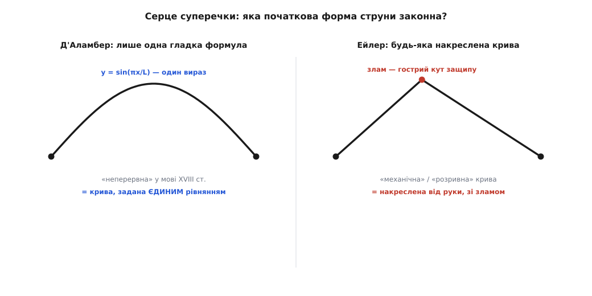

# 📜 Як народилося хвильове рівняння: перша частинна похідна у фізиці й суперечка про функцію

1747 року Жан ле Рон д'Аламбер, прикладаючи закон Ньютона до натягнутої струни, уперше в історії записав диференціальне рівняння в частинних похідних — і тим відкрив не тільки фізику хвиль, а й гарячу піввікову суперечку про те, що взагалі можна вважати законним розв'язком і законною функцією. Це історія про те, як з однієї защипнутої струни народилися одразу дві речі: цілий метод математичної фізики й нове означення одного з найголовніших слів усієї математики.

### До 1747-го: одна нота і глуха стіна

До д'Аламбера фізика вміла описувати рух **точки**: одне тіло, одна координата, що змінюється з часом, — і рівняння Ньютона, яке зв'язує прискорення цієї координати з силою. Планета, ядро, маятник — усе це поодинокі тіла, і закон для них записується як рівняння з **однією** незалежною змінною, часом.

Струна ж — не точка. Вона суцільна, і її стан у будь-яку мить — це ціла **форма**, висота над кожною точкою вздовж неї. Знати рух струни — значить знати відхилення y не в одному місці, а в усіх заразом, і не в одну мить, а завжди. Тобто y залежить **від двох речей одночасно**: де вздовж струни ми дивимося (координата x) і коли (час t). А для величини, що змінюється і в просторі, і в часі, у тодішньої математики просто не було рівняння — увесь апарат був заточений під «одна змінна, один час».

Найдалі до 1747-го дійшов англієць Brook Taylor (Брук Тейлор, 1685–1731). Ще 1713 року він знайшов, якої форми набирає струна, коли гойдається як єдине ціле: це [синусоїда](book:physics/sine-wave) — одна плавна дуга від закріпленого кінця до кінця, — і вивів, від чого залежить її нота. Але Тейлор упіймав **одну-єдину** дозволену форму, найпростішу, ту, що ми звемо основним тоном. Що буде, коли струну відтягти абияк і відпустити, як рухається вона тоді в кожній своїй точці — на це відповіді не було. Двері прочинили, а в кімнату не зайшли: бракувало **закону для всього руху одразу**, а не для однієї обраної форми.

### Стрибок д'Аламбера: похідна по двох змінних одразу

Жан ле Рон d'Alembert (д'Аламбер, 1717–1783) — француз, постать сама по собі незвичайна: немовлям його лишили на сходах паризької церкви Сен-Жан-ле-Рон, і від неї пішло ім'я. Його крок 1747 року був концептуальний, а не лише технічний. Щоб описати y(x, t), треба навчитися брати похідну **двома різними способами**: по координаті x, застигши час (це дає нахил і кривину форми — миттєвий знімок струни), і по часу t, застигши точку (це дає швидкість і прискорення саме цього шматочка). Одна й та сама величина y, дві різні похідні — новий математичний об'єкт, який згодом назвуть [частинною похідною](book:math/partial-derivative) й позначать окремим значком ∂, щоб не плутати зі звичайною.

Приклавши [закон Ньютона](book:physics/newtons-second-law) — маса · прискорення = сила — до кожного нескінченно малого шматочка струни, д'Аламбер отримав рівняння, що зв'язує ці дві похідні:

```
∂²y/∂t²  =  c² · ∂²y/∂x²         (c² = натяг / маса на одиницю довжини)
```

> 🔧 **Навіщо це.** У законі Ньютона зазвичай одна незалежна змінна — час; тут їх дві, і саме тому потрібні **частинні** похідні. Ліворуч — прискорення шматочка (похідна по часу, x застигле), праворуч — кривина форми (похідна по координаті, t застигле). Це той самий F = ma, лише розписаний не для однієї точки, а для суцільного середовища в кожній його точці.

Ліворуч тут прискорення шматочка, праворуч — кривина струни в цьому місці. Одне коротке рівняння каже, що кожен шматочок прискорюється тим сильніше, чим крутіше струна в цьому місці вигнута. Це була **перша поява хвильового рівняння в друку** й, за загальновизнаним поглядом істориків математики, перше в історії фізики диференціальне рівняння **в частинних похідних** — початок цілої нової галузі. (Праця вийшла в мемуарах Берлінської академії; д'Аламбер того ж року додав до неї продовження.)

### Загальний розв'язок: не одна форма, а всі одразу

Записати рівняння — половина справи; знайти його **загальний** розв'язок — друга половина, і тут д'Аламбер зробив ще один перший крок в історії: розв'язав рівняння в частинних похідних у загальному вигляді. Побачити, звідки береться розв'язок, найлегше в сучасному викладі, що йде по суті слідом за д'Аламбером, — перейти до двох **косих координат**, кожна з яких їде вздовж струни зі швидкістю c:

```
u = x − c·t      (позначка, що біжить праворуч зі швидкістю c)
v = x + c·t      (позначка, що біжить ліворуч зі швидкістю c)
```

У цих координатах усе рівняння стискається до вражаюче простого вигляду:

```
∂²y/∂u∂v = 0
```

Прочитаймо це речення: **як швидко y міняється вздовж одного косого напрямку — не залежить від того, де ми стоїмо вздовж другого**. Проінтегруймо один раз (по v): похідна ∂y/∂u виявляється функцією самого лише u. Проінтегруймо ще раз (по u): y збирається у суму двох окремих доданків — одного, що залежить тільки від u, і другого, що залежить тільки від v:

```
y(x, t) = f(x − c·t) + g(x + c·t)
```

Дві **довільні** форми: одна жорстко котиться праворуч, друга ліворуч, і повний рух струни — їхня накладка. Це і є розв'язок д'Аламбера. Найважливіше в ньому — оте слово **довільні**: саме рівняння не диктує, якою бути формі f чи g; форму задає початковий щипок, а рівняння лише велить їй їхати. І от у цьому «якою завгодно» й гримнула буря.

### «Годиться лише те, що вкладається в одну формулу»

Разом із розв'язком д'Аламбер поставив умову, об яку розбилося все подальше. Щоб його виведення взагалі мало сенс (форму треба двічі продиференціювати), початкова крива струни мала, вимагав він, задаватися **однією аналітичною формулою** — єдиним гладким виразом, чинним уздовж усієї струни.

Тут чигає пастка для сучасного вуха. Таку криву тодішня математика звала «неперервною» — але слово це означало **не те, що нині**. У XVIII столітті «неперервна» значило саме «задана одним рівнянням, одним законом од краю до краю». Крива, яку не можна вкласти в єдину формулу, для д'Аламбера просто не мала права стояти у фізичному рівнянні. А отже — і в цьому вся гострота — **защипнута струна в його теорію не вписувалася**: коли струну відтягти пальцем, вона набуває форми трикутника з гострим кутом у точці защипу, а такий кут однією гладкою формулою не опишеш. Найзвичайніший спосіб змусити струну звучати опинявся, строго кажучи, поза законом.

### Ейлер: «А струну ж защипують пальцем»

Отут і скинувся швейцарець Leonhard Euler (Леонард Ейлер, 1707–1783) — родом із Базеля, що працював тоді при Берлінській академії, там-таки, де д'Аламбер друкував свою струну. Його заперечення було фізичне, і крити його було нічим. Візьми, каже Ейлер, справжню струну, відтягни пальцем, відпусти — вона ж защипнута трикутником, з видимим зламом. Це реальний, буденний спосіб добути звук. То чому рівняння має вдавати, ніби такої форми не існує? Початкова крива, наполягав Ейлер, може бути **яка завгодно** — хоч накреслена від руки, хоч зліплена з кількох різних шматків, хоч із гострими кутами.


*Ліворуч — те, що визнавав законним д'Аламбер: крива з єдиної формули, «неперервна» в тодішньому сенсі. Праворуч — те, на чому наполягав Ейлер: справжня защипнута струна з гострим кутом, «механічна» крива, накреслена від руки. Уся суперечка — про те, чи має друга форма право стояти в рівнянні.*

Щоб узаконити такі криві, Ейлер розсунув саме **поняття функції**. Те, що лягало в одну формулу, він назвав функціями «неперервними»; те, що не лягало, — «розривними» чи «механічними». За іронією тодішньої мови, ці «розривні» криві були якраз тими, які ми **сьогодні** назвали б цілком неперервними: плавну ламану защипу око не бачить розірваною. У своєму «Вступі до аналізу нескінченних» (Introductio, 1748) Ейлер уперше чітко розвів ці два роди, а 1749-го надрукував працю, де прямо заперечив д'Аламберове обмеження. Історик математики Юшкевич підсумував це так: **саме тоді почалася довга суперечка про природу функцій, які можна допускати в початкові умови**.

І в цьому вся глибина. Бійка йшла не про струну — про значення слова **функція**. Що воно таке: єдина формула — чи будь-яке правило, що кожній точці приписує висоту, хай і намальоване олівцем? Д'Аламбер тримався формули; Ейлер тягнув до «будь-якої кривої». Для XVIII століття то була майже єресь, бо вся тодішня математика стояла на тотожності «функція = вираз». Суперечка про струну стала першою великою битвою за те, що ж це слово означає.

### Лагранж і невигойна щілина

У розігріту суперечку ступив і молодий Joseph-Louis Lagrange (Жозеф-Луї Лагранж, 1736–1813) — народжений у Турині, столиці Сардинського королівства (італієць за народженням, згодом натуралізований француз). У «Туринській збірці» (*Miscellanea Taurinensia*) він дав повніший розбір коливної струни й прямо вказав на **брак загальності** в розв'язках попередників — Тейлора, д'Аламбера й Ейлера. Він відточив аналіз, підійшовши до задачі через розбиття струни на скінченне число тягарців і граничний перехід до суцільної, — але й Лагранж не зумів остаточно замкнути центральне питання: **які ж криві законні**. Щілина, за яку чіплялися всі, лишалася відкритою.

### Розв'язка: будь-яка форма — таки функція

Третій голос у суперечці належав швейцарцеві Daniel Bernoulli (Данилу Бернуллі, 1700–1782): 1753 року він заявив, що будь-який рух струни є **сумою простих синусоїдальних мод** — основного тону й обертонів. Ця теза, і чому їй попервах не повірили, розкрита з боку додавання хвиль в окремій темі — [суперпозиція хвиль](book:physics/wave-superposition); тут досить сказати, що Бернуллі мав рацію, але довести не зумів.

А доказ, що **будь-яка** розумна крива — з кутом, а то й зі стрибком — таки виражається сумою синусів, отже, таки є законною функцією, прийшов зовсім з іншого боку: від тепла. Француз Joseph Fourier (Жозеф Фур'є, 1768–1830), розв'язуючи задачу про прогрівання тіла, розкладав початковий розподіл температури на синусоїди — і довів справу до кінця там, де Бернуллі спинився. У «Аналітичній теорії тепла» (*Théorie analytique de la chaleur*, 1822; головні ідеї він подав Паризькій академії ще 1807-го) Фур'є вимовив нове означення прямо: функція — це «послідовність довільних ординат», що не мусять коритися жодному спільному законові. Те, що Ейлерові й д'Аламберові здавалося неможливим, Фур'є подав як робочий інструмент — і цим виправдав Ейлерове «будь-яка накреслена крива». Думку про розклад на синуси розбирає тема [ідея Фур'є](book:math/fourier-idea).

Останню щілину — **коли саме** такий ряд справді збігається до заданої форми — акуратно замкнув німець Peter Gustav Lejeune Dirichlet (Петер Густав Лежен Діріхле, 1805–1859): 1829 року він уперше строго довів збіжність, виписавши умови, за яких ряд синусів точно відтворює криву. Те, що в Бернуллі було здогадом, у Фур'є — переконанням, у Діріхле стало теоремою.

### Що лишилося після суперечки

Отже, з однієї защипнутої струни народилося **двоє**. По-перше, фізика дістала своє перше рівняння в частинних похідних і перший його загальний розв'язок — той самий шаблон «друга похідна по часу дорівнює c², помноженому на просторову кривину», у який згодом виллються теплопровідність, електромагнітне поле, квантова хвиля. Струна відкрила саму мову математичної фізики.

По-друге — і це, може, важливіше — сварка д'Аламбера з Ейлером змусила математику **перекувати означення функції**. Питання «що є законна крива», гостро поставлене над струною, не давало спокою ще ціле століття й привело до сучасного розуміння: функція — це **будь-яке правило**, що кожному входу приписує значення, з формулою воно чи без. Одне з найпростіших слів усієї математики було виковане в суперечці про горбик, який палець лишає на струні.
