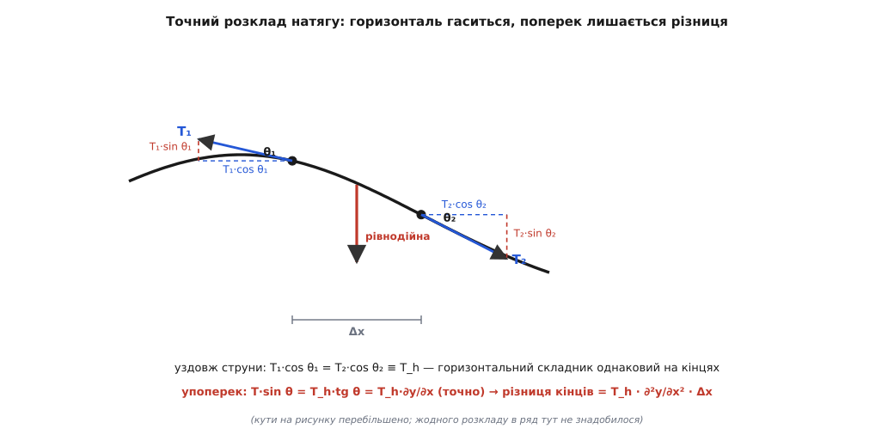
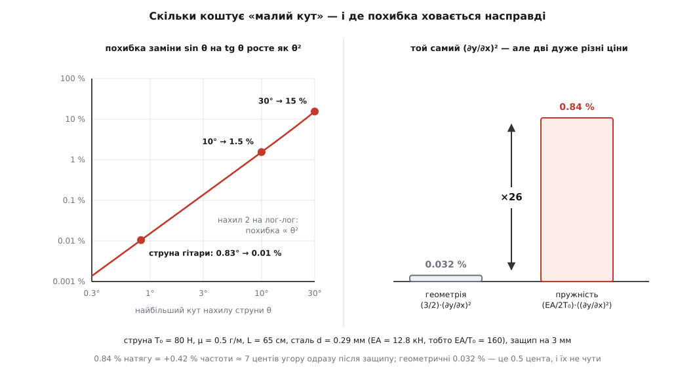

# 🧮 Строге виведення рівняння струни: де насправді ховається малий кут

Класичне виведення хвильового рівняння тричі перепрошує читача за малі кути: sin θ замінюють на tg θ, cos θ — на одиницю, довжину дуги — на її проєкцію Δx. Пройдімо цей шлях без жодного перепрошування: випишемо точні рівняння шматочка струни, а тоді порахуємо до останнього доданка, що саме викидається й скільки це коштує. Кінець виявиться несподіваним — усі три «малокутові» гріхи зникають самі, щойно навести лад у бухгалтерії, а справжня похибка приходить зовсім з іншого боку і в десятки разів більша за ту, якої всі бояться.

### Точна кінематика: два зміщення замість одного

Занумеруймо струну не точками простору, а самою речовиною. Нехай x — це те місце, де шматочок струни сидів, коли струна була пряма й уже натягнута; ця мітка приклеєна до речовини й нікуди не дінеться, хай як струна викривиться. Рухаючись, шматочок з міткою x опиняється в точці

```
r(x, t) = ( x + u(x, t),  y(x, t) )
```

де y — звичне поперечне відхилення, а u — зміщення **уздовж** струни. Класичне виведення мовчки кладе u ≡ 0; ми ж лишимо це зміщення в рівняннях, бо, як з'ясується, усе наближення сидить саме в ньому.

Дотичний напрямок дає похідна положення по мітці: диференціюємо r по x, тримаючи час застиглим. Похідну по одній змінній при нерухомій другій звуть [частинною](topic:math/partial-derivative) і позначають закарлючкою ∂ — саме тому вона стоїть у всіх формулах нижче. Отже, вектор уздовж струни:

```
∂r/∂x = ( 1 + ∂u/∂x ,  ∂y/∂x )
```

Його довжина — це те, у скільки разів шматочок розтягнувся проти свого початкового стану:

```
σ = √( (1 + ∂u/∂x)² + (∂y/∂x)² )
```

σ = 1 означає «не розтягнутий»; довжина дуги, що припадає на мітковий інтервал Δx, дорівнює σ·Δx. Одиничний вектор дотичної — це той самий вектор, поділений на його довжину:

```
τ = ( (1 + ∂u/∂x)/σ ,  (∂y/∂x)/σ )
```

Мірою «малості», за якою ми далі розкладатимемо все в ряди, буде найбільший нахил струни

```
ε = max | ∂y/∂x |
```

Це чисте число без одиниць: для защипнутої гітарної струни ε ≈ 0.01, тобто півградуса. Кожен викинутий доданок дістане свій порядок за ε — і ми знатимемо ціну кожного спрощення.

### Точна динаміка: два рівняння на шматочок

Тут потрібне одне фізичне припущення, і воно **не про кути**. Струна вважається ідеально гнучкою: сила, яку одна її частина передає іншій крізь переріз, спрямована строго вздовж дотичної, а її величина — це натяг T. Прут так не вміє: він передає ще й момент згину — за це ми заплатимо окремо наприкінці.

Отже, на шматочок між мітками x і x + Δx правий сусід діє силою +T·τ, узятою в точці x + Δx, а лівий — силою −T·τ, узятою в точці x.

Тепер маса — і тут перша класична неохайність. Маса цього шматочка дорівнює μ·Δx **точно**, де μ — маса на одиницю мітки, тобто лінійна густина ненапруженої струни. Маса належить речовині, а не довжині: хоч як розтягуй шматочок, у ньому лишаються ті самі атоми. Підручникове «dm = μ·ds ≈ μ·dx» міряє масу довжиною деформованої дуги — і тому потребує вибачення за ds ≈ dx. Міткова бухгалтерія не потребує жодного.

[Другий закон Ньютона](topic:physics/newtons-second-law) — маса шматочка на його прискорення дорівнює сумі прикладених до нього сил — прирівнює μ·Δx·(прискорення) до різниці вектора T·τ на двох кінцях. Поділивши обидва боки на Δx і спрямувавши Δx до нуля (різниця значень на кінцях, поділена на Δx, — це за означенням похідна), дістаємо пару рівнянь для двох складників:

```
μ · ∂²u/∂t²  =  ∂/∂x [ T · (1 + ∂u/∂x)/σ ]      (уздовж струни)
μ · ∂²y/∂t²  =  ∂/∂x [ T · (∂y/∂x)/σ ]          (упоперек)
```

Ці два рядки **точні**: жодного припущення про кути, будь-яка амплітуда, хоч складка на 45°. Зовнішніх сил тут немає — тяжіння дає окремий статичний прогин, а тертя — окремий доданок із першою похідною по часу; ні те, ні те не змінює механізму.

Але невідомих три — u, y і T, — а рівнянь два. Бракує третього співвідношення, і саме воно потім усе вирішить.

### Точний розклад натягу на складники

Спершу подивімося на геометрію, яку класичне виведення наближає. Нехай струна рухається тільки впоперек (u ≡ 0), і θ — кут між нею та віссю x. Тоді tg θ = ∂y/∂x за означенням нахилу, а складники одиничної дотичної — це точно косинус і синус:

```
cos θ  =  1 / √(1 + (∂y/∂x)²)
sin θ  =  (∂y/∂x) / √(1 + (∂y/∂x)²)
ds/dx  =  √(1 + (∂y/∂x)²)
```

Розкладімо кожен вираз у [ряд](topic:math/taylor-series) — нескінченну суму степенів змінної, у якій кожен наступний доданок дає дедалі дрібнішу поправку до попередніх. Для степеня двочлена ряд має вигляд (1 + z)^α = 1 + αz + α(α−1)/2·z² + …, і при z = (∂y/∂x)² це дає

```
(1 + z)^(−1/2) = 1 − ½z + ⅜z² − 5/16·z³ + …
(1 + z)^(+1/2) = 1 + ½z − ⅛z² + 1/16·z³ − …
```

тобто, позначаючи далі похідну по координаті штрихом (y′ = ∂y/∂x, а згодом і u′ = ∂u/∂x):

```
cos θ  =  1 − ½y′² + ⅜y′⁴ − …
sin θ  =  y′ − ½y′³ + ⅜y′⁵ − …
ds/dx  =  1 + ½y′² − ⅛y′⁴ + …
```

Кожна з трьох класичних замін коштує **однаково**: відносна похибка ½y′², тобто ½ε². І — головне — у жодному з трьох рядів немає першого степеня. Причина не в удачі: уся геометрія залежить від нахилу лише через комбінацію 1 + y′² (це теорема Піфагора для дотичної), а їй байдуже, вгору схил чи вниз. Непарний доданок відрізняв би підйом від спуску, а геометрія їх не розрізняє — тож він і не може з'явитися.

Через це «малий кут» набагато дешевший, ніж звучить. Ось точні числа:

```
кут θ    нахил tg θ    1 − cos θ  (sin проти tg)    sec θ − 1  (дуга проти проєкції)
 0.5°      0.0087         0.0000381   (0.0038 %)       0.0000381
 1°        0.0175         0.000152    (0.015 %)        0.000152
 3°        0.0524         0.00137     (0.14 %)         0.00137
 5°        0.0875         0.00381     (0.38 %)         0.00382
10°        0.1763         0.0152      (1.5 %)          0.0154
20°        0.3640         0.0603      (6.0 %)          0.0642
30°        0.5774         0.1340      (13 %)           0.1547
```

Навіть при десяти градусах — а це вже добре помітна на око дуга — похибка тримається півтора відсотка.

А тепер спостереження, яке одним рухом викидає з виведення обидва перші наближення. Поперечний складник натягу можна записати через горизонтальний, і це тотожність, а не наближення, бо тангенс — це відношення синуса до косинуса:

```
T · sin θ  =  (T · cos θ) · tg θ  =  T_h · ∂y/∂x
```

Отже, якщо горизонтальний складник T_h = T·cos θ **однаковий на обох кінцях** шматочка, то поперечна рівнодійна дорівнює T_h·[y′(x + Δx) − y′(x)] точно, без будь-якого ряду. І однаковість T_h — теж не припущення про кути: вона просто випливає з поздовжнього рівняння, якщо шматочок не прискорюється вздовж струни.


*Натяг на кінцях шматочка спрямований уздовж дотичної, тож у кожного є горизонтальний складник T·cos θ і поперечний T·sin θ. Поздовжнє рівняння прирівнює горизонтальні складники на кінцях — лишається одне спільне число T_h. А поперечний складник дорівнює T_h·tg θ = T_h·∂y/∂x точно, тому їхня різниця на кінцях і є T_h·∂²y/∂x²·Δx.*

### Класичне виведення, зроблене строго — і воно виявляється точним

Підставмо u ≡ 0 у точну пару. Тоді σ = √(1 + y′²), складники дотичної — це рівно cos θ і sin θ, і поздовжнє рівняння каже:

```
∂/∂x [ T · cos θ ] = 0     →     T · cos θ  =  T_h   (те саме число по всій струні)
```

Від часу це спільне число ще має право залежати — рівняння забороняє йому лише мінятися **вздовж** струни. Якщо ж воно стале й у часі, поперечне рівняння після заміни T·sin θ = T_h·y′ стає

```
μ · ∂²y/∂t²  =  ∂/∂x [ T_h · ∂y/∂x ]  =  T_h · ∂²y/∂x²
```

тобто

```
∂²y/∂t²  =  c² · ∂²y/∂x²,        c² = T_h/μ
```

**Жодного малого кута не знадобилося.** Хвильове рівняння — це точний наслідок трьох припущень (ідеальна гнучкість, суто поперечний рух, незмінний у часі T_h), і воно правдиве за будь-якої амплітуди. Три «малокутові наближення» підручникового виведення виявляються артефактами обліку: масу міряли довжиною дуги замість кількості речовини, а синус із косинусом наближали нарізно замість того, щоб узяти їхнє відношення.

Є навіть матеріал, для якого ця точність не гіпотетична. Нехай натяг струни пропорційний кратності розтягу, T = T₀·σ. Оскільки cos θ = 1/σ, горизонтальний складник дорівнює T·cos θ = T₀·σ/σ = T₀ — те саме число по всій струні, хоч би якої форми вона набрала. Поздовжнє рівняння тоді виконується тотожно (похідна сталої — нуль), суто поперечний рух справді можливий, і рівняння лишається лінійним навіть при складці. Питання точності, виходить, стоїть не так, як його ставлять: не «чи малий кут», а «наскільки закон натягу цієї струни далекий від T ∝ σ».

### Де ж тоді наближення: третє співвідношення

Реальна струна тягнеться за [законом Гука](topic:physics/hookes-law) — сила пружності зростає пропорційно до видовження, поки деформація невелика. Для струни це означає

```
T  =  T₀ + EA·(σ − 1)
```

де T₀ — натяг у прямому стані, а EA — добуток модуля Юнга на площу перерізу, тобто жорсткість струни на розтяг: та сила, яку довелося б прикласти, щоб (у лінійній екстраполяції) подвоїти довжину. Для сталевої струни EA у сотні разів більше за робочий натяг — і саме це відношення все зіпсує.

Перевірмо тепер, чи узгоджується з таким законом припущення u ≡ 0. Розкладімо σ, тримаючи обидва зміщення:

```
σ = √( (1 + u′)² + y′² )  =  1 + u′ + ½y′² + …
```

Отже, місцеве видовження дорівнює

```
e ≡ σ − 1  =  u′ + ½y′²
```

Ось у чому річ: **навіть при u ≡ 0 струна розтягнута** — на ті самі ½y′², бо дуга довша за свою проєкцію. Пружна відповідь на це видовження — приріст натягу EA·½y′², а горизонтальний складник тоді дорівнює

```
T_h = T·cos θ = (T₀ + EA·½y′²)·(1 − ½y′² + …) = T₀ + (EA − T₀)·½y′² + …
```

і він **уже не однаковий уздовж струни**: там, де схил крутіший, горизонтальна тяга більша. А нерівна горизонтальна тяга розганяє речовину вздовж струни, тобто u ≢ 0. Ось воно, справжнє місце наближення: класичне виведення припускає суто поперечний рух, а пружна струна суто поперечно рухатися не вміє.

Підставивши обидва зміщення в точну пару й лишивши першу поправку, дістаємо

```
μ · ∂²y/∂t²  =  T₀ · ∂²y/∂x²  +  (EA − T₀) · ∂/∂x [ (u′ + ½y′²) · y′ ]  +  …
```

Відношення викинутого доданка до головного має порядок (EA/T₀)·y′². Не ε², а ε², помножене на EA/T₀.

### Скільки коштує кожне спрощення

Щоб порівняти доданки числом, треба позбутися u. Це можна зробити чесно. Поздовжні хвилі біжать по струні зі швидкістю √(EA/μ), а поперечні — з √(T₀/μ); їхнє відношення — це √(EA/T₀), тобто добрий десяток. На часовому масштабі поперечних коливань поздовжнє поле встигає прийти в рівновагу, тож у поздовжньому рівнянні можна покласти ліву частину нулем. Розкладений його правий бік дає

```
T · (1 + u′)/σ  =  T₀ + EA·e − ½T₀·y′² + …
```

і умова рівноваги «похідна по x дорівнює нулю» означає, що вираз EA·e − ½T₀·y′² однаковий уздовж струни. Далі — сама алгебра; кутові дужки означають середнє по довжині струни:

```
EA·e − ½T₀·y′²  =  C                    (те саме число в усіх точках)
⟨e⟩ = ⟨u′⟩ + ½⟨y′²⟩ = ½⟨y′²⟩            (інтеграл від u′ — це різниця зміщень
                                          на кінцях, а кінці закріплені)
усереднюємо перший рядок:  EA·½⟨y′²⟩ − ½T₀·⟨y′²⟩ = C
звідси натяг:  T = T₀ + EA·e = T₀ + C + ½T₀·y′²
               T = T₀ + (EA/2)·⟨y′²⟩ + ½T₀·y′²        (при EA ≫ T₀)
```

Ось воно, те саме T_h, якому поздовжнє рівняння лишало право залежати від часу: з точністю до дрібного місцевого доданка ½T₀·y′² натяг однаковий уздовж струни, зате росте з амплітудою й опадає, коли коливання згасають. Підставивши його назад у поперечне рівняння, дістаємо чесний вигляд із першою поправкою (для EA ≫ T₀, з точністю до відносних поправок T₀/EA):

```
μ · ∂²y/∂t²  =  [ T₀ + (EA/2)·⟨y′²⟩ ] · ∂²y/∂x²  +  (3/2)·T₀·y′² · ∂²y/∂x²
```

Два доданки-поправки містять той самий квадрат нахилу, але з разюче різними множниками: **геометричний** — з коефіцієнтом (3/2), **пружний** — з коефіцієнтом EA/2T₀. Перший — це вся ціна того, що дуга крива, а не пряма, тобто рівно те, чого бояться в підручниках. Другий — ціна того, що струна пружна й опирається розтягові набагато сильніше, ніж її тягнуть.

**Приклад (сталева струна, защипнута на 3 мм).** Візьмімо струну з натягом T₀ = 80 Н і лінійною густиною μ = 0.5 г/м на мензурі L = 65 см; сталь має модуль Юнга E = 2·10¹¹ Па й густину 7800 кг/м³. Защипнімо її по основній моді, y = a·sin(πx/L), з амплітудою a = 3 мм.

```
переріз:   A = μ/ρ = 0.0005/7800 = 6.4·10⁻⁸ м²   →   діаметр 0.29 мм
жорсткість: EA = 2·10¹¹ · 6.4·10⁻⁸ = 1.28·10⁴ Н = 12.8 кН
                 EA/T₀ = 12800/80 = 160

нахили:    y′ найбільший = a·π/L = 0.003·3.1416/0.65 = 0.0145   (кут 0.83°)
           ⟨y′²⟩ = a²π²/(2L²) = 1.05·10⁻⁴

геометрична поправка:  (3/2)·(0.0145)² = 3.2·10⁻⁴ = 0.032 %
пружна поправка:       (EA/2T₀)·⟨y′²⟩ = 80·1.05·10⁻⁴ = 8.4·10⁻³ = 0.84 %
```

Пружний доданок у 26 разів більший за геометричний — і, на відміну від нього, чутний. Приріст натягу на 0.84 % піднімає частоту на половину цього, бо частота [стоячої хвилі](topic:physics/standing-wave) — тієї, що дзвенить у закріпленій з обох кінців струні й задає ноту — пропорційна √T:

```
Δf/f = ½ · 0.84 % = 0.42 %
у центах (сота частка півтону, тобто 1/1200 октави):
   1200 · log₂(1.0042) ≈ 7 центів
```

Сім центів — це чутна фальш: налаштувальник ловить її без приладу. А геометричні 0.032 % дають пів цента й не чутні нікому. Виходить парадокс: ритуальні перепрошування за малі кути захищають нас від **найменшої** з похибок, тоді як найбільша — пружне посилення в EA/T₀ разів — у класичному виведенні не згадується взагалі.


*Ліворуч похибка заміни sin θ на tg θ як функція кута: пряма з нахилом 2 на логарифмічній сітці — це і є закон ½θ². При реальному защипі (кут менший за градус) вона мікроскопічна, соті частки відсотка. Праворуч ті самі ⟨y′²⟩ у двох доданках поправки: геометричний стовпчик ледь видно, пружний — у 26 разів вищий, бо його помножено на EA/T₀ ≈ 160.*

> 🔧 **Навіщо це.** Формула T = T₀ + (EA/2)·⟨y′²⟩ — це не педантизм, а робочий інструмент. З неї випливає, що частота защипнутої струни залежить від сили защипу: одразу після удару нота вища, а далі, у міру згасання коливань, сповзає вниз. Той, хто моделює струну в синтезаторі, саме цим доданком дістає характерне сповзання висоти на початку ноти — без нього атака звучить неживо. Той, хто напинає трос чи ванту, з тієї самої формули оцінює, наскільки зросте зусилля в кріпленні при великому розгойдуванні. І в обох випадках ключове число — не кут нахилу, а відношення EA/T₀.

### Що ще ми мовчки припустили

Лишилося чесно назвати решту припущень і дати кожному ціну.

**Ідеальна гнучкість.** Справжня струна опирається згину, і сила опору додається в рівняння окремим доданком:

```
μ · ∂²y/∂t²  =  T₀ · ∂²y/∂x²  −  EI · ∂⁴y/∂x⁴
```

де I = ∫ (відстань до осі)²·dA — другий момент площі перерізу (для круглого дроту діаметром d він дорівнює πd⁴/64). Підставивши сюди біжучий синус y = sin(k·x − ω·t) — друга похідна дає −k², четверта k⁴, — дістаємо зв'язок частоти з хвильовим числом:

```
ω²  =  (T₀/μ)·k² · [ 1 + (EI/T₀)·k² ]
```

Поправка мала, поки довжина хвилі значно більша за 2π·√(EI/T₀). Для нашої струни EI = 6.5·10⁻⁵ Н·м², і ця межа становить 5.7 мм — проти 1.3 м довжини хвилі основного тону. Але зростає ця поправка як квадрат номера моди: для струни з шарнірно закріпленими кінцями k_n = nπ/L, тож

```
f_n  =  n · f₁ · √(1 + B·n²),      B = π²·EI/(T₀·L²) = 1.9·10⁻⁵
```

і двадцята мода звучить вище за рівно двадцятикратну частоту вже на 6.6 цента. Доданок, який ми викинули як нікчемний для форми імпульсу, повертається як чутне відхилення високих гармонік від чистої кратності.

**Рух в одній площині.** Струна коливається у двох поперечних напрямках; кожен має власну копію рівняння, і зв'язані вони саме через нелінійний доданок — у видовження входить сума квадратів обох нахилів, ⟨y′² + z′²⟩. Тому дві поляризації обмінюються енергією рівно тією мірою, якою пружна поправка взагалі помітна.

**Однорідність і відсутність втрат.** μ вважалася сталою вздовж струни (обмотана басова струна цього не поважає), тяжіння відкинуто (воно додає статичний прогин, який у цьому порядку просто накладається), тертя об повітря й внутрішні втрати теж (вони додають доданок із ∂y/∂t, від якого амплітуда згасає, а разом із нею — і вся пружна поправка).
