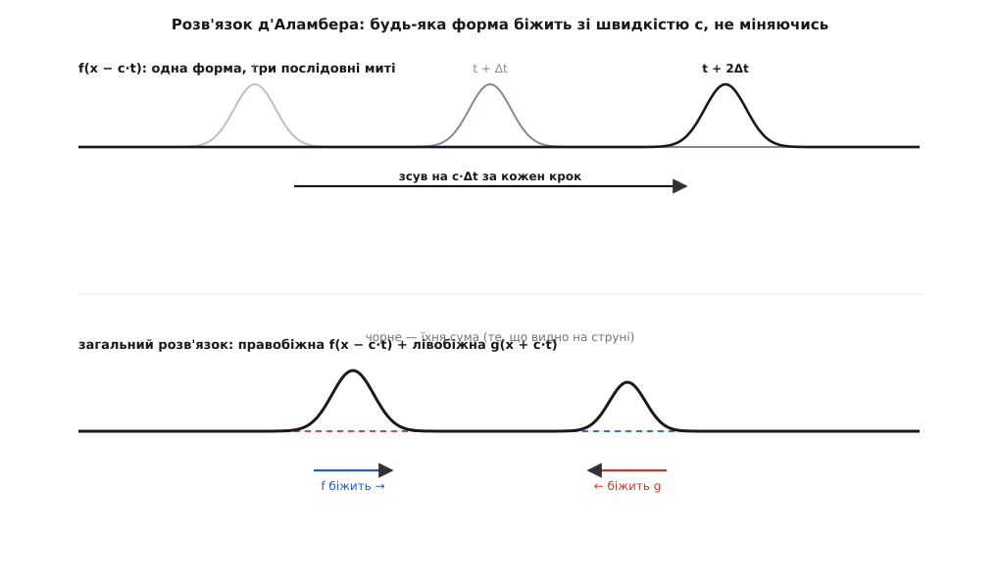
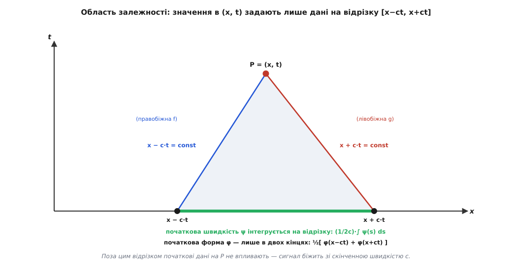

# Хвильове рівняння: чому збурення біжить, тримаючи форму

<preknowlist>
- [Похідна](topic:math/derivative) — миттєва швидкість зміни величини в часі й по координаті.
- [Другий закон Ньютона](topic:physics/newtons-second-law) — маса · прискорення = сила.
- [Синусоїда](topic:physics/sine-wave) — форма біжучої хвилі, її амплітуда й частота.
</preknowlist>

Защипнута гітарна струна не просто повертається в стан спокою — вигнутий пальцем горбик одразу біжить убік зі сталою швидкістю і майже не змінює своєї форми. Кинутий у воду камінець розсилає кола, що розходяться з однаковим темпом, а сплеск долоней народжує звук, який долітає до стіни за чітко визначений час. Усі ці явища об'єднує один дивовижний механізм: місцеве збурення середовища самостійно поширюється у просторі, не вимагаючи жодної зовнішньої сили для підтримки руху. Причина такого бігу випливає з другого закону Ньютона, прикладаного до суцільного середовища, а саме рівняння, що описує цей процес, зветься **хвильовим рівнянням**.

### Механізм на струні: як вигин народжує силу

Щоб зрозуміти фізичну суть рівняння, розглянемо найпростіше середовище — туго натягнуту струну з масою на одиницю довжини `μ` (лінійна густина, кг/м) та силою натягу `T`. Поки струна ідеально пряма, натяг тягне кожен її шматочок в обидва боки вздовж однієї лінії. Горизонтальні й поперечні сили повністю зрівноважують одна одну, тому рівнодійна поперечна сила дорівнює нулю, і струна перебуває у спокої.

Усе змінюється, коли струна вигинається. На вигнутій ділянці сила натягу на лівому й правому кінцях малого шматочка спрямована під різними кутами до осі. Горизонтальні складники сил майже гасять один одного, а поперечні вже не компенсуються — виникає повертальна сила, яка прагне випрямити струну. Головний фізичний висновок полягає в тому, що ця сила пропорційна не самому відхиленню від рівноваги, а **кривині** струни — тобто тому, наскільки швидко змінюється її нахил від точки до точки. Пряма ділянка, навіть піднята високо, не дає повертальної сили, тоді як крутий вигин викликає потужний розгін.


*Коли струна пряма, сили натягу на кінцях шматочка напрямлені вздовж однієї прямої й компенсуються. На вигнутій ділянці кути нахилу різняться, тому виникає поперечна рівнодійна сила, спрямована до рівноваги. Що більша кривина, то більша ця сила.*

### Виведення рівняння: F = ma для шматочка

Переведемо цей механізм у математичну форму. Відхилення струни `y` залежить від двох змінних: координати `x` та часу `t`. Прискорення конкретної точки струни — це друга похідна за часом `∂²y/∂t²`, а кривина струни в цій точці — друга похідна за координатою `∂²y/∂x²`.

Виділимо малий шматочок струни довжиною `Δx`. Його маса дорівнює `μ · Δx`. Поперечна повертальна сила, породжена кривиною на цій довжині, становить `T · (∂²y/∂x²) · Δx`. Записавши другий закон Ньютона (маса, помножена на прискорення, дорівнює силі), отримуємо:

```
(μ · Δx) · ∂²y/∂t²  =  T · (∂²y/∂x²) · Δx
```

Довжина шматочка `Δx` скорочується з обох боків, залишаючи співвідношення між прискоренням і кривиною у будь-якій точці:

```
∂²y/∂t²  =  (T / μ) · ∂²y/∂x²
```

Комбінація `T / μ` має розмірність квадрата швидкості. Позначивши `c² = T / μ`, дістаємо класичне **хвильове рівняння**:

```
∂²y/∂t²  =  c² · ∂²y/∂x²
```

Рівняння каже: кожен шматочок середовища прискорюється пропорційно до кривини в цій точці. Коефіцієнт `c` визначає швидкість поширення збурення. Вона залежить виключно від двох властивостей середовища: жорсткості (натягу `T`) та інерції (густини `μ`). Що сильніший натяг, то швидше повертається струна; що вона важча, то повільніше наростає рух. Детальний математичний розклад складників натягу наведено у [математичній вставці про виведення](topic:physics/wave-equation/math-string-derivation.md).

**Приклад.** Сталева струна має лінійну густину `μ = 0.5` г/м (`0.0005` кг/м) і натягнута силою `T = 80` Н. Швидкість збурення на ній дорівнює:

```
c = √(T / μ) = √(80 / 0.0005) = √160000 = 400 м/с
```

Збурення на такій струні мчить зі швидкістю 400 метрів за секунду. Якщо зменшити натяг у чотири рази, швидкість впаде вдвічі — до 200 м/с.

### Розв'язок д'Аламбера: чому форма біжить

Чому хвильове рівняння гарантує біг збурення без зміни форми? Уявімо профіль `f(x)`, який рухається праворуч зі швидкістю `c`. У момент часу `t` цей профіль описується функцією `y(x, t) = f(x − c·t)`. Аргумент `x − c·t` підтримує стале значення профілю для точок, де координата `x` зростає синхронно з `c·t`.

Перевіримо, чи задовольняє така функція хвильове рівняння. Обчисливши другі частинні похідні за правилом диференціювання складеної функції, маємо:

```
∂²y/∂t² = c² · f″(x − c·t)      [похідна по t дає множник (−c)² = c²]
∂²y/∂x² =      f″(x − c·t)      [похідна по x дає множник 1² = 1]
```

Підставивши їх у хвильове рівняння, отримуємо тотожність `c² · f″ = c² · f″`. Це означає, що **будь-яка** двічі диференційовна функція `f(x − c·t)` є розв'язком. Аналогічно функція `g(x + c·t)` описує хвилю, що біжить ліворуч.

Загальний розв'язок рівняння, здобутий 1747 року французьким математиком Жаном ле Роном д'Аламбером (фр. Jean le Rond d'Alembert), має вигляд суми двох таких хвиль:

```
y(x, t) = f(x − c·t) + g(x + c·t)
```

Форма збурення зберігається тому, що рівняння прямо пов'язує часову зміну з просторовою кривиною через сталий коефіцієнт `c²`. Коли задня частина горба опадає до рівноваги, передній схил змушує сусідні точки підійматися. Завдяки інерції середовище перелітає стан рівноваги, і збурення відтворюється далі по струні. Історію відкриття цього рівняння та піввікову наукову суперечку про допустимі форми хвилі розкрито в [історичній вставці про д'Аламбера](topic:physics/wave-equation/hist-dalembert-string.md).


*Форма f переміщується праворуч на відстань c·t без деформацій, оскільки залежить від комбінації x − c·t. Загальний розв'язок складається з двох таких хвиль, що рухаються назустріч.*


*Трикутник залежності точки (x, t) від початкових даних на відрізку [x − c·t, x + c·t]. Значення хвилі у вибраній точці визначається лише тими збуреннями, які встигли донести характеристики x ± c·t = const.*

### Синусоїдальні хвилі та гармоніки

Особливе місце серед усіх можливих форм займає **синусоїда**. Якщо підставити в хвильове рівняння гармонічну хвилю `y(x, t) = A · sin(k·x − ω·t)`, де `k` — хвильове число, а `ω` — кутова частота, то друга похідна по часу дає `−ω²`, а по координаті — `−k²`. Рівняння вимагає:

```
ω = c · k
```

Це співвідношення показує, що фазова швидкість хвилі `ω / k` дорівнює `c` і є однаковою для всіх частот. Оскільки рівняння лінійне, будь-яку складну форму хвилі можна розкласти на суму окремих синусоїд. А оскільки кожна синусоїда біжить з однією і тією ж швидкістю `c`, їхня сума рухається як єдине ціле, не розпадаючись на частини. Якщо ж надати такій хвилі чисельну форму на комп'ютерній сітці, виникає потреба обчислювати кривину різницевим шаблоном, про що детально написано в [алгоритмічній вставці про чисельне моделювання](topic:physics/wave-equation/proj-wave-sim.md).

### Універсальність і дисперсія

Фундаментальна будова `c² = жорсткість / інерція` є однаковою для всіх механічних хвиль у природі. У випадку звукових хвиль у газі роль жорсткості відіграє модуль об'ємної пружності, а роль інерції — густина середовища `ρ`. Оскільки стискання й розрідження газу в звуковій хвилі відбуваються швидко, тепло не встигає перетікати між сусідніми ділянками. Процес є адіабатичним (гр. *adiábatos* — непрохідний для тепла). П'єр-Симон Лаплас врахував цей факт і виправив початкову формулу Ньютона, додавши показник адіабати `γ`:

```
c_звуку = √(γ · P / ρ)
```

Збереження початкової форми хвилі можливе лише за умови, що швидкість `c` не залежить від частоти. Якщо у середовищі швидкість поширення залежить від частоти або довжини хвилі, спостерігається **дисперсія** (лат. *dispersio* — розсіювання). У дисперсному середовищі (наприклад, для світла у склі або для хвиль на глибокій воді) гармонічні складники імпульсу біжать із різними швидкостями, через що початковий згусток з часом розпливається.

У тривимірному просторі хвильове рівняння записується за допомогою оператора Лапласа `∇²` (суми других частинних похідних по трьох координатах):

```
∂²u/∂t²  =  c² · ∇²u
```

Це рівняння є однакове для сейсмічних хвиль у земній корі, акустичних коливань у повітрі та електромагнітних хвиль у вакуумі. Формула `∂²u/∂t² = c²·∇²u` виражає загальний закон фізики: місцева просторова кривина поля безпосередньо диктує його прискорення у часі.
