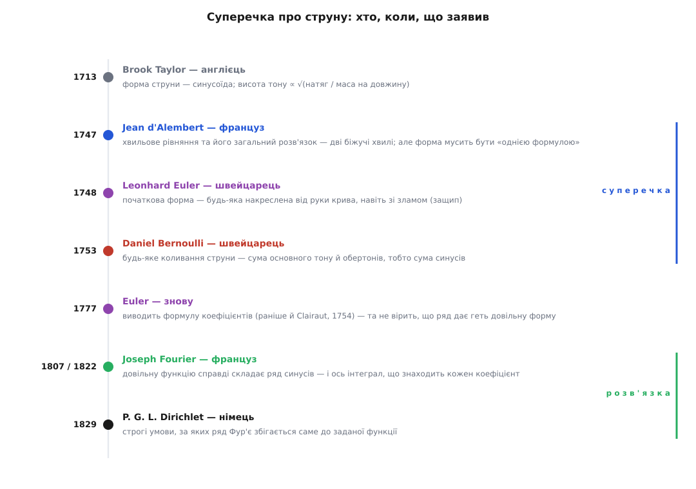
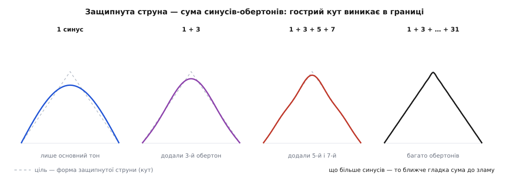

# 📜 Суперечка про струну: від Бернуллі до Фур'є

Що будь-яку хвилю можна зібрати із простих синусів, сьогодні звучить майже банально: розклав звук на тони — і по всьому. А тепер уявіть, що ця сама думка колись розсварила найгостріші голови століття на цілих шістдесят років. Не тому, що хтось був дурний, — навпаки, сперечалися Ейлер і д'Аламбер, двоє найкращих математиків Європи, і третій, Бернуллі, теж не з простих. Сперечалися завзято, часом уїдливо, і роками не могли дійти згоди про річ, яку тепер малюють школяреві.

Дивина в тім, що про **фізику** струни всі троє загалом погоджувалися. Ніхто не сумнівався, що струна коливається, що звук має основний тон і обертони, що працює додавання. Бійка йшла глибше — за питання, яке спершу здається чисто технічним, а насправді сягає підмурку всієї математики: **що взагалі таке функція, і чи справді сума самих лише синусів може дати будь-яку форму** — навіть гострий кут защипнутої струни? Одні казали «так, будь-яку», інші — «це неможливо, ви себе дурите». Розв'язати суперечку зумів лише той, хто прийшов зовсім з іншого боку — від теплоти, а не від струни.


*Півтора століття однієї думки: від першої синусоїди Тейлора через гарячу суперечку 1740–50-х до Фур'є, що дав формулу, і Діріхле, що дав строгість.*

### Тейлор і перша чиста нота

Почалося все спокійно, з англійця **Brook Taylor** (Брук Тейлор, 1685–1731). Ще 1713 року — доповідь у Королівському товаристві він читав роком раніше, а надрукували її у «Philosophical Transactions» за 1713-й — він поставив собі просте питання: якої форми набирає натягнута струна, коли гойдається як єдине ціле, і від чого залежить її нота. Відповідь вийшла красива. Форма — **синусоїда**: струна вигинається однією плавною дугою, посередині найвище, на закріплених кінцях у нуль. А висота тону, дійшов Тейлор, росте як корінь із натягу й падає з довжиною та важкістю струни:

```
частота ∝ (1/довжина) · √( натяг / маса на одиницю довжини )
```

Це те, що чути й пальцями: підкрутиш кілок (натяг більший) — нота вища; притиснеш лад (струна коротша) — вища; товста басова струна (маса більша) — нижча. Тейлор упіймав **одну** дозволену форму — найпростішу, ту, що ми звемо основним тоном. Але він не питав, що буде, коли струна гойдається не однією дугою, а хитромудріше. Одна чиста нота, один синус — на цьому він і спинився. Двері прочинив, а в кімнату не зайшов.

### Хвиля д'Аламбера й залізна вимога «однієї формули»

Зайшов туди француз **Jean le Rond d'Alembert** (Жан ле Рон д'Аламбер, 1717–1783) — постать сама по собі незвичайна: немовлям його підкинули на сходи паризької церкви Сен-Жан-ле-Рон, від якої й пішло ім'я. 1747 року він зробив крок, що заклав цілий розділ фізики: вивів **рівняння**, якому підкоряється струна в кожній своїй точці й у кожну мить:

```
∂²y/∂t² = c² · ∂²y/∂x²          (c² = натяг / маса на одиницю довжини)
```

І — що не менш важливо — знайшов його загальний розв'язок. Виявилося, що будь-який рух струни складається з двох однакових профілів, які просто біжать назустріч, один праворуч, другий ліворуч:

```
y(x, t) = f(x − c·t) + g(x + c·t)
```

Це глибоко й гарно: форма струни в будь-яку мить — сума двох застиглих кривих, що ковзають у різні боки зі швидкістю c. Здавалося б, повна перемога. Але тут д'Аламбер поставив умову, об яку й розбилося все подальше. Він вимагав, щоб початкова крива струни задавалася **однією аналітичною формулою** — гладким виразом, який можна двічі продиференціювати. Мовою тодішньої математики така крива звалася «неперервною» — і тут чигає пастка для сучасного вуха: у XVIII столітті слово «неперервна» означало не те, що нині, а саме «задана єдиним рівнянням». Крива, яку не вкласти в одну формулу, для д'Аламбера просто не мала права стояти у фізичному рівнянні. А отже, строго кажучи, защипнутій струні — з гострим кутом у місці, де її відтягли пальцем, — у його теорії місця не було: кут однією гладкою формулою не опишеш.

### Ейлер розширює: крива, накреслена від руки

Отут і скинувся швейцарець **Leonhard Euler** (Леонард Ейлер, 1707–1783), що працював тоді при Берлінській академії. Його заперечення було по суті фізичним, і крити його було нічим. Візьми, каже Ейлер, справжню струну, відтягни пальцем і відпусти — вона ж защипнута трикутником, з видимим зламом у точці защипу. Це реальний, звичайний спосіб змусити струну звучати. То чому рівняння має вдавати, ніби такої форми не існує? Початкова крива, наполягав Ейлер, може бути **яка завгодно** — хоч накреслена від руки, хоч складена з кількох різних шматків, хоч із гострими кутами.

Так Ейлер розсунув саме поняття функції. Те, що не лягало в одну формулу, він назвав функціями «розривними» чи «механічними» — і, за іронією тодішньої мови, це були якраз ті криві, які ми **сьогодні** назвали б цілком неперервними: плавну ламану защипу око не бачить розірваною. Він добивався головного: функція — це не обов'язково формула, це будь-яка залежність, будь-яка крива, хай і намальована олівцем. Для XVIII століття то була майже єресь, бо вся тодішня математика стояла на думці, що функція = вираз. Спір д'Аламбера з Ейлером був, по суті, першою великою битвою за те, що ж означає це слово, — і вона переросла звичайну задачу про струну, ставши однією з тих суперечок, з яких народжується новий математичний аналіз.

### Смілива теза Бернуллі: усе — сума обертонів

І в цю розігріту суперечку 1753 року ступив третій — швейцарець **Daniel Bernoulli** (Данило Бернуллі, 1700–1782), фізик із того самого базельського роду, хоч народжений у нідерландському Гронінгені. Його аргумент був не з математики, а зі **слуху**. Бернуллі багато думав про звук і знав напевно: коли бринить струна, ти чуєш не один тон, а основний **разом** з обертонами — тими вищими призвуками, що дають скрипці її голос, а не голе гудіння. Кожен обертон — це струна, що гойдається не однією дугою, а двома, трьома, чотирма піваркушами синусоїди — вищі Тейлорові форми. І Бернуллі зробив сміливий стрибок: якщо вухо чує суму основного тону й обертонів, то й **рух струни є ця сума**. Будь-яке її коливання, яким завгодно складне, — це просто накладання простих синусоїдальних мод, кожної зі своєю вагою:

```
y(x, t) = Σ  aₙ · sin(nπx/L) · cos(nπc·t/L)
```

Словами Бернуллі, всі ті нові хитрі криві, що ними хизувалися д'Аламбер і Ейлер, — не що інше, як **комбінації Тейлорових коливань**. Одну форму знайшов Тейлор; візьми їх нескінченно багато, добери кожній амплітуду — і збереш геть усе. Це і є та думка, яку сьогодні звемо [ідеєю Фур'є](book:math/fourier-idea): будь-яку хвилю можна зібрати із синусів. Бернуллі вимовив її на півстоліття раніше — і мав рацію. Але довести не зумів, і йому не повірили.

### Чому йому не повірили

Не повірили не зі впертості, а тому, що теза Бернуллі здавалася очевидно **неможливою**. Погляньмо на неї очима д'Аламбера й Ейлера — і побачимо парадокс, від якого справді голова йде обертом. Синус — крива безкінечно гладка, без єдиного зламу, і до того ж **періодична**, вона тягнеться собі по всій осі, повторюючись без кінця. А защипнута струна — з гострим кутом посередині, та ще й існує лише на своєму короткому відтинку від кілка до кілка. Як, скажіть на милість, зі складання гладких вічно-періодичних хвиль може вийти форма з кутом, ще й затиснута в скінченний шматок? Скільки гладких кривих не додавай — сума лишиться гладкою; звідки візьметься злам? Обом велетам це здавалося запереченням здорового глузду. Ейлер прямо казав, що синусоїдальна сума **не може** передати довільну форму струни, а отже, розв'язок Бернуллі — не загальний, а лише окремий, вужчий за їхній.

І тут — найтонше місце всієї історії. Вони мали слушність у деталі й помилялися в цілому. Правда в тім, що жодна **скінченна** сума синусів кута справді не дасть: додай хоч сотню — крива лишиться округлою. Але візьми їх **нескінченно багато** — і в границі відбувається диво: сума підбирається до зламу як завгодно близько. Кут виникає не в жодному доданку, а в самій **границі** нескінченного ряду.


*Один синус дає лише округлий горб (вершина сягає 0.81 замість 1). Додаєш третій обертон — 0.90, п'ятий і сьомий — 0.95, багато — майже точний трикутник. Гострий кут защипу народжується в границі нескінченної суми гладких хвиль.*

Для защипнутої посередині струни цей ряд виписується явно й гарно — самі непарні обертони, і кожен дедалі слабший:

```
y(x) = (8h/π²) · [ sin(πx/L) − (1/9)·sin(3πx/L) + (1/25)·sin(5πx/L) − … ]
```

Погляньте на малюнок: перший синус тягнеться до вершини лиш на 0.81 від потрібної висоти, три доданки дають 0.90, сім — 0.95, а багато — уже майже ідеальний трикутник з гострою маківкою. Ейлер бачив половину правди (одна крива кута не зробить) і не побачив другої (нескінченна їх сума — зробить). Бернуллі бачив ціле, бо **чув** його вухом, але не мав чим замкнути доказ. А бракувало йому однієї-єдиної речі: формули, яка сказала б, **скільки саме** кожного обертона треба взяти. Він знав, що криву можна зібрати із синусів, — та не знав, як обчислити ваги aₙ. Без цієї формули його теза лишалася вірою, не теоремою.

Найгіркіша іронія в тім, що потрібну формулу вивів сам **Ейлер** — 1777 року, через інтегрування ряду член за членом (ще трохи раніше, 1754-го, на неї натрапив і Alexis Clairaut, Алексі Клеро). Тобто машинка для обчислення ваг лежала в Ейлера в руках. Та він так і не повірив, що ряд синусів здатен передати **геть довільну** форму, — і не побачив, що тримає ключ до Бернуллієвої правди.

### Фур'є, теплота і формула, якої бракувало

Розв'язка прийшла звідти, звідки не чекали, — від тепла. Француз **Joseph Fourier** (Жозеф Фур'є, 1768–1830) морочився зовсім іншою задачею: як розтікається жар у нагрітому тілі, як прогрівається залізний стрижень. І щоб її здолати, він так само розкладав початковий розподіл температури на синусоїди — бо кожна синусоїда вигасає з часом по-простому, а сума їх дає відповідь на будь-який початковий стан. Але, на відміну від Бернуллі, Фур'є довів справу до кінця. Він виписав **формулу коефіцієнтів** — той самий інтеграл, якого бракувало півстоліття:

```
bₙ = (2/L) · ∫₀ᴸ  f(x) · sin(nπx/L) dx
```

Ось де захована вся сила. Цей інтеграл — **сито**: він каже, скільки саме n-го синуса сидить у формі f(x). А працює сито тому, що різні синуси на струні «ортогональні» — перемнож два різні обертони, зінтегруй по всій довжині, і вийде рівно нуль; лишається тільки той доданок, що збігся сам із собою. Отож, домноживши форму на sin(nπx/L) й проінтегрувавши, ти немовби питаєш струну: «а скільки в тобі саме цього тону?» — і вона відповідає точним числом. Це те, чого Бернуллі не мав, а Ейлер мав, але не оцінив. І, головне, Фур'є не побоявся заявити прямо: цей ряд бере **будь-яку** розумну функцію — і плавну, і з кутами, і навіть зі стрибками. Те, що Ейлерові й д'Аламберові здавалося неможливим, Фур'є подав як робочий інструмент.

Легкою його перемога не була. Свою працю Фур'є подав Паризькій академії ще 1807 року — і наштовхнувся на глуху стіну. Головним незгодним був **Joseph-Louis Lagrange** (Жозеф-Луї Лагранж, 1736–1813), туринець за народженням і один з найповажніших математиків доби. Лагранж — сам колись учасник тієї самої струнної суперечки — уважав докази Фур'є недостатньо строгими, і чинив опір так затято, що працю не друкували **п'ятнадцять років**. Аж 1822-го Фур'є видав її книжкою — «Théorie analytique de la chaleur» («Аналітична теорія тепла»). Прискіпливий Лагранж мав рацію в одному: суворої строгості Фур'є справді бракувало. Але по суті правда була за Фур'є — і за Бернуллі, чию давню тезу він нарешті довів. Природа, зрештою, сказала своє слово.

### Вузол, що зав'язав Діріхле, — і що з того виросло

Лишалося акуратно замкнути ту саму щілину, за яку чіплявся Лагранж: **коли** саме ряд синусів справді збігається до заданої форми, а коли може підвести. Це 1829 року зробив німець **Peter Gustav Lejeune Dirichlet** (Петер Густав Лежен Діріхле, 1805–1859). У короткій, але залізній праці він уперше **строго довів** збіжність — виписав умови (обмеженість, скінченне число максимумів, мінімумів та розривів на відтинку), за яких [ряд Фур'є](book:math/fourier-series) точно відтворює функцію, а в точці стрибка сходиться до середини між лівим і правим краями. Те, що в Бернуллі було слухом, у Фур'є — переконанням, у Діріхле стало теоремою.

І ось найдивовижніший спадок цієї сварки про струну. Вона не просто дала фізиці спосіб розкладати хвилі — вона **перекувала саму математику**. Питання «що таке функція», яке Ейлер із д'Аламбером уперше по-справжньому загострили над струною, не давало спокою ще ціле століття й змусило математиків заново, вже строго, означити функцію, границю, збіжність, інтеграл — увесь фундамент аналізу. Мало того: коли пізніше почали доскіпуватися, чи **єдиний** такий тригонометричний ряд у функції, з цих розкопок у Георга Кантора (Georg Cantor) виросла теорія множин — той ґрунт, на якому стоїть уся сучасна математика. Проста натягнута струна, відтягнута пальцем, зрештою навчила математику рахувати нескінченності.

---

Мораль цієї історії варта того, щоб її не забути. Бернуллі мав **правильну інтуїцію** — почуту вухом, фізичну, глибоку, — але без формули коефіцієнтів вона лишалася здогадом, і найкращі математики світу її відкинули. Ейлер тримав у руках **потрібну формулу** — і не повірив у власний інструмент. Фур'є **поєднав** одне з одним — сміливу тезу й точний інтеграл — і додав відваги сказати «будь-яка функція». А Діріхле дав **строгість**, без якої й правильна ідея хитається. Знадобилися всі четверо, і ще шістдесят років сперечань, щоб те, що ви тепер приймаєте за очевидне — будь-яка хвиля є сумою синусів, — стало не вірою, а знанням.
