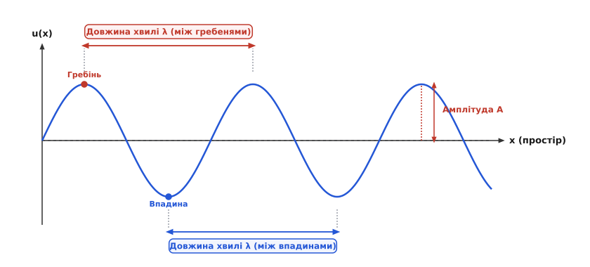
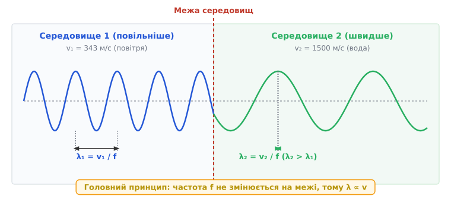
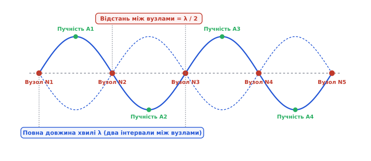
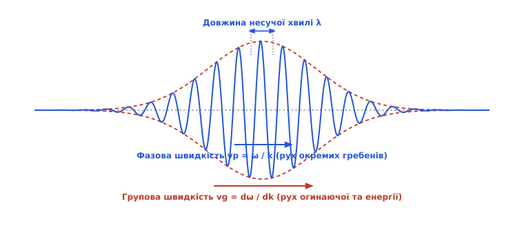

# Довжина хвилі

<preknowlist>
- [Амплітуда, період, частота](topic:physics/amplitude-frequency) — базовий зв'язок часового періоду T та частоти f = 1/T.
- [Синусоїда](topic:physics/sine-wave) — гармонічні коливання та фазорне представлення.
- [Фаза](topic:physics/phase) — часовий та просторовий зсув синусоїдального сигналу.
- [Хвильове рівняння](topic:physics/wave-equation) — рівняння Д'Аламбера та поширення збурень у середовищі.
</preknowlist>

Коли камінь падає у спокійну воду, у точці удару виникає збурення: поверхня піднімається й опускається, здійснюючи коливання у часі. Але це збурення не залишається локалізованим на місці — воно розходиться в усі боки у вигляді кільцевих валів. Якщо зупинити час і подивитися на поверхню води збоку, виявиться, що збурення утворює в просторі впорядкований малюнок із регулярних гребенів та впадин. Відстань між двома сусідніми гребенями на цьому «замороженому» знімку і є довжиною хвилі.

Поняття довжини хвилі виникає щоразу, коли коливальний процес виходить за межі однієї точки й починає поширюватися у просторі. Період коливань описує, як довго триває один цикл у часі; довжина хвилі описує, яку відстань цей цикл займає в просторі. Ці дві величини є двома проекціями одного й того самого фізичного явища — гармонічної хвилі, яка розгортається одночасно у часі та у просторі.

### Від часу до простору: просторова періодичність збурення

Для опису локального коливання — наприклад, пружинного маятника чи напруги на виході генератора — достатньо знати амплітуду, часову частоту `f` та період `T`. Але для хвилі — акустичної, електромагнітної чи механічної — параметр часу описує лише половину фізичної картини. Хвиля є просторово протяжним об'єктом, який з'єднує віддалені точки середовища.

Уявимо довгий пружний канат, один кінець якого гойдають вгору-вниз із частотою `f = 2 Гц`. Це означає, що джерело робить два повні цикли за секунду, а період коливань становить `T = 0.5 с`. Збурення від руки поширюється вздовж каната зі швидкістю `v`. За той час, поки перше збурення пробігає вздовж каната певну відстань `λ`, джерело завершує один повний період коливань і починає другий. Оскільки канат є суцільним середовищем, у той самий момент у просторі виникає повторення форми — наступний гребінь хвилі.


*Довжина хвилі λ — це просторовий період між двома точками одинакової фази (між сусідніми гребенями або впадинами).*

**Довжина хвилі** (*wavelength*, позначається грецькою літерою `λ` — лямбда) — це найменша відстань у просторі між двома точками хвилі, які коливаються в однаковій фазі. 

Виміряти довжину хвилі можна між будь-якими двома еквівалентними точками просторового профілю:
- між двома сусідніми **гребенями** (максимумами зміщення чи тиску);
- між двома сусідніми **впадинами** (мінімумами зміщення чи тиску);
- між двома сусідніми переходами через нуль, якщо хвиля в обох точках рухається в **одному напрямку** (наприклад, обидва рази вгору).

Якщо взяти відстань між сусіднім гребенем і впадиною, вийде лише **півхвилі** (`λ / 2`), бо у впадині фаза коливань протилежна фазі на гребені (зсув фази дорівнює `π` радіан або 180 градусів). А відстань між сусідніми переходами через нуль у протилежних напрямках становить лише **чверть хвилі** (`λ / 4`).

Одиницею вимірювання довжини хвилі в міжнародній системі SI є **метр** (м). Залежно від фізичної природи хвилі її довжина може змінюватися у грандіозних межах: від десятків тисяч кілометрів для наднизькочастотних радіохвиль до часток нанометра для рентгенівського та гамма-випромінювання. Про те, як фізики упродовж двох століть вчилися вимірювати ці просторові масштаби і як довжина хвилі світла зрештою стала еталоном самого метра, розповідає [історичний екскурс](topic:physics/wavelength/hist-measuring-light-wave.md).

### Фундаментальна тріада: зв'язок швидкості, частоти та довжини хвилі

Головне співвідношення хвильової фізики пов'язує три базові параметри: фазову швидкість поширення збурення `v`, частоту коливань `f` та довжину хвилі `λ`:

```
λ = v / f = v · T          [зв'язок довжини хвилі, швидкості та частоти]
```

Ця формула здається простою алгебраїчною рівністю, але за нею ховається фундаментальний фізичний розподіл ролей між джерелом хвилі та середовищем, у якому вона поширюється.

1. **Частота f задається джерелом.** Коли генератор випромінює звуковий сигнал частотою 1000 Гц або лазер випромінює світло, кількість коливань за секунду визначається внутрішніми фізичними процесами у випромінювачі (частотою струму, квантовим переходом в атомах тощо). Частота є **часовим інваріантом**: при переході хвилі з повітря у воду, скло чи метал її частота `f` залишається строго постійною.
2. **Швидкість v визначається середовищем.** Швидкість, з якою збурення передається від сусідніх частинок чи полів, залежить від внутрішніх фізичних властивостей середовища — пружності, густини, діелектричної та магнітної проникності. В акустиці швидкість звуку `v = √(B / ρ)` визначається модулем об'ємної пружності `B` та густиною `ρ`. У повітрі звук поширюється зі швидкістю близько `343 м/с`, у воді — `1480 м/с`, а в сталі — майже `5900 м/с`. Для світла швидкість у вакуумі становить точні `c₀ = 299 792 458 м/с`, а у склі з показником заломлення `n = 1.5` вона зменшується до `v = c₀ / n ≈ 200 000 км/с`.
3. **Довжина хвилі λ є результатом узгодження.** Оскільки частота тримається джерелом, а швидкість нав'язується середовищем, довжині хвилі нічого не залишається, як підлаштуватися під їхнє співвідношення. Довжина хвилі — це пасивний просторовий наслідок поєднання часового ритму джерела та просторової провідності середовища.


*При переході хвилі у нове середовище частота f лишається незмінною, а довжина хвилі λ змінюється пропорційно фазовій швидкості v.*

Розгляньмо, що відбувається на межі двох середовищ. Уявімо звукову хвилю частотою `f = 1000 Гц`, яка падає з повітря на поверхню води. У повітрі (`v₁ = 343 м/с`) довжина її хвилі дорівнює:

```
λ₁ = 343 м/с / 1000 Гц = 0.343 м = 34.3 см
```

Коли ця сама хвиля переходить у воду (`v₂ = 1500 м/с`), вода мусить коливатися з тією самою частотою `1000 Гц` (інакше на межі виникли б розриви суцільності). Але оскільки звук у воді поширюється в 4.37 раза швидше, за кожен період коливань збурення встигає відбігти набагато далі. Довжина хвилі у воді стає більшою у ті самі 4.37 раза:

```
λ₂ = 1500 м/с / 1000 Гц = 1.50 м = 150 см
```

З оптикою відбувається протилежне. Світловий промінь зеленого кольору з довжиною хвилі у вакуумі `λ₀ = 532 нм` має частоту `f = c₀ / λ₀ ≈ 5.64 × 10¹⁴ Гц`. При входженні у скло з показником заломлення `n = 1.5` швидкість світла падає у 1.5 раза (`v = c₀ / 1.5`). Оскільки частота `f` не змінюється, довжина хвилі у склі **стискається** у 1.5 раза:

```
λ_скло = λ₀ / n = 532 нм / 1.5 = 354.7 нм
```

Колір світла при цьому не змінюється, бо людське око та будь-які фізичні детектори реагують на частоту коливань електромагнітного поля (енергію фотона `E = h·f`), а не на просторову довжину хвилі всередині кришталика. Повний перелік характеристик усіх діапазонів хвиль — від радіохвиль та світла до акустики — містить [довідник спектральних діапазонів](topic:physics/wavelength/api-wave-bands.md).

Зі зміною довжини хвилі на межі середовищ безпосередньо пов'язаний закон заломлення світла й звуку (закон Снеліуса). Оскільки гребені хвилі на межі розділу мають соватися узгоджено, відношення синусів кута падіння `θ₁` та кута заломлення `θ₂` строго дорівнює відношенню довжин хвиль у цих середовищах:

```
sin(θ₁) / sin(θ₂) = v₁ / v₂ = λ₁ / λ₂
```

Якщо хвиля переходить у середовище з меншою швидкістю (`v₂ < v₁`), довжина хвилі скорочується (`λ₂ < λ₁`), а промінь відхиляється ближче до нормалі.

> 🔧 **Навіщо це.** Якщо ви конструюєте оптичний прилад, антену чи ультразвуковий датчик, пам'ятайте: геометричний розмір резонаторів, дзеркал та лінз завжди розраховується під довжину хвилі **всередині робочого середовища**, а не у вакуумі чи повітрі. Наприклад, товщина просвітлюючого покриття на лінзі обчислюється як `λ / (4n)`, де `n` — показник заломлення плівки. Сплутавши довжину хвилі у вакуумі з довжиною хвилі у середовищі, ви помилитесь у геометрії розрахунку точно в `n` разів.

### Просторовий профіль, фаза та хвильове число k

Щоб виразити хвилю як математичну функцію координат і часу, потрібно поєднати часовий рух і просторове поширення. Рівняння плоского гармонічного збурення, що рухається вздовж осі `x`, має вигляд:

```
u(x, t) = A · sin(2π · (t/T - x/λ) + φ₀)
```

У цій формулі чітко видно симетрію: дріб `t / T` показує кількість часових періодів, що минули з моменту старту, а дріб `x / λ` — кількість просторових періодів (довжин хвиль), вміщених на відстані `x`.

Щоб спростити формули та уникнути постійного написання `2π`, фізики запровадили дві кутові частоти:
- **Часова кутова частота** `ω = 2π / T = 2π · f` [рад/с] — швидкість зміни фази у часі;
- **Просторова кутова частота**, яку називають **хвильовим числом** `k`:

```
k = 2π / λ = ω / v          [рад/м]
```

Хвильове число `k` каже, на скільки радіанів змінюється фаза хвилі при переміщенні вздовж простору на 1 метр. Якщо частота `ω` є «швидкістю обертання фазора у часі», то хвильове число `k` є «щільністю накручування фази у просторі».

З використанням `ω` та `k` хвильова функція набуває компактної і красивої форми:

```
u(x, t) = A · sin(k·x - ω·t + φ₀)
```

Просторова похідна від цієї функції по координаті `x` визначає деформацію середовища або напруженість поля в даній точці:

```
∂u / ∂x = k · A · cos(k·x - ω·t + φ₀)
```

Звідси видно, що амплітуда просторового градієнта пропорційна хвильовому числу `k = 2π / λ`. Чим коротша довжина хвилі `λ` (тим більша `k`), тим різкіше змінюється профіль хвилі у просторі, тим більші механічні напруження чи просторові градієнти електричного поля виникають у середовищі.

Для хвилі, що рухається у тривимірному просторі, хвильове число узагальнюється до **хвильового вектора** `k`. Вектор `k` показує напрямок поширення хвильового фронту, а його довжина дорівнює `|k| = 2π / λ`. Детальні математичні виведення хвильового вектора, скалярного добутку `k · r` та диференціального хвильового рівняння наведено у [математичному аналізі хвильового вектора](topic:physics/wavelength/math-wave-vector-dispersion.md).

### Методи експериментального вимірювання довжини хвилі

У лабораторній та промисловій практиці вимірювання довжини хвилі здійснюється чотирма основними методами:

1. **Метод стоячої хвилі (труба Кундта та лінії Лехера):** В акустиці трубку фіксованої довжини заповнюють легким порошком (наприклад, плауном). При звуковому резонансі порошок здувається з пучностей і накопичується строго у вузлах стоячої хвилі. Вимірявши відстань між кількома купки порошку `L` і поділивши на кількість інтервалів `N`, отримують півхвилі: `λ / 2 = L / N`. У радіотехніці аналогічний вимір виконують на двопровідній лінії Лехера, переміщуючи індикаторну лампочку або вольтметр уздовж лінії.
2. **Інтерферометричний метод Майкельсона та Лінніка:** Світловий промінь ділять на два плечі, одне з яких можна плавно зміщувати мікрогвинтом чи п'єзоактюатором. При переміщенні дзеркала на відстань `ΔL` відбувається зміна напрямку фазового зсуву, і в полі зору пробігає `N` світлих інтерференційних смуг. Довжина хвилі обчислюється як `λ = 2 · ΔL / N`.
3. **Метод дифракційної ґратки:** Пропускаючи хвилю крізь періодичну структуру з періодом (сталою ґратки) `d`, вимірюють кут `θ` під яким виникає головний дифракційний максимум `m`-го порядку. За формулою `d · sin(θ) = m · λ` вираховують точну довжину хвилі.
4. **Сучасні оптичні хвилеміри (Wavemeters):** У сучасних фотонних лабораторіях довжину хвилі лазера вимірюють шляхом зведення оптичного сигналу з опорним лазером відомої частоти (гетеродинування) або за допомогою скануючого інтерферометра Физо, який миттєво зчитує інтерференційний малюнок на ПЗЗ-лінійку з відносною точністю до `10⁻⁷`.

### Стоячі хвилі, вузли та резонансні інтервали

Коли хвиля зустрічає перешкоду (наприклад, жорстку стінку чи межу середовища), вона відбивається і біжить у зворотному напрямку. Падаюча та відбита хвилі накладаються одна на одну, створюючи явище [інтерференції](topic:physics/wave-interference). Якщо амплітуди й частоти хвиль однакові, виникає **стояча хвиля** — коливальний процес, у якому профіль не біжить у просторі, а гойдається на місці.


*Стояча хвиля утворює вузли (де амплітуда дорівнює нулю), відстань між якими становить рівно півхвилі (d = λ / 2).*

У стоячій хвилі простір чітко розшаровується на дві категорії точок:
1. **Вузли** (*nodes*) — точки, у яких падаюча й відбита хвилі завжди знаходяться у протифазі і повністю гасять одна одну. У вузлах амплітуда коливань постійно дорівнює **нулю**.
2. **Пучності** (*antinodes*) — точки, у яких хвилі додаються в однаковій фазі, утворюючи розмах коливань, рівний подвійній амплітуді `2A`.

Відстань між двома сусідніми вузлами (або двома сусідніми пучностями) строго дорівнює **половині довжини хвилі**:

```
d_вузлів = λ / 2          [відстань між сусідніми вузлами стоячої хвилі]
```

А відстань від вузла до найближчої пучності становить **чверть хвилі** (`λ / 4`).

Цей факт є основою всіх резонансних явищ у природі й техніці. Щоб у струні, акустичній трубі чи мікрохвильовому резонаторі виник стійкий резонанс, на довжині резонатора `L` має вміщатися ціле число півхвиль:

```
L = n · (λ / 2) = n · (v / (2f))          [умова резонансу для відрізка довжиною L]
```

Звідси випливає, що резонатор фіксованої довжини `L` може відгукуватися лише на дискретний набір частот — власні частоти (гармоніки): `f_n = n · v / (2L)`. Саме цим пояснюється звучання музичних інструментів: довжина духової труби чи струни `L` визначає довжину хвилі основної гармоніки `λ₁ = 2L`, а отже і висоту ноти. 

У високочастотній радіотехніці та оптиці на властивості чверті хвилі (`λ / 4`) базуються **чвертьхвильові трансформатори опору** та **просвітлюючі оптичні покриття**. Якщо на деталь нанести тонкий шар диелектрика товщиною `d = λ / 4`, хвиля, відбита від передньої межі плівки, і хвиля, відбита від задньої межі, долають різницю ходу `2d = λ / 2`. Внаслідок цього вони відбиваються у протифазі й повністю гасять одна одну, забезпечуючи 100% проходження світла крізь лінзу. Інженерний розрахунок стоячих хвиль та алгоритми визначення вузлів містить [практичний модуль обчислень](topic:physics/wavelength/proj-wavelength-calc.md).

> 🔧 **Навіщо це.** На явищі стоячих хвиль працює побутова мікрохвильова піч. Магнетрон випромінює електромагнітні хвилі частотою `f = 2.45 ГГц`. У повітрі камери швидкість світла `c ≈ 3 × 10⁸ м/с`, тому довжина хвилі дорівнює `λ = 30·10⁸ / 2.45·10⁹ ≈ 12.2 см`. Усередині металевої камери печі виникає стояча хвиля з вузлами та пучностями, відстань між якими становить `λ / 2 ≈ 6.1 см`. У пучностях напруженість поля максимальна і їжа нагрівається швидко, а у вузлах поле дорівнює нулю і нагрів відсутній. Обертальна тарілка у мікрохвильовці потрібна саме для того, щоб продукт безперервно совався крізь просторові пучності й вузли, прогріваючись рівномірно.

### Дисперсія та граничні хвилі у хвилеводах

Досі ми припускали, що фазова швидкість хвилі `v` є сталою величиною. Проте у багатьох реальних середовищах швидкість поширення хвилі залежить від її частоти, а отже й від довжини хвилі. Це явище називається **дисперсією**.


*У дисперсійному середовищі довжина хвилі несучої λ визначає фазову швидкість vₚ = ω/k, тоді як огинаюча пакета рухається з груповою швидкістю v_g = dω/dk.*

У дисперсійному середовищі виникають дві різні швидкості:
- **Фазова швидкість** `vₚ = ω / k = f · λ` — швидкість, з якою рухаються окремі гребені й впадини всередині хвилі;
- **Групова швидкість** `v_g = dω / dk` — швидкість, з якою переміщується вся огинаюча хвильового пакета (імпульсу), а разом із нею — енергія та передана інформація.

Зв'язок між ними описується знаменитою **формулою Релея**:

```
v_g = vₚ - λ · (dvₚ / dλ)
```

Класичний приклад дисперсії — морські хвилі на глибокій воді. Математичний розрахунок показує, що для гравітаційних хвиль на воді фазова швидкість пропорційна квадратному кореню з довжини хвилі: `vₚ ∝ √λ`. Довші хвилі біжать швидше за короткі!

Якщо на поверхні океану виникає штормове збурення, довгі хвилі (`λ = 200 м`) швидко вириваються вперед і першими доходять до далеких берегів у вигляді гладкого довгого свелу, тоді як короткі хвилі запізнюються. При цьому групова швидкість пакета морських хвиль виявляється рівно вдвічі меншою за фазову швидкість окремих гребенів: `v_g = (1/2) · vₚ`. Спостерігач на березі бачить дивовижну картину: окремі гребені зароджуються в тилу хвильової групи, біжать уперед через усю групу і зникають на її передньому краї.

Окремий важливий фізичний ефект пов'язаний із поширенням хвиль у металевих хвилеводах та акустичних каналах обмеженого перерізу. У прямокутному металевому хвилеводі шириною `a` хвиля може поширюватися лише тоді, коли її довжина хвилі не перевищує **критичну довжину хвилі** `λ_c`:

```
λ_c = 2a          [гранична критична довжина хвилі для моди TE₁₀]
```

Якщо довжина хвилі джерела більша за критичну (`λ > λ_c`), хвиля не здатна поширюватися у хвилеводі: вона перетворюється на згасаюче (експоненціальне) збурення, яке експоненційно затухає вздовж каналу `u(x) ∝ exp(-α·x)` і не переносить енергію.

У твердому тілі акустичні коливання атомів кристалічної ґратки (фонони) також зазнають дисперсії. Оскільки атоми розташовані на дискретній відстані `a` (постійна ґратки), найкоротша можлива довжина хвилі у кристалі дорівнює `λ_min = 2a`. Хвилі, коротші за `2a`, не можуть поширюватися у кристалі, оскільки середовище не є суцільним. Це обмежує спектр акустичних коливань твердого тіла межею першої зони Бріллюена (`k_max = π / a`).

У волоконній оптиці хроматична дисперсія кварцового скла призводить до того, що коротші світлові імпульси у світловоді розширюються в часі, оскільки різні спектральні складники світла біжать із різною швидкістю. Для подолання цього ефекту в магістральних волоконно-оптичних лініях підбирають робочу довжину хвилі строго у зоні нульової дисперсії (`λ = 1310 нм` або `1550 нм` із компенсаційними світловодами).

### Фізична межа: дифракційний ліміт та хвилі матерії

Довжина хвилі встановлює фундаментальну просторову межу на все, що людина може побачити, сфокусувати або виміряти за допомогою хвиль. Це обмеження називається **дифракційним лімітом Аббе**.

Неможливо сфокусувати хвилю у пляму, розмір якої помітно менший за половину її довжини хвилі:

```
d_min ≈ λ / (2 · NA)          [дифракційний ліміт оптичної роздільної здатності]
```

де `NA = n · sin(α)` — числова апертура оптичної системи (зазвичай `NA ≤ 1.4` для імерсійних об'єктивів).

Це означає, що ззвичайний оптичний мікроскоп, який працює у видимому світлі (`λ ≈ 500 нм`), принципово не здатний розрізнити деталі, менші за `~200 нм`. Окремий вірус, білкова молекула чи атом є набагато меншими за довжину світлової хвилі, тому світло просто огинає їх (дифрагує), не створюючи чіткої тіні чи зображення.

Аналогічно, в астрономії та радіолокації кутова роздільна здатність антени або телескопа діаметром `D` обмежується критерієм Релея:

```
θ_min ≈ 1.22 · λ / D          [кут дифракційної розмитості плями]
```

Щоб побачити дрібніші об'єкти або підвищити деталізацію, довелося радикально зменшувати довжину хвилі:

1. **Рентгенівська спектроскопія:** Рентгенівські промені мають довжину хвилі порядку нанометра й пікометра (`λ = 0.01 — 1 нм`), що співмірно з міжатомними відстанями в кристалах. Саме завдяки дифракції рентгенівських хвиль Розалінд Франклін, Джеймс Вотсон та Френсіс Крік у 1953 році розшифрували спіральну структуру ДНК.
2. **Екстремальний ультрафіолет (EUV) у літографії:** Сучасні процесори виготовляються на степерних установках ASML з використанням EUV-випромінювання з довжиною хвилі `λ = 13.5 нм`. Це дає змогу випалювати транзистори розміром у кілька нанометрів на силіцієвих пластинах.
3. **Електронна мікроскопія та хвилі де Бройля:** У 1924 році Луї де Бройль (*Louis de Broglie*) висунув гіпотезу, що не лише світло, а й масивні частинки (електрони, протони) мають хвильові властивості. Довжина хвилі де Бройля визначається імпульсом частинки `p = m·v`:

```
λ_dB = h / p = h / (m · v)          [довжина хвилі де Бройля]
```

де `h = 6.626 × 10⁻³⁴ Дж·с` — стала Планка.

Прискорений напругою 100 кіловольт електрон має імпульс, якому відповідає довжина хвилі де Бройля `λ_dB ≈ 0.0037 нм` — це у 100 000 разів менше за довжину хвилі видимого світла! Завдяки цьому електронний мікроскоп долає оптичний дифракційний ліміт і дозволяє розглядати окремі атоми та кристалічні ґратки матеріалів.

У термодинаміці середня квантова довжина хвилі частинок газу називається **тепловою довжиною хвилі де Бройля**: `λ_th = h / √(2π · m · k_B · T)`. Коли при наднизькому охолодженні (мікрокельвіни) теплова довжина хвилі `λ_th` стає більшою за середню відстань між атомами в газі, індивідуальні хвильові пакети атомів перекриваються і зливаються в один квантовий макростан — **конденсат Бозе — Ейнштейна**.

> 🔧 **Навіщо це.** Коли ви обираєте сенсор для інженерної задачі, завжди зіставляйте довжину хвилі з розміром об'єкта. Ультразвуковий датчик парктроніка на частоті 40 кГц має довжину хвилі `λ ≈ 8.5 мм` — він чудово бачить бампер машини чи стіну, але не помітить тонку металеву дротину. УЗД-апарат на частоті 3.5 МГц (`λ ≈ 0.44 мм`) бачить великі внутрішні органы, але для детального розрізнення шарів сітківки ока потрібен датчик на 20 МГц (`λ ≈ 0.077 мм`). Масштаб довжини хвилі завжди визначає точність і просторову межу вимірювання.

---

Довжина хвилі `λ` — це просторовий період коливального процесу, відстань між точками однакові фази. Вона зв'язана з часовою частотою `f` та фазовою швидкістю `v` співвідношенням `λ = v / f`. Частота задається джерелом і є часовим інваріантом, а швидкість визначається середовищем; тому при переході у нове середовище довжина хвилі змінюється пропорційно швидкості. У просторі хвилю описує хвильове число `k = 2π / λ`. Накладання хвиль утворює стоячі хвилі з вузлами через кожні `λ / 2`, а просторовий масштаб `λ` встановлює фундаментальний дифракційний ліміт роздільної здатності для всіх оптичних, акустичних та квантових систем.
