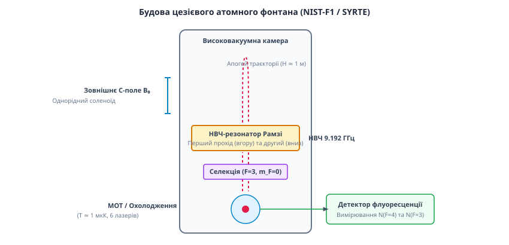

# 🔌 Архітектура та підсистеми цезієвого атомного фонтана

У цій вставці розібрано конструкцію, фізичні підсистеми, лазерно-оптичні тракти та порядок функціонування цезієвого атомного фонтана — головного первинного еталона часу й частоти сучасних метрологічних інститутів.

## Загальна фізична схема приладу

Атомний фонтан є складним оптоелектронним та вакуумно-фізичним комплексом. На відміну від класичних пучкових годинників із горизонтальним рухом термальних атомів зі швидкістю понад `100` м/с, у фонтані охолоджена хмара атомів цезію-133 рухається по вертикальній параболічній траєкторії вгору й вниз у полі тяжіння Землі.

Прилад складається з шести основних функціональних підсистем:

1. Джерело атомів цезію та вакуумна камера магніто-оптичної пастки (МОТ);
2. Лазерна система охолодження та вертикального запуску (рухома оптична патока);
3. Резонатор селекції станів та підсистема очищення пучка;
4. Основний НВЧ-резонатор Рамзі з соленоїдом статичного магнітного поля (C-field);
5. Багатошаровий магнітний екран із мю-металу;
6. Оптична система реєстрації флуоресценції та контролю температури.


*Конструкція цезієвого атомного фонтана: вертикальна вакуумна колона, зона охолодження (МОТ), резонатор Рамзі (TE₀₁₁) та детектор флуоресценції.*

## 1. Камера охолодження та лазерна система (МОТ)

Нижня частина вакуумної системи є базовою зоною накопичення та охолодження атомів. У високовакуумну камеру з тиском менше `10⁻⁷` Па подаються пари цезію-133 із металевого контейнера.

Для охолодження використовується конфігурація з 6 взаємно ортогональних лазерних променів на довжині хвилі `852.3` нм (резонансна `D₂`-лінія цезію, перехід `6²S₁/₂ (F=4) → 6²P₃/₂ (F'=5)`):

* **Доплерівське охолодження:** Лазерні промені зсунуті у червоний бік від атомного резонансу на `2...3` ширини спектральної лінії (`Δν ≈ -10` МГц). Внаслідок ефекту Доплера атом, що рухається назустріч променю, поглинає фотон і отримує імпульсний гальмівний поштовх `ℏ·k`. Наступне спонтанне випромінювання фотона відбувається у випадковому напрямку, що призводить до ефективного вискочування кінетичної енергії.
* **Субдоплерівське охолодження (Sisyphus cooling):** Після первинного накопичення близько `10⁸` атомів магнітне поле пастки вимикається, а лазерні поля переводяться у режим градієнта поляризації. Це знижує кінетичну температуру хмари цезію від доплерівської межі (`125` мкК) до субдоплерівських `1` мікрокельвіна (`10⁻⁶` К). Середня теплова швидкість атомів зменшується до `1` см/с.
* **Вертикальний запуск (Moving Molasses):** Для запуску хмари вгору частоти верхніх трьох лазерних променів трохи збільшують на `δf`, а нижніх трьох — зменшують на `δf`. У результаті система відліку оптичної патоки починає рухатися вгору зі швидкістю `v_launch = λ · δf / cos(θ)`. Атоми прискорюються вгору до швидкості `v_launch ≈ 4...5` м/с за час близько `1` мілісекунди, після чого лазери вимикаються, і хмара продовжує вільний підйом під дією сили тяжіння.

## 2. Селекція квантового стану (State Selection Cavity)

Після запуску хмара атомів залишає область лазерів і входить у зону селекції станів. Оскільки після лазерного охолодження атоми рівномірно розподілені між усіма `9` надтонкими магнітними підрівнями `m_F ∈ {-4, ..., +4}` стану `F=4`, необхідно виділити суворо один квантовий стан `|F=3, m_F=0⟩`.

Селекція відбувається у два етапи:
1. **НВЧ-імпульс селекції:** Хмара проходить крізь допоміжний НВЧ-резонатор, у якому діє `π`-імпульс на частоті `9.192` ГГц, настроєний суворо на перехід `(F=4, m_F=0) → (F=3, m_F=0)`. У результаті атоми з підрівня `m_F=0` переходять у стан `F=3`, а атоми інших підрівнів `m_F ≠ 0` залишаються у стані `F=4`.
2. **Очищаючий лазерний промінь (Push Beam):** Відразу над резонатором селекції вмикається інтенсивний лазерний промінь, резонансний переходному стану `F=4`. Світловий тиск цього променя буквально видуває всі небажані атоми у стані `F=4` убік від вакуумного каналу. Далі усередину основного НВЧ-резонатора входять лише атоми у суворо чистому квантовому стані `|F=3, m_F=0⟩`.

## 3. Основний НВЧ-резонатор Рамзі та область вільного польоту

Основний НВЧ-резонатор призначений для створення двох розділених у часі взаємодій з електромагнітним полем (`π/2`-імпульсів Рамзі):

* **Конструкція резонатора:** Використовується високодобротний циліндричний мідний резонатор з безкисневої міді (OFHC), що працює на моді `TE₀₁₁`. У центрі торцевих стінок резонатора виконано отвори діаметром `10` мм для вільного прольоту атомної хмари. Щоб випромінювання НВЧ-поля не просочувалося за межі резонатора, отвори обладнано закритими хвилеводними дроселями (Choke tubes).
* **Симетрія поля:** Конструкція резонатора виготовляється із точністю до мікронів щодо верхньої та нижньої площин. НВЧ-потужність подається через два симетричні протилежні отвори зв'язку, що мінімізує фазовий зсув електричного та магнітного полів між першим та другим проходженнями атомної хмари.
* **Траєкторія руху:** Хмара атомів піднімається вгору, проходить крізь НВЧ-резонатор перший раз (перший `π/2`-імпульс), піднімається вище резонатора у простір вільного дрейфу на висоту апогею близько `30...50` см над резонатором, повертає у точці спокою (`v = 0`) і під дією сили тяжіння починає падати донизу. Впавши назад, хмара проходить крізь той самий НВЧ-резонатор вдруге (другий `π/2`-імпульс).
* **Час взаємодії:** Загальний час вільного прольоту між першим та другим перетинами резонатора становить `T = 2 · v_launch / g ≈ 0.5...0.8` секунди. Це забезпечує ширину центрального піку Рамзі `Δν = 1 / (2·T) ≈ 0.8...1.0` Гц.

## 4. Магнітна система (C-field) та багатошаровий захист

Оскільки напруженість зовнішнього магнітного поля розщеплює підрівні Зеемана, для запобігання фазовим викривленням область вільного прольоту повинна бути захищена від зовнішніх магнітних полів (включаючи магнітне поле Землі та поля від лабораторного обладнання):

* **Магнітні екрани:** Вакуумна труба фонтана оточується `4...6` концентричними циліндричними екранами з мю-металу (сплав нікелю та заліза з високою магнітною проникністю `μ_r > 100 000`). Екрани розсіюють та відводять зовнішні магнітні завади, послаблюючи їх більше ніж у `100 000` разів.
* **C-field соленоїд:** Усередині екранів розміщується прецизійний соленоїд, який створює дуже слабке, але строго однорідне статичне магнітне поле `B₀ ≈ 1...2` мкТл (приблизно в 50 разів слабше за поле Землі). Це поле необхідне для зняття виродження за квантовим числом `m_F` та чіткого розкреслення «годинникового переходу» `(m_F=0 → m_F=0)` від сусідніх ненульових переходів.

## 5. Детектор флуоресценції та вакуумна підсистема

У нижній частині фонтана (під резонатором селекції) розташована оптична система реєстрації, яка вимірює відносну кількість атомів, що здійснили квантовий перехід:

1. Хмара атомів падає крізь перший зондуючий лазерний промінь, настроєний на перехід `F=4 → F'=5`. Фотодетектор реєструє інтенсивність флуоресценції `N₄` (кількість атомів, які під дією НВЧ-поля перейшли у стан `F=4`).
2. Далі атоми проходять крізь оптичний промінь очищення, який видаляє атоми `F=4`.
3. Потім атоми проходять крізь оптичний промінь накачки, який переводить атоми зі стану `F=3` у стан `F=4`, після чого другий фотодетектор реєструє інтенсивність флуоресценції `N₃` (кількість атомів, що залишилися у стані `F=3`).

Обчислене співвідношення `P = N₄ / (N₄ + N₃)` дає експериментальну ймовірність переходу `P_ge`, яка повністю вільна від флуктуацій загальної кількості атомів у хмарі від циклу до циклу.

**Вакуумний тракт:** Увесь об'єм фонтана підтримується при високому вакуумі `10⁻⁸` Па за допомогою комбінації іонних насосів (Ion pumps) та нерозпилюваних гетерних насосів (NEG). Високий вакуум є критичним для відсутності зіткнень атомів цезію з молекулами залишкового газу, які призвели б до збивання фази квантового стану.

## 6. Порівняльна характеристика цезієвих фонтанів та водневих мазерів

У метрологічній практиці поруч із первинними цезієвими фонтанами використовуються активні та пасивні водневі мазери (Hydrogen Masers). Порівняльний фізичний розбір показує complementary роль цих двох класів квантових приладів:

* **Водневий мазер (Частота 1.420405751 ГГц):** Працює на радіочастотному переході надтонкої структури атома водню (`1²S₁/₂ (F=1, m_F=0) → (F=0, m_F=0)`). Усередині кварцевої колби з покриттям із тефлону атоми водню знаходяться у НВЧ-резонаторі впродовж `1` секунди, створюючи вимушене генераційне випромінювання. Водневий мазер має виняткову короткочасну стабільність (`σ_y(τ) ≈ 10⁻¹5` на інтервалах `10...1000` с), що суттєво перевершує одиночний крок цезієвого фонтана.
* **Цезієвий фонтан (Частота 9.192631770 ГГц):** Працює як первинний еталон без систематичного дрейфу. Через взаємодію стінок кварцової колби із атомами водню мазер володіє повільним зсувом частоти, тоді як фонтан у вакуумі не зазнає старіння.

Тому у національних лабораторіях (NIST, PTB, SYRTE) створюють гібридні системи: водневий мазер забезпечує гладку наднизькошумову короткочасну опорну частоту для синтезатора, а цезієвий фонтан у замкненому сервоконтурі повільно калібрує та коригує дрейф мазера на інтервалах `τ > 10 000` секунд.

## 7. Повний бюджет систематичних похибок атомного фонтана

Первинні цезієві фонтани (такі як NIST-F1 або PTB-CSF2) безперервно обраховують та компенсують джерела систематичного зсуву частоти. Основні компоненти бюджету похибок наведено у таблиці:

| Джерело систематичного зсуву | Фізичний механізм | Порядок величини `Δν / ν₀` | Метод компенсації / корекції |
| :--- | :--- | :--- | :--- |
| **Квадратичний ефект Зеемана** | Зсув рівня `m_F=0` пропорційно `B₀²` | `+10⁻¹³` | Постійний моніторинг `B₀` за спектром `m_F = ±1` |
| **Випромінювання чорного тіла (BBR)** | Електричне поле теплового випромінювання стінок | `-1.6 · 10⁻¹⁴` | Термостатування камери при `20` °C з точністю `0.1` °C |
| **Холодні зіткнення атомів** | Зсув фази при перехресному розсіюванні цезію | `-10⁻¹⁵` ... `-10⁻¹⁴` | Зміна густини хмари та екстраполяція до нульової густини |
| **Релятивістський зсув (Доплер 2-го порядку)** | Релятивістське уповільнення часу `v²/2c²` | `< 10⁻¹⁶` | Нехтовно малий завдяки низькій швидкості `v ≈ 1` см/с |
| **Фазовий зсув НВЧ-резонатора** | Неоднорідність фази НВЧ-поля між проходами | `± 10⁻¹⁶` | Використання симетричних `TE₀₁₁` резонаторів |
| **Гравітаційне червоне зміщення** | Загальна теорія відносності (зміна висоти) | `+1.1 · 10⁻¹⁶` на метр | Точне геодезичне вимірювання висоти над геоїдом |

### Фізична компенсація зсуву чорнотільного випромінювання (BBR)

Зсув випромінювання чорного тіла є одним із найбільших систематичних ефектів у фонтанах. Перемінне електричне поле теплових фотонів від стінок камери зсуває енергетичні рівні за рахунок квадратичного Штарк-ефекту:

```
Δν_BBR / ν₀ = - 1.5737 · 10⁻¹⁴ · (T_kelvin / 300)⁴ · [ 1 + 0.014 · (T_kelvin / 300)² ]
```

При кімнатній температурі `T = 293.15` К (`20` °C) цей зсув становить відносне відхилення `-1.654 · 10⁻¹⁴`. Для підтримки невизначеності цього зсуву на рівні `10⁻¹⁶` температура вакуумної камери контролюється масивом з `24` платинових датчиків `Pt100` з точністю до `0.05` °C.

### Поправка на гравітаційне червоне зміщення

Згідно із загальною теорією відносності (ЗТВ) Ейнштейна, годинник у сильнішому гравітаційному полі йде повільніше. Зсув частоти відносно геоїда (рівня моря) описується формулою:

```
Δν_grav / ν₀ = (g_grav · h_geo) / c²
```

де `g_grav ≈ 9.81` м/с², `h_geo` — висота лабораторії над геоїдом, а `c` — швидкість світла.

Градієнт зсуву становить `1.09 · 10⁻¹⁶` на кожен метр висоти. Для метрологічних лабораторій, розташованих на висоті `100` метрів над рівнем моря, гравітаційна корекція досягає `+1.09 · 10⁻¹⁴`, що у десятки разів перевищує підсумкову похибку приладу. Точна геодезична прив'язка висоти атомного фонтана є обов'язковою умовою передачі даних у Міжнародне бюро мір і ваг (BIPM).
