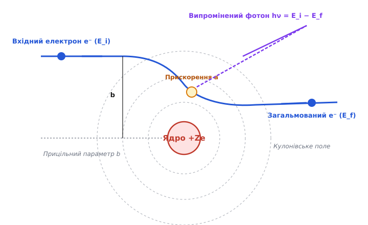
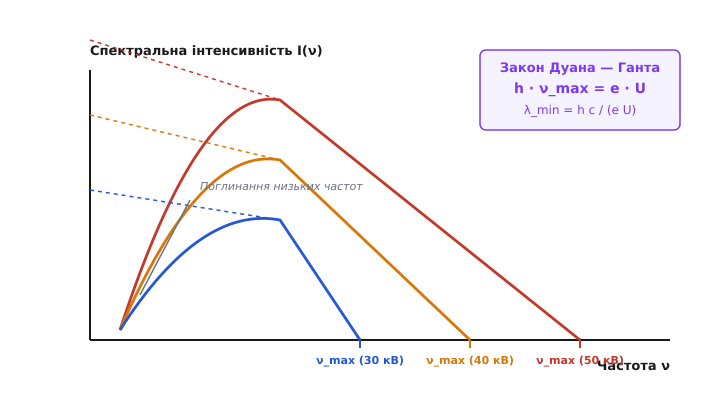
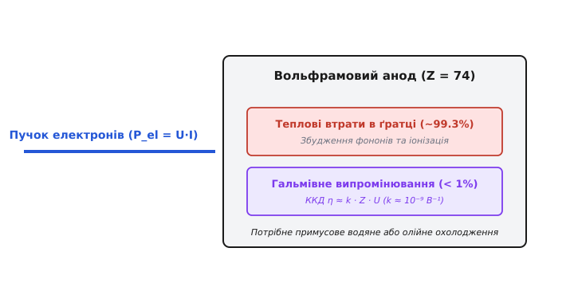
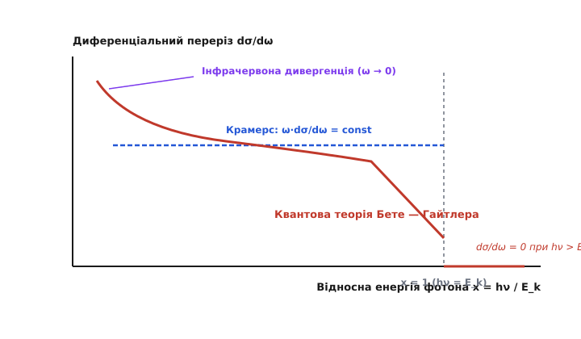

# Гальмівне випромінювання

<preknowlist>
- [Формула Лармора та випромінювання прискореного заряду](book:physics/larmor-formula) — випромінювальна потужність релятивістського та нерелятивістського прискореного електрона.
- [Квантування світла та фотони](book:physics/photons) — енергія фотона E = h ν, фотонний імпульс та дискретна природа електромагнітного поля.
- [Кулонівське розсіювання](book:physics/coulomb-scattering) — розсіювання заряджених частинок у кулонівському полі атомного ядра.
</preknowlist>

Коли пучок швидких електронів з кінетичною енергією десятки кілоелектронвольт врізається у металеву мішень анода рентгенівської трубки, понад 99% їхньої енергії виділяється у вигляді тепла, а залишок перетворюється на жорсткі електромагнітні кванти. Заряджений електрон, пролітаючи поблизу масивного атомного ядра, випробує потужне кулонівське притягання, яке вигинає його траєкторію та стрімко змінює вектор швидкості. Згідно з законами класичної та квантової електродинаміки, будь-яке прискорене або гальмоване зміщення електричного заряду супроводжується випромінюванням електромагнітного поля. Випромінювання, що виникає при розсіюванні та децелерації заряду у зовнішньому електричному полі ядра чи іона, отримало назву **гальмівного випромінювання** (від нім. *Bremse* — гальмо + *Strahlung* — випромінювання; англ. *bremsstrahlung* або *deceleration radiation*).

Гальмівне випромінювання є одним із фундаментальних процесів взаємодії високоенергетичних заряджених частинок із речовиною. Воно утворює неперервний спектр рентгенівських та гамма-променів, визначає радіаційні втрати енергії в прискорювачах частинок, формує випромінювання гарячої космічної плазми й задає суворі фізичні вимоги до розрахунку радіаційного захисту.

## Фізичний механізм гальмування та класичні обмеження

У класичній фізиці електродинамічний механізм випромінювання описується формулою Лармора: миттєва потужність випромінювання `P` зарядженої частинки пропорційна квадрату її векторного прискорення `a²`. Коли електрон з масою `m_e` та зарядом `-e` наближається до ядра із зарядом `+Z e` на відстань прицільного параметра `b`, кулонівська сила викликає прискорення `a = (Z e²) / (4 π ε₀ m_e r²)`.


*Електрон масою m_e з початковою швидкістю v відхиляється у кулонівському полі ядра зарядом Ze, випромінюючи фотон енергією hν.*

З формули Лармора випливає вирішальна залежність випромінювальної потужності від маси частинки:

```
P = (2 / 3) · [e² / (4 π ε₀ c³)] · a² ∝ 1 / m²
```

Оскільки прискорення при фіксованій кулонівській силі є обернено пропорційним масі частинки (`a ∝ 1 / m`), потужність гальмівного випромінювання є обернено пропорційною квадрату маси `1 / m²`. Електрон випромінює в `(m_p / m_e)² ≈ 3.37 × 10⁶` разів інтенсивніше за протон такої ж кінетичної енергії. Саме тому у фізиці високих енергій та радіаційній захисній інженерії гальмівне випромінювання враховують майже виключно для легких частинок — електронів та позитронів.

Під час проходження електронів крізь речовину відбуваються два принципово різних процеси втрати енергії на одиницю довжини шляху `dE / dx` (гальмівна здатність речовини):
1. **Іонізаційні (зіткнювальні) втрати `(dE / dx)_coll`** — непружні зіткнення з атомними електронами (формула Бете — Блоха), які переважають при низьких енергіях.
2. **Радіаційні втрати `(dE / dx)_rad`** — випромінювання гальмівних фотонів у кулонівському полі атомних ядер, які зростають строго лінійно з енергією частинки `E`.

Співвідношення між радіаційними та іонізаційними втратами виражається через критичну енергію речовини `E_c`:

```
[(dE / dx)_rad] / [(dE / dx)_coll] ≈ (Z · E) / E_c
E_c ≈ 800 МеВ / (Z + 1.2)
```

Для свинцю (`Z = 82`) критична енергія становить `E_c ≈ 9.6 МеВ`. Для електронів з енергією вище 10 МеВ у свинці радіаційні втрати на гальмівне випромінювання стають монопольно головним механізмом втрати енергії. Натомість для води та біологічних тканин (`Z_eff ≈ 7.4`) критична енергія становить `E_c ≈ 93 МеВ`.

Важливо відзначити особливість гальмівного випромінювання при зіткненні однакових частинок (наприклад, електрон-електронне розсіювання `e⁻ - e⁻`). У системі центру мас двох однакових частинок дипольний електричний момент дорівнює нулю, оскільки відношення заряду до маси `e / m` є тотожно однаковим. Відповідно, дипольне гальмівне випромінювання у системі однакових частинок відсутнє, а випромінювання визначається значно слабшим квадрупольним механізмом `dσ_ee ∝ α r_e²`. Натомість при розсіюванні на масивному ядрі протилежного або істотно відмінного `e / m` дипольний механізм є домінуючим.

Проте спроба описати спектральний розподіл гальмівного випромінювання виключно засобами класичної електродинаміки Максвелла призводить до глибокої фізичної суперечності. Класичний розрахунок передбачає, що за один акт прольоту повз ядро електрон може випромінити довільну дробову частку своєї енергії на будь-якій частоті. Класичний спектр інтенсивності простягається неперервно до нескінченно великих частот `ν → ∞`.

На практиці ж експериментальні спектри рентгенівських трубок демонструють абсолютно іншу картину: інтенсивність не прямує до нескінченності, а строго обривається при певній граничній частоті `ν_max`, вище якої випромінювання повністю відсутнє. Класична теорія виявилася неспроможною пояснити існування цієї межі. Детальний шлях наукових суперечок та експериментальних відкриттів від Вільгельма Рентгена до квантової теорії висвітлено в [історичному нарисі дослідження гальмівного випромінювання](book:physics/quantum-mechanics/bremsstrahlung/hist-bremsstrahlung.md).

## Закон Дуана — Ганта та короткохвильова межа

Пояснення короткохвильового обриву суцільного рентгенівського спектра стало одним із перших вирішальних тріумфів квантової теорії. У 1915 році Вільям Дуан та Франклін Гант експериментально довели, що короткохвильова межа `λ_min` суцільного рентгенівського спектра визначається виключно прикладеною прискорювальною напругою `U`.

З квантової точки зору, випромінювання відбувається не неперервно, а окремими порціями — світловими квантами (фотонами) з енергією `E_photon = h ν`. Електрон з початковою кінетичною енергією `E_k = e · U` під час розсіювання на ядрі передає частину своєї енергії фотону, а залишок зберігає у вигляді кінцевої кінетичної енергії `E_k;f`:

```
e · U = h ν + E_k;f
```


*Суцільний рентгенівський спектр при різних анодних напругах U: короткохвильова межа λ_min визначається законом Дуана — Ганта.*

Граничний випадок відповідає найжорсткішому акту гальмування, коли електрон у подиночному зіткненні віддає фотону **всю** свою кінетичну енергію без залишку (`E_k;f = 0`). У цьому випадку утворюється фотон з максимально можливою частотою `ν_max` та мінімальною довжиною хвилі `λ_min`:

```
h · ν_max = e · U                       [закон Дуана — Ганта]
λ_min = (h · c) / (e · U)
```

Закон Дуана — Ганта має фундаментальні особливості:
- **Незалежність від матеріалу анода:** гранична довжина хвилі `λ_min` залежить лише від прикладеної напруги `U` і є однаковою як для вольфрамового (`Z = 74`), так і для мідного (`Z = 29`) чи алюмінієвого (`Z = 13`) анодів.
- **Пряма пропорційність енергії:** збільшення анодної напруги зміщує короткохвильову межу в бік менших довжин хвиль (вищих частот і більшої проникаючої здатності).
- **Відмінність від характерних ліній:** якщо характерний спектр складається з вузьких ліній, викликуваних вибиванням електронів з внутрішніх K-, L-, M-оболонок атома (частоти яких визначаються законом Мозлі `ν ∝ (Z - 1)²`), то гальмівний спектр є суцільним і зумовлений перебігом вільних незв'язаних станів неперервного спектра (переходи *free-free*).

Вимірювання короткохвильової межі Дуана — Ганта дає числове співвідношення:

```
λ_min (нм) = 1239.84 / U (В)
```

Для анодної напруги `U = 40 кВ` межа становить `λ_min ≈ 0.031 нм = 0.31 Å`.

Варто порівняти закон Дуана — Ганта з двома іншими фундаментальними квантовими явищами взаємодії світла з речовиною:
1. **Фотоелектричний ефект:** фотон зникає, передаючи енергію зв'язаному електрону `h ν = A_out + E_k`. Тут фотон є вхідною частинкою, а електрон — вихідною.
2. **Гальмівне випромінювання:** вхідною частинкою є електрон з кінетичною енергією `E_k`, а вихідними — розсіяний електрон та випромінений фотон `h ν`. З математичної точки зору це прямо зворотний процес до фотоефекту у неперервному спектрі.

Строгі розрахунки кінематики зіткнень та числові значення короткохвильової межі для різних напруг наведено в [математичній вставці з виведенням короткохвильової межі та перерізів](book:physics/quantum-mechanics/bremsstrahlung/math-bremsstrahlung-derivation.md).

## Спектральний розподіл Крамерса та енергетична ефективність

Форма суцільного гальмівного спектра між `ν = 0` та `ν_max` описується напівкласичною формулою Гендріка Крамерса (1923 рік). Спектральна інтенсивність випромінювання `dI / dν` в інтервалі частот `dν` для моноенергетичного електронного пучка зі струмом `I_e` дорівнює:

```
dI / dν = C_K · Z · I_e · (ν_max - ν)
```

Де `C_K` — представлена стала Крамерса, а `Z` — атомний номер речовини мішені.

З формули Крамерса випливають три фундаментальні властивості суцільного рентгенівського спектра:
1. **Лінійний спад інтенсивності:** у первинному спектрі без урахування самопоглинання інтенсивність максимальна при низьких частотах і лінійно спадає до нуля при `ν = ν_max`.
2. **Пропорційність заряду ядра:** інтенсивність гальмівного випромінювання прямо пропорційна атомному номеру мішені `Z`. Саме тому в рентгенівських трубках застосовують аноди з важких елементів — вольфраму (`Z = 74`), молібдену (`Z = 42`) або ренію (`Z = 75`).
3. **Квадратична залежність потужності від напруги:** інтегрування спектра Крамерса по всіх частотах від `0` до `ν_max` дає загальну випромінювану потужність `P_rad`:

```
P_rad = k · Z · I_e · U²
```

Де `k ≈ 1.1 × 10⁻⁹ В⁻¹` — емпірична константа.


*Розподіл кінетичної енергії електронного пучка: понад 99% енергії перетворюється на теплову енергію мішені, і лише 1% випромінюється у вигляді рентгенівських квантів.*

Енергетичний коефіцієнт корисної дії (ККД) `η` анода рентгенівської трубки визначається відношенням випромінюваної рентгенівської потужності до споживаної електричної потужності `P_el = U · I_e`:

```
η = P_rad / P_el = k · Z · U
```

Для стандартного вольфрамового анода (`Z = 74`) при типовій діагностичній напрузі `U = 100 кВ`:

```
η = 1.1 × 10⁻⁹ · 74 · 100 000 ≈ 0.0081 (тобто 0.81%)
```

Понад 99% кінетичної енергії електронів витрачається на нерадіаційні процеси — непружне кулонівське розсіювання на атомних електронах мішені, що призводить до збудження фононів (нагрівання ґратки) та іонізації. Оскільки майже вся енергія перетворюється на тепло, аноди високонавантажених рентгенівських трубок виконують у вигляді масивних обертових вольфрамових дисків із примусовим водяним або олійним охолодженням.

Конструктивно сучасний обертовий анод складається з вольфрамово-ренієвого дзеркала, наплавленого на молібденовий або графітовий диск. Диск обертається ротором індукційного електродвигуна на підшипниках із рідкометалевим змащенням (сплав галію, інндію та олова) зі швидкістю до 10 000 обертів на хвилину. Обертання дозволяє розподілити тепловий електронний удар по великому фокусному треку, запобігаючи розплавленню вольфраму (температура плавлення вольфраму `3422 °C`).

## Релятивістська теорія Бете — Гайтлера та інфрачервона дивергенція

При ультрарелятивістських енергіях електронів (`E >> m_e c² ≈ 0.511 МеВ`) класичне та напівкласичне описи стають непридатними. Точний аналіз вимагає використання квантової електродинаміки (КЕД), в якій гальмівне випромінювання описується фейнманівськими діаграмами з випромінюванням фотона з електронної лінії при взаємодії з зовнішнім кулонівським полем `A_ext^μ`.


*Диференціальний переріз випромінювання як функція відносної енергії фотона ħω / E_k у класичному та квантово-електродинамічному наближенні.*

У 1934 році Ханс Бете та Вальтер Гайтлер вивели релятивістський диференціальний переріз випромінювання фотона з енергією `ℏ ω`:

```
dσ / dω ≈ (4 Z² r_e² α / ω) · (E_f / E_i) · [ (E_i / E_f) + (E_f / E_i) - (2 / 3) ] · [ ln(2 E_i E_f / (m_e c² ℏ ω)) - (1 / 2) ]
```

Де `r_e = e² / (4 π ε₀ m_e c²) ≈ 2.82 × 10⁻¹⁵ м` — класичний радіус електрона, а `α ≈ 1 / 137` — стала тонкої структури.

Теорія Бете — Гайтлера розкриває дві фундаментальні релятивістські особливості:

1. **Релятивістське фокусування (спрямованість випромінювання):** На відміну від нерелятивістських електронів, які випромінюють переважно під кутом `90°` до напрямку прискорення (дипольна діаграма), релятивістський електрон випромінює фотони у вузький конус у напрямку свого початкового руху. Характерний кут відкриття конуса `θ_open` є обернено пропорційним релятивістському фактору Лоренца `γ`:

```
θ_open ≈ 1 / γ = (m_e c²) / E
```

При енергіях електронів `E = 100 МеВ` кут розльоту фотонів становить лише `θ ≈ 0.005 рад ≈ 0.3°`. Випромінювання стає гостроспрямованим променем, що рухається уздовж траєкторії електрона.

2. **Інфрачервона дивергенція (катастрофа):** При прямуванні частоти фотона до нуля (`ω → 0`) диференціальний переріз поводиться як `dσ / dω ∝ 1 / ω`. Інтегрування перерізу дає нескінченну кількість випромінених фотонів нескінченно малої енергії:

```
N_photons = ∫ (dσ / dω) dω ∝ ∫ (1 / ω) dω = ∞     [при ω → 0]
```

Цю математичну розбіжність було усунуто в 1937 році Феліксом Блохом та Арнольдом Нордсіком. Вони довели, що у квантовій електродинаміці не існує "чистого" пружного розсіювання без випромінювання. Будь-який процес розсіювання заряду супроводжується випромінюванням нескінченного числа м'яких фотонів, але їх сумарна випромінена енергія залишається строго скінченною. Ураховуючи реальну енергетичну роздільну здатність детектора `ΔE_det`, спостережуваний переріз розсіювання стає скінченним та фізично визначеним.

У щільних конденсованих середовищах при ультрависоких енергіях електронів (`E > 1 ГеВ`) виникає додатковий квантовий ефект — **ефект Ландау — Померанчука — Мігдала (ЛПМ-ефект)**. Оскільки формування гальмівного фотона відбуваються на довжині формування `l_f ≈ 2 E_i E_f / (m_e² c³ ω)`, багаторазове кулонівське розсіювання електрона на сусідніх атомах збиває фазу хвильової функції, що призводить до пригнічення виходу м'яких гальмівних фотонів у порівнянні з формулою Бете — Гайтлера.

Детальну числову модель генерації рентгенівських спектрів з урахуванням випромінювання та матеріальної фільтрації подано у [проєктній вставці числового моделювання рентгенівських спектрів](book:physics/quantum-mechanics/bremsstrahlung/proj-bremsstrahlung-sim.md).

## Практичні застосування та радіаційний захист

Розуміння фізики гальмівного випромінювання є критично важливим для цілої низки галузей науки та техніки:

### 1. Медична та промислова рентгенографія
Рентгенівські трубки для комп'ютерної томографії (КТ), флюорографії та дефектоскопії матеріалів працюють на основі гальмівного випромінювання. Первинний спектр Крамерса піддається обов'язковій фільтрації додатковими пластинами з алюмінію (`Al`) або міді (`Cu`). Фільтр зрізає м'яку низькоенергетичну частину спектра (`< 15 кеВ`), яка не здатна пройти крізь тіло пацієнта й створювати корисне зображення, але формує шкідливе поверхневе променеве навантаження на шкіру.

Товщина фільтрації вимірюється в еквівалентних міліметрах алюмінію (`мм Al`). Для діагностичних апаратів з напругою 80–120 кВ загальна фільтрація трубки становить не менше 2.5 мм Al, що збільшує середню енергію пучка (ефект загартування пучка, англ. *beam hardening*) та знижує дозу на пацієнта на 30–50%.

### 2. Астрофізика та фізика плазми
У гарячій розрідженій космічній плазмі (іонних оболонках зірок, сонячній короні, міжгалактичному газі у скупченнях галактик та акреційних дисках навколо чорних дир) електрони перебувають у вільному стані й теплово розсіюються на іонах. Таке випромінювання називають **термічним гальмівним випромінюванням** (*thermal bremsstrahlung* або *free-free emission*). Обволікаюча спектральна інтенсивність плазми дозволяє безпосередньо вимірювати її електронну температуру `T_e` та густину за формулою:

```
ε_ν ∝ n_e · n_i · Z² · T_e^(-1/2) · exp(-h ν / (k_B T_e))
```

Спостереження термічного гальмівного випромінювання міжгалактичного газу в скупченнях галактик за допомогою космічних рентгенівських обсерваторій (Chandra, XMM-Newton) дозволило визначити масу гарячого газу, яка в 5–10 разів перевищує видиму масу всіх зірок у скупченні, надавши прямі докази існування темної матерії.

### 3. Інженерія радіаційного захисту та бета-захист
При роботі з потужними джерелами бета-випромінювання (радіоізотопами Стронцій-90 `⁹⁰Sr`, Фосфор-32 `³²P`), що випромінюють високоенергетичні електрони з енергією до 2.2МеВ, виникає небезпека утворення вторинного гальмівного рентгенівського випромінювання при гальмуванні бета-частинок у захисті.

Якщо розмістити першим шаром захисту важкий матеріал на зразок свинцю (`Z = 82`), то бета-електрони, гальмуючись у полі важких ядер, згенерують інтенсивний потік жорсткого гальмівного випромінювання, яке легко пройде крізь тонкі екрани.

**Золоте правило бета-захисту:**
1. **Перший шар (сповільнювач):** матеріали з низьким атомним номером `Z` (оргскло/плексиглас, поліетилен, алюміній `Z = 13`). У цих матеріалах втрати енергії електронів відбуваються переважно за рахунок іонізації та збудження атома, а вихід гальмівного випромінювання є мінімальним (`η ∝ Z`).
2. **Другий шар (поглинач):** масивний шар із високим `Z` (свинець `Z = 82`), який поглинає залишкове слабке рентгенівське випромінювання.

> 🔧 **Навіщо це.**
> Розуміння гальмівного випромінювання докорінно змінює підходи до розрахунку радіаційного захисту та конструювання медичних приладів. Навіть повна зупинка пучка електронів у матеріалі не означає зникнення радіаційної небезпеки: кінетична енергія електронів перетворюється на вторинні проникаючі рентгенівські кванти. Правильний вибір двошарових захисних матеріалів (комбінація низькоатомного сповільнювача та високоатомного поглинача) дозволяє зменшити рівень вторинного випромінювання у сотні разів при збереженні компактних габаритів захисних конструкцій.
