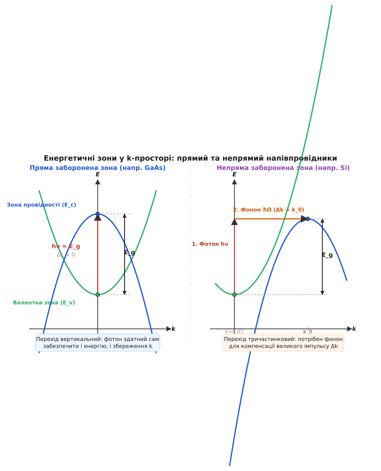
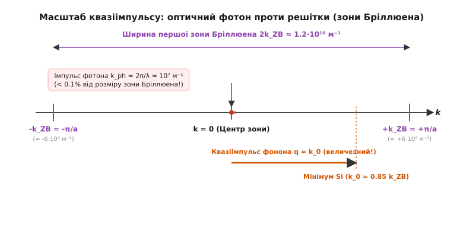
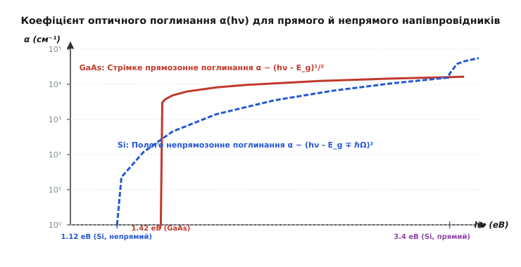
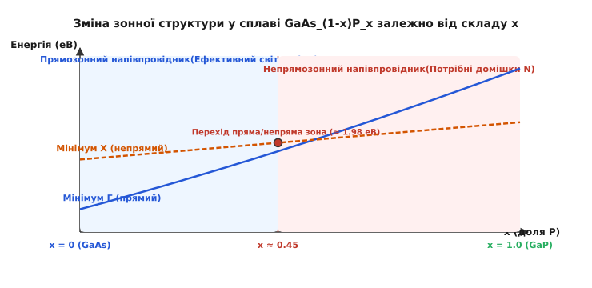

# Пряма і непряма заборонена зона

<preknowlist>
- [Енергетичні зони](topic:physics/conductors-insulators) — валентна зона, зона провідності та заборонена зона E_g у твердому тілі.
- [Напівпровідники](topic:physics/semiconductor) — власна та домішкова провідність, носії заряду та ефективна маса.
- [Лазерні діоди](topic:physics/laser-diode-physics) — рекомбінація та підсилення світла в напівпровідникових гетероструктурах.
</preknowlist>

Спроба зробити світлодіод із звичайного чистісінького кремнію завершується невдачею: напівпровідниковий `p-n`-перехід пропускає струм, нагрівається, але практично не випромінює світла. Тим часом кристал арсеніду галію (`GaAs`), який має майже таку саму ширину забороненої зони, яскраво спалахує інфрачервоним або червоним випромінюванням. Причина цієї фундаментальної відмінності лежить не в хімічному складі чи чистоті матеріалу, а в квантово-механічній геометрії енергетичних зон у просторі квазіімпульсів.

### Дисперсія електронних станів у кристалічній решітці

Електрон у періодичному потенціалі кристалічної решітки описується блохівською хвилею, а його стан визначається не просто енергією `E`, а й хвильовим вектором `k` — квазіімпульсом `p = ℏk` (лат. *quasi* — ніби, як, бо квазіімпульс зберігається з точністю до вектора оберненої решітки). Залежність енергії від хвильового вектора `E(k)` називається законом дисперсії (лат. *dispersio* — розсіяння).

У трьохвимірному кристалі `E(k)` утворює складну тривимірну зонну структуру всередині першої зони Бріллюена. Для електронних і оптичних процесів найважливішими є дві енергетичні зони:
1. **Валентна зона (`E_v`):** найвища заповнена зона за абсолютного нуля температур. Її максимум описує енергетичний стан найменш зв'язаних валентних електронів. У більшості напівпровідників валентна зона утворена `p`-орбіталями і складається з трьох субзон: важких дірок (`hh`, англ. *heavy holes*), легких дірок (`lh`, англ. *light holes*) та спін-орбітально відщепленої зони (`so`, англ. *spin-orbit split-off*).
2. **Зона провідності (`E_c`):** найнижча порожня зона, куди електрон потрапляє після збудження. Її мінімум описує стан з найменшою енергією вільного електрона.

Різниця між мінімумом зони провідності та максимумом валентної зони визначає ширину забороненої зони `E_g = E_c,min - E_v,max`. Проте критично важливим для оптичних переходів є те, **у яких саме точках `k`-простору** розташовані ці екстремуми.

Біля своїх екстремумів зони можна апроксимувати параболами, де кривина визначає тензор ефективної маси носіїв заряду `m*`:

```
m* = ℏ² / (d²E / dk²)
```

Що крутіша парабола `E(k)`, то менша ефективна маса електрона чи дірки і то вища їхня рухливість у кристалічному полі.

### Пряма заборонена зона: двочастинковий вертикальний перехід

Напівпровідник називається **прямозонним** (англ. *direct bandgap*), якщо максимум валентної зони `E_v,max` та мінімум зони провідності `E_c,min` досягаються при **одному й тому самому значенні квазіімпульсу** `k`. Здебільшого цей спільний мінімум лежить у центрі зони Бріллюена — в точці `k = 0` (так званій точці `Γ`).

Типовими представниками прямозонних напівпровідників є сполуки `A^(III)B^(V)` та `A^(II)B^(VI)`: арсенід галію (`GaAs`), фосфід індію (`InP`), нітрид галію (`GaN`), сульфід кадмію (`CdS`), теллурид кадмію (`CdTe`).


*Зонна структура у k-просторі. Ліворуч: у прямозонному напівпровіднику (GaAs) мінімум E_c і максимум E_v збігаються при k=0, що дозволяє вертикальний оптичний перехід без зміни імпульсу. Праворуч: у непрямозонному напівпровіднику (Si) мінімум E_c зміщений у точку k_0, тому оптичний перехід вимагає участі фонона.*

Під час міжзонного оптичного переходу (поглинання або випромінювання фотона) мусять одночасно виконуватися два фундаментальні закони збереження — енергії та квазіімпульсу:

```
1) Збереження енергії:   E_c(k_f) - E_v(k_i) = ℏω   [де ℏω — енергія фотона]
2) Збереження імпульсу:  k_f = k_i + k_ph          [де k_ph — хвильовий вектор фотона]
```

Оптичний фотон (гр. *phōs* — світло) з енергією порядку `ℏω ≈ 1...2 еВ` має довжину хвилі `λ ≈ 600...1000 нм`. Йому відповідає хвильовий вектор `k_ph = 2π / λ ≈ 10⁷ м⁻¹`. Водночас розмір першої зони Бріллюена становить `k_ZB = π / a ≈ 6·10⁹ м⁻¹` (де `a ≈ 0.5 нм` — період кристалічної решітки).

Отже, імпульс оптичного фотона становить **менше 0.1%** від розміру зони Бріллюена! На діаграмі `E(k)` вектор фотона практично непомітний, тому оптичний перехід електрона виглядає як **строго вертикальна лінія** (`Δk ≈ 0`).

У прямозонному напівпровіднику електрон із максимуму валентної зони при `k = 0` після поглинання фотона потрапляє безпосередньо в мінімум зони провідності при `k = 0`. І навпаки: електрон із мінімуму зони провідності рекомбінує з діркою у валентній зоні, віддаючи всю надлишкову енергію безпосередньо у вигляді кванта світла.

Оскільки в переході беруть участь лише дві частинки (електрон та фотон), ймовірність випромінювальної рекомбінації описується першим порядком теорії збурень. Детальний математичний розрахунок ймовірностей таких переходів за Золотим правилом Фермі винесено в [квантово-механічний розрахунок міжзонного поглинання](topic:physics/direct-indirect-bandgap/math-bandgap-transition.md).

З розрахунку випливають дві важливі характеристики прямозонних матеріалів:
- **Короткий час життя носіїв:** випромінювальна рекомбінація відбувається дуже швидко — за `τ ≈ 1...10 нс`.
- **Високий коефіцієнт поглинання:** для енергій фотонів `ℏω ≥ E_g` коефіцієнт поглинання стрімко зростає за законом `α(ℏω) = A · (ℏω - E_g)^(1/2)` і досягає великих значень `α ≈ 10⁴...10⁵ см⁻¹`.

### Непряма заборонена зона: тричастинковий фононний перехід

Напівпровідник називається **непрямозонним** (англ. *indirect bandgap*), якщо максимум валентної зони знаходиться в одній точці `k`-простору (зазвичай при `k = 0`), а мінімум зони провідності зміщений у дещо іншу точку `k_0 ≠ 0`.

Класичними непрямозонними напівпровідниками є найважливіші матеріали мікроелектроніки:
- **Кремній (`Si`):** `E_g = 1.12 еВ`, мінімум зони провідності розташований уздовж кристалографічного напрямку `[100]` на відстані `k_0 ≈ 0.85 k_ZB` від центра зони.
- **Германій (`Ge`):** `E_g = 0.66 еВ`, мінімум зони провідності лежить на межі зони Бріллюена в точці `L` уздовж напрямку `[111]`.
- **Карбід кремнію (`SiC`), Фосфід галію (`GaP`), Алмаз (`C`).**

Якщо електрон перебуває в дні зони провідності непрямого напівпровідника (при `k = k_0`), він не може просто випромінити фотон і впасти у валентну зону (при `k = 0`). Для цього йому потрібно змінити свій квазіімпульс на величезну величину `Δk = k_0 - 0 = k_0 ≈ 10⁹...10¹⁰ м⁻¹`. Оптичний фотон не здатний забрати такий імпульс.


*Порівняння масштабів імпульсів. Хвильовий вектор оптичного фотона k_ph становить менше 0.1% від ширини зони Бріллюена, тоді як квазіімпульс фонона q перекриває більшу частину зони, забезпечуючи збереження імпульсу під час непрямого переходу.*

Щоб перехід відбувся, у процесі **мусить взяти участь третя частинка** — квант коливань кристалічної решітки, тобто **фонон** (гр. *phōnē* — звук). Фонони мають низькі енергії (`ℏΩ ≈ 10...50 меВ`), проте величезні квазіімпульси `q = π / a`, що легко перекривають усю зону Бріллюена.

Непрямий оптичний перехід є **тричастинковим двостадійним процесом** і розраховується за другим порядком теорії збурень:
1. Електрон поглинає фотон з енергією `ℏω`, піднімаючись вертикально у віртуальний стан.
2. Одночасно електрон поглинає або випромінює фонон із квазіімпульсом `q ≈ k_0` та енергією `ℏΩ`, розсіюючись горизонтально у мінімум зони провідності.

Оскільки для відбуття переходу потрібне одночасне зіткнення трьох квантових об'єктів (електрона, фотона та фонона), ймовірність непрямого переходу на **3–4 порядки нижча**, ніж прямого.

Це призводить до фундаментальних наслідків:
- **Величезний час життя носіїв:** відносно випромінювальної рекомбінації час життя носіїв у кремнії становить від мікросекунд до мілісекунд (`τ ≈ 10⁻⁶...10⁻³ с`).
- **Домінування безипромінювальних процесів:** За цей довгий час електрон майже гарантовано віддає свою енергію безипромінювально — через дефекти решітки (центри рекомбінації Шокли-Рида-Холла) або через безипромінювальне передавання енергії іншому електрону (Оже-рекомбінація).
- **Пологе оптичне поглинання:** Коефіцієнт поглинання біля краю зростає набагато повільніше — за квадратичним законом `α(ℏω) ∝ (ℏω - E_g ∓ ℏΩ)²`, а його величина становить лише `α ≈ 10¹...10³ см⁻¹`.


*Коефіцієнт оптичного поглинання α(hν). У прямозонному GaAs поглинання починається стрибкоподібно при hν = 1.42 еВ і досягає 10⁴ см⁻¹. У непрямозонному Si поглинання біля краю (1.12 еВ) є пологим і лише при енергії hν > 3.4 еВ (де вмикаються прямі переходи) стрімко зростає.*

Як видно зі спектра, у непрямозонному кремнії при енергіях фотона `hν > 3.4 еВ` також стають можливими прямі переходи (оскільки при високих енергіях зона провідності має прямий мінімум над валентною зоною). Проте ця енергія відповідає ультрафіолетовому діапазону, тоді як для видимого та інфрачервоного світла поглинання залишається непрямим і слабким.

### Температурна залежність та ефекти сильного легування

Ширина забороненої зони `E_g` не є абсолютно постійною константою матеріалу — вона змінюється під впливом температури, деформації кристалічної решітки та високої концентрації домішок.

#### 1. Температурний зсув Варшні
З підвищенням температури `T` амплітуда теплових коливань атомів решітки зростає, що призводить до розширення кристала та посилення електрон-фононної взаємодії. Це спричиняє звуження забороненої зони, яке описується емпіричною формулою Варшні (Varshni):

```
E_g(T) = E_g(0) - (α_V · T²) / (T + β_V)
```

де `E_g(0)` — ширина забороненої зони при `0 K`, а `α_V` та `β_V` — константи матеріалу. Наприклад, для кремнію `E_g(0) = 1.17 еВ`, `α_V = 4.73·10⁻⁴ еВ/К`, `β_V = 636 К`, що при `300 К` дає `E_g = 1.12 еВ`. Для арсеніду галію `E_g(0) = 1.52 еВ`, що при кімнатній температурі спадає до `1.42 еВ`. Звуження забороненої зони при нагріванні зсуває край оптичного поглинання у довгохвильову (червону) область спектра.

#### 2. Ефект Бурштейна — Мосса
При дуже високому рівні домішкового легування `n`-типу (коли рівень Фермі `E_F` заходить усередину зони провідності) нижні стани зони провідності виявляються повністю заповненими електронами згідно з принципом Паулі. Поглинання фотона стає можливим лише тоді, коли електрон з валентної зони закидається на перші **вільні** стани вище рівня Фермі. Це спричиняє оптичне розширення забороненої зони (зсув Бурштейна — Мосса):

```
ΔE_BM = E_g,eff - E_g,0 = (ℏ² / 2m_r) · (3 π² n)^(2/3)
```

де `n` — концентрація вільних електронів. Цей ефект активно використовується у прозорих провідних оксидах (наприклад, `ITO`, оксид індію-олова), роблячи їх прозорими для видимого світла при збереженні металевої провідності.

### Практичні наслідки для фотоніки та напівпровідникових приладів

Розбіжність між прямозонними та непрямозонними напівпровідниками формує чіткий поділ усієї сучасної фотоніки.

#### 1. Світлодіоди та лазери
Для ефективної генерації світла потрібні коефіцієнти квантового виходу, близькі до 100%. У непрямозонному кремнії квантовий вихід випромінювання становить менше `0.01%` — решта енергії перетворюється на тепло. Тому **з кремнію неможливо побудувати ефективний світлодіод чи напівпровідниковий лазер**. Усі напівпровідникові джерела світла розробляються виключно на прямозонних сполуках: `GaAs`, `InP`, `GaN`, `InGaN`, `AlGaInP`.

#### 2. Сонячні батареї та фотодіоди
Для поглинання світла непрямозоність не є категоричною перепоною, проте вона визначає товщину приладу.

Згідно з законом Бугера — Ламберта — Бера, інтенсивність світла з глибиною згасає як `I(d) = I_0 · exp(-α · d)`. Щоб поглинути 95% падаючого фотонного потоку, потрібна товщина шару `d_95 ≈ 3.0 / α`.

- **Прямозонний `GaAs` (`α ≈ 3·10⁴ см⁻¹`):** `d_95 ≈ 3 / 30000 см ≈ 1 мкм`. Вистачає найтоншої мікронної плівки. Це дає змогу будувати легкі та надмогутні сонячні панелі для космічних апаратів.
- **Непрямозонний `Si` (`α ≈ 10³ см⁻¹` для червоного світла):** `d_95 ≈ 3 / 1000 см ≈ 300 мкм`. Потрібна масивна кремнієва пластина товщиною в третину міліметра.

Оцінку товщин та розрахунок коефіцієнтів для різних довжин хвиль наведено в [програмі розрахунку поглинання та товщини напівпровідника](topic:physics/direct-indirect-bandgap/proj-bandgap-calc.md).

> 🔧 **Навіщо це.** Поділ на прямі й непрямі зони пояснює поділ праці у напівпровідниковій індустрії: **Кремній (`Si`)** є королем обчислювальної мікроелектроніки (процесори, пам'ять, кремнієва фотоніка) завдяки ідеальній технології вирощування монокристалів та утворенню якісного ізолятора `SiO_2`. Але для створення **оптичних випромінювачів** (лазерів лідарів, світлодіодів підсвітки, волоконно-оптичних передавачів) на кремнієвий кристал доводиться фізично інтегрувати мікрочіпи з прямозонного **арсеніду галію (`GaAs`)** або **фосфіду індію (`InP`)**.

### Інженерія зонної структури (Bandgap Engineering)

Чи можна змусити непрямозонний матеріал випромінювати світло або перетворити його на прямозонний? Фізика твердого тіла дає кілька методів подолання непрямозоності.

#### 1. Зміна складу твердих розчинів
У потрійному напівпровідниковому сплаві `GaAs_(1-x)P_x` при зміні мольної частки фосфору `x` змінюється положення мінімумів зони провідності.


*Зсув енергетичних мінімумів Γ та X у сплаві GaAs_(1-x)P_x. При x < 0.45 мінімум Γ лежить нижче за X, матеріал є прямозонним і ефективно випромінює червоне світло. При x > 0.45 матеріал стає непрямозонним.*

Чистий `GaAs` (`x = 0`) має прямозонний мінімум в точці `Γ` (`E_g = 1.42 еВ`). Чистий `GaP` (`x = 1.0`) є непрямозонним з мінімумом у точці `X` (`E_g = 2.26 еВ`). При збільшенні `x` енергія мінімуму `Γ` зростає швидше за енергію мінімуму `X`. При `x ≈ 0.45` лінії перетинаються:
- При `x < 0.45`: мінімум `Γ` лежить нижче, матеріал є **прямозонним** і ефективно випромінює червоне світло.
- При `x > 0.45`: нижчим стає мінімум `X`, матеріал стає **непрямозонним**.

Детальний процес розробки перших світлодіодів висвітлено в [історії відкриття світлодіодів та боротьби з непрямозоністю](topic:physics/direct-indirect-bandgap/hist-led-discovery.md).

#### 2. Ізоелектронні домішки та розмиття імпульсу
Для створення зелених світлодіодів на непрямозонному `GaP` (`E_g = 2.26 еВ`) до нього додають ізоелектронну домішку Азоту (`N`), який заміщує Фосфор.

Оскільки Азот міцно утримує захоплений електрон у тісному просторовому об'ємі радіусом `Δx ≈ 0.5 нм`, за фундаментальним квантовим співвідношенням невизначеностей Гейзенберга:

```
Δx · Δk ≥ 1/2
```

Сильна просторова локалізація (`Δx → 0`) призводить до сильного розмиття імпульсу електрона у `k`-просторі (`Δk → ∞`). Його хвильова функція "розмазується" по всій зоні Бріллюена, набуваючи значної амплітуди в точці `k = 0`. Це дозволяє електрону рекомбінувати з діркою без участі фононів.

#### 3. Квантово-розмірні ефекти та квантові точки
Якщо розмір кристала кремнію зменшити до кількох нанометрів (квантові точки або пористий кремній), квантове обмеження руху електронів у нанооб'ємі `L ≈ 2...5 нм` також розмиває імпульс `Δk ≈ π / L`. Нанокристали кремнію починають помітно люмінесціювати у видимому діапазоні.

---

### Порівняльний синтез характеристик

| Характеристика | Пряма заборонена зона (Direct) | Непряма заборонена зона (Indirect) |
| :--- | :--- | :--- |
| **Геометрія екстремумів** | `k_min(E_c) = k_max(E_v)` (точка `Γ`, `k=0`) | `k_min(E_c) ≠ k_max(E_v)` (`k_0 ≠ 0`) |
| **Типові матеріали** | `GaAs`, `InP`, `GaN`, `CdS`, `InGaAs` | `Si`, `Ge`, `SiC`, `GaP`, `AlAs` |
| **Учасники оптичного переходу** | Двочастинковий: Електрон + Фотон | Тричастинковий: Електрон + Фотон + Фонон |
| **Час життя носіїв `τ`** | Дуже малий (`1...10 нс`) | Великий (`1...1000 мкс`) |
| **Коефіцієнт поглинання `α`** | Стрімкий `α ∝ (hν - E_g)^(1/2)` (`10⁴...10⁵ см⁻¹`) | Пологий `α ∝ (hν - E_g ∓ ℏΩ)²` (`10¹...10³ см⁻¹`) |
| **Необхідна товщина поглинання** | Тонка плівка (`d ≈ 1...3 мкм`) | Товста пластина (`d ≈ 150...300 мкм`) |
| **Основне застосування** | Світлодіоди (LED), лазери, швидкі фотодіоди | Мікропроцесори, силові транзистори, сонячні панелі |

---

Коротко: Фізична відмінність між прямозонними та непрямозонними напівпровідниками полягає в **збігу або розходженні квазіімпульсів** мінімуму зони провідності та максимуму валентної зони в `k`-просторі. Оскільки імпульс оптичного фотона мікроскопічний порівняно з розмірами зони Бріллюена (`< 0.2%`), у прямозонних матеріалах (`GaAs`, `GaN`) перехід є двочастинковим і вертикальним, забезпечуючи високу ймовірність випромінювання світла й малий час життя носіїв (`~1 нс`). У непрямозонних матеріалах (`Si`, `Ge`) перехід вимагає участі третьої частинки — фонона — для компенсації квазіімпульсу `Δk ≈ k_0`, що робить міжзонне випромінювання вкрай малоймовірним, а поглинання світла пологим. Це пояснює, чому мікросхеми будують із кремнію, а лазери та світлодіоди — виключно із прямозонних сполук III-V.
