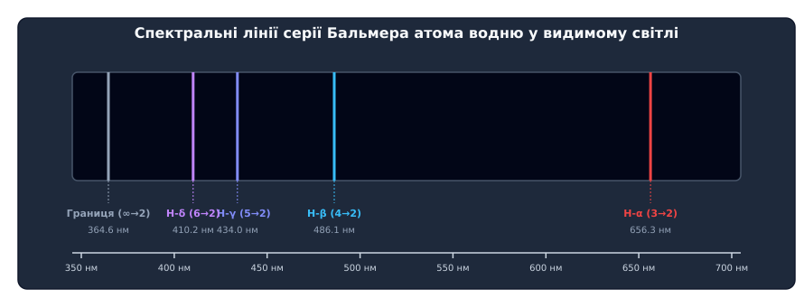
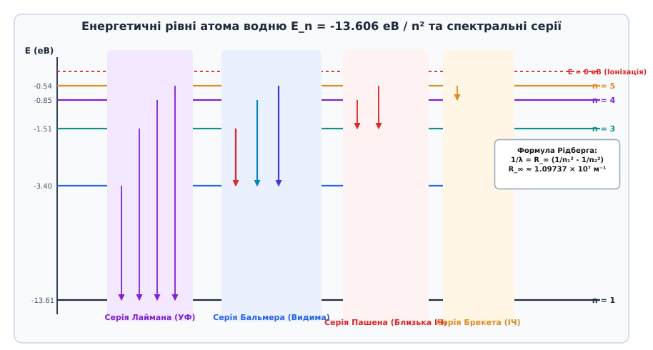
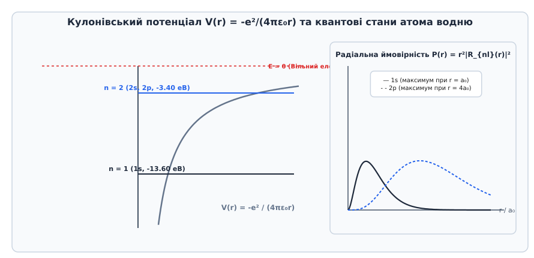

# Спектр водню і стала Рідберга

<preknowlist>
- [Одновимірне стаціонарне рівняння Шредінгера](topic:physics/stationary-schrodinger-equation) — квантові стани, хвильова функція та власні значення енергії.
- [Оператор моменту імпульсу](topic:physics/quantum-mechanics/angular-momentum-operator) — сферичні гармоніки, орбітальне квантове число l та проєкція m.
- [Спін електрона](topic:physics/electron-spin) — власний момент імпульсу s = 1/2 та тонке розщеплення рівнів.
</preknowlist>

При проходженні електричного розряду крізь розріджений газ атомарного водню газорозрядна трубка випромінює характерне малиново-рожеве світло. Якщо це випромінювання спрямувати крізь вузьку колімаційну щілину на оптичну призму або дифракційну ґратку, воно розпадається не на суцільну райдужну смугу, а на дискретний набір окремих яскравих кольорових ліній. У видимому діапазоні від 380 до 750 нм спостерігаються лише чотири чіткі лінії: червона `H_α` (656.3 нм), блакитна `H_β` (486.1 нм), синьо-фіолетова `H_γ` (434.0 нм) та фіолетова `H_δ` (410.2 нм).

Спроба пояснити існування цих ліній у межах класичної електродинаміки Максвелла та класичної механіки Ньютона приводить до фундаментальної суперечності. Електрон із масою `m_e` та зарядом `-e`, що рухається по коловій орбіті радіуса `r` навколо позитивного ядра зі швидкістю `v`, має доцентрове прискорення `a = v² / r`. За законами класичної електродинаміки, прискорений заряд неперервно випромінює електромагнітні хвилі потужністю:

```
P = (e² · a²) / (6 · π · ε₀ · c³)
```

Втрачаючи кінетичну енергію на випромінювання, електрон мав би безупинно зменшувати радіус орбіти, збільшувати частоту обертання `ω(t)` і впродовж приблизно `10⁻¹¹` секунди упасти на протон. При цьому атоми випромінювали б суцільний спектр усіх частот від нуля до безмежності, а стабільна речовина у Всесвіті виявилася б неможливою.


*Лінійчатий спектр випромінювання атома водню у видимому діапазоні (серія Бальмера).*

Спостережувана дискретність спектра та абсолютна стабільність атома водню стали першим беззаперечним доказом квантування внутрішніх станів матерії. 

Детальний аналіз хронологічного шляху від перших емпіричних спроб Йоганна Бальмера та Йоганнеса Рідберга до квантовомеханічного обґрунтування Ніком Бором наведено у вставці [📜 Історія відкриття формули Бальмера та сталі Рідберга](topic:physics/hydrogen-spectrum/hist-balmer-rydberg.md).

---

## 1. Дискретність атомного випромінювання та спектральні серії

Атом водню є найпростішою квантовомеханічною системою у Всесвіті: він складається з одного позитивно зарядженого ядра (протона) та одного електрона. Попри свою простість, спектр його випромінювання містить багату та суворо впорядковану структуру.

Експериментальні дослідження показали, що всі випромінені або поглинуті атомом водню хвильові числа `ν̄ = 1 / λ` підкоряються єдиному емпіричному закону Бальмера — Рідберга:

```
ν̄ = 1 / λ = R_∞ · Z² · (1 / n₁² - 1 / n₂²)
```

де `Z` — атомний номер (`Z = 1` для нейтрального водню, `Z = 2` для `He⁺`, `Z = 3` для `Li²⁺`), `n₁` та `n₂` — цілі додатні числа (`n₂ > n₁`), а `R_∞` — фундаментальна **стала Рідберга**.

Фізичний зміст цього співвідношення розкривається через комбінаційний принцип Рітца: хвильове число фотона є різницею двох спектральних термів `T(n) = R_∞ / n²`. Це означає, що енергія атома водню не може приймати довільних значень, а квантується у вигляді дискретного набору енергетичних рівнів:

```
E_n = - (h · c · R_∞ / n²) = - (E₀ / n²)
```

де `E₀ ≈ 13.606 еВ` — **енергія зв'язку (іонізації)** атома водню в основному стані `n = 1`.


*Енергетична діаграма рівнів E_n = -13.6 еВ / n² атома водню з переходами для серій Лаймана, Бальмера, Пашена та Брекета.*

Усі спектральні лінії атома водню групуються у спектральні серії залежно від нижнього квантового стану `n₁`, на який відбувається перехід електрона зі вищого стану `n₂`:

1. **Серія Лаймана (`n₁ = 1`, `n₂ = 2, 3, 4...`)**: переходи на основний стан `1s`. Усі лінії лежать в ультрафіолетовій (УФ) області спектра. Найдовша хвиля серії (лінія `L_α`, перехід `2 → 1`) має довжину хвилі `λ = 121.57 нм`, а границя серії при `n₂ → ∞` становить `λ_lim = 91.18 нм` (відповідає фотону з енергією іонізації `13.606 еВ`).
2. **Серія Бальмера (`n₁ = 2`, `n₂ = 3, 4, 5...`)**: переходи на перший збуджений стан `n = 2`. Перші чотири лінії лежать у видимому діапазоні оптичного випромінювання:
   - `H_α` (`3 → 2`): `λ = 656.28 нм` (яскраво-червоне світло, ключова лінія астрофізики);
   - `H_β` (`4 → 2`): `λ = 486.13 нм` (блакитне світло);
   - `H_γ` (`5 → 2`): `λ = 434.05 нм` (синьо-фіолетове світло);
   - `H_δ` (`6 → 2`): `λ = 410.17 нм` (фіолетове світло).
   Границя серії `n₂ → ∞` відповідає довжині хвилі `λ_lim = 364.6 нм` в ближньому ультрафіолеті.
3. **Серія Пашена (`n₁ = 3`, `n₂ = 4, 5, 6...`)**: переходи на стан `n = 3`. Усі лінії знаходяться в близькій інфрачервоній (ІЧ) області (`λ` від `1875 нм` до границы `820.4 нм`).
4. **Серія Брекета (`n₁ = 4`, `n₂ = 5, 6, 7...`)**: середній інфрачервоний діапазон (`λ` від `4.05 мкм` до границы `1.458 мкм`).
5. **Серія Пфунда (`n₁ = 5`, `n₂ = 6, 7, 8...`)**: інфрачервоний діапазон (`λ` від `7.46 мкм` до границы `2.279 мкм`).
6. **Серія Гемфрі (`n₁ = 6`, `n₂ = 7, 8, 9...`)**: далекий інфрачервоний діапазон (`λ` від `12.37 мкм` до границы `3.282 мкм`).

---

## 2. Квантовомеханічна теорія воднеподібного атома

У сучасній квантовій механіці енергетичні стани атома водню отримують як власні значення стаціонарного тривимірного рівняння Шредінгера.

Кулонівська потенціальна енергія взаємодії електрона з ядром є сферично симетричною:

```
V(r) = - (Z · e²) / (4 · π · ε₀ · r)
```

Тривимірне рівняння Шредінгера для хвильової функції `Ψ(r, θ, φ)` у сферичних координатах має вигляд:

```
- (ℏ² / (2μ)) · ∇² Ψ(r, θ, φ) - (Z · e² / (4 · π · ε₀ · r)) · Ψ(r, θ, φ) = E · Ψ(r, θ, φ)
```

де `μ` — скорочена маса системи електрон-ядро.

Оскільки кулонівський потенціал залежить лише від відстані `r`, оператор Гамільтона `H` комутує з операторами квадрата орбітального моменту імпульсу `L²` та його проєкції `L_z`. Це дозволяє розділити змінні у сферичних координатах:

```
Ψ_{n, l, m}(r, θ, φ) = R_{n, l}(r) · Y_{l, m}(θ, φ)
```

де `Y_{l, m}(θ, φ)` — сферичні гармоніки, що описують кутовий розподіл ймовірності, а `R_{n, l}(r)` — радіальна хвильова функція.


*Кулонівська потенціальна яма та радіальний розподіл ймовірності виявлення електрона P(r) для станів 1s та 2p.*

Точний розв'язок радіального рівняння приводить до трьох дискретних цілочисельних квантових чисел, які повністю характеризують стаціонарний квантовий стан електрона:

1. **Головне квантове число `n` (`n = 1, 2, 3...`)**: визначає повну енергію стану та середню відстань електрона від ядра.
2. **Орбітальне квантове число `l` (`l = 0, 1, 2 ... n-1`)**: визначає модуль орбітального моменту імпульсу `|L| = √(l(l + 1)) ℏ` та геометричну форму електронної хмари (орбіталі `s, p, d, f`).
3. **Магнітне квантове число `m_l` (`m_l = -l, -l+1 ... +l`)**: визначає проєкцію орбітального моменту на обрану вісь quantization `L_z = m_l ℏ` (всього `2l + 1` можливих проєкцій).

### Просторова структура радіальних хвильових функцій

Радіальні хвильові функції `R_{n, l}(r)` виражаються через приєднані поліноми Лагерра `L_{n-l-1}^{2l+1}(ρ)`:

```
R_{n, l}(r) = N_{n, l} · (2r / (n a₀))^l · exp(- r / (n a₀)) · L_{n-l-1}^{2l+1}(2r / (n a₀))
```

де `a₀ = (4 π ε₀ ℏ²) / (m_e e²) ≈ 0.0529177 нм` — **борівський радіус** (найімовірніша відстань від ядра для електрона в стані `1s`), а `N_{n, l}` — нормувальний коефіціент.

Аналіз радіальної густини ймовірності `P(r) = r² |R_{n, l}(r)|²` показує важливі фізичні закономірності:

- Для **основного стану 1s** (`n=1, l=0`): функція `R₁₀(r) = 2 a₀⁻³/² exp(-r/a₀)` досягає максимуму в самому центрі `r = 0`, а ймовірність виявлення електрона `P(r)` має єдиний максимум точно при `r = a₀`.
- Для **стану 2s** (`n=2, l=0`): функція має один внутрішній радіальний вузол у точці `r = 2a₀`, де ймовірність знаходження електрона строго дорівнює нулю, та два максимуми радіальної густини.
- Для **стану 2p** (`n=2, l=1`): хвильова функція дорівнює нулю в центрі ядра (`R₂₁(0) = 0`) через наявність центробіжного бар'єра `l(l + 1) / r²`, а максимум радіальної ймовірності досягається при `r = 4a₀`.

### Виродження енергетичних рівнів

У чисто нерелятивістському кулонівському полі енергія стану залежить **виключно від головного квантового числа `n`** і взагалі не залежить від `l` та `m_l`.

Крайнє виродження за магнітним квантовим числом `m_l` (`2l + 1` станів) зумовлене ізотропією тривимірного простору (сферичною симетрією потенціалу `V(r)`).

Проте додаткове виродження за орбітальним квантовим числом `l` (коли стани `2s` та `2p` мають строго однакову енергію) є специфічною властивістю саме кулонівського потенціалу `V(r) ∝ 1/r`. У класичній механіці цьому відповідає замкненість еліптичних орбіт Кеплера та збереження вектора Рунге — Ленца. У квантовій механіці оператор Рунге — Ленца комутує з Гамільтоніаном, утворюючи приховану динамічну симетрію `SO(4)`.

З урахуванням спіну електрона `s = 1/2` (який дає `2s + 1 = 2` спінових стани `m_s = ±1/2`), кратність виродження енергетичного рівня `E_n` дорівнює:

```
g_n = 2 · ∑_{l=0}^{n-1} (2l + 1) = 2 · n²
```

Для основного стану `n = 1` кратність виродження `g₁ = 2` (два спінових стани 1s). Для другого рівня `n = 2` кратність `g₂ = 8` (стани `2s` та `2p`).

Детальний математичний вивід радіального рівняння Шредінгера, оболонкових поліномів Лагерра та квантування енергії подано у вставці [🧮 Виведення сталі Рідберга та енергетичних рівнів з рівняння Шредінгера](topic:physics/hydrogen-spectrum/math-rydberg-derivation.md).

---

## 3. Правила відбору та квантові переходи

Не кожен уявний квантовий перехід між енергетичними рівнями `(n₂, l₂, m₂) → (n₁, l₁, m₁)` супроводжується випромінюванням або поглинанням фотона.

У дипольному наближенні ймовірність спонтанного переходу за одиницю часу описується першим коефіцієнтом Ейнштейна `A_{21}` та залежить від кутових матричних елементів дипольного моменту `D = - e r`:

```
A_{21} = (4 · e² · ω²₁³) / (3 · h · c³) · |⟨Ψ₁| r |Ψ₂⟩|²
```

Оскільки дипольний оператор `r` є непарним вектором щодо інверсії просторових координат, матричний елемент дорівнює нулю, якщо хвильові функції початкового та кінцевого станів мають однакову парність.

Це формулює **дипольні правила відбору**:

1. **Зміна орбітального квантового числа `Δl`**:
   
   ```
   Δl = l₁ - l₂ = ± 1
   ```
   
   Переходи між станами з однаковим `l` (наприклад, `2s → 1s` або `3p → 2p`) у однофотонному дипольному випромінюванні строго заборонені. Фотон переносить із собою одиничний власний момент імпульсу `s_γ = 1`, тому закон збереження моменту імпульсу вимагає зміни орбітального моменту атома Exactly на `± 1`.
2. **Зміна магнітного квантового числа `Δm_l`**:
   
   ```
   Δm_l = m₁ - m₂ = 0, ± 1
   ```
   
   Перехід з `Δm_l = 0` відповідає `π`-поляризованому випромінюванню (електричний вектор хвилі паралельний осі quantization Z), а переходи з `Δm_l = ± 1` відповідають `σ⁺` та `σ⁻` циркулярно поляризованому випромінюванню.

### Метастабільність стану 2s

Особливий фізичний інтерес викликає перший збуджений стан `2s` (`n=2, l=0`). Єдиним нижчим за енергією станом є основний стан `1s` (`n=1, l=0`).

Проте дипольний перехід `2s → 1s` має `Δl = 0`, що суперечить правилу відбору `Δl = ± 1`. Однофотонний квадрупольний чи магнітно-дипольний перехід є надзвичайно пригніченим.

Тому стан `2s` розпадається переважно через **двофотонне випромінювання (`2s → 1s + 2γ`)**, при якому електрон одночасно випромінює два фотони із сумарною енергією `h ν₁ + h ν₂ = E₂ - E₁ = 10.2 еВ`. Через низьку ймовірність двофотонного процесу час життя стану `2s` становить `τ ≈ 0.122` секунди (122 мілісекунди), що у вісім мільйонів разів перевищує час життя стану `2p` (`τ₂ₚ ≈ 1.6 нс`). Стан `2s` називається **метастабільним**.

---

## 4. Воднеподібні іони та екзотичні атомні системи

Спектральна математика атома водню узагальнюється на цілий клас систем — воднеподібні іони та екзотичні атоми.

### Воднеподібні іони (`Z > 1`)

Одноелектронні іони, такі як одноразово іонізований гелій `He⁺` (`Z = 2`), двічі іонізований літій `Li²⁺` (`Z = 3`) або важкі іони на кшталт `U⁹¹⁺` (`Z = 92`), володіють енергетичним спектром:

```
E_n(Z) = - Z² · (E₀ / n²)
```

- Для **іона гелію `He⁺` (`Z = 2`)**: енергія зв'язку становить `E = - 54.4 еВ` (у 4 рази більше за водень), а борівський радіус зменшується вдвічі: `a(He⁺) = a₀ / 2`. Спектральні серії `He⁺` (серія Пікерінга) знаходяться в ультрафіолетовому та видимому діапазонах, де лінія `n₂=4 → n₁=2` відповідає довжині хвилі `468.6 нм`.
- Для **важких воднеподібних іонів (`Z = 92`)**: енергія зв'язку електрона досягає `E_n ≈ - 115 кеВ`, а орбітальна швидкість електрона на першій орбіті наближається до швидкості світла (`v ≈ Z α c ≈ 0.67 c`). Для таких систем нерелятивістське рівняння Шредінгера повністю втрачає силу, а квантово-електродинамічні ефекти (зсув Лебма) досягають сотень електронвольт.

### Екзотичні атомні системи

У квантовій фізиці вивчаються атоми, у яких електрон або протон замінено на інші фундаментальні частинки:

1. **Мюонний водень (`μ⁻ p⁺`)**: протон захоплює негативний мюон `μ⁻` з масою `m_μ ≈ 206.77 m_e`. Через велику масу скорочена маса системи `μ` зростає у 186 разів, а борівський радіус мюонної орбіти зменшується до `a_μ ≈ 2.56 × 10⁻¹³ м` (у 200 разів менше за `a₀`). Мюон опиняється всередині самого протона, що дозволяє виміряти зарядний радіус протона з екстремальною точністю (загадка радіуса протона).
2. **Позитроній (`e⁺ e⁻`)**: зв'язана система з електрона та його античастинки позитрона. Через рівність мас скорочена маса дорівнює `μ = m_e / 2`. Спектральні лінії позитронію мають довжини хвиль Exactly удвічі більші, ніж відповідні лінії атома водню.
3. **Антиводень (`p̄ e⁺`)**: атомарна система з антипротона та позитрона. Вимірювання спектра `1S → 2S` для антиводню у цернівській лабораторії AD (Antiproton Decelerator) показало повний збіг зі спектром звичайного водню з точністю `10⁻¹²`, підтверджуючи фундаментальну CPT-симетрію Всесвіту.

---

## 5. Стала Рідберга та ефект скороченої маси ядра

Теоретичний розрахунок дає фундаментальну формулу для сталі Рідберга через світові фізичні константи:

```
R_∞ = (m_e · e⁴) / (8 · ε₀² · h³ · c)
```

Підставляючи значення маси електрона `m_e`, заряду `e`, електричної сталої `ε₀`, сталої Планка `h` та швидкості світла `c`, отримуємо значення для нескінченно важкого ядра:

```
R_∞ = 1.0973731568160(21) × 10⁷ м⁻¹
```

### Ефект скороченої маси ядра

У реальному атомі водень протон не є нескінченно важким: його маса `M_p ≈ 1.6726 × 10⁻²⁷ кг` перевищує масу електрона лише в `1836.15` разів. Оскільки електрон і ядро обертаються навколо спільного центру мас, у всіх динамічних рівняннях масу електрона `m_e` необхідно замінити скороченою масою `μ`:

```
μ = (m_e · M) / (m_e + M) = m_e / (1 + m_e / M)
```

Відповідно, ефективна стала Рідберга для конкретного ізотопу з масою ядра `M` становить:

```
R_M = R_∞ / (1 + m_e / M)
```

Для легкого водню (протію `¹H`, маса ядра `M_p`):

```
R_H = R_∞ / (1 + m_e / M_p) ≈ 1.0967758 × 10⁷ м⁻¹
```

Для дейтерію (`²H` або `D`, ядро містить протон і нейтрон, `M_d ≈ 2 · M_p`):

```
R_D = R_∞ / (1 + m_e / M_d) ≈ 1.0970743 × 10⁷ м⁻¹
```

Для тритію (`³H` або `T`, ядро містить протон і два нейтрони, `M_t ≈ 3 · M_p`):

```
R_T = R_∞ / (1 + m_e / M_t) ≈ 1.0971735 × 10⁷ м⁻¹
```

Для позитронію (зв'язаний стан електрона та позитрона, де `M = m_e`): скорочена маса дорівнює точно `μ = m_e / 2`. Енергія зв'язку позитронію становить рівно половину від енергії атома водню (`E₀ = 6.8 еВ`), а стала Рідберга позитронію дорівнює `R_Ps = R_∞ / 2`.

Для мюонію (система з позитивного мюона `μ⁺` та електрона `e⁻`, маса мюона `M_μ ≈ 206.77 m_e`): скорочена маса `μ = 0.99518 m_e`, а спектральні лінії зазнають вимірюваного зсуву відносно протію.

### Відкриття дейтерію через ізотопічний зсув (1931)

Через відмінність між `R_H` та `R_D` всі спектральні лінії дейтерію зсунуті у короткохвильовий бік відносно ліній легкого водню. Для головної лінії серії Бальмера `H_α` (`656.28 нм`) величина цього ізотопічного зсуву становить:

```
Δλ_HD = λ_H - λ_D = λ_H · (1 - R_H / R_D) ≈ 0.178 нм (178 пм)
```

У 1931 році американський фізико-хімік Гарольд Юрі (Harold Urey) використав цей теоретичний розрахунок для пошуку важкого водню. Охолодивши рідкий водень до температури поблизу точки потрійної фази для збагачення важким ізотопом, Юрі за допомогою спектрографа високої роздільної здатності виявив надзвичайно слабкі супутні лінії, зсунуті Exactly на `0.178 нм` від основних ліній водню. Це стало експериментальним відкриттям дейтерію, за яке Юрі отримав Нобелівську премію з хімії 1934 року.

---

## 6. Релятивістські поправки, тонка структура та зсув Лебма

Нерелятивістське рівняння Шредінгера передбачає точне виродження рівнів за орбітальним квантовим числом `l`. Проте спектроскопічні вимірювання високої роздільної здатності показують, що лінія `H_α` насправді є дублетом — вона складається з кількох близьких компонентів, розділених інтервалом `Δλ ≈ 0.014 нм`.

Це розщеплення називається **тонкою структурою** спектральних ліній. Воно пояснюється трьома релятивістськими ефектами однакового порядку величини, які природним чином випливають із релятивістського рівняння Дірака:

1. **Релятивістська поправка до кінетичної енергії (`H_rel`)**: урахування наступного члена розкладу релятивістської енергії `E = √(p²c² + m²c⁴) - mc² ≈ p²/(2m) - p⁴/(8m³c³)`.
2. **Спін-орбітальна взаємодія (`H_SO`)**: у власній системі відліку електрона протон обертається навколо нього, створюючи ефективне магнітне поле `B_eff`. Взаємодія власного магнітного моменту спіну електрона `μ_s` з цим полем описується оператором `H_SO ∝ (L · S)`.
3. **Дарвінівський член (`H_Dar`)**: квантові осциляції позиції електрона (Zitterbewegung) розмивають кулонівський потенціал ядра на відстані порядку комптонівської довжини хвилі, що дає поправку для s-станів (`l = 0`).

Точний розрахунок за формулою Зоммерфельда — Дірака дає релятивістську енергію рівнів водню, яка залежить від головного квантового числа `n` та **повного моменту імпульсу `j`** (`j = l ± 1/2`):

```
E_{n, j} = - (E₀ / n²) · [1 + (α² / n) · (1 / (j + 1/2) - 3 / (4n))]
```

де `α = e² / (4 · π · ε₀ · ℏ · c) ≈ 1 / 137.036` — **стала тонкої структури**.

Оскільки релятивістська поправка залежить від `j`, стани з однаковим `n`, але різними `j` (наприклад, `2P_3/2` з `j = 3/2` та `2P_1/2` з `j = 1/2`) розщеплюються на величину порядку `α² E₀ ≈ 10⁻⁴ еВ`.

### Зсув Лебма та народження квантової електродинаміки (QED)

Згідно з рівнянням Дірака, стани з однаковими `n` та `j`, але різними `l` (наприклад, `2S_1/2` з `l = 0, j = 1/2` та `2P_1/2` з `l = 1, j = 1/2`), мусять мати **строго однакову енергію**.

У 1947 році Уіліс Лебм (Willis Lamb) та Роберт Ретсерфорд (Robert Retherford) за допомогою мікрохвильової радіочастотної спектроскопії експериментально виявили, що рівень `2S_1/2` піднятий відносно рівня `2P_1/2` на частотний інтервал:

```
Δν_Lamb ≈ 1057.8 МГц  (ΔE ≈ 4.37 × 10⁻⁶ еВ)
```

Цей **зсув Лебма (Lamb shift)** неможливо пояснити ні рівнянням Шредінгера, ні рівнянням Дірака. Він виникає внаслідок взаємодії електрона з **нульовими вакуумними осциляціями електромагнітного поля** та самодії електрона через віртуальні фотони. Пояснення зсуву Лебма Хансом Бете, Річардом Фейнманом, Юліаном Швінгером та Томонагою заклало основи **квантової електродинаміки (КЕД)**.

### Надтонка структура та міжзоряна радіолінія 21 см

Крім тонкої структури, енергетичні рівні атома водню мають **надтонку структуру (hyperfine structure)**, зумовлену взаємодією спінового магнітного моменту електрона `S` із власнім магнітним моментом ядра (протона) `I` (`I = 1/2`).

В основному стані `1s` (`n=1, l=0, j=1/2`) спін електрона та спін протона можуть утворювати два можливих стани взаємної орієнтації:

- **Триплетний стан (`F = 1`)**: спіни електрона та протона паралельні.
- **Синглетний стан (`F = 0`)**: спіни електрона та протона антипаралельні (нижчий енергетичний рівень).

Енергетичне розщеплення між цими підрівнями становить `ΔE_hfs ≈ 5.88 × 10⁻⁶ еВ`. При спонтанному переході з триплетного стану у синглетний випромінюється фотон із частотою `ν = 1420.405751 МГц` та довжиною хвилі:

```
λ = 21.106 см
```

Ця радіолінія 21 см є найважливішим інструментом радіоастрономії. Оскільки міжзоряні хмари нейтрального атомарного водню є прозорими для радіохвиль 21 см, саме за цією лінією фізики склали першу карту спіральних рукавів нашої Галактики (Чумацького Шляху) та виявили темну матерію за кривими обертання галактик.

---

## 7. Вплив зовнішніх полів: ефекти Зеємана та Штарка

Під дією зовнішніх електричних або магнітних полів симетрія атома водню порушується, що приводить до додаткового розщеплення енергетичних рівнів.

### Ефект Зеємана у магнітному полі

При поміщенні атома водню у зовнішнє магнітне поле `B` Гамільтоніан отримує додаткову енергію взаємодії з магнітними моментами електрона:

```
H_Z = - (μ_L + μ_S) · B = (e / (2 m_e)) · (L_z + g_e S_z) · B
```

де `g_e ≈ 2.002319` — гіромагнітне відношення електрона.

- **Слабке магнітне поле (`E_Zeeman << ΔE_SO`)**: розщеплення описується за допомогою квантового числа повного моменту `j` та фактора Ланде `g_j`:
  
  ```
  ΔE = g_j · μ_B · B · m_j
  ```
  
  де `m_j = -j ... +j`. Кожен рівень з моментом `j` розпадається на `2j + 1` рівновіддалених зеєманівських підрівнів (аномальний ефект Зеємана).
- **Сильне магнітне поле (`E_Zeeman >> ΔE_SO`, ефект Пашена — Бака)**: спін-орбітальний зв'язок `L · S` розривається. Орбітальний та спіновий моменти прецесують навколо вектора поля `B` незалежно. Рівні розщеплюються за виразом `ΔE = μ_B B (m_l + 2 m_s)`, і спектральний дублет перетворюється на триплет звичайного ефекту Зеємана.

### Ефект Штарка в електричному полі

У зовнішньому однорідному електричному полі `E_ext` потенціальна енергія отримує член `H_Stark = e E_ext z`.

Унікальною властивістю атома водню є наявність **лінійного ефекту Штарка** вже у слабких електричних полях. Це зумовлено `l`-виродженням рівнів у кулонівському полі: стани `2s` та `2p_z` з однаковим `n=2` мають однакову енергію та протилежну парність. Електричне поле змішує ці стани, утворюючи суперпозиційні квантові стани з постійним електричним дипольним моментом `d = 3 e a₀`.

Зсув рівнів при лінійному ефекті Штарка пропорційний першому степеню напруженості поля:

```
ΔE = (3 / 2) · n · (n_k - n_m) · e · a₀ · E_ext
```

де `n_k` та `n_m` — параболічні квантові числа. Лінійний ефект Штарка спричиняє розширення спектральних ліній водню у плазмі гарячих зірок під дією мікрополів навколишніх іонів.

---

## 8. Рідбергівські атоми та міжзоряна рекомбінація

При екстремально високих значеннях головного квантового числа (`n ~ 100 - 500`) атом водню перетворюється на так званий **Рідбергівський атом**. 

Рідбергівські атоми володіють унікальними фізичними властивостями:

1. **Гігантські розміри**: радіус орбіти електрона зростає пропорційно `n²`:
   
   ```
   r_n = n² · a₀
   ```
   
   Для `n = 300` радіус атома досягає `r ≈ 4.76 мкм` (мікрометрів), що у сто тисяч разів перевищує розмір атома в основному стані і порівняно з розміром бактерії.
2. **Величезний час життя**: час життя Рідбергівських станів щодо спонтанного випромінювання зростає як `τ ∝ n³` (для станів з максимальним `l`) або `τ ∝ n⁵`. Для `n ~ 100` час життя досягає мілісекунд.
3. **Екстремальна поляризованість**: дипольна поляризованість Рідбергівського атома масштабується як `α_pol ∝ n⁷`, що робить його надзвичайно чутливим до найменших зовнішніх електричних полів.

У розрідженому міжзоряному середовищі (H II областях галактик) вільні електрони рекомбінують з протонами на високі Рідбергівські рівні. Поспільні переходи `n+1 → n` (наприклад, перехід `H110_α` при `n = 110`) випромінюють фотони у радіодіапазоні (радіорекомбінаційні лінії). Вони дозволяють астрономам вимірювати температуру та густину розрядженої плазми у галактичних туманностях.

---

## 9. Безперервний спектр водню та астрофізичні застосування

Крім дискретних ліній випромінювання та поглинання, спектр водню містить **неперервний спектр (континуум)**.

Континуальний спектр виникає у зв'язано-вільних переходах (фотоіонізація та радіаційна рекомбінація) та вільно-вільних переходах (гальмівне випромінювання та поглинання електрона у полі протона).

1. **Бальмерівський стрибок (Balmer jump)**: при довжині хвилі `λ = 364.6 нм` (границі серії Бальмера) відбувається різкий стрибок коефіцієнта поглинання плазми. Фотони з довжиною хвилі `λ < 364.6 нм` мають достатньо енергії (`E > 3.40 еВ`), щоб іонізувати атом водню з першого збудженого стану `n = 2`, залишаючи вільний електрон із довільною кінетичною енергією `E_kin = h ν - 3.40 еВ`. Величина Бальмерівського стрибка у спектрах зірок слугує точним індикатором температури та тиску в зоряних атмосферах.
2. **Спектральна класифікація зірок**: у гарвардській спектральній класифікації зірок (O, B, A, F, G, K, M) бальмерівські лінії водню досягають максимальної інтенсивності у зірок класу **A** (таких як Вега та Сиріус з температурою поверхні `T ≈ 9500 - 10000 K`). При нижчих температурах (зорі класів K та M, як Сонце) більшість атомів водню знаходиться в основному стані `n=1`, тому лінії Бальмера слабшають. При вищих температурах (зорі класів O та B, `T > 20000 K`) водень повністю іонізується, і атомні лінії зникають.
3. **Уширення спектральних ліній**: експериментальні спектральні лінії водню мають скінченну ширину через трьох фізичних механізмів:
   - *Природне уширення*: зумовлене скінченним часом життя квантових станів та співвідношенням невизначеностей Гейзенберга `ΔE · Δt ≥ ℏ/2`.
   - *Доплерівське уширення*: зумовлене тепловим хаотичним рухом атомів у газі за розподілом Максвелла (пропорційне `√(T / M)`).
   - *Штарківське (тискове) уширення*: зумовлене мікрополями навколишніх іонів та електронів у плазмі (пропорційне густині заряду).

---

## 10. Прецизійні вимірювання та загадка радіуса протона

Завдяки своїй теоретичній чистоті та відсутності складних багатоелектронних кореляцій, атом водню є головним природним вимірювальним еталоном фундаментальної фізики.

Сучасні вимірювання сталої Рідберга проводяться за допомогою методики **бездоплерівської двофотонної лазерної спектроскопії** вузького оптичного переходу `1S → 2S`. Оскільки стан `2S` є метастабільним (час життя `τ ≈ 1/8` секунди через забороненість однофотонного переходу), природна ширина цієї спектральної лінії становить лише `1.3 Гц`.

За допомогою лазерних оптичних гребінок частот (frequency combs) частота переходу `1S → 2S` виміряна з відносною точністю вище `10⁻¹⁵`:

```
ν(1S → 2S) = 2466061413187035.6(1.0) Гц
```

Це робить сталу Рідберга `R_∞` **найточніше виміряною фундаментальною фізичною константою** в історії науки. 

### Загадка зарядного радіуса протона (Proton Radius Puzzle)

У 2010 році міжнародна колаборація CREMA в Інституті Пауля Шеррера (Швейцарія) опублікувала вимірювання зсуву Лебма у мюонному водні (`μ⁻ p⁺`). Завдяки тому, що мюон знаходиться у 200 разів ближче до ядра ніж електрон, зсув Лебма мюонного водню у мільйони разів чутливіший до розміру протона.

Отримане значення зарядного радіуса протона `r_p = 0.84184(67) фм` виявилося на `4%` меншим за значення `r_p = 0.8768(69) фм`, прийняте міжнародним комітетом CODATA на основі спектроскопії звичайного електронного водню. Цей розрив у чотири стандартних відхилення отримав назву **загадки зарядного радіуса протона**. Він стимулював серію нових надпрецизійних вимірювань оптичних ліній `2S → 4P` та `1S → 3S` у звичайному атомарному водні у Гарфінгу, Парижі та Торонто, які повністю підтвердили менше значення `r_p ≈ 0.8414 фм` і привели до глобального узгодженого коригування сталої Рідберга та зарядного радіуса протона у нових редакціях CODATA.

---

## 11. Программне моделювання та оптичний аналіз

Для практичних завдань астрофізики та прецизійної спектроскопії обчислення спектральних ліній атома водню, дейтерію та воднеподібних іонів (`He⁺`, `Li²⁺`) вимагає урахування скороченої маси ядра, показника заломлення повітря та релятивістських поправок.

Повна алгоритмічна реалізація спектрального калькулятора мовами C та C++ з використанням сучасних методів аналізу подана у вставці [⚙️ Програмування розрахунку спектральних ліній та тонкої структури](topic:physics/hydrogen-spectrum/proj-spectrum-calc.md).

> 🔧 **Навіщо це.**
>
> 1. **Астрофізика та космологія**: спектральні лінії серії Бальмера (`H_α`) та радіолінія нейтрального водню `21 см` (перехід між надтонкими рівнями основного стану `1s`) є головним інструментом вивчення Всесвіту. За доплерівським зсувом ліній водню визначають радіальні швидкості зірок, обертання галактик та червоне зсунення далеких квазарів.
> 2. **Аналітична хімія та спектральний аналіз**: емісійна та абсорбційна спектроскопія атомарного водню застосовується для контролю чистоти плазми в термоядерних реакторах (ITER) та аналізу складу газових туманностей.
> 3. **Фундаментальні квантові стандарти**: прецизійне порівняння експериментального спектра водню з виразами КЕД дозволяє перевіряти стабільність фундаментальних констант (сталої тонкої структури `α` та відношення мас `m_e / M_p`) у часі на космологічних масштабах.
