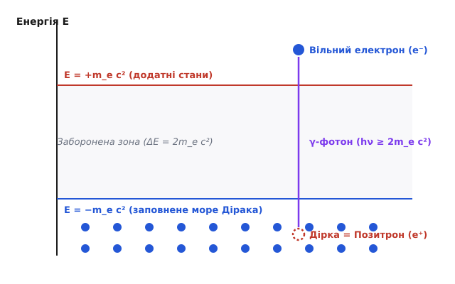
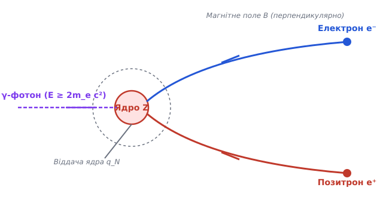
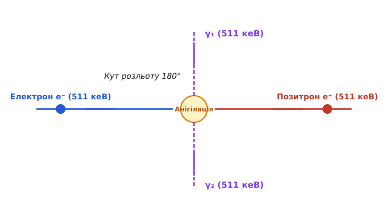

# Народження й анігіляція пар

<preknowlist>
- [Спеціальна теорія відносності](book:physics/special-relativity) — релятивістські співвідношення енергії та імпульсу, 4-вектори та лоренц-інваріанти.
- [Квантування світла та фотони](book:physics/photons) — енергія квантів світла, фотонний імпульс та фотоелектричні явища.
- [Рівняння Дірака та спін](book:physics/dirac-equation) — чотирикомпонентні спінори, від'ємні енергетичні стани та релятивістські ферміони.
</preknowlist>

Коли квантова теорія електромагнітного випромінювання та релятивістська механіка Ейнштейна об'єдналися в єдиній квантовій електродинаміці, фізичний вакуум втратив свій статус класичного порожнього ніщо. Замість інертної порожнечі вакуум виявився динамічним квантовим середовищем, здатним під дією зовнішніх полів народжувати реальні частинки речовини та поглинати їх при зіткненні. Процеси народження електрон-позитронних пар високоенергетичними гамма-квантами та зворотне перетворення пар у випромінювання (анігіляція) є фундаментальними проявами еквівалентності маси та енергії `E = m c²`. Ці процеси доводять, що кількість частинок речовини не збережена безумовно: речовина може виникати з кванта поля та повертатися в поле випромінювання під час взаємодії з фундаментальними зарядами.

## Від'ємні енергетичні стани та фізична природа антиматерії

Спроби утворити релятивістське хвильове рівняння для електрона тривалий час зіштовхувалися з нерозв'язною математичною суперечністю. Вихідне релятивістське співвідношення між енергією `E`, 3-імпульсом `p` та масою спокою `m_e` містить квадрат величини:

```
E² = p² c² + m_e² c⁴
```

Добування квадратного кореня неминуче дає дві симетричні гілки енергетичного спектра:

```
E = +√(p² c² + m_e² c⁴)    [додатні стани: E ≥ +m_e c²]
E = -√(p² c² + m_e² c⁴)    [від'ємні стани: E ≤ -m_e c²]
```

У класичній фізиці розв'язки з від'ємною енергією можна просто відкинути як позбавлені фізичного змісту. У квантовій механіці зробити це неможливо: квантовий стан частинки описується повним набором власних функцій оператора Гамільтона. Якщо вилучити від'ємний спектр, система хвильових функцій стає неповною, а еволюція хвильового пакета порушує принцип збереження ймовірності.

Більш того, квантова система здатна здійснювати спонтанні випромінювальні переходи з вищих енергетичних рівнів на нижчі. Електрон, який початково перебуває у стані з додатною енергією `E ≥ +m_e c²`, повинен був би неперервно випромінювати фотони й випромінювально падативсе глибше у від'ємний спектр аж до мінус нескінченності. Це означало б абсолютну нестабільність будь-якого атома у Всесвіті: електронні оболонки розпалися б за мікросекунди.


*Динаміка моря Дірака: гамма-фотон вибиває електрон із заповненого моря від'ємних станів у додатний спектр, залишаючи незаповнену дірку — позитрон.*

Вихід із цієї глибокої кризи знайшов Поль Дірак у 1930 році. Використовуючи факт, що електрон належить до ферміонів зі спіном 1/2 і підпорядковується принципу заборони Паулі (у кожному квантовому стані може перебувати не більше одного ферміона), Дірак висунув гіпотезу про море Дірака. Згідно з цією концепцією, вакуумний стан Всесвіту характеризується тим, що абсолютно всі від'ємні енергетичні стани `E ≤ -m_e c²` повністю заповнені електронами.

Оскільки всі від'ємні рівні вже зайняті, електрон з додатного спектра `E ≥ +m_e c²` не здатний впасти у від'ємний спектр через заборону Паулі. Звичайний вакуум — це океан від'ємних електронів з нескінченною густиною заряду. Оскільки ця густина є всюди однорідною та константною, наші вимірювальні прилади реєструють відхилення від цього фону, вважаючи його нульовим рівнем відліку.

Якщо високоенергетичний фотон передає електронному морю енергію, яка перевищує ширину енергетичної щілини `ΔE = 2 m_e c² ≈ 1.022 МеВ`, один із електронів моря поглинає фотон і здійснює квантовий стрибок у спектр додатних енергій. У результаті виникають два експериментально спостережуваних об'єкти:
1. **Вільний електрон** у додатному спектрі `E ≥ +m_e c²` з негативним зарядом `-e`.
2. **Дірка** (порожнє місце) у морі від'ємних станів. Відсутність електрона із зарядом `-e` та від'ємною енергією `-E` спостерігається як наявність частинки з позитивним зарядом `+e` та додатною енергією `+E`.

Цю дірку в морі від'ємних станів було названо позитроном (від англ. *positive electron*). Позитрон є першим прикладом антиматерії — частинки зі збереженою масою та спіном звичайного електрона, але протилежним за знаком електричним зарядом і магнітним моментом. Детальний історичний шлях від теоретичного передбачення моря Дірака до виявлення позитронів у космічних променях Карлом Андерсоном у 1932 році описано в [історичній вставці про відкриття позитрона](book:physics/quantum-mechanics/pair-production/hist-dirac-positron.md).

З огляду сучасної квантової теорії поля (КЕД), відмовилися від уявлення про нескінченний неспостережуваний океан електронів від'ємної енергії. Замість цього оператори електронного поля розкладаються на оператори знищення електронів та оператори народження позитронів. Позитрон розглядається як повноправна частинка з додатною енергією, яка рухається у звичайному часі, або математично еквівалентно — як електрон з додатною енергією, що поширюється назад у часі (інтерпретація Фейнмана — Штукельберга).

## Кінематичний механізм народження пар

Народження електрон-позитронної пари є процесом перетворення енергії електромагнітного поля у масу спокою двох ферміонів. Однак один ізольований фотон у порожньому вакуумі не здатний спонтанно розпастися на електрон та позитрон `γ → e⁻ + e⁺`.

Причина полягає в непорушності законів збереження 4-імпульсу та лоренц-інваріантності. 4-імпульс будь-якого реального фотона має нульовий лоренцівський квадрат `k^μ k_μ = 0`, оскільки маса спокою фотона дорівнює нулю. Натомість сумарний 4-імпульс утвореної електрон-позитронної пари у системі її центру мас (де сумарний 3-імпульс `p_- + p_+ = 0`) має інваріантний квадрат `(p_- + p_+)^μ (p_- + p_+)_μ = 4 m_e² c² > 0`. Оскільки скалярний квадрат 4-вектора є лоренц-інваріантом і повинен зберігатися у будь-якій інерціальній системі відліку, рівність `0 = 4 m_e² c²` є математично неможливою.


*Народження електрон-позитронної пари: гамма-фотон взаємодіє з кулонівським полем важкого ядра Z, яке поглинає імпульс віддачі q_N, вигинаючи траєкторії продуктів у протилежні боки в магнітному полі.*

Щоб процес народження пари став кінематично можливим, у точці взаємодії обов'язково має бути присутнє третє тіло — частинка-мішень. Зазвичай роль такої мішені виконує масивне атомне ядро з зарядом `Z e` або, значно рідше, окремий атомний електрон. Завдяки високій масі ядро забирає на себе необхідний імпульс віддачі `q_N`, підхоплюючи лише мізерну частку кінетичної енергії.

Строгі виведення та кінематичні розрахунки енергетичних порогів у полі ядра й у полі вільного електрона наведено в [математичній вставці про релятивістську кінематику](book:physics/quantum-mechanics/pair-production/math-pair-kinematics.md).

Мінімальна порогова енергія гамма-фотона `E_γ;thresh` для утворення пари в кулонівському полі нерухомого ядра з масою `M_N` визначається співвідношенням:

```
E_γ;thresh = 2 m_e c² · (1 + m_e / M_N)
```

Оскільки маса навіть найлегшого ядра водню (протона) перевищує масу електрона більш ніж у 1836 разів (`M_N >> m_e`), поправка `m_e / M_N` є зневажливо малою. Поріг народження пар на ядрах дорівнює подвійній масі спокою електрона:

```
E_γ;thresh ≈ 2 m_e c² ≈ 1.022 МеВ
```

Якщо енергія фотона `E_γ` перевищує порогову величину 1.022 МеВ, надлишок енергії перетворюється на кінетичну енергію утворених частинок:

```
E_kin;total = E_γ - 2 m_e c² = E_kin;e- + E_kin;e+
```

Ефективний переріз процесу народження пар Бете — Гайтлера `σ_pair` розраховується в рамках квантової електродинаміки. Для високоенергетичних фотонів (`E_γ >> m_e c²`) переріз пропорційний квадрату атомного номера ядра `Z²` та постійній тонкої структури `α ≈ 1/137`:

```
σ_pair ≈ (28 / 9) · Z² · α · r_e² · [ln(183 / Z^(1/3)) - 1/54]
```

Де `r_e = e² / (4 π ε₀ m_e c²) ≈ 2.818 × 10⁻¹⁵ м` — класичний радіус електрона. Сильна залежність перерізу від квадрата заряду ядра `Z²` пояснює, чому для захисту від високоенергетичного гамма-випромінювання застосовують матеріали з високим атомним номером, наприклад свинець (`Z = 82`) або збеднений уран (`Z = 92`). У таких середовищах народження пар стає домінуючим механізмом взаємодії гамма-квантів із речовиною при енергіях понад 5 МеВ, перевищуючи за інтенсивністю фотоефект та комптонівське розсіювання.

Аналіз диференціального перерізу утворення пар свідчить про кутову та енергетичну асиметрію продуктів реакції:
- **Кутовий конус розльоту:** електрон та позитрон вилітають переважно вперед у напрямку початкового гамма-фотона. Характерний середній кут відхилення `θ_open` від напрямку первинного гамма-кванта є обернено пропорційним повній енергії частинки: `θ_open ≈ m_e c² / E_γ`. При енергіях `E_γ > 100 МеВ` пучок утворених пар є надзвичайно вузьким і спрямованим паралельно первинному фотону.
- **Енергетичний розподіл:** при помірних енергіях кулонівське поле позитивно зарядженого ядра `+Z e` відштовхує утворений позитрон і притягує електрон. У результаті середня кінетична енергія позитрона є дещо вищою за середню кінетична енергію електрона `E_kin;e+ > E_kin;e-`. Проте при ультрарелятивістських енергіях `E_γ >> 100 МеВ` цей кулонівський ефект стає зневажливим, і спектр розподілу кінетичної енергії між електроном та позитроном стає майже плаським.

## Конкуренція механізмів взаємодії випромінювання та каскадні зливи

Під час проходження фотонів крізь речовину народження пар є лише одним із трьох основних процесів послаблення (аттенюації) інтенсивності випромінювання. Загальний лінійний коефіцієнт послаблення `μ` виражається сумою:

```
μ = μ_pe + μ_compton + μ_pair
```

Кожен із трьох механізмів домінує у власному енергетичному діапазоні:
1. **Фотоелектричний ефект (фотоефект):** домінує при низьких енергіях (`E_γ < 0.1 МеВ`). Переріз швидко спадає з ростом енергії `σ_pe ∝ Z⁵ / E_γ³.⁵`.
2. **Комптонівське розсіювання:** домінує в області проміжних енергій (від `0.1 МеВ` до `5 МеВ` для важких елементів і до `15 МеВ` для легких). Переріз розсіювання на атомних електронах пропорційний першому степеню `Z`.
3. **Народження пар:** стає можливим лише вище порога `1.022 МеВ` і швидко зростає з енергією, стаючи монопольно головним процесом при `E_γ > 10 МеВ`. Енергія кросовера `E_cross`, при якій переріз народження пар зрівнюється з комптонівським перерізом, становить `4.8 МеВ` для свинцю (`Z = 82`), `15 МеВ` для алюмінію (`Z = 13`) та близько `20 МеВ` для води та біологічних тканин.

### Розвиток електромагнітних каскадних злив

Коли гамма-квант ультрависокої енергії (`E₀ >> 1 Ггв`) потрапляє у щільну речовину, він ініціює ланцюгову реакцію — **електромагнітну каскадну зливу** (англ. *electromagnetic shower*).

Динаміка розвитку зливи описується спрощеною моделлю Гайтлера:
1. Первинний гамма-фотон проходить у середовищі одну радіаційну довжину `X₀` і народжує `e⁻e⁺`-пару, передаючи їй свою енергію.
2. Утворені електрон і позитрон із енергіями по `E₀ / 2`, рухаючись крізь речовину, на наступній відстані `X₀` випромінюють по одному жорсткому гальмівному фотону (процес *bremsstrahlung*).
3. Ці гальмівні фотони знову народжують нові електрон-позитронні пари, а сповільнені електроні продовжують випромінювати нові фотони.

На глибині `t = x / X₀` кількість частинок у каскаді зростає експоненційно як `N(t) = 2ᵗ`, а середня енергія однієї частинки зменшується як `E(t) = E₀ / 2ᵗ`. Розмноження частинок триває доти, доки середня енергія частинок не впаде до критичної енергії середовища `E_crit`. На цій глибині `t_max`:

```
t_max = ln(E₀ / E_crit) / ln 2
```

Кількість частинок у максимумі зливи `N_max = E₀ / E_crit` є прямо пропорційною початковій енергії фотона `E₀`. Нижче цього максимуму енергія частинок стає меншою за `E_crit`, і основними каналами втрати енергії стають іонізація для електронів та комптонівське розсіювання для фотонів, що веде до швидкого згасання зливи. На цьому принципі працюють електромагнітні калориметри у фізиці високих енергій (наприклад, у детекторах CMS та ATLAS у CERN), де повне іонізаційне свічення утвореного каскаду дає змогу виміряти енергію початкового фотона з точністю до десятих часток відсотка.

## Процес анігіляції та фізика позитронія

Анігіляція (від лат. *annihilatio* — перетворення на ніщо, знищення) є зворотним квантовим процесом відносно народження пар. Коли позитрон потрапляє у речовину, він сповільнюється внаслідок іонізаційних втрат енергії, після чого зіштовхується з одним із атомних електронів навколишнього середовища. 

Під час зіткнення електрон та позитрон знищують один одного як частинки речовини, а їхня маса спокою та кінетична енергія повністю трансформуються в кванти електромагнітного випромінювання:

```
e⁻ + e⁺ → γ₁ + γ₂ + ...
```

Однофотонна анігіляція `e⁻ + e⁺ → γ` у вільному просторі заборонена тими ж самими законами збереження 4-імпульсу, що й однофотонне народження пари. Однофотонна анігіляція можлива лише тоді, коли електрон міцно зв'язаний у внутрішній K-оболонці важкого атома, і ядро отримує імпульс віддачі. У вільному просторі або у пухкому середовищі анігіляція відбувається щонайменше з випромінюванням двох або трьох фотонів.


*Двофотонна анігіляція повільної пара-електрон-позитронної системи: з точки взаємодії розлітаються два фотони з енергіями по 511 кеВ під кутом 180°.*


Найбільш імовірним каналом анігіляції для повільних частинок є двофотонна анігіляція `e⁻ + e⁺ → 2γ`. У системі центру мас електрон-позитронної дуету загальний 3-імпульс дорівнює нулю. Звідси випливають дві ключові характеристики утворених гамма-квантів:
1. **Кут розльоту:** два фотони розлітаються у строго протилежних напрямках під кутом `θ = 180°`.
2. **Енергія фотонів:** кожен із фотонів отримує енергію, яка точно дорівнює масі спокою електрона `E_γ = m_e c² ≈ 511 кеВ` (0.511 МеВ).

Якщо анігіляція відбувається не на порозі у спокої, а під час зіткнення релятивістського позитрона в польоті з нерухомим електроном середовища (анігіляція на льоту, англ. *annihilation in flight*), енергії утворених двох фотонів вже не дорівнюють 511 кеВ. Диференціальний переріз цього процесу описується формулою Борна — Гайтлера, а утворені фотони розлітаються під асиметричними кутами, причому один із фотонів отримує основну частку початкової кінетичної енергії позитрона.

Перед остаточною анігіляцією повільний позитрон і електрон можуть утворити тимчасову квантовомеханічну зв'язану систему — атом **позитронія** (символ `Ps`). Позитроній є воднеподібним атомом, у якому роль ядра виконує позитрон. Оскільки зведена маса позитронія `μ = (m_e · m_e) / (m_e + m_e) = m_e / 2` удвічі менша за зведену масу атома водню, радіус першої борівської орбіти позитронія удвічі більший (`0.106 нм`), а енергія зв'язку основного стану становить половину енергії зв'язку водню: `E_Ps = -6.8 еВ`.

Залежно від взаємної орієнтації спінів електрона та позитрона існують два ортогональні спінові стани позитронія:

1. **Парапозитроній** (`¹S₀`, спін `S = 0` — синглетний стан). Спіни електрона й позитрона антипаралельні. Через збереження змішаної CP-парності парапозитроній може анігілювати лише на парне число фотонів (найчастіше на 2 гамма-кванти). Час життя парапозитронія у вакуумі є надзвичайно коротким і становить:
   
   ```
   τ_para = 2 ħ / (m_e c² α⁵) ≈ 1.25 × 10⁻¹₀ с (0.125 нс)
   ```

2. **Ортопозитроній** (`³S₁`, спін `S = 1` — триплетний стан). Спіни електрона й позитрона паралельні. Закон збереження кутового моменту та зарядової парності C забороняє анігіляцію триплетного стану на два фотони. Ортопозитроній змушений анігілювати щонайменше на 3 гамма-фотони (`e⁻ + e⁺ → 3γ`), які розлітаються у одній площині з безперервним спектром енергій. Оскільки випромінювання додаткового фотона містить додатковий множник постійної тонкої структури `α`, час життя ортопозитронія на три порядки більший:
   
   ```
   τ_ortho = 9 π ħ / [2 (π² - 9) m_e c² α⁶] ≈ 1.42 × 10⁻⁷ с (142 нс)
   ```

Дослідження часу життя та механізмів загасання ортопозитронія в речовині (ефект анігіляційного збивання `pick-off annihilation`) є високочутливим методом аналізу дефектів, нанопор і вільного об'єму в полімерах, напівпровідниках та кристалічних ґратках.

## Квантово-електродинамічний опис та вакуумні ефекти

У формалізмі квантової електродинаміки (КЕД) народження та анігіляція пар описуються за допомогою фундаментальної взаємодії — фундаментальної вершини КЕД. Ця вершина зв'язує лінію випромінювання фотона `A_μ` з двома ферміонними лініями хвильових операторів Дірака `Ψ̄` та `Ψ`.

Елементарний оператор взаємодії має вигляд:

```
H_int = e ∫ Ψ̄(x) γ^μ Ψ(x) A_μ(x) d⁴x
```

Де `γ^μ` — чотири матриці Дірака (`μ = 0, 1, 2, 3`), а `e` — фундаментальний заряд. 

Жоден реальний процес не може складатися з однієї ізольованої вершини КЕД, оскільки одиночна вершина описує процес `e⁻ → e⁻ + γ` або `γ → e⁻ + e⁺`, який порушує збереження 4-імпульсу на масовій поверхні (on-shell). Реальні процеси народження й анігіляція пар є процесами другого порядку за постійною тонкої структури `α` (або `e²`) і містять дві вершини, з'єднані лінією віртуального частинки-пропагатора.

Для процесу народження пари в полі ядра `γ + N → e⁻ + e⁺ + N'` діаграма Фейнмана містить:
- Вхідну лінію реального гамма-фотона з 4-імпульсом `k`.
- Вхідну або вихідну лінію віртуального фотона від кулонівського поля ядра `q_N`, що передає імпульс віддачі.
- Проміжну лінію віртуального електрона (пропагатор Дірака `S_F(p) = i (γ^μ p_μ + m_e c) / (p² - m_e² c² + i ε)`).
- Дві вихідні лінії реального електрона `p_-` та позитрона `p_+`.

### Поляризація вакууму та ефект Улінга

Важливим наслідком існування процесів народження та анігіляції пар у КЕД є ефект **поляризації вакууму**. Навіть за відсутності реальних фотонів або частинок квантовий вакуум неперервно флуктуює. Реальне електричне поле ядра або заряду народжує у своєму поблизу **віртуальні електрон-позитронні пари**, які існують протягом часу `Δt ≈ ħ / (2 m_e c²)`.

Ці віртуальні пари орієнтуються в електричному полі: віртуальні позитрони притягуються до негативного центрального заряду, а віртуальні електроні відштовхуються (або навпаки для позитивного ядра). У результаті квантовий вакуум діє як діелектричне середовище з діелектричною проникністю, відмінною від одиниці. Віртуальні пари екранують "голий" заряд частинки на малих відстанях (поправка Улінга до потенціалу Кулона). Це явище експериментально підтверджено у вимірюваннях лембівського зсуву атомних рівнів водню та аномального магнітного моменту мюона.

> 🔧 **Навіщо це.** Фізика поляризації вакууму та віртуальних пар визначає логарифмічне зростання ефективного заряду КЕД зі збільшенням переданого імпульсу (біг константи зв'язку `α(Q²)`). На малих відстанях `r << ħ / (m_e c)` (при енергіях порядку маси `Z`-бозона `91 Ггв`) ефективна константа електромагнітної взаємодії зростає від звичайного значення `1/137` до `1/128`. Без урахування вакуумних віртуальних електрон-позитронних петель неможливо розрахувати прецизійні характеристики сучасних коллайдерів високих енергій та напівпровідникових наноструктур.

### Нелінійний ефект Швінгера: народження пар зі стаціонарного вакууму

У 1951 році Джуліан Швінгер (Julian Schwinger) розрахував унікальний квантово-електродинамічний ефект: спонтанне народження електрон-позитронних пар безпосередньо з порожнього вакууму під дією надсильного статичного електричного поля `E`.

Якщо напруженість електричного поля досягає критичного порога Швінгера `E_c`:

```
E_c = (m_e² c³) / (e ħ) ≈ 1.32 × 10¹⁸ В/м
```

Енергія, яку отримує електрон при переміщенні на комптонівську довжину хвилі `λ_C = ħ / (m_e c)`, стає рівною його масі спокою `e E_c λ_C = m_e c²`. У такому полі потенціальний бар'єр між морем від'ємних станів і додатним спектром вигинається настільки сильно, що заповнені електронами від'ємні рівні тунелюють крізь заборонену зону `2 m_e c²` у вільний додатний спектр.

Імовірність утворення пар на одиницю об'єму за одиницю часу `w` у полі `E < E_c` описується суворо неаналітичною експоненційною залежністю:

```
w = (α E² / π²) · ∑_{n=1}^∞ (1 / n²) · exp(-n π E_c / E)
```

Експоненційний множник `exp(-π E_c / E)` є характерною рисою непертурбативних квантових процесів тунелювання. Сьогодні експериментальна фізика наближається до виявлення ефекту Швінгера завдяки появі фемтосекундних лазерних систем екзаватного рівня потужності (проект ELI — Extreme Light Infrastructure), де фокусування лазерних імпульсів створює електричні поля, близькі до межі Швінгера.

## Експериментальне виявлення та практичні застосування

Експериментальне дослідження та використання процесів народження й анігіляції пар охоплює широкий спектр галузей — від ядерної фізики та медицини до астрофізики високих енергій та ранньої космології.

### Трекова детекція у магнітному полі

Історично першим і найпростішим методом виявлення електрон-позитронних пар стало спостереження їхніх треків у хмарних камерах Вільсона, бульбашкових камерах або ядерних фотоемульсіях, вміщених у зовнішнє однорідне магнітне поле `B`.

Коли гамма-квант народжує пару в свинцевій або пластиковій платівці всередині камери, утворений електрон і позитрон розлітаються в одному напрямку, але під дією сили Лоренца закручуються у протилежні боки:

```
R = p / (|q| · B)
```

Електрон із зарядом `-e` вигинається за годинниковою стрілкою, а позитрон із зарядом `+e` — проти годинникової стрілки. Оскільки частинки поступово втрачають енергію на іонізацію середовища, радіус кривизни `R` з часом зменшується, утворюючи дві характерні симетричні спіралі, що виходять з однієї точки (трек-вилка). Алгоритми розрахунку цих траєкторій та програмний код симуляції наведено в [практичній вставці з симуляції треків](book:physics/quantum-mechanics/pair-production/proj-cloud-chamber.md).

### Позитронно-емісійна томографія (ПЕТ)

Найважливішим медичним застосуванням анігіляції пар є **позитронно-емісійна томографія** (ПЕТ, англ. *Positron Emission Tomography*). Це метод функціональної діагностики внутрішніх органів та виявлення злоякісних пухлин на ранніх стадіях.

Принцип роботи ПЕТ-сканера базується на використанні радіофармпрепаратів:
1. Пацієнту вводять біологічно активну сполуку (наприклад, флудезоксиглюкозу `¹⁸F-FDG`), мічену ультракороткоживучим позитрон-випромінюючим ізотопом (фтор-18 `¹⁸F`, вуглець-11 `¹¹C` або азот-13 `¹³N`).
2. Радіофармпрепарат накопичується у тканинах з підвищеним метаболізмом — зокрема, у пухлинних клітинах, які інтенсивно споживають глюкозу.
3. Ядра ізотопу зазнають позитронного бета-розпаду `p → n + e⁺ + ν_e`, випромінюючи позитрон.
4. Позитрон проходить у тканині відстань у всього 1–2 мм, сповільнюється і анігілює з навколишнім електроном клітини.
5. Внаслідок анігіляції утворюються два гамма-кванти з енергією по 511 кеВ, які розлітаються у протилежні боки під кутом точно 180°.

ПЕТ-сканер містить кільцеве коло високочутливих сцинтиляційних детекторів (наприклад, кристалів `LSO` або `BGO`), з'єднаних схемою збігів. Коли два детектори на протилежних боках кільця одночасно (у вузькому часовому вікні `1–5 нс`) реєструють два фотони по 511 кеВ, електроніка фіксує лінію відгуку (англ. *Line of Response*, LOR). Точка перетину тисяч таких ліній дозволяє комп'ютерній томографії з високою точністю відновити тривимірну карту концентрації радіоізотопу й візуалізувати пухлину розміром у кілька міліметрів.

### Позитронна спектроскопія матеріалів (PALS та ACAR)

У фізиці конденсованих середовищ та матеріалознавстві анігіляція позитронів слугує унікальним неконденсованим зондом атомного масштабу для вивчення дефектів та електронної структури твердих тіл:

1. **Спектроскопія часу життя позитронів (PALS — Positron Annihilation Lifetime Spectroscopy):**
   Позитрони від ізотопного джерела `²²Na` інжектуються у досліджуваний зразок. У кристалічній ґратці негативно заряджені вакансії, дислокації та нанопори позбавлені позитивних атомних ядер, що створює для позитронів потенціальні пастки. Позитрон локалізується у дефекті, де густина електронів знижена, через що його час життя перед анігіляцією зростає від `100–200 пс` (у ідеальному кристалі) до `300–500 пс` (у вакансіях) і навіть до кілька десятків наносекунд (при утворенні позитронія у порах). Вимірювання розподілу часів життя дозволяє визначати концентрацію дефектів на рівні `10⁻⁶` дефектів на атом.

2. **Кутова кореляція анігіляційного випромінювання (ACAR — Angular Correlation of Annihilation Radiation):**
   Якщо електрон у матеріалі володіє тепловим або ферміївським імпульсом `p_e`, кут розльоту двох анігіляційних гамма-квантів відхиляється від 180° на малий кут `Δθ ≈ p_e / (m_e c) ≈ 1–10 мрад`. Прецизійне вимірювання двовимірного кутового розподілу квантів у методі 2D-ACAR дозволяє безпосередньо картувати поверхню Фермі металів, сплавів та високотемпературних надпровідників.

### Астрофізика високих енергій та космологічні наслідки

У масштабах Всесвіту народження й анігіляція пар грають вирішальну роль у фізиці компактних об'єктів екстремальної гравітації та космологічній еволюції Всесвіту:
- **Акреційні диски чорних дір та релятивістські струмені (джети):** у поблизу горизонту подій надмасивних чорних дір та мікроквазарів температура плазми перевищує мільярди кельвінів. Зіткнення високоенергетичних гамма-квантів термального випромінювання `γ + γ → e⁻ + e⁺` створює електрон-позитронну плазму, яка випорскується уздовж магнітних полюсів у вигляді джетів зі швидкостями, близькими до швидкості світла.
- **Гамма-спалахи та пульсари:** у магнітосферах магнітарів та пульсарів ультрасильні магнітні поля (`B > 10⁸ Тл`) здатні розщеплювати й народжувати електрон-позитронні пари безпосередньо з однофотонних станів внаслідок квантово-електродинамічного ефекту магнітного народження пар.
- **Анігіляційна лінія 511 кеВ у центрі Галактики:** орбітальні гамма-телескопи (наприклад, INTEGRAL та Fermi) виявили потужне дифузне випромінювання на енергії 511 кеВ, що виходить із центральної області Чумацького Шляху. Це свідчить про те, що у центрі нашої Галактики щосекунди анігілює понад `10⁴³` позитронів, джерелом яких є спалахи наднових зір, випромінювання пульсарів та, можливо, розпад або анігіляція частинок темної матерії.
- **Лептонна ера раннього Всесвіту:** у перші секунди після Великого вибуху (при температурах `T > 10¹⁰ K` та енергіях `k_B T > 1 МеВ`) Всесвіт перебував у стані термодинамічної рівноваги між тепловим гамма-випромінюванням та електрон-позитронними парами `γ + γ ⇄ e⁻ + e⁺`. Кількість позитронів дорівнювала кількості електронів. Лише коли Всесвіт розширився і охолов нижче порога 1.022 МеВ, майже всі позитрони анігілювали з електронами, залишивши лише незначний надлишок електронів (один електрон на мільярд фотонів), який відповідав початковій баріонній асиметрії Всесвіту та сформував сучасну речовину.
