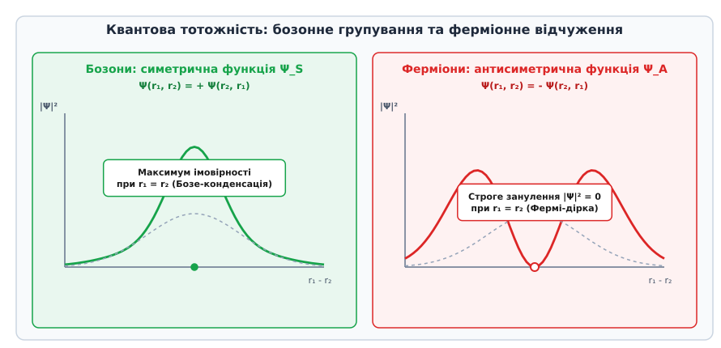
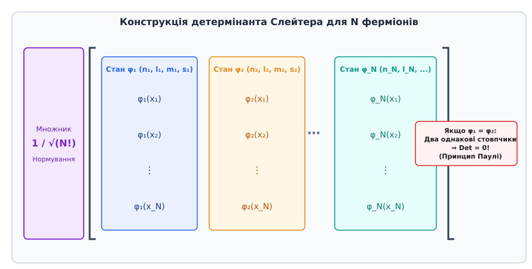
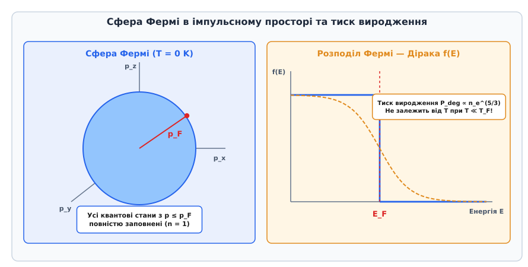

# Принцип заборони Паулі

<preknowlist>
- [Спін електрона](topic:physics/electron-spin) — внутрішній момент імпульсу s = 1/2 та спінові матриці Паулі.
- [Одновимірне стаціонарне рівняння Шредінгера](topic:physics/stationary-schrodinger-equation) — квантові стани, хвильова функція та власні значення енергії.
- [Проводові та ізоляційні властивості речовин](topic:physics/conductors-insulators) — зонна структура твердих тіл та рівень Фермі.
</preknowlist>

Якщо обчислити кулонівський потенціал приваблення між атомним ядром з зарядом `Z = 92` (ядро Урану) та 92 електронами, які його оточують, класична електродинаміка та квантове рівняння Шредінгера для одного електрона передбачають наявність зв'язаного основного стану з найнижчою енергією `E_1s = - Z² · 13.6 eV`. Якби всі 92 електрони атома Урану могли одночасно впасти на цей найнижчий 1s-рівень, радіус атома Урану стиснувся б у десятки разів проти радіуса атома Гідрогену, утворення хімічних зв'язків між атомами стало б неможливим, а вся звична речовина у Всесвіті колапсувала б у надщільний конгломерат. Сумарне електростатичне відштовхування між електронами принципово не здатне зупинити цей падіння: Кулонівський потенціал ядра завжди переважав би на малих відстанях.

Причиною того, чому цього не відбувається і чому тверді тіла володіють стабільним об'ємом, є не силові поля чи класичні бар'єри, а фундаментальне квантовомеханічне правило — принцип заборони Паулі. Згідно з цим принципом, два тотожні ферміони принципово не можуть перебувати в одному й тому самому квантовому стані.

## 1. Парадокс стійкості матерії та тотожність квантових частинок

У класичній механіці будь-які дві однакові кульки чи частинки є принципово розрізнюваними. Навіть якщо два електрони мають абсолютно однакову масу `m_e` та заряд `e`, у класичній фізиці їм можна безперервно простежити траєкторії руху у просторі: електрон 1 знаходиться у точці `r_1(t)`, а електрон 2 — у точці `r_2(t)`.

У квантовій механіці концепція класичної траєкторії повністю втрачає сенс через співвідношення невизначеностей Гейзенберга `Δx · Δp ≥ ℏ / 2`. Оскільки хвильові пакети двох одинакових частинок при зближенні перекриваються у просторі, експериментатор принципово втрачає можливість визначити, який саме з двох електронів був зареєстрований детектором. Квантові частинки одного виду є строго **тотожними та нерозрізнюваними** (від англійського *indistinguishable particles*).

Розглянемо систему з двох тотожних частинок, квантовий стан якої описується хвильовою функцією `Ψ(q_1, q_2)`, де `q_i = (r_i, s_i)` означає сукупність просторових координат `r_i` та проєкції спіну `s_i` `i`-ї частинки. Уведемо квантовомеханічний оператор перестановки частинок `P_{12}`, який міняє місцями аргументи хвильової функції:

```
P_{12} Ψ(q_1, q_2) = Ψ(q_2, q_1)
```

Оскільки частинки є тотожними, фізичний стан системи (густина ймовірності виявлення частинок `|Ψ|²`) не повинен змінюватися при їх перестановці:

```
|P_{12} Ψ(q_1, q_2)|² = |Ψ(q_1, q_2)|²
```

Це означає, що хвильова функція під дією оператора перестановки `P_{12}` може набувати лише двох можливих власних значень:

```
P_{12} Ψ(q_1, q_2) = + 1 · Ψ(q_1, q_2)  [симетрична хвильова функція]
P_{12} Ψ(q_1, q_2) = - 1 · Ψ(q_1, q_2)  [антисиметрична хвильова функція]
```

Згідно з постулатом симетризації та релятивістською теоремою Паулі про зв'язок спіну і статистики, тип симетрії хвильової функції суворо визначається внутрішнім моментом імпульсу частинки (спіном `s`):

1. **Бозони** (від прізвища індійського фізика Шатьєндраната Бозе, *Bose*) — частинки з цілим спіном (`s = 0, 1, 2, ...`, такі як фотони, α-частинки, атоми Гелію-4). Стан системи бозонів описується строго **симетричною** хвильовою функцією `Ψ_S(q_1, q_2) = + Ψ_S(q_2, q_1)`.
2. **Ферміони** (від прізвища італійського фізика Енріко Фермі, *Fermi*) — частинки з півцілим спіном (`s = 1/2, 3/2, 5/2, ...`, такі як електрони, протони, нейтрони, нейтрино, кварки). Стан системи ферміонів описується строго **антисиметричною** хвильовою функцією `Ψ_A(q_1, q_2) = - Ψ_A(q_2, q_1)`.


*Симетрична (бозони) та антисиметрична (ферміони) хвильові функції двох тотожних частинок і поява Фермі-дірки при r₁ = r₂.*

### 1.1. Факторизація просторової та спінової частин хвильової функції

Якщо оператор спін-орбітальної взаємодії є малим, повну хвильову функцію системи двох електронів можна розкласти у добуток просторової частини `ψ(r_1, r_2)` та спінового спінора `χ(s_1, s_2)`:

```
Ψ(1, 2) = ψ(r_1, r_2) · χ(s_1, s_2)
```

Вимога загальної антисиметрії `P_{12} Ψ(1, 2) = - Ψ(1, 2)` залишає лише два можливі варіанти комбінації:

1. **Симетричний просторовий стан × Антисиметричний спіновий стан (Синглет, S = 0)**:
```
ψ_S(r_1, r_2) = + ψ_S(r_2, r_1)
χ_singlet = (1 / √2) · [ α(1) β(2) - β(1) α(2) ]
```
2. **Антисиметричний просторовий стан × Симетричний спіновий стан (Триплет, S = 1)**:
```
ψ_A(r_1, r_2) = - ψ_A(r_2, r_1)
χ_triplet ∈ { α(1) α(2),  (1 / √2) [ α(1) β(2) + β(1) α(2) ],  β(1) β(2) }
```

тут `α` описує стан спіну «вгору» (`m_s = +1/2`), а `β` — стан спіну «вниз» (`m_s = -1/2`).

Розглянемо випадок, коли два однакові ферміони з однаковими спінами (триплетний стан) намагаються наблизитися один до одного у просторі, тобто `r_1 -> r_2 = r`. Підставляючи рівні просторові аргументи у вираз антисиметрії `ψ_A(r, r) = - ψ_A(r, r)`, отримуємо:

```
2 · ψ_A(r, r) = 0  ⇒  ψ_A(r, r) = 0
```

Якщо просторова хвильова функція `ψ_A(r, r)` дорівнює нулю, то густина ймовірності виявлення двох ферміонів з однаковими спінами у одній точці простору `|ψ_A(r, r)|² = 0` строго занулюється. 

Фізичний наслідок цього математичного занулення полягає у тому, що при наближенні двох ферміонів з однаковими спінами один до одного у просторі (`r_1 -> r_2`), ймовірність їх знаходження поруч прямує до нуля. Навколо кожного ферміона утворюється ефективна область «забороненого об'єму» — **Фермі-дірка** (або обмінна дірка). Радіус цієї дірки дорівнює дебройлівській довжині хвилі електрона, що створює ефективний квантовий тиск відштовхування.

Детальний аналіз історичного шляху відкриття цього принципу від дослідів з аномальним ефектом Зеемана до теореми про зв'язок спіну і статистики викладено у вставці [📜 Історія відкриття принципу заборони Паулі](topic:physics/pauli-exclusion/hist-pauli-exclusion.md).

## 2. Квантові числа електрона та детермінант Слейтера

Для повного опису квантового стану електрона у центрально-симетричному кулонівському полі ядра з потенціалом `V(r) = - Z e² / (4πε₀ r)` необхідно вказати набір із чотирьох квантових чисел, які виникають при розділенні змінних у стаціонарному рівнянні Шредінгера для радіальної `R_nl(r)` та кутових `Y_lm(θ, φ)` частин хвильової функції:

1. **Головне квантове число `n`** (`n = 1, 2, 3, ...`) — визначає квантовий енергетичний рівень електрона `E_n = - Z² R_y / n²` та радіальний розмір електронної хмари.
2. **Орбітальне квантове число `l`** (`l = 0, 1, 2, ..., n-1`) — визначає значення власного орбітального моменту імпульсу `|L| = √(l(l+1)) · ℏ` та геометричну симетрію сферичних гармонік `Y_lm(θ, φ)` (s, p, d, f орбіталі).
3. **Магнітне орбітальне квантове число `m_l`** (`m_l ∈ {-l, -l+1, ..., +l}`) — визначає проєкцію орбітального моменту на обрану вісь квантування `Z` (`L_z = m_l · ℏ`) та орієнтацію орбіталі у просторі (всього `2l + 1` станів).
4. **Магнітне спінове квантове число `m_s`** (`m_s = +1/2` або `m_s = -1/2`) — визначає проєкцію власного спінового моменту електрона на вісь `Z` (`S_z = m_s · ℏ`).

У канонічному формулюванні Вольфганга Паулі принцип заборони стверджує:

```
В одній квантовій системі не може бути двох електронів, 
у яких усі чотири квантові числа (n, l, m_l, m_s) є абсолютно однаковими.
```

Якщо два електрони перебувають на одній і тій самій просторовій орбіталі (мають однакові `n`, `l` та `m_l`), їхні спінові проєкції обов'язково повинні бути протилежними: один електрон має спін «вгору» (`m_s = +1/2`), а другий — спін «вниз» (`m_s = -1/2`). Третій електрон на цю ж просторову орбіталь потрапити вже не може, оскільки для нього не існує третього значення спінової проєкції `m_s`.

### 2.1. Математична конструкція детермінанта Слейтера

Для багатоелектронних систем з `N` електронами простий добуток одночастинкових орбіталей `Ψ_Hartree = φ_1(q_1) · φ_2(q_2) · ... · φ_N(q_N)` є неприйнятним, оскільки він порушує вимогу нерозрізнюваності частинок та антисиметрії.

У 1929 році американський фізик Джон Слейтер (John C. Slater) запропонував математичний метод побудови строго антисиметричної хвильової функції шляхом запису одночастинкових станів у формі детермінанта спеціальної матриці — **детермінанта Слейтера**:

```
Ψ(q_1, q_2, ..., q_N) 
= (1 / √(N!)) · Det | φ_1(q_1)  φ_2(q_1)  ...  φ_N(q_1) |
                    | φ_1(q_2)  φ_2(q_2)  ...  φ_N(q_2) |
                    |   ⋮          ⋮       ⋱      ⋮     |
                    | φ_1(q_N)  φ_2(q_N)  ...  φ_N(q_N) |
```

Множник `1 / √(N!)` забезпечує строге нормування хвильової функції до одиниці: `∫ |Ψ|² dq_1 ... dq_N = 1`.


*Матрична структура детермінанта Слейтера для системи N ферміонів та занулення хвильової функції при збігу двох одночастинкових станів.*

Математичні властивості детермінанта Слейтера ідеально відображають усі квантові властивості ферміонних систем:

1. **Рядки матриці** відповідають координатам частинок (`q_1, q_2, ..., q_N`). Перестановка двох частинок місцями еквівалентна переставленню двох рядків детермінанта. Оскільки перестановка двох рядків матриці змінює знак детермінанта на протилежний, хвильова функція автоматично стає антисиметричною: `Ψ(..., q_j, ..., q_i, ...) = - Ψ(..., q_i, ..., q_j, ...)`.
2. **Стовпчики матриці** відповідають одночастинковим квантовим станам (`φ_1, φ_2, ..., φ_N`). Якщо два електрони намагаються зайняти один і той самий квантовий стан (`φ_a = φ_b`), у матриці з'являються два строго **однакові стовпчики**. За теоремою лінійної алгебри детермінант матриці з двома однаковими стовпчиками тотожно дорівнює нулю (`Det ≡ 0`).

Детальні математичні виведення оператора антисиметризації, правил Слейтера — Кондона та обчислення матричних елементів описано у вставці [🧮 Математичний апарат детермінанта Слейтера та обмінної взаємодії](topic:physics/pauli-exclusion/math-slater-determinant.md).

## 3. Обмінна взаємодія та квантова кореляція станів

З принципу заборони Паулі та вимоги антисиметрії хвильової функції природно виникає квантовий ефект, який не має жодного аналога у класичній фізиці — **обмінна взаємодія** (*exchange interaction*).

Розглянемо систему з двох електронів. Середнє значення оператора кулонівського відштовхування `v(r_1, r_2) = e² / (4πε₀ |r_1 - r_2|)` на антисиметричному стані Слейтера складається з двох частин:

```
E_Coulomb = J_{12} ± K_{12}
```

де `J_{12}` — прямий кулонівський інтеграл електростатичного відштовхування електронних хмар, а `K_{12}` — **обмінний інтеграл**:

```
K_{12} = ∫ ∫ φ_1*(r_1) φ_2*(r_2) · ( e² / (4πε₀ |r_1 - r_2|) ) · φ_2*(r_1) φ_1*(r_2) d³r_1 d³r_2
```

Оскільки обмінний інтеграл містить добуток спінових функцій `⟨χ_1|χ_2⟩`, він відрізняється від нуля **лише тоді, коли спіни двох електронів є паралельними** (`m_s1 = m_s2`).

### 3.1. Фізична природа обмінного розщеплення та правила Гунда

Для двох електронів можливі два варіанти спінової впорядкованості:

1. **Паралельні спіни (триплетний стан, S = 1)**: спінова частина хвильової функції є симетричною, тому просторова частина змушена бути строго **антисиметричною**. Внаслідок цього електрони занулюють хвильову функцію при `r_1 -> r_2` (утворюється Фермі-дірка), ефективно уникають зустрічі у просторі, їх кулонівське відштовхування зменшується, а енергія системи знижується: `E_triplet = E_0 + J_{12} - K_{12}`.
2. **Антипаралельні спіни (синглетний стан, S = 0)**: спінова частина хвильової функції є антисиметричною, тому просторова частина є **симетричною**. Електрони можуть знаходитися близько один від одного, їх кулонівське відштовхування збільшується, а енергія системи зростає: `E_singlet = E_0 + J_{12} + K_{12}`.

Різниця енергій між триплетним та синглетним станами дорівнює подвоєному обмінному інтегралу:

```
ΔE = E_singlet - E_triplet = 2 · K_{12} > 0
```

Саме ця різниця енергій є основою **tрьох правил Гунда** в атомній спектроскопії:

1. **Перше правило Гунда**: при заповненні атомних підрівнів електрони спочатку займають вільні орбіталі з паралельними спінами, оскільки це мінімізує кулонівське відштовхування між ними і максимізує сумарний спін `S`.
2. **Друге правило Гунда**: при заданому максимальному спіні `S` електрони розташовуються так, щоб максимізувати сумарний орбітальний момент імпульсу `L`.
3. **Третє правило Гунда**: для підоболонок, заповнених менше ніж наполовину, повний момент імпульсу `J = |L - S|`; для заповнених більше ніж наполовину — `J = L + S`.

### 3.2. Магнетизм у твердих тілах: Модель Гейзенберга та Суперобмін

Обмінна взаємодія пояснює природу **феромагнетизму** у твердих тілах (залізо, кобальт, нікель). Ефективний гамільтоніан Гейзенберга описує взаємодію сусідніх спінів `S_i` та `S_j` виразом:

```
H_ex = - 2 · ∑_{i < j} J_{ij} · (S_i · S_j)
```

1. **Феромагнетизм (`J_{ij} > 0`)**: якщо пряме перекриття орбіталей створює додатний обмінний інтеграл, системі енергетично вигодно орієнтувати всі сусідні спіни паралельно у одному напрямку. Це приводить до спонтанного намагнічування речовини і утворення доменів без зовнішнього поля.
2. **Антиферомагнетизм (`J_{ij} < 0`)**: якщо обмінний інтеграл є від'ємним, системі вигідно чергувати напрямки спінів у ґратці протилежно (наприклад, у кристалах `MnO`, `FeO`).
3. **Суперобмінна взаємодія (Краммерса — Андерсона)**: у діелектричних оксидах металів обмін між катіонами переходних металів відбувається опосередковано через заповнену p-орбіталь проміжного аніона Оксигену `O²⁻`.

Важливо підкреслити: обмінна взаємодія **не є новою фундаментальною силою** природи (вона не переноситься новими калібрувальними бозонами). Це ефективний енергетичний зсув, який виникає внаслідок поєднання ззвичайного електростатичного кулонівського відштовхування та квантовостатистичного принципу Паулі.

## 4. Заповнення атомних оболон та періодичний закон Менделєєва

Принцип заборони Паулі є фундаментальною основою всієї сучасної хімії та будови атомів. Завдяки забороні однакових станів електрони у атомі не збиваються у купу на найнижчому 1s-рівні, а послідовно заповнюють електронні оболонки у порядку зростання їхньої енергії.

Максимальна кількість електронів `N_subshell`, яка може перебувати у підоболонці з заданим орбітальним квантовим числом `l`, дорівнює подвоєній кількості проєкцій орбітального моменту:

```
N_subshell = 2 · (2l + 1)
```

Звідси отримуємо строго обмежену місткість атомних орбіталей:
- **s-підоболонка** (`l = 0`): `2 · (2·0 + 1) = 2` електрони.
- **p-підоболонка** (`l = 1`): `2 · (2·1 + 1) = 6` електронів.
- **d-підоболонка** (`l = 2`): `2 · (2·2 + 1) = 10` електронів.
- **f-підоболонка** (`l = 3`): `2 · (2·3 + 1) = 14` електронів.

Суммарна місткість оболонки з головним квантовим числом `n` визначається формулою Стонера:

```
N_shell(n) = ∑_{l=0}^{n-1} 2 · (2l + 1) = 2 · n²
```

Для `n = 1` (K-оболонка) max 2 e⁻; для `n = 2` (L-оболонка) max 8 e⁻; для `n = 3` (M-оболонка) max 18 e⁻; для `n = 4` (N-оболонка) max 32 e⁻.


*Схема послідовного заповнення атомних рівнями енергії 1s, 2s, 2p, 3s електронними парами з протилежними спінами.*

Порядок заповнення оболон визначається принципом найменшої енергії (принцип Ауфбау) та емпіричним правилом Маделунга — Клечковського: підрівні заповнюються у порядку зростання суми квантових чисел `n + l`, а при рівних сумах — у порядку зростання `n`.

### 4.1. Аномалії заповнення та хімічний зв'язок

У деяких елементів переходних металів та лантаноїдів спостерігаються аномалії заповнення оболон, зумовлені виграшем у обмінній енергії максимізації спіну. Наприклад:
- **Хром (`Cr`, Z=24)**: конфігурація `[Ar] 3d⁵ 4s¹` замість `3d⁴ 4s²` (напівзаповнений 3d-підрівень є енергетично вигіднішим).
- **Мідь (`Cu`, Z=29)**: конфігурація `[Ar] 3d¹⁰ 4s¹` замість `3d⁹ 4s²` (повністю заповнений 3d-підрівень надає підвищену стабільність).

Саме заповнення зовнішньої валентної оболонки визначає хімічну валентність елемента, його енергію іонізації, спорідненість до електрона, електронегативність та періодичне повторення хімічних властивостей в таблиці Менделєєва. Ковалентний хімічний зв'язок утворено парою електронів із протилежними спінами, що утворюють спільну зв'язуючу орбіталь між ядрами. Гібридизація атомних орбіталей (`sp`, `sp²`, `sp³`) пояснює просторову геометрію органічних молекул та кристалічних структур (алмаз, графіт, ґрафен). 

Натомість відштовхування повністю заповнених внутрішніх електронних оболон створює короткосяжний потенціал відштовхування (член `1/r¹²` у потенціалі Леннард-Джонса), що зумовлює нестисливість рідин та твердих тіл під дією зовнішнього тиску.

> 🔧 **Навіщо це.**
> Зонна теорія твердих тіл, яка пояснює існування провідників, напівпровідників та діелектриків, повністю спирається на принцип Паулі. Коли `N` атомів об'єднуються у кристалічну ґратку, дискретні атомні рівні розщеплюються у безперервні енергетичні зони. Завдяки принципу Паулі електрони заповнюють дозволені зони від найнижчих енергій до рівня Фермі `E_F`. У металах валентна зона заповнена лише частково, тому електрони можуть вільно приймати нескінченно малі прирости енергії від електричного поля та переносити струм. У діелектриках та напівпровідниках валентна зона заповнена повністю, а наступна зона провідності відокремлена забороненою зоною `E_g`. Без принципу Паулі не існувала б сучасна напівпровідникова мікроелектроніка — транзистори, діоди та процесори.

## 5. Вироджений фермі-газ та макроскопічний квантовий тиск

Застосування принципу заборони Паулі до ансамблю великої кількості вільних електронів у металі або у надрах зірок приводить до концепції **ідеального фермі-газу**.

Оскільки електрони є ферміонами, в об'ємі фазового простору `d³r · d³p` не може перебувати більше ніж `2 · d³r · d³p / (2πℏ)³` електронів. При абсолютному нулю температур (`T = 0 K`) `N` електронів в об'ємі `V` займають найнижчі можливі імпульсні стани, утворюючи у тривимірному імпульсному просторі кулю радіуса `p_F` — **сферу Фермі**.


*Сфера Фермі в імпульсному просторі та функція розподілу Фермі — Дірака при ступені квантового виродження.*

### 5.1. Виведення густини станів та граничних величин Фермі

Обчислимо кількість квантових станів у фазовому об'ємі. Об'єм елементарного квантового стану у 3D імпульсному просторі дорівнює `(2π ℏ / L)³`. Кількість просторових станів у сфері радіуса `p_F` з урахуванням спінового множника 2 становить:

```
N = 2 · ( (4/3) · π · p_F³ ) / ( (2π ℏ / L)³ ) = (V / (3 · π² · ℏ³)) · p_F³
```

Звідси виражаємо **граничний імпульс Фермі** `p_F`:

```
p_F = ℏ · (3 · π² · n_e)^(1/3)
```

де `n_e = N / V` — просторова концентрація електронів.

Відповідна **гранична енергія Фермі** `E_F` для нерелятивістського електронного газу становить:

```
E_F = p_F² / (2 m_e) = (ℏ² / (2 m_e)) · (3 · π² · n_e)^(2/3)
```

Прополіційне інтегрування дає вираз для **густини станів** `g(E)` (кількості енергетичних станів на одиничний інтервал енергії):

```
g(E) = dN / dE = (V / (2 π²)) · ( (2 m_e) / ℏ² )^(3/2) · √E
```

Інтегруючи енергію за всією сферою Фермі при `T = 0 K`, отримуємо повну кінетичну енергію електронного газу:

```
E_total = ∫_0^{E_F} E · g(E) dE = (3/5) · N · E_F
```

### 5.2. Квантовий тиск виродження та теплоємність Зоммерфельда

Примусове утримання електронів у обмеженому просторі об'єму `V` змушує їх займати високі імпульсні стани, що викликає появу суто квантового тиску — **тиску виродження** (*degeneracy pressure*):

```
P_deg = - ∂E_total / ∂V = (2/5) · n_e · E_F = ( (3^(2/3) · π^(4/3) · ℏ²) / (5 · m_e) ) · n_e^(5/3)
```

Головні особливості тиску квантового виродження:

1. **Незалежність від температури**: при `T << T_F` тиск `P_deg` визначається виключно концентрацією частинок `n_e` і не прямує до нуля при наближенні до абсолютного нуля температур `T -> 0 K`.
2. **Обернена пропорційність масі частинки**: оскільки `P_deg ∝ 1 / m`, тиск легких електронів перевищує тиск важких протонів чи ядер у тисячі разів при однаковій концентрації.
3. **Електронна теплоємність Зоммерфельда**: при `T > 0 K` лише невелика частка електронів біля поверхні Фермі `T / T_F` бере участь у тепловому русі, що дає лінійну залежність теплоємності від температури `C_v,e = (π² / 2) · N · k_B · (T / T_F)`.

### 5.3. Астрофізичні застосування: Білі карлики та Нейтронні зорі

Тиск квантового виродження відіграє вирішальну роль в астрофізиці, зупиняючи гравітаційний колапс зірок на фінальних етапах їхньої еволюції:

1. **Білі карлики**: Коли звичайна зоря з масою порядку сонячної (`M ≤ 8 M_sun`) вичерпує термоядерне паливо (Гідроген та Гелій), її ядро стискається під дією власної гравітації до розмірів Землі (густина `ρ ~ 10⁶ - 10⁹ g/cm³`). Гравітаційне стискання зупиняється **тиском виродженого електронного газу**. У 1930 році індійсько-американський астрофізик Субраманьян Чандрасекар довів, що при врахуванні релятивістських ефектів існує верхня межа маси білого карлика — **межа Чандрасекара** (`M_Ch ≈ 1.44 M_sun`). Якщо маса згаслого ядра перевищує цю межу, електронний тиск не здатний стримати гравітацію, і зоря продовжує колапс.
2. **Нейтронні зорі**: При перевищенні межі Чандрасекара електрони вдавлюються в протони під дією колосального тиску, відбуваючись реакція зворотного β-розпаду (нейтронізація): `e⁻ + p -> n + ν_e`. Зоря перетворюється на надщільний шар нейтронів радіусом близько 10–12 км (густина `ρ ~ 10¹⁴ - 10¹⁵ g/cm³`). Подальший гравітаційний колапс зупиняється **тиском виродженого нейтронного газу**. Межа маси нейтронної зорі (межа Оппенгеймера — Волкова) становить приблизно `2 - 3 M_sun`. Якщо маса перевищує і цю межу, об'єкт безповоротно колапсує у чорну діру.

Практичну чисельну програму мовами C та C++ для розрахунку параметрів Фермі-газу, енергії `E_F` та тиску виродження наведено у вставці [⚙️ Моделювання виродженого фермі-газу та квантового тиску](topic:physics/pauli-exclusion/proj-fermi-gas-sim.md).

## 6. Межі застосування та експериментальні перевірки порушення принципу Паулі

Фундаментальність принципу заборони Паулі спонукає сучасних фізиків шукати можливі експериментальні межі його застосовності або мінімальні відхилення від нього. У сучасній квантовій теорії поля припускається можливість існування гіпотетичних частинок з незвичними статистиками — **аніонів** (у двовимірних системах із дробовою статистикою в теорії дробового квантового ефекту Холла) або незначних відхилень від статистики Фермі — Дірака на надмалих відстанях (порядку планківської довжини `l_P ≈ 1.6 × 10⁻³⁵ m`).

Для перевірки принципу заборони Паулі у Національній лабораторії Ґран-Сассо (Італія) під товщею гірського масиву діє фундаментальний експеримент **VIP** (*Violation of the Pauli Exclusion Principle*). Мета експерименту полягає у пошуку аномальних атомних переходів у мідній пластині, через яку пропускається високий електричний струм.

Експериментатори шукають аномальні X-променеві фотони з енергією `7.7 keV`, які відповідали б переходу зовнішнього «нового» електрона на вже повністю заповнену 1s-оболонку атома Міді (утворення не-паулівського атома з трьома електронами на 1s-рівні):

```
e⁻ (зовнішній) + Cu(1s² 2s² ...)  →  Cu_anomalous(1s³ 2s² ...) + γ (7.7 keV)
```

За результатами багаторічних вимірювань VIP-2 станом на 2020-ті роки жодного випадку порушення принципу заборони не було виявлено. Верхня експериментальна межа для параметра ймовірності порушення принципу Паулі `β²` становить:

```
β² / 2 < 1.0 × 10⁻²⁹
```

Це означає, що принцип заборони Паулі виконується з височенною точністю, підтверджуючи непорушність геометрії квантового простору станів та симетрії Всесвіту.
