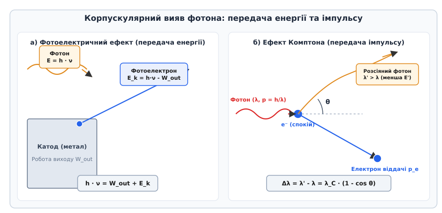
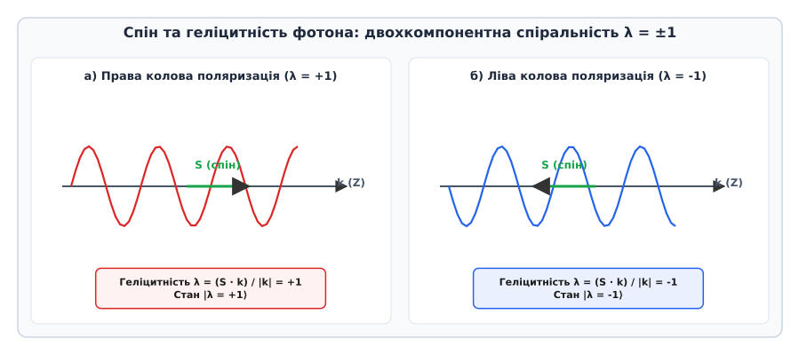
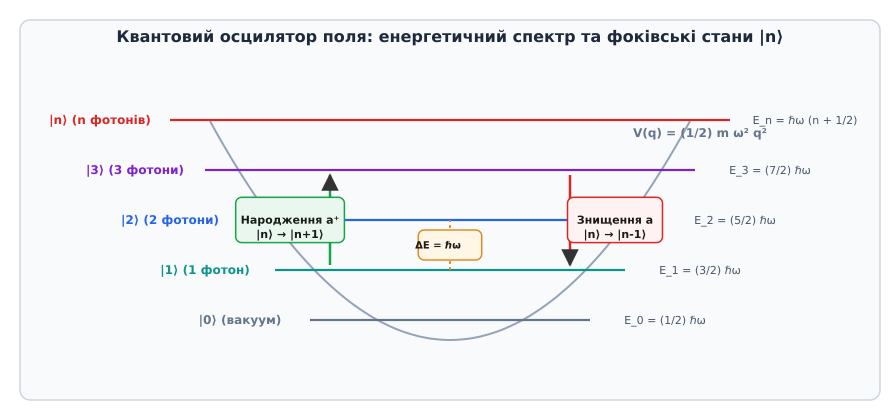
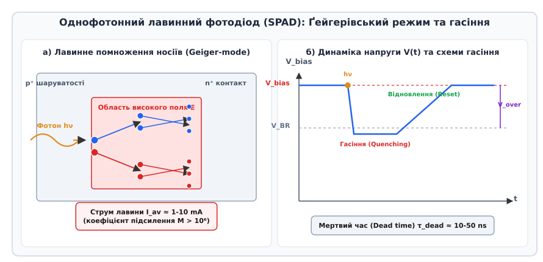

# Фотон

<preknowlist>
- [Корпускулярно-хвильовий дуалізм](book:physics/quantum-mechanics/wave-particle-duality) — подвійна природа квантових об'єктів.
- [Одновимірне стаціонарне рівняння Шредінгера](book:physics/quantum-mechanics/stationary-schrodinger-equation) — квантові стани, хвильова функція та власні значення енергії.
- [Квантовий гармонічний осцилятор](book:physics/quantum-mechanics/quantum-harmonic-oscillator) — квантування коливальних мод та нульові коливання.
- [Спеціальна теорія відносності](book:physics/relativity/special-relativity) — 4-вектори, релятивістська кінематика та відсутність маси спокою.
</preknowlist>

Спроба описати теплове випромінювання нагрітих тіл та взаємодію короткохвильового випромінювання з речовиною за допомогою класичної електродинаміки Максвелла приводить до фундаментальної суперечності. Класична хвильова теорія вважає енергію електромагнітного поля неперервно розподіленою у просторі величиною, густина якої пропорційна квадрату напруженості електричного поля `w = (1/2) · (ε_0 · |E|² + μ_0 · |H|²)`, а перенос енергії описується неперервним вектором Пойнтінга `S = E × H`. Однак при зменшенні інтенсивності світла до наднизьких рівнів обмін енергією між полем та речовиною не стає як завгодно малим: він відбувається дискретними, неподільними порціями.

Елементарний квант електромагнітного поля називається **фотоном**. Фотон є фундаментальною точковою частинкою, що належить до класу бозонів, не має маси спокою, володіє цілочисловим спіном `s = 1` та переносить електромагнітну взаємодію зі швидкістю `c = 299 792 458 m/s` у вакуумі.

Еволюція теоретичних уявлень про світло — від гіпотези квантів Планка та світлових частинок Айнштайна до експериментів Комптона та розробки математичного апарату квантової електродинаміки — викладена у вставці [📜 Історія концепції фотона: від кванта випромінювання до квантової електродинаміки](book:physics/quantum-mechanics/photon/hist-blackbody-photoelectric.md).

## 1. Релятивістська кінематика та квантові характеристики фотона

Фотон поєднує в собі корпускулярні та хвильові властивості, зв'язок між якими задається фундаментальними фізичними константами — сталою Планка `h` та швидкістю світла у вакуумі `c`.

### Енергія, імпульс та маса спокою

Для кванту світла з циклічною частотою `ν` (або кутовою частотою `ω = 2π · ν`) та довжиною хвилі `λ` (або хвильовим вектором `k`, модуль якого `|k| = 2π / λ`) корпускулярні параметри зв'язані з хвильовими співвідношеннями Планка — де Бройля:

```
E = h · ν = ℏ · ω
```

```
p = (h / λ) · n_k = ℏ · k
```

де `n_k = k / |k|` — одиничний вектор напрямку поширення хвилі.

Загальне релятивістське співвідношення між енергією `E`, трьохвимірним імпульсом `p` та масою спокою `m_0` частинки у спеціальній теорії відносності описується інваріантним квадратом чотириімпульсу `p^μ = (E/c, p)`:

```
E² = (p · c)² + (m_0 · c²)²
```

Для фотона маса спокою строго дорівнює нулю (`m_0 = 0`). Підставляючи значення `m_0 = 0`, отримуємо зв'язок між енергією та імпульсом безмасової частинки:

```
E² = (p · c)²  ⇒  E = p · c
```

Перевіримо цей зв'язок через хвильові параметри:

```
p · c = ( ℏ · |k| ) · c = ℏ · ( c · |k| ) = ℏ · ω = E    [оскільки ω = c · |k|]
```

Отже, модуль імпульсу фотона пов'язаний з його енергією та довжиною хвилі співвідношеннями:

```
p = E / c = (ℏ · ω) / c = h / λ
```

Відсутність маси спокою означає, що у чотиривимірному просторі-часі Мінковського світова лінія фотона є нульовою геодезичною (`ds² = c² dt² - dx² - dy² - dz² = 0`). Фотон не може перебувати в стані спокою в жодній інерціальній системі відліку: у будь-якому вакуумному середовищі фотон рухається зі швидкістю `c`.

Сучасні експериментальні обмеження на масу спокою фотона (отримані з вимірювань магнітного поля Юпітера за допомогою космічних апаратів Pioneer-10 та аналізу галактичних магнітних плазмових хвиль) встановлюють верхню межу `m_0 < 10⁻⁵⁴ kg` (`< 10⁻¹⁸ eV/c²`), що є абсолютно сумісним зі строгим математичним нулем.

У гравітаційному полі фотон підкоряється загальній теорії відносності. При русі фотона вгору проти вектора гравітаційного прискорення його енергія та частота зменшуються — відбувається **гравітаційний червоний зсув**:

```
ν_obs = ν_emit · √( 1 - (2 · G · M) / (r · c²) )
```

А при відносному русі спостерігача та джерела зі швидкістю `v` частота фотона змінюється згідно з релятивістським ефектом Доплера:

```
ν' = ν · √( (1 - v/c) / (1 + v/c) )
```


*Корпускулярні вияви фотона: у зовнішньому фотоефекті фотон віддає всю свою енергію електрону металу, а при комптонівському розсіюванні пружно зіштовхується з вільним електроном, передаючи йому частину імпульсу та змінюючи довжину хвилі.*

### Експериментальні підтвердження корпускулярних властивостей

Корпускулярна природа фотона безпосередньо виявляється у двох фундаментальних експериментальних явищах:

1. **Зовнішній фотоелектричний ефект.** При поглинанні фотона електроном речовини фотон зникає повністю, віддаючи свою енергію `h · ν` єдиному електрону. Закон збереження енергії Айнштайна визначає максимальну кінетичну енергію вибитого фотоелектрона `E_k`:
   ```
   h · ν = W_out + E_k,max = W_out + e · V_stop
   ```
   де `W_out` — робота виходу електрона з даного металу, a `V_stop` — затримуючий потенціал. Якщо частота світла нижча за червону межу фотоефекту (`ν < ν_min = W_out / h`), фотоефект є неможливим незалежно від інтенсивності падаючого світлового потоку.

2. **Ефект Комптона.** При розсіюванні високоенергетичних рентгенівських або гамма-фотонів на квазівільних електронах графітової мішені відбувається пружне зіткнення двох релятивістських частинок. Виходячи з законів збереження чотириімпульсу `p_photon + p_electron = p'_photon + p'_electron`, зсув довжини хвилі розсіяного фотона `Δλ` становить:
   ```
   Δλ = λ' - λ = (h / (m_e · c)) · (1 - cos θ) = λ_C · (1 - cos θ)
   ```
   де `θ` — кут розсіювання фотона, а `λ_C = h / (m_e · c) ≈ 2.4263 × 10⁻¹² m` — комптонівська довжина хвилі електрона. У граничному випадку низьких енергій (`h ν << m_e c²`) ефект Комптона переходить у класичне томсонівське розсіювання без зміни довжини хвилі.

## 2. Спін, калібрувальна інваріантність та геліцитність фотона

Як векторне калібрувальне поле `A_μ(x)`, фотон є квантом зі спіновим квантовим числом `s = 1`.

### Відсутність поздовжньої поляризації для безмасового вектора

Для масивної частинки зі спіном `s = 1` (наприклад, векторного `W`- або `Z`-бозона) кількість можливих проєкцій спіну `m_s` на обрану вісь квантування дорівнює `2s + 1 = 3` (значення `m_s ∈ {-1, 0, +1}`). Проте для безмасового фотона існує лише **два** фізично незалежних поляризаційних стани: `m_s = +1` та `m_s = -1`.

Причина відсутності стану з нульовою проєкцією (`m_s = 0`, поздовжня поляризація) лежить у внутрішній алгебраїчній структурі групи Пуанкаре `ISO(3,1)` та калібрувальній інваріантності електродинаміки. Маленька група (Little Group) Вігнера для безмасових частинок ізоморфна двовимірній евклідовій групі `SE(2)`. Щоб уникнути неперервного внутрішнього ступеня вільності (нефізичних станів), нетривіальні представлення групи мусять бути одновимірними, що допускає лише дискретні значення спіральності.

З точки зору електродинаміки, рівняння Максвелла у вакуумі є інваріантними відносно калібрувальних перетворень векторного потенціалу:

```
A_μ(x) → A'_μ(x) = A_μ(x) + ∂_μ Λ(x)
```

У формалізмі Гупти — Блейлера для коваріантного квантування в калібруванні Лоренца `∂_μ A^μ = 0` скалярні та поздовжні фотони утворюють нефізичні стани з від'ємною або нульовою нормою у гільбертовому просторі. Умова фізичних станів `⟨ψ| ∂_μ A^μ_+ |ψ⟩ = 0` призводить до того, що внески скалярних і поздовжніх фотонів строго скорочують один одного у всіх спостережуваних величинах, залишаючи лише поперечні ступені вільності.

Умова калібрування Кулона `∇ · A = 0` безпосередньо усуває неколебательну поздовжню компоненту векторного потенціалу, узгоджену з напрямком хвильового вектора `k`. Вектор поляризації фотона `ε` завжди лежить у площині, перпендикулярній до напрямку його руху:

```
k · ε = 0
```

### Геліцитність (спіральність)

Оскільки для фотона неможливо обрати систему відліку, де він перебував би у спокою, проєкція спіну на вісь квантування є фізично змістовною лише тоді, коли вісь квантування збігається з напрямком руху частинки `k`.

Оператор **геліцитності** (спіральності) `λ` визначається як проєкція вектора спіну `S` на напрямок імпульсу `p`:

```
λ = (S · p) / |p| = (S · k) / |k|
```

Власні значення оператора геліцитності для фотона приймають строго два значення:

```
λ = ±1
```

- **Права колова поляризація (`λ = +1`):** вектор спіну паралельний напрямку імпульсу `k`. Стан позначується як `|λ = +1⟩` або `|R⟩`.
- **Ліва колова поляризація (`λ = -1`):** вектор спіну антипаралельний напрямку імпульсу `k`. Стан позначується як `|λ = -1⟩` або `|L⟩`.


*Просторова орієнтація вектора спіну відносно хвильового вектора k: при правій коловій поляризації (λ = +1) спін спрямований за напрямком руху, при лівій (λ = -1) — проти напрямку руху.*

Стани лінійної поляризації (`|H⟩` — горизонтальна, `|V⟩` — вертикальна) утворюються як ортогональні квантові суперпозиції станів геліцитності:

```
|H⟩ = (1 / √2) · ( |λ = +1⟩ + |λ = -1⟩ )
```

```
|V⟩ = ( -i / √2 ) · ( |λ = +1⟩ - |λ = -1⟩ )
```

Довільний стан поляризації поодинокого фотона описується точкою на поверхні сфери Пуанкаре (або сфери Блоха для двохрівневої квантової системи), де полюси відповідають коловим поляризаціям `|R⟩` та `|L⟩`, а екватор — лінійним поляризаціям під різними кутами.

## 3. Вторинне квантування та фоківський простір станів

Для послідовного квантовомеханічного опису багатьох фотонів та процесів випромінювання й поглинання використовується формалізм вторинного квантування.

### Оператори народження та знищення

Класичне електромагнітне поле у кавітаторі об'єму `V` розкладається на нормальні моди. Для кожної моди `(k, λ)` вводяться оператори знищення `a_{k,λ}` та народження `a⁺_{k,λ}`, які підкоряються бозонним комутаційним співвідношенням:

```
[a_{k,λ}, a⁺_{k',λ'}] = a_{k,λ} · a⁺_{k',λ'} - a⁺_{k',λ'} · a_{k,λ} = δ_{k,k'} · δ_{λ,λ'}
```

```
[a_{k,λ}, a_{k',λ'}] = [a⁺_{k,λ}, a⁺_{k',λ'}] = 0
```

Оператор напруженості квантованого електричного поля `E(r, t)` виражається через оператори `a_{k,λ}` та `a⁺_{k,λ}`:

```
E(r, t) = i · ∑_{k,λ} √( (ℏ · ω_k) / (2 · ε_0 · V) ) · ε_{k,λ} · [ a_{k,λ} · exp(i · k · r - i · ω_k · t) - a⁺_{k,λ} · exp(-i · k · r + i · ω_k · t) ]
```

Детальний математичний виведення операторного Гамільтоніана поля та властивостей фоківського простору наведено у вставці [🧮 Квантування електромагнітного поля та фоківські стани](book:physics/quantum-mechanics/photon/math-quantization-creation-annihilation.md).

### Фоківські стани та вакуумні флуктуації

Гамільтоніан квантованого електромагнітного поля зводиться до суми незалежних осциляторів:

```
H = ∑_{k,λ} ℏ · ω_k · ( a⁺_{k,λ} · a_{k,λ} + 1/2 ) = ∑_{k,λ} ℏ · ω_k · ( N_{k,λ} + 1/2 )
```

де `N_{k,λ} = a⁺_{k,λ} · a_{k,λ}` — оператор числа фотонів у моді `(k, λ)`.

**Фоківський стан** `|n_{k,λ}⟩` є власним станом оператора числа фотонів:

```
N_{k,λ} |n_{k,λ}⟩ = n_{k,λ} |n_{k,λ}⟩
```

Дія операторів народження та знищення на фоківський стан змінює кількість фотонів на один квант:

```
a⁺ |n⟩ = √(n + 1) |n + 1⟩
```

```
a |n⟩ = √n |n - 1⟩
```


*Енергетичний спектр квантового осцилятора моди електромагнітного поля: дискретні рівні енергії E_n = ℏω(n + 1/2) та дія операторів народження a⁺ і знищення a.*

У вакуумному стані `|0⟩` кількість фотонів у всіх модах дорівнює нулю (`n = 0`), однак енергія кожної моди не дорівнює нулю:

```
E_0 = (1 / 2) · ℏ · ω_k
```

Ця ненульова енергія відповідає **вакуумним флуктуаціям** електромагнітного поля. Сума нульових енергій по всіх модах прямує до нескінченності, проте фізично спостережуваними є лише зміни вакуумної енергії при зміні межевих умов.

Макроскопічними виявами вакуумних флуктуацій фотонного поля є:
1. **Ефект Казимира:** притягання двох незаряджених паралельних ідеально провідних пластин у вакуумі із силою на одиницю площі `F / S = (π² · ℏ · c) / (240 · d⁴)`, де `d` — відстань між пластинами.
2. **Лембів зсув:** зсув енергетичних рівнів `2S_{1/2}` та `2P_{1/2}` в атомі водню на величину ~1057 MHz, викликаний взаємодією зв'язаного електрона з флуктуюючим вакуумним фотонним полем.
3. **Спонтанне випромінювання:** перехід атома з збудженого стану у основний за відсутності зовнішніх фотонів індукується саме вакуумними флуктуаціями поля.

### Когерентні та стиснуті стани світла

У той час як фоківські стани `|n⟩` мають строго визначену кількість фотонів (`ΔN = 0`), фаза хвилі для них є абсолютно невизначеною (`Δϕ → ∞`). Вони описують суто квантові стани світла.

Натомість випромінювання класичного одномодового лазера описується **когерентним станом Глаубера** `|α⟩`. Когерентний стан є власним станом оператора знищення:

```
a |α⟩ = α |α⟩
```

і є суперпозицією фоківських станів, де ймовірність знайти `n` фотонів підкоряється пуассонівському розподілу:

```
P(n) = exp(-|α|²) · ( (|α|²)ⁿ / n! )
```

Для когерентного стану середня кількість фотонів `⟨N⟩ = |α|²`, а відносна флуктуація кількості частинок спадає зі зростанням інтенсивності як `ΔN / ⟨N⟩ = 1 / √⟨N⟩`, що у граничному випадку великих `|α|` відновлює класичну макроскопічну електромагнітну хвилю.

**Стиснуті стани світла (Squeezed States):**
Ввівши квадратурні оператори поля `X_1 = (a + a⁺)/2` та `X_2 = (a - a⁺)/(2i)` з комутатором `[X_1, X_2] = i/2`, для когерентного стану маємо симетричні невизначеності `ΔX_1 = ΔX_2 = 1/2`. У стиснутому стані флуктуації однієї з квадратур зменшуються нижче вакуумного рівня (`ΔX_1 < 1/2`) за рахунок зростання флуктуацій ортогональної квадратури (`ΔX_2 > 1/2`), так що співвідношення `ΔX_1 · ΔX_2 ≥ 1/4` залишається виконуваним. Стиснуте світло використовується у лазерних інтерферометрах гравітаційних хвиль LIGO та VIRGO для пригнічення квантового шуму випромінювання.

## 4. Взаємодія фотона з речовиною та правила відбору

Взаємодія квантованого електромагнітного поля з атомами та молекулами описується Гамільтоніаном взаємодії у дипольному наближенні (позначуваному як `H_int = - d · E(r_0, t)`), де `d = e · r` — оператор електричного дипольного моменту атома.

### Ейнштейнівські коефіцієнти випромінювання та поглинання

Для двохрівневої квантової системи з енергіями `E_1` та `E_2` (`E_2 - E_1 = ℏ · ω_0`) Альберт Айнштайн у 1917 році ввів три феноменологічні коефіцієнти:
- `A_{21}` — ймовірність спонтанного випромінювання фотона за одиницю часу.
- `B_{12}` — ймовірність вимушеного поглинання фотона під дією зовнішнього поля.
- `B_{21}` — ймовірність вимушеного випромінювання фотона під дією зовнішнього поля.

У стані термодинамічної рівноваги з випромінюванням баланс переходів дає співвідношення між коефіцієнтами:

```
B_{12} = B_{21}
```

```
A_{21} = ( (8 · π · h · ν³) / c³ ) · B_{21} = ( (ℏ · ω_0³) / (3 · π · ε_0 · c³) ) · |d_{12}|²
```

де `d_{12} = ⟨1| d |2⟩` — матричний елемент дипольного переходу. Вимушене випромінювання створює вторичний фотон, який є тотожною копією падаючого фотона: він має таку ж частоту, напрямок хвильового вектора `k`, поляризацію та фазу. Це є фізичним принципом роботи підсилювачів світла та лазерів.

### Квантові правила відбору

Перехід атома з випромінюванням або поглинанням поодинокого фотона підкоряється законам збереження моменту імпульсу та парності. Оскільки фотон володіє спіном `s = 1` та від'ємною внутрішньою парністю (`P_photon = -1`), для електричних дипольних переходів (E1) діють суворі **правила відбору**:

1. **Зміна орбітального квантового числа:** `Δl = l_final - l_initial = ±1`. Перехід між станами з однаковим орбітальним моментом (наприклад, `s → s` або `p → p`) у дипольному наближенні є забороненим.
2. **Зміна магнітного квантового числа:** `Δm_l = m_final - m_initial = 0, ±1`. Перехід з `Δm_l = 0` випромінює або поглинає лінійно поляризований фотон, а перехід з `Δm_l = ±1` — колово поляризований фотон.
3. **Зміна парності:** парність початкового та кінцевого атомних станів має бути протилежною (`π_final = - π_initial`).

Якщо дипольний перехід заборонений (`d_{12} = 0`), випромінювання може відбуватися через вищі мультипольні переходи — магнітний дипольний (M1) або електричний квадрупольний (E2), для яких час життя збудженого стану зростає від `10⁻⁸ s` до кількох секунд або годин (метастабільні стани).

## 5. Нелінійно-оптичні процеси та спонтанне параметричне розсікання

При взаємодії інтенсивних світлових полів із нелінійними оптичними кристалами (без центру інверсії, такими як BBO — бета-борат барію, KDP або PPKTP) стають можливими багатофотонні процеси.

### Спонтанне параметричне розсікання (SPDC)

У процесі спонтанного параметричного розсікання (Spontaneous Parametric Down-Conversion, SPDC) один високоенергетичний фотон накачки з частотою `ω_p` під дією нелінійної сприйнятливості другого порядку `χ⁽²⁾` розщеплюється у кристалі на дві квантово-заплутані фотонні пари: накачаний фотон створює фотон-сигнал (`ω_s`) та фотон-холостяк (`ω_i`, idler).

Процес підкоряється суворим законам збереження енергії та фазового синхронізму (збереження імпульсу):

```
ω_p = ω_s + ω_i
```

```
k_p = k_s + k_i
```

Залежно від конфігурації поляризації розрізняють два типи синхронізму:
- **Тип I (Type-I SPDC):** фотони сигналу та холостяка мають однакову поляризацію, ортогональну до поляризації фотона накачки.
- **Тип II (Type-II SPDC):** фотон-сигнал та фотон-холостяк мають взаємно ортогональні поляризації. На перетині конусів випромінювання створюються повністю заплутані за поляризацією фотонні пари у Bell-станах:
  ```
  |Ψ⁺⟩ = (1 / √2) · ( |H, V⟩ + |V, H⟩ )
  ```

Такі фотонні пари є основним ресурсом для експериментальної перевірки нерівностей Белла, квантової телепортації та квантового розподілу ключів.

## 6. Детектування поодиноких фотонів та фотокореляційна статистика

Експериментальна робота з поодинокими фотонами вимагає використання надчутливих напівпровідникових або надпровідникових фотодетекторів, здатних перетворювати поглинання одного кванта світла у макроскопічний електричний сигнал.

### Принцип роботи SPAD та Ґейгерівський режим

Основним інструментом сучасного квантово-оптичного експерименту є **однофотонний лавинний фотодіод** (Single-Photon Avalanche Diode, SPAD).

SPAD працює у Ґейгерівському режимі: на p-n перехід подається зворотна напруга зміщення `V_bias`, яка перевищує напругу пробою `V_BR` на величину понаднапруги `V_over = 2 - 7 V`. При поглинанні поодинокого фотона згенерована електрон-діркова пара потрапляє в область сильного електричного поля (`E > 3 × 10⁵ V/cm`) і викликає лавинну ударну іонізацію. За час менше `1 ns` струм зростає до 1–10 mA, утворюючи легко вимірюваний імпульс.

Для підготовки детектора до реєстрації наступного фотона лавинний струм має бути примусово припинений (згашений). Детальні апаратні характеристики, параметри темнового шуму (DCR), часового джитеру та карти реєстрів наведено у вставці [📋 Інтерфейс та характеристики однофотонного лавинного фотодіода (SPAD)](book:physics/quantum-mechanics/photon/api-spad-interface.md).


*Принцип роботи SPAD: розгалуження лавини ударної іонізації при влучанні фотона та часова динаміка напруги V(t) під час гасіння й відновлення.*

### Фотокореляційна статистика та вимірювання g⁽²⁾(τ)

Квантова природа випромінювання описується за допомогою автокореляційної функції інтенсивності другого порядку `g⁽²⁾(τ)` у схемі Ханбері Брауна — Твісса (HBT):

```
g⁽²⁾(τ) = ( ⟨ I(t) · I(t + τ) ⟩ ) / ( ⟨ I(t) ⟩² )
```

У квантовомеханічному формалізмі через оператори народження та знищення вираз для `g⁽²⁾(τ)` при `τ = 0` набуває вигляду:

```
g⁽²⁾(0) = ( ⟨ a⁺ · a⁺ · a · a ⟩ ) / ( ⟨ a⁺ · a ⟩² ) = ( ⟨ N · (N - 1) ⟩ ) / ( ⟨ N ⟩² ) = 1 + ( ( Var(N) - ⟨N⟩ ) / ( ⟨N⟩² ) )
```

Залежно від значень `g⁽²⁾(0)` випромінювання поділяють на три класи:

1. **Теплове класичне світло (Photon Bunching):** підкоряється статистиці Бозе — Ейнштейна, для нього `Var(N) = ⟨N⟩ + ⟨N⟩²`, що дає `g⁽²⁾(0) = 2`. Фотони мають тенденцію випромінюватися групами.
2. **Когерентне лазерне світло (Poissonian):** підкоряється статистиці Пуассона `Var(N) = ⟨N⟩`, що дає `g⁽²⁾(0) = 1`. Фотони випромінюються випадково та незалежно.
3. **Однофотонне квантове світло (Photon Antibunching):** підкоряється суб-пуассонівській статистиці `Var(N) < ⟨N⟩`. Для ідеального джерела поодиноких фотонів (наприклад, одиночної квантової точки або атома в резонаторі), у якому `N = 1` або `N = 0`:
   ```
   g⁽²⁾(0) = 0
   ```

Спостереження `g⁽²⁾(0) < 1` є незаперечним підтвердженням квантової корпускулярної природи світла, яке неможливо пояснити у межах жодної класичної хвильової теорії.

**Ефект Гонга — Оу — Манделя (HOM effect):**
Якщо два тотожних поодиноких фотони з однаковими частотами, поляризаціями та часовими профілями одночасно потрапляють на два вхідні порти 50/50 світлодільника, квантова інтерференція амплітуд підтверджує: траєкторії, у яких обидва фотони відбиваються, та траєкторії, у яких обидва фотони проходять, мають протилежні фази і повністю гасять одна одну. У результаті обидва фотони завжди виходять разом через один із вихідних портів (`|1, 1⟩_in → (|2, 0⟩_out - |0, 2⟩_out) / √2`). Провал ХОМ у збігах між двома детекторами дорівнює нулю `g⁽²⁾_HOM(0) = 0`.

Чисельний алгоритм моделювання експерименту HBT та розрахунку фотокореляційної статистики наведено у вставці [⚙️ Моделювання однофотонного детектора та фотокореляційної статистики](book:physics/quantum-mechanics/photon/proj-single-photon-sim.md).

## 7. Практичне значення та застосування у квантових технологіях

> 🔧 **Навіщо це.**
> Здатність генерувати, маніпулювати та детектувати поодинокі фотони є фундаментальною основою квантової інформатики, оптичних обчислень та надточних вимірювань.

### Квантовий розподіл ключів (QKD)
У квантовій криптографії поодинокі фотони слугують носіями квантових бітів (кубітів). У протоколі BB84 Чарльз Беннетт та Жиль Брассар запропонували кодувати біти у стани поляризації фотонів у двох взаємно неортогональних базисах: прямолінійному (`|H⟩, |V⟩`) та діагональному (`|+45°⟩, |-45°⟩`).

Якщо зловмисник (Єва) намагається виміряти фотон під час транзиту у волоконній лінії, теорема про заборону клонування (No-Cloning Theorem) забороняє створення копії невідомого квантового стану. Будь-яке вимірювання Єви у неправильному базисі неминуче руйнує квантовий стан фотона, збільшуючи коефіцієнт помилок у квантових бітах (QBER) з 0% до 25%. Це дозволяє легітимним користувачам (Алісі та Бобу) гарантовано виявити наявність перехоплення.

### Лінійно-оптичні квантові обчислення (LOQC)
У протоколі Knill-Laflamme-Milburn (KLM, 2001) було доведено, що універсальний квантовий комп'ютер можна побудувати, використовуючи лише джерела поодиноких фотонів, лінійні оптичні елементи (поляризаційні світлодільники, напівхвильові пластинки) та однофотонні детектори. Вимірювання стану поодиноких фотонів створює ефективну нелінійність, необхідну для виконання двокубітних квантових вентилів CNOT та CZ.

### Квантова метрологія та оптичні пінцети
Використання заплутаних багатофотонних станів (так званих N00N-станів вида `(|N, 0⟩ + |0, N⟩) / √2`) дозволяє досягти межі фазової чутливості Гайзенберга `Δϕ = 1 / N`, що є кращим за стандартну квантову межу (дробовий шум) `Δϕ = 1 / √N`.

У мікроскопії оптичні пінцети (Нобелівська премія 2018 року, Артур Ашкін) використовують імпульс фотонів для утримання мікроскопічних об'єктів. Градієнтна сила `F_grad = (1/2) · α · ∇|E|²` притягує діелектричні частинки до максимуму інтенсивності лазерного пучка, дозволяючи маніпулювати поодинокими біологічними клітинами та ДНК без механічного контакту.

Фундаментальні властивості фотона — відсутність маси спокою, швидкість руху `c`, цілочисельний спін `s = 1` із двома геліцитностями `λ = ±1` та дискретне квантування нормальних мод поля — об'єднують релятивістські принципи з квантовою теорією, створюючи науковий фундамент для сучасної квантової оптики та фотоніки.
