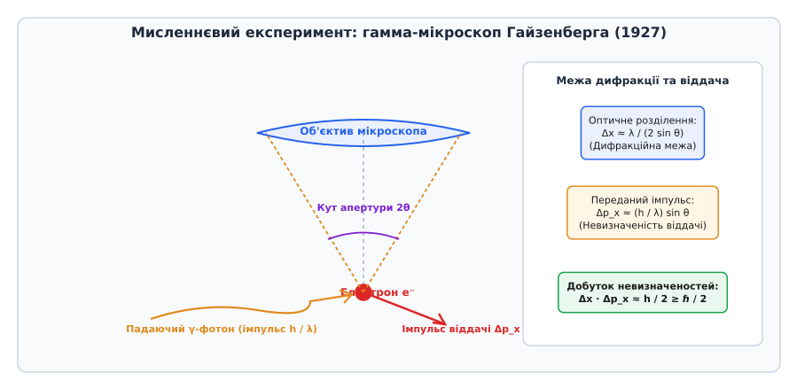
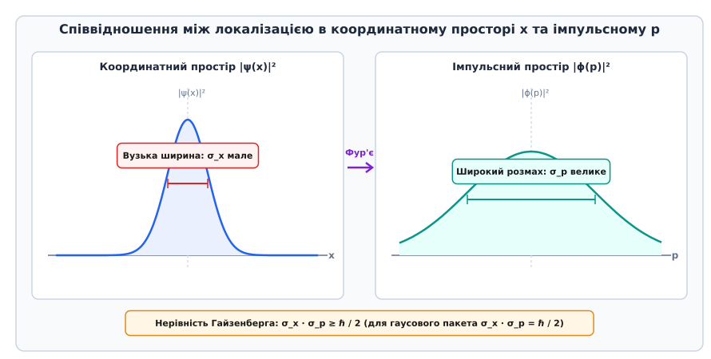

# 📜 Мисленнєвий експеримент з гамма-мікроскопом Гайзенберга та дискусії 1927 року

Навесні 1927 року в Інституті теоретичної фізики в Копенгагені двадцятип'ятирічний німецький фізик Вернер Гайзенберг (нім. *Werner Heisenberg*) намагався знайти фізичну інтерпретацію для створеної ним двома роками раніше матричної механіки. Формалізм матриць чудово описував спектральні лінії та рівні енергії в атомах, проте не залишав місця для звичного поняття неперервної траєкторії частинки. Намагаючись зрозуміти, чому ми не можемо одночасно простежити за координатою та швидкістю електрона у камері Вільсона, Гайзенберг поставив фундаментальне питання: що саме означає процедура вимірювання траєкторії мікрооб'єкта на практиці?

Відповіддю став знаменитий мисленнєвий експеримент із гамма-мікроскопом, який не лише дав наочну ілюстрацію принципу невизначеності, а й розпалив одну з найвидатніших наукових дискусій ХХ століття між Нільсом Бором, Вернером Гайзенбергом та Альбертом Ейнштейном.

## Шлях до Копенгагена: матриці проти хвиль

До 1926 року квантова фізика перебувала у стані глибокої раціональної кризи. Існувало дві математично еквівалентні, але філософськи протилежні теорії. З одного боку, матрична механіка Гайзенберга, Макса Борна (нім. *Max Born*) та Паскуаля Йордана (нім. *Pascual Jordan*) повністю відмовилася від наочних образів, оперуючи лише спостережуваними величинами — частотами та інтенсивностями випромінювання. З іншого боку, хвильова механіка Ервіна Шредінгера (нім. *Erwin Schrödinger*) описувала електрон як неперервну хвилю `ψ`, відновлюючи наочність класичної фізики.

Шредінгер сподівався, що квантові стрибки можна повністю виключити, замінивши електрон вузьким хвильовим пакетом. Проте Гайзенберг категорично не погоджувався з хвильовим тлумаченням, доводячи, що вільний хвильовий пакет неминуче розпливається у просторі з часом, тоді як електрон у будь-якому експерименті виявляється як точкова частинка з неподільним зарядом і масою.

Під час палких дискусій у Копенгагені Гайзенберг згадав пораду Альберта Ейнштейна, висловлену під час їхньої зустрічі в Берліні 1926 року: «Лише теорія вирішує, що саме можна спостерігати». Гайзенберг перевернув це твердження: якщо якась величина не може бути виміряна жодним фізичним приладом без збурення системи, вона взагалі не існує у фізичній реальності.

## Мисленнєвий експеримент з гамма-мікроскопом

Щоб зробити математичне співвідношення невизначеностей наочним, Гайзенберг запропонував розгланути процедуру вимірювання координати електрона за допомогою оптичного мікроскопа високої роздільної здатності.


*Схема мисленнєвого експерименту Гайзенберга з розсіюванням гамма-фотона на електроні під кутом апертури 2θ.*

Нехай електрон знаходиться під об'єктивом мікроскопа з кутом апертури `2θ`. Щоб визначити положення електрона з якомога вищою точністю `Δx`, його необхідно освітити світлом із найкоротшою довжиною хвилі `λ`. Класична оптика Ернста Аббе (нім. *Ernst Abbe*) накладає жорстке дифракційне обмеження на роздільну здатність оптичної системи:

```
Δx ≈ λ / (2 sin θ)      [дифракційна межа роздільної здатності мікроскопа]
```

Звідси випливає, що для досягнення високої точності (малого `Δx`) ми зобов'язані використовувати кванти світла надвисокої частоти — гамма-фотони з дуже малою довжиною хвилі `λ`.

Однак світло складається з дискретних частинок — фотонів. Згідно з теорією фотоефекту Ейнштейна та ефекту Комптона (англ. *Compton effect*), кожен гамма-фотон несе імпульс:

```
p_гамма = h / λ        [імпульс фотона за формулою де Бройля]
```

Щоб спостерігач побачив електрон, принаймні один гамма-фотон повинен відбитися від електрона й потрапити в об'єктив мікроскопа. Під час зіткнення фотон передає електрону невизначений імпульс віддачі внаслідок комптонівського розсіювання.

Оскільки фотон може потрапити в будь-яку точку об'єктива у межах кута конуса `2θ`, напрямок розсіяного фотона залишається невідомим із точністю до кута `θ`. Отже, горизонтальна складова імпульсу, передана електрону під час зіткнення, має неминучу невизначеність:

```
Δp_x ≈ p_гамма · sin θ
= (h / λ) · sin θ      [невизначеність імпульсу віддачі електрона]
```

Перемноживши невизначеність координати `Δx` та невизначеність імпульсу `Δp_x`, ми отримуємо:

```
Δx · Δp_x ≈ (λ / (2 sin θ)) · ((h / λ) sin θ)
= h / 2
≥ ℏ / 2                [добуток невизначеностей не залежить від довжини хвилі λ]
```

Цей результат виявився фундаментальним: довжина хвилі світла `λ` та кут апертури `θ` повністю скоротилися! Спроба збільшити точність вимірювання координати шляхом зменшення `λ` неминуче збільшує імпульс фотона `h / λ`, що призводить до сильнішого й менш передбачуваного поштовху електрона. Спроба зменшити поштовх (зменшуючи імпульс фотона або кут `θ`) розмиває дифракційне зображення й погіршує точність визначення координати.

## Критика Нільса Бора та принцип доповнюваності

Коли Гайзенберг показав чернетку своєї статті Нільсу Бору, той високо оцінив фізичну інтуїцію автора, але висловив серйозне зауваження. Бор вказав, що аналіз Гайзенберга був неповним: він розглядав лише частинкові властивості світла (поштовх фотона), але спирався на хвильову оптичну формулу Аббе для роздільної здатності.

Бор довів, що невизначеність виникає не просто через «незграбний поштовх» приладу, а через дуальну хвильово-частинкову природу матерії та випромінювання. Щоб виміряти імпульс електрона з високою точністю, прилад мусить мати рухомі частини або сітки, які дозволяють зафіксувати передачу імпульсу, але це повністю знищує інформацію про точне місце зіткнення.

На цій основі Бор сформулював **Принцип доповнюваності** (дань. *komplementaritet*): хвильовий та корпускулярний описи фізичного об'єкта не суперечать один одному, а доповнюють один одного. Експериментальні установки, призначені для вимірювання точної координати (просторово-часова картина), і установки для вимірювання точного імпульсу (причинно-наслідкова картина збереження імпульсу й енергії) є взаємно виключними. Ми не можемо побудувати прилад, який одночасно реалізує обидва типи вимірювання.

## Дискусії з Ейнштейном на Сольвеївських конгресах

Публікація статті Гайзенберга у 1927 році та її обговорення на V Сольвеївському конгресі у Брюсселі спричинили драматичний інтелектуальний поєдинок між Альбертом Ейнштейном та Нільсом Бором. Ейнштейн категорично відмовлявся прийняти ймовірнісну інтерпретацію квантової механіки та фундаментальну відсутність детермінізму в мікросвіті, виголосивши свою знамениту фразу: «Бог не грає в кості» (нім. *Gott würfelt nicht*).

Ейнштейн висував один за одним витончені мисленнєві експерименти, намагаючись довести, що принцип невизначеності є лише наслідком недосконалості нашого опису, а не властивістю самої природи.

### «Ящик з фотоном» Ейнштейна (1930 рік)

На VI Сольвеївському конгресі 1930 року Ейнштейн представив, як йому здавалося, вирішальний аргумент проти співвідношення невизначеності «енергія — час» (`ΔE · Δt ≥ ℏ / 2`).

Уявімо ящик, заповнений випромінюванням, у стінці якого є отвір із затвором. Затвор керується годинником, встановленим усередині ящика. Ящик зважують на пружинних вагах до випромінювання. У певний момент часу `t` затвор відкривається на надзвичайно короткий проміжок часу `Δt`, випускаючи один-єдиний фотон, і знову закривається. Після цього ящик зважують вдруге.

Зі зменшення маси ящика `Δm` за формулою Ейнштейна `E = m c²` можна з довільною точністю визначити енергію випущеного фотона `E`. При цьому час вильоту `t` фіксується годинником із точністю `Δt`, яка визначається лише швидкістю роботи механізму затвора. Таким чином, як стверджував Ейнштейн, ми можемо виміряти і енергію `E`, і час `t` одночасно з будь-якою бажаною точністю, порушуючи `ΔE · Δt ≥ ℏ / 2`.


*Фундаментальне співвідношення невизначеностей стало предметом палких дискусій між Ейнштейном та Бором на Сольвеївських конгресах.*

### Тріумфальна відповідь Бора

За спогадами сучасників, Бор провів безсонну ніч, шукаючи помилку в міркуваннях Ейнштейна. Наступного ранку він дав блискучу відповідь, використавши проти Ейнштейна його ж власну Загальну теорію відносності!

Бор вказав, що під час вильоту фотона ящик стає легшим і піднімається вгору на пружинних вагах у гравітаційному полі Землі. Для вимірювання зміни маси `Δm` з точністю `δm` ящик повинен зміститися по висоті на відстань `Δq`. Але згідно із загальною теорією відносності, хід годинника у гравітаційному полі залежить від його висоти `q` (гравітаційне сповільнення часу):

```
Δt / t = (g · Δq) / c²    [зсув ходу годинника у гравітаційному полі Землі]
```

Невизначеність положення ящика `Δq` під час зважування неминуче веде до невизначеності імпульсу ваг `Δp`, а отже, через співвідношення невизначеності для макроскопічних ваг `Δq · Δp ≥ ℏ`, вносить невизначеність у хід годинника `Δt`.

Точний розрахунок Бора показав, що після врахування гравітаційного ефекту зсуву часу:

```
ΔE · Δt ≥ ℏ / 2          [відновлення нерівності Гайзенберга через загальну теорію відносності]
```

Ейнштейн був змушений визнати логічну бездоганність аргументації Бора. Цей епізод став одним із найяскравіших тріумфів Копенгагенської інтерпретації quantum механіки, довівши, що принцип невизначеності є глибинною внутрішньо узгодженою властивістю природи, яку неможливо обійти жодними технічними хитрощами.

## Сучасний погляд на фундаментальну межу

Сьогодні ми знаємо, що мисленнєвий експеримент з гамма-мікроскопом, хоч і зіграв величезну історичну роль у становленні квантової думки, створює дещо хибне враження, ніби невизначеність є лише результатом «фізичного пошкодження» чи «збурення» стану під час вимірювання.

Сучасна квантова механіка стверджує: принцип невизначеності є не наслідком процесу вимірювання, а фундаментальною хвильовою властивістю квантового стану як такого. Навіть якщо вимірювання взагалі не проводиться, мікрочастинка у квантовому стані фізично не має одночасно точної координати та точного імпульсу. Її стан описується розподілом амплітуд ймовірностей, для якого математична нерівність Гайзенберга — Робертсона є прямою теоремою фур'є-аналізу у гільбертовому просторі.
