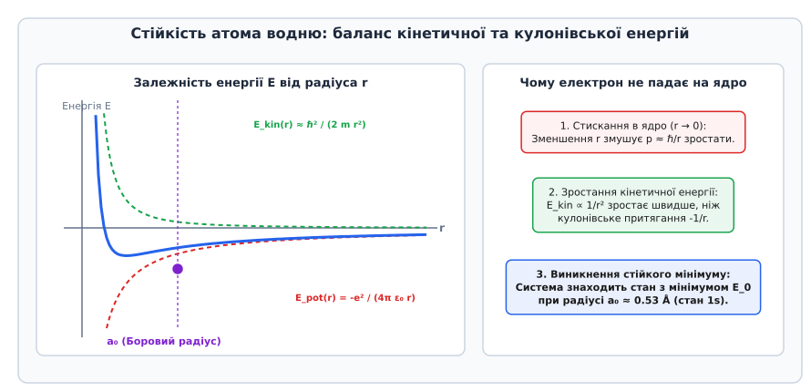
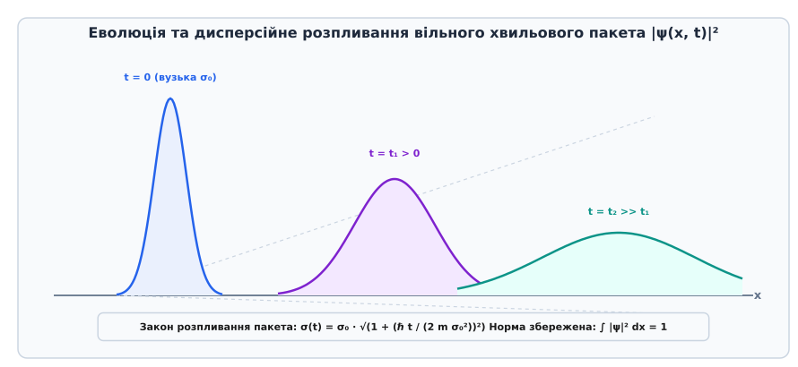

# Принцип невизначеності Гайзенберга

<preknowlist>
- [Корпускулярно-хвильовий дуалізм](topic:physics/wave-particle-duality) — подвійність природи квантових об'єктів та хвильова функція.
- [Одновимірне стаціонарне рівняння Шредінгера](topic:physics/stationary-schrodinger-equation) — опис квантовомеханічного стану системи.
- [Суперпозиція хвиль](topic:physics/wave-superposition) — додавання хвильових пакетів різної частоти.
- [Гармонічний осцилятор](topic:physics/harmonic-oscillator) — коливальні системи та спектри енергії.
</preknowlist>

Якщо ми спробуємо стиснути квантову частинку у вузьку просторову область розміром `Δx`, граничні умови неминуче змусять її хвильову функцію складатися з високих просторових частот. Оскільки в квантовій фізиці імпульс об'єкта прямо пропорційний хвильовому вектору `p = ℏ k`, поява широкого спектра просторових частот означає появу широкого розкиду імпульсів `Δp`. При спробі точніше зафіксувати координату частинки ми неминуче втрачаємо контроль над її імпульсом — і навпаки.

Ця фундаментальна властивість природи, відкрита Вернером Гайзенбергом (нім. *Werner Heisenberg*) у 1927 році, отримала назву **Принцип невизначеності Гайзенберга**. Вона показує, що квантовий мікросвіт принципово відрізняється від класичної ньютонівської механіки: частинка не має одночасно точної траєкторії, точного положення та точної швидкості. Взаємна невизначеність є не наслідком недосконалості вимірювальних приладів, а фундаментальною хвильовою рисою матерії.

## 1. Хвильова природа матерії та дуальність Фур'є

У класичній механіці стан точкової частинки у будь-який момент часу повністю визначається радіус-вектором `r` та імпульсом `p`. У квантовій механіці стан частинки описується комплексною хвильовою функцією `ψ(x)`, квадрат модуля якої `|ψ(x)|²` визначає густину ймовірності знайти частинку у точці `x`.

Для опису частинки, яка перебуває у відносно локалізованій області простору та рухається з певною середньою швидкістю, використовують хвильовий пакет — суперпозицію багатьох плоских монохроматичних хвиль `exp(i k x)` з різними хвильовими числами `k`. Математично зв'язок між координатною хвильовою функцією `ψ(x)` та її спектральною амплітудою в імпульсному просторі `ϕ(p)` здійснюється через пряме й зворотне перетворення Фур'є (фр. *Jean-Baptiste Joseph Fourier*):

```
ψ(x) = (1 / √(2 π ℏ)) ∫ ϕ(p) exp(i p x / ℏ) dp   [розклад за імпульсними гармоніками]

ϕ(p) = (1 / √(2 π ℏ)) ∫ ψ(x) exp(-i p x / ℏ) dx  [перетворення Фур'є для спектра імпульсів]
```

Завдяки теоремі Парсеваля (фр. *Marc-Antoine Parseval*) нормування хвильової функції зберігається в обох просторах: якщо `∫ |ψ(x)|² dx = 1`, то `∫ |ϕ(p)|² dp = 1`. Загальна ймовірність виявити частинку у всьому просторі дорівнює одиниці.

Із математичних властивостей перетворення Фур'є випливає фундаментальна теорема про ширину функцій-двоїстих пар: **функція та її фур'є-образ не можуть бути одночасно довільно вузькими**.


*Локалізація хвильової функції у координатному просторі змушує її розширюватися у просторі імпульсів унаслідок властивостей перетворення Фур'є.*

Якщо хвильова функція `ψ(x)` локалізована у вузькому просторовому інтервалі шириною `Δx` (наприклад, Гаусів пакет з малою дисперсією), то для її побудови потрібен широкий спектр гармонік `Δk`. Оскільки зв'язок між хвильовим числом та імпульсом задається формулою Луї де Бройля (фр. *Louis de Broglie*) `p = ℏ k`, ширини розподілів у координатному й імпульсному просторах пов'язані строгим співвідношенням:

```
Δx · Δk ≥ 1 / 2          [фундаментальне співвідношення Фур'є-аналізу]
```

Помноживши обидві частини нерівності на зведену сталу Планка `ℏ` (нім. *Max Planck*, `ℏ = h / 2π`), отримуємо фізичну нерівність Гайзенберга:

```
Δx · Δp_x ≥ ℏ / 2        [співвідношення невизначеності координата-імпульс]
```

Цей результат підкреслює глибокий фізичний зміст: якщо частинка має строго визначену довжину хвилі `λ` (і отже, точний імпульс `p = h / λ`), її хвильова функція є нескінченною монохроматичною хвилею `exp(i k x)`, поширеною по всьому простору від `-∞` до `+∞`. У такому стані координата частинки є повністю невизначеною (`Δx = ∞`). І навпаки: якщо частинка строго локалізована в одній точці (дельта-функція Дірака `ψ(x) = δ(x - x₀)`), її імпульсний спектр містить усі можливі значення імпульсу від `-∞` до `+∞` з однаковою амплітудою (`Δp = ∞`).

## 2. Операторний формалізм і некомутативність спостережуваних

У математичному формалізмі квантової механіки Поль Дірака (англ. *Paul Dirac*) та Джона фон Неймана (угор. *John von Neumann*) кожній фізичній спостережуваній величині відповідає лінійний самоспряжений (ермітовий, лат. *hermitianus*) оператор, що діє у комплексному гільбертовому просторі станів (нім. *David Hilbert*).

Координаті частинки `x` відповідає оператор множення на незалежну змінну `x̂`, а імпульсу `p_x` — оператор просторового диференціювання:

```
x̂ ψ(x) = x · ψ(x)       [оператор координати]

p̂_x ψ(x) = -i ℏ (∂ψ / ∂x) [оператор імпульсу, де i — уявна одиниця]
```

У неперервному координатному базисі матричні елементи цих операторів записуються як `⟨x|x̂|x'⟩ = x δ(x - x')` та `⟨x|p̂_x|x'⟩ = -i ℏ (∂ / ∂x) δ(x - x')`.

Фізичний зміст принципу невизначеності тісно пов'язаний із тим, чи комутують відповідні оператори між собою. Послідовне застосування операторів координати та імпульсу до довільної гладкої хвильової функції `ψ(x)` дає:

```
x̂ (p̂_x ψ) = x (-i ℏ (∂ψ / ∂x)) = -i ℏ x (∂ψ / ∂x)
```

Якщо ж застосувати оператори у зворотному порядку:

```
p̂_x (x̂ ψ) = -i ℏ (∂ / ∂x) (x ψ) = -i ℏ ψ - i ℏ x (∂ψ / ∂x) [правило диференціювання добутку]
```

Віднімаючи другий вираз від першого, знаходимо комутатор (лат. *commutatio* — зміна, обмін) операторів координати та імпульсу:

```
[x̂, p̂_x] ψ = (x̂ p̂_x - p̂_x x̂) ψ = i ℏ ψ
```

Оскільки це співвідношення виконується для довільної функції `ψ(x)`, операторна рівність записується у вигляді канонічного комутаційного співвідношення Гайзенберга:

```
[x̂, p̂_x] = i ℏ I        [канонічний комутатор координати та імпульсу]
```

де `I` — одиничний оператор.

Некомутативність операторів (`[x̂, p̂_x] ≠ 0`) має фундаментальний алгебраїчний наслідок: **оператори `x̂` та `p̂_x` не мають спільного базису власних функцій!**

Якщо два оператори комутують (наприклад, оператори координат уздовж різних осей `[x̂, ŷ] = 0` або оператори координати `x̂` та імпульсу `p̂_y` уздовж перпендикулярної осі `[x̂, p̂_y] = 0`), система може перебувати у стані, де обидві величини мають точні вимірні значення одночасно. Але якщо оператори не комутують, будь-яка власна функція оператора `x̂` не є власною функцією оператора `p̂_x`. Вимірювання однієї величини неминуче руйнує визначеність спряженої величини.

## 3. Квантові дисперсії та нерівність Гайзенберга — Робертсона

Щоб надати принципу невизначеності точного математичного формулювання, введемо поняття середньоквадратичного відхилення (дисперсії) фізичної величини. Для стану `|Ψ⟩` середнє значення оператора `Â` визначається скалярним добутком `⟨A⟩ = ⟨Ψ| Â |Ψ⟩`.

Незсунута невизначеність `σ[A]` (стандартне відхилення) визначається як квадратний корінь з дисперсії флуктуацій:

```
σ[A] = √( ⟨Ψ| (Â - ⟨A⟩I)² |Ψ⟩ ) = √( ⟨A²⟩ - ⟨A⟩² ) [стандартне відхилення величини A]
```

У 1929 році американський фізик Говард Персі Робертсон (англ. *Howard Percy Robertson*) довів математичну теорему, яка узагальнює нерівність Гайзенберга для довільних двох ермітових операторів `Â` та `B̂`:

```
σ[A] · σ[B] ≥ (1 / 2) | ⟨Ψ| [Â, B̂] |Ψ⟩ | [нерівність Робертсона]
```

У 1930 році Ервін Шредінгер (нім. *Erwin Schrödinger*) узагальнив цю нерівність, врахувавши квантову коваріацію (кореляцію між флуктуаціями величин) `Cov(A, B) = (1 / 2) ⟨{Â - ⟨A⟩I, B̂ - ⟨B⟩I}⟩`:

```
σ[A] · σ[B] ≥ √( (1 / 4) |⟨[Â, B̂]⟩|² + Cov(A, B)² ) [повно нерівність Шредінгера]
```

Детальне виведення цього співвідношення на основі нерівності Коші — Буняковського — Шварца наведено у вставці [Математичне виведення загального співвідношення Робертсона — Шредінгера](topic:physics/uncertainty-principle/math-robertson-relation.md).

Підставляючи в нерівність Робертсона канонічний комутатор `[x̂, p̂_x] = i ℏ`, маємо:

```
σ[x] · σ[p_x] ≥ (1 / 2) | i ℏ | = ℏ / 2 [строга точна нерівність Гайзенберга]
```

Звідси чітко видно значення константи `ℏ / 2` (`ℏ = h / 2π ≈ 1.054571 · 10⁻³⁴ Дж·с`). У класичній границі, коли стала Планка прямує до нуля (`ℏ → 0`), праворуч отримуємо нуль: `σ[x] · σ[p] ≥ 0`, що відновлює класичну можливість одночасного точного знання координати й імпульсу.

### Гаусові стани та стиснені квантові стани

Для якого квантового стану нерівність Гайзенберга перетворюється на точну рівність `σ[x] · σ[p] = ℏ / 2`?

Математичний аналіз показує, що рівність досягається тоді й лише тоді, коли хвильова функція має форму Гаусового пакета:

```
ψ(x) = (1 / (2 π σ_x²)^(1/4)) · exp( - (x - ⟨x⟩)² / (4 σ_x²) + i ⟨p⟩ x / ℏ )
```

Гаусові хвильові пакети називають **станами з мінімальною невизначеністю**. Вони відіграють ключову роль у квантовій оптиці, описуючи когерентні стани лазерного випромінювання та механічні осцилятори у початковому стані.

У сучасній квантовій фізиці велике значення мають **стиснені стани** (англ. *squeezed states*). У таких станах за допомогою нелінійно-оптичних кристалів або квантових інтерферометрів вдається зменшити невизначеність однієї з двох спряжених величин (наприклад, `σ[x] < √(ℏ / 2 m ω)`) за рахунок пропорційного зростання невизначеності іншої величини (`σ[p] > √(ℏ m ω / 2)`), так що добуток залишається рівним або більшим за `ℏ / 2`. Це дозволяє здійснювати надточні вимірювання нижче рівня звичайного квантового шуму.

Для будь-якої іншої форми хвильового пакета (наприклад, прямокутного або лоренцового) добуток невизначеностей є строго більшим за `ℏ / 2`.

## 4. Мисленнєві експерименти та історія виникнення

Співвідношення невизначеностей не було виведено Гайзенбергом як суха математична теорема — воно народилося у палких дискусіях про фізичний зміст квантових вимірювань.

Шукаючи відповідь на питання, чому ми не можемо виміряти траєкторію електрона без її руйнування, Гайзенберг у 1927 році запропонував славетний мисленнєвий експеримент із оптичним гамма-мікроскопом.


*Мисленнєвий експеримент Гайзенберга з оптичним мікроскопом високої роздільної здатності та поштовхом віддачі фотона.*

Щоб визначити положення електрона з точністю `Δx`, його необхідно освітити фотоном із короткою довжиною хвилі `λ`. Класична оптика накладає дифракційне обмеження Аббе на роздільну здатність мікроскопа з кутом апертури `2θ`:

```
Δx ≈ λ / (2 sin θ)      [дифракційна межа роздільної здатності]
```

Проте світло складається з квантів — фотонів, кожен з яких несе імпульс `p_гамма = h / λ`. Під час розсіювання фотон передає електрону поштовх віддачі (комптонівське розсіювання). Оскільки розсіяний фотон може потрапити в будь-яку точку об'єктива у межах кута `2θ`, переданий імпульс вздовж осі X залишається невідомим із точністю:

```
Δp_x ≈ (h / λ) sin θ    [невизначеність імпульсу віддачі]
```

Перемноживши обидві нерівності, Гайзенберг отримав `Δx · Δp_x ≈ h ≥ ℏ / 2`. Спроба покращити точність `Δx` шляхом використання коротших хвиль `λ` змушує фотон нести більший імпульс, що пропорційно збільшує невизначеність віддачі `Δp_x`.

### Дифракція на одній щілині

Іншим класичним мисленнєвим експериментом є проходження пучка частинок крізь тонку щілину шириною `d`.

До проходження щілини частинки рухаються вздовж осі X, тому їхній поперечний імпульс уздовж осі Y дорівнює нулю (`p_y = 0`, `Δp_y = 0`). Проходячи крізь щілину, частинка локалізується по координаті Y у межах ширини щілини: `Δy = d`.

Унаслідок хвильової природи частинок на щілині відбувається дифракція. Перший дифракційний мінімум спостерігається під кутом `θ`, який задовольняє умову `d sin θ = λ`. Появи дифракційної картини означає, що частинки відхиляються від початкового напрямку, набуваючи поперечного імпульсу `p_y = p sin θ`.

Невизначеність поперечного імпульсу визначається шириною центрального дифракційного максимуму:

```
Δp_y ≈ p sin θ = (h / λ) · (λ / d) = h / d [невизначеність поперечного імпульсу]
```

Перемноживши ширину щілини `Δy = d` на невизначеність поперечного імпульсу `Δp_y`, отримуємо:

```
Δy · Δp_y ≈ d · (h / d) = h ≥ ℏ / 2 [співвідношення невизначеності на щілині]
```

Спроба звузити щілину (`d → 0`) з метою точнішого фіксування координати частинки викликає сильніше дифракційне розмивання пучка (`θ → 90°`), пропорційно збільшуючи невизначеність поперечного імпульсу частинок.

Детальний опис історичного контексту, палких дискусій між Нільсом Бором та Альбертом Ейнштейном на Сольвеївських конгресах, а також розгадки аналізу «ящика з фотоном» через Загальну теорію відносності наведено у вставці [Історія створення та мисленнєвий експеримент з гамма-мікроскопом](topic:physics/uncertainty-principle/hist-heisenberg-microscope.md).

## 5. Співвідношення невизначеності «енергія — час»

Окрім координатно-імпульсної пари, у квантовій фізиці надзвичайно важливу роль відіграє співвідношення невизначеності між енергією системи `E` та часом `t`:

```
ΔE · Δt ≥ ℏ / 2          [співвідношення невизначеності енергія-час]
```

Проте математична природа цього співвідношення кардинально відрізняється від `Δx · Δp ≥ ℏ / 2`. У нерелятивістській квантовій механіці координата `x` є ермітовим оператором `x̂`, тоді як час `t` є не оператором, а зовнішнім параметром еволюції (скалярним параметром часової осі).

Тому вивід `ΔE · Δt ≥ ℏ / 2` здійснюється за теоремою Мандельштама — Тамма (1945), де `Δt` визначається як характерний час `Δt = σ[A] / |d⟨A⟩/dt|`, за який середнє значення довільної фізичної спостережуваної `A` змінюється на величину свого стандартного відхилення.

Фізичний зміст співвідношення «енергія — час» реалізується у трьох основних фундаментальних явищах:

### 1. Точність вимірювання енергії тривалістю часу

Щоб виміряти енергію квантової системи з точністю `ΔE`, вимірювальний прилад мусить взаємодіяти із системою протягом часового інтервалу `Δt ≥ ℏ / (2 ΔE)`. Миттєве вимірювання енергії принципово неможливе.

### 2. Час життя стану та природна ширина спектральних ліній

Якщо квантовий стан (наприклад, збуджений рівень атома чи нестабільна елементарна частинка) має скінченний час життя `τ`, то енергія цього рівня не може бути строго фіксованою. Вона має неодмінну енергетичну ширину:

```
ΔE ≈ ℏ / τ           [природна ширина енергетичного рівня]
```

Це пояснює, чому спектральні лінії випромінювання атомів завжди мають скінченну природну ширину (форма профілю Лоренца). Чим коротшим є час життя стан `τ`, тим ширшою є спектральна лінія випромінюваного фотона. Стабільні стани (наприклад, основний стан атома водню) мають нескінченний час життя `τ = ∞`, тому їхня енергія є визначеною абсолютно точно (`ΔE = 0`).

### 3. Віртуальні частинки та квантові флуктуації вакууму

У квантовій теорії поля (КТП) співвідношення `ΔE · Δt ≥ ℏ / 2` дозволяє виникати з квантового вакууму віртуальним частинкам. Пара частинка-античастинка із сумарною масовою енергією `ΔE = 2 m c²` може самочинно народитися з порожнечі, якщо вона анігілює та зникне за короткий час `Δt ≤ ℏ / (2 m c²)`.

Саме цим механізмом передаються фундаментальні фізичні взаємодії: переносниками електромагнітного поля є віртуальні фотони, а ядерні сили описуються потенціалом Хідекі Юкави (яп. *Hideki Yukawa*) `V(r) = -g² exp(-m c r / ℏ) / r`. Оскільки масивний пі-мезон має масу `m_π ≈ 140 МеВ/c²`, радіус дії ядерних сил обмежується відстанню `R ≈ ℏ / (m_π c) ≈ 1.4 · 10⁻¹⁵ м = 1.4 фм`.

## 6. Фізичні наслідки: стійкість атомів, нульові коливання та квантове тунелювання

Принцип невизначеності є не просто обмеженням вимірювань — це фундамент, який визначає структуру всієї нашої матеріальної дійсності. Без нього Всесвіт не зміг би існувати у знайомому нам вигляді.

### Чому електрон не падає на ядро атома

Згідно з класичною електродинамікою Джеймса Клерка Максвелла (англ. *James Clerk Maxwell*), електрон, що рухається навколо ядра по коловій орбіті з прискоренням, повинен безперервно випромінювати електромагнітні хвилі. Втрачаючи енергію, електрон мав би спірально впасти на ядро за невиправно короткий час — близько `10⁻¹¹` секунд.

Квантова механіка пояснює стійкість атома саме через принцип невизначеності Гайзенберга.


*Баланс зростаючої квантової кінетичної енергії стискання та кулонівського притягання створює стійкий мінімум енергії атома.*

Уявімо, що електрон наближається до ядра на відстань `r`. Його просторова невизначеність зменшується до `Δx ≈ r`. Згідно з принципом невизначеності, імпульс електрона неминуче зростає:

```
p ≈ Δp ≥ ℏ / r          [оцінка мінімального імпульсу електрона]
```

Повна енергія електрона у полі кулонівського притягання ядра із зарядом `e` складається з кінетичної та потенціальної енергій:

```
E(r) = E_кінетична + E_потенціальна
≈ p² / (2 m_e) - e² / (4 π ε₀ r)
≈ ℏ² / (2 m_e r²) - e² / (4 π ε₀ r) [функція повної енергії від радіуса r]
```

Проаналізуємо цю залежність:
- При великих `r` переважає кулонівське притягання `-1/r`, яке тягне електрон до ядра.
- Однак при малих `r → 0` квантова кінетична енергія стискання `ℏ² / (2 m_e r²)` зростає як `1/r²` — значно швидше, ніж потенціальна енергія `-1/r` зменшується!

Цей квантовий опір стисканню створює стійкий потенціальний мінімум при радіусі:

```
a₀ = (4 π ε₀ ℏ²) / (m_e e²) ≈ 0.529 Å = 0.0529 нм [Боровий радіус атома водню]
```

Мінімально можлива енергія основного стану становить `E₀ ≈ -13.6 еВ`. Електрон не може впасти ближче до ядра, тому що для цього йому потрібна була б нескінченно велика кінетична енергія флуктуацій! Світ існує і не колапсує саме завдяки принципу невизначеності.

### Тиск виродженого електронного газу та астрофізика

У надщільних астрофізичних об'єктах — білих карликах (англ. *white dwarfs*) та нейтронних зорях (англ. *neutron stars*) — саме принцип невизначеності Гайзенберга разом із принципом заборони Паулі створює тиск виродженого електронного чи нейтронного газу.

Стискання речовини масою з Зорю до об'єму розміром із Землю змушує електрони локалізуватися у тісних комірках простору `Δx ≈ n⁻¹/³`. Це породжує колосальний імпульс `p ≈ ℏ n¹/³` та релятивістський тиск стискання `P ∝ n⁴/³`, який протистоїть гравітаційному колапсу зорі до межі Чандрасекара (1.4 мас Сонця).

### Нульові коливання (Zero-Point Energy)

У класичній фізиці найнижчим енергетичним станом гармонічного осцилятора є повний спокій: кулька лежить на дні потенціальної ями з лінійним відхиленням `x = 0` та швидкістю `v = 0`. Її енергія дорівнює нулю.

У квантовій механіці стан `x = 0` та `p = 0` означає `σ[x] = 0` та `σ[p] = 0`, що суворо заборонено принципом невизначеності. Повна енергія квантового осцилятора частоти `ω`:

```
E = p² / (2m) + (1 / 2) m ω² x²
```

Мінімізуючи цю енергію з урахуванням умовою `σ[x] · σ[p] = ℏ / 2`, ми знаходимо мінімальну можливу енергію осцилятора — **енергію нульових коливань**:

```
E₀ = (1 / 2) ℏ ω         [нульова енергія квантового осцилятора]
```

Навіть при абсолютному нулі температур (`T = 0 K`) квантові системи не припиняють свого руху. Нульові коливання є джерелом квантового шуму у надчутливих датчиках, викликають ефект Казимира (фізичне притягання металевих пластин у вакуумі) і запобігають кристалізації рідкого гелію при атмосферному тиску аж до абсолютного нуля.

### Квантове тунелювання та розпливання хвильового пакета

Принцип невизначеності пояснює ефект квантового тунелювання: частинка з енергією `E` може проникнути крізь потенціальний бар'єр висотою `V₀ > E`. Через локалізацію частинки під бар'єром її імпульс отримує невизначеність `Δp`, яка дозволяє частинці на короткий час «позичити» енергію `ΔE` відповідно до `ΔE · Δt ≥ ℏ / 2` та подолати бар'єр.

При вільному русі частинки у просторі спектральний розкид імпульсів призводить до дисперсійного розпливання хвильового пакета з часом відповідно до закону `σ(t) = σ₀ √(1 + (ℏ t / 2 m σ₀²)²)`.


*Зростання просторової ширини σ(t) вільного хвильового пакета у часі внаслідок спектрального розкиду імпульсів.*

Чисельні алгоритми моделювання розпливання packages мовами C, C++ та Python розібрані у вставці [Чисельне моделювання еволюції та розпливання квантового хвильового пакета](topic:physics/uncertainty-principle/proj-wavepacket-dispersion.md).

> 🔧 **Навіщо це.**
>
> Принцип невизначеності Гайзенберга є не просто умоглядним теорійним положенням, а реальним фізичним фактором, який визначає межі інженерних рішень у сучасних мікро- та нанотехнологіях:
>
> 1. **Наноелектроніка та межі масштабування MOSFET-транзисторів:**
>    У сучасних напівпровідникових процесорах (техпроцеси 3 нм та 2 нм) товщина діелектрика під затвором транзистора становить лише кілька атомних шарів (менше 1.5 нм). Через принцип невизначеності та квантове тунелювання електрони просочуються крізь підзатворний оксид кремнію, утворюючи струми витоку затвора (англ. *gate leakage current*). Це фундаментальний фізичний поріг, який змусив індустрію перейти на матеріали з високою діелектричною проникністю (High-k діелектрики) та тривимірні структури FinFET / GAAFET.
>
> 2. **Атомні годинники та оптичні стандарти частоти:**
>    Точність сучасних атомних годинників обмежується співвідношенням невизначеності «енергія — час» `ΔE · Δt ≥ ℏ / 2`. Щоб зменшити невизначеність частоти перехода `Δν = ΔE / h`, атомні стандарти частоти використовують лазерне охолодження (оптичну патоку), уповільнюючи атоми цезію або ітербію до мікрокельвінових температур, що дозволяє збільшити час взаємодії `Δt` до секунд і досягти відносної точності `10⁻¹⁸` (похибка в 1 секунду за 30 мільярдів років).
>
> 3. **Детектори гравітаційних хвиль LIGO та стиснене світло:**
>    У лазерних інтерферометрах LIGO та Virgo при вимірюванні зміщень дзеркал на рівні `10⁻¹⁹` метра досягається так звана **Стандартна квантова межа** (англ. *Standard Quantum Limit, SQL*). Флуктуації числа фотонів у промені створюють дробовий шум фази, а квантовий тиск світла на дзеркала викликає невизначеність їхнього імпульсу. Щоб подолати цю межу, фізики застосовують джерела **стисненого світла** (англ. *squeezed light*), у яких за допомогою квантово-оптичних кристалів невизначеність фази зменшується за рахунок пропорційного зростання невизначеності амплітуди відповідно до співвідношення Шредінгера.
>
> 4. **Сканувальна тунельна мікроскопія (STM):**
>    Вимірювання тунельного струму між металевою голкою та поверхнею зразка дозволяє отримувати зображення окремих атомів з просторовим розділенням до `0.01` нм завдяки експоненційній чутливості тунельного струму `I_tunnel ∝ exp(-2 k d)` до відстані `d`.
