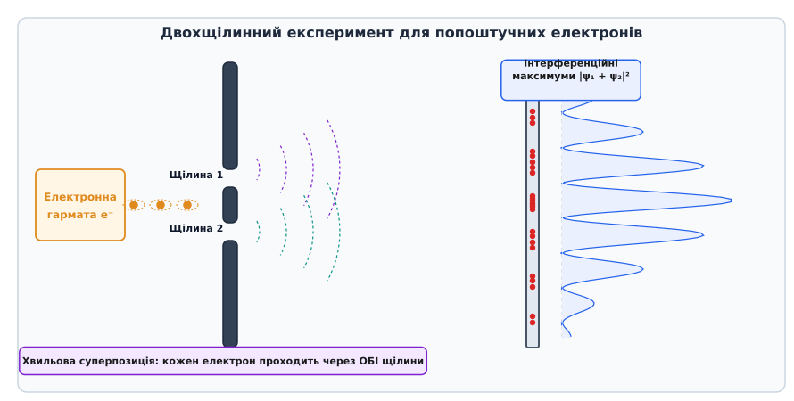
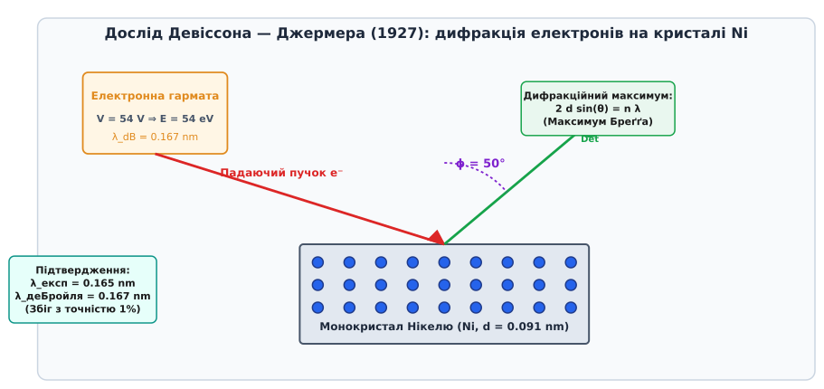
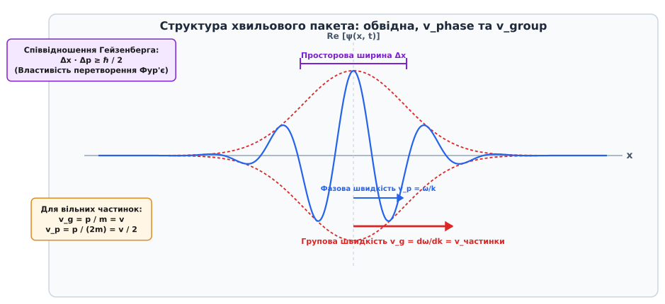
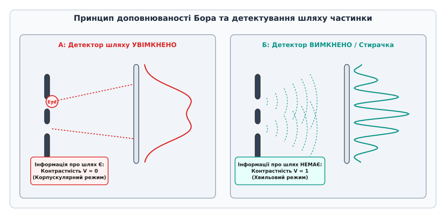

# Корпускулярно-хвильовий дуалізм

<preknowlist>
- [Одновимірне стаціонарне рівняння Шредінгера](book:physics/mechanics/stationary-schrodinger-equation) — квантові стани, хвильова функція та ймовірнісна інтерпретація.
- [Ідея перетворення Фур'є](book:math/real-analysis/fourier-idea) — розклад хвильового пакета на гармонічні складові та зв'язок часового й частотного просторів.
</preknowlist>

Якщо спрямувати слабкий потік електронів крізь екран із двома близькими щілинами так, щоб частинки вилітали з джерела попоштучно з інтервалом в одну секунду, кожен електрон досягає чутливої люмінесцентної пластини як строго локалізована точкова спалахуюча подія. Жоден люмінофорний піксель не реєструє «розмитої хвилі» або «половини електрона» — частинка передає весь свій заряд і кінетичну енергію в один атомарний вузол. Проте коли на екрані накопичуються тисячі таких попоштучних точкових спалахів, їхній просторовий розподіл не утворює двох суцільних смуг навпроти щілин, як очікувалося б для класичних кульок. Натомість точки поглинання групуються у чіткі смуги максимуми та мінімуми інтерференційної картини.


*Двохщілинний експеримент для попоштучних електронів: кожна частинка реєструється як точковий спалах, проте статистична сукупність багатьох влучань формує хвильову інтерференційну картину.*

Цей дослід демонструє корпускулярно-хвильовий дуалізм — фундаментальну властивість квантових об'єктів поєднувати неперервні хвильові риси поширення з дискретними корпускулярними рисами взаємодії та вимірювання.

## 1. Конфлікт класичних концепцій та корпускулярне світло

Класична фізика XIX століття будувалася на жорсткій дуалістичній класифікації матерії. Усі фізичні об'єкти поділялися на дві взаємно виключні категорії:
1. **Речовина (частинки/корпускули)** — дискретні локалізовані об'єкти з відомою масою `m`, траєкторією `r(t)` та імпульсом `p = m v`. Дві частинки не можуть одночасно займати одну й ту саму точку простору, а їхня кінетична енергія є аддитивною величиною.
2. **Поле (хвилі)** — неперервні просторово-заперечні коливання середовища чи електромагнітного поля, описувані амплітудою, фазою `φ` та хвильовим вектором `k`. Хвилі вільно проникають одна крізь одну, утворюючи явища суперпозиції, інтерференції та дифракції.

Перший пролом у цій розділеній системі утворився під час дослідження випромінювання чорного тіла та зовнішнього фотоефекту. Класична хвильова теорія Максвелла передбачала, що енергія електромагнітної хвилі розподілена неперервно по всьому хвильовому фронту. Спектральна густина випромінювання чорного тіла за законами Релея — Джинса дорівнювала `u(ν) = (8 π ν² / c³) k_B T`, що при зростанні частоти приводило до нескінченної енергії випромінювання в ультрафіолетовій області (ультрафіолетова катастрофа).

14 грудня 1900 року Макс Планк усунув цю суперечність, припустивши, що електромагнітні осцилятори випромінюють енергію дискретними порціями — квантами `E = h ν`. Отриманий розподіл Планка тотожно описав експеримент у всьому діапазоні спектра:

```
u(ν) = (8 · π · h · ν³ / c³) / ( exp( (h · ν) / (k_B · T) ) - 1 )
```

У 1905 році Альберт Ейнштейн поширив ідею квантування на саме світло під час його поширення. Для вибивання електрона з металу під дією слабкого світлового потоку за класичною хвильовою теорією знадобилися б години накопичення енергії. Крім того, кінетична енергія вибитих електронів мала б зростати пропорційно інтенсивності (квадрату амплітуди електричного поля `E²`), а не частоті світла `ν`.

Експерименти виявили зворотне: виліт електронів відбувається без найменшої часової затримки (менше ніж за `10⁻⁹ s`), а кінетична енергія вибитих фотоелектронів підпорядковується лінійному виразу:

```
E_kin = h · ν - A_out
```

де `h ≈ 6.626 × 10⁻³⁴ J·s` — стала Планка, а `A_out` — робота виходу електрона з кристалічної ґратки. Для лужних металів (Натрію, Калію, Цезію) робота виходу становить від `1.9 eV` до `2.3 eV`, що визначає червону межу фотоефекту у видимій області спектра `ν_min = A_out / h`. Ейнштейн пояснив це явище, припустивши, що світло поширюється дискретними квантами (порціями енергії), пізніше названими фотонами (від грецького *phōs* — світло).

Кожен фотон має квант енергії `E = h ν` та квант імпульсу `p = h / λ`. У процесах фотоефекту фотон поглинається як цілісна дискретна частинка, віддаючи всю свою енергію одному електрону провідності.

При ефекті Комптона (розсіюванні рентгенівських променів на вільних електронах) фотон поводиться як повноцінна релятивістська частинка. Записуючи релятивістське збереження 4-імпульсу `P_photon + P_electron = P'_photon + P'_electron`, отримуємо вираз для зміні довжини хвилі розсіяного фотона:

```
Δλ = λ' - λ = (h / (m_e · c)) · (1 - cos(θ))      [формула Комптона]
```

де `λ_C = h / (m_e · c) ≈ 2.426 × 10⁻¹² m` — комптонівська довжина хвилі електрона, а `θ` — кут розсіяння фотона. Дослід Комптона остаточно підтвердив, що електромагнітна хвиля має імпульс точкової частинки.

Детальний процес історичного відкриття світлових квантів та створення експериментальної бази дуалізму викладено у вставці [📜 Історія розвитку корпускулярно-хвильового дуалізму](book:physics/quantum-mechanics/wave-particle-duality/hist-duality.md).

## 2. Гіпотеза де Бройля та хвилі речовини

У 1924 році французький фізик Луї де Бройль (Louis de Broglie) припустив існування глибокої симетрії у природі. Якщо електромагнітні хвилі мають корпускулярні властивості, то матеріальні частинки (електрони, протони, атоми) мусять мати хвильові властивості.

Для довільної частинки з імпульсом `p` де Бройль зіставив хвильовий процес з довжиною хвилі:

```
λ_dB = h / p
```

Для нерелятивістської частинки з масою `m` та кінетичною енергією `E_k`:

```
λ_dB = h / √(2 · m · E_k)
```

У високоенергетичних релятивістських системах (наприклад, у просвічувальних електронних мікроскопах при напрузі `V > 100 kV`) необхідно враховувати лоренц-фактор `γ = 1 + e V / (m_e c²)`. Повна релятивістська довжина хвилі де Бройля описується виразом:

```
λ_dB = (h · c) / √( E_k · (E_k + 2 · m_e · c²) )
```

При прискорювальній напрузі `V = 300 kV` релятивістська довжина хвилі електрона становить `λ_dB ≈ 0.00197 nm`, що на 12% менше за нерелятивістське значення `0.00224 nm` і забезпечує атомарне розділення у TEM.


*Дослід Девіссона — Джермера (1927): пучок електронів з енергією 54 eV розсіюється на монокристалі Нікелю, утворюючи дифракційний максимум Бреґґа під кутом 50°.*

У 1927 році Клінтон Девіссон та Лестер Джермер експериментально підтвердили гіпотезу де Бройля, виявивши дифракційні максимуми при розсіюванні електронів на монокристалі Нікелю. Кут максимуму строго відповідав умові Бреґґа — Вульфа для атомних площин з Міллеровськими індексами `(111)` та міжплощинною відстанню `d = 0.091 nm`:

```
2 · d · sin(θ) = n · λ_dB
```

Того ж року Джордж Паджет Томсон спостерігав дифракційні кільця при проходженні швидких електронів (`E = 10–50 keV`) крізь тонку металеву фольгу Золота. Радіус концентричних кілець на фотопластинці підпорядковувався формулі `R = L · λ_dB / d_hkl` (де `L` — відстань до фотопластинки), що тотожно збігалося з рентгенограмами Дебая — Шеррера.

У 1930 році Отто Штерн та Іммануель Естерман поширили хвильову концепцію на цілі атоми Гелію та молекули Водню `H₂`, що дифрагували на поверхні кристала фториду літію (LiF), довівши, що дебройлівські хвилі є загальною властивістю всієї матерії.

Фізична сутність хвилі де Бройля полягає у фазовому узгодженні частинки з її внутрішнім квантовим станом. Для зв'язаного електрона в атомі Водню умова стаціонарності орбіти Бора строго збігається з умовою укладання цілого числа довжин хвиль де Бройля на довжині колової орбіти:

```
2 · π · r_n = n · λ_dB = n · (h / (m · v_n))
```

Звідси негайно випливає правило квантування орбітального моменту імпульсу Зоммерфельда — Бора:

```
L_n = m · v_n · r_n = n · (h / 2π) = n · ℏ
```

Таким чином, постулати Бора про стаціонарні атомні орбіти виявилися природним математичним наслідком утворення стоячих хвиль де Бройля навколо атомного ядра.

## 3. Математична формалізація: хвильові пакети та дисперсія

Монохроматична плоска хвиля де Бройля `ψ(x, t) = A exp(i (k x - ω t))` описує стан частинки зі строго визначеним хвильовим вектором `k = p / ℏ` та частотою `ω = E / ℏ`. Оскільки густина ймовірності `|ψ(x, t)|² = |A|²` є однаковою в усіх точках простору від `-∞` до `+∞`, монохроматична хвиля описує нелокалізовану частинку з абсолютно невизначеною координатою (`Δx → ∞`).

Щоб описувати реальну частинку, локалізовану у скінченній області простору, будують хвильовий пакет — суперпозицію багатьох плоско-гармонічних хвиль із різними хвильовими числами:

```
ψ(x, t) = (1 / √(2π)) · ∫₋∞⁺∞ ϕ(k) · exp(i · (k · x - ω(k) · t)) dk
```

Амплітудна огинаюча такого пакета поширюється зі швидкістю, яка відрізняється від фазової швидкості окремих гармонічних хвиль.


*Структура хвильового пакета: амплітудна огинаюча рухається з груповою швидкістю v_g, яка відповідає класичній швидкості частинки v, тоді як фазові фронти рухаються зі швидкістю v_p.*

Розрізняють два типи швидкостей хвильового пакета:
1. **Фазова швидкість `v_p`** — швидкість переміщення точок постійної фази `k x - ω t = const` окремої монохроматичної хвилі:

```
v_p = ω / k
```

2. **Групова швидкість `v_g`** — швидкість переміщення огинаючої (центру маси квантового пакета):

```
v_g = dω / dk
```

Виведемо значення цих швидкостей для нерелятивістської вільної частинки з масою `m`. Оскільки кінетична енергія дорівнює `E = p² / (2m)`, зв'язок частоти та хвильового числа (дисперсійне співвідношення) має вигляд:

```
ω(k) = (ℏ · k²) / (2 · m)
```

Обчислимо похідні:

```
v_g = dω / dk = (ℏ · k) / m = p / m = v      [групова швидкість дорівнює класичній швидкості частинки]
```

```
v_p = ω / k = (ℏ · k) / (2 · m) = p / (2 · m) = v / 2    [фазова швидкість удвічі менша за класичну швидкість]
```

Звідси випливає, що центроїд хвильової функції частинки переміщується у просторі зі швидкістю класичного руху `v_g = v`.

Для релятивістської частинки з масою спокою `m₀` дисперсія приймає вигляд `E = √(c² p² + m₀² c⁴) = ℏ ω`. Обчислення похідних дає:

```
v_g = dE / dp = (c² · p) / E = v < c
```

```
v_p = E / p = c² / v > c
```

Фазова швидкість релятивістської хвилі де Бройля перевищує швидкість світла у вакуумі `c`, проте це не порушує СТО, оскільки фазові фронти не переносять інформацію чи енергію — енергія та сигнал транспортуються виключно з груповою швидкістю `v_g = v < c`.

У квазікласичному наближенні ВКБ (Вентцеля — Крамерса — Бріллюена) хвильова функція частинки в повільно змінюваному потенціальному полі `V(x)` описується амплітудою та фазовим інтегралом дії:

```
ψ(x) = (C / √(p(x))) · exp( (i / ℏ) · ∫ x p(x') dx' )
```

де `p(x) = √(2 m (E - V(x)))` — локальний класичний імпульс частинки.

Для повного фазового опису квантових станів у фазовому просторі координата-імпульс `(x, p)` використовується квазіймовірнісна функція Вігнера:

```
W(x, p) = (1 / (π · ℏ)) · ∫₋∞⁺∞ ψ*(x + y) · ψ(x - y) · exp( (2 · i · p · y) / ℏ ) dy
```

Присутність від'ємних областей у функції Вігнера `W(x, p) < 0` є строгим математичним критерієм чисто некласичного квантового стану (інтерференції хвиль де Бройля).

Через наявність залежності фазової швидкості від хвильового числа (`d²ω / dk² ≠ 0`) відбувається дисперсійне розпливання хвильового пакета. Просторова ширина Ґаусового пакета `σ(t)` збільшується з часом за законом:

```
σ(t) = σ₀ · √( 1 + ( (ℏ · t) / (2 · m · σ₀²) )² )
```

Зв'язок між просторовою шириною пакета `Δx` та його спектральною шириною по хвильових числах `Δk` визначається математичною властивістю перетворення Фур'є. Для довільного хвильового пакета добуток стандартних відхилень задовольняє нерівність:

```
Δx · Δk ≥ 1 / 2
```

Помноживши цю нерівність на зведену сталу Планка `ℏ` та врахувавши співвідношення де Бройля `p = ℏ k`, отримуємо співвідношення невизначеностей Гейзенберга:

```
Δx · Δp_x ≥ ℏ / 2
```

Строгий математичний вивід часового розпливання та спектральний доказ невизначеностей викладено у вставці [🧮 Математика хвильових пакетів та співвідношення невизначеностей](book:physics/quantum-mechanics/wave-particle-duality/math-wavepacket.md).

## 4. Інтерпретація Борна та Принцип доповнюваності

Суперечність між корпускулярним та хвильовим описом була вирішена у 1926 році Максом Борном (Max Born), який запропонував ймовірнісну інтерпретацію хвильової функції `ψ(r, t)`.

Хвильова функція сама по собі не є фізичною хвилею густини чи заряду у тривимірному просторі. Квадрат модуля комплексної хвильової функції визначає густину ймовірності `dP` виявлення частинки в елементі об'єму `dV` біля точки `r` у момент часу `t`:

```
dP(r, t) = |ψ(r, t)|² · dV = ψ*(r, t) · ψ(r, t) · dV
```

Хвиля де Бройля є хвилею ймовірності. Поширення хвилі описується детермінованим лінійним рівнянням Шредінгера, проте результат взаємодії або вимірювання завжди має ймовірнісний корпускулярний характер.

Для математичного опису змішаних станів та процесів вимірювання використовується формалізм оператора щільності (матриці щільності):

```
ρ̂ = ∑_i p_i |ψ_i⟩⟨ψ_i|
```

де `p_i` — статистичні ваги різних квантових станів `|ψ_i⟩`. Діагональні елементи матриці щільності `ρ_kk` описують класичні населеності станів, тоді як недіагональні елементи `ρ_km` (когерентності) відповідають за хвильову інтерференцію між квантовими альтернативами.

Для пояснення того, як один і той самий об'єкт виявляє протилежні властивості, Нільс Бор (Niels Bohr) у 1927 році сформулював **Принцип доповнюваності** (Principle of Complementarity).


*Принцип доповнюваності Бора: при включенні детектора шляху (А) хвильова інтерференція руйнується, а частинка виявляє корпускулярну поведінку. Без детектора (Б) спостерігається хвильова інтерференція.*

Згідно з принципом доповнюваності:
1. Хвильова та корпускулярна картини опису квантового об'єкта не суперечать, а доповнюють одна одну. Повний опис квантового стану неможливий без урахування обох аспектів.
2. Корпускулярні та хвильові властивості виявляються взаємовиключно у різних експериментальних умовах. Прилад, призначений для вимірювання корпускулярних характеристик (наприклад, точної траєкторії чи шляху проходження крізь конкретну щілину), неминуче руйнує хвильову інтерференційну картину.

Математично взаємозв'язок між хвильовою контрастністю інтерференції `V` (Visibility) та корпускулярною визначеністю шляху `K` (Predictability / Which-Way information) описується нерівністю Ґрінберґера — Ясіна — Енґлерта:

```
V² + K² ≤ 1
```

Якщо прилад точно визначає, через яку саме щілину пройшов електрон (`K = 1`), контрастність інтерференційної картини повністю зникає (`V = 0`). Якщо ж інформація про шлях частинки принципово відсутня у Всесвіті (`K = 0`), виникає максимальна хвильова інтерференція (`V = 1`).

Експерименти типу «відкладеного вибору» (Wheeler's delayed-choice experiment) та квантової стирачки (quantum eraser), виконані у 1980–2000-х роках з фотонами та атомами, підтвердили: квантова система не «обирає» заздалегідь бути хвилею чи частинкою. Характер спостережуваних явищ визначається тим, яка саме інформація вилучається спостерігачем чи навколишнім середовищем у процесі вимірювання.

Фізичний механізм руйнування інтерференції при вимірюванні шляху частинки полягає у зміні квантової фази. Навіть найслабша взаємодія з фотоном детектора передає електрону невизначений за величиною імпульс `Δp ≈ h / d` (де `d` — відстань між щілинами). Цей вимірювальний імпульс повністю зсуває фазу хвилі на величину `Δφ ≈ π`, перетворюючи інтерференційні максимуми на мінімуми й розмиваючи картину до суцільної плями.

Для практичного моделювання цих ефектів створено чисельні алгоритми, які описані у вставці [⚙️ Симуляція двохщілинного експерименту та дисперсії хвильового пакета](book:physics/quantum-mechanics/wave-particle-duality/proj-duality-sim.md).

## 5. Класична межа, декогеренція та теорема Еренфеста

Виникає фундаментальне питання: чому макроскопічни об'єкти (наприклад, футбольний м'яч, піщинка або пилинка) не виявляють хвильових властивостей і не дифрагують при проходженні крізь дверний отвір?

Перехід від квантових хвиль де Бройля до класичної механіки Ньютона описується теоремою Еренфеста (Paul Ehrenfest). Для операторів координати `x̂` та імпульсу `p̂` середні значення за квантовим станом задовольняють класичні диференціальні рівняння руху:

```
d/dt <x> = (1 / m) · <p_x>
```

```
d/dt <p_x> = - < ∇V(x) >
```

Коли просторова ширина хвильового пакета `Δx` є набагато меншою за характерний масштаб зміни потенціалу `∇V(x)` (що строго виконується для будь-яких макроскопічних тіл), середня сила `<∇V(x)>` з високою точністю дорівнює силі у центрі пакета `∇V(<x>)`, і середня квантова траєкторія тотожно збігається з класичною траєкторією Ньютона.

Другою фундаментальною причиною відсутності хвильових явищ у макросвіті є надзвичайно мала довжина хвилі де Бройля. Розглянемо макроскопічну частинку масою `m = 1 g = 10⁻³ kg`, яка рухається зі швидкістю `v = 1 m/s`. Обчислимо довжину хвилі де Бройля для такого тіла:

```
λ_dB = h / (m · v) = (6.626 × 10⁻³⁴) / (10⁻³ × 1) = 6.626 × 10⁻³¹ m
```

Отримане значення `6.6 × 10⁻³¹ m` на 16 порядків менше за планківську довжину (`1.6 × 10⁻³⁵ m`) і на 21 порядок менше за діаметр атомного ядра (`10⁻¹⁵ m`). Оскільки не існує фізичних апертур чи ґраток з періодом `10⁻³¹ m`, спостереження інтерференції для такого об'єкта є експериментально неможливим.

Третьою причиною є квантова декогеренція (від латинського *cohaerentia* — зчеплення). Квантова суперпозиція станів існує лише доти, доки хвильова функція об'єкта не заплутується з неконтрольованими ступенями вільності довкілля (тепловими фотонами, молекулами повітря, випромінюванням).

Математично еволюція матриці щільності макроскопічного об'єкта під дією середовища описується рівнянням Ліндблада. Недіагональні елементи матриці щільності `ρ(x, x')`, які відповідають за квантову когерентність та інтерференцію, згасають за експоненційним законом:

```
ρ(x, x', t) = ρ(x, x', 0) · exp(- Λ · (x - x')² · t)
```

де `Λ` — коефіцієнт декогеренції, який пропорційний масі об'єкта та температурі довкілля. Для макроскопічного об'єкта зіткнення з єдиним фотоном теплового фону або молекулою газу миттєво фіксує його просторове положення. Час декогеренції `t_dec` для пилинки розміром `10⁻⁶ m` у повітрі становить:

```
t_dec ≈ 10⁻²³ s
```

Настільки швидка декогеренція перетворює квантову суперпозицію станів на класичну ймовірнісну суму, знищуючи будь-яку хвильову інтерференцію за частки аттосекунди.

## 6. Практичні застосування дуалізму

Корпускулярно-хвильовий дуалізм перестала бути лише філософською загадкою квантової механіки — він лежить в основі ключових технологій XXI століття:

1. **Електронна мікроскопія (TEM / SEM)**. За оптичною межею роздільності Аббе мінімальна відстань між двома розрізнюваними точками дорівнює `d_min = λ / (2 NA)`. Для видимого світла (`λ ≈ 500 nm`) роздільна здатність світлового мікроскопа обмежена величиною `200 nm`. Електрони, прискорені напругою `V = 200 kV`, мають довжину хвилі де Бройля `λ_dB ≈ 0.0025 nm`. Це дає змогу просвічувальним електронним мікроскопам (TEM) досягати роздільності нижче `0.05 nm`, візуалізуючи окремі атоми у кристалічній ґратці.
2. **Нейтронографія**. Нейтрони з кінетичною енергією `E_k ≈ 0.025 eV` (теплові нейтрони при `T = 300 K`) мають довжину хвилі `λ_dB ≈ 0.18 nm`. Завдяки відсутності електричного заряду нейтрони глибоко проникають у речовину та дифрагують на атомних ядрах і магнітних моментах електронів, що робить нейтронну дифракцію головним інструментом дослідження магнітних структур та легких елементів (Водню) у матеріалознавстві.
3. **Атомна інтерферометрія**. Ультрахолодні атоми (наприклад, атоми Рубідію `⁸⁷Rb`, охолоджені до нанокельвінових температур у стані конденсату Бозе — Ейнштейна) мають довжину хвилі де Бройля порядку кількох мікрометрів. Атомні інтерферометри використовують розщеплення хвильових пакетів атомів світловими імпульсами лазерів, що дає змогу вимірювати прискорення вільного падіння `g` із відносною точністю `10⁻¹⁰`, створюючи надчутливі квантові гравіметри та оптичні годинники.

Розрахунковий апарат для обчислення параметрів частинок у цих приладах надається програмним інтерфейсом, описаним у вставці [📋 Інтерфейс розрахунку хвильових і корпускулярних параметрів квантових частинок](book:physics/quantum-mechanics/wave-particle-duality/api-interferometer.md).
