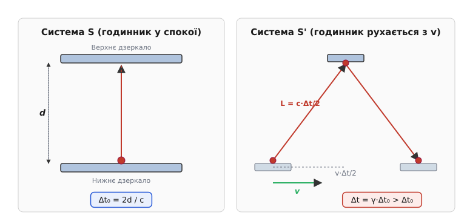
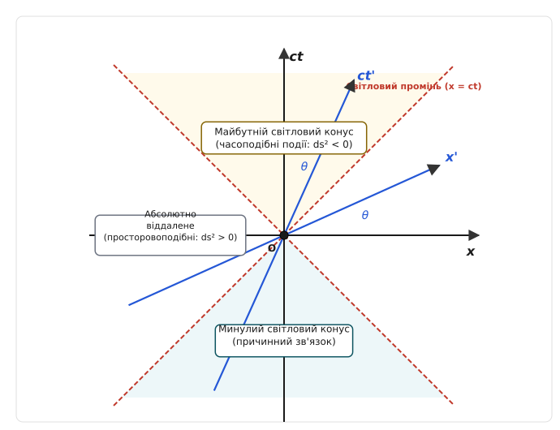

# Спеціальна теорія відносності

<preknowlist>
- [Принцип відносності Ґалілея](topic:physics/galilean-relativity) — збереження форми законів механіки при переході між інерціальними системами відліку.
- [Інерціальна система відліку](topic:physics/inertial-frame) — система, в якій вільне тіло рухається прямолінійно й рівномірно.
- [Другий закон Ньютона](topic:physics/newtons-second-law) — зв'язок сили, маси та прискорення в класичній механіці.
</preknowlist>

Коли наприкінці XIX століття фізики спробували застосувати класичний принцип відносності Ґалілея до рівнянь електродинаміки Максвелла, фундаментальна будівля класичної фізики зазнала нищівного розколу. Згідно з перетвореннями Ґалілея `x' = x - v·t` та `t' = t`, якщо у нерухомій лабораторії світловий промінь поширюється зі швидкістю `c ≈ 3·10⁸` м/с, то спостерігач, який рухається навздогін променю зі швидкістю `v`, повинен виміряти швидкість світла як `c' = c - v`. При прямому застосуванні перетворень Ґалілея до хвильового рівняння оператор Д'Аламбера ламає свою математичну форму:

```
∂²E / ∂x² - μ₀·ε₀·(∂²E / ∂t²) = 0                 [хвильове рівняння Максвелла у система S]
```

У рухомій системі `S'` за перетвореннями Ґалілея похідні змінюються як `∂ / ∂x = ∂ / ∂x'` та `∂ / ∂t = ∂ / ∂t' - v·(∂ / ∂x')`. Підстановка цих операторів у хвильове рівняння дає:

```
(1 - v² / c²)·(∂²E / ∂x'²) + (2·v / c²)·(∂²E / ∂x'∂t') - (1 / c²)·(∂²E / ∂t'²) = 0  [неінваріантна форма]
```

Утворення перехресної похідної `∂²E / ∂x'∂t'` означало, що хвильове рівняння Максвелла змінює свою математичну структуру в рухомій системі відліку! Це передбачало, що фазова швидкість електромагнітних хвиль `c = 1 / √(ε₀·μ₀)` є фундаментальною константою вакууму, яка діє лише в одній привілейованій система відліку («абсолютному ефірі»). Виникав непереборний парадокс: або рівняння Максвелла помилкові у рухомих системах, або класичні уявлення про абсолютний простір і час Ньютона є помилковими.

## 1. Постулати Айнштайна та кривава межа класичної фізики

Спроби врятувати гіпотезу непорушного ефіру за допомогою вимірювання «ефірного вітру» Землі зазнали краху у знаменитому експерименті Альберта Майкельсона та Едварда Морлі 1887 року. Світло долало однакові відстані вздовж і поперек орбітального руху Землі за абсолютно однаковий час, незалежно від пори року та повороту приладу. Докладний аналіз пошуків ефірного вітру, гіпотез Фіцджеральда і Лоренца та становлення нової фізики описано у вставці [📜 Історія відкриття СТВ та пошуків ефірного вітру](topic:physics/special-relativity/hist-ether-drift.md).

У 1905 році Альберт Айнштайн заново сформулював фундамент теоретичної фізики у своїй праці «До електродинаміки тіл, що рухаються». Відкинувши поняття ефіру як фізично беззмістовне, він поклав у основу спеціальної теорії відносності (*англ. Special Relativity*) два фундаментальні постулати:

1. **Принцип відносності (розширений):** Усі фізичні явища — як механічні, так і електромагнітні, оптичні, термодинамічні й ядерні — протікають абсолютно однаково в усіх інерціальних системах відліку. Жодним внутрішнім експериментом неможливо встановити, перебуває система у спокої чи рухається прямолінійно й рівномірно.
2. **Сталість швидкості світла:** Швидкість світла у вакуумі `c` є однаковою в усіх інерціальних системах відліку і не залежить від руху джерела випромінювання або спостерігача.

На перший погляд ці два постулати здаються логічно несумісними. Якщо ліхтар рухається назустріч спостерігачеві зі швидкістю `v`, то за класичною інтуїцією випромінене світло має рухатися зі швидкістю `c + v`. Проте другий постулат стверджує, що спостерігач все одно виміряє `c`. Усвідомлення цього факту вимагає радикальної відмови від ньютонівської концепції абсолютного часу, який нібито плине однаково у всьому Всесвіті.

## 2. Відносність одночасності та кінематичні ефекти

У класичній механіці передбачалося, що якщо дві події відбулися одночасно у двох різних точках простору, вони є одночасними для будь-якого спостерігача у Всесвіті. У спеціальній теорії відносності одночасність стає відносною концепцією.

### Фізичний механізм відносності одночасності

Уявимо довгий космічний корабель, що рухається зі швидкістю `v` повз орбітальну станцію. У центрі корабля встановлено спалах світла. Для спостерігача всередині корабля світловий імпульс поширюється у всі боки зі швидкістю `c` і досягає переднього та заднього відсіків абсолютно одночасно.

Проте для спостерігача на орбітальній станції задній відсік рухається назустріч світловому променю, а передній утікає від нього. Оскільки швидкість світла відносно станції також дорівнює `c`, світло досягне заднього відсіку раніше, ніж переднього. Дві події, які є одночасними у системі відліку корабля, виявляються послідовними у системі відліку станції. Відносність одночасності не є оптичною ілюзією чи затримкою сигналу — це фундаментальна властивість нашого простору-часу.

### Уповільнення часу

Прямим наслідком сталості швидкості світла є ефект релятивістського уповільнення часу (*англ. time dilation*). Розглянемо модель світлового годинника: два паралельні дзеркала розташовані на відстані `d` одне від одного. Між дзеркалами зациклено світловий фотон.


*Світловий годинник: траєкторія фотона у нерухомій системах S є вертикальною, а у рухомій S' — діагональною, що подовжує шлях і зумовлює уповільнення часу.*

У власній системі відліку `S`, де годинник нерухомий, фотон долає відстань від нижнього дзеркала до верхнього й назад за власний інтервал часу `Δt₀`:

```
Δt₀ = 2·d / c                                [власний час у система S]
```

Тепер розглянемо той самий годинник у системі `S'`, відносно якої він рухається зі швидкістю `v` перпендикулярно до лінії дзеркал. Для спостерігача у `S'` фотон рухається по діагоналі. За час `Δt / 2` годинник зміщується по горизонталі на відстань `v·(Δt / 2)`, а фотон долає по діагоналі шлях `L = c·(Δt / 2)`.

За теоремою Піфагора прямокутний трикутник переміщень дає:

```
(c·Δt / 2)² = d² + (v·Δt / 2)²                [теорема Піфагора для світлового шляху]
```

Виразимо `d² = (c·Δt₀ / 2)²` і підставимо у співвідношення:

```
c²·Δt² / 4 = c²·Δt₀² / 4 + v²·Δt² / 4
c²·Δt² - v²·Δt² = c²·Δt₀²                    [перенесення членів із Δt]
Δt²·(1 - v² / c²) = Δt₀²
Δt = Δt₀ / √(1 - v² / c²)                    [формула уповільнення часу]
```

Ввівши безрозмірний множник Лоренца `γ` (*англ. Lorentz factor*):

```
γ = 1 / √(1 - v² / c²)                        [фактор Лоренца]
```

отримуємо фундаментальну формулу уповільнення часу: `Δt = γ·Δt₀`. Оскільки `v < c`, фактор Лоренца `γ > 1`. Це означає, що рухомий годинник плине повільніше з точки зору нерухомого спостерігача.

Ефект уповільнення часу є фізичною реальністю. Класичним підтвердженням є розпад атмосферних мюонів: елементарні частинки мюони утворюються у верхніх шарах атмосфери на висоті `15-20` км під дією космічних променів. Власний час життя мюона у спокої становить лише `τ₀ ≈ 2.2` мікросекунди. Навіть зі швидкістю світла за цей час мюон пролетів би не більше `660` метрів і не мав жодного шансу досягти поверхні Землі. Проте завдяки швидкості `v ≈ 0.998·c` фактор Лоренца дорівнює `γ ≈ 16`, і час життя мюона у системі відліку Землі зростає до `35` мікросекунд, що дозволяє їм масово досягати детекторів на рівні моря.

### Парадокс близнюків та його розв'язання

Класичний мисленнєвий експеримент «парадокс близнюків» розглядає двох людей: один залишається на Землі, а інший вирушає у космічну подорож до віддаленої зірки зі швидкістю близькою до `c`, після чого повертається назад. З точки зору близнюка на Землі, годинник мандрівника йшов повільніше, тому мандрівник має повернутися молодшим. Проте, зважаючи на принцип відносності, чи не може мандрівник вважати нерухомим себе, а Землю — рухомою, і зробити висновок, що молодшим має залишитися близнюк на Землі?

Парадокс розв'язується тим, що системи відліку близнюків **не є симетричними**:
- Близнюк на Землі перебуває в інерціальній системі відліку протягом усього часу.
- Близнюк-мандрівник змушений прискорюватися під час старту, розвертатися біля зірки та гальмувати при посадці на Землю. Його система відліку є неінерціальною.

Під час фази розвороту мандрівник змінює свою інерціальну систему відліку, що призводить до різкого стрибка лінії одночасності простору-часу. Загальний власний час, виміряний годинником мандрівника, є довжиною його світової лінії у просторі Мінковського і підраховується інтегралом:

```
τ = ∫ √(1 - v²(t) / c²) dt < t               [інтеграл власного часу]
```

Мандрівник дійсно повертається фізично молодшим за свого брата, що було багаторазово підтверджено експериментами з високоточними атомними годинниками на літаках та космічних апаратах (експеримент Гафеле — Кітінга 1971 року).

### Скорочення довжини

Співвідношення між просторовими масштабами у різних системах відліку тісно пов'язане з уповільненням часу. Розглянемо лінійку довжиною `L₀`, яка перебуває у спокої в системі `S'` (її власна довжина, *англ. proper length*). Якщо система `S'` рухається зі швидкістю `v` відносно системи `S`, то для вимірювання довжини лінійки у системі `S` необхідно зафіксувати координати її переднього та заднього кінців **одночасно**.

Використовуючи зв'язок проходження відстані та часу, отримуємо формулу Лоренцового скорочення довжини (*англ. length contraction*):

```
L = L₀ / γ = L₀·√(1 - v² / c²)                [формула скорочення довжини]
```

Тіло, що рухається зі швидкістю `v`, скорочується у напрямку свого руху. Важливо підкреслити:
- Скорочення відбувається **лише уздовж лінії відносного руху**. Поперечні розміри тіла (`y` та `z`) залишаються незмінними: `L_y = L_y0`, `L_z = L_z0`.
- Скорочення є взаємним: спостерігач у `S` бачить скороченою лінійку системи `S'`, а спостерігач у `S'` бачить точно так само скороченою лінійку системи `S`.

Оптичний вигляд релятивістських об'єктів при візуальному спостереженні (ефект Пенроуза — Террелла) відрізняється від геометричного скорочення: через різний час проходження світла від різних точок поверхні тіла здається не просто стиснутим, а повернутим у просторі.

## 3. Перетворення Лоренца та релятивістська кінематика

Замість геометричних перетворень Ґалілея (`x' = x - v·t`, `t' = t`), які залишали час абсолютним, перехід між двома інерціальними системами відліку у СТВ описується перетвореннями Лоренца.

Нехай система `S'` рухається відносно `S` зі швидкістю `v` вздовж осі `x`. Тоді координати й час довільної події пов'язані співвідношеннями:

```
x' = γ·(x - v·t)
y' = y
z' = z
t' = γ·(t - v·x / c²)                         [прямі перетворення Лоренца]
```

Зворотні перетворення отримуються заміною `v` на `-v` та штрихованих змінних на нештриховані:

```
x = γ·(x' + v·t')
y = y'
z = z'
t = γ·(t' + v·x' / c²)                        [зворотні перетворення Лоренца]
```

Детальний алгебраїчний вивід перетворень Лоренца з постулатів Айнштайна, їхню гіперболічну параметризацію через швидкоплинність та аналіз групової структури наведено у вставці [🧮 Математичне виведення перетворень Лоренца та інтервал Мінковського](topic:physics/special-relativity/math-lorentz-derivation.md).

### Релятивістське додавання швидкостей

Розглянемо частинку, яка рухається у системі `S'` зі швидкістю `u' = (u_x', u_y', u_z')`. Якою буде її швидкість `u` у системі `S`?

Візьмемо диференціали з рівнянь зворотного перетворення Лоренца:

```
dx = γ·(dx' + v·dt')
dy = dy'
dz = dz'
dt = γ·(dt' + v·dx' / c²)
```

Поділивши `dx`, `dy`, `dz` на `dt` та скоротивши множники `γ`, отримуємо повні тривимірні формули релятивістського додавання швидкостей:

```
u_x = (u_x' + v) / (1 + u_x'·v / c²)          [поздожня компонента швидкості]
u_y = u_y' / (γ·(1 + u_x'·v / c²))            [поперечна компонента швидкості Y]
u_z = u_z' / (γ·(1 + u_x'·v / c²))            [поперечна компонента швидкості Z]
```

Перевіримо крайній випадок: якщо частинкою є фотон, що рухається зі швидкістю світла `u_x' = c` у системі `S'`, його швидкість у системі `S` дорівнює:

```
u_x
= (c + v) / (1 + c·v / c²)
= (c + v) / (1 + v / c)
= c·(c + v) / (c + v)
= c                                          [інваріантність швидкості світла]
```

Ні за яких умов додавання двох швидкостей, менших за `c`, не може дати результат, що перевищує `c`. Швидкість світла у вакуумі слугує недосяжною верхньою межею для передачі інформації та руху речовини.

### Релятивістський ефект Доплера та аберація світла

При відносному русі джерела випромінювання та спостерігача частота світлової хвилі змінюється. Для джерела, що рухається під кутом `θ` до променя зору у системі спостерігача, релятивістська формула ефекту Доплера має вигляд:

```
f = f₀ / (γ·(1 - (v / c)·cos(θ)))             [релятивістський ефект Доплера]
```

У цій формулі наявні два різні фізичні ефекти:
1. Класичний ефект Доплера, зумовлений зміною відстані між джерелом і спостерігачем.
2. **Поперечний ефект Доплера:** Навіть при русі перпендикулярно до променя зору (`θ = 90°`, `cos(θ) = 0`) спостерігається зміщення частоти `f = f₀ / γ = f₀·√(1 - v²/c²)`. Поперечний ефект Доплера є суто релятивістським наслідком уповільнення часу в рухомому джерелі.

Аберація світла описується зміною кута напрямку на джерело `θ` при переході між системами відліку:

```
cos(θ') = (cos(θ) - v / c) / (1 - (v / c)·cos(θ))  [релятивістська аберація світла]
```

При наближенні швидкості `v` до `c` світло від усіх джерел фокусується у вузький конус у напрямку руху — явище прожектора (*англ. relativistic beaming*).

## 4. Простір-час Мінковського та інваріантний інтервал

У 1908 році німецький математик Герман Мінковський запропонував глибоке геометричне тлумачення спеціальної теорії відносності. Він об'єднав тривимірний евклідів простір та час у єдиний чотиривимірний простір-час (*англ. spacetime*).

У просторі Мінковського подія описується чотирма координатами `x^μ = (c·t, x, y, z)`, де `μ = 0, 1, 2, 3`. Відстань між двома подіями задається не звичайним евклідовим радіусом, а просторово-часовим інтервалом `Δs`:

```
(Δs)² = -c²·(Δt)² + (Δx)² + (Δy)² + (Δz)²     [інваріантний інтервал Мінковського]
```

Квадрат інтервалу `(Δs)²` має унікальну властивість: він є **лоренц-інваріантом** — його числове значення однакова в усіх інерціальних системах відліку (`(Δs')² = (Δs)²`).

Залежно від знака `(Δs)²`, інтервали між подіями поділяються на три види:

1. **Часоподібний інтервал (`(Δs)² < 0`):** Часовий інтервал переважає просторову відстань (`c·|Δt| > Δr`). Існує система відліку, у якій обидві події відбуваються в одній і тій самій точці простору. Події можуть бути пов'язані причинно-наслідковим зв'язком.
2. **Просторовоподібний інтервал (`(Δs)² > 0`):** Просторова відстань переважає часовий інтервал (`Δr > c·|Δt|`). Існує система відліку, у якій обидві події відбуваються одночасно. Жодний сигнал не може з'єднати ці події, тому вони є причинно незалежними.
3. **Світлоподібний інтервал (`(Δs)² = 0`):** Події з'єднуються світловим імпульсом (`Δr = c·|Δt|`).


*Діаграма Мінковського: осі рухомої системи відліку t' та x' нахилені під кутом θ = arctg(v/c) до осі t та x, а світловий конус слугує інваріантною межею.*

Геометрія простору Мінковського визначає причинну структуру Всесвіту за допомогою **світлового конуса** (*англ. light cone*). Поверхня світлового конуса `(Δs)² = 0` ділить простір-час на майбутнє, минуле та абсолютно віддалені області, куди інформація від даної події не може потрапити принципово.

## 5. Релятивістська динаміка: імпульс, енергія та E = mc²

Класичні визначення імпульсу `p = m·v` та кінетичної енергії `E_k = m·v² / 2` виявляються несумісними з перетвореннями Лоренца та законом збереження імпульсу у замкнених системах.

Щоб зберегти закони збереження в усіх інерціальних системах відліку, імпульс частинки виражають через власний час `τ`:

```
p = m·(dx / dτ) = m·γ·v                       [релятивістський імпульс]
```

де `m` — інваріантна маса спокою частинки (*англ. rest mass*). При наближенні швидкості `v` до швидкості світла `c` фактор Лоренца `γ → ∞`, тому релятивістський імпульс прямує до нескінченності. Це пояснює, чому жодне масивне тіло неможливо прискорити до швидкості світла: для цього знадобилася б нескінченна робота зовнішніх сил.

Повна релятивістська енергія частинки `E` визначається як часова компонента чотири-імпульсу:

```
E = γ·m·c²                                    [повна релятивістська енергія]
```

Для частинки у спокої (`v = 0`, `γ = 1`) ця формула дає найвідоміше співвідношення фізики — енергію спокою (*англ. rest energy*):

```
E₀ = m·c²                                     [енергія спокою Айнштайна]
```

Маса спокою є концентрованою формою енергії. Наприклад, при анігіляції електрон-позитронної пари маса повністю перетворюється на енергію двох гамма-фотонів. При ядерному розпаді в атомних реакторах дефект маси ядра `Δm` вивільняє енергію `ΔE = Δm·c²`.

### Виведення E = mc² через випромінювання світла

Айнштайн вивів еквівалентність маси й енергії у вересні 1905 року через мисленнєвий експеримент: нехай тіло перебуває у спокої і випромінює два однакові кванти світла з енергією `L / 2` у протилежних напрямках.

За законом збереження енергії у початковій системі відліку енергія тіла зменшується на `L`: `E_initial = E_final + L`.

Тепер розглянемо цей процес у системі відліку, що рухається зі швидкістю `v` відносно тіла. Через релятивістський ефект Доплера енергія фотона, випроміненого в напрямку руху, дорівнює `(L / 2)·γ·(1 + v / c)`, а у протилежному напрямку — `(L / 2)·γ·(1 - v / c)`.

Сумарна енергія двох випромінених фотонів у рухомій системі становить:

```
E_radiation = (L / 2)·γ·(1 + v / c) + (L / 2)·γ·(1 - v / c) = L·γ  [енергія фотонів у S']
```

Для малих швидкостей `γ ≈ 1 + (1/2)·v² / c²`, тому зміна кінетичної енергії тіла становить:

```
K_initial - K_final = L·(γ - 1) ≈ (1/2)·(L / c²)·v²  [зміна кінетичної енергії]
```

Оскільки кінетична енергія класично дорівнює `(1/2)·m·v²`, зменшення кінетичної енергії на `(1/2)·(L / c²)·v²` означає, що маса тіла зменшилася на величину `Δm = L / c²`. Отже, випромінювання енергії `L` завжди супроводжується втратою маси `Δm = L / c²`, що підтверджує співвідношення `E = m·c²`.

Розклавши повну енергію в степеневий ряд за малими швидкостями `v << c`, отримуємо зв'язок із класичною механікою:

```
E
= m·c² / √(1 - v² / c²)
= m·c²·(1 + (1/2)·v² / c² + (3/8)·v⁴ / c⁴ + ...)
= m·c² + (1/2)·m·v² + ...                    [розклад енергії при малих швидкостях]
```

Перший член — це енергія спокою `m·c²`, а другий — класична ньютонівська кінетична енергія `m·v² / 2`.

Загальний інваріантний зв'язок між енергією, імпульсом та масою частинки має вигляд:

```
E² - p²·c² = m²·c⁴                           [релятивістське співвідношення енергії й імпульсу]
```

Для безмасових частинок (наприклад, фотонів, у яких `m = 0`) отримане співвідношення спрощується до `E = p·c`. Фотон не має маси спокою, але має імпульс `p = E / c` і завжди рухається зі швидкістю світла `c`.

Для обчислення кінематики релятивістських частинок та симуляції міжзоряного перельоту зі сталим прискоренням створено обчислювальний інструмент у вставці [⚙️ Симуляція релятивістського перельоту](topic:physics/special-relativity/proj-relativistic-flight.md).

## 6. Зв'язок релятивізму та електродинаміки

Одним із найвражаючих здобутків СТВ є доведення того, що магнітне поле не є самостійною первинною сутністю, а виникає як природний релятивістський ефект електричного поля при переході у рухому систему відліку.

Розглянемо довгий прямий провідник зі струмом. У провіднику позитивні іони кристалічної ґратки нерухомі, а електрони рухаються зі швидкістю дрейфу `v`. Густина позитивного й негативного зарядів однакова, тому провідник є електрично нейтральним у своїй системі відліку `S`, і електричне поле ззовні дорівнює нулю (`E = 0`).

Тепер розглянемо пробний заряд `q`, який рухається паралельно провіднику зі швидкістю `v`. Перейдемо у систему відліку `S'`, прив'язану до цього заряду:
- У системі `S'` електрони провідника перебувають у спокої, тому відстань між ними збільшується у `γ` разів через відсутність Лоренцового скорочення.
- Позитивні іони, навпаки, рухаються у зворотному напрямку зі швидкістю `-v`, тому відстань між ними скорочується в `γ` разів через Лоренцове скорочення довжини!

У результаті скорочення довжини лінійна густина позитивного заряду стає більшою за густину негативного заряду. Провідник у системі `S'` отримує ненульовий позитивний електричний заряд і створює радіальне електростатичне поле `E'`. Заряд `q` відчуває електростатичне відштовхування!

При поверненні у лабораторну систему `S` це кулонівське відштовхування перетворюється на магнітну силу Лоренца `F = q·[v × B]`. Магнітне поле — це релятивістський ефект електричного поля, зумовлений скінченністю швидкості поширення взаємодії `c`.

Тензор електромагнітного поля `F^(μν) = ∂^μ A^ν - ∂^ν A^μ` об'єднує електричне `E` та магнітне `B` поля у єдиний лоренц-коваріантний об'єкт 2-го рангу, перетворення якого при бусті Лоренца мають вигляд:

```
E_x' = E_x
E_y' = γ·(E_y - v·B_z)
E_z' = γ·(E_z + v·B_y)                       [перетворення компоненти електричного поля]

B_x' = B_x
B_y' = γ·(B_y + (v / c²)·E_z)
B_z' = γ·(B_z - (v / c²)·E_y)                 [перетворення компоненти магнітного поля]
```

Скалярні інваріанти електромагнітного поля:

```
I₁ = B² - E² / c²                             [перший інваріант поля]
I₂ = (E · B)                                  [другий інваріант поля]
```

Це доводить, що розподіл електромагнітної взаємодії на електричну та магнітну складові залежить від вибору системи відліку спостерігача.

> 🔧 **Навіщо це.**
> Спеціальна теорія відносності — це не віддалена теоретична абстракція, а щоденний інженерний стандарт у сучасних високих технологіях:
> - **Супутникова навігація (GPS / Galileo / BeiDou):** Годинники на орбітальних супутниках рухаються зі швидкістю близько `14 000` км/год (`v ≈ 3.9` км/с). Через ефект СТВ супутникові атомні годинники щодня відстають від земних на `7` мікросекунд (що разом із гравітаційним ефектом ЗТВ у `45` мікросекунд дає підсумковий зсув у `38` мікросекунд на добу). Без релятивістської корекції похибка позиціонування GPS накопичувалася б зі швидкістю `11` кілометрів на добу.
> - **Прискорювачі частинок (LHC, NICA, DESY):** У Великому адронному колайдері (LHC) протони прискорюються до енергії `6.8` ТеВ, де їхній фактор Лоренца сягає `γ ≈ 7250`. Магнітні поля поворотних дипольних надпровідних магнітів розраховуються суворо за релятивістським імпульсом `p = γ·m·v`, оскільки класичний імпульс дав би похибку у тисячі разів і промені частинок миттєво б зруйнували стінки вакуумної камери.
> - **Ядерна енергетика та астрофізика:** Виділення енергії в термоядерних реакціях Сонця та на атомних електростанціях базується безпосередньо на дефекті маси `ΔE = Δm·c²`.
> - **Променева терапія у медицині:** Медичні лінійні прискорювачі електронів для лікування онкологічних захворювань формують пучки з енергією `6-20` МеВ, де електрони рухаються зі швидкістю `v > 0.999·c`, що вимагає використання суворо релятивістських розрахунків фокусування та дозиметрії.

Підсумовуючи, спеціальна теорія відносності наново сформулювала поняття простору, часу, маси й енергії. Вона довела, що простір і час не є пасивною ареною для фізичних подій, а утворюють динамічний чотиривимірний континуум Мінковського, інваріантна геометрія якого визначає причинні межі швидкісного руху та фундаментальну єдність матерії й енергії у нашому Всесвіті.
