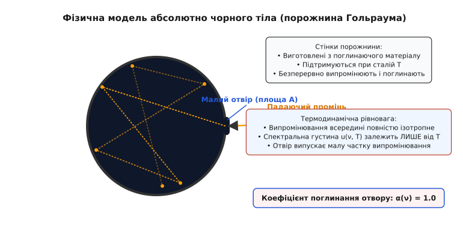
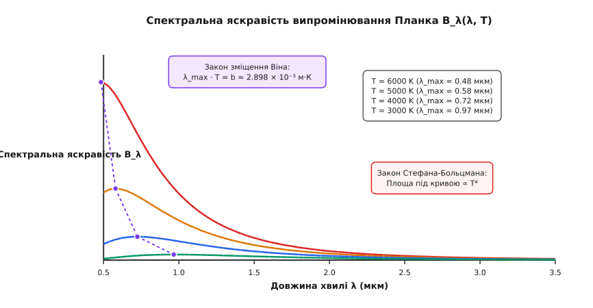
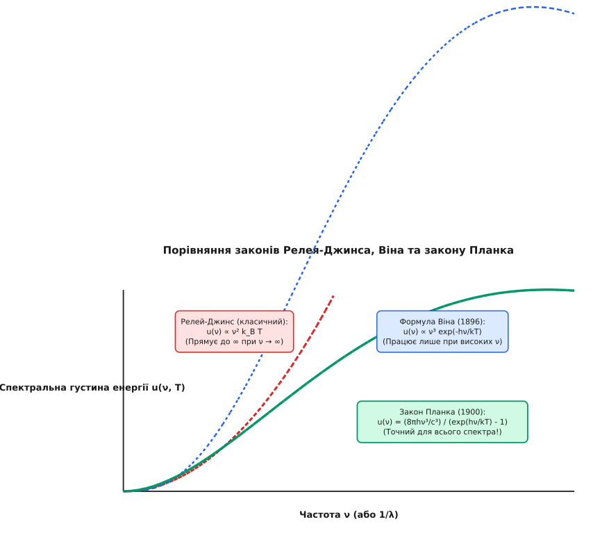
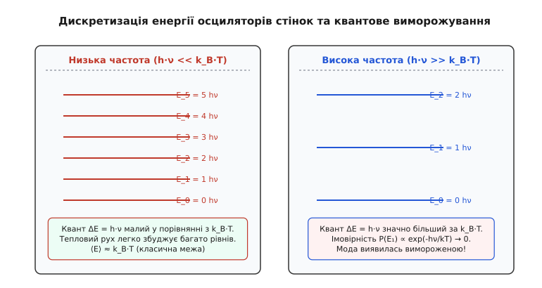

# Випромінювання чорного тіла

<preknowlist>
- [Термодинамічна рівновага та температура](book:physics/thermal-statistical/thermodynamic-equilibrium) — рівновага розподілу енергії та поняття температури.
- [Електромагнітні хвилі та спектр](book:physics/electromagnetism/electromagnetic-spectrum) — зв'язок частоти, довжини хвилі та площини поляризації.
- [Гармонічний осцилятор](book:physics/mechanics/harmonic-oscillation) — власні моди та дискретні/неперервні рівні енергії.
- [Теорема рівнорозподілу енергії](book:physics/thermal-statistical/equipartition-theorem) — класичний розподіл ½ k_B T на ступінь вільності.
</preknowlist>

Ковальне ковадло, розпечена залізна заготовка при температурі близько 800 К світиться темно-червоним кольором. Зі зростанням температури до 1300 К колір заготовки змінюється на яскраво-помаранчевий та жовтий, а при 1800 К метал випромінює сліпучо-біле світло. Мікроскопічний механізм цього явища полягає у хаотичному тепловому русі атомів та іонів конденсованої речовини: заряджені частинки здійснюють прискорене хаотичне коливання, неперервно збуджуючи флуктуації електромагнітного поля й випромінюючи електромагнітні хвилі у навколишній простір.

Зворотний процес відбувається не менш безперервно: електромагнітні хвилі, падаючи на речовину, розганяють її внутрішні електроди та іони, передаючи їм свою енергію й перетворюючи її назад на теплову енергію атомного руху. Коли випромінююче тіло знаходиться у замкненій ізольованій системі при сталій температурі `T`, між речовиною та електромагнітним полем встановлюється стійка термодинамічна рівновага. За цих умов швидкість поглинання енергії випромінювання речовиною на кожній частоті точно дорівнює швидкості її зворотного випромінювання.

## Концепція абсолютного чорного тіла та закон Кірхгофа

Дослідження рівноважного випромінювання у XIX столітті тривалий час ускладнювалося тим, що реальні тіла випромінюють світло по-різному залежно від хімічного складу, мікроструктури поверхні, наявності оксидних плівок та шорсткості. Полірована срібна пластина відбиває 98% падаючого світла й випромінює дуже слабко, тоді як сажа або зачернена сажею поверхня поглинає майже все падаюче випромінювання й випромінює значно інтенсивніше при тій самій температурі.

Закони оптичної термодинаміки вимагають, щоб для довільної поверхні сума спектральних коефіцієнтів відбивання `r(ν, T)`, поглинання `a(ν, T)` та пропускання `τ(ν, T)` завжди дорівнювала одиниці відповідно до закону збереження енергії:

```
r(ν, T) + a(ν, T) + τ(ν, T) = 1.0
```

Для непрозорих тіл (`τ = 0`) баланс між відбиванням та поглинанням спрощується до виразу `r(ν, T) + a(ν, T) = 1.0`. Звідси стає зрозуміло, чому хороші відбивачі світла є поганими поглиначами та слабкими випромінювачами.

У найзагальнішому випадку спектральний поглинальний коефіцієнт залежить не лише від частоти `ν` та температури `T`, але й від напрямку падаючого променя (кутів `θ, φ`) та його стану поляризації (s-поляризація або p-поляризація). Застосовуючи принцип детальної рівноваги та зворотність світлових променів у часі, Кірхгоф довів, що напрямковий спектральний коефіцієнт випромінювання `ε(ν, θ, φ, T)` точно дорівнює напрямковому коефіцієнту поглинання `a(ν, θ, φ, T)` для кожного кута та поляризації окремо:

```
ε(ν, θ, φ, T) = a(ν, θ, φ, T)
```

Вимірювання спектральної відбивної здатності за допомогою спектрофотометрів та інтегруючих сфер дозволяє непрямим шляхом точно визначати спектральний коефіцієнт поглинання речовин `a(λ) = 1 - r(λ)`, що є базовим методом лабораторної спектроскопії матеріалів.

Щоб відокремити фундаментальні властивості електромагнітного поля від індивідуальних властивостей конкретного матеріалу, німецький фізик Густав Кірхгоф у 1859 році ввів поняття **абсолютно чорного тіла**. Абсолютно чорним тілом називають гіпотетичний об'єкт, який повністю поглинає абсолютно все електромагнітне випромінювання будь-якої довжини хвилі та частоти, що падає на його поверхню, не відбиваючи й не пропускаючи жодної його частки:

```
α(ν, T) = 1.0   [для всіх частот ν та температур T]
```

де `α(ν, T)` — спектральний коефіцієнт поглинання поверхні (відношення поглинутої енергії випромінювання до падаючої у вузькому інтервалі частот `[ν, ν + dν]`).

Розглядаючи термодинамічну рівновагу між довільним тілом та випромінюванням у замкненій порожнині, Кірхгоф довів фундаментальну теорему, яка отримала назву **закону випромінювання Кірхгофа**: відношення спектральної випромінювальної здатності `e(ν, T)` будь-якого тіла до його спектрального коефіцієнта поглинання `a(ν, T)` є універсальною функцією частоти та температури, яка взагалі не залежить від природи матеріалу тіла:

```
e(ν, T) / a(ν, T) = u(ν, T) · (c / 4)
```

де `u(ν, T)` — спектральна густина енергії рівноважного електромагнітного поля у порожнині (кількість енергії випромінювання з частотами від `ν` до `ν + dν` в одиниці об'єму), а `c` — швидкість світла у вакуумі.

Оскільки для абсолютно чорного тіла `a(ν, T) = 1`, його спектральна випромінювальна здатність `e_чорне(ν, T)` безпосередньо пропорційна спектральній густині енергії рівноважного поля у порожнині:

```
e_чорне(ν, T) = (c / 4) · u(ν, T)
```

Це означає, що абсолютно чорне тіло є не лише ідеальним поглиначем, але й **найінтенсивнішим випромінювачем** серед усіх можливих тіл при заданій температурі `T`. Жодне реальне тіло при температурі `T` не може випромінювати на частоті `ν` більше енергії, ніж абсолютно чорне тіло.

Спектральну яскравість випромінювання визначають як кількість енергії, що випромінюється за одиницю часу з одиниці площі поверхні у визначеному телесному куті `dΩ`. Для ізотропного випромінювання зв'язок між інтегральною випромінювальної здатністю одиниці поверхні `j*` та об'ємною густиною енергії `u` задається інтегруванням за півсферою телесних кутів з урахуванням закону Ламберта (пропорційності косинусу кута випромінювання `cos θ` відносно нормалі):

```
j* = ∫ [0..2π] dφ ∫ [0..π/2] B · cos θ · sin θ dθ
   = B · 2π · [sin² θ / 2] [від 0 до π/2]
   = π · B
```

Оскільки об'ємна густина енергії зв'язана зі спектральною яскравістю як `u = (4π / c) · B`, інтегральний потік з поверхні чорного тіла становить `j* = (c / 4) · u`.


*Модель абсолютно чорного тіла: випромінювання у порожнині зазнає багаторазових відбивань і знаходиться у термодинамічній рівновазі зі стінками при температурі T.*

В природі не існує матеріалів із за абсолютно точним поглинанням `α = 1.0` у всьому спектральному діапазоні. Поверхні, покриті хімічно чистою сажею або платиновою чернню, поглинають близько 98–99% падаючого світла, але в інфрачервоному діапазоні їхній коефіцієнт поглинання помітно знижується. Сучасні нанотехнологічні матеріали (наприклад, VANTABLACK — масиви вертикально вирівняних вуглецевих нанотрубок) досягають коефіцієнта поглинання 99.965%, оскільки світло між нанотрубками зазнає численних відбивань і практично повністю згасає.

Проте ідеальна фізична модель абсолютно чорного тіла створюється за допомогою замкненої порожнини з малим отвором (модель Гольраума).

Коли промінь світла потрапляє ззовні крізь малий отвір усередину порожнини, він відбивається від внутрішніх стінок багаторазово. На кожному відбиванні стінка поглинає певну частку енергії `α_стінки`. Після 10–20 послідовних відбивань енергія падаючого променя майже повністю розсіюється й поглинається стінками, а ймовірність того, що промінь випадково вийде назад крізь малий отвір, прямує до нуля. Отже, сам отвір поводиться як ідеальна поверхня абсолютно чорного тіла з коефіцієнтом поглинання `α_отвору ≈ 1.0`.

Якщо стінки такої порожнини підтримуються при сталій температурі `T`, випромінювання, що виходить з отвору назовні, є точним зразком внутрішнього рівноважного випромінювання порожнини — випромінювання абсолютно чорного тіла.

> 🔧 **Навіщо це.**
> Модель порожнистого чорного тіла є основою сучасної оптичної метрології та еталонування температурної шкали. Еталонні джерела випромінювання у вигляді високотемпературних печей із зачорненими графітовими порожнинами застосовуються для калібрування інфрачервоних пірометрів, тепловізорів, космічних спектрометрів та супутникових систем зондування атмосфери Землі.

---

## Феноменологічні закони: Стефан-Больцман та зміщення Віна

Перш ніж фізики змогли розкрити повний аналітичний вигляд функції `u(ν, T)`, експериментальні дослідження та класична термодинаміка дозволили встановити два важливі феноменологічні закони, які описують загальну потужність та зміщення максимуму спектра випромінювання.

### Закон Стефана-Больцмана

У 1879 році австрійський фізик Йозеф Стефан на основі аналізу експериментальних даних встановив, що повна випромінювальна здатність тіла (інтегрована по всьому спектру частот) пропорційна четвертому степеню його абсолютної температури. У 1884 році Людвіг Больцман дав теоретичне виведення цієї залежності для абсолютно чорного тіла, об'єднавши закони термодинаміки з Максвеллівським виразом для тиску електромагнітного випромінювання.

Розглянемо замкнений циліндр з рухомим поршнем, внутрішні стінки якого є ідеальними дзеркалами, а всередині знаходиться рівноважне випромінювання при температурі `T`. Оскільки електромагнітні хвилі несуть не лише енергію, але й імпульс, при відбиванні від стінок вони створюють світловий тиск `p`. З тензора напружень Максвелла випливає, що для повністю ізотропного фотонного газу світловий тиск становить точно одну третину об'ємної густини енергії:

```
p = u / 3
```

Застосуємо перше та друге начала термодинаміки до рівноважного випромінювання як до термодинамічної системи. Зміна внутрішньої енергії `dU = d(u · V)` при зворотному розширенні дорівнює:

```
d Q = d U + p d V = d(u · V) + (u / 3) d V = V d u + (4 / 3) u d V
```

Згідно з другим началом термодинаміки, для диференціала ентропії `d S = d Q / T` вираз `d S` повинен бути повним диференціалом:

```
d S = (V / T) d u + ((4 / 3) · u / T) d V
```

Застосовуючи умову рівності мішаних похідних для повного диференціала `∂² S / (∂ V ∂ u) = ∂² S / (∂ u ∂ V)`:

```
∂ / ∂ V (V / T) = ∂ / ∂ u ((4 / 3) · u / T)
```

Виконуючи диференціювання за змінними `V` та `u` відповідно:

```
1 / T = (4 / 3) · (1 / T - (u / T²) · (d T / d u))
```

Перегрупувавши доданки та розділивши змінні:

```
(1 / 3) · (1 / T) = (4 / 3) · (u / T²) · (d T / d u)  ⇒  (d u / u) = 4 · (d T / T)
```

Інтегрування цього рівняння дає точний закон залежності густини енергії випромінювання від температури: `u(T) = a · T⁴`. Інтегральна випромінювальна здатність одиниці поверхні абсолютно чорного тіла `j* = (c / 4) · u(T)` описується **законом Стефана-Больцмана**:

```
j* = σ · T⁴
```

де `σ` — стала Стефана-Больцмана (`σ ≈ 5.670374 × 10⁻⁸ Вт / (м² · К⁴)`).

З виразу для ентропії також випливають термодинамічні потенціали фотонного газу:
- Ентропія: `S = (4/3) · a · V · T³`
- Вільна енергія Гельмгольца: `F = U - T S = a V T⁴ - (4/3) a V T⁴ = - (1/3) a V T⁴`
- Великий потенціал Гіббса: `Ω = - p V = - (1/3) a V T⁴`
- Ентальпія фотонного газу: `H = U + p V = (4/3) a V T⁴`

Теплоємність рівноважного випромінювання при постійному об'ємі `C_V = (∂U/∂T)_V = 4 a V T³` зростає кубічно з температурою, що показує стрімку здатність гарячого вакууму акумулювати енергію електромагнітних хвиль. При адіабатичному розширенні випромінювання (`S = const`) добуток `V · T³ = const`, тобто температура рівноважного поля знижується обернено пропорційно лінійним розмірам порожнини (`T ∝ 1 / R`).

Закон Стефана-Больцмана демонструє надзвичайно стрімке зростання випромінюваної потужності зі збільшенням температури. Наприклад, при подвоєнні температури тіла від 300 К (кімнатна температура) до 600 К енергія, що випромінюється його поверхнею за секунду, зростає у `2⁴ = 16` разів, а при нагріванні до 3000 К — у 10 000 разів.

Для сірих тіл (реальних тіл з інтегральним коефіцієнтом поглинання `ε < 1`) закон Стефана-Больцмана модифікується виразом `j* = ε · σ · T⁴`. Полірований алюміній має `ε ≈ 0.04` і випромінює мінімально, тоді як людська шкіра в інфрачервоному діапазоні має високий ступінь чорноти `ε ≈ 0.98`, що робить тепловізійну діагностику тіла високоточною.

### Закон зміщення Віна

У 1893 році німецький фізик Вільгельм Він розглянув термодинамічний процес повільного адіабатичного стискання рівноважного випромінювання у сферичній порожнині з дзеркальними стінками. Коли радіус порожнини зменшується зі швидкістю `v << c`, електромагнітні хвилі при відбиванні від рухомої стінки зазнають доплерівського зсуву частоти. Збільшення частоти хвилі при відбиванні дорівнює:

```
Δν / ν = (2 · v / c) · cos θ
```

Усереднення цього зсуву по всіх напрямках поширення хвиль дає відносну зміну частоти `dν / ν = - dR / R`, де `R` — радіус порожнини. Це означає, що при адіабатичному зміні об'єму частота кожної моди змінюється обернено пропорційно радіусу порожнини: `ν · R = const`.

Оскільки при адіабатичному розширенні `T · R = const`, відношення частоти хвилі до температури залишається незмінним під час адіабатичного процесу:

```
ν / T = const
```

Застосовуючи цей результат до спектрального розподілу енергії, Він довів, що спектральна густина енергії повинна мати функціональний вигляд:

```
u(λ, T) = (1 / λ⁵) · f(λ · T)
```

де `f(λ · T)` — деяка універсальна функція добутку довжини хвилі на температуру.

З цього співвідношення безпосередньо випливає **закон зміщення Віна**: довжина хвилі `λ_max`, на яку припадає максимум спектральної випромінювальної здатності абсолютно чорного тіла, обернено пропорційна його абсолютній температурі:

```
λ_max · T = b
```

де `b ≈ 2.897771 × 10⁻³ м · К` — стала зміщення Віна.


*Спектральні криві випромінювання Планка для різних температур. Зі зростанням T максимуми зміщуються у бік коротших хвиль, а інтегральна площа росте як T⁴.*

Закон зміщення Віна пояснює зміну кольору нагрітих тіл:
- При низьких температурах (300–500 К) максимум випромінювання лежить глибоко в інфрачервоній області (`λ_max ≈ 6–10 мкм`), і людське око не бачить власного свічення тіла, хоча відчуває його як теплове інфрачервоне випромінювання шкірою.
- При температурі 1000 К максимум переміщується до `λ_max ≈ 2.9 мкм` (близьке ІЧ-випромінювання), але край короткохвильового хвоста потрапляє у червону область видимого спектра (темно-вишневе свічення).
- При температурі поверхні Сонця (близько 5778 К) максимум випромінювання припадає на `λ_max ≈ 500 нм` — зелено-блакитну область видимого діапазону, що ідеально відповідає максимуму спектральної чутливості людського ока, сформованого еволюцією під сонячним світлом.

---

## Ультрафіолетова катастрофа класичної физики

Наприкінці XIX століття з розвитком статистичної механіки Максвелла-Больцмана та класичної електродинаміки Максвелла здавалося, що теоретична фізика володіє всіма необхідними інструментами для повного виведення функції `u(ν, T)`.

У 1900 році англійський фізик Лорд Релей (і остаточно у 1905 році Джеймс Джинс) застосували класичну теорему рівнорозподілу енергії до електромагнітного поля у замкненій порожнині.

Розглянемо електромагнітне поле у кубічній порожнині об'ємом `V` як сукупність стоячих електромагнітних хвиль (мод). Кількість стоячих хвиль з частотами у діапазоні від `ν` до `ν + dν` розраховується з хвильового рівняння з нульовими граничними умовами на провідних стінках. 

Розв'язок хвильового рівняння `∇² E = (1/c²) ∂² E / ∂ t²` у кубічному об'ємі `L × L × L` дає стоячі хвилі з хвильовими векторами `k_x = (π/L) n_x`, `k_y = (π/L) n_y`, `k_z = (π/L) n_z`, де `n_x, n_y, n_z` — цілі додатні числа. Обчислення кількості можливих комбінацій у просторі хвильових векторів (об'єм октанту сфери радіуса `n = 2 L ν / c`) із урахуванням двох ортогональних компонент поляризації дає густину мод `g(ν)` (кількість стоячих хвиль на одиницю об'єму у вузькому інтервалі частот):

```
g(ν) dν = (8 · π · ν² / c³) dν
```

Альтернативний квантовомеханічний підхід підтверджує цей результат: у фазовому просторі координати та імпульсу об'єм елементарного квантового стану дорівнює `h³`. Для фотонів з імпульсом `p = h ν / c` об'єм імпульсного простору у шарі `[p, p + dp]` дорівнює `4 π p² dp = 4 π (h ν / c)² (h dν / c)`. Поділивши на `h³` та помноживши на 2 поляризації, отримуємо точно ту саму густину мод `g(ν) dν = (8 π ν² / c³) dν`.

Згідно з класичною статистичною механікою, у стані термодинамічної рівноваги на кожну квадратичну ступінь вільності системи припадає середня кінетична або потенціальна енергія `½ k_B T`, де `k_B` — стала Больцмана.

Оскільки кожна електромагнітна мода є гармонічним осцилятором, вона володіє двома квадратичними ступенями вільності (електричною та магнітною енергією хвиль). Отже, середня енергія однієї електромагнітної моди при довільній частоті `ν` має дорівнювати:

```
⟨E_класична⟩ = 2 · (½ k_B T) = k_B · T
```

Помноживши густину мод `g(ν)` на середню енергію однієї моди `⟨E_класична⟩`, Релей і Джинс отримали класичний закон спектрального розподілу — **формулу Релея-Джинса**:

```
u(ν, T) dν = (8 · π · ν² / c³) · k_B · T dν
```

При низьких частотах (в інфрачервоному та радіодіапазоні) формула Релея-Джинса чудово узгоджувалася з вимірюваннями. Проте при високих частотах (`ν → ∞`) класична теорія призвела до катастрофічного фізичного парадоксу.

Оскільки густина мод `g(ν) ∝ ν²` безмежно зростає зі збільшенням частоти, спектральна густина енергії `u(ν, T)` за формулою Релея-Джинса прямує до нескінченності при високих частотах. Інтегрування спектральної густини по всьому діапазону частот від `0` до `∞` для знаходження повної об'ємної енергії випромінювання дає нескінченність:

```
u_total = ∫₀^∞ (8 · π · ν² / c³) · k_B · T dν = ∞
```


*Ультрафіолетова катастрофа: класична теорія Релея-Джинса прямує до нескінченності при високих частотах, тоді як квантовий закон Планка узгоджується з експериментом у всьому спектрі.*

Цей парадокс, названий Паулем Еренфестом **ультрафіолетовою катастрофою**, означав абсолютну непридатність класичної фізики для опису теплового випромінювання. Якби закон Релея-Джинса був правильним, термодинамічна рівновага між речовиною та випромінюванням була б неможливою: будь-яке нагріте тіло (наприклад, чашка гарячого чаю або печінка) миттєво віддавало б усю свою теплову енергію у вигляді високочастотного ультрафіолетового, рентгенівського та гамма-випромінювання, охолоджуючись до абсолютного нуля.

Детальніше про драматичний перебіг експериментальних досліджень та наукові суперечки навколо випромінювання чорного тіла читайте в [історії відкриття квантової гіпотези Планка](book:physics/thermal-statistical/blackbody-radiation/hist-planck-quanta.md).

---

## Квантова гіпотеза Планка та формула розподілу

Вихід із фундаментального кутка класичної физики знайшов німецький теоретик Макс Планк. 14 грудня 1900 року на засіданні Німецького фізичного товариства Планк представив революційну гіпотезу, яка поклала початок квантовій епосі.

Планк висунув припущення: **атомарні осцилятори стінок порожнини випромінюють та поглинають електромагнітну енергію не неперервно, а виключно дискретними порціями — квантами енергії**.

Енергія `E` одного кванта прямо пропорційна частоті випромінювання `ν`:

```
ε = h · ν
```

де `h` — фундаментальна фізична стала, названа **сталою Планка** (`h ≈ 6.62607015 × 10⁻³⁴ Дж · с`).

У сучасній квантовій механіці енергія квантового осцилятора включає енергію нульових коливань `E_n = (n + ½) h ν`. Проте нульова енергія `½ h ν` не залежить від температури і є константою для кожного стану. При підрахунку теплообміну та похідної за температурою `d⟨E⟩/dT` нульові коливання дають тотожний нуль, тому фізичний результат Планка залишається строго точним.

Отже, можливі значення енергії гармонічного осцилятора частоти `ν` утворюють дискретну драбину рівнів:

```
E_n = n · h · ν,   n = 0, 1, 2, 3, ...
```

Враховуючи дискретність енергетичних рівнів, Планк перерахував середню енергію осцилятора `⟨E⟩` за допомогою канонічного розподілу Больцмана. Імовірність того, що осцилятор знаходиться у стані з енергією `E_n = n · h · ν`, пропорційна больцманівському множнику `exp(-n · h · ν / (k_B · T))`.


*Дискретні енергетичні рівні осциляторів стінок. При h·ν >> k_B·T ймовірність збудження високих рівнів експоненційно згасає.*

Середнє значення енергії `⟨E_квантова⟩` обчислюється як зважена сума за всіма дискретними станами `n`:

```
⟨E_квантова⟩ = (∑ [n=0..∞] n · h · ν · exp(-n · h · ν / (k_B · T))) / (∑ [n=0..∞] exp(-n · h · ν / (k_B · T)))
```

Позначивши `x = h · ν / (k_B · T)`, знаменник являє собою суму нескінченно спадної геометричної прогресії `Z = ∑ exp(-n · x) = 1 / (1 - exp(-x))`. Обчисливши суму в чисельнику через похідну від `Z`, отримуємо точний вираз для **середньої енергії квантового осцилятора**:

```
⟨E_квантова⟩ = h · ν / (exp(h · ν / (k_B · T)) - 1)
```

Помноживши класичну густину мод у порожнині `g(ν) = (8 · π · ν² / c³)` на середню квантову енергію моди `⟨E_квантова⟩`, Планк отримав точну формулу спектрального розподілу — **закон Планка**:

```
u(ν, T) dν = (8 · π · h · ν³ / c³) / (exp(h · ν / (k_B · T)) - 1) dν
```

Переходячи від частоти `ν` до довжини хвилі `λ = c / ν` (з урахуванням `dν = - (c / λ²) dλ`), формула Планка набуває вигляду:

```
u(λ, T) dλ = (8 · π · h · c / λ⁵) / (exp(h · c / (λ · k_B · T)) - 1) dλ
```

Спектральна яскравість випромінювання поверхні абсолютно чорного тіла `B_λ(λ, T)` пов'язана з `u(λ, T)` співвідношенням `B_λ = (c / 4π) · u(λ, T)`:

```
B_λ(λ, T) dλ = (2 · h · c² / λ⁵) / (exp(h · c / (λ · k_B · T)) - 1) dλ
```

### Граничні переходи формули Планка

Формула Планка містить класичний закон Релея-Джинса та емпіричний закон Віна як свої часткові граничні випадки:

1. **Низькочастотна межа (`h · ν << k_B · T`):**
   При малих частотах квант енергії `h · ν` значно менший за теплову енергію `k_B T`. Розкладаючи експоненту в ряд Тейлора `exp(x) - 1 ≈ x = h · ν / (k_B · T)`:
   
   ```
   ⟨E_квантова⟩ ≈ h · ν / (h · ν / (k_B · T)) = k_B · T
   ```
   
   Формула Планка тотожно перетворюється на класичний **закон Релея-Джинса**.

2. **Високочастотна межа (`h · ν >> k_B · T`):**
   При високих частотах (у короткохвильовій ультрафіолетовій області) квант енергії `h · ν` стає набагато більшим за середню теплову енергію `k_B T`. У цьому разі `exp(h · ν / (k_B · T)) >> 1`, і одиницею у знаменнику можна знехтувати:
   
   ```
   u(ν, T) ≈ (8 · π · h · ν³ / c³) · exp(-h · ν / (k_B · T))
   ```
   
   Формула Планка перетворюється на експоненційну **формулу Віна**.

Квантовий механізм запобігання ультрафіолетовій катастрофі полягає у **квантовому виморожуванні високих мод**: для збудження високочастотної моди `ν` атомарний осцилятор повинен отримати від середовища цілісний порційний квант енергії `ΔE = h · ν`. Оскільки ймовірність отримання такої великої порції при теплових флуктуаціях пропорційна `exp(-h · ν / (k_B · T))`, при `h · ν >> k_B · T` ця ймовірність експоненційно прямує до нуля. Високочастотні моди залишаються "вимороженими" (незбудженими), і сумарна випромінювана енергія залишається скінченною величиною.

Крок за кроком перевірити математичні перетворення, інтегрування за дзета-функцією Рімана `ζ(4) = π⁴ / 90` та диференціювання для виведення констант `σ` та `b` можна у [строгому математичному виведенню закону Планка](book:physics/thermal-statistical/blackbody-radiation/math-planck-derivation.md).

---

## Фізичні наслідки, фотони та астрофізичні застосування

Квантова гіпотеза Планка виявилася значно глибшою, ніж просто вдалим обчислювальним прийомом для опису спектрів печей. У 1905 році Альберт Ейнштейн зробив наступний вирішальний крок, заявивши, що дискретизація — це не властивість стінок порожнини, а фундаментальна структура самого світла.

Електромагнітне випромінювання складається з неподільних квантів поля — **фотонів**, кожен з яких переносить енергію `E = h · ν` та імпульс `p = h · ν / c`. 

З точки зору сучасної квантової статистичної физики, випромінювання чорного тіла є **ідеальним фотонним газом** — газом не взаємодіючих релятивістських бозонів зі спіном 1 із нульовим хімічним потенціалом `μ = 0` (оскільки кількість фотонів у порожнині не зберігається й змінюється при зміні температури).

Середнє число заповнення фотонного стану з енергією `ε = h · ν` описується статистикою Бозе-Ейнштейна при `μ = 0`:

```
⟨n(ν)⟩ = 1 / (exp(h · ν / (k_B · T)) - 1)
```

Концентрація фотонів у порожнині обчислюється інтегруванням числа фотонів по всіх частотах:

```
n_фотонів = ∫₀^∞ (g(ν) / (exp(h · ν / (k_B · T)) - 1)) dν
          = (16 · π · ζ(3) · (k_B · T)³) / (c³ · h³)
```

де `ζ(3) ≈ 1.202056` — значення дзета-функції Рімана (константа Апері). Це показує, що концентрація фотонів у рівноважному чорному тілі зростає кубічно з температурою `n_фотонів ∝ T³`. При кімнатній температурі (300 К) в одному кубічному сантиметрі порожнини знаходиться близько 5.5 мільярдів фотонів теплового випромінювання.

У радіоастрономії для опису низькочастотного космічного випромінювання широко застосовується поняття **радіояскравісної температури** `T_B`. Оскільки у радіодіапазоні завжди виконується умова `h ν << k_B T`, випромінювану яскравість будь-якого космічного джерела прирівнюють до формули Релея-Джинса `B_ν = (2 ν² / c²) k_B T_B`. Це дає змогу виражати інтенсивність радіосигналу прямо у Кельвінах яскраваснісної температури.

У промисловій пірометрії застосовують два основні типи оптичних приладів:
- **Яскравісні пирометри:** вимірюють спектральну яскравість на одній фіксованій довжині хвилі (зазвичай 650 нм) та порівнюють її з яскравістю еталонної нитки розжарення (яскраваснісна температура `T_S`).
- **Двохвильові (спектрального відношення) пирометри:** обчислюють відношення спектральних яскравостей на двох сусідніх довжинах хвиль `R = B_λ(λ₁) / B_λ(λ₂)`. Для сірих тіл (`ε(λ₁) ≈ ε(λ₂)`) відношення `R` зовсім не залежить від ступеня чорноти поверхні `ε`, що дозволяє безконтактно вимірювати справжню температуру розплавленого сталі у мартенівських печах з високою точністю.

В інфрачервоній астрономії орбітальні телескопи (такі як James Webb Space Telescope — JWST) охолоджуються до кріогенних температур (нижче 7–28 К). Це необхідно для того, щоб власне теплове чорне випромінювання елементів конструкції та дзеркал телескопа не засліплювало чутливі ІЧ-детектори при спостереженні найвіддаленіших галактик з високим червоним зсувом.

### Астрофізика та реліктове випромінювання

Найяскравішим та наймасштабнішим підтвердженням закону Планка в природі є **космічне мікрохвильове фонове випромінювання (реліктове випромінювання)**.

Залишене з епохи Первинної Рекімбінації Всесвіту (близько 380 000 років після Великого Вибуху), це випромінювання заповнює весь метагалактичний простір. У 1990 році космічний супутник NASA COBE (спектрометр FIRAS) виміряв спектр реліктового випромінювання з безпрецедентною точністю.

Спектр реліктового випромінювання виявився **найідеальнішим спектром абсолютно чорного тіла**, коли-небудь виміряним у природі або лабораторії, з температурою `T = 2.72548 ± 0.00057 К`. Відхилення експериментальних точок від теоретичної кривої Планка не перевищують 0.005% по всьому діапазоні частот.

```
                  Спектр реліктового випромінювання (COBE/FIRAS)
   B_ν [МЯн]
    400 ┼                                  *  *  *  (Температура T = 2.725 K)
        │                               *        *
    300 ┼                             *            *
        │                           *                *
    200 ┼                         *                    *
        │                       *                        *
    100 ┼                     *                            *
        │                 *                                    *
      0 ┴───┼───────────┼───────────┼───────────┼───────────┼───────────
            0           5          10          15          20   Частота ν [см⁻¹]
```

В астрофізиці закон Планка та закон зміщення Віна є головним інструментом визначення ефективних температур поверхонь зірок. Спектральна класифікація зірок (послідовність O, B, A, F, G, K, M на діаграмі Герцшпрунга-Рассела) безпосередньо відображає зниження температури поверхні зірки:
- Блакитні гіганти класи O та B (наприклад, Ригель у сузір'ї Оріона) мають температуру поверхні понад 12 000–30 000 К, і їхній максимум випромінювання лежить в ультрафіолеті.
- Жовті карлики класу G (як наше Сонце, `T = 5778 К`) мають максимум у зелено-блакитному світлі (`λ_max ≈ 500 нм`).
- Червоні надгіганти класу M (Бетельгейзе, `T ≈ 3500 К`) випромінюють переважно в інфрачервоному діапазоні з максимумом `λ_max ≈ 830 нм`.

Розрахунок теплового балансу планет Сонячної системи також базується на законі Планка та законі Стефана-Больцмана. Планета поглинає частку сонячного випромінювання `(1 - A) · S · π R²` (де `A` — альбедо, а `S ≈ 1361 Вт/м²` — сонячна стала) і перевипромінює її з усієї своєї поверхні `4 π R² · σ T_еф⁴`. Звідси рівноважна ефективна температура Землі без урахування парникового ефекту становить близько 255 К (-18°C), а природний парниковий ефект атмосфери підвищує середню температуру поверхні Землі до комфортних 288 К (+15°C).

Колірна температура джерел світла у світлотехніці описує спектральний розподіл випромінювання світлодіодів та ламп: «тепле біле світло» відповідає колірній температурі чорного тіла 2700–3000 К, «денне світло» — 5000–6500 К, а «холодне синє світло» — понад 8000 К. Спектральні лінії атмосфери Землі створюють «вікна прозорості» в ІЧ-діапазоні (3–5 мкм та 8–14 мкм), через які працюють сучасні тепловізори військового, промислового та цивільного призначення.

Отже, відкриття закону випромінювання абсолютно чорного тіла не лише розв'язало найважчу проблему термодинаміки XIX століття, але й відкрило двері у квантовий світ, створивши теоретичний фундамент для сучасної квантової оптики, атомної фізики, напівпровідникової фотоніки, лазерних систем, інфрачервоної техніки, астрофізики та сучасної спостережної космології Всесвіту.

Для ознайомлення з практичною програмою аналізу спектрів, числового інтегрування та пошуку максимумів зверніться до [чисельної симуляції спектрів випромінювання](book:physics/thermal-statistical/blackbody-radiation/proj-blackbody-spectrum.md), а для інтеграції розрахунків у власні C/C++ інженерні додатки скористайтеся [інтерфейсом обчислювальної бібліотеки](book:physics/thermal-statistical/blackbody-radiation/api-radiation-calc.md).
