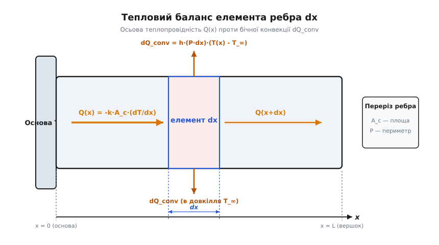
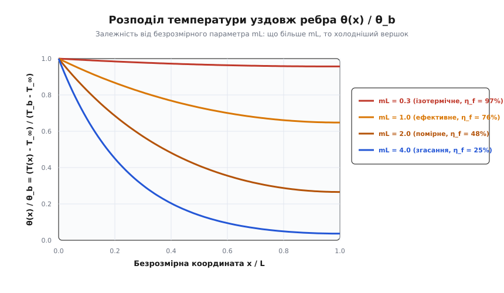
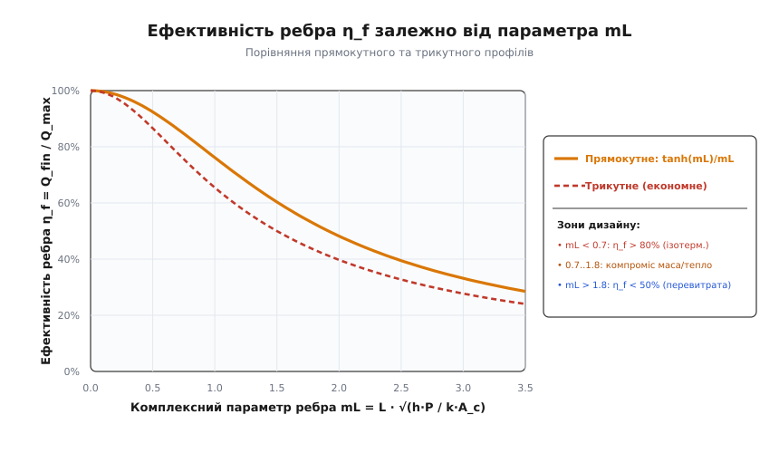
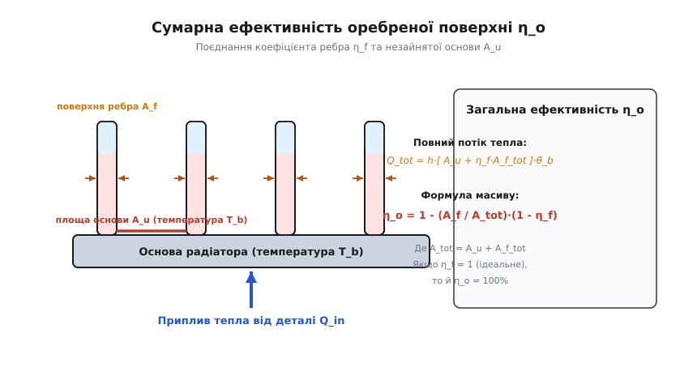

# Ефективність ребра: чому не можна нескінченно подовжувати радіатор

<preknowlist>
- [Тепловий опір](topic:physics/thermal-resistance) — концепція еквівалентного теплового опору Rθ (°C/Вт), де різниця температур ΔT грає роль напруги, а тепловий потік P — струму.
- [Питомий опір і теплопровідність](topic:physics/resistivity) — коефіцієнт теплопровідності k (Вт/(м·К)), що задає інтенсивність переносу тепла крізь товщу матеріалу за законом Фур'є.
</preknowlist>

Будь-який потужний напівпровідниковий прилад, мікропроцесор, силовий транзистор чи силовий трансформатор розсіює електричну енергію у вигляді тепла. Щоб кристал напівпровідника не вийшов з ладу від перегріву, це тепло необхідно безперервно відводити в навколишнє середовище — найчастіше в атмосферне повітря або рідкий теплоносій. Закон конвективного теплообміну Ньютона-Ріхмана стверджує, що сумарний розсіюваний тепловий потік `Q` (вимірюваний у ватах) прямо пропорційний коефіцієнту тепловіддачі `h` (Вт/(м²·К)), площі поверхні контакту `A` (м²) та температурному напору між гарячою поверхнею деталі `T_s` і довкіллям `T_∞`:

```
Q = h · A · (T_s - T_∞)
```

Коли інженер-конструктор намагається збільшити тепловідведення `Q`, він швидко впирається у жорсткі фізичні, геометричні та технологічні обмеження. Піднімати температурний напір `(T_s - T_∞)` неможливо, оскільки гранична робоча температура кремнієвого кристала `T_j` суворо обмежена фізикою напівпровідників на рівні 125–150 °C (понад цією межею виникає тепловий пробій та деградація p-n переходів). Збільшувати коефіцієнт тепловіддачі `h` за рахунок інтенсивнішого примусового обдування вентилятором до нескінченності теж не можна: стрімко ростуть акустичний шум, споживання енергії вентилятором, аеродинамічний опір та габарити системи. Залишається третій доступний важіль — штучне збільшення площі поверхні контакту `A`.

Саме з цією метою на гарячу деталь монтують металеві ребра, пластини, виступи, штирі або цілі оребрені радіаційні конструкції. На перший погляд здається, що нарощування площі — це лінійна задача геометричного масштабування: якщо зробити металеві ребра вдвічі довшими, площа контакту з повітрям подвоїться, а отже, радіатор розсіє вдвічі більше тепла. Проте реальний теплофізичний експеримент показує несподіваний результат: починаючи з певної довжини, подальше подовження ребра майже не додає тепловідведення. Ребро стає важчим, об'ємнішим і дорожчим, але температура гарячої деталі перестає падати.

Причина цього ефекту криється в тому, що жоден реальний метал не володіє нескінченною теплопровідністю. Тепло, що входить у корінь ребра від гарячої деталі, має фізично пройти вздовж усього металевого виступу за рахунок дифузії фононів та вільних електронів. Оскільки вздовж цього шляху тепло безперервно скидається з бічних стінок у повітря, поздовжній тепловий потік усередині ребра поступово виснажується. Як наслідок, температура ребра неминуче спадає від максимуму в основі `T_b` до мінімуму на вершку `T(L)`. Оскільки віддалені ділянки ребра виявляються набагато холоднішими за основу, вони розсіюють тепло з пропорційно меншою інтенсивністю. Явище зниження ефективності випромінювальної чи конвективної поверхні через власну поздовжню теплопровідність описав Жозеф Фур'є у 1822 році, а математичне формулювання для інженерних розрахунків отримав німецький теплофізик Ернст Шмідт у 1926 році; [історія теорії розширених поверхонь](topic:physics/fin-efficiency/hist-fin-theory.md) детально висвітлює цей шлях від авіаційних двигунів першої світової війни до сучасних систем охолодження мікропроцесорів.

### Фізична модель диференціального елемента та виникнення параметра m

Щоб розкрити внутрішній механізм розподілу тепла, розглянемо прямокутне ребро постійного поперечного перерізу `A_c` та периметра `P`, яке відходить від основи з температурою `T_b` у середовище з температурою `T_∞`. Спрямуємо координату `x` уздовж ребра від його основи (`x = 0`) до вершка (`x = L`).


*Диференціальний елемент ребра dx долає два одночасних теплових процеси: поздовжню теплопровідність Q(x) за законом Фур'є та бічну конвекцію dQ_conv у повітря. Рівновага цих потоків задає фундаментальне диференціальне рівняння.*

Виділимо всередині ребра малий контрольний елемент завдовжки `dx` на відстані `x` від основи. У стаціонарному тепловому режимі в ліву грань цього елемента входить поздовжній тепловий потік `Q(x)` за рахунок теплопровідності металу за законом Фур'є:

```
Q(x) = -k · A_c · (dT / dx)
```

З правої грані елемента виходить потік `Q(x + dx)`. Залишкова різниця тепловіддачі між входом і виходом змушена витікати через бічну поверхню елемента `d A_s = P · dx` у довкілля за рахунок конвекції Ньютона-Ріхмана:

```
dQ_conv = h · (P · dx) · (T(x) - T_∞)
```

Фундаментальний закон збереження енергії для стаціонарного стану вимагає, щоб приплив тепла до контрольного об'єму дорівнював сумі відпливу вздовж ребра та конвективного скидання в повітря:

```
Q(x) = Q(x + dx) + dQ_conv
```

Розкладаючи потік на виході `Q(x + dx)` у ряд Тейлора `Q(x + dx) ≈ Q(x) + (dQ/dx)·dx` та підставляючи вираз закону Фур'є для поздовжнього потоку, отримуємо лінійне однорідне диференціальне рівняння другого порядку для надлишкової температури `θ(x) = T(x) - T_∞` (відхилення температури ребра від температури довкілля):

```
d²θ / dx² - m² · θ = 0
```

У цьому диференціальному рівнянні природно виникає фундаментальний комбінований параметр ребра `m`, який має розмірність оберненої довжини (1/м):

```
m = √( (h · P) / (k · A_c) )
```

Фізичний зміст параметра `m` полягає у вимірюванні відношення інтенсивності поверхневого конвективного відведення тепла (чисельник `h · P`) до поздовжньої теплопровідної спроможності металевого ядра (знаменник `k · A_c`). Якщо матеріал володіє високою теплопровідністю `k` (мідь або алюміній) і ребро товсте (велика площа перерізу `A_c`), параметр `m` малий, і тепло легко поширюється на велику відстань без суттєвого падіння температури. Якщо ж коефіцієнт тепловіддачі `h` великий (інтенсивне обдування), а ребро тонке, параметр `m` стає великим, і температура стрімко спадає вже на перших міліметрах від основи. Детальний математичний крок за кроком вивід цього рівняння та його розв'язків містить [математичне виведення рівняння ребра](topic:physics/fin-efficiency/math-fin-equation.md).

### Критерій одновимірності та число Біо

Перш ніж аналізувати розв'язки рівняння ребра, важливо перевірити, коли одновимірна модель взагалі є правомірною. У реальному тривимірному ребрі температура змінюється не лише вздовж координати `x`, але й упоперек товщини ребра від його центральної осі до бічних поверхонь.

Для того щоб температурою по товщині ребра можна було знехтувати і вважати переріз ізотермічним, поперечний тепловий опір теплопровідності всередині металу повинен бути мізерно малим порівняно з зовнішнім конвективним тепловим опором на межі з повітрям. Кількісним критерієм цього є безрозмірне **поперечне число Біо** (`Bi_t`), сформоване за характерною півтовщиною ребра `t/2`:

```
Bi_t = h · (t / 2) / k
```

Аналіз теорії теплопровідності показує, що якщо поперечне число Біо задовольняє умову `Bi_t < 0.1`, то поперечний перепад температур усередині ребра не перевищує 5% від загального температурного напору `(T_b - T_∞)`. Для типового алюмінієвого ребра товщиною `t = 2` мм (`t/2 = 1` мм = 0.001 м) при повітряній конвекції (`h = 50` Вт/(м²·К)) і теплопровідності алюмінію `k = 200` Вт/(м·К) отримуємо:

```
Bi_t = 50 · 0.001 / 200 = 0.00025 << 0.1
```

Оскільки виявлене значення `Bi_t` на три порядки менше за допуск 0.1, одновимірне наближення `θ = θ(x)` для металевих ребер у повітрі є надзвичайно точним і виправданим.

### Профіль температури та явище термічного замикання

Загальний розв'язок диференціального рівняння `d²θ/dx² - m²·θ = 0` записується через лінійну комбінацію гіперболічних функцій:

```
θ(x) = C1 · cosh(m · x) + C2 · sinh(m · x)
```

Константи `C1` та `C2` визначаються з граничних умов. У більшості практичних задач площа торця на вершку ребра є мізерною порівняно з площею його бічних стінок, тому торець вважають теплоізольованим (адіабатичним вершком): `(dθ/dx)|_{x=L} = 0`. В основі ребра температура фіксована й дорівнює температурі деталі: `θ(0) = θ_b = T_b - T_∞`.

За цих граничних умов розподіл надлишкової температури уздовж ребра набуває вигляду:

```
θ(x) / θ_b = cosh( m · (L - x) ) / cosh( m · L )
```


*Профіль надлишкової температури вздовж ребра при різних значеннях безрозмірного параметра mL. При малеких mL ребро майже ізотермічне; при великих mL вершок повністю охолоджується до температури довкілля T_∞.*

Графічний аналіз цього розподілу відкриває вирішальну роль безрозмірного комплексу `m · L`, який є добутком параметра згасання `m` на геометричну довжину ребра `L`:

1. **Ізотермічний режим (`m · L < 0.5`):** Температура уздовж усього ребра спадає вкрай повільно. На самому вершку `θ(L)` залишається на рівні понад 88% від температури основи `θ_b`. Ребро працює майже як суцільний ізотермічний масив — кожен квадратний міліметр поверхні бере повноцінну участь у розсіюванні тепла.
2. **Оптимальний інженерний режим (`0.5 ≤ m · L ≤ 1.5`):** Температура плавно й помірно спадає від основи до вершка. Це найбільш раціональна зона проектування, де матеріал використовується ефективно, а загальний тепловий потік суттєво перевищує тепловіддачу гладкої основи.
3. **Режим глибокого згасання (`m · L > 2.5`):** Температура ребра падає до температури довкілля (`T(x) → T_∞`) задовго до того, як потік досягне вершка. Віддалена частина ребра вирівнюється за температурою з навколишнім повітрям.

Це явище називають **термічним замиканням** або ефектом насичення довжини (*fin choking*). Оскільки температурний напір `(T(x) - T_∞)` на кінці довгого ребра дорівнює нулю, дальня частина ребра взагалі не віддає тепла в повітря. Подовження ребра понад `m · L ≈ 2.5` перетворюється на марне збільшення маси пристрою, його аеродинамічного опору та вартості без жодного теплового виграшу.

### Кількісна міра: Ефективність ребра η_f

Щоб кількісно оцінити, наскільки повно використовується тепловий потенціал розширеної поверхні, у теплофізику введено поняття **ефективності ребра** (позначається `η_f` або `η_fin`).

За означенням, ефективність ребра — це відношення реального теплового потоку `Q_fin`, який розсіюється ребром, до максимально можливого теплового потоку `Q_max`, який розсіювало б ідеальне ребро такої самої геометрії, якби воно володіло нескінченною теплопровідністю (`k → ∞`) і по всій своїй довжині утримувало температуру основи `T_b`:

```
η_f = Q_fin / Q_max
```

Максимально можливий тепловий потік ідеального ребра обчислюється як добуток площі його бічної поверхні `A_f` на коефіцієнт тепловіддачі `h` та температурний напір основи `θ_b`:

```
Q_max = h · A_f · θ_b
```

Реальний тепловий потік `Q_fin` знаходять інтегруванням конвективного відведення вздовж всієї поверхні ребра або за законом Фур'є безпосередньо в основі `x = 0`:

```
Q_fin = -k · A_c · (dθ / dx)|_{x=0} = √(h · P · k · A_c) · θ_b · tanh(m · L)
```

Поділивши реальний потік `Q_fin` на максимально можливий `Q_max = h · (P · L) · θ_b`, отримуємо класичну аналітичну формулу ефективності прямокутного ребра з ізольованим вершком:

```
η_f = tanh(m · L) / (m · L)
```

Ця витончена формула показує, що ефективність ребра повністю визначається єдиним безрозмірним параметром `m · L`.


*Універсальна крива ефективності ребра η_f залежно від безрозмірного параметра mL. Виділено три інженерні зони: ізотермічну, оптимальну та зону перевитрати матеріалу.*

Аналіз математичної залежності `η_f = tanh(m·L) / (m·L)` підтверджує фізичну інтуїцію:
- Коли `m · L → 0` (коротке або надзвичайно теплопровідне ребро), `tanh(m·L) ≈ m·L`, тому `η_f → 1` (100%). Ребро розсіює 100% можливого тепла.
- Коли `m · L = 1`, `tanh(1) ≈ 0.7616`, тобто ефективність становить **76.2%**.
- Коли `m · L = 2`, `tanh(2) ≈ 0.9640`, а ефективність падає до **48.2%**.
- При `m · L > 3`, `tanh(m·L) ≈ 1`, і ефективність згасає за зворотним законом: `η_f ≈ 1 / (m · L)`.

Щоб врахувати реальне тепловиділення через відкритий торець на вершку ребра без ускладнення математичних формул громіздкими граничними умовами третього роду, інженери використовують концепцію **скоригованої довжини** `L_c`. Ідея полягає в умовному подовженні ребра на величину, бічна площа якої еквівалентна площі торця. Для прямокутного ребра товщиною `t` скоригована довжина дорівнює `L_c = L + t/2`, а для круглого штиря діаметром `D` — `L_c = L + D/4`. Використовуючи `L_c` замість `L` у формулі `η_f = tanh(m · L_c) / (m · L_c)`, отримують точність розрахунку в межах 1–2% порівняно з точним комплексним розв'язком. Усі варіанти формул для різних геометрій зведено у [довідник формул ефективності для різних геометрій](topic:physics/fin-efficiency/api-fin-formulas.md).

### Числовий приклад інженерного розрахунку ребра

Щоб відчути фізику числових величин, розберемо реальний розрахунок алюмінієвого ребра процесорного радіатора.

Нехай прямокутне алюмінієве ребро має товщину `t = 1` мм (0.001 м), ширину `W = 50` мм (0.05 м) та довжину `L = 30` мм (0.03 м). Матеріал — алюмінієвий сплав з теплопровідністю `k = 200` Вт/(м·К). Охолодження відбувається примусовим повітряним потоком із коефіцієнтом тепловіддачі `h = 40` Вт/(м²·К). Температура основи `T_b = 75` °C, а температура повітря `T_∞ = 25` °C (надлишок `θ_b = 50` °C).

1. Обчислимо площу перерізу та периметр (нехтуючи товщиною в периметрі, `P ≈ 2·W`):
   `A_c = W · t = 0.05 · 0.001 = 0.00005` м²,
   `P = 2 · (W + t) ≈ 2 · 0.051 = 0.102` м.
2. Обчислимо параметр згасання `m`:
   `m = √( (h · P) / (k · A_c) ) = √( (40 · 0.102) / (200 · 0.00005) ) = √( 4.08 / 0.01 ) = √408 ≈ 20.2` м⁻¹.
3. Обчислимо скориговану довжину `L_c`:
   `L_c = L + t/2 = 0.03 + 0.0005 = 0.0305` м.
4. Обчислимо безрозмірний комплекс `m · L_c`:
   `m · L_c = 20.2 · 0.0305 = 0.616`.
5. Обчислимо ефективність ребра `η_f`:
   `η_f = tanh(0.616) / 0.616 = 0.5485 / 0.616 ≈ 0.890` (або **89.0%**).
6. Обчислимо реальний тепловий потік з одного ребра `Q_fin`:
   `A_f = 2 · W · L_c = 2 · 0.05 · 0.0305 = 0.00305` м²,
   `Q_max = h · A_f · θ_b = 40 · 0.00305 · 50 = 6.1` Вт,
   `Q_fin = η_f · Q_max = 0.890 · 6.1 ≈ 5.43` Вт.

Тепер уявімо, що недосвідчений інженер вирішив подвоїти довжину ребра до `L = 80` мм (0.08 м), сподіваючись отримати майже 15 Вт тепловіддачі.
Нова скоригована довжина `L_c = 0.0805` м; безрозмірний комплекс `m · L_c = 20.2 · 0.0805 = 1.626`.
Нова ефективність `η_f = tanh(1.626) / 1.626 = 0.925 / 1.626 ≈ 0.569` (лише **56.9%**).
Новий реальний потік: `Q_max = 40 · 0.00805 · 50 = 16.1` Вт, `Q_fin = 0.569 · 16.1 ≈ 9.16` Вт.

Результат: довжина ребра зросла у **2.67 раза**, витрата коштовного алюмінію та об'єм кулера зросли у **2.67 раза**, а тепловідведення піднялося лише в **1.68 раза** (із 5.43 Вт до 9.16 Вт). Дальші 30 мм ребра працюють із гірким ККД менше 35%.

### Ефективність (Fin Efficiency) проти Дієвості (Fin Effectiveness)

У теплофізиці та інженерному проектуванні існує два схожих за назвою, але абсолютно різних за змістом понятия, які категорично не можна плутати: **ефективність ребра** (`η_f`) та **дієвість ребра** (`ε_f`, *fin effectiveness*).

1. **Ефективність ребра (`η_f = Q_fin / Q_max`)** показує якість роботи *самого ребра* порівняно з його власною ідеальною ізотермічною копією. Вона завжди менша за одиницю (`η_f ≤ 100%`) і дає відповідь на питання: «Наскільки повно використано потенціал виготовленого ребра?».
2. **Дієвість ребра (`ε_f = Q_fin / Q_base`)** показує виграш від встановлення ребра порівняно з гладкою основою *без ребра*. Вона обчислюється як відношення теплового потоку з ребра `Q_fin` до теплового потоку `Q_base = h · A_c · θ_b`, який розсіювала б сама лише площа основи `A_c`, яку це ребро перекриває:

```
ε_f = Q_fin / (h · A_c · θ_b)
```

Підставляючи вираз для `Q_fin = η_f · h · A_f · θ_b`, отримуємо прямий зв'язок між дієвістю та ефективністю:

```
ε_f = η_f · (A_f / A_c)
```

Оскільки площа бічних стінок ребра `A_f` зазвичай у багато разів перевищує площу його основи `A_c` (наприклад, `A_f / A_c = 20`), дієвість ребра `ε_f` зазвичай значно більша за одиницю (наприклад, `ε_f = 0.89 · 20 = 17.8`). Це означає, що встановлення такого ребра збільшило тепловідведення з даного п'ятачка поверхні у 17.8 разу.

Загальне інженерне правило стверджує: **застосування ребер є виправданим лише тоді, коли їхня дієвість перевищує 2 (`ε_f > 2`)**. Якщо виявиться, що `ε_f < 1`, ребро діє як теплова ізоляція — воно не допомагає відводити тепло, а навпаки, заважає йому виходити, створюючи додатковий тепловий опір.

Такі аномальні ситуації (`ε_f < 1`) виникають тоді, коли коефіцієнт тепловіддачі в повітря `h` надзвичайно високий, а матеріал ребра має низьку теплопровідність `k` (наприклад, пластикове або керамічне ребро в потоці води). У цьому випадку тепловий опір проходження тепла крізь вузький корінь ребра виявляється більшим за опір прямого конвективного знімання тепла з гладкої поверхні.

### Неоднорідність коефіцієнта тепловіддачі h уздовж ребра

Досі ми припускали, що коефіцієнт тепловіддачі `h` є суворо постійною величиною по всій поверхні ребра. У реальних гідродинамічних умовах обдування масиву ребер це припущення є лише зручною наближеною моделлю.

Коли лобовий потік повітря набігає на масив ребер, у вхідній зоні (лобова кромка) утворюється дуже тонкий гідродинамічний та тепловий [примежовий шар](topic:physics/boundary-layer). Згідно з теорією Прандтля, локальний коефіцієнт тепловіддачі `h(x)` на лобовій кромці виявляється у 2–4 рази вищим, ніж у глибині міжреберного каналу. Далі вглиб каналу примежові шари з сусідніх ребер розростаються й змикаються, потік стає стабілізованим, а коефіцієнт `h` вирівнюється на нижчому рівні.

Більше того, біля самої основи ребра у кутках контакту з платою утворюються вихрові зони рециркуляції та застійні повітряні «мішки», де локальна швидкість повітря прямує до нуля. Це призводить до місцевого провалу `h` саме там, де температура ребра є найвищою. Точний розрахунок таких систем вимагає чисельного розв'язання рівнянь Нав'є-Стокса у поєднанні з рівнянням теплопровідності (задачі зпряженого теплообміну, *Conjugate Heat Transfer, CHT*). Проте для первинного інженерного аналізу використовують усереднене по всій площі значення `h_avg`, що забезпечує достатньо високу точність розрахунку ефективності `η_f`.

### Кільцеві (радіальні) ребра на циліндричних трубах

У промислових теплообмінниках, парових котлах, автокондиціонерах та холодильних установках носієм тепла є рідина чи пара, що тече всередині круглих металевих труб. Для збільшення площі зовнішнього контакту з повітрям на труби напресовують або приварюють **кільцеві (радіальні) ребра** (*annular fins*).

Розподіл тепла в кільцевому ребрі має принципову відмінність від прямокутного: площа поперечного перерізу `A_c(r) = 2 · π · r · t` та площа бічної поверхні `d A_s = 4 · π · r · dr` зростають пропорційно радіусу `r` від кореня на трубі (`r1`) до зовнішнього краю (`r2`).

Диференціальне рівняння балансу тепла для кільцевого ребра постійної товщини `t` набуває вигляду рівняння Бесселя второго порядку зі змінними коефіцієнтами:

```
r² · (d²θ / dr²) + r · (dθ / dr) - m² · r² · θ = 0
```

де `m = √( (2 · h) / (k · t) )`.

Точний аналітичний розв'язок цього рівняння виражається через модифіковані функції Бесселя першого та другого роду нульового й першого порядків (`I_0`, `I_1`, `K_0`, `K_1`):

```
θ(r) / θ_b = ( I_0(m·r)·K_1(m·r2) + K_0(m·r)·I_1(m·r2) ) / ( I_0(m·r1)·K_1(m·r2) + K_0(m·r1)·I_1(m·r2) )
```

Ефективність кільцевого ребра `η_f` знижується зі зростанням геометричного відношення радіусів `r2 / r1`, оскільки зовнішні кільця ребра мають більшу площу і вимагають проходження тепла крізь вужчий внутрішній корінь `2·π·r1·t`. Точні інженерні графіки та наближені формули для кільцевих ребер наведено у [довіднику формул ефективності для різних геометрій](topic:physics/fin-efficiency/api-fin-formulas.md).

### Вплив теплового випромінювання на ефективність ребра

У багатьох практичних застосуваннях — від космічних радіаторів супутників до чавунних батарей опалення та промислових печей — тепловідведення відбувається не лише конвекцією в повітря, але й тепловим випромінюванням за законом Стефана-Больцмана.

Локальний радіаційний тепловий потік з поверхні ребра описується рівнянням:

```
dQ_rad = ε_em · σ · (T(x)⁴ - T_env⁴) · (P · dx)
```

тут `ε_em` — коефіцієнт чорноти поверхні (0..1), `σ = 5.67·10⁻⁸` Вт/(м²·К⁴) — стала Стефана-Больцмана, `T_env` — температура навколишніх поверхонь.

Оскільки радіаційний потік пропорційний четвертому степеню температури `T(x)⁴`, рівняння ребра стає нелінійним:

```
d²T / dx² - (h / (k · A_c)) · P · (T - T_∞) - (ε_em · σ / (k · A_c)) · P · (T⁴ - T_env⁴) = 0
```

Щоб зберегти зручний лінійний апарат інженерних розрахунків, радіаційний додаток лінеаризують, вводячи еквівалентний коефіцієнт радіаційної тепловіддачі `h_rad`:

```
h_rad = ε_em · σ · (T_s + T_env) · (T_s² + T_env²) ≈ 4 · ε_em · σ · T_avg³
```

Тоді сумарний коефіцієнт тепловіддачі визначається як сума конвективної та радіаційної компонент: `h_sum = h_conv + h_rad`. Усі класичні формули ефективності `η_f = tanh(m·L)/(m·L)` залишаються повністю чинними, але під параметром `m` тепер розуміють модифіковане значення `m = √( (h_sum · P) / (k · A_c) )`. Це розширення є критичним при проектуванні радіаторів, що працюють у вакуумі космічного простору, де `h_conv = 0`, і єдиним механізмом скидання тепла залишається випромінювання.

### Теплофізичний порівняльний вибір матеріалів ребер

Матеріал, з якого виготовлено ребро, визначає не лише параметр `m`, але й загальну масу та вартість конструкції. Розглянемо п'ять конструкційних матеріалів при товщині ребра `t = 2` мм та коефіцієнті тепловіддачі `h = 50` Вт/(м²·К):

1. **Чиста мідь (М1):** `k = 390` Вт/(м·К), густина `ρ = 8960` кг/м³. Параметр `m = √(2·50/(390·0.002)) = √128.2 ≈ 11.3` м⁻¹. Для довжини `L = 50` мм отримуємо `m·L = 0.565`, а ефективність `η_f = 90.4%`. Мідь забезпечує найвищу ефективність, але володіє величезною масою.
2. **Алюмінієвий сплав (6063-T6):** `k = 200` Вт/(м·К), густина `ρ = 2700` кг/м³. Параметр `m = √(2·50/(200·0.002)) = √250 = 15.8` м⁻¹. Для `L = 50` мм отримуємо `m·L = 0.791`, а ефективність `η_f = 83.3%`. При масі, меншій у 3.3 раза за мідь, алюміній втрачає лише 7% ефективності, що робить його абсолютним фаворитом масової інженерії.
3. **Латунь (Л63):** `k = 110` Вт/(м·К), `ρ = 8500` кг/м³. Параметр `m = √454.5 = 21.3` м⁻¹. При `L = 50` мм маємо `m·L = 1.066`, а `η_f = 73.9%`.
4. **Конструкційна сталь (Ст3):** `k = 50` Вт/(м·К), `ρ = 7850` кг/м³. Параметр `m = √1000 = 31.6` м⁻¹. При `L = 50` мм маємо `m·L = 1.58`, а `η_f = 58.1%`. Сталеві ребра вимагають значно меншої довжини, інакше вони швидко потрапляють у режим термічного замикання.
5. **Титан (ВТ1-0):** `k = 17` Вт/(м·К), `ρ = 4500` кг/м³. Параметр `m = √2941 = 54.2` м⁻¹. При `L = 50` мм маємо `m·L = 2.71`, а `η_f = 36.6%`. Титан є вкрай поганим матеріалом для ребер, оскільки його низька теплопровідність блокує потік тепла вже біля основи.

Порівняльний аналіз показує, що питома тепловіддача на 1 грам маси у алюмінію виявляється у 2.5 раза вищою, ніж у міді. Це пояснює, чому мідь застосовують лише в локальних підошвах радіаторів для швидкого розведення великого точкового теплового потоку, а сам масив ребер виготовляють з алюмінію.

### Масиви ребер і сумарна ефективність радіатора η_o

На практиці деталь охолоджується не одним самотнім ребром, а масивом із `N` паралельних ребер, розташованих на спільній металевій основі.


*Загальна ефективність оребреної поверхні η_o враховує як тепловіддачу масиву ребер з ефективністю η_f, так і незайняту площу основи між ребами A_u, яка працює із 100% ефективністю.*

Повна площа контакту такого радіатора з довкіллям `A_total` складається з двох частин:
1. Сумарної площі бічних поверхонь усіх ребер `A_f_total = N · A_f`.
2. Незайнятої площі гладкої основи між ребрами `A_u` (*unfinned area*).

```
A_total = A_u + N · A_f
```

Оскільки площа основи `A_u` перебуває безпосередньо при температурі `T_b`, вона віддає тепло з 100% ефективністю (`η = 1`). Натомість ребра розсіюють тепло з ефективністю `η_f`. Сумарний тепловий потік із всієї оребреної поверхні дорівнює:

```
Q_total = h · A_u · θ_b + N · (η_f · h · A_f · θ_b) = h · [ A_u + η_f · A_f_total ] · θ_b
```

Для зручності розрахунку вводять **загальну ефективність оребреної поверхні** `η_o` (*overall surface efficiency*), яка визначає тепловіддачу всього радіатора відносно ідеального радіатора такої ж повної площі `A_total`:

```
Q_total = η_o · h · A_total · θ_b
```

Прирівнюючи два вирази для `Q_total`, отримуємо підсумкову формулу для розрахунку `η_o`:

```
η_o = 1 - (A_f_total / A_total) · (1 - η_f)
```

Оскільки частка ребер у загальній площі `(A_f_total / A_total)` зазвичай становить 85–95%, загальна ефективність радіатора `η_o` лише трохи перевищує ефективність окремого ребра `η_f`.

Знаючи `η_o`, еквівалентний конвективний тепловий опір радіатора «основа-повітря» `R_th(b-a)` обчислюється за формулою, яка зв'язує фізику теплопередачі з електротехнічною аналогією [теплового опору](topic:physics/thermal-resistance):

```
R_th(b-a) = 1 / (η_o · h · A_total)
```

### Геометрична оптимізація та мікроканальні системи

Форма профілю ребра має колосальний вплив на ефективність використання маси матеріалу. Прямокутне ребро — найпростіше у виготовленні (фрезерування, екструзія), але не найоптимальніше за вагою. Оскільки поздовжній тепловий потік `Q(x)` зменшується від основи до вершка, товщину ребра можна безпечно зменшувати в міру віддалення від основи.

- **Трикутне ребро:** Має клиноподібний профіль, що лінійно звужується до вершка. Математичний розрахунок показує, що трикутне ребро забезпечує практично таку саму тепловіддачу, як і прямокутне, але потребує на **50% менше маси**. Це критично для авіації, автопрому та космічної техніки.
- **Параболічне ребро (профіль Шмідта):** Має увігнутий параболічний профіль. Це теоретично ідеальна форма, яка забезпечує строго постійний градієнт температури уздовж усього ребра. За заданого об'єму матеріалу параболічне ребро розсіює максимально можливий тепловий потік.

У сучасній високопродуктивній електроніці (найновіші графічні процесори, дата-центри, силова електроніка електромобілів) класичного повітряного оребрення стає недостатньо. Конструктори переходять до **мікроканальних рідинних теплознімачів** (*microchannel heat sinks*).

У мікроканалах ширина міжреберних щілин становить від 50 до 300 мікрометрів, а теплоносієм є вода або спеціальні холодоагенти. Оскільки коефіцієнт тепловіддачі для рідини досягає гігантських значень `h ≈ 5,000–20,000` Вт/(м²·К), параметр згасання `m = √(h·P/(k·A_c))` зростає у десятки разів порівняно з повітрям. Щоб зберегти високу ефективність ребра `η_f > 80%` при значенні `m ≈ 1000` м⁻¹, висота мікроребер змушена бути вкрай малою — всього `L = 1–2` мм. Проте завдяки колосальній площі контакта та високому `h` такі мікроканальні блоки здатні знімати теплові потоки понад 500 Вт/см².

Крім того, при розрахунку реальних оребрених радіаторів необхідно враховувати **контактний тепловий опір** `R_th(contact)` між поверхнею гарячої деталі та підошвою радіатора. Мікроскопічні нерівності й шорсткість металу створюють повітряні зазори, чий тепловий опір може перевищувати опір самих ребер. Застосування теплопровідних паст (TIM), фазоперехідних прокладок та рідкого металу дає змогу витіснити повітря й зменшити `R_th(contact)` до мізерних значень, завдяки чому весь температурний напір `θ_b` дійсно передається в основу ребер.

Програму чисельної оптимізації геометричних параметрів радіатора мовами C та C++ з детальною розшифровкою алгоритмів містить [практичний оптимізатор геометрії радіатора](topic:physics/fin-efficiency/proj-fin-optimizer.md). У підсумку, грамотний розрахунок ефективності ребер `η_f` дає змогу знайти точний інженерний баланс, де кожна грама металу працює з максимально можливою тепловою віддачею.
