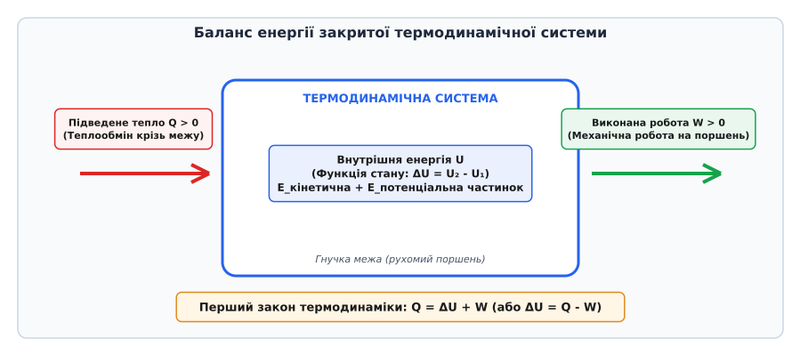
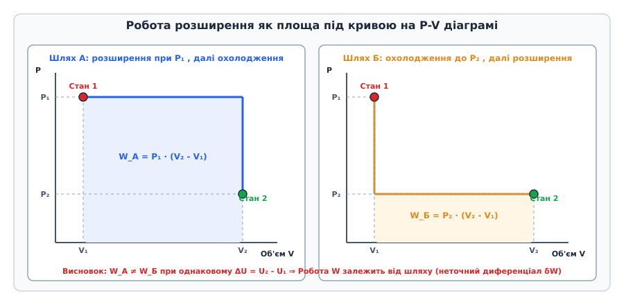
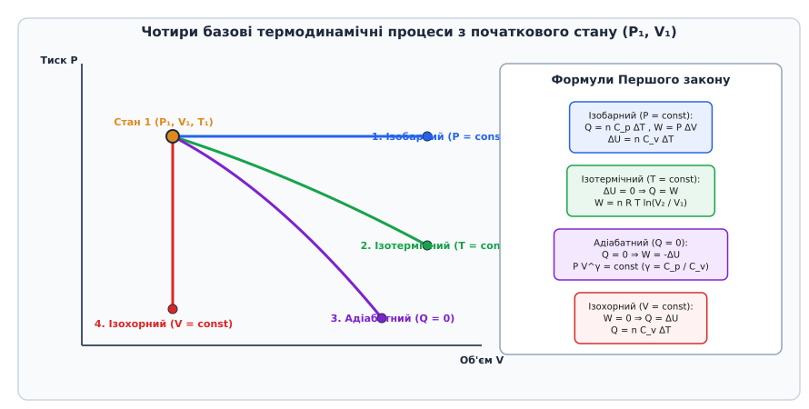
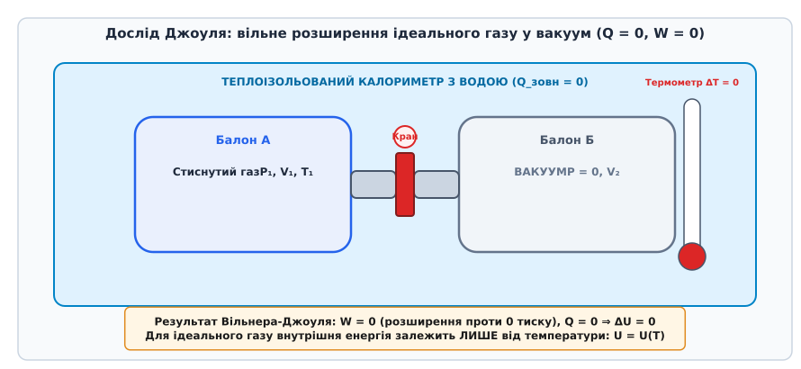

# Перший закон термодинаміки

<preknowlist>
- [Закон збереження енергії](topic:physics/energy-conservation) — фундаментальний принцип незнищенності та перетворення механічної енергії.
- [Рівняння стану ідеального газу](topic:physics/thermal-statistical/ideal-gas-law) — зв'язок між макроскопічними параметрами тиску, об'єму та температури.
- [Ступені вільності](topic:physics/degrees-of-freedom) — класифікація молекулярних рухів та розподіл кінетичної енергії по координатах.
- [Теорема про рівнорозподіл](topic:physics/equipartition-theorem) — зв'язок між температурою та середньою кінетичною енергією на ступінь вільності.
- [Теплопередача](topic:physics/heat-transfer) — механізми мікроскопічного обміну тепловою енергією між тілами.
</preknowlist>

У дизельному двигуні поршень стискає повітря у циліндрі від початкового об'єму 0.8 літра до 0.04 літра лише за 5 мілісекунд. Через надзвичайно малу тривалість процес відбувається практично без витоку тепла крізь металеві стінки: температура повітряної суміші підскакує від 300 до 900 кельвінів, а тиск зростає з 0.1 до 4.5 мегапаскалів. Упорскуване у цей момент дизельне паливо самозаймається без жодної свічки запалювання. Уся механічна робота, витрачена зовнішніми силами на швидке стиснення газу, повністю перетворюється на хаотичний кінетичний рух його молекул, збільшуючи внутрішню енергію середовища. Коли ж розпечені гази розширюються, вони повертають цю енергію назад, виконуючи роботу над колінчастим валом автомобіля. 

За цим і будь-яким іншим термодинамічним процесом — від роботи парової турбіни електростанції до охолодження процесора в криогенній установці — стоїть фундаментальний закон природи. **Перший закон термодинаміки** є поширенням загального закону збереження та перетворення енергії на термодинамічні системи, де поряд із механічною роботою вирішальну роль відіграють теплові явища та внутрішній стан речовини.

---

### 1. Внутрішня енергія як функція стану системи

Щоб сформулювати закон збереження енергії для макроскопічних тіл, необхідно розділити енергію на дві категорії: зовнішню (механічну енергію руху тіла як єдиного цілого та його потенціальну енергію у зовнішніх полях) та внутрішню (енергію, приховану всередині самого середовища).

**Внутрішня енергія (`U`)** термодинамічної системи — це повна енергія всіх мікроскопічних частинок (атомів, молекул, іонів, електронів), з яких складається середовище, обчислена в системі відліку, де центр мас системи є нерухомим.

До складу внутрішньої енергії входять:
1. **Поступальна кінетична енергія** хаотичного руху молекул як цілісних частинок, яка безпосередньо визначає абсолютну температуру середовища.
2. **Обертальна кінетична енергія** жорстких або напівжорстких молекулярних каркасів навколо своїх осей симетрії.
3. **Коливальна кінетична та потенціальна енергія** внутрішньомолекулярних атомних осциляцій вздовж хімічних зв'язків.
4. **Потенціальна енергія міжмолекулярної взаємодії** (електростатичні сили притягання Ван дер Ваальса та короткодійне відштовхування електронних оболонок при зближенні).
5. **Внутрішньоатомна та внутрішньоядерна енергія** (енергія зв'язку електронів з ядрами, енергія хімічних валентних зв'язків та нуклонні сили всередині атомних ядер).

У термодинамічних процесах без перебігу хімічних або ядерних реакцій внутрішньоатомні та ядерні складові залишаються суворо незмінними. Внаслідок цього під зміною внутрішньої енергії `ΔU` в класичній термодинаміці розуміють виключно зміну кінетичної енергії хаотичного теплового руху частинок та потенціальної енергії взаємодії між ними.


*Схема балансу енергії закритої термодинамічної системи: вхідне тепло Q збільшує внутрішню енергію U та витрачається на виконання механічної роботи W.*

#### Головна властивість внутрішньої енергії: функція стану
Найважливішою фундаментальною рисою внутрішньої енергії є те, що вона є **функцією стану** (*state function*). Це означає, що значення `U` однозначно визначається поточним макроскопічним станом системи (наприклад, її температурою, тиском та об'ємом) і абсолютно **не залежить від того, яким саме шляхом або внаслідок якої історії процесів система потрапила у цей стан**.

Якщо система переходить із початкового стану 1 (характеризованого параметрами `P₁, V₁, T₁`) у кінцевий стан 2 (`P₂, V₂, T₂`), зміна внутрішньої енергії `ΔU` завжди дорівнює різниці її кінцевого та початкового значень:

```
ΔU = U₂ - U₁
```

З математичного погляду нескінченно малий приріст внутрішньої енергії `dU` є **точним диференціалом** (*exact differential*). Для будь-якої неперервної функції стану `U(T, V)` виконується умова симетрії Шварца для мішаних похідних. Якщо провести систему через довільний коловий термодинамічний цикл, повернувши її у вихідну точку, сумарна зміна внутрішньої енергії буде строго дорівнювати нулю:

```
∮ dU = 0
```

Про виникнення концепції внутрішньої енергії та про те, як експерименти із висвердлюванням гарматних стволів і вимірювання тертя у пивоварних калориметрах зруйнували уявлення про невагомий «теплород», можна прочитати в історично-довідковому розділі [📜 Історія збереження енергії: Джоуль, Маєр та Гельмгольц](topic:physics/first-law-thermodynamics/hist-joule-meyer-helmholtz.md).

---

### 2. Двояка природа передачі енергії: Теплота та Робота

Зміна внутрішньої енергії системи може відбуватися лише внаслідок енергетичної взаємодії з навколишнім середовищем. Термодинаміка розрізняє **два якісно відмінних механізми передачі енергії** крізь межу системи: механічну роботу та теплоту.

#### Механічна робота (`W`)
**Робота** — це макроскопічний, упорядкований спосіб передачі енергії, пов'язаний із переміщенням меж системи або дією зовнішніх сил (переміщення поршня, обертання вала, перенесення електричного заряду у полі). 

Коли газ розширюється у циліндрі й тисне на поршень із силою `F = P · A`, при малому переміщенні поршня `dx` виконується елементарна механічна робота:

```
δW = F · dx = (P · A) · dx = P · dV
```

Тут `dV = A · dx` — зміна об'єму системи. Загальна робота при зміні об'єму від `V₁` до `V₂` дорівнює інтегралу:

```
W = ∫[від V₁ до V₂] P · dV
```

На мікроскопічному рівні виконання роботи розширення означає, що молекули газу відбиваються від поршня, який рухається назустріч або від них. При відбиванні від рухомого поршня нормальна складова швидкості молекули змінюється: якщо поршень віддаляється зі швидкістю `u_поршня`, відбита молекула втрачає кінетичну енергію, передаючи її поршню. Усереднення цього ефекту за мільярдами зіткнень точно дає макроскопічну роботу розширення `P · dV`.

На діаграмі `P-V` (тиск — об'єм) робота чисельно дорівнює **площі під кривою процесу**.


*Геометричний зміст роботи розширення: площа під кривою на P-V діаграмі залежить від траєкторії процесу (Шлях А виконує більшу роботу, ніж Шлях Б).*

#### Теплота (`Q`)
**Теплота (теплообмін)** — це мікроскопічний, хаотичний спосіб передачі енергії на рівні безпосередніх зіткнень частинок двох тіл, що контактують і мають різну температуру. 

При теплообміні не відбувається макроскопічного переміщення меж системи: швидші молекули гарячого тіла під час хаотичних пружних зіткнень передають частину своєї кінетичної енергії повільнішим молекулам холодного тіла.

#### Фундаментальна відмінність: процесові величини проти функцій стану
На відміну від внутрішньої енергії `U`, **ані робота `W`, ані теплота `Q` не є функціями стану**. Неможливо сказати, що система «містить у собі 1000 Джоулів тепла» або «має запас роботи у 500 Джоулів». Робота і теплота існують лише **під час самого процесу передачі енергії**.

Як видно з фігури вище, якщо перевести газ зі стану 1 у стан 2 двома різними шляхами (Шлях А через високий тиск та Шлях Б через низький тиск), площа під кривою — а отже, і виконана робота `W` — буде різною:

```
W_A ≠ W_Б
```

З огляду на це, елементарні порції тепла `δQ` та роботи `δW` є **неточними диференціалами** (*inexact differentials*). 

Детальний математичний аналіз форм Пфаффа, умов точного диференціала та доказ того, чому циклічні інтеграли тепла й роботи не дорівнюють нулю `∮ δQ = ∮ δW = W_циклу ≠ 0`, наведено у математичному розборі [🧮 Математичний апарат першого закону: диференціальні форми, неточні диференціали та рівняння Майєра](topic:physics/first-law-thermodynamics/math-first-law-derivation.md).

#### Формулювання Першого закону термодинаміки
На основі фундаментального закону збереження енергії: **зміна внутрішньої енергії закритої термодинамічної системи дорівнює різниці між кількістю підведеного до системи тепла та кількістю роботи, виконаної системою проти зовнішніх сил**.

У скінченних приростах:

```
ΔU = Q - W
```

або у більш звичній для інженерної практики формі балансу тепла:

```
Q = ΔU + W
```

У диференціальній формі для нескінченно малого процесу:

```
δQ = dU + δW = dU + P · dV
```

Ця формула має чіткий фізичний зміст: **теплота `Q`, підведена до системи, витрачається на дві потреби — на збільшення її внутрішньої енергії `ΔU` (нагрівання тіла) та на виконання зовнішньої механічної роботи `W` (розширення об'єму)**.

> ⚠️ **Увага на конвенцію знаків.** Зазначена вище форма `Q = ΔU + W` стосується класичної **інженерної конвенції (Клаузіуса)**, де робота `W > 0` вважається додатною, коли її виконує сама система (розширення). У фізико-хімічній конвенції **IUPAC** під роботою розуміють роботу `W_IUPAC`, виконану *над* системою зовнішніми силами (`W_IUPAC = -W`), тому Перший закон записують у вигляді `ΔU = Q + W_IUPAC`. Повний порівняльний аналіз обидвох систем та специфікацію стандартів наведено в довіднику [📋 Інтерфейс та структура даних термодинамічного розв'язувача](topic:physics/first-law-thermodynamics/api-thermo-solver.md).

---

### 3. Застосування Першого закону до базових термодинамічних процесів

Застосування Першого закону до чотирьох класичних ізопроцесів ідеального газу демонструє, як саме передане тепло розподіляється між нагріванням середовища та виконуваними механічними зусиллями.


*Порівняння чотирьох класичних процесів ідеального газу на P-V діаграмі з початкового стану (P₁, V₁).*

#### 1. Ізохорний процес (`V = const`)
Коли об'єм газу залишається незмінним (`dV = 0`), газ не переміщує межі системи й не виконує механічної роботи:

```
W = ∫ P · dV = 0
```

Перший закон термодинаміки набуває вигляду:

```
Q = ΔU
```

Усі 100% підведеного тепла витрачаються виключно на збільшення внутрішньої енергії газу (його нагрівання). Кількість тепла для `n` молей газу виражається через молярну ізохорну теплоємність `C_v`:

```
Q = n · C_v · (T₂ - T₁)
```

#### 2. Ізобарний процес (`P = const`)
При сталому тиску газ розширюється при нагріванні й виконує механічну роботу:

```
W = P · (V₂ - V₁) = n · R · (T₂ - T₁)
```

Підведене тепло витрачається **і на нагрівання, і на розширення**:

```
Q = ΔU + W = n · C_v · (T₂ - T₁) + n · R · (T₂ - T₁)
Q = n · (C_v + R) · (T₂ - T₁)
```

Ввівши молярну ізобарну теплоємність `C_p`, маємо `Q = n · C_p · (T₂ - T₁)`. Звідси безпосередньо випливає знамените **рівняння Майєра**:

```
C_p - C_v = R
```

Різниця молярних теплоємностей `C_p - C_v` точно дорівнює газовій сталій `R`: вона показує додаткову роботу розширення, яку має виконати 1 моль газу при ізобарному нагріванні на 1 Кельвін.

#### 3. Ізотермічний процес (`T = const`)
Оскільки для ідеального газу внутрішня енергія залежить лише від температури, при `T = const` зміна внутрішньої енергії дорівнює нулю:

```
ΔU = 0
```

Перший закон термодинаміки спрощується до умови повної конверсії тепла у роботу:

```
Q = W = n · R · T · ln(V₂ / V₁)
```

Усі 100% підведеного від термостата тепла миттєво перетворюються на механічну роботу розширення газу. При цьому температура середовища лишається незмінною.

#### 4. Адіабатний процес (`Q = 0`)
Адіабатний процес відбувається у суворо теплоізольованій системі або настільки швидко, що теплообмін із довкіллям не встигає відбутися (`Q = 0`).

Перший закон набуває вигляду:

```
0 = ΔU + W   ⇒   W = -ΔU
```

Газ виконує механічну роботу розширення **виключно за рахунок зменшення власної внутрішньої енергії**. Внаслідок цього при адіабатному розширенні газ стрімко охолоджується:

```
W = n · C_v · (T₁ - T₂)
```

Зв'язок між тиском та об'ємом описується **рівнянням Пуассона**:

```
P · V^γ = const
```

де `γ = C_p / C_v` — показник адіабати (коефіцієнт Пуассона). Оскільки `γ > 1`, крива адіабати на `P-V` діаграмі спадає значно стрімкіше, ніж ізотерма.

---

### 4. Дослід Джоуля та вільне розширення газу: залежність U(T)

Питання про те, від яких саме макроскопічних параметрів залежить внутрішня енергія `U`, стало предметом класичного експерименту Джеймса Прескотта Джоуля (1845).


*Схема досліду Гей-Люссака — Джоуля з вільним розширенням газу у вакуумований балон всередині калориметра.*

У калориметричну ванну з водою помістили два мідних балони, з'єднаних трубкою з краном:
- У балоні А містилося стиснуте повітря під тиском 22 атмосфери.
- З балона Б повітря було повністю відкачане (вакуум).

Коли кран відкрили, газ із балона А безперешкодно й стрімко розширився у порожній балон Б, поки тиск в обох посудинах не зрівнявся.

Джоуль виміряв температуру води у калориметрі до і після розширення за допомогою високоточного термометра й виявив, що **температура води взагалі не змінилася** (`ΔT_калориметра = 0`).

Аналіз цього результату за допомогою Першого закону термодинаміки дає фундаментальні висновки:
1. Оскільки вода не змінила температури, теплообмін між газом і калориметром був відсутній: `Q = 0`.
2. Оскільки газ розширювався у порожнечу (де зовнішній тиск `P_зовн = 0`), він не переміщував жодних зовнішніх тіл і не виконував роботи проти зовнішніх сил: `W = 0`.
3. З Першого закону `ΔU = Q - W = 0 - 0 = 0`.

Внутрішня енергія газу під час вільного розширення у вакуум залишилася абсолютно незмінною (`U₂ = U₁`), незважаючи на те, що об'єм газу зростав удвічі (`V₂ > V₁`), а тиск упав.

#### Закон Джоуля для ідеального газу
Звідси випливає фундаментальний **закон Джоуля**: **внутрішня енергія ідеального газу залежить виключно від його абсолютної температури `T` і не залежить від об'єму `V` чи тиску `P`**:

```
(∂U / ∂V)_T = 0
U = U(T)
```

#### Ефекти у реальних газах та термодинамічний внутрішній тиск
Для реальних газів це припущення є лише наближенням. У молекулах реального газу існують сили міжмолекулярного притягання Ван дер Ваальса. Потенціальна енергія міжмолекулярної взаємодії від'ємна й залежить від середньої відстані між молекулами, тобто від об'єму `V`.

Для реального газу Ван дер Ваальса рівняння стану має вигляд:

```
(P + a / V²) · (V - b) = R · T
```

Поправка `a / V²` характеризує **внутрішній тиск**, зумовлений ван-дер-ваальсовим притяганням частинок. Частинна похідна внутрішньої енергії реального газу за об'ємом не дорівнює нулю:

```
(∂U / ∂V)_T = a / V²
```

При вільному розширенні реального газу у вакуум без підведення тепла (`Q = 0`, `W = 0`, `ΔU = 0`) внутрішня потенціальна енергія зростає через розсування молекул на більшу відстань. Оскільки `U = U_кінет + U_потенц = const`, зростання потенціальної енергії неминуче викликає падіння кінетичної енергії молекул — а отже, реальний газ при вільному розширенні **охолоджується**:

```
ΔT = - (a / C_v) · (1/V₁ - 1/V₂)
```

Це явище лежить в основі дроселювання реальних газів та **ефекту Джоуля — Томсона**, який широко застосовують у кріогенній техніці для скраплення азоту, кисню та гелію.

---

### 5. Ентальпія та Перший закон для відкритих систем із потоком

У промислових теплових машинах — парових котлах, авіаційних турбінах, компресорах холодильників та хладагентних контурах — робоче тіло не заперте у закритій судині, а неперервно протікає крізь систему.

Для опису таких ізобарних та проточних процесів зручно ввести нову функцію стану — **ентальпію (`H`)** (від грецького *thalpein* — нагрівати).

**Ентальпія** визначається як сума внутрішньої енергії системи та добутку її тиску на об'єм:

```
H = U + P · V
```

Диференціал ентальпії дорівнює:

```
dH = dU + d(P · V) = dU + P · dV + V · dP
```

Підставивши Перший закон термодинаміки `dU = δQ - P · dV`:

```
dH = (δQ - P · dV) + P · dV + V · dP = δQ + V · dP
```

При сталому тиску (`dP = 0`) зміна ентальпії строго дорівнює підведеному теплу:

```
dH = δQ_P     (або   ΔH = Q_P)
```

Фізичний зміст ентальпії: **ентальпія `H` виражає повний енергетичний запас середовища, яке перебуває під тиском `P`, включаючи як його власну внутрішню енергію `U`, так і потенціальну енергію витискання `P·V`, необхідну для впровадження цього об'єму в навколишній простір**.

#### Перший закон для стаціонарного потоку (Рівняння енергії потоку)
Для відкритої системи (контрольного об'єму), крізь яку зі масовою витратою протікає газ або рідина, Перший закон термодинаміки на одиницю маси потоку записується у вигляді:

```
q - w_техн = (h₂ - h₁) + ½ · (v₂² - v₁²) + g · (z₂ - z₁)
```

Тут:
- `q` — питоме тепло, передане потоку від зовнішніх джерел [Дж/кг];
- `w_техн` — питома **технічна робота**, знята з вала турбіни або підведена від компресора [Дж/кг];
- `h₂ - h₁` — зміна питомої ентальпії середовища [Дж/кг];
- `½ (v₂² - v₁²)` — зміна кінетичної енергії макроскопічного руху потоку зі швидкістю `v` [Дж/кг];
- `g (z₂ - z₁)` — зміна потенціальної енергії потоку в полі тяжіння на висоті `z` [Дж/кг].

#### Практичні застосування для апаратів:
1. **Газова або парова турбіна:** Теплоізольований корпус (`q ≈ 0`), швидкість і висота міняються мало (`ΔE_кінет ≈ 0`). Робота на валу виробляється прямо за рахунок падіння ентальпії пара чи газу: `w_техн = h₁ - h₂`.
2. **Компресор або насос:** Зовнішній електродвигун виконує технічну роботу `w_техн`, яка витрачається на підвищення ентальпії середовища: `h₂ - h₁ = w_техн`.
3. **Сопло ракетного або авіаційного двигуна:** Теплообмін і робота відсутні (`q = 0`, `w_техн = 0`). Падіння ентальпії газу при розширенні розганяє потік до надзвукових швидкостей: `½ v₂² = h₁ - h₂`.
4. **Дросельний вентиль (ефект Джоуля — Томсона):** При протіканні крізь вузьку пористу перегородку чи клапан робота не знімається, теплообмін відсутній (`q = 0`, `w = 0`). Ентальпія потоку до і після клапана є однаковою: `h₁ = h₂` (**ізоентальпійний процес**).

#### Нестаціонарні відкриті системи
Для нестаціонарних процесів (наприклад, заповнення порожнього балона газом із магістралі високого тиску) Перший закон термодинаміки вимагає інтегрування за часом:

```
dU_sys / dt = dQ / dt - dW / dt + ∑ m_in · h_in - ∑ m_out · h_out
```

При заповненні балона з магістралі з ентальпією `h_in` без теплообміну (`Q = 0`) та без виконання зовнішньої роботи (`W = 0`) остаточна внутрішня енергія газу у балоні дорівнює ентальпії підведеного газу: `U_кінцева = m · h_in`. Оскільки для ідеального газу `h = C_p · T`, температура газу всередині заповненого балона зростає у `γ = C_p / C_v` разів порівняно з температурою в магістралі (для повітря при 300 К температура у балоні підскакує до 420 К лише за рахунок роботи витискання з магістралі).

---

### 6. Мікроскопічні джерела та ступені вільності

З погляду статистичної фізики Перший закон термодинаміки зв'язує макроскопічний баланс енергії із мікроскопічним розподілом енергії за ступенями вільності молекул.

Згідно з **теоремою про рівнорозподіл**, на кожен поступальний та обертальний ступінь вільності молекули у термодинамічній рівновазі припадає середня кінетична енергія, що дорівнює `½ k_B T`.

Якщо молекула має `i` ефективних ступенів вільності, то внутрішня енергія 1 моля ідеального газу дорівнює:

```
U = (i / 2) · N_A · k_B · T = (i / 2) · R · T
```

Звідси молярні теплоємності виражаються через число ступенів вільності `i`:

```
C_v = (∂U / ∂T)_V = (i / 2) · R
C_p = C_v + R = ((i + 2) / 2) · R
```

Показник адіабати `γ`:

```
γ = C_p / C_v = (i + 2) / i
```

#### Залежність від атомності газу:
1. **Одноатомні гази (He, Ne, Ar):** Молекули є точковими атомами із 3 поступальними ступенями вільності (`i = 3`).
   - `C_v = 1.5 R ≈ 12.47 Дж/(моль·К)`
   - `C_p = 2.5 R ≈ 20.78 Дж/(моль·К)`
   - `γ = 5 / 3 ≈ 1.667`
2. **Двохатомні гази (N₂, O₂, повітря при 300 К):** Молекули мають 3 поступальних та 2 обертальних ступені вільності (`i = 5`).
   - `C_v = 2.5 R ≈ 20.79 Дж/(моль·К)`
   - `C_p = 3.5 R ≈ 29.10 Дж/(моль·К)`
   - `γ = 7 / 5 = 1.400`
3. **Багатоатомні гази (CO₂, H₂O, CH₄):** Молекули мають 3 поступальних та 3 обертальних ступені вільності (`i = 6`).
   - `C_v = 3 R ≈ 24.94 Дж/(моль·К)`
   - `C_p = 4 R ≈ 33.26 Дж/(моль·К)`
   - `γ = 8 / 6 ≈ 1.333`

#### Квантове виморожування ступенів вільності
Класична теорема про рівнорозподіл не пояснює, чому при низьких температурах теплоємність газів падає. Квантова механіка показує, що обертальні та коливальні рівні енергії є квантованими. 

Якщо теплова енергія `k_B T` значно менша за відстань між квантовими рівнями `ΔE = ℏ ω`, даний рух не збуджується («виморожується»). Для молекули водню `H₂`:
- При `T < 50 К` обертання виморожуються, і водень поводиться як одноатомний газ з `i = 3` (`C_v = 1.5 R`).
- При `T ≈ 300 К` працюють поступальні й обертальні рухи (`i = 5`, `C_v = 2.5 R`).
- При `T > 2000 К` додатково збуджуються коливання вздовж зв'язку `H-H` (`i = 7`, `C_v = 3.5 R`).

---

### 7. Термодинамічні цикли та Перший закон у розробці двигунів

Будь-яка теплова машина (паровий двигун, дизель, турбіна чи холодильник) працює за замкненим термодинамічним циклом, періодично повертаючи робоче тіло у початковий стан.

Оскільки для замкненого циклу сумарна зміна внутрішньої енергії дорівнює нулю `∮ dU = 0`, з Першого закону термодинаміки випливає:

```
W_мережеве = Q_підведене - Q_відведене = Q_in - Q_out
```

Корисна механічна робота `W_мережеве`, виконана двигуном за один цикл, строго дорівнює різниці між теплотою `Q_in`, отриманою від гарячого нагрівача, та теплотою `Q_out`, відданою холодному холодильнику.

Термічний коефіцієнт корисної дії (ККД) `η` будь-якого теплового двигуна визначається як:

```
η = W_мережеве / Q_in = (Q_in - Q_out) / Q_in = 1 - (Q_out / Q_in)
```

Для чисельного розрахунку циклів Карно, Отто та Дизеля, обчислення ККД та моделювання термодинамічних станів створено програмний інструментарій, описаний у практичному розборі [⚙️ Чисельне моделювання термодинамічних процесів і циклів](topic:physics/first-law-thermodynamics/proj-thermo-cycle-sim.md).

> 🔧 **Навіщо це.** Перший закон термодинаміки є головним інструментом складання **енергетичного балансу** при проектуванні теплотехнічного обладнання. Він гарантує, що жоден джоуль енергії не може з'явитися нізвідки чи зникнути безвісти: кожен ват електричної потужності чи хімічної енергії палива повинен бути строго розподілений між корисною роботою, нагріванням носія та тепловими втратами у довкілля.

#### Термодинамічні фазові переходи та прихована теплота
Ще одним фундаментальним підтвердженням двокомпонентної структури внутрішньої енергії є фазові переходи першого роду (плавлення, кристалізація, випаровування, конденсація).

Під час кипіння води при атмосферному тиску її температура залишається суворо сталою (`T = 373.15 K = const`), незважаючи на те, що нагрівач неперервно підводить колосальну кількість тепла `Q = m · L` (де `L ≈ 2.26 МДж/кг` — питома теплота випаровування). 

Оскільки температура не змінюється, середня поступальна кінетична енергія молекул водяної пари дорівнює кінетичній енергії молекул рідкої води при цій же температурі. Виникає питання: куди дівається підведене тепло?

Перший закон термодинаміки дає чітку відповідь: підведене тепло витрачається на дві цілі:
1. **Збільшення потенціальної енергії взаємодії (`ΔU_потенц`):** Підведене тепло витрачається на виконання роботи проти міжмолекулярних сил притягання, розриваючи водневі зв'язки між молекулами рідкої води та розсуваючи їх на відстані, у сотні разів більші за молекулярні діаметри.
2. **Зовнішня робота розширення (`W_розшир`):** При випаровуванні об'єм речовини зростає більш ніж у 1600 разів (`V_пари >> V_рідини`), тому пара виконує значну роботу розширення проти зовнішнього атмосферного тиску: `W = P · (V_пари - V_рідини)`.

Таким чином, для фазового переходу Перший закон набуває вигляду `Q = ΔU_потенц + P · ΔV`. Це демонструє, що при сталих температурах підведене тепло може повністю перетворюватися на потенціальну енергію міжмолекулярних зв'язків середовища.

---

### 8. Адіабатні процеси в атмосфері Землі та астрофізиці

Яскравим природним прикладом дії Першого закону термодинаміки є адіабатні процеси у земній атмосфері та космічних масштабах.

#### Атмосферний адіабатний градієнт
Коли вертикальний потік повітря піднімається вгору, зовнішній атмосферний тиск спадає. Повітряний об'єм розширюється й виконує роботу проти навколишнього середовища. Оскільки повітря є поганим провідником тепла, а об'єми підйому великі, процес відбувається практично адіабатно (`Q ≈ 0`).

Згідно з Першим законом, розширення повітряного об'єму супроводжується зниженням його внутрішньої енергії та температури. Розрахунок адіабатного градієнта температури для сухого повітря дає:

```
dT / dz = - g / C_p ≈ - 9.8 K / км
```

Це означає, що при підйомі на кожні 100 метрів температура сухого повітря знижується приблизно на 1 Кельвін. Коли температура падає до точки роси, водяна пара конденсується, формуючи хмари та виділяючи приховану теплоту фазового переходу, що змінює адіабатний градієнт до `~6 К/км` (вологоадіабатний процес).

#### Космологічне розширення та реліктове випромінювання
У масштабних астрофізичних процесах — таких як розширення Всесвіту або колапс протозоряних хмар — Перший закон термодинаміки визначає еволюцію температури речовини та випромінювання. При розширенні метагалактичного простору газ фотонів реліктового випромінювання розширюється адіабатно. Робота розширення фотонного газу зменшує його внутрішню енергію, внаслідок чого температура реліктового фону знижується обернено пропорційно масштабу фактора Всесвіту `T ~ 1 / a(t)`.

---

### 9. Межі Першого закону та перехід до Другого закону

Попри свою фундаментальність та абсолютну строгість, Перший закон термодинаміки має одне суттєве обмеження: **він є законом збереження, але не вказує напрямку самовільного перебігу процесів**.

З погляду Першого закону термодинаміки однаково можливими є такі явища:
- Камінь, що лежить на землі, самовільно охолоджується, забирає тепло з ґрунту й підскакує вгору на 10 метрів, перетворюючи тепло у потенціальну енергію.
- Гаряча чашка кави самовільно забирає тепло з кімнати й закипає.
- Тепловий двигун забирає тепло у океану й повністю (зі 100% ККД) перетворює його на роботу без відведення тепла до холодильника (вічний двигун другого роду).

Жоден із цих процесів **не порушує Перший закон термодинаміки**, адже загальний баланс енергії в усіх випадках строго зберігається! 

Проте повсякденний досвід та експерименти свідчать: тепло самовільно переходить лише від гарячих тіл до холодних, а механічна робота може повністю перетворюватися на тепло через тертя, але зворотний процес перетворення хаотичного тепла у роботу без залишкових змін у довкіллі є неможливим.

Необхідність встановлення критерію напрямку процесів та оборотності явищ привела до відкриття нової фундаментальної величини — **ентропії** — та формування **Другого закону термодинаміки**.
