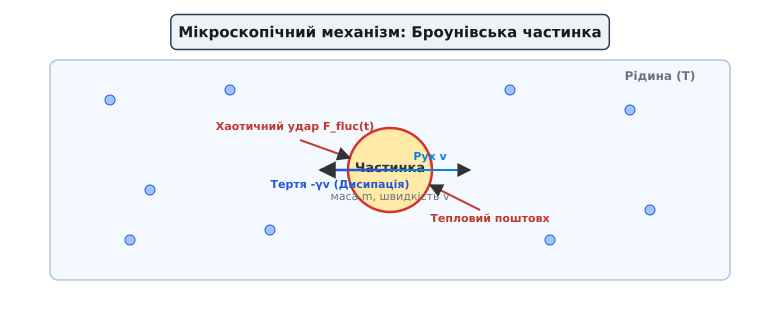
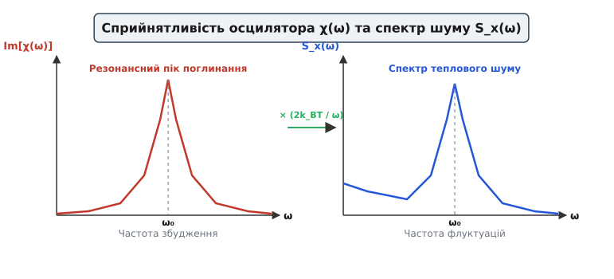
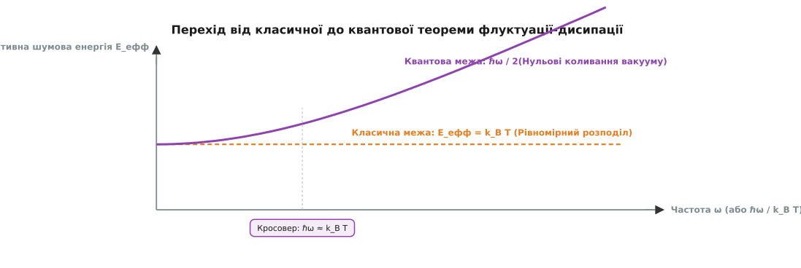

# Теорема флуктуацій і дисипації: фундаментальний місток між теплом і реакцією системи

<preknowlist>
- [Броунівський рух](topic:physics/brownian-motion) — хаотичне тремтіння мікрочастинки під ударами молекул середовища.
- [Тепловий шум Джонсона—Найквіста](topic:physics/thermal-noise) — флуктуації напруги в резисторі як окремий випадок теореми.
- [Больцманівський фактор і масштаб kT](topic:physics/boltzmann-factor) — ймовірність теплових станів та масштаб енергії kT.
- [Гармонічний осцилятор](topic:physics/harmonic-oscillator) — модель лінійного відгуку фізичної системи.
</preknowlist>

Спроба створити абсолютно «безшумну» механічну чи електричну систему впирається у нездоланну стіну, поставлену фундаментальними законами термодинаміки. Висяче підвісне дзеркало надчутливого гравітаційного детектора LIGO спонтанно тремтить, пелюстка атомарно-силового мікроскопа здійснює хаотичні коливання, а звичайний електричний опір, що лежить на столі й ні до чого не під'єднаний, безперервно генерує шумові сплески напруги. Це тремтіння не є результатом дефекту матеріалу, поганого паяння чи зовнішніх акустичних завад. Якщо фізична система здатна **поглинати енергію** під дією зовнішньої сили (тобто дисипувати її в тепло у вигляді опору чи тертя), вона **зобов’язана спонтанно тремтіти** при будь-якій температурі, вищій за абсолютний нуль.

Цей фундаментальний двосторонній зв'язок між спонтанними термодинамічними флуктуаціями (від латинського *fluctuatio* — збурення, коливання) та незворотною дисипацією (від латинського *dissipatio* — розсіювання енергії) встановлює **теорема флуктуацій і дисипації** (ТФД). Вона стверджує: реакція системи на слабке зовнішнє збудження повністю визначається статистичними характеристиками її власних спонтанних шумових флуктуацій у стані термодинамічної рівноваги.

---

### 1. Спонтанне тремтіння й зовнішній опір: чому фізична система не може гальмувати без шуму

Щоб збагнути, чому фізичні процеси гальмування та флуктуацій нерозривно пов'язані, розглянемо мікроскопічний механізм теплової рівноваги. Будь-яка макроскопічна система — чи то Броунівська частинка у склянці води, чи то електронний газ у металевому провіднику, чи то механічний осцилятор — занурена у величезний термодинамічний резервуар мікроскопічних ступенів вільності (молекул рідини, фононів кристалічної ґратки, фотонів електромагнітного поля).


*Броунівська частинка у рідині при температурі T. Хаотичні поштовхи молекул F_fluc(t) породжують випадкове тремтіння (флуктуацію), а додаткові зіткнення при макроскопічному русі зі швидкістю v утворюють силу в'язкого тертя -γv (дисипацію). Взаємодія здійснюється через одні й ті самі молекулярні зіткнення.*

Уявімо масивну частинку масою `m`, яка рухається у рідині зі швидкістю `v`. Під час руху вона частіше зіштовхується з молекулами рідини, що летять їй назустріч, ніж із тими, що доганяють її ззаду. Внаслідок цієї кінетичної асиметрії виникає макроскопічна сила в'язкого тертя `F_тер = -γ · v`, яка гальмує частинку й перетворює її впорядкований механічний рух на хаотичний тепловий рух молекул середовища. Це процес **дисипації**.

Тепер уявимо, що частинка зупинилася (`v = 0`). Молекули рідини продовжують безперервно бомбардувати її з усіх боків. У середньому за довгий проміжок часу сила цих ударів дорівнює нулю, оскільки у середовищі немає переважного напрямку. Але в кожну окрему мить кількість ударів із лівого боку може виявитися трохи більшою, ніж із правого. Цей випадковий флуктуаційний дисбаланс створює стохастичну силу `ξ(t)`, яка змушує частинку хаотично тремтіти й зміщуватися. Це процес **флуктуації**.

Ключова ідея полягає в тому, що і макроскопічна сила тертя `-γ · v`, і випадкова сила `ξ(t)` виникають через **один і той самий мікроскопічний механізм** — зіткнення з тими самими молекулами середовища. Тепловий резервуар фізично не може «вимкнути» хаотичні удари, залишивши лише в'язке гальмування, або навпаки.

З точки зору Гамільтонової механіки мікроскопічні рівняння руху всіх атомів середовища є строго часово-оборотними. Однак при переході до макроскопічного опису, коли ми усереднюємо по астрономічній кількості ступенів вільності, виникає незворотна дисипація. Тепловий резервуар поглинає механічну енергію макроскопічної моди й розсіює її по незліченних мікроскопічних модах. Але оскільки у стані термодинамічної рівноваги енергія повинна циркулювати між макромодою та резервуаром у двох напрямках з однаковою середньою швидкістю, резервуар зобов'язаний безперервно повертати цю енергію назад у вигляді випадкових теплових поштовхів `ξ(t)`.

У загальнішому випадку, коли середовище має скінченний час пам'яті релаксації, в'язке тертя описується не миттєвим коефіцієнтом `γ`, а інтегральним ядром пам'яті `γ(t - τ)`. Тоді узагальнене рівняння Ланжевена набуває вигляду:

```
m · (dv/dt) + ∫₋∞ᵗ γ(t - τ) · v(τ) dτ = ξ(t)
```

При цьому автокореляційна функція виражається через те саме ядро пам'яті (флуктуаційно-дисипаційне співвідношення другого роду за Марковим — Кубо):

```
⟨ξ(t) · ξ(τ)⟩ = k_B · T · γ(|t - τ|)
```

Переходячи до частотної області, спектральна густина шуму сили стає прямо пропорційною дійсній частині спектрального коефіцієнта тертя `Re[γ(ω)]`:

```
S_ξ(ω) = 2 · k_B · T · Re[γ(ω)]
```

Якщо середовище є марківським (безпам'ятним), ядро пам'яті перетворюється на дельта-функцію `γ(t - τ) = 2γ · δ(t - τ)`, а спектр шуму сили стає білим `S_ξ(ω) = 2 · γ · k_B · T`.

Досі коефіцієнт `γ` ми брали з досліду — його дає в'язкість рідини чи опір провідника. Але його можна й вивести, якщо описати резервуар явно. У моделях Роберта Цванціга (1973) та Аміра Кальдейри й Ентоні Леґґетта (1983) резервуар записують як нескінченний набір гармонічних осциляторів із частотами `ω_j`, кожен із яких лінійно чіпляється за координату нашої системи з силою `c_j`. Гамільтоніан такої моделі повністю оборотний: жодного тертя в нього не закладено, самі лише пружини. Проте якщо виключити з рівнянь руху координати всіх осциляторів резервуару, лишається рівно узагальнене рівняння Ланжевена, записане вище, — а коефіцієнт тертя виявляється спектральною густиною зв'язку:

```
J(ω) = (π / 2) · ∑ⱼ ( c_j² / (m_j · ω_j) ) · δ(ω - ω_j)
```

Ця величина каже, наскільки щільно моди резервуару стоять на кожній частоті й наскільки міцно вони тримаються за систему. Випадкова сила `ξ(t)` при цьому не постулюється: вона виходить сумою вільних коливань мод резервуару з початковими амплітудами, розподіленими за Больцманом. Обидві сили — і тертя, і поштовхи — вийшли з **одного й того самого доданка** гамільтоніана, і розділити їх неможливо навіть на папері. Окремий випадок `J(ω) ∝ ω` (омічний резервуар) дає саме безпам'ятне тертя з постійним `γ`.

Опишемо еволюцію функції щільності ймовірності `P(v, t)` перебування частинки у фазовому просторі за допомогою диференціального рівняння Фоккера — Планка:

```
(∂P / ∂t) = (γ / m) · (∂ / ∂v) (v · P) + (B / m²) · (∂²P / ∂v²)
```

У стаціонарному рівноважному стані (`∂P / ∂t = 0`) розв'язком цього рівняння є канонічний розподіл Максвелла — Больцмана:

```
P_eq(v) = C · exp( - (m · v²) / (2 · k_B · T) )
```

Підставляючи максвелівський розподіл у рівняння Фоккера — Планка, прямо знаходимо співвідношення між амплітудою шуму `B` та коефіцієнтом тертя `γ`: `B = γ · k_B · T`.

Якби тертя існувало без шуму (`γ > 0`, але `B = 0`), частинка віддавала б свою кінетичну енергію середовищу через гальмування, але ніколи не отримувала б енергії назад через поштовхи. Тоді її температура впала б до абсолютного нуля всередині гарячої рідини. Це безпосередньо порушило б другий закон термодинаміки та створило б вічний двигун другого роду. Натомість у стані термодинамічної рівноваги темп витоку енергії через макроскопічну дисипацію точнісінько дорівнює темпу припливу енергії через спонтанні теплові флуктуації.


*Фундаментальний місток ТФД: тепловий резервуар з температурою T пов'язує спектральну густину флуктуацій S_A(ω) та уявний відгук Im[χ(ω)].*

Зв'язок між тертям та дифузією вперше встановив Альберт Ейнштейн у 1905 році, довівши співвідношення для коефіцієнта дифузії `D = k_B · T / γ`. Детальніше про історичні етапи формування цієї концепції — від дослідів Перрена до робіт Каллена та Велтона — розповсюджено у вставці [📜 Від Броунівського руху до формули Каллена — Велтона: історія народження ТФД](topic:physics/fluctuation-dissipation/hist-nyquist-callen.md).

> 🔧 **Навіщо це.** У розробці надчутливих вимірювальних систем (наприклад, давачів кутової швидкості, оптичних інтерферометрів чи медичних магнітометрів) ТФД дозволяє точно розрахувати фундаментальну «шумову підлогу» приладу ще до його побудови. Якщо механічний елемент має внутрішнє згасання (дисипацію), він гарантовано шумітиме за ТФД. Єдиний спосіб зменшити цей шум — це або знижувати температуру `T`, або зменшувати дисипативні втрати (підвищувати добротність системи `Q`).

---

### 2. Математична мова лінійного відгуку: від сприйнятливості до поглинання енергії

Щоб надати ТФД точного кількісного математичного формулювання, необхідно ввести формалізм теорії лінійного відгуку. Розглянемо квантову або класичну фізичну систему, яка перебуває у стані термодинамічної рівноваги з Гамільтоніаном `H₀`. Нехай на цю систему діє слабке зовнішнє часозалежне збурення `h(t)` (це може бути зовнішня механічна сила, електричне поле, магнітний потік чи тиск).

Повний Гамільтоніан системи стає часозалежним: `H(t) = H₀ - h(t) · A(t)`, де `A(t)` — спостережувана фізична величина, яка є спряженою до сили `h(t)` в енергетичному сенсі (наприклад, зміщення для механічної сили, струм для напруги чи поляризація для електричного поля). У відсутності зовнішньої сили середнє значення `⟨A(t)⟩₀ = 0`.

Якщо сила `h(t)` є достатньо слабкою, відгук системи `⟨A(t)⟩` залежить від сили лінійно й описується інтегралом згортки через часову **функцію відгуку** (або причинну сприйнятливість) `χ(t)`:

```
⟨A(t)⟩ = ∫₋∞ᵗ χ(t - τ) · h(τ) dτ
```

Принцип причинності вимагає, щоб `χ(t) = 0` при `t < 0`: система не може зреагувати на зовнішню силу раніше, ніж ця сила буде прикладена.

У формалізмі матриці густини за теорією збурень першого порядку функція відгуку `χ(t)` виражається через квантовий комутатор операторів у Гейзенбергівському уявленні (формула Кубо):

```
χ(t) = (i / ℏ) · θ(t) · ⟨[A(t), A(0)]⟩₀
```

де `θ(t)` — функція Хевісайда (`θ(t) = 1` при `t > 0` і `0` при `t < 0`). У класичній границі квантовий комутатор `(i / ℏ) · [A(t), A(0)]` переходить у дужки Пуассона `{A(t), A(0)}`, а функція відгуку набуває вигляду:

```
χ(t) = - (1 / (k_B · T)) · θ(t) · (d/dt) ⟨A(t) · A(0)⟩₀
```

Ця формула Кубо є першим явним математичним містком між часовою кореляцією спонтанних флуктуацій `⟨A(t) · A(0)⟩₀` та функцією відгуку `χ(t)`.

Перейшовши до частотної області за допомогою перетворення Фур'є, інтеграл згортки перетворюється на звичайне алгебраїчне множення:

```
A(ω) = χ(ω) · h(ω)
```

де `χ(ω)` є комплексною спектральною сприйнятливістю системи:

```
χ(ω) = χ'(ω) + i · χ''(ω)
```

Дійсна частина `χ'(ω) = Re[χ(ω)]` та уявна частина `χ''(ω) = Im[χ(ω)]` мають принципово різний фізичний зміст, який визначає енергетику взаємодії системи з довкіллям:

1. **Дійсна частина `χ'(ω)` (реактивний відгук, дисперсія)** описує складову відгуку, яка здійснюється синфазно з вимушуючою силою `h(t)`. Вона відповідає за оборотне накопичення та повернення енергії у зовнішнє джерело (подібно до стискання та розтискання ідеальної пружини чи заряджання ідеального конденсатора).
2. **Уявна частина `χ''(ω)` (дисипативний відгук, поглинання)** описує складову відгуку, зсунуту за фазою на `π/2` відносно вимушуючої сили. Вона відповідає за незворотне поглинання енергії зовнішнього поля та її перетворення на тепловий рух (дисипація).

Доведемо цей факт явним розрахунком. Нехай на систему діє гармонічна сила `h(t) = h₀ · cos(ω · t)`. Миттєва потужність `P(t)`, яка передається від зовнішнього джерела до системи, дорівнює похідній від виконаної роботи за часом:

```
P(t) = dW / dt = -h(t) · (d A(t) / dt)
```

Підставляючи вирази для гармонічної сили та лінійного відгуку `A(t) = h₀ · [χ'(ω) · cos(ω·t) + χ''(ω) · sin(ω·t)]`, знайдемо середнє значення поглинаної потужності за період коливань `T_period = 2π / ω`:

```
P(ω) = (1 / T_period) · ∫₀ᵀ_period (-h₀ · cos(ω·t)) · (d/dt) [h₀ · (χ'(ω)·cos(ω·t) + χ''(ω)·sin(ω·t))] dt
= (1 / T_period) · h₀² · ω · ∫₀ᵀ_period cos(ω·t) · [χ'(ω)·sin(ω·t) - χ''(ω)·cos(ω·t)] dt
= (1/2) · ω · h₀² · Im[χ(ω)]
```

[Покрокове розкладання: інтеграл від добутку cos(ω·t)·sin(ω·t) за повний період дорівнює нулю, оскільки ця функція є непарною відносно середини періоду. Інтеграл від квадрат косинуса cos²(ω·t) за період дорівнює T_period / 2. Отже, доданок із χ'(ω) повністю обнуляється, а доданок із χ''(ω) дає чистий витік потужності]

Цей математичний висновок має фундаментальне значення: **середній темп дисипації енергії прямо пропорційний уявній частині сприйнятливості `Im[χ(ω)]`**. Якщо `Im[χ(ω)] = 0` на даній частоті, система взагалі не здатна поглинати енергію зовнішнього збудження на цієї частоті.

---

### 3. Формулювання теореми Каллена — Велтона: класичний та квантовий граничні випадки

Теорема флуктуацій і дисипації встановлює точний тотожний зв'язок між уявна частиною сприйнятливості `Im[χ(ω)]` (яка характеризує реакцію на зовнішню силу) та спектральною густиною рівноважних флуктуацій `S_A(ω)` (яка характеризує спонтанний шум у спокої).

Спектральна густина флуктуацій `S_A(ω)` виражає розподіл квадрата спонтанних коливань величини `A(t)` у частотній області й визначається як фур'є-перетворення її часової автокореляційної функції `C_A(τ) = ⟨A(t + τ) · A(t)⟩₀`:

```
S_A(ω) = ∫₋∞⁺∞ ⟨A(τ) · A(0)⟩₀ · exp(i · ω · τ) dτ
```

У 1951 році Герберт Каллен і Теодор Велтон довели універсальну співвідношення ТФД, яке у загальному квантовому випадку має вигляд:

```
S_A(ω) = ℏ · coth( ℏ · ω / (2 · k_B · T) ) · Im[χ(ω)]
```

де `ℏ` — зведена стала Планка, `k_B` — стала Больцмана, `T` — абсолютна температура, а `coth` позначає гіперболічний котангенс.


*Зв'язок між дисипативним профілем Im[χ(ω)] та спектром теплових флуктуацій S_x(ω). Кожен резонансний пік поглинання енергії відповідає піку в спектрі спонтанного шуму.*

Перепишемо фактор Каллена — Велтона через середнє число квантових збуджень Бозе — Ейнштейна `n(ω) = 1 / (exp(ℏ·ω / (k_B·T)) - 1)`:

```
coth( ℏ · ω / (2 · k_B · T) ) = 2 · n(ω) + 1 = 2 · [ 1 / (exp(ℏ·ω / (k_B·T)) - 1) + 1/2 ]
```

Підставляючи це у формулу ТФД, отримуємо вираження:

```
S_A(ω) = 2 · ℏ · [ n(ω) + 1/2 ] · Im[χ(ω)]
```

Цей вираз явно виділяє два джерела флуктуацій:
1. Доданок `n(ω)`, пропорційний показнику Бозе — Ейнштейна, описує **теплові флуктуації**, обумовлені хаотичним тепловим збудженням модам середовища.
2. Доданок `1/2` описує **нульові квантові флуктуації** (Zero-Point Fluctuations), які не залежать від температури й зберігаються навіть при абсолютному нулі.

Зручно зібрати весь температурний множник в одну величину — ефективну шумову енергію на моду `E_еф = (ℏ · ω / 2) · coth(ℏ · ω / (2 · k_B · T))`, тоді ТФД читається як «шум = `E_еф` помножена на дисипацію». Уся квантова поправка сидить у поведінці цієї єдиної функції.


*Ефективна шумова енергія на моду. На низьких частотах вона виходить на класичне плато k_B·T і від частоти не залежить; на високих — зростає лінійно як ℏω/2, і це вже не тепло, а нульові коливання. Кросовер лежить там, де ℏω ≈ k_B·T: при кімнатній температурі це близько 6 ТГц.*

#### 1. Класична границя (`ℏ · ω ≪ k_B · T`)

У класичній області низьких частот або високих кімнатних температур квантова дискретність енергії неістотна (`ℏ · ω ≪ k_B · T`). Розкладемо гіперболічний котангенс у степеневий ряд для малого аргументу `x = ℏ · ω / (2 · k_B · T) ≪ 1`:

```
coth(x) = (1 / x) + (x / 3) - (x³ / 45) + ...
```

Утримуючи лише перший головний член розкладу `coth(x) ≈ 1 / x = (2 · k_B · T) / (ℏ · ω)`, підставимо його у формулу Каллена — Велтона. Квантова стала Планка `ℏ` повністю скорочується, і ми отримуємо **класичну теорему флуктуацій і дисипації**:

```
S_A(ω) = (2 · k_B · T / ω) · Im[χ(ω)]
```

Ця формулювання має фундаментальну практичну й концептуальну цінність. Вона показує: для обчислення спектра спонтанних флуктуацій `S_A(ω)` будь-якої складної фізичної системи не потрібно аналізувати траєкторії її окремих мікроскопічних частинок — достатньо розрахувати або виміряти її макроскопічну дисипативну сприйнятливість `Im[χ(ω)]` і помножити на термодинамічний фактор `2 · k_B · T / ω`.

#### 2. Квантова границя та нульові коливання (`ℏ · ω ≫ k_B · T`)

При наднизьких кріогенних температурах (близьких до абсолютного нуля `T → 0`) або при надвисоких частотах кванти енергії стають набагато більшими за тепловий масштаб `k_B · T`. У цьому разі аргумент гіперболічного котангенса прямує до нескінченності, а сам котангенс прямує до одиниці (`coth(x) → 1`). Квантова ТФД набуває вигляду:

```
S_A(ω) = ℏ · Im[χ(ω)]
```

Цей висновок відкриває глибокий квантовий ефект: навіть при абсолютному нулі температур, коли всі теплові рухи в системі повністю заморожені, спонтанні флуктуації **не зникають**. Систему продовжують збуджувати **нульові квантові флуктуації** (Zero-Point Fluctuations), обумовлені принципом невизначеності Гайзенберга.

Цікаво, що аналогічний зв'язок між випромінюванням та поглинанням ще у 1917 році ввів Альберт Ейнштейн під час аналізу коефіцієнтів спонтанного та вимушеного випромінювання атомів (коефіцієнти А та В Ейнштейна). Спонтанне випромінювання атома у порожнині є не чим іншим, як випромінюванням під дією нульових флуктуацій вакууму, що є прямою передтечею квантової ТФД. Детальне математичне виведення квантової формули Каллена — Велтона висвітлено у вставці [🧮 Математичне виведення теореми Каллена — Велтона та квантова форма ТФД](topic:physics/fluctuation-dissipation/math-callen-welton.md).

---

### 4. Класичні втілення теореми в різних галузях фізики

Сила та універсальність ТФД полягають у тому, що вона єдиним математичним мостом поєднує явища в радіотехніці, механіці, оптиці, акустиці та нанотехнологіях.

#### 1. Електричні кола: шум Джонсона — Найквіста

Розглянемо пасивний електричний двополюсник (наприклад, металевий або вуглецевий резистор із опором `R`), який перебуває у термодинамічній рівновазі при температурі `T`.


*Еквівалентність між дисипацією електричної енергії P = U²/R та спонтанним тепловим шумом напруги S_V = 4 k_B T R.*

Якщо ми подаємо на виводи резистора зовнішню напругу `V(t)` (збурення) і вимірюємо струм `I(t)` (відгук), лінійною сприйнятливістю системи є комплексна провідність (адмітанс) `Y(ω) = 1 / Z(ω)`:

```
I(ω) = Y(ω) · V(ω)
```

Уявна частина провідності пов'язана з дійсною частиною електричного імпедансу `Re[Z(ω)] = R(ω)` співвідношенням:

```
Im[Y(ω)] / ω = Re[Z(ω)] / |Z(ω)|²
```

Застосовуючи класичну ТФД для флуктуацій напруги холостого ходу `S_V(ω)`, отримуємо точний вираз для двосторонньої спектральної густини шумової напруги:

```
S_V(ω) = 4 · k_B · T · Re[Z(ω)]
```

Для класичного резистора з омічним опором `Re[Z(ω)] = R` інтегрування односторонньої спектральної густини у смузі частот `B` дає славнозвісну формулу Найквіста:

```
U_ш(rms) = √(4 · k_B · T · R · B)
```

Загальний вираз через `Re[Z(ω)]` каже, однак, більше за цей окремий випадок: дисипує тільки активна частина імпедансу, а реактивні елементи не додають шуму — вони його **переформовують**. Візьмімо резистор `R`, зашунтований конденсатором `C`, — це вхідна ланка будь-якого підсилювача і кожного пікселя CMOS-матриці. Джерелом шуму лишається сам лише опір, але конденсатор інтегрує шумовий струм, і спектральна густина напруги на ємності стає:

```
S_U(ω) = (2 · k_B · T · R) / (1 + ω² · R² · C²)
```

Тепер проінтегруймо цю густину по всіх частотах — і `R` зникне:

```
⟨U²⟩ = (1 / 2π) · ∫₋∞⁺∞ S_U(ω) dω = k_B · T / C
```

[Інтеграл від лоренціана: ∫₋∞⁺∞ dω / (1 + ω²R²C²) = π / (R·C); множник 2·k_B·T·R / 2π скорочує опір повністю]

Опору в результаті немає взагалі. Більший `R` шумить сильніше — але й вужчою смугою, і площа під спектром лишається тією самою. Схемотехніки називають цю величину **`kTC`-шумом**, і саме вона ставить підлогу шуму скидання в кожному пікселі фотоматриці: побороти її можна більшою ємністю або нижчою температурою, але не добором резистора.

Цікаво нагадати термодинамічне доведення Найквіста 1928 року. Він розглянув два резистори з однаковим опором `R`, з'єднані ідеальною безвтратною двопровідною лінією довжиною `L`. У стані термодинамічної рівноваги електромагнітні хвилі, що біжать по лінії з ліва направо та зправа наліво, утворюють стоячі хвилі. Кількість мод у частотному інтервалі `df` дорівнює `(2L / v) df`. Оскільки на кожну моду за теоремою рівнорозподілу припадає енергія `k_B · T`, потужність переносу енергії в один бік дорівнює `k_B · T · df`. Щоб резистор поглинав і випромінював саме таку потужність в узгоджену лінію з хвильовим опором `R`, спектральна густина його шумової ЕРС повинна точно дорівнювати `4 · k_B · T · R`.

> 🔧 **Навіщо це.** Формулу Найквіста читають і в зворотний бік. Опір `R` вимірюють мостом із точністю до мільйонних часток, стала Больцмана `k_B` після ревізії СІ 2019 року — точно задане число, тож із виміряної шумової напруги абсолютна температура дістається прямо: `T = U_ш² / (4 · k_B · R · B)`. Такий термометр не треба калібрувати за іншим термометром і не треба прив'язувати до реперних точок плавлення чи потрійних точок — він **первинний**, бо спирається лише на сталу та закон. Шумова термометрія працює там, де газовий чи платиновий термометр уже безпорадний: нижче за 1 К і аж до одиниць мілікельвінів у кріостатах ядерного розмагнічування, де сама ідея «привести в контакт із еталоном» перестає працювати.

#### 2. Механічний осцилятор і Броунівський рух

Розглянемо механічний осцилятор (масою `m`, з жорсткістю пружини `k` та коефіцієнтом в'язкого тертя `γ`), який перебуває під дією зовнішньої сили `F(t)`. Рівняння руху осцилятора має вигляд:

```
m · (d²x / dt²) + γ · (dx / dt) + k · x = F(t)
```

Комплексна механічна сприйнятливість `χ(ω) = x(ω) / F(ω)` виражається формулою:

```
χ(ω) = 1 / (-m · ω² + k - i · γ · ω)
```

Домноживши чисельник і знаменник на комплексно-спряжений вираз, виділимо уявну частину сприйнятливості:

```
Im[χ(ω)] = (γ · ω) / ((k - m · ω²)² + γ² · ω²)
```

Застосовуючи класичне співвідношення ТФД `S_x(ω) = (2 · k_B · T / ω) · Im[χ(ω)]`, знаходимо точний спектр флуктуацій зміщення осцилятора:

```
S_x(ω) = (2 · k_B · T · γ) / ((k - m · ω²)² + γ² · ω²)
```

Якщо проінтегрувати цей спектр по всіх частотах від `-∞` до `+∞`, ми отримаємо повну середню квадратичну амплітуду спонтанних коливань зміщення `⟨x²⟩`:

```
⟨x²⟩ = (1 / 2π) · ∫₋∞⁺∞ S_x(ω) dω = (k_B · T) / k
```

[Аналітичний перевірочний висновок: цей результат точнісінько узгоджується з класичною теоремою рівнорозподілу енергії Больцмана — Максвелла: середня потенціальна енергія осцилятора (1/2)·k·⟨x²⟩ дорівнює (1/2)·k_B·T]

Ввівши добротність осцилятора `Q = (m · ω₀) / γ`, де `ω₀ = √(k/m)` — власна резонансна частота, спектр флуктуацій біля резонансу можна переписати у вигляді:

```
S_x(ω) ≈ (2 · k_B · T) / (m · ω₀³ · Q · [(1 - ω²/ω₀²)² + (ω / (ω₀ · Q))²])
```

Звідси чітко видно: висока добротність `Q ≫ 1` придушує тепловий шум на позарезонансних частотах, але створює високий вузький пік флуктуацій на самому резонансі `ω = ω₀`.

Приберімо тепер пружину — покладімо `k = 0`, і осцилятор стане вільною Броунівською частинкою, з якої почалася розмова. Спектр швидкості дістається зі спектра зміщення однією дією: похідна за часом — це множення на `-i·ω` у частотній області, тож `S_v(ω) = ω² · S_x(ω)`. Підставляємо `k = 0`:

```
S_v(ω) = ω² · (2 · k_B · T · γ) / (m² · ω⁴ + γ² · ω²)
       = (2 · γ · k_B · T) / (m² · ω² + γ²)
```

У цій формі видно роль інерції. Поки `ω ≪ γ/m`, знаменник тримається на `γ²`: спектр плаский, швидкість шумить білим шумом із густиною `2 · k_B · T / γ`. Вище за `γ/m` починає важити маса — частинка просто не встигає відгукнутися на короткий удар, і спектр спадає як `1/ω²`. Проінтегрувавши по всіх частотах, знову дістаємо рівнорозподіл `⟨v²⟩ = k_B · T / m`: інерція перерозподіляє шум по частотах, але повної теплової енергії в нього не забирає.

#### 3. Атомарно-силова мікроскопія (AFM)

У сучасних атомарно-силових мікроскопах вимірювання сил міжзонної взаємодії наноньютонного масштабу здійснюється за допомогою вигину мікроскопічної консолі (кантилевера). Щоб перетворити виміряне оптичним датчиком зміщення у фізичні одиниці сили, необхідно точно знати жорсткість консолі `k`.

Завдяки ТФД експериментаторам не потрібно механічно тиснути на кантилевер мікроінжекторами. Достатньо залишити кантилевер у спокої при відомій кімнатній температурі `T`, зняти спектр його теплового тремтіння `S_x(ω)` і обчислити площу під резонансним піком. Оскільки `∫ S_x(ω) dω = k_B · T / k`, жорсткість `k` розраховується безпосередньо за формулою:

```
k = (k_B · T) / ⟨x²⟩
```

Цей метод отримав назву **Thermal Noise Method** і є світовим стандартом калібрування атомарних мікроскопів.

Пройдімо цей розрахунок із реальними числами — і заразом побачимо, на що взагалі схожа «шумова підлога» м'якого кантилевера.

**Дано:** типова м'яка консоль для контактного режиму в повітрі за кімнатної температури.

```
T  = 300 К
m  = 1.0 · 10⁻¹¹ кг        (10 нанограмів — ефективна маса моди)
k  = 0.1 Н/м               (жорсткість)
γ  = 2.0 · 10⁻⁸ кг/с       (в'язке гальмування повітрям)
k_B = 1.38 · 10⁻²³ Дж/К
```

```
[Крок 1: власна частота]
ω₀ = √(k / m) = √(0.1 / 1.0·10⁻¹¹) = √10¹⁰ = 1.0 · 10⁵ рад/с
f₀ = ω₀ / 2π ≈ 15.9 кГц

[Крок 2: повне тремтіння — теорема рівнорозподілу]
⟨x²⟩ = k_B · T / k = 4.14·10⁻²¹ / 0.1 = 4.14 · 10⁻²⁰ м²
x_rms = √⟨x²⟩ ≈ 2.0 · 10⁻¹⁰ м = 0.20 нм

[Крок 3: густина шуму на низьких частотах, ω → 0]
S_x(0) = 2 · k_B · T · γ / k²
       = (2 · 1.38·10⁻²³ · 300 · 2.0·10⁻⁸) / 0.01
       = 1.656 · 10⁻²⁶ м²/Гц
√G_x(0) = √(2 · S_x(0)) ≈ 1.8 · 10⁻¹³ м/√Гц = 0.18 пм/√Гц

[Крок 4: густина шуму точно на резонансі, ω = ω₀]
При ω = ω₀ доданок (k - m·ω²) обертається в нуль, лишається сам γ²·ω₀²:
S_x(ω₀) = 2 · k_B · T / (γ · ω₀²)
        = (2 · 1.38·10⁻²³ · 300) / (2.0·10⁻⁸ · 10¹⁰)
        = 4.14 · 10⁻²³ м²/Гц
√G_x(ω₀) = √(2 · S_x(ω₀)) ≈ 9.1 пм/√Гц

[Крок 5: перевірка через добротність]
Q = m · ω₀ / γ = (10⁻¹¹ · 10⁵) / (2·10⁻⁸) = 50
Q² · S_x(0) = 2500 · 1.656·10⁻²⁶ = 4.14 · 10⁻²³ м²/Гц   — збіглося з кроком 4
```

Два числа тут варто затримати в голові. Перше: вістря кантилевера в повній тиші гуляє на два ангстреми — на діаметр атома, і жодне екранування від вібрацій цього не прибере. Друге: на резонансі шум по потужності підсилений рівно в `Q² = 2500` разів, тобто майже все тремтіння зібране у вузьку смужку коло 15.9 кГц. Обидва наслідки з одного боку заважають (силу, меншу за тепловий шум, не видно), а з другого — рятують: саме площа під цим піком, поділена на `k_B · T`, і дає обернену жорсткість, а ширина піку — добротність. Одне пасивне вимірювання видає два параметри консолі, до якої ніхто не доторкнувся.

#### 4. Гравітаційно-хвильові детектори (LIGO / Virgo)

У гігантських лазерних інтерферометрах LIGO, призначених для реєстрації гравітаційних хвиль від злиття чорних дір, зміщення дзеркал вимірюється з фантастичною точністю — менше `10⁻¹⁹` метра (1/10000 діаметра протона).

Головним обмежувальним фактором чутливості LIGO у діапазоні частот 10–500 Гц є саме тепловий шум дзеркал, який описується теоремою флуктуацій і дисипації. Дисипативні втрати виникають у діелектричних багатошарових покриттях дзеркал (структурні втрати) та у підвісних нитках із плавленого кварцу (термоеластичні втрати). Описуючи внутрішнє механічне затухання комплексною жорсткістю `k(ω) = k₀ · (1 + i · ϕ(ω))`, де `ϕ(ω) = tan(δ)` — кут механічних втрат матеріалу, уявна частина сприйнятливості дорівнює:

```
Im[χ(ω)] = (k₀ · ϕ(ω)) / ((k₀ - m · ω²)² + (k₀ · ϕ(ω))²)
```

Згідно з ТФД, навіть найменший коефіцієнт механічних втрат `ϕ(ω) ~ 10⁻⁵` у тонких оптичних плівках покриття дзеркала породжує спонтанне теплове тремтіння поверхні, яке маскує сигнал від гравітаційних хвиль. Саме тому для LIGO ІІІ розробляють кріогенні дзеркала з монокристалічного кремнію при температурі 12 К та оптичні покриття з домішками тантал-оксиду.

#### 5. Квантова оптомеханіка та охолодження оптичним тиском

У квантовій оптомеханіці механічні осцилятори (мікромембрани або левітовані наночастинки) взаємодіють із тиском світла у високоефективних оптичних резонаторах. Лазерне випромінювання створює додатковий відгук — оптичну жорсткість та оптичне згасання `γ_opt`.

Завдяки ТФД оптичне згасання дає можливість охолоджувати механічну моду нижче температури навколишнього середовища (до її квантового основного стану з середньою кількістю фононів `⟨n⟩ < 1`). Оптична дисипація виводить енергію з механічної моди й скидає її у фотонний вакуумний резервуар, створюючи ефективне кріогенне охолодження без фізичного контакту з рідким гелієм.

#### 6. Надпровідникові системи, СКУІД-магнітометри та кубіти

У надпровідних квантових інтерференційних датчиках (СКУІД, SQUID), які є найчутливішими вимірювачами магнітного потоку, Джозефсонівський контакт моделюється схемою RCSJ (Resistively and Capacitively Shunted Junction). Внутрішній нормальний опір контакту `R_N` дисипує енергію й генерує флуктуації квантової фази за формулою Найквіста — Каллена. Цей шум і визначає квантову межу роздільної здатності магнітометра.

Той самий рахунок пояснює, чому надпровідний кубіт живе скінченний час. Кубіт теж занурений в електричне оточення — паразитний опір підвідних ліній, втрати в діелектрику підкладки, шунтувальні елементи схеми; оточення має свою `Im[χ(ω)]`, а отже, за квантовою ТФД, і свій спектр шуму. Далі два процеси розділяються **за частотою**. Шум на частоті самого переходу `ω₀₁` здатний перекидати кубіт між рівнями: кубіт віддає квант у резервуар — це дисипація, і саме вона задає час поздовжньої релаксації `T1`. При `k_B · T ≪ ℏ · ω₀₁` обмін цей майже однобічний: `n(ω₀₁) ≈ 0`, працює лише доданок `1/2`, тобто нульові коливання, і кубіт падає вниз, майже ніколи не отримуючи кванта назад. Низькочастотна ж частина спектра рівнів не змішує, зате повільно хитає відстань між ними — накопичена похибка фази й дає час поперечної релаксації `T2`. Тому боротьба за довгий `T2` — це буквально боротьба за меншу `Im[χ(ω)]` оточення: чистіші діелектрики, менші втрати в поверхневих окислах, нижча температура. Обійти цей зв'язок не можна — можна лише зробити дисипацію меншою.

#### 7. Магнітна релаксація та спіновий шум

Той самий місток працює й тоді, коли спостережувана величина — намагніченість `M(t)`, а зовнішня сила — магнітне поле. Дисипативною частиною тут є уявна частина магнітної сприйнятливості `Im[χ_m(ω)]` — рівно те, що в ЯМР і феромагнітному резонансі міряють як ширину лінії поглинання. За ТФД вона ж диктує спонтанний шум намагніченості зразка, який лежить у спокої. І цей шум часто виявляється не другорядним: магнітні флуктуації екрана, тримача чи самої підкладки коло СКУІДа входять у його петлю нарівні з корисним потоком. Тобто до шуму власного контакту, порахованого вище, додається ще один — від магнітної дисипації найближчого шматка металу, і в добре зробленому приладі саме він нерідко й лишається головним.

Але той самий шум можна перетворити з завади на джерело даних. Просвітімо неполяризований напівпровідник слабким лазерним променем, частота якого свідомо відведена від лінії поглинання. Поглинання немає — отже, спінову систему ми не збурюємо взагалі. Проте її випадкова миттєва намагніченість повертає площину поляризації світла (ефект Фарадея), і цей поворот можна записати в часі. Спектр записаного повороту — це і є спектр флуктуацій намагніченості, а через ТФД — уявна частина `χ_m(ω)`: звідти дістають g-фактор, час життя спіну й швидкість релаксації. Метод називають **спін-шумовою спектроскопією**, і його головна вигода саме в цьому: система весь час лишається в рівновазі, ми міряємо її відгук, жодного разу не збудивши.

#### 8. Діелектрична релаксація та теплове випромінювання

У діелектричному середовищі зміна зовнішнього електричного поля `E(t)` породжує дипольну поляризацію `P(t) = ε₀ · χ_e(ω) · E(t)`. Згідно з моделлю релаксації Дебая, комплексна діелектрична сприйнятливість виражається формулою:

```
χ_e(ω) = (ε_s - ε_inf) / (1 - i · ω · τ_rel)
```

де `ε_s` — статична діелектрична проникність, `ε_inf` — оптична проникність, а `τ_rel` — час релаксації орієнтації диполів. Уявна частина сприйнятливості дорівнює:

```
Im[χ_e(ω)] = ( (ε_s - ε_inf) · ω · τ_rel ) / (1 + ω² · τ_rel²)
```

Застосовуючи ТФД, ми отримуємо спектр спонтанних флуктуацій електричного дипольного моменту середовища у стані спокою:

```
S_P(ω) = (2 · k_B · T · (ε_s - ε_inf) · τ_rel) / (1 + ω² · τ_rel²)
```

Цей розрахунок веде далі, ніж може здатися. Флуктуації поляризації — це не просто «шум усередині діелектрика»: рухомі заряди є **джерелами електромагнітного поля**, і поле, яке вони випромінюють назовні, і є тепловим випромінюванням тіла. Саме цей крок 1953 року зробив Сергій Ритов. Він додав у рівняння Максвелла стохастичні сторонні струми `j_ст(r, t)`, кореляція яких у кожній точці задана уявною частиною діелектричної проникності саме цієї точки:

```
⟨j_ст,i(r, ω) · j*_ст,k(r', ω)⟩ ∝ ω · ε₀ · Im[ε(ω)] · coth(ℏ·ω / (2·k_B·T)) · δ_ik · δ(r - r')
```

Правило «поглинає — отже шумить» тут записане **локально**, для кожного елемента об'єму, а далі працює звичайна електродинаміка: розв'яжи рівняння Максвелла з такими джерелами — і матимеш поле навколо тіла будь-якої форми. Закон Планка виявився окремим випадком цього розрахунку — тим, де тіло велике проти довжини хвилі, а поле дивляться далеко від поверхні.

Найцікавіше починається там, де закон Планка мовчить. Розв'язок Ритова містить не лише хвилі, що біжать, а й **згасаючі (evanescent) моди**: вони експоненційно завмирають на відстані порядку довжини хвилі від поверхні й у далеку зону не виносять нічого. Але щойно друге тіло підсунуто ближче за цю відстань — при кімнатній температурі це сотні нанометрів, — моди першого тіла дотягуються до другого, і між ними відкривається канал теплопереносу, якого в далекій зоні не існувало взагалі. Потік тепла тоді перевищує межу абсолютно чорного тіла на кілька порядків, а для матеріалів із поверхневими поляритонами (карбід кремнію, легований кремній) — на чотири-п'ять. Саме на цьому **ближньопільному теплопереносі** стоять термофотовольтаїчні перетворювачі: гаряче тіло, підведене за сотню нанометрів до фотодіода, віддає йому набагато більше, ніж дозволив би закон Стефана — Больцмана.

А в границі `T → 0`, коли з фактора `coth` лишаються самі нульові коливання, той самий розрахунок описує притягання двох тіл через вакуумний проміжок — **силу Казиміра — Ліфшиця**. 1955 року Євген Ліфшиць саме цим шляхом узагальнив формулу Казиміра з ідеальних дзеркал на реальні середовища з довільною `ε(ω)`. Теплове випромінювання, ближньопільний теплообмін і сила Казиміра виявилися трьома режимами однієї задачі — і всі три виросли з `Im[ε(ω)]`, тобто з поглинання.

---

### 5. Зв'язок із причинністю: співвідношення Крамерса — Кроніґа та повна реконструкція системи

Винятковою властивістю ТФД є її глибинна синергія з принципом причинності в электродинаміці та суцільних середовищах.

Оскільки функція відгуку `χ(t)` дорівнює нулю для всіх від'ємних часів `t < 0` (система не може відповідати на вплив до його виникнення), її дійсна `χ'(ω)` та уявна `χ''(ω)` частини зв'язані між собою інтегральними **співвідношеннями Крамерса — Кроніґа**:

```
χ'(ω) = (2 / π) · P.V. ∫₀⁺∞ (x · χ''(x) / (x² - ω²)) dx
χ''(ω) = -(2 · ω / π) · P.V. ∫₀⁺∞ (χ'(x) / (x² - ω²)) dx
```

де `P.V.` позначає інтеграл у сенсі головного значення за Коші (Principal Value).

Це відкриває унікальну обчислювальну й експериментальну можливість:
1. За допомогою пасивних вимірювань ми реєструємо **виключно спонтанний шум** `S_A(ω)` системи, що лежить у спокої.
2. За допомогою ТФД ми розраховуємо уявну дисипативну частину сприйнятливості: `Im[χ(ω)] = (ω / (2 · k_B · T)) · S_A(ω)`.
3. За допомогою співвідношення Крамерса — Кроніґа ми відновлюємо дійсну реактивну частину сприйнятливості `Re[χ(ω)]`.

Отже, **просто спостерігаючи за пасивним тепловим шумом системи, ми повністю відновлюємо її повну комплексну сприйнятливість `χ(ω)`** на всіх частотах, жодного разу не піддавши систему активному зовнішньому збуренню!

---

### 6. Межі застосовності: нерівновага, нелінійність та ефективна температура

Теорема флуктуацій і дисипації у стандартному формулюванні Каллена — Велтона спирається на дві передумови, і про другу згадують рідше за першу. Перша: **система мусить перебувати у стані строгої термодинамічної рівноваги**. Друга: **збудження мусить бути слабким настільки, щоб відгук лишався лінійним**.

Якщо система виведена з стану рівноваги (через проходження постійного струму, дії сильного змінного поля, внутрішні хімічні реакції чи біологічні процеси), класична ТФД **порушується**.

#### 1. Активна матерія та живі клітини

У біологічних клітинах молекулярні мотори (міозин, кінезин) безперервно споживають хімічну енергію АТФ, створюючи активні механічні зусилля. Якщо виміряти флуктуації клітинної мембрани `S_x(ω)` та її механічний відгук `Im[χ(ω)]`, виявиться, що низькочастотні флуктуації у десятки разів перевищують рівень, передбачений ТФД для кімнатної температури.

Для опису таких нерівноважних систем фізики вводять поняття **частотно-залежної ефективної температури** `T_eff(ω)`:

```
T_eff(ω) = (ω / (2 · k_B)) · (S_x(ω) / Im[χ(ω)])
```

Для рівноважних систем `T_eff(ω) = T = const`. Для живих клітин або активних полімерів `T_eff(ω)` на низьких частотах зростає до тисяч кельвінів, відображаючи інтенсивність нетеплових метаболічних поштовхів.

Ефективна температура каже, що рівність порушено й наскільки. Але 2005 року Такахіро Харада й Сін-іті Саса довели значно сильніше твердження: **на скільки порушено ТФД — рівно на стільки система й розсіює енергію**. Для ланжевенівської динаміки без систематичного дрейфу їхня рівність має вигляд

```
J_дис = γ · ∫₋∞⁺∞ [ S_v(ω) - 2 · k_B · T · Re[χ_v(ω)] ] · dω / (2π)
```

де `J_дис` — середня потужність, яку система переганяє в тепло понад рівноважний обмін, `S_v(ω)` — спектр флуктуацій швидкості, а `χ_v(ω)` — відгук швидкості на слабку зовнішню силу. У рівновазі вираз у квадратних дужках тотожно нульовий — це і є ТФД, записана для швидкості. Будь-який ненульовий залишок під інтегралом перетворюється прямо у ватти.

Наслідок для біофізики важко переоцінити. Щоб дізнатися, скільки енергії АТФ спалює молекулярний мотор усередині живої клітини, не треба ані розкривати клітину, ані знати хімію реакції, ані рахувати молекули. Досить двох вимірювань на одній кульці-зонді: пасивно записати спектр її тремтіння, а тоді злегка шарпнути її оптичним пінцетом і зняти відгук. Різниця між тим, що дає ТФД, і тим, що показує дослід, — і є витрачена потужність.

#### 2. Склування та старіння аморфних матеріалів

У полімерах, аморфних склах та спінових склах при низьких температурах час внутрішньої релаксації досягає годин чи років. Такі системи «старіють» і не встигають досягти рівноваги за час спостереження. Порушення ТФД у таких матеріалах слугує точним показником ступеня їхньої нерівноважності.

#### 3. Занадто сильний поштовх: нелінійний відгук

Рівновага — не єдина передумова, і друга ховається так глибоко в означеннях, що про неї легко забути. Уся побудова сприйнятливості трималася на тому, що відгук **лінійний**: `A(ω) = χ(ω) · h(ω)`, де `χ` від амплітуди сили не залежить. Щойно збудження стає сильним, `χ` починає залежати від `h₀` — і питання розсипається саме по собі. Відгуку на частоті `ω` більше не існує окремо: з'являються гармоніки `2ω`, `3ω`, змішування частот, а поглинена потужність перестає дорівнювати `(1/2) · ω · h₀² · Im[χ(ω)]`, бо цей вираз ми виводили саме з лінійності.

Порушення тут іншої природи, ніж у попередніх двох випадках. Система може перебувати в бездоганній рівновазі при чудово означеній температурі — і все одно не підкорятися ТФД, просто тому що ми штовхаємо її занадто сильно. Ліки, на щастя, дешеві: зменшити амплітуду й переконатися, що виміряна `χ(ω)` перестала від неї залежати. Саме тому в калібрувальних дослідах — від кантилевера АСМ до мікрореології клітини — амплітуду беруть свідомо мізерною, а лінійність доводять окремим вимірюванням, а не припускають.

#### 4. Сучасне узагальнення: рівності Ярзинського та Крукса

У 1990–2000-х роках нерівноважна статистична фізика зробила новий прорив. Крістофер Ярзинський (Christopher Jarzynski) та Ґевін Крукс (Gavin Crooks) вивели точні нерівноважні флуктуаційні теореми:

```
⟨exp(-W / (k_B · T))⟩ = exp(-ΔF / (k_B · T))
```

де `W` — виконана над системою робота при нерівноважному переході, а `ΔF` — зміна вільної енергії Гельмгольца. Ця тотожність узагальнює ТФД на довільно далекі від рівноваги термодинамічні процеси у малих наносистемах та біомолекулах.

Чисельне моделювання стохастичного рівняння Ланжевена та спектральну перевірку ТФД подано у вставці [⚙️ Моделювання Ланжевенової динаміки та числова перевірка ТФД](topic:physics/fluctuation-dissipation/proj-langevin-fdt.md), а специфікацію обчислювального інтерфейсу аналізу — у вставці [📋 Інтерфейс аналізу лінійного відгуку та спектральних характеристик (FDT Toolkit)](topic:physics/fluctuation-dissipation/api-linear-response.md).

Теорема флуктуацій і дисипації підтверджує один із найглибших принципів природи: хаотичне тремтіння мікросвіту та макроскопічне гальмування є двома нероздільними боками єдиної термодинамічної тотожності.
