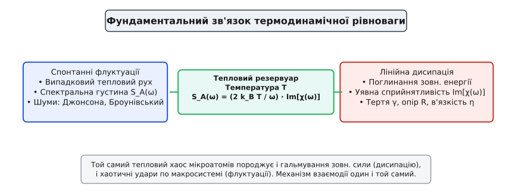
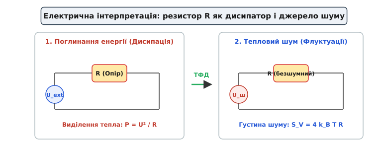

# Теорема флуктуацій і дисипації: зв'язок шуму та опору

<preknowlist>
- [Тепловий шум Джонсона—Найквіста](book:physics/thermal-noise) — флуктуації напруги в резисторі як окремий випадок теореми.
- [Больцманівський фактор і масштаб kT](book:physics/boltzmann-factor) — ймовірність теплових станів та масштаб енергії kT.
</preknowlist>

Спроба створити абсолютно «безшумну» механічну чи електричну систему впирається у нездоланну стіну, поставлену фундаментальними законами термодинаміки. Звичайний електричний резистор, що лежить на столі й ні до чого не під'єднаний, безперервно шумить: на його виводах існує крихітна хаотична напруга. Підвішене дзеркало чи консоль атомарного мікроскопа спонтанно тремтять у спокої. Це тремтіння не є результатом дефекту чи недосконалості приладів — це фундаментальна властивість природи. Якщо фізична система здатна **поглинати енергію** від зовнішньої сили (тобто дисипувати її в тепло), вона **зобов’язана спонтанно тремтіти** у стані спокою. Цей двосторонній причинний зв'язок описує **теорема флуктуацій і дисипації** (ТФД).


*Фундаментальний місток ТФД: тепловий резервуар з температурою T пов'язує спектральну густину флуктуацій S_A(ω) та уявний відгук Im[χ(ω)].*

### Чому система не може гальмувати без шуму

Усі макроскопічні об'єкти занурені у величезний тепловий резервуар (молекули повітря чи рідини, фонони ґратки, фотони поля). Коли об'єкт рухається або крізь резистор тече струм, середовище створює **дисипацію** — в'язке тертя чи електричний опір, які гальмують рух і перетворюють впорядковану енергію на тепло.

Коли той самий об'єкт зупиняється, молекули середовища продовжують безперервно й хаотично ударяти по ньому з усіх боків. У кожну мить ці удари не є повністю симетричними: то з лівого боку ударить трохи більше молекул, то з правого. Цей незатихаючий мікроскопічний дисбаланс створює спонтанне тремтіння — **флуктуації**.

І дисипація (гальмування), і флуктуації (поштовхи) породжуються **одним і тим самим мікроскопічним механізмом** взаємодії з молекулами середовища. У стані термодинамічної рівноваги швидкість, із якою система віддає енергію в тепло через тертя, точнісінько дорівнює швидкості, з якою вона отримує енергію назад через випадкові поштовхи.

Якби тертя існувало без шуму, система віддавала б свою енергію в середовище, але нічого не отримувала б навзамін. Тоді її температура постійно остигала б до абсолютного нуля всередині гарячого довкілля, що порушило б другий закон термодинаміки та створило б вічний двигун другого роду. Натомість ТФД гарантує, що при будь-якій температурі `T > 0` система перебуває у динамічній рівновазі між витоком і припливом енергії.

### Формула ТФД та її фізичний зміст

У класичній області (при низьких частотах чи кімнатних температурах) теорема флуктуацій і дисипації виражається чистою формулою:

```
S_A(ω) = (2 · k_B · T / ω) · Im[χ(ω)]
```

де:
* `S_A(ω)` — спектральна густина спонтанного шуму (наскільки сильно система тремтить на частоті `ω`);
* `k_B` — стала Больцмана (місток між світом тепла та механіки);
* `T` — абсолютна температура в Кельвінах;
* `Im[χ(ω)]` — уявна частина комплексної сприйнятливості, яка описує поглинання енергії зовнішньої сили (дисипацію).

Формула ТФД показує: щоб дізнатися рівень спонтанного шуму системи, не потрібно відстежувати рух кожного окремого атома. Достатньо виміряти її макроскопічний опір чи тертя `Im[χ(ω)]`.

Уявна частина сприйнятливості `Im[χ(ω)]` показує, наскільки ефективно система поглинає енергію зовнішнього збурення й перетворює її на тепло. ТФД стверджує, що саме ця дисипативна здатність визначає амплітуду її спонтанного теплового шуму. Якщо система взагалі не дисипує енергію (`Im[χ(ω)] = 0`), вона є ідеальною й повністю позбавлена теплового шуму.


*Еквівалентність між дисипацією електричної енергії та спонтанним тепловим шумом напруги Джонсона — Найквіста S_V = 4 k_B T R.*

### Де ТФД працює в реальному житті

1. **Тепловий шум Джонсона — Найквіста**: Електричний опір `R` є коефіцієнтом дисипації носіїв заряду. За формулою ТФД цей опір генерує невитравні шумові сплески напруги `U_ш = √(4 · k_B · T · R · B)`.
2. **Атомарно-силова мікроскопія (AFM)**: Вимірявши спектр спонтанного теплового тремтіння консолі мікроскопа у спокої, інженери розраховують її жорсткість за допомогою ТФД без жодного механічного тиску (`k = k_B · T / ⟨x²⟩`).
3. **Гравітаційні детектори LIGO**: Внутрішнє механічне затухання в оптичних покриттях дзеркал створює спонтанне теплове тремтіння поверхні, яке визначає фундаментальну межу чутливості приладу при пошуку гравітаційних хвиль від злиття чорних дір.
4. **Кріогенні надпровідні квантові системи**: У надпровідних кубітах та СКУІД-магнітометрах дисипативні втрати у контактах Джозефсона генерують флуктуації магнітного потоку та фази, що обмежують час збереження квантової інформації.

### Причинність та відновлення властивостей за шумом

Завдяки зв'язку ТФД із принципом причинності (через співвідношення Крамерса — Кроніґа), спостереження за пасивним тепловим шумом дає змогу повністю відновити не лише дисипацію, а й реактивні властивості системи (наприклад, пружність чи індуктивність). Це означає, що прилад може «дізнатися» все про внутрішній устрій об'єкта, просто слухаючи його спонтанне тремтіння у стані спокою.

> 🔧 **Навіщо це.** ТФД дає інженерам можливість наперед розрахувати нездоланну межу тиші будь-якого вимірювального давача. Зменшити цей шум можна лише двома шляхами: охолодженням приладу (`T`) чи зменшенням втрат дисипації (підвищенням добротності `Q`).

Детальний розбір лінійного відгуку, квантової форми Каллена — Велтона, співвідношень Крамерса — Кроніґа та нерівноважних систем наведено у [детальному викладі статті](book:physics/thermal-statistical/fluctuation-dissipation/fluctuation-dissipation-d.md).
