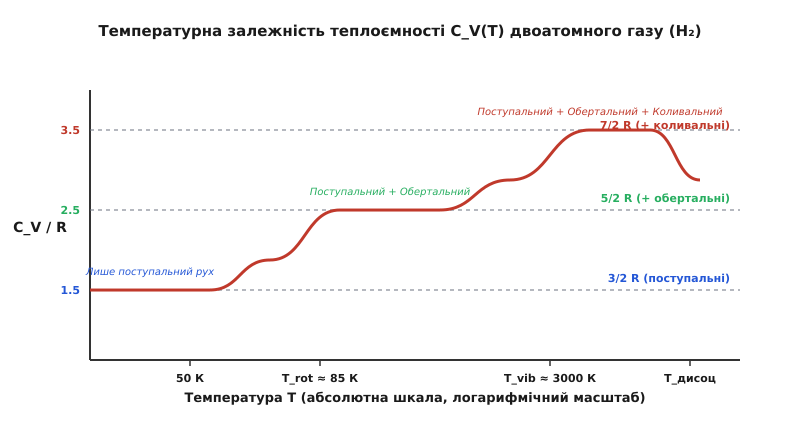
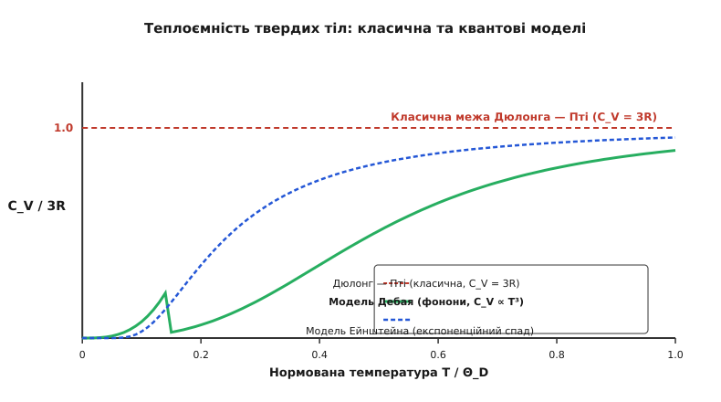
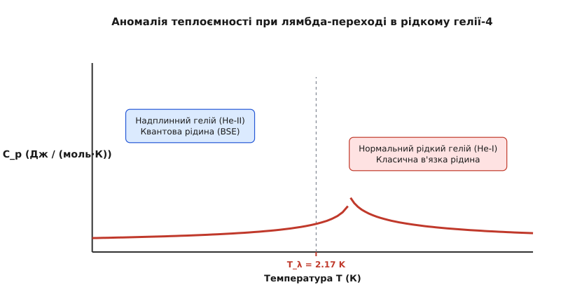

# Теплоємність

<preknowlist>
- [Температура та термодинамічна рівновага](book:physics/temperature-thermodynamics) — середня кінетична енергія атомів.
- [Перше начало термодинаміки](book:physics/first-law-thermodynamics) — збереження енергії у термодинаміці.
</preknowlist>

Для нагрівання 1 кілограма води на 1 кельвін потрібно передати їй 4184 джоулі теплоти, а для нагрівання 1 кілограма міді — лише 385 джоулів. Ця відмінність пояснюється тим, що різні речовини по-різному поглинають теплову енергію. **Теплоємність** (*heat capacity*) — це макроскопічна фізична величина `C = ΔQ / ΔT`, яка показує, скільки теплоти потрібно надати тілу, щоб змінити його температуру на 1 кельвін.

На мікроскопічному рівні підведене тепло витрачається на прискорення хаотичного руху атомів і молекул. Чим більше у молекули способів зберігати енергію (поступальний рух, обертання, коливання зв'язків), тим більшу теплоємність має речовина. Розрізняють питому теплоємність `c = C / m` (на одиницю маси, вимірюється у Дж/(кг·К)) та молярну теплоємність `C_m = C / n` (на один моль речовини, вимірюється у Дж/(моль·К)).

---

## Ізохорна та ізобарна теплоємність

Значення теплоємності залежить від термодинамічних умов, у яких відбувається нагрівання:

1. **Ізохорна теплоємність (`C_V`):** Нагрівання відбувається при сталому об'ємі (`V = const`). Оскільки розширення немає, газ не виконує роботу проти зовнішнього тиску (`dW = P dV = 0`), і все підведене тепло повністю йде на збільшення внутрішньої енергії системи:
   ```
   C_V = (∂U / ∂T)_V
   ```

2. **Ізобарна теплоємність (`C_p`):** Нагрівання відбувається при сталому тиску (`P = const`). При нагріванні речовина розширюється і виконує додатну механічна роботу `dW = P · dV` проти зовнішніх сил. Тому для досягнення тієї самої температури потрібно надати більше теплоти, ніж у разі фіксованого об'єму:
   ```
   C_p = (∂H / ∂T)_p
   ```


*Термодинамічне порівняння ізохорного та ізобарного процесів нагрівання газу. При сталому об'ємі все тепло Q_V йде на підвищення внутрішньої енергії dU, тоді як при сталому тиску газ виконує роботу розширення dW = P dV, що вимагає більшої кількості теплоти Q_p для досягнення тієї самої температури.*

Для одного моля ідеального газу різниця між ізобарною та ізохорною теплоємностями описується класичним **співвідношенням Маєра**:

```
C_p,m - C_V,m = R ≈ 8.314 Дж / (моль · К)
```

де `R` — універсальна газова константа. Для реальних газів це співвідношення уточнюється з урахуванням сил міжмолекулярного притягання та власного об'єму молекул. Для більшості рідин і твердих тіл через малий коефіцієнт теплового розширення різниця між ізобарною та ізохорною теплоємностями при кімнатній температурі є незначною і зазвичай не перевищує кількох відсотків від загальної величини.

---

## Теплоємність газів та квантове виморожування

Згідно з класичною теорією рівнорозподілу енергії, на кожен незалежний квадратичний ступінь вільності молекули у функції енергії припадає середня кінетична енергія `½ k_B T`:
- **Одноатомні гази (He, Ar):** Мають лише 3 поступальні ступені вільності (рух вздовж осей X, Y, Z), тому їхня молярна теплоємність дорівнює `C_V,m = 1.5 R`.
- **Двоатомні гази (N₂, O₂):** При кімнатній температурі мають 3 поступальні та 2 обертальні ступені вільності, що дає `C_V,m = 2.5 R`.


*Температурна залежність молярної теплоємності C_V двоатомного газу (H₂). Послідовне квантове розморожування ступенів вільності формує трьохетапну сходинкову криву: від 1.5 R при кріогенних температурах до 2.5 R при кімнатних умовах та 3.5 R при високотемпературному збудженні міжатомного зв'язку.*

При зниженні температури нижче 100 К обертальний рух молекули водню `H₂` зникає, і теплоємність спадає до `1.5 R`. Це відбувається через квантування енергетичних рівнів: якщо середня теплова енергія `k_B T` менша за відстань між дискретними квантовими рівнями обертання `k_B T_rot`, ступінь вільності «виморожується» і припиняє брати участь у поглинанні тепла. При високотемпературному нагріванні понад 1000 К розморожуються коливання атомів уздовж лінії зв'язку, піднімаючи теплоємність двоатомного газу до `3.5 R`.

Багатоатомні молекули (такі як `CO₂` чи `H₂O`) мають складніші квантові сходинки розморожування через наявність кількох згинальних та валентних коливальних мод із різними характеристичними температурами.

Історичний розвиток уявлень про теплоємність та відкриття квантових законів викладено у вставці [📜 Від теплороду та закону Дюлонга — Пті до квантових революцій Ейнштейна й Дебая](book:physics/thermal-statistical/heat-capacity/hist-heat-capacity.md).

---

## Теплоємність твердих тіл: Дюлонг — Пті, Ейнштейн і Дебай

У кристалах атоми здійснюють малі коливання навколо вузлів кристалічної ґратки:

1. **Закон Дюлонга — Пті (1819):** Спланував, що молярна теплоємність усіх простих твердих тіл є сталою і дорівнює:
   ```
   C_V,m = 3 R ≈ 24.94 Дж / (моль · К)
   ```
   Цей закон добре працює при високих температурах, але суттєво порушується при охолодженні речовини.

2. **Модель Ейнштейна (1907):** Врахувала квантову природу коливань атомів з однаковою частотою `ω_E`. Вона успішно пояснила експоненційне спадання теплоємності при низьких температурах, але давала занадто стрімке падіння поблизу нуля.

3. **Модель Дебая (1912):** Врахувала колективні коливання ґратки (звукові хвилі — фонони). Вона вивела фундаментальний **закон куба температури Дебая** для низьких температур (`T << Θ_D`):
   ```
   C_V^D ∝ T³
   ```


*Нормована температурна залежність теплоємності твердих тіл C_V / 3R від T / Θ_D. Класичний закон Дюлонга — Пті (червона лінія) дає сталу величину 1.0, модель Ейнштейна (синій пунктир) занадто стрімко падає за експоненційним законом при низьких температурах, тоді як модель Дебая (зелена крива) точна відтворює реальну кубічну залежність C_V ∝ T³ через наявність акустичних фононів.*

Математичне виведення моделей Ейнштейна й Дебая міститься у вставці [🧮 Статистична теорія та квантове виведення моделей Ейнштейна й Дебая](book:physics/thermal-statistical/heat-capacity/math-debye-model.md).

---

## Теплоємність металів та фазові переходи

У металах крім фононів ґратки є газ вільних електронів. Завдяки принципу заборони Паулі лише мала частка електронів поблизу поверхні Фермі поглинає теплову енергію, що дає лінійний внесок Зоммерфельда `C_e = γ · T`. Повна низькотемпературна теплоємність металу дорівнює:

```
C_m(T) = γ · T + A · T³
```

При нагріванні металу від кріогенних температур електронний внесок переважає при температурі нижче 3 К, після чого фононна складова `A T³` стає домінуючою.

При фазових переходах першого роду (танення, кипіння) усе тепло витрачається на перебудову міжмолекулярних зв'язків при сталій температурі (прихована теплота `L`). При переходах другого роду (перехід у надпровідний стан або втрата намагніченості) на кривій теплоємності спостерігається стрибок або лямбда-подібний пік.


*Температурна залежність ізобарної теплоємності C_p(T) рідкого гелію-4 в околі лямбда-точки T_λ = 2.17 K. Гострий логарифмічний сплеск розділяє область нормальної в'язкої рідини (He-I) та квантового надплинного стану (He-II).*

Практичне застосування знання теплоємностей знаходить при розрахунку сонячних теплових акумуляторів, океанічної теплової маси для аналізу глобального клімату Землі, систем охолодження мікропроцесорів та кріогенного обладнання. Вимірювання теплоємності у сучасних фізичних лабораторіях проводиться методами диференціальної скануючої калориметрії (ДСК) та релаксаційної калориметрії.

Точні розрахунки термодинамічних параметрів матеріалів вимагають урахування їхньої мікроскопічної кристалічної та електронної структури, ступенів вільності та діапазону робочих температур у конкретному фізичному процесі.

Чисельне моделювання алгоритмів розрахунку наведено у практиці [⚙️ Чисельне моделювання та термодинамічний розрахунок теплоємностей](book:physics/thermal-statistical/heat-capacity/proj-heat-capacity-sim.md), а числові значення параметрів — у [📋 Довідник теплоємностей матеріалів, газових констант та термодинамічних параметрів](book:physics/thermal-statistical/heat-capacity/api-heat-capacity-table.md).
