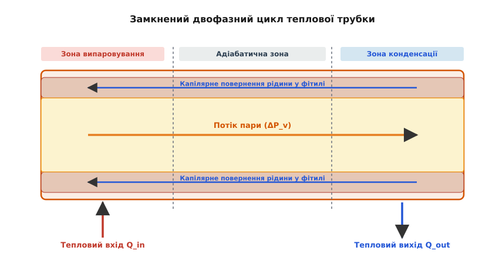
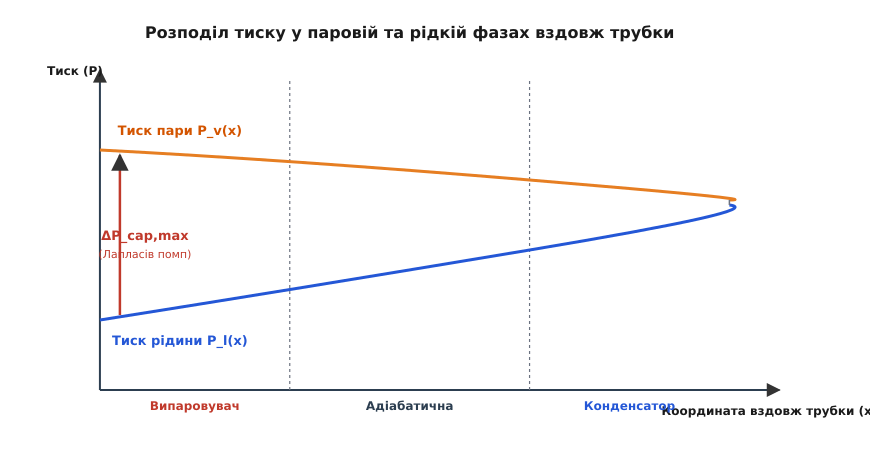
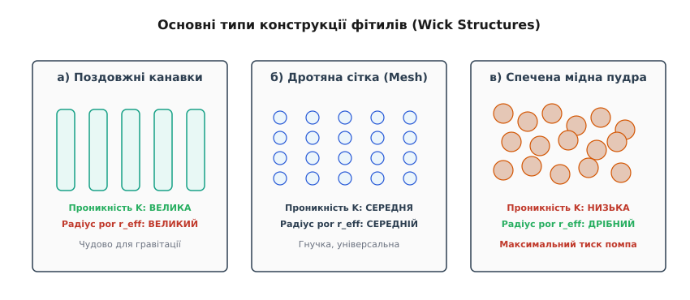
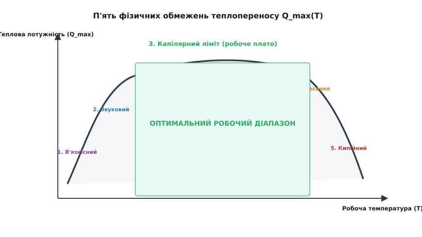

# Теплова трубка: фазовий перехід, капілярний помп і надпровідність тепла

<preknowlist>
- [Тепловий опір](topic:physics/thermal-resistance) — градієнт температур, тепловий потік та аналогія із законом Ома.
- [Фазовий перехід](topic:physics/phase-transition) — випаровування та конденсація, прихована теплота випаровування.
- [Поверхневий натяг](topic:physics/surface-tension) — лапласівський тиск, змочування та капілярне підняття рідини.
</preknowlist>

Сучасний процесорний кристал площею 1.5–2 см² у піковому навантаженні виділяє понад 250 Вт теплової потужності. Густина теплового потоку на його поверхні досягає 120–160 Вт/см² — це порядок величин, який можна порівняти з тепловим навантаженням на оболонку ядерного реактора чи сопло ракетного двигуна. Спроба відвести таке тепло за допомогою суцільного мідного стрижня довжиною 15 см і перерізом 1 см² зустрічає фундаментальну фізичну перешкоду. Оскільки питома теплопровідність міді становить близько 390–400 Вт/(м·К), для проштовхування 250 Вт крізь такий стрижень знадобиться перепад температур між кінцями понад 950 °C. Кремнієва напівпровідникова структура незворотно дегрує й руйнується вже за температури понад 105–125 °C. Суцільна теплопровідність твердих тіл на таких відстанях і густинах потоку виявляється безпорадною.

Розв'язанням цієї проблеми є **теплова трубка** (*heat pipe*) — герметичний пасивний пристрій теплопереносу, який використовує замкнений двофазний цикл «випаровування — конденсація» та повернення рідини капілярним помпом. Завдяки високій прихованій теплоті фазового переходу теплова трубка транспортує величезні теплові потоки з мінімальним температурним градієнтом. Її еквівалентна питома теплопровідність досягає 10 000 – 100 000 Вт/(м·К), що у 25–250 разів перевищує теплопровідність найчистішого срібла чи міді.


*Схема роботи теплової трубки: у зоні випаровування тепло підводиться до рідини у фітилі, пара під дією підвищеного тиску прямує адіабатичною зоною до зони конденсації, віддає приховану теплоту й повертається назад пористою структурою за рахунок капілярного тиску.*

### Механізм замкненого двофазного циклу

Усередині теплова трубка являє собою герметичну металеву оболонку (найчастіше мідну, алюмінієву або з нержавіючої сталі), з якої повністю викачане повітря, нанесено внутрішній пористий шар (**фітиль**, або *wick*), і додано чітко дозовану кількість робочої рідини. Об'єм рідини розраховують так, щоб вона повністю насичувала пори фітиля, не залишаючи вільних калюж, але й не залишаючи сухості. Решту внутрішнього об'єму займає насичена пара цієї ж рідини.

Процес транспортування тепла складається з чотирьох послідовних фізичних стадій, які утворюють замкнений безперервний цикл:

1. **Підведення тепла та випаровування (зона випаровувача / evaporator).** Тепловий потік від гарячої деталі долає металеву стінку трубки й потрапляє до насиченого рідиною фітиля. Рідина поглинає тепло й закипає або випаровується з межі розділу «рідина — пара». На відміну від звичайного нагрівання однофазного тіла, температура при цьому майже не зростає: уся поглинута енергія йде на розрив міжмолекулярних зв'язків і перетворення рідини на пару. Ця енергія визначається **питомою прихованою теплотою випаровування** `h_fg` (у джоулях на кілограм). Для води вона становить вражаючі 2.26 МДж/кг за 100 °C.

2. **Течія пари (адіабатична зона / adiabatic section).** Випаровування рідини в зоні випаровування локально підвищує тиск і густину пари. Виникає поздовжній градієнт тиску пари `ΔP_v`. Під дією цієї різниці тисків пара розганяється й швидко рухається центральним відкритим каналом (паровим ядром) у напрямку зони з нижчим тиском і температурою — до зони конденсації. Якщо адіабатична зона якісно ізольована від довкілля, втрати тепла під час цього транзиту прямують до нуля, а температура пари лишається практично сталою вздовж усього каналу.

3. **Конденсація та відведення тепла (зона конденсатора / condenser).** У зоні конденсації стінка трубки контактує з зовнішнім охолоджувачем (зокрема з радіатором, обдуваним повітрям). Пара торкається холодніших стінок фітиля, випадає в росу й виділяє назад свою приховану теплоту випаровування `h_fg`. Тепло проходить крізь стінку й розсіюється в довкілля. Завдяки конденсації тиск пари в цій зоні підтримується на низькому рівні насичення, що створює стійкий перепад тиску між випаровувачем і конденсатором, який безупинно жене нові порції пари.

4. **Капілярне повернення рідини.** Сконденсована рідина всмоктується пористою структурою фітиля. Щоб цикл не перервався й зона випаровування не пересохла, рідину потрібно транспортувати назад проти опору течії в порах і часто проти сили тяжіння. Цю роботу виконує **капілярний помп**, виникаючий на викривлених менісках рідини у вузьких порах фітиля.

Фізична сутність надвисокої ефективності полягає в тому, що двофазний носій транспортує не кінетичну енергію хаотичного руху атомів, а фазову ентальпію переходу. Відведення 250 Вт потужності вимагає випаровування та конденсації всього лише 0.11 грама води на секунду. Паровий потік рухається зі швидкістю 10–50 м/с, переносячи кіловаті тепла через тонкий канал малого перерізу.

> 🔧 **Навіщо це.** Двофазний цикл розриває залежність між тепловим потоком і довжиною провідника. У суцільному металі тепло переноситься дифузією кінетичної енергії коливань решітки або рухом вільних електронів, де градієнт температури пропорційний довжині. У тепловій трубці тепло транспортується масопереносом пари з високою ентальпією: декілька грамів випарованої рідини за секунду здатні переносити кіловаті потужності через десятки сантиметрів із перепадом температур усього в 1–3 °C.

Історичний шлях від перших парових сифонів до сучасних випарювальних камер детально розкрито у вставці 📜 [Історія винайдення та розвитку теплових трубок](topic:physics/heat-pipe/hist-invention.md).

### Капілярний помп і лапласівський тиск

Серцем пасивної теплової трубки є капілярний помп. На відміну від звичайних контурів із механічними насосами, теплова трубка не має жодної рухомої деталі й не споживає зовнішньої електричної енергії. Двигуном рідини є **поверхневий натяг** `γ` (ньютон на метр).

На межі розділу «рідина — пара» у порах фітиля утворюються угнуті меніски. Згідно з **рівнянням Лапласа-Янга**, перепад тиску на викривленій поверхні рідини пропорційний поверхневому натягу й кривині меніска:

```
ΔP_cap = (2 · γ · cos θ) / r_eff
```

Тут `γ` — коефіцієнт поверхневого натягу рідини, `θ` — крайовий кут змочування матеріалу фітиля рідиною (для якісного змочування `θ ≈ 0`, отже `cos θ ≈ 1`), а `r_eff` — ефективний радіус пор пористої структури.


*Зміна тиску в паровій та рідкій фазах уздовж теплової трубки. У зоні випаровування тиск рідини падає через капілярне всмоктування, а утворився меніск перекриває цей перепад за рахунок лапласівського тиску ΔP_cap.*

У зоні конденсації пори фітиля заповнені рідиною майже повністю, і меніски мають великий радіус кривини (майже пласкі, `r_eff → ∞`), тому капілярний перепад тиску там мінімальний. У зоні випаровування рідина інтенсивно випаровується, заглиблюючись у пори. Радіус викривлення менісків зменшується до граничного розміру самої пори `r_eff`. Це створює негативний (всмоктувальний) капілярний тиск у рідкій фазі випаровувача.

Для стабільного функціонування трубки капілярний помп мусить подолати геть усі гідродинамічні й гравітаційні втрати тиску в контурі. Головне правило капілярного обмеження має вигляд сумарного балансу:

```
ΔP_cap,max ≥ ΔP_v + ΔP_l + ΔP_g    [фундаментальний баланс тисків]
```

Розберемо кожну складову цього балансу:

- `ΔP_cap,max` — максимальний капілярний тиск, який здатний розвинути фітиль із даним радіусом пор.
- `ΔP_v` — сумарні втрати тиску при течії пари від випаровувача до конденсатора внаслідок в'язкісного тертя об стінки каналу та інерційних ефектів.
- `ΔP_l` — втрати тиску при зворотному русі в'язкої рідини крізь дрібні пори фітиля.
- `ΔP_g` — гідростатичний тиск стовпа рідини, який виникає, якщо трубка працює проти сили тяжіння (випаровувач розміщено вище за конденсатор): `ΔP_g = ρ_l · g · L · sin φ`, де `φ` — кут нахилу до горизонту.

Якщо сума опорів `ΔP_v + ΔP_l + ΔP_g` перевищить граничний капілярний тиск `ΔP_cap,max`, меніск у зоні випаровування прорветься: пара почне прориватися вглиб фітиля, приплив рідини зупиниться, і настане катастрофічне **пересихання** (*dry-out*). Після цього температура випаровувача стрибкоподібно зростає до небезпечних значень.

Повний математичний вивід гідродинамічних втрат за законом Дарсі та рівняннями Нав'є-Стокса наведено у вставці 🧮 [Термодинаміка та гідродинаміка капілярного обмеження](topic:physics/heat-pipe/math-capillary-limit.md).

### Анатомія та мікроструктура фітиля

Із формули Лапласа-Янга випливає фундаментальний інженерний конфлікт. Щоб отримати великий капілярний тиск `ΔP_cap`, радіус пор `r_eff` треба робити **якомога меншим** (мікрони або частки мікрона). Але, згідно із **законом Дарсі**, опір течії рідини в пористому середовищі обернено пропорційний питомій проникності `K` (вимірюється в м²). А проникність дрібнопористої структури падає як квадрат радіуса пор: `K ∝ r_eff²`.

Отже, що менша пора — то сильніше помп смокче рідину, але тим важче рідині текти крізь цю пористість! Інженерна теорія теплових трубок використовує чотири основні типи фітильних структур, кожна з яких пропонує свій компроміс:


*Конструктивні типи фітилів: а) поздовжні канавки (висока проникність, малий капілярний тиск); б) металева сітка (збалансовані параметри); в) спечена мідна пудра (величезний капілярний тиск, стійкість до орієнтації).*

1. **Поздовжні канавки (аксіальні рівчаки / grooved wick).** На внутрішній стінці металевої трубки витискаються або фрезеруються поздовжні канавки прямокутного чи трапецієподібного перерізу.
   - *Переваги:* надзвичайно висока проникність `K`, мінімальний опір течії рідини `ΔP_l`, простота виготовлення у довгих витиснутих профілях.
   - *Недоліки:* великий ефективний радіус пор (`r_eff` порядку 0.1–0.5 мм), через що капілярний тиск вкрай малий. Такі трубки чудово працюють у горизонтальному положенні або під дією гравітації (термосифони), але абсолютно нездатні піднімати рідину проти сили тяжіння на висоту понад 1–2 см.

2. **Сіточкові структури (дротяна сітка / woven mesh wick).** Кілька шарів тонкої мідної або нержавіючої сітки щільно згортають у рулон і притискають до внутрішньої стінки трубки.
   - *Переваги:* помірна вартість, гнучкість, технологічність під час вигинання трубок.
   - *Недоліки:* середні показники як за капілярним тиском (`r_eff ≈ 30–100 мкм`), так і за проникністю. Поганий термічний контакт між шарами сітки та стінкою трубки створює помітний радіальний тепловий опір.

3. **Спечена мідна пудра (спечений фітиль / sintered powder wick).** На внутрішню поверхню трубки засипають дрібний мідний порошок із розміром гранул 40–150 мкм і спекають його у печі за температури близької до точки плавлення міді (~900–950 °C). Гранули зварюються в монолітну високопористу губку, міцно з'єднану зі стінкою.
   - *Переваги:* дрібні радіуси пор (`r_eff ≈ 5–25 мкм`) забезпечують колосальний капілярний тиск (здатність піднімати воду проти гравітації на 20–40 см). Ідеальний металевий контакт гранул зі стінкою дає мінімальний радіальний тепловий опір.
   - *Недоліки:* високий гідродинамічний опір для рідкого потоку та висока складність й вартість виробництва. Це стандарт для процесорних охолоджувачів ПК та ноутбуків.

4. **Комбіновані (гібридні / composite wicks).** Використовують комбінацію матеріалів: наприклад, дрібноспечений шар на стінці випаровувача (для високого `ΔP_cap` та низького радіального опору) піддається стикуванню з поздовжніми канавками або артеріями у транспортній зоні (для низького `ΔP_l`).

Порівняльні числові значення порозності `ε`, проникності `K` та ефективного радіуса `r_eff` наведено в довіднику 📋 [Довідник параметрів робочих рідин та типів фітилів](topic:physics/heat-pipe/api-parameters.md).

### П'ять фізичних лімітів передачі тепла

Максимальна теплова потужність `Q_max`, яку здатна транспортувати теплова трубка, обмежена не лише капілярним помпом. Залежно від робочої температури, геометрії та властивостей носія, трубка впирається в один із п'яти фундаментальних фізичних лімітів:


*Огинаюча крива максимальної теплової потужності Q_max залежно від температури: в'язкісний та звуковий ліміти обмежують роботу за низьких температур, капілярний — у робочому діапазоні, а кипійний — за високих температур.*

#### 1. В'язкісний ліміт (Viscous limit)
За низьких температур (на стадії запуску) тиск насиченої пари є вкрай малим, а в'язкість пари — відносно високою. Паровий потік не може розігнатися через величезне в'язке тертя об стінки каналу. Паровий перепад тиску порівнюється з абсолютним тиском пари, і течія переходить у в'язко-загальмований режим.

#### 2. Звуковий ліміт (Sonic limit)
Якщо різниця тисків між випаровувачем і конденсатором стає великою, швидкість пари на виході з випаровувача досягає місцевої швидкості звуку (число Маха `Mach = 1`). Оскільки канал має постійний переріз (режим сопла Лаваля не реалізовано), подальше зниження тиску в конденсаторі не може прискорити пару й збільшити масову витрату. Теплова потужність замикається на звуковому бар'єрі.

#### 3. Капілярний ліміт (Capillary limit)
Це основне обмеження для більшості практичних застосувань у робочому діапазоні температур. Виникає, коли сума втрат тиску `ΔP_v + ΔP_l + ΔP_g` дорівнює максимальному тиску капілярного всмоктування `ΔP_cap,max`. При спробі відвести більшу потужність `Q` швидкість випаровування перевищує швидкість капілярної підтяжки рідини, і випаровувач висихає.

#### 4. Ліміт винесення рідини (Entrainment limit / Flood limit)
Пара та рідина рухаються в протилежних напрямках: пара пливе по центру назустріч конденсату у фітилі. За великих потужностей висока швидкість парового потоку створює на відкритій поверхні фітиля касаційні зсувні напруження. Коли динамічний напір пари перевищує сили поверхневого натягу рідини (критичне число Вебера `We ≥ 1`), пара починає зривати краплі рідини з менісків і нести їх назад у конденсатор, минаючи випаровувач. Зона випаровування позбавляється підживлення.

#### 5. Кипійний ліміт (Boiling limit)
За дуже високих густин теплового потоку в зоні випаровувача температура стінки стає значно вищою за температуру насичення пари. Усередині товщі фітиля (на межі з металевою стінкою) починається інтенсивне **ядерне кипіння** (*nucleate boiling*). Бульбашки пари, що зароджуються на стінці, не встигають виходити крізь дрібні пори фітиля назовні. Вони зливаються у суцільну паровую плівку, створюючи теплоізоляційний шар між стінкою та рідиною. Виникає криза кипіння (плівкове кипіння), тепловий опір зростає в сотні разів, і стінка перегрівається.

### Робочі рідини та критерій Мерита

Теплова трубка не є універсальною для всіх температур. Вибір робочої рідини повністю визначається діапазоном робочих температур пристрою. Рідина мусить мати високий тиск насиченої пари (але не надто високий, щоб не розірвати метал), високу приховану теплоту `h_fg`, великий поверхневий натяг `γ`, високу густину рідини `ρ_l` та малу в'язкість `μ_l`.

Для порівняльного оцінювання термодинамічної якості рідин використовують **критерій Мерита** (*Merit number*, або *Liquid Transport Factor* `N_M`):

```
N_M = (ρ_l · γ · h_fg) / μ_l        [число Мерита, Вт/м²]
```

Чим вище значення `N_M`, тим більший тепловий потік здатна перекачати рідина крізь один і той самий фітиль без висихання.

```
Порівняння характеристик робочих рідин за 100 °C:
┌──────────────┬──────────────────┬──────────────┬───────────────┬────────────────────────┐
│   Рідина     │ Точка кипіння,°C │  h_fg, кДж/кг│ γ, 10⁻³ Н/м   │ Число Мерита N_M, Вт/м²│
├──────────────┼──────────────────┼──────────────┼───────────────┼────────────────────────┤
│ Вода (H₂O)   │       100        │     2257     │     58.9      │       3.2 × 10¹⁰       │
│ Метанол      │        64.7      │     1101     │     15.7      │       0.4 × 10¹⁰       │
│ Аміак (NH₃)  │       -33.3      │     1368     │     21.2 (0°C)│       1.8 × 10¹⁰       │
│ Ацетон       │        56.2      │      522     │     16.2      │       0.3 × 10¹⁰       │
│ Натрій (Na)  │       883        │     3870     │    152 (800°C)│       8.5 × 10¹⁰       │
└──────────────┴──────────────────┴──────────────┴───────────────┴────────────────────────┘
```

З таблиці видно, чому **вода** є незаперечним фаворитом для електронного охолодження у діапазоні від +30 °C до +180 °C: її число Мерита на порядок перевищує показники органічних розчинників завдяки унікально високій прихованій теплоті випаровування та потужному поверхневому натягу водневих зв'язків.

Проте за температур нижче 0 °C вода замерзає й розриває фітиль льодом. Для кріогенної та космічної техніки використовують **аміак** (від -60 °C до +100 °C) або **етан/метан**. Для охолодження ядерних реакторів та космічних енергоблоків за температур 500–1500 °C застосовують рідкі метали — **натрій**, **калій** та **літій**.

Детальні інженерні таблиці сумісності матеріалів оболонки та рідин містяться в довіднику 📋 [Довідник параметрів робочих рідин та типів фітилів](topic:physics/heat-pipe/api-parameters.md).

### Геометрія, випарювальні камери та 3D-конструкції

Класична теплова трубка має циліндричну форму. Проте сучасні компактні пристрої (ноутбуки, смартфони, відеокарти) вимагають розсіювання тепла у вузьких щілинах. Це призвело до виникнення двох важливих геометричних модифікацій:

#### Сплющені теплові трубки (Flat heat pipes)
Звичайну круглу трубку механічно пресують у плоский профіль товщиною 1.0–2.5 мм. При сплющуванні важливо не роздавити паровий канал: якщо внутрішній просвіт для пари зменшиться нижче критичного розміру, опір течії пари `ΔP_v` зросте пропорційно `1 / d_h⁴` (де `d_h` — гідравлічний діаметр), що миттєво зріже капілярний ліміт.

#### Випарювальні камери (Vapor Chambers)
Випарювальна камера (ВК) — це плаский герметичний резервуар із внутрішнім фітилем, який працює за тим самим двофазним принципом, але реалізує **двовимірне (2D) розтікання тепла**. 

```
Порівняння теплового шляху:
Точкове джерело (CPU) ──> Металевий підошвовий радіатор ──> Обмежена площа конвекції (Hot-spot)
Точкове джерело (CPU) ──> Випарювальна камера (Vapor Chamber) ──> Ідеально рівномірне 2D-поле тепла
```

У звичайній мідній пластині тепло від мікроскопічного кристала розходиться конусом під кутом ~45°, утворюючи так званий опір розтікання (*spreading resistance*). Випарювальна камера передає тепло від точкового кристала по всій своїй площі ізотермічно: пара випаровується над точковим джерелом і конденсується по всій великій верхній кришці, перетворюючи локальний "hot-spot" на рівномірно нагріту поверхню для монтажу ребер радіатора.

#### 3D-випарювальні камери (3D Vapor Chambers)
Найсучаснішим кроком еволюції є гібридні 3D-випарювальні камери, де пласка випарювальна підошва безпосередньо зварена з вертикальними циліндричними трубками в єдиний внутрішній паровий об'єм. Це усуває контактний опір між підошвою та трубками, дозволяючи відводити понад 500 Вт від кристалів ШІ-прискорювачів.

#### Вплив орієнтації у просторі
Коли випаровувач розміщено внизу, а конденсатор угорі, гравітація допомагає рідині повертатися донизу: `ΔP_g` додається до капілярного тиску `ΔP_cap`. У такому режимі пристінний фітиль навіть не обов'язковий — пристрій перетворюється на **двофазний термосифон** (*thermosyphon*).

Якщо ж пристрій працює у положенні "випаровувач угорі" (*against gravity*), капілярний помп мусить долати вагу стовпа рідини `ρ_l · g · L`. Для гладких канавок таке положення є смертельним (продуктивність падає до нуля). Тільки спечені мідні фітилі з малим розміром пор `r_eff < 15 мкм` здатні утримувати до 80–90% своєї вихідної потужності незалежно від кута нахилу у просторі.

### Розрахунок теплового опору й практичні застереження

Еквівалентна теплова схема теплової трубки складається з послідовності шести розрахункових теплових опорів:

```
R_th,total = R_w,evap + R_wick,evap + R_v + R_wick,cond + R_w,cond
```

1. `R_w,evap` — тепловий опір мідної стінки випаровувача: `t_wall / (λ_metal · A_evap)`.
2. `R_wick,evap` — опір шару фітиля, просоченого рідиною. Оскільки теплопровідність води (`λ_H2O ≈ 0.6 Вт/(м·К)`) значно нижча за мідь (`400 Вт/(м·К)`), ефективна теплопровідність просоченого фітиля `λ_eff,wick` становить всього 2–10 Вт/(м·К). Тому шар фітиля роблять дуже тонким (0.2–0.5 мм).
3. `R_v` — опір парового ядра. Він надзвичайно малий (порядку `10⁻⁴ – 10⁻³ °C/Вт`), оскільки перепад температур у парі визначений рівнянням Клапейрона-Клаузіуса й за швидкостей пари `Mach < 0.2` не перевищує 0.1–0.5 °C.
4. `R_wick,cond` — опір фітиля в конденсаторі.
5. `R_w,cond` — опір металевої стінки в конденсаторі.

Сумарний опір якісної теплової трубки діаметром 6–8 мм і довжиною 200 мм становить всього **0.05 – 0.15 °C/Вт**. Для порівняння, суцільний мідний стрижень тих самих розмірів має опір близько **2.5 °C/Вт** — тобто у 20–50 разів гірший!

Обчислювальний алгоритм розрахунку капілярного обмеження та теплового опору подано у вставці ⚙️ [Інженерний розрахунок теплової трубки мовами C та C++](topic:physics/heat-pipe/proj-heat-pipe-calc.md).

#### Експлуатаційні застереження та деградація

Під час проективання систем охолодження на теплових трубках необхідно враховувати три основні фактори деградації:

1. **Радіус вигину (Bending limits).** Під час згинання трубки в обмеженому корпусі ПК або ноутбука внутрішній фітиль деформується й може відшаруватися від металевої стінки. Виникнення повітряного або парового зазору між стінкою та фітилем створює гігантський тепловий опір. Мінімальний безпечний радіус вигину зазвичай становить `R_bend ≥ 3 · D_outer`.

2. **Неконденсовані гази (NCG — Non-Condensable Gases).** Якщо під час виготовлення з трубки не повністю викачали повітря, або якщо між робочою рідиною та металом стінки йде повільна хімічна реакція (наприклад, корозія алюмінію водою з виділенням водню `H₂`), неконденсований газ зноситься паровим потоком у найдальший кінець зони конденсації. Газова пробка накопичується там і «засліплює» частину конденсатора: пара не може дістатися холодних стінок, і ефективна довжина трубки зменшується, підвищуючи сумарний опір.

3. **Температурні межі та опресування.** Під час підйому температури тиск насиченої пари зростає за експонентою. Для води за 100 °C тиск становить 1 атм (0.1 МПа), але за 200 °C він досягає вже 1.55 МПа (15.5 атм), а за 250 °C — 4.0 МПа (40 атм). Тонкостінна мідна трубка може видутися або вибухнути від внутрішнього тиску при випадковому виході вентилятора з ладу.

### Динаміка пуску та нестаціонарні режими

Окремої уваги заслуговує поведінка теплової трубки у момент вмикання потужного теплового навантаження («холодний пуск»). У вихідному стані за кімнатної температури пара всередині каналу перебуває під низьким тиском і має малу густину.

Під час раптової подачі пікового теплового потоку (наприклад, включення обчислювального алгоритму на CPU) у зоні випаровування виникає локальний стрибок температури та тиску. Можливі два сценарії розвитку подій:
- **Нормальний пуск (Normal start-up).** Тепловий фронт швидко поширюється вздовж адіабатичної зони до конденсатора, пара прогріває стінки, і стійкий двофазний цикл встановлюється за 2–5 секунд.
- **Звукове замикання під час пуску (Sonic start-up).** За низької початкової температури пара на виході з випаровувача швидко розганяється до швидкості звуку. Утворюється хвиля розрядження, і випаровувач тимчасово перегрівається, поки вся довжина трубки не прогріється до робочої температури.

Знання цих нестаціонарних механізмів дає змогу розробникам створювати надійні системи охолодження, розраховані на будь-які імпульсні навантаження.

---

Теплова трубка являє собою видатний приклад використання фазового переходу та капілярних явищ для подолання класичних меж суцільної теплопровідності. Поєднуючи приховану теплоту пароутворення з лапласівським тиском пористих структур, вона перетворилася на базовий елемент сучасної силової електроніки, комп'ютерної техніки та космічного машинобудування.
