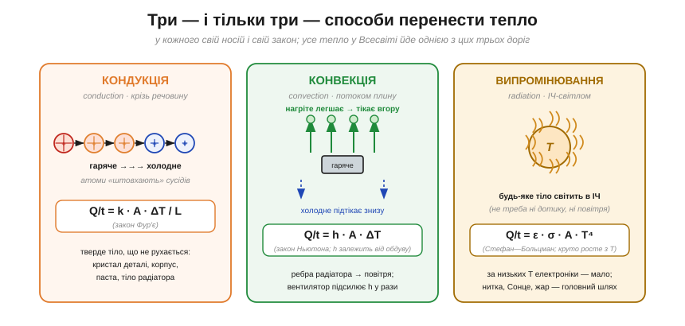
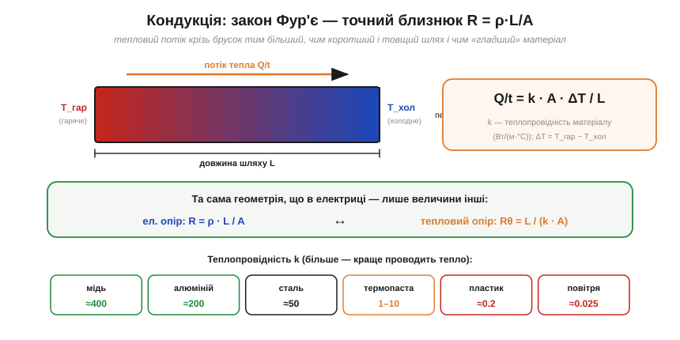
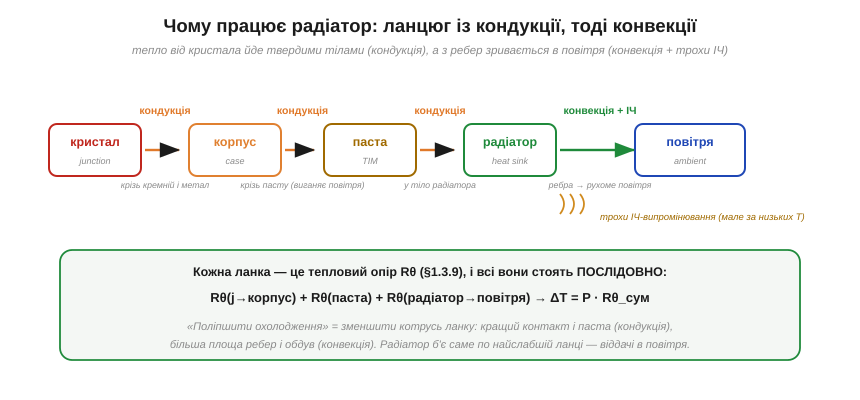

# Три шляхи тепла: кондукція, конвекція, випромінювання

Охолодження деталі зручно рахувати через [тепловий опір](book:physics/thermal-resistance): ΔT = P·Rθ, і ці Rθ додаються поспіль уздовж шляху «кристал → корпус → паста → радіатор → повітря». Та сам Rθ — це **чорна скринька**: число з даташита чи каталогу. Звідки воно береться? Чому в металу тепловий опір крихітний, а в повітря величезний? Чому радіатор узагалі **працює** — і чому без обдуву працює вдвічі гірше? Щоб відповісти, треба відкрити скриньку й спитати фізику: а **як саме** тепло переходить із гарячого в холодне?

Виявляється, способів усього **три** — і це не довгий список, з якого щось забули, а повний перелік. Тепло — це безладний рух частинок: гаряче тіло — те, чиї атоми трусяться дужче. Передати тепло означає **передати цей рух** холоднішому сусідові, а зробити це можна лише трьома шляхами: штовхнути сусіда, не зрушивши з місця (**кондукція**), віднести рух геть разом із речовиною (**конвекція**) або випустити його **світлом** (**випромінювання**). Жодного четвертого немає. Розберімо кожен — з його механізмом, його законом і його роллю в охолодженні електроніки.


*Рис. Три — і тільки три — способи перенести тепло, кожен зі своїм носієм і своїм законом. **Кондукція**: атоми твердого тіла «штовхають» сусідів, не зрушуючи самі (закон Фур'є). **Конвекція**: нагріта рідина чи газ легшає й виносить тепло геть (закон Ньютона). **Випромінювання**: будь-яке тіло світить в інфрачервоному (Стефан—Больцман). У реальному охолодженні працюють усі три, та на різних ділянках шляху.*

### Кондукція: естафета без переселення

**Кондукція** (*conduction*, теплопровідність) — це передача тепла **крізь нерухому речовину**, від частинки до частинки. Уявіть ряд людей, що передають відро з рук у руки: відро (енергія) рухається вздовж ряду, а самі люди (атоми) лишаються на місцях. У твердому тілі атоми сидять у вузлах решітки й **коливаються**; гарячий край трусить дужче, ці коливання штовхають сусідів, ті — наступних, і хвиля «тряски» біжить у холодний бік. У металах до цієї естафети додається другий, **набагато прудкіший** носій — те саме [море вільних електронів](book:physics/electron-drift), яке переносить струм. Розігнані теплом електрони шастають крізь метал і розносять енергію куди швидше, ніж повільні коливання решітки.

Ось чому метал на дотик здається **холоднішим** за дерево тієї самої температури: він стрімко відсмоктує тепло з вашого пальця, тимчасом як дерево майже не проводить. І ось чому добрий провідник струму — майже завжди й добрий провідник тепла: за обидва переноси відповідає **той самий** електронний газ (цей зв'язок між тепло- та електропровідністю металів відомий як закон Відемана—Франца — нам досить його якісної суті).

Кількісно кондукцію описує **закон Фур'є** (*Fourier's law*): тепловий потік крізь брусок прямо пропорційний площі та різниці температур і обернено пропорційний довжині шляху:

```
Q/t = k · A · ΔT / L

Q/t — тепловий потік (Вт)
k   — теплопровідність матеріалу (Вт/(м·°C))
A   — площа перерізу (м²)
ΔT  — різниця температур уздовж бруска (°C)
L   — довжина шляху тепла (м)
```


*Рис. Тепловий потік крізь брусок тим більший, чим коротший і товщий шлях і чим «гладший» для тепла матеріал (велике k). Геометрія **дослівно та сама**, що в електричного опору: Rθ = L/(k·A) — це близнюк R = ρ·L/A, де теплопровідність k грає роль провідності (1/ρ). Таблиця знизу: мідь і алюміній проводять тепло в тисячі разів краще за повітря — тому радіатори металеві, а повітряні зазори згубні.*

Придивіться до формули — і ви впізнаєте давнього знайомого. Перепишемо її через [тепловий опір](book:physics/thermal-resistance) (Rθ = ΔT/(Q/t)):

```
Rθ = L / (k · A)        ← тепловий опір бруска
порівняйте:  R = ρ · L / A   ← електричний опір дроту
```

Це **та сама геометрія**, що в [питомого опору дроту](book:physics/resistivity): довший шлях — більший опір (прямо), товщий — менший (обернено), а роль матеріалу грає теплопровідність k (її висока величина — як висока провідність, мала ρ). Тепловий опір — не метафора, а буквальний двійник електричного. Звідси одразу видно дві речі. По-перше, чому **повітря** (k ≈ 0.025) — чудовий теплоізолятор: його k у п'ятнадцять тисяч разів менше за мідь, тож найтонший прошарок повітря додає гігантський Rθ. По-друге, чому **термопаста** рятує: вона не «проводить краще за метал» (її k всього 1–10), а лише виганяє зі стику те саме згубне повітря, замінюючи k ≈ 0.025 на k ≈ кілька — стрибок у сотні разів.

> 🧮 Закон Фур'є — це **диференціальна** форма; повна картина (градієнт температури, рівняння теплопровідності) спирається на [похідну](book:math/derivative) — швидкість зміни температури вздовж шляху. Для сталого шляху досить алгебраїчної форми Q/t = k·A·ΔT/L.

**Приклад (тепло крізь корпус деталі).** Кристал віддає тепло крізь основу корпусу: алюмінієва площинка k = 200 Вт/(м·°C), площа A = 1 см² = 1×10⁻⁴ м², товщина L = 2 мм = 0.002 м. Який її тепловий опір?

```
Rθ = L / (k · A) = 0.002 / (200 × 1×10⁻⁴)
Rθ = 0.002 / 0.02 = 0.1 °C/Вт
```

Десята частка градуса на ват — мізер: товстий метал тепло майже не гальмує. А тепер замінімо подумки цей метал на повітряний зазор тієї самої товщини (k = 0.025): Rθ підскочить до 0.002/(0.025×10⁻⁴) = 800 °C/Вт — у вісім тисяч разів гірше. Ось чому будь-яка повітряна щілина на шляху тепла — катастрофа, і чому її виганяють пастою.

> 🔧 **Навіщо це.** Кондукція — це **вся внутрішня частина** теплового шляху: від кристала крізь корпус, крізь пасту, у тіло радіатора. Працюючи з нею, ви боретеся за дві речі: побільше **площі** контакту (широкі мідні полігони на платі, велика підошва радіатора) і поменше **повітря** в стиках (притиск, тонкий шар пасти). Мідна заливка під гарячою деталлю — це теплопровідний «дріт», що розтікає тепло по платі; теплові перехідні отвори (*thermal vias*) — теплопровідні «перемички» на інший бік. Усе це — закон Фур'є в дії: збільшуй k·A, зменшуй L.

### Конвекція: тепло їде разом із повітрям

Кондукція доводить тепло **до** поверхні радіатора. Та далі постає питання: а як зняти його з ребер? Тут на сцену виходить другий механізм — **конвекція** (*convection*). Її ідея протилежна до кондукції: якщо там енергія бігла, а речовина стояла, то тут **речовина сама несе тепло геть**. Нагріта поверхня гріє прилеглий шар повітря; тепле повітря розширюється, **легшає** й спливає вгору (як повітряна кулька), а його місце займає холодне знизу. Виникає неперервний коловорот, що відносить тепло від деталі, — це **природна конвекція**.

Кількісно її описує **закон охолодження Ньютона** (*Newton's law of cooling*): потік тепла з поверхні пропорційний площі та перепаду температур між поверхнею й повітрям:

```
Q/t = h · A · ΔT

h  — коефіцієнт тепловіддачі (Вт/(м²·°C))
A  — площа поверхні, що віддає тепло (м²)
ΔT — наскільки поверхня гарячіша за повітря (°C)
```

Уся хитрість сидить у коефіцієнті **h** — він каже, наскільки бадьоро плин забирає тепло з поверхні, і **сильно** залежить від того, чи рухається повітря саме собою, чи його женуть.


*Рис. Природна конвекція (повітря тікає вгору саме) дає скромний h ≈ 5–25 Вт/(м²·°C). Вентилятор зриває нагрітий шар і жене свіже повітря — **примусова** конвекція піднімає h у рази (≈50–250). Оскільки Q/t = h·A·ΔT, ребра працюють на множник A, а вентилятор — на множник h; разом вони різко знижують Rθ «радіатор → повітря».*

Звідси прояснюється все, що зазвичай беруть на віру про [радіатор](book:physics/thermal-resistance). **Ребра** дають велику площу A в малому об'ємі — а в законі Ньютона A стоїть прямим множником. **Вентилятор** піднімає h, бо постійно зриває нагрітий примежовий шар повітря й підставляє свіже холодне (примусова конвекція замість млявої природної), — і тому обдув знижує тепловий опір у рази, а не на відсотки. **Орієнтація ребер** уздовж висхідного потоку допомагає теплому повітрю тікати. Навіть те, чому гарячому повітрю треба давати дорогу вгору й не запирати його в глухому корпусі, — це все та сама конвекція, якій потрібен **рух** середовища.

Важлива межа: у **порожнечі** конвекції немає взагалі — нема чому текти. Тому супутник чи будь-що у вакуумі не можна охолодити обдувом; там лишається тільки випромінювання (нижче) та кондукція в конструкцію. На Землі ж саме конвекція — головний шлях, яким радіатор віддає тепло повітрю.

**Приклад (скільки знімають ребра).** Радіатор має сумарну площу ребер A = 0.02 м², його поверхня на ΔT = 50 °C гарячіша за повітря. Скільки тепла він віддає природною конвекцією (h ≈ 10) і скільки — з вентилятором (h ≈ 80)?

```
природна:   Q/t = h·A·ΔT = 10 × 0.02 × 50 = 10 Вт
примусова:  Q/t = 80 × 0.02 × 50 = 80 Вт
```

Той самий радіатор, той самий перепад — а з обдувом він відводить увосьмеро більше. Ось чому потужні пристрої майже завжди мають вентилятор: без нього довелося б ставити радіатор у рази більший.

> 🔧 **Навіщо це.** Конвекція — це **остання, найвужча ланка** теплового шляху (зазвичай саме Rθ «радіатор → повітря» — найбільший доданок суми теплових опорів). Тому й тиснуть на неї найдужче: більша площа ребер, обдув, вільний прохід повітря вгору. Практичний наслідок: радіатор, замурований у тісний глухий корпус без вентиляції, працює в рази гірше за паспорт — бо паспортний Rθ міряли у вільному повітрі. Якщо деталь гріється понад очікуване, перше підозрюване — задушена конвекція: немає обдуву або повітрю нікуди тікати.

### Випромінювання: тепло, що світиться

Третій шлях найдивніший: **будь-яке** нагріте тіло **світить** — випускає енергію у вигляді електромагнітних хвиль, і для цього йому не потрібні ні дотик, ні повітря. Це **теплове випромінювання** (*thermal radiation*). За кімнатних температур воно невидиме (лежить в **інфрачервоній**, ІЧ області), та його чудово «бачить» тепловізор; розжарте тіло сильніше — і випромінювання зсунеться у видиме: тен почервоніє, нитка лампи засяє білим. Саме випромінюванням нас гріє Сонце крізь мільйони кілометрів порожнечі, де ні кондукції, ні конвекції бути не може.

Кількісно його описує **закон Стефана—Больцмана** (*Stefan—Boltzmann law*):

```
Q/t = ε · σ · A · T⁴

ε — випромінювальна здатність поверхні (0…1; чорна матова ≈ 0.9, блискучий метал ≈ 0.05)
σ — стала Стефана—Больцмана (5.67×10⁻⁸ Вт/(м²·К⁴))
A — площа поверхні (м²)
T — АБСОЛЮТНА температура в кельвінах (К = °C + 273)
```

Тут є дві разючі особливості. Перша: температура входить **у четвертому степені** — і саме абсолютна, у кельвінах. Подвоїти абсолютну температуру означає випромінювати у **2⁴ = 16** разів більше. Тому випромінювання росте лавиною: при кімнатних 25 °C (≈300 К) воно кволеньке, а в нитки лампи при 2500 °C (≈2800 К) — велетенське, бо 2800⁴ незрівнянно більше за 300⁴.


*Рис. Потужність випромінювання ∝ T⁴ (T — абсолютна, у кельвінах). Крива надзвичайно крута: при ≈300 К (плата, радіатор) тіло світить майже непомітно, тож для електроніки випромінювання — мізерний внесок. Зате при ≈1000 К (жар, розпечений тен) і тим паче в нитки лампи (≈2800 К) воно стає **головним** шляхом віддачі тепла. Тому розпечене світиться, а теплий радіатор — ні.*

Друга особливість — множник **ε** (випромінювальна здатність, *emissivity*): він каже, наскільки поверхня близька до ідеального випромінювача. Чорна матова поверхня має ε ≈ 0.9, блискучий полірований метал — лише ≈ 0.05. Ось чому радіатори часто **чорнять** (анодують): чорне матове покриття піднімає ε ближче до одиниці й трохи додає віддачі випромінюванням. Слово «трохи» тут ключове: за низьких температур електроніки внесок ІЧ усе одно малий проти конвекції, тож чорний колір — лише невелика добавка, а не головний герой.

**Приклад (чому при 25 °C світло не рятує).** Порівняймо, скільки радіатор з ε = 0.9 і площею A = 0.02 м² віддає **конвекцією** і **випромінюванням** при ΔT = 50 °C над повітрям 25 °C (тобто поверхня ≈ 75 °C ≈ 348 К, повітря ≈ 298 К):

```
конвекція (h ≈ 10):  Q/t = h·A·ΔT = 10 × 0.02 × 50 = 10 Вт
випромінювання:      Q/t = ε·σ·A·(T_пов⁴ − T_довк⁴)
                         = 0.9 × 5.67×10⁻⁸ × 0.02 × (348⁴ − 298⁴)
                         ≈ 0.9 × 5.67×10⁻⁸ × 0.02 × (1.466×10¹⁰ − 0.789×10¹⁰)
                         ≈ 7 Вт
```

Випромінювання тут не дрібниця (≈7 Вт проти 10 Вт конвекції) — за **природної** конвекції воно дає відчутну добавку, і саме тому чорнять навіть пасивні радіатори. Та щойно вмикається вентилятор і конвекційний h злітає до 80 (Q/t ≈ 80 Вт), випромінювання (ті самі ≈7 Вт) стає вже малою часткою. А головне — обидва внески мізерні поряд із тим, що та сама формула дає для розпеченої нитки: при 2800 К доданок T⁴ більший у десятки тисяч разів, тож лампа віддає майже все тепло саме світлом.

> 🔧 **Навіщо це.** Для повсякденного охолодження електроніки (деталі при 25–80 °C) головні гравці — **кондукція** (до радіатора) і **конвекція** (від нього); випромінювання дає скромну добавку, заради якої радіатори й чорнять. Зате випромінювання стає головним там, де **гаряче**: розжарена нитка лампи віддає світлом майже всю потужність, інфрачервоні нагрівачі та обігрівачі гріють вас прямим ІЧ-променем, а тепловізор «бачить» нагріту деталь саме по її власному випромінюванню — зручний спосіб знайти гарячу точку на платі, не торкаючись її.

### Усе разом: чому працює радіатор

Тепер зберімо три шляхи в одну картину — і [ланцюг охолодження](book:physics/thermal-resistance) заговорить фізикою. Тепло від кристала має дістатися повітря, і на кожній ділянці шляху працює **свій** механізм.


*Рис. Уся внутрішня частина шляху (кристал → корпус → паста → тіло радіатора) — це **кондукція** крізь тверді тіла; фінальна віддача з ребер у повітря — **конвекція** (плюс трохи ІЧ-випромінювання). Кожна ланка — це тепловий опір Rθ, і всі вони стоять **послідовно**, тож додаються. «Поліпшити охолодження» означає зменшити котрусь ланку: кращий контакт і паста (кондукція) чи більша площа й обдув (конвекція).*

Спочатку **кондукція** проводить тепло крізь усе тверде: кремній кристала, метал корпусу, шар пасти, тіло радіатора — закон Фур'є на кожному кроці, тож тут б'ються за велике k·A й проти повітряних зазорів. Потім із поверхні ребер тепло зриває **конвекція** — закон Ньютона, де працюють велика площа ребер і обдув. І весь час трішки додає **випромінювання** — закон Стефана—Больцмана, заради якого радіатор чорнять, хоч за цих температур його внесок невеликий.

І ось чому радіатор взагалі **працює**: гола деталь має лише крихітну власну поверхню, з якої конвекція знімає мізер, — тож вона перегрівається. Радіатор не «висмоктує» тепло якоюсь магією: він просто **підставляє велику площу** конвекції (множник A в законі Ньютона) і **проводить** до неї тепло товстим металом (велике k·A в законі Фур'є). Дві ланки, два закони — і деталь жива. Якщо вона все одно гаряча, фізика підказує, **де** саме тиснути: гаряча в стику з радіатором — слабка кондукція (паста, притиск); гарячий сам радіатор при ледь теплому повітрі — слабка конвекція (площа, обдув).

За цим стоїть глибший зв'язок. **Електричний опір** (спротив струму) і **тепловий опір** (спротив потоку тепла) — це не просто співзвучні назви: тепловий опір кондукції Rθ = L/(k·A) **дослівно** повторює електричний R = ρ·L/A, бо й тепло, і струм у металі несе те саме [море електронів](book:physics/electron-drift). Одна ідея «спротиву потоку» працює двічі — і це не випадковість, а спільне коріння в русі тих самих частинок. Цей зв'язок можна навіть обернути: пропустивши струм крізь правильний стик матеріалів, тепло качають **струмом** — навіть проти різниці температур, охолоджуючи деталь нижче за довкілля, на що здатний [елемент Пельтьє](book:electronics/peltier).

---

Отже, тепло переходить трьома — і лише трьома — шляхами. **Кондукція** (закон Фур'є, Q/t = k·A·ΔT/L) несе енергію крізь нерухоме тверде тіло естафетою коливань і вільних електронів; її тепловий опір Rθ = L/(k·A) — буквальний двійник електричного R = ρL/A. **Конвекція** (закон Ньютона, Q/t = h·A·ΔT) виносить тепло рухомим повітрям; обдув піднімає h у рази. **Випромінювання** (Стефан—Больцман, Q/t = ε·σ·A·T⁴) світить в ІЧ; через четвертий степінь воно мізерне за кімнатних температур, але головне для розпеченого. У реальному охолодженні кондукція веде тепло **до** радіатора, конвекція знімає його з ребер, а випромінювання трохи додає — і чорна скринька теплового опору розкрита до фізики.
