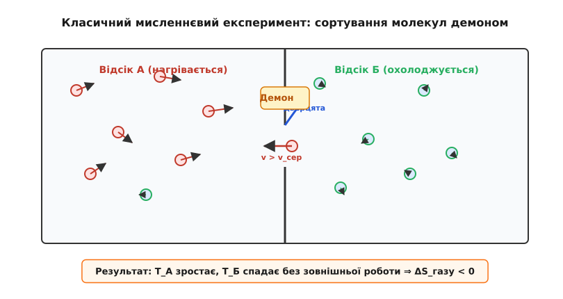
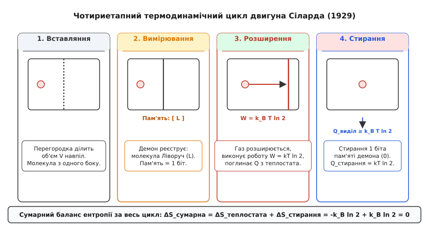
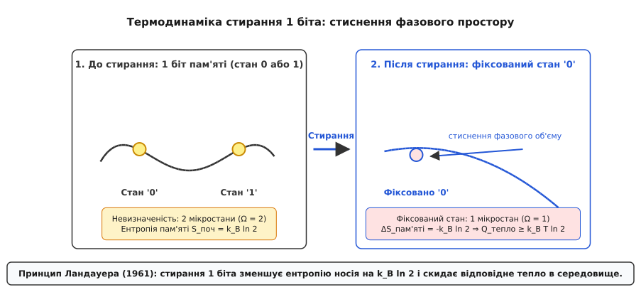
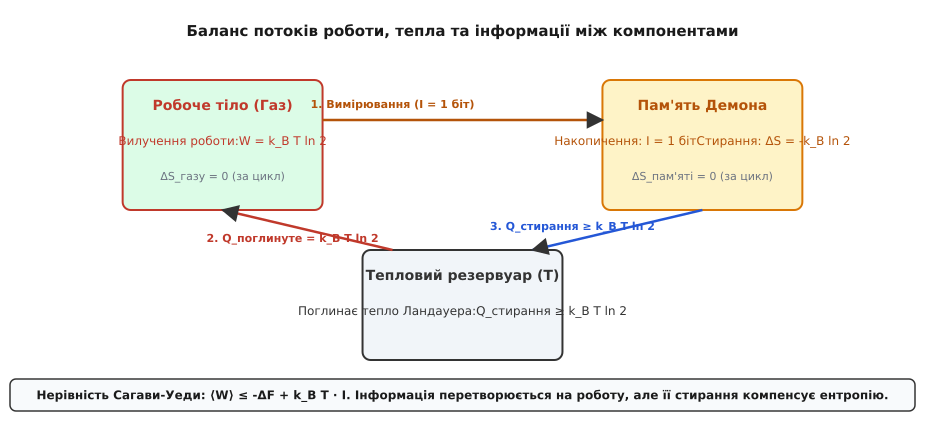

# Демон Максвелла й ціна інформації

<preknowlist>
- [Другий закон термодинаміки](topic:physics/second-law-thermodynamics) — ентропія замкненої системи не зменшується; тепло не переходить самочинно від холодного тіла до гарячого.
- [Ентропія та статистична фізика](topic:physics/entropy-statistical) — зв'язок між мікростанами системи та її термодинамічною ентропією за Больцманом S = k_B ln Ω.
- [Ентропія Шеннона](topic:communications/shannon-entropy) — міра невизначеності інформації в бітах та її математична форма H = -∑ p_i log_2 p_i.
</preknowlist>

У двох ізольованих судинах, з'єднаних маленьким отвором і заповнених газом при кімнатній температурі 300 К, молекули азоту літають із середньою швидкістю близько 500 м/с. Проте це лише середнє значення: у будь-яку секунду частина молекул рухається зі швидкістю 800 м/с, а частина — лише 200 м/с. Якщо на шляху між судинами поставити безвагову засувку й пропускати з лівої судини в праву лише ті молекули, чия швидкість перевищує середнє значення, а з правої в ліву — лише повільні, то через певний час права судина нагріється до 350 К, а ліва охолоне до 250 К. Між судинами виникне різниця температур у 100 Кельвінів без виконання будь-якої механічної роботи іззовні.

Такий перебіг подій прямо суперечить Другому закону термодинаміки у формулюванні Рудольфа Клаузіуса: теплова енергія самочинно, без залишення змін в оточуючому середовищі, перейшла від холодного тіла до гарячого, а сумарна термодинамічна ентропія замкненого газу зменшилася.

Цей мисленнєвий експеримент запропонував шотландський фізик Джеймс Клерк Максвелл у 1867 році. Його вигадана «істота зі здатністю стежити за окремими молекулами» — яку Вільям Томсон пізніше назвав «демоном» — стала найвідомішим парадоксом фізики XIX та XX століть. Зняти цей парадокс вдалося лише через століття, коли науковці усвідомили: інформація — це не абстрактне математичне поняття, а фізична величина, за збирання, збереження та стирання якої доводиться платити реальним розсіюванням тепла.

---

### Анатомія парадоксу та сортування молекул

Щоб зрозуміти, чому демон Максвелла загрожував фундаменту фізики, розглянемо статистичний розподіл швидкостей газових частинок. У класичному ідеальному газі швидкості молекул підпорядковані розподілу Максвелла-Больцмана. Температура газу T є прямою мірою середньої кінетичної енергії поступального руху його частинок:

Середня кінетична енергія молекули визначається виразом через добуток трьох других частин сталої Больцмана та температури. Тут стала Больцмана слугує фундаментальним перевідним коефіцієнтом між температурою в кельвінах та енергією в джоулях.

За звичайних умов молекули неперервно зіштовхуються між собою й зі стінками судини, хаотично обмінюючись імпульсами. Цей безперервний мікроскопічний хаос утримує систему в стані термодинамічної рівноваги. Замкнена система з однаковою температурою T володіє максимально можливою ентропією Больцмана, де ентропія визначається як добуток сталої Больцмана та натурального логарифма кількості доступних мікростанів у фазовому просторі координат та імпульсів.

*Схема сортування молекул за швидкостями: демон відчиняє дверцята лише для швидких молекул убік А й повільних убік Б, знижуючи ентропію газу.*

Дія демона полягає у вибірковому втручанні в цей мікроскопічний хаос. Демон здійснює послідовно три операції:
1. **Спостереження:** визначає напрямок руху та швидкість наближуваної молекули.
2. **Прийняття рішення:** порівнює швидкість із пороговим середнім значенням.
3. **Дія:** відчиняє або зачиняє дверцята без тертя й без виконання механічної роботи.

Оскільки швидкі молекули накопичуються у відсіку А, середня кінетична енергія частинок у ньому зростає, тобто температура відсіку А підвищується. У відсіку Б залишаються повільні частинки, тому температура відсіку Б знижується. Зміна ентропії двох однакових об'ємів ідеального газу описується сумою логарифмів відношення кінцевих температур до початкової температури.

Оскільки середня температура системи зберігається, добуток кінцевих температур двох відсіків виявляється строго меншим за квадрат початкової температури. Це означає, що логарифм частки є від'ємним числом. Якщо демон вважається безваговою сутністю, яка не споживає енергії та не створює ентропії, то сумарна ентропія замкненої системи зменшується.

Це означає можливість створення теплового перпетуум мобіле другого роду — пристрою, який перетворює тепло ізотермічного резервуара на корисну роботу без залишення будь-яких слідів в оточенні.

Докладний перебіг хронологічних суперечок та еволюцію поглядів фізиків від Максвелла до кінця XX століття описано у вставці [📜 Демон Максвелла: історія суперечки довжиною в століття](topic:physics/maxwell-demon/hist-demon-history.md).

---

### Пастка Смолуховського: флуктуації механічного демона

Першу пробійну прогалину в ідеї автоматичного сортування молекул виявив польський фізик-теоретик Маріан Смолуховський у 1912 році. Він поставив запитання: чи можна побудувати суто механічний апарат — без залучення свідомості чи розуму, — який працюватиме як незворотний клапан?

Смолуховський розглянув модель пружинного дверного клапана, з'єднаного з храповим колесом (храповиком) та підпружиненою собачкою. Передумова полягала в тому, що удари молекул з одного боку здатні відтовхнути засувку й провернути зубчасте колесо, а собачка під дією пружини заскочить у наступний зуб і не дасть клапану відхилитися назад.

Проте Смолуховський довів, що такий механізм не працездатний через теплові флуктуації самого клапана:

1. Засувка, собачка й пружина виготовлені з мікроскопічної чи макроскопічної речовини й перебувають у тепловому контакті з тим самим газом за температури T.
2. Кожен удар молекули об засувку передає їй частину кінетичної енергії. Нагріваючись від зіткнень, механізм клапана швидко досягає тієї самої температури T.
3. За теоремою рівнорозподілу, на кожен механічний ступінь вільності клапана припадає середня теплова енергія в половину добутку сталої Больцмана на температуру. Коли деталі клапана нагріваються, сама собачка починає здійснювати броунівські коливання.
4. У ті моменти, коли собачка випадково вискакує із зуба храповика під дією теплового підстрибування, засувка вільно плескає в зворотний бік під тиском накопиченого газу, випускаючи вибірково відсортовані молекули назад.

Математичний опис руху собачки описується стохастичним рівнянням Ланжевена. У цьому рівнянні систематична сила пружини й гідродинамічне тертя протидіють випадковим тепловим поштовхам середовища. Оскільки спектральна густина теплового шуму пропорційна температурі й коефіцієнту тертя, висота потенціального бар'єра собачки повинна значно перевищувати теплову енергію. Але чим вищий бар'єр пружини, тим сильніший удар молекули потрібен для її підняття. Швидкі молекули не зможуть відчинити занадто тугу пружину, і сортування припиниться.

Висновок Смолуховського був принциповим: будь-який автономний тупий механізм підпорядкований тим самим флуктуаційним законам, що й газ. Теплові флуктуації механічного демона повністю нейтралізують ефект сортування. Спроба охолодити клапан іззовні, щоб пригнітити його флуктуації, вимагає наявності зовнішнього холодильника, що знову повертає нас до виконання Другого закону термодинаміки.

Проте зауваження Смолуховського залишало відкритим головне запитання: а що, коли демон є не тупою пружиною, а пристроєм із пам'яттю, який здатний виміряти стан частинки, зберегти цей факт у регістрі пам'яті й діяти залежно від записаного значення?

---

### Двигун Сіларда: 1 біт інформації = k_B T ln 2

У 1929 році Лео Сілард зробив фундаментальний крок, спростивши проблему до її граничної фізичної суті. Враховуючи, що багатомолекулярний газ створює складну статистику, Сілард розглянув одномолекулярний газ — одну-єдину частинку в циліндрі об'ємом V, що перебуває в контакті з термостатом за температури T.

Робочий цикл двигуна Сіларда складається з чотирьох етапів:

1. **Вставляння перегородки:** посередині порожнього циліндра без виконання роботи вставляється невагома перегородка, яка ділить об'єм навпіл на відсіки половинного об'єму. Молекула опиняється або в лівому, або в правому відсіку з ймовірністю 50%.
2. **Вимірювання:** демон вимірює, у якому саме відсіку перебуває молекула. Оскільки можливих станів два, демон отримує один біт інформації і записує його в свій носій пам'яті.
3. **Ізотермічне розширення:** дізнавшись, що молекула перебуває в лівій половині, демон приєднує до перегородки з правого боку вантаж і дає молекулі змогу тиснути на перегородку. Молекула, поглинаючи тепло з термостата, ізотермічно розширюється від половинного об'єму до повного об'єму.
4. **Очищення системи:** перегородку знімають, коли вона досягає крайнього положення.

*Цикл двигуна Сіларда: вставляння перегородки, вимірювання положення молекули, розширення з вилученням роботи й підсумкове стирання біта пам'яті.*

Обчислимо роботу W, виконану однією молекулою під час розширення від половинного до повного об'єму. Інтегрування тиску ідеального газу по об'єму дає добуток сталої Больцмана, температури та натурального логарифма відношення кінцевого об'єму до початкового. Оскільки відношення об'ємів дорівнює двом, виконана робота дорівнює добутку сталої Больцмана, температури та натурального логарифма двійки.

Оскільки розширення ізотермічне, внутрішня енергія не змінюється, а отже, поглинуте з теплостата тепло дорівнює виконаній роботі. Ентропія теплостата при цьому зменшується на величину, що дорівнює добутку сталої Больцмана та натурального логарифма двійки.

Сілард першим збагнув: щоб Другий закон термодинаміки не порушувався, отримання одного біта інформації повинно мати термодинамічну ціну. Сілард припустив, що сам процес вимірювання (реєстрації положення молекули) повинен збільшувати ентропію системи принаймні на величину ентропії одного біта.

У 1950-х роках французький фізик Леон Бріллюен розвинув ідею Сіларда у своїй концепції негаентропії. Бріллюен стверджував, що для реєстрації положення молекули демон повинен освітити її фотоном. Енергія фотона повинна перевищувати фоновий рівень теплового випромінювання термостата. Розсіювання фотона в середовище збільшує ентропію Всесвіту, компенсуючи зменшення ентропії газу. Роботи Бріллюена тривалий час вважалися остаточним розв'язанням парадоксу, але подальші дослідження показали, що вимірювання можна зробити термодинамічно зворотним.

---

### Принцип Ландауера: інформація є фізичною

У 1961 році Рольф Ландауер, працюючи в дослідницькому центрі IBM, довів фундаментальний факт, який перевернув уявлення про зв'язок між фізикою та обчисленнями.

Ландауер показував, що вимірювання та зчитування інформації взагалі не мають фундаментального термодинамічного мінімуму дисипації. У принципі, виміряти стан системи можна за допомогою адіабатичного, квазістатичного процесу з довільно малою кількістю розсіяного тепла.

Справжнє джерело незворотного розсіювання тепла лежить в іншій операції — у стиранні інформації (скиданні регістру в початковий еталонний стан).

*Принцип Ландауера: скидання 1 біта пам'яті зі стану {0, 1} у фіксований стан 0 стискає фазовий простір удвічі й неминуче виділяє в середовище тепло Q ≥ k_B T ln 2.*

Будь-який фізичний носій інформації (наприклад, частинка у двоямному потенціалі) володіє фазовим простором станів. Коли носій містить один біт неочищеної пам'яті, він може перебувати в одному з двох рівноправних станів: нуль або одиниця. Кількість доступних мікростанів дорівнює подвійному фазовому об'єму однієї лунки.

Операція стирання пам'яті (скидання в еталонний стан нуль незалежно від початкового вмісту) є логічно незворотною:
- Початковий стан: двозначний (нуль або одиниця), ентропія пам'яті дорівнює добутку сталої Больцмана на логарифм двійки.
- Кінцевий стан: однозначний (строго нуль), ентропія пам'яті дорівнює нулю.

Зміна ентропії носія інформації під час стирання становить мінус добуток сталої Больцмана на логарифм двійки.

Згідно з теоремою Ліувілля, фазовий об'єм замкненої гамільтонової системи зберігається. Стиснення фазового простору підсистеми пам'яті у два рази неминуче супроводжується розширенням фазового простору оточуючого середовища (теплостата) принаймні у два рази.

Звідси випливає принцип Ландауера: для стирання одного біта інформації в середовищі за температури T необхідно виділити в це середовище мінімальну кількість тепла, яка дорівнює добутку сталої Больцмана, температури та натурального логарифма двійки.

При кімнатній температурі 300 К ця межа становить приблизно 2.87 зеттаджоулів або біля 17.9 мілліелектронвольт.

Детальний математичний вивід межі Ландауера та розрахунок фазових об'ємів наведено у вставці [🧮 Термодинаміка інформації: від ентропії Больцмана до межі Ландауера](topic:physics/maxwell-demon/math-szilard-landauer.md).

---

### Цикл Беннета: розгадка замкненого кола

У 1982 році Чарльз Беннет об'єднав відкриття Ландауера та ідею Сіларда, створивши повну термодинамічну теорію замкненого циклу демона Максвелла.

Беннет підкреслив: демон — це не абстрактний безваговий дух, а фізичний пристрій із скінченним носієм пам'яті. Демон не може накопичувати інформацію нескінченно. Якщо демон розглядається як елемент повторюваного термодинамічного циклу, стан його пам'яті наприкінці кожного циклу повинен повертатися до початкового еталонного стану.

*Баланс потоків енергії, тепла та ентропії в замкненій системі: вимірювання додає інформацію I = 1 біт, розширення вилучає роботу W, а стирання пам'яті повертає тепло Ландауера в термостат.*

Проаналізуємо повний баланс ентропії за один цикл Беннета:

1. **Вимірювання (бездисипативне):** Демон вимірює стан молекули. Інформація записується в регістр. Ентропія пам'яті зростає на величину ентропії одного біта.
2. **Розширення (вилучення роботи):** Молекула штовхає поршень. Робота вилучається з теплостата. Ентропія теплостата зменшується на величину ентропії одного біта.
3. **Стирання (скидання пам'яті):** Щоб підготувати регістр до наступного циклу, демон стирає записаний біт. Згідно з принципом Ландауера, у теплостат виділяється тепло, яке збільшує ентропію середовища принаймні на величину ентропії одного біта.

Обчислимо чисту зміну ентропії Всесвіту за один повний повторюваний цикл: вона дорівнює сумі зміни ентропії теплостата при розширенні, зміни ентропії пам'яті та зміни ентропії середовища при стиранні. Сума мінус ентропії біта та плюс ентропії біта дає строго нуль.

Сумарна ентропія замкненої системи не зменшилася! Вилучена під час розширення робота повністю витрачається на забезпечення незворотної операції стирання пам'яті.

Якщо ж демон вирішить не стирати пам'ять, він справді може вилучати роботу з термостата на кожному кроці. Але при цьому демон накопичує інформацію у своїй пам'яті, і його власна ентропія зростає з кожним новим записаним бітом. Сумарна ентропія системи з газу та пам'яті демона залишається невід'ємною. Як тільки скінченна пам'ять демона переповниться, він більше не зможе здійснювати нові вимірювання, і двигун зупиниться.

Цей висновок Беннета заклав концептуальний фундамент для зворотних обчислень. Якщо проводити всі обчислення без стирання інформації — використовуючи лише логічно зворотні вентилі (наприклад, вентиль Фредкіна чи вентиль Тоффолі) — обчислення в принципі можна виконувати з довільно малим розсіюванням енергії.

У зворотних вентилях вхідні дані можна повністю відновити за вихідними даними. Завдяки цій бієктивній відповідності фазовий об'єм станів обчислювача не стискається, а отже, за теоремою Ліувілля не виникає неминучого виділення тепла Ландауера.

---

### Стохастична термодинаміка та співвідношення Крукса

Розвиток нерівноважної статистичної фізики наприкінці XX та початку XXI століть дав змогу описати роботу демона Максвелла не лише в середніх значеннях, а й на рівні окремих нерівноважних траєкторій.

У мікроскопічних системах вилучена робота й виділене тепло є випадковими величинами, які зазнають значних флуктуацій. Рівняння стохастичної термодинаміки підпорядковані флуктуаційній теоремі Крукса. Ця теорема пов'язує ймовірність виконання певної роботи в прямому процесі з ймовірністю виконання від'ємної роботи в зворотній за часом траєкторії.

З теореми Крукса випливає рівність Ярзинського, яка стверджує, що середнє значення експоненти від від'ємної вилученої роботи, поділеної на теплову енергію, строго дорівнює експоненті від мінус зміни вільної енергії. Для систем під контролем демона ця рівність модифікується виразом Сагави-Уеди, де праву частину помножено на експоненту від мінус взаємної інформації.

Це означає, що в окремих рідкісних флуктуаціях демон може вилучити роботу, яка перевищує середнє значення, але статистичне усереднення по всьому ансамблю траєкторій строго гарантує дотримання нерівностей Ландауера та Сагави-Уеди.

Співвідношення Крукса дає змогу виразити відносну ентропію Кульбака-Лейблера між ймовірностями прямої та зворотної траєкторій. Цей інформаційний мікроскопічний захід показує, що стріла часу у фізичних процесах виникає саме через втрату кореляції між мікроскопічними деталями траєкторії та макроскопічним контролером.

---

### Інформаційна термодинаміка живих систем та молекулярна біологія

Принцип Ландауера та демон Максвелла виявилися принципово важливими інструментами для розуміння функціонування живих біологічних клітин. Жива клітина є відкритою термодинамічною системою, яка безперервно підтримує низьку внутрішню ентропію за рахунок споживання вільних біохімічних ресурсів та скидання тепла й продуктів метаболізму в довкілля.

Усередині клітини працюють сотні мікроскопічних молекулярних демонів:
- **Молекулярні мотори:** Ферменти кінезину, динеїну та міозину перетворюють хімічну енергію розщеплення молекул АТФ на механічне переміщення органел уздовж мікротрубочок. Вони діють як стохастичні інформаційні двигуни, вилучаючи роботу з спрямованих флуктуацій.
- **ДНК-полімерази та редагування:** Під час реплікації ДНК фермент ДНК-полімераза вибирає належний нуклеотид із середовища, вимірюючи його відповідність матричному ланцюгу. Помилкові нуклеотиди видаляються за допомогою процесу під назвою доказове редагування (коректура). Видалення помилкового нуклеотиду є логічно незворотною операцією стирання помилкового біта, яка вимагає додаткового гідролізу молекул АТФ, повністю узгоджуючись із межею Ландауера.
- **Іонні насоси й мембранні канали:** Натрій-калієвий насос клітинної мембрани сортує іони натрію й калію проти градієнта концентрації, створюючи мембранний потенціал. Цей процес є прямою біологічною реалізацією сортувального демона Максвелла, де хімічна енергія АТФ сплачує термодинамічний борговий чек стирання інформації про стан каналу.

---

### Квантові демони та квантова термодинаміка інформації

На початку XXI століття термодинаміка інформації поширилася на квантовий режим, де станами системи є не класичні координати й імпульси молекул, а квантові стани кубітів та квантові оператори густини.

У квантовому світі вимірювання супроводжується принципово новими ефектами:
- **Квантова колапсна дисипація:** Вимірювання стану кубіта редукує суперпозиційну матрицю густини до діагонального стану, що змінює фон-нейманівську ентропію системи.
- **Квантова заплутаність як термодинамічний ресурс:** Якщо демон заплутаний із робочим тілом, взаємна квантова інформація може перевищувати класичну межу Шеннона. Квантовий дискорд дає змогу вилучати корисну роботу навіть із квантових флуктуацій вакууму або нетермалізованих систем.
- **Квантовий двигун Сіларда:** Робочим тілом слугує дворівнева квантова система (спин або надпровідний кубіт). Термодинамічний цикл виконується за рахунок квантового адіабатичного розширення енергетичних рівнів, де вимірювання повертає спіновий стан у заданий власний стан оператора Гамільтона.

Квантовий принцип Ландауера враховує зчеплення носія пам'яті з квантовим термостатом. Дослідження показують, що при наявності початкової квантової заплутаності між пам'яттю та резервуаром тепло стирання може бути навіть від'ємним місцево (охолодження резервуара за рахунок знищення квантової заплутаності), проте підсумкова квантова ентропія всієї системи обов'язково зростає.

---

### Сучасний погляд: нерівність Сагави-Уеди та термодинаміка інформації

У XXI столітті термодинаміка інформації перетворилася з філософсько-теоретичної суперечки на точну математичну дисципліну з розширеними законами нерівноважної статистичної фізики.

У 2008–2012 роках Такахіро Сагава та Масахіто Уеда сформулювали узагальнений Другий закон термодинаміки для систем зі зворотним зв'язком під контролем спостерігача.

Нехай X — термодинамічний стан фізичної системи, а Y — стан пам'яті контролера. Кількість знання, яке демон має про систему, квантифікується взаємною інформацією Шеннона.

Сагава й Уеда довели, що середня корисна робота, яку можна вилучити із системи за наявності зворотного зв'язку, обмежена сумою зміни вільної енергії Гельмгольца та добутку сталої Больцмана, температури й взаємної інформації.

Ця формулювання має фундаментальне значення:
- **Інформація як вільна енергія (ексергія):** Кожен біт взаємної інформації, яким володіє демон, дає змогу вилучити додатково корисну роботу понад межі класичної термодинаміки. Інформацію можна розглядати як термодинамічне паливо.
- **Збереження законів термодинаміки:** Вилучення цієї роботи не є безкоштовним: воно виснажує взаємну інформацію (зменшує кореляцію між демоном і системою), а подальша утилізація носія пам'яті вимагає плати Ландауера під час стирання.

Експериментальні підтвердження цієї теореми були отримані на нанотехнологічних системах:
- У 2010 році група Шоїчі Тоябе в Токіо реалізувала інформаційний двигун на основі одиночної колоїдної частинки, яка піднімалася по спіральній електричній драбині за рахунок інформації про її броунівські флуктуації.
- У 2012 році Антуан Беру в Ліоні виміряв тепло стирання одного біта в двоямній оптичній пастці з мікросферою, підтвердивши межу Ландауера.
- У 2014–2015 роках група Яппе Пекколи в Гельсінкі реалізувала одноелектронний демон на основі тунельного транзистора при кріогенних температурах.

Практичну програмну симуляцію одномолекулярного двигуна Сіларда та перевірку межі Ландауера мовами C, C++ та Python наведено у вставці [⚙️ Симуляція одномолекулярного двигуна Сіларда та межі Ландауера](topic:physics/maxwell-demon/proj-demon-simulation.md).

Таблиці фізичних констант, температурних режимів та специфікацію обчислювального API розміщено у вставці [📋 Довідник термінів, констант та інтерфейсу термодинаміки інформації](topic:physics/maxwell-demon/api-information-thermo.md).

---

### Енергетичні межі сучасних обчислень та зворотні обчислення

Дослідження демона Максвелла та межі Ландауера мають прямолінійне практичне значення для сучасної мікроелектроніки та обчислювальної техніки.

Сучасний процесор високої продуктивності містить десятки мільярдів транзисторів, що працюють на тактовій частоті в кілька гігагерц. Під час кожної логічної операції (наприклад, перезапису регістра чи скидання тригера) відбуваються незворотні обчислення, що супроводжуються стиранням інформації.

| Характеристика | Межа Ландауера (300 К) | Сучасний транзистор (2 нм, 2026 рік) | Перспективи (зворотна логіка) |
| :--- | :---: | :---: | :---: |
| **Енергія на бітову операцію** | `2.87 × 10⁻²¹ Дж` (`~18 меВ`) | `10⁻¹๖ – 10⁻¹⁷ Дж` (`10⁴ – 10⁵ k_B T`) | `< 1 k_B T` (теоретично) |
| **Причина розсіювання** | Стиснення фазового простору | Перезаряд ємності затвора `½ C V²` | Збереження charge-state |
| **Тепловиділення процесора** | Мікровати | `100 – 300 Вт` | Мобільний рівень при ЕФО-обчисленнях |

Головною причиною енергоспоживання сучасних мікропроцесорів є перехідні процеси перезаряджання паразитної ємності затвора транзистора під напругою живлення. Енергія дисипації дорівнює половині добутку ємності на квадрат напруги.

За напруги живлення близько 0.7 вольта та ємності затвора порядку 10⁻¹⁶ фарад, енергія перезаряджання становить близько 2.5 × 10⁻¹⁷ джоулів, що приблизно в 10 000 разів перевищує фундаментальну межу Ландауера.

Масштабування сучасних кремнієвих технологій впирається не лише в квантове тунелювання крізь тонкі діелектрики затвора, а й у термодинамічну проблему відведення тепла. Якщо обчислювальні елементи наблизяться до межі Ландауера, подальше підвищення енергоефективності стане можливим лише через перехід до зворотних обчислень, де логічні вентилі не стирають проміжні біти, а зберігають повну бієктивну відповідність між вхідними та вихідними станами.

Таким чином, мисленнєвий експеримент Максвелла 1867 року пройшов шлях від філософського парадоксу XIX століття до фундаментального орієнтиру інженерії мікропроцесорів XXI століття.
