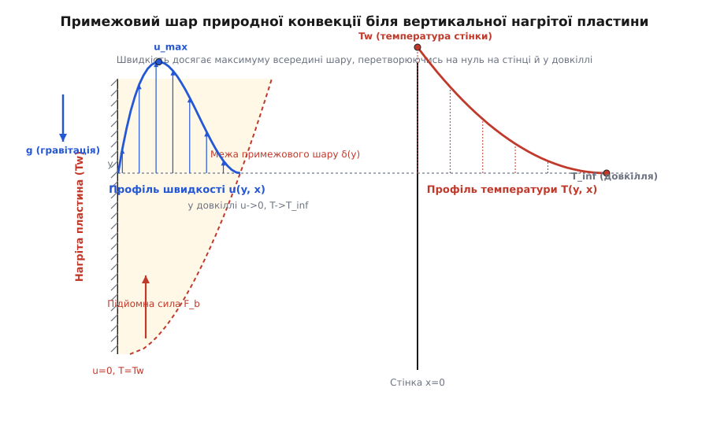
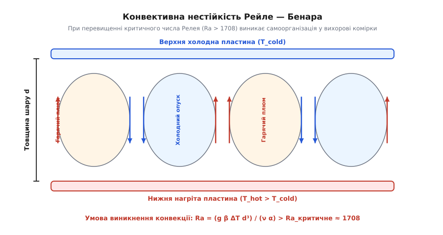
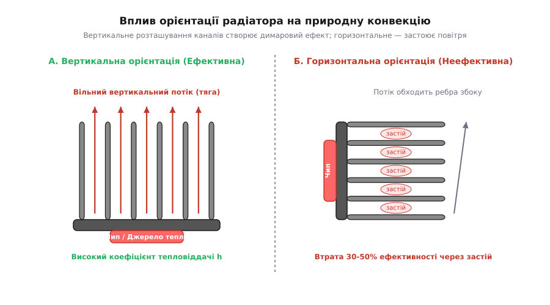

# Природна конвекція

<preknowlist>
- [Виштовхувальна сила (закон Архімеда)](book:physics/buoyancy) — умова виникання підйомної сили при різниці густин у полі гравітації.
- [В'язкість](book:physics/viscosity) — механізм внутрішнього тертя та дифузії імпульсу між шарами флюїду.
- [Густина](book:physics/density) — характеристика маси в одиниці об'єму та її температурне розширення.
- [Теплопровідність](book:physics/thermal-conductivity) — молекулярний перенос тепла без масового переміщення середовища.
- [Примежовий шар](book:physics/boundary-layer) — пристінкова область гальмування потоку та локалізації температурних градієнтів.
- [Число Прандтля](book:physics/prandtl-number) — безрозмірне співвідношення між дифузією імпульсу та дифузією тепла.
- [Число Рейнольдса](book:physics/mechanics/reynolds-number) — критерій співвідношення інерційних сил та в'язкого тертя.
- [Рівняння Нав'є — Стокса](book:physics/mechanics/navier-stokes) — математична основа механіки в'язких рідин і газів.
</preknowlist>

Електронний процесор потужністю 65 Ват, позбавлений примусового обдування вентилятором, миттєво розігрівається понад безпечну межу, якщо навколишнє повітря залишається повністю нерухомим. Проте навіть у закритому приміщенні без найменшого протягу повітря біля гарячого радіатора починає самочинно рухатися вгору зі швидкістю до половини метра за секунду. Це самоорганізоване переміщення газу або рідини, що виникає виключно за рахунок різниці температури й дії сили тяжіння без жодних зовнішніх насосів чи вентиляторів, називається **природною або вільною конвекцією** (від латинського *convectio* — «перенесення, доставлення»).

Природна конвекція є головним механізмом пасивного охолодження у техніці, формує циркуляцію повітря у приміщеннях, визначає морські бризи в атмосфері Землі й навіть рухає тектонічні плити в мантії нашої планети.

---

## 1. Фізична сутність та рушійний механізм

Усі флюїди (гази й рідини) змінюють свою густину при зміні температури. За поодинокими винятками (такими як аномалія води поблизу 4 °C), при нагріванні речовина розширюється, а її густина знижується.

Якщо у гравітаційному полі `g` розташовано тверду поверхню з температурою `T_w`, яка перевищує температуру навколишнього флюїду `T_∞`, шар рідини або газу безпосередньо біля стінки нагрівається шляхом теплопровідності. Внаслідок цього нагрітий елемент флюїду об'ємом `V` набуває меншої густини `ρ < ρ_∞`, ніж нерухоме охолоджене середовище навколо нього.

Відповідно до закону Архімеда, на цей елемент починає діяти виштовхувальна сила плавучості `F_b`, яка перевищує його власну вагу:

```
F_b = (ρ_∞ - ρ) · g · V
```

Виникає плавучість (англ. *buoyancy*), яка прискорює гарячу елементарну об'ємну частку вгору (у напрямку, протилежному вектору гравітації `g`). На її місце негайно припливає холодніший і щільніший флюїд із навколишнього середовища, створюючи неперервний самопідтримуваний контур циркуляції.

Проте зародженню цього руху протистоять два макроскопічні фізичні гальма:
1. **Внутрішнє тертя (динамічна в'язкість `μ` або кінематична в'язкість `ν = μ / ρ`):** вихори й шар зсуву чинять гідродинамічний опір руху елемента флюїду, гасячи кінетичну енергію в тепло.
2. **Молекулярна температуропровідність `α = k / (ρ · c_p)`:** теплопровідність намагається розмити й вирівняти температурне відхилення вспливаючого струменя раніше, ніж він встигне розігнатися.

Природна конвекція виникає і підтримується лише тоді, коли виштовхувальна сила плавучості переважає сумарний опір в'язкості й температурної дифузії.

Суттєвою відмінністю природної конвекції від вимушеної є те, що швидкість течії не задається ззовні (наприклад, вентилятором чи насосом), а є **внутрішньою характеристикою** самої термогідродинамічної системи. Швидкість руху флюїду є результатом складної двосторонньої взаємодії: температурне поле створює силу плавучості, яка викликає рух, а виникаючий рух переносить тепло (адвекція), перевизначаючи температурне поле.

---

## 2. Наближення Буссінеска та утворення завихреності

Для математичного опису природної конвекції французький фізик Жозеф Буссінеск у 1870 році запропонував елегантне спрощення рівнянь гідродинаміки Нав'є — Стокса.

Зміна густини реальних рідин і газів при помірних температурних перепадах `ΔT` є невеликою часткою від середнього значення (наприклад, для повітря при `ΔT = 30 K` відносна зміна густини `Δρ / ρ₀ ≈ 10%`). Тому Буссінеск припустив:
1. Зміною густини можна повністю знехтувати у всіх членах рівняння руху, де густина входить як міра інерції (член `ρ · ∂u/∂t`), замінивши її сталою опорною густиною `ρ₀`.
2. Зміна густини враховується **виключно** у члені масових сил гравітації `ρ · g`, оскільки саме вона створює силу плавучості.

За лінійним рівнянням стану через коефіцієнт об'ємного розширення `β = - (1/ρ₀)(∂ρ/∂T)_p`:

```
ρ(T) = ρ₀ · [1 - β · (T - T_∞)]
```

Підставляючи це у рівняння Нав'є — Стокса і вираховуючи рівноважний гідростатичний тиск `p₀` (`∇p₀ = ρ₀ · g`), отримуємо рівняння руху Буссінеска:

```
∂u/∂t + (u · ∇)u = - (1 / ρ₀) · ∇p' + ν · ∇²u - β · (T - T_∞) · g
```

де `p' = p - p₀` — надлишковий динамічний тиск, а останній член виражає питому силу плавучості. Повний математичний вивід цього рівняння та його незбіжних форм наведено у вставці [виведення наближення Буссінеска](book:physics/thermal-statistical/natural-convection/math-boussinesq.md).

Застосуємо до рівняння руху Буссінеска оператор ротора (`∇ ×`). Оскільки ротор від градієнта тиску тотожно дорівнює нулю (`∇ × ∇p' = 0`), виникає рівняння переносу завихреності `ω = ∇ × u`:

```
∂ω/∂t + (u · ∇)ω = (ω · ∇)u + ν · ∇²ω - β · ∇T × g
```

Член `- β · ∇T × g` демонструє глибинний механізм вільної конвекції: **бароклінну генерацію вихорів**. Якщо градієнт температури `∇T` (а отже й градієнт густини `∇ρ`) не колінеарний вектору гравітації `g`, у флюїді неминуче виникає обертальний момент сил, який закручує середовище й породжує вихорові циркуляційні комірки.

Цей ефект чітко видно біля вертикальної нагрітої стінки: градієнт температури `∇T` спрямований горизонтально від стінки вглиб рідини, а вектор гравітації `g` спрямований вертикально вниз. Векторний добуток `∇T × g` є перпендикулярним до площини течії, постійно ґенеруючи завихреність, яка піднімає рідину біля стінки.

---

## 3. Безрозмірні критерії подібності: Грасгоф, Релей, Нуссельт

Щоб визначити режим конвекції та перенести результати лабораторного випробування малої моделі на реальний великогабаритний об'єкт, гідродинаміка використовує безрозмірні числа подібності.

### Число Грасгофа (`Gr`)
Німецький інженер Франц Грасгоф сформулював співвідношення між підйомною силою плавучості та квадратом сил в'язкого тертя:

```
Gr_L = (g · β · ΔT · L³) / ν²
```

де `g` — прискорення вільного падіння [м/с²], `β` — коефіцієнт об'ємного розширення [1/К], `ΔT = T_w - T_∞` — температурний напір [К], `L` — характерний розмір тіла [м], `ν` — кінематична в'язкість [м²/с].

Фізичний зміст числа Грасгофа полягає у вираженні відношення масштабів швидкостей. Якщо визначити характерну масштабну швидкість вспливання під дією плавучості як `U_b = √(g · β · ΔT · L)`, то число Грасгофа є квадратом еквівалентного числа Рейнольдса, побудованого за цією швидкістю: `Gr = Re_b²`.

Число Грасгофа відіграє у природній конвекції таку ж роль, як число Рейнольдса `Re` у вимушеній течії: воно характеризує перехід від ламінарного руху до турбулентного.

### Число Прандтля (`Pr`)
Число Прандтля описує фізичні властивості самого флюїду як співвідношення між кінематичною в'язкістю (швидкістю дифузії імпульсу) та температуропровідністю (швидкістю дифузії тепла):

```
Pr = ν / α = (μ · c_p) / k
```

Для повітря та газів `Pr ≈ 0.71`, для води `Pr ≈ 2..10`, для машинних олив `Pr ≈ 50..10000`, а для рідких металів (натрій, ртуть) `Pr ≈ 0.005..0.03`.

Значення `Pr` визначає співвідношення товщин гідродинамічного `δ` та теплового `δ_t` примежових шарів. Для повітря (`Pr ≈ 0.71`) ці товщини є співмірними. У машинній олії (`Pr >> 1`) тепловий шар є значно тоншим за гідродинамічний, тоді як у рідких металах (`Pr << 1`) тепло поширюється далеко за межі сповільненого в'язкого шару.

### Число Релея (`Ra`)
Найважливішим параметром конвективної стійкості є число Релея, яке дорівнює добутку чисел Грасгофа та Прандтля:

```
Ra_L = Gr_L · Pr = (g · β · ΔT · L³) / (ν · α)
```

Число Релея показує відношення швидкості виділення потенціальної енергії плавучості до швидкості її дисипації за рахунок в'язкості й теплопровідності. Саме значення `Ra` є головним критерієм виникнення нестійкості та зміни режимів течії.

### Число Нуссельта (`Nu`)
Число Нуссельта характеризує ефективність конвективного теплообміну порівняно з чистою теплопровідністю нерухомого флюїду товщиною `L`:

```
Nu_L = (h · L) / k
```

де `h` — коефіцієнт тепловіддачі [Вт/(м²·К)], `k` — теплопровідність флюїду [Вт/(м·К)]. Якщо `Nu = 1`, конвекція відсутня і тепло передається виключно молекулярною теплопровідністю. Якщо `Nu >> 1`, конвективний рух домінує у переносі тепла.

Узагальнена інженерна залежність для природної конвекції має вигляд критеріального рівняння:

```
Nu = C · Raⁿ
```

де для ламінарного режиму показник ступеня `n ≈ 1/4`, а для турбулентного `n ≈ 1/3`.

---

## 4. Структура примежового шару природної конвекції

На відміну від вимушеної конвекції, де набігаючий потік має задану незакриту швидкість `U_∞` далеко від стінки, у природній конвекції навколишнє середовище на великій відстані є полностью нерухомим (`u(∞) = 0`).

З іншого боку, на самій твердій стінці виконується умова прилипання рідини (`u(0) = 0`).

Це створює унікальний профіль швидкості у примежовому шарі природної конвекції:
- На стінці (`y = 0`) швидкість дорівнює нулю.
- У міру віддалення від стінки швидкість зростає, досягаючи локального максимуму `u_max` у внутрішній частині гарячого шару.
- Далі, при наближенні до зовнішньої межі шару `y -> δ(x)`, швидкість асимптотично спадає назад до нуля.


*Профіль швидкості та температури у примежовому шарі природної конвекції біля вертикальної стінки: швидкість прямує до нуля як на стінці, так і у вільному довкіллі, досягаючи максимуму всередині шару.*

Товщина теплового та динамічного примежового шару `δ(x)` вздовж вертикальної пластини висотою `x` зростає за законом:

```
δ(x) ∝ x^(1/4)
```

Автомодельне рішення Польгаузена та Остраха для ламінарного примежового шару біля вертикальної пластини дає точне співвідношення для місцевого числа Нуссельта:

```
Nu_x = 0.508 · Pr^(1/4) · (0.952 + Pr)^(-1/4) · Gr_x^(1/4)
```

При малих значеннях числа Релея (`Ra_x < 10⁹`) потік у примежовому шарі залишається гладким і ламінарним. При перевищенні критичного значення `Ra_x ≈ 10⁹` у шарі виникають хвилі Tollmien — Schlichting, потік втрачає стійкість і розпадається на турбулентні вихори, що різко підсилює інтенсивність перемішування та коефіцієнт тепловіддачі `h`.

У турбулентному режимі (`Ra_x > 10⁹`) товщина примежового шару починає зростати значно швидше (`δ(x) ∝ x^(2/5)`), а місцевий коефіцієнт тепловіддачі `h_x` перестає залежати від висоти пластини `x`. Це пояснюється тим, що при розвиненій турбулентності тепловий опір зосереджений у дуже тонкому пристінковому в'язкому підшарі, товщина якого є постійною вздовж висоти.

---

## 5. Динаміка вільного конвективного плюму та нестаціонарне зародження

Коли нагрітий потік повітря залишає верхню кромку вертикальної нагрітої пластини або обтікає точкове джерело тепла (наприклад, свічку чи гарячу лампу), він перестає обмежуватися стінкою і перетворюється у **вільний конвективний плюм** (англ. *buoyant plume*).

У вільному плюмі відсутнє в'язке гальмування об стінку. Максимум швидкості розгону знаходиться у самому центрі вільного струменя. Під час підйому вгору плюм активно підсмоктує (англ. *entrainment*) нерухоме холодне повітря з боків.

Внаслідок залучення навколишньої маси ширина плюму `b(z)` зростає лінійно з висотою `z`:

```
b(z) ∝ z
```

тоді як максимальна температура у центрі плюму `ΔT_max(z)` спадає, а сумарний масовий витратний потік флюїду `M(z)` зростає як `z^(5/3)` для точкового джерела тепла.

Якщо джерело тепла є неперервно діючим, плюм виходить на турбулентний факельний режим, утворюючи теплові терми (англ. *thermals*), які є головним підйомним механізмом для ширяння птахів та планеристів в атмосфері.

### Нестаціонарний розвиток течії з стану спокою:
Коли нагрівач миттєво вмикається у нерухомому флюїді, процес розвитку природної конвекції проходить три чіткі послідовні фази:

1. **Фаза чистої теплопровідності (початкова фаза):** Протягом найперших часток секунди швидкість руху дорівнює нулю. Тепло поширюється від стінки суто молекулярною теплопровідністю, а товщина теплового шару зростає за законами одномірної дифузії: `δ_t ∝ √(α · t)`.
2. **Перехідна фаза (розгон плавучості):** Внаслідок нагрівання виникає виштовхувальна сила плавучості. Флюїд починає прискорюватися вгору. Виникає нестійке закидання температури (проскок температури, англ. *thermal overshoot*), коли тимчасовий коефіцієнт тепловіддачі знижується до мінімуму.
3. **Стаціонарна фаза примежового шару:** Настає баланс між вертикальним адвективним винесенням тепла та припливом холодної маси знизу. Формується стабільний примежовий шар із постійним у часі профілем швидкості.

---

## 6. Конвективна нестійкість та комірки Рейле — Бенара

Якщо плоский горизонтальний шар рідини товщиною `d` нагрівати знизу, а зверху охолоджувати, виникає специфічний тип нестійкості. Нижній шар рідини прагне вспливти, але верхній холодний шар тисне донизу.

Поки число Релея нижче критичного порогу `Ra_c ≈ 1708` (для твердих верхньої та нижньої меж), рідина залишається повністю нерухомою, а тепло передається виключно чистою теплопровідністю (`Nu = 1`).

Коли перепад температур зростає і `Ra` перевищує `1708`, стаціонарний стан втрачає стійкість. Рідина самоорганізується у впорядковану тривимірну структуру з конвективних комірок, відомих як **комірки Бенара**.


*Конвективна нестійкість Рейле — Бенара у горизонтальному шарі рідини: при Ra > 1708 нерухомий стан розпадається на парні замкнені вихорові комірки.*

У центрі кожної комірки нагрітий флюїд піднімається у вигляді гарячого плюму, розтікається біля верхньої охолодженої поверхні, віддає тепло і стікає вниз вздовж периметра комірки.

При подальшому підвищенні числа Релея (`Ra > 10⁴`) шестикутні комірки втрачають стійкість, перетворюючись на двовимірні конвективні валки (роли). При `Ra > 10⁵` виникають вторинні нестійкості з осциляціями валків, а при `Ra > 10⁶` потік переходить у хаотичну турбулентну конвекцію (турбулентність Релея — Бенара), де тепло переноситься спорадичними вертикальними плюмами гарячої та холодної рідини.

Детальний історичний опис того, як експерименти Бенара 1900 року та теорія Релея 1916 року привела Едварда Лоренца до відкриття детермінованого хаосу та дивного атрактора, винесено у вставку [історія відкриття конвективної нестійкості](book:physics/thermal-statistical/natural-convection/hist-rayleigh-benard.md).

Для чисельного спостереження за виникненням конвективних вихорів та еволюцією поля завихреності на сітці розроблено комп'ютерну модель у вставці [чисельне моделювання конвекції](book:physics/thermal-statistical/natural-convection/proj-rayleigh-benard-sim.md).

---

## 7. Змішана конвекція та режимний перехід

У багатьох реальних технічних системах природна конвекція діє одночасно з вимушеним обдуванням (наприклад, серверна шафа з вентиляторами, де виникає гаряча зона, або вітровий потік навколо гарячої труби). Така комбінована течія називається **змішаною конвекцією** (англ. *mixed convection*).

Співвідношення між природною та вимушеною конвекцією визначається безрозмірним **числом Річардсона** (`Ri`):

```
Ri = Gr / Re² = (g · β · ΔT · L) / U_∞²
```

де `U_∞` — швидкість зовнішнього вимушеного потоку, а `Re = U_∞ · L / ν` — число Рейнольдса.

Фізична класифікація режимів течії за числом Річардсона:
- **`Ri << 0.1` — домінує вимушена конвекція.** Впливом сил плавучості можна повністю знехтувати.
- **`0.1 <= Ri <= 10` — режим змішаної конвекції.** Сили плавучості та інерційні сили вимушеного потоку є співмірними. Розрахунок теплообміну вимагає врахування обох ефектів.
- **`Ri > 10` — домінує природна конвекція.** Зовнішній потік є настільки слабким, що рух повністю визначається підйомною силою.

Залежно від взаємного напрямку вимушеного потоку й сили плавучості розрізняють:
1. **Співнаправлена течія (англ. *assisting flow*):** вимушений потік спрямований вгору біля нагрітої стінки. Сила плавучості прискорює потік, що збільшує коефіцієнт тепловіддачі `h`.
2. **Протилежна течія (англ. *opposing flow*):** вимушений потік спрямований вниз уздовж нагрітої стінки. Плавучість гальмує пристінний шар, викликаючи відрив течії та неусталені осциляції.
3. **Поперечна течія (англ. *transverse flow*):** вимушений потік спрямований горизонтально вздовж вертикальної нагрітої стінки. Приєднується вторинна вертикальна циркуляція, створюючи тривимірний гвинтовий потік.

---

## 8. Прикладна інженерія та пасивне охолодження

Природна конвекція є основою пасивної системи тепловідведення без рухомих деталей у силовій електроніці, LED-освітленні, процесорних кулерах та трансформаторах.

> 🔧 **Навіщо це.**
> Відсутність вентилятора гарантує абсолютну безшумність, нульове енергоспоживання на власні потреби та необмежений термін служби (MTBF) системи охолодження. Проте коефіцієнт тепловіддачі при природній конвекції у повітрі є відносно малим: `h_nat ≈ 3..12 Вт/(м²·К)` порівняно з вимушеним обдуванням вентилятором (`h_forced ≈ 30..150 Вт/(м²·К)`).
> Тому інженер мусить максимально збільшувати площу поверхні радіатора та оптимізувати геометрію каналів, щоб уникнути перегріву напівпровідникового кристала.

### Орієнтація ребер радіатора у просторі
Найпоширеніша помилка при проектуванні пасивних радіаторів — ігнорування напрямку вектора гравітації. 

Ребра радіатора мусять орієнтуватися строго **вертикально**. У такому разі між ребрами утворюються вертикальні канали, в яких виникає природний «димаровий ефект» (англ. *chimney effect*): нагріте повітря прискорюється вгору, безперешкодно всмоктуючи свіже холодне повітря знизу.


*Порівняння ефективності орієнтації пасивного радіатора: вертикальні канали створюють вільну вертикальну тягу, тоді як горизонтальні ребра блокують потік, зменшуючи тепловіддачу на 30–50%.*

Якщо радіатор повернути горизонтально, вертикальний підйом повітря блокується верхніми ребрами, між якими утворюються застійні гарячі подушки. Це призводить до падіння ефективності теплообміну на 30–50%.

### Оптимальний крок між ребрами (`S_opt`)
Спроба розмістити якомога більше ребер на обмеженій основі радіатора призводить до зворотного ефекту. Якщо зазор між ребрами `S` є занадто малим, в'язкі примежові шари сусідніх ребер змикаються, повністю закупорюючи канал для повітря.

Оптимальна відстань між ребрами `S_opt`, що забезпечує максимальний знімальний тепловий потік з одиниці об'єму радіатора висотою `L`, визначається за формулою Еленібааса:

```
S_opt = 2.71 · [ (ν · α · L) / (g · β · ΔT) ]^(1/4)
```

Для типових радіаторів у повітрі при `L = 100 мм` оптимальний зазор становить `S_opt ≈ 6..8 мм`.

### Врахування променевого теплообміну (випромінювання)
У системних розрахунках пасивних радіаторів важливо пам'ятати, що при природній конвекції у повітрі значна частка тепла (від 25% до 45%) відводиться не конвекцією, а інфрачервоним випромінюванням за законом Стефана — Больцмана.

Загальний коефіцієнт тепловіддачі радіатора `h_total` є сумою конвективної та променевої складових:

```
h_total = h_conv + h_rad
```

де променевий коефіцієнт `h_rad` виражається як:

```
h_rad = ε · σ · (T_w² + T_∞²) · (T_w + T_∞)
```

де `ε` — коефіцієнт чорноти поверхні (`ε ≈ 0.85..0.92` для анодованого чорного алюмінію, але лише `ε ≈ 0.05` для чистого полірованого алюмінію), `σ = 5.67·10⁻⁸ Вт/(м²·К⁴)` — стала Стефана — Больцмана.

Саме тому анодування або покраска радіатора у чорний або білий колір (обидва мають високу випромінювальну здатність в ІЧ-діапазоні) збільшує сумарну тепловіддачу на 25–35% порівняно з чистим голим металом при природній конвекції.

Повний набір інженерних формул для розрахунку кулі, циліндрів, горизонтальних пластин та замкнених повітряних прошарків двокамерних склопакетів наведено у вставці [довідник емпіричних співвідношень](book:physics/thermal-statistical/natural-convection/api-convection-correlations.md).

---

## 9. Внутрішня конвекція у термосифонах та замкнених контурах

Окремим важливим класом технічних застосувань є природна конвекція у закритих замкнених петлях, відомих як **гравітаційні термосифони** або контури природної циркуляції.

У термосифоні джерело нагріву розміщується у нижній частині контуру, а охолоджувач (конденсатор) — у верхній частині. Рідина в нагрітому коліні стає легшою й піднімається вгору, а в охолодженому протилежному коліні стає важчою й опускається вниз. Виникає стійка самопливна циркуляція рідкого теплоносія під дією рушійного напору плавучості `Δp_b`:

```
Δp_b = ∫ [0..H] (ρ_cold(z) - ρ_hot(z)) · g dz
```

Цей рушійний напір врівноважується гідравлічним опором тертя рідини об стінки труби `Δp_friction`.

### Застосування у ядерній енергетиці та сонячних колекторах:
1. **Пасивна безпека ядерних реакторів:** Сучасні атомні реактори (наприклад, AP1000 чи VVER-TOI) оснащуються пасивними системами відведення залишкового тепловиділення (ПСОВТ). У разі повного знеструмлення станції (Blackout) циркуляційні насоси зупиняються, і охолодження активної зони реактора переходить у режим чистої природної циркуляції, запобігаючи розплавленню активної зони.
2. **Сонячні водонагрівачі:** Сонячні панелі гарячого водопостачання встановлюють нижче накопичувального бака. Подачі води насосом не потрібно: нагріта сонцем вода самостійно піднімається у бак-накопичувач за рахунок термосифонного ефекту.

---

## 10. Природна конвекція у природі та планетарних масштабах

Масштаби природної конвекції простягаються від мікроскопічних крапель до гігантських астрофізичних об'єктів.

### Денний та нічний бриз
У прибережних зонах океанів і морів суходол має значно меншу теплоємність, ніж вода. Вдень суша нагрівається сонцем швидше за воду, повітря над нею вспливає вгору, і з моря на сушу дме прохолодний **морський бриз**. Вночі суша охолоджується швидше за воду, нагріте повітря піднімається над морем, і потік змінює напрямок на зворотний (**береговий бриз**).

### Мантійна конвекція Землі
Тверда мантія Землі товщиною близько 2900 км під дією колосального тиску й температури поводиться як надв'язка рідина на масштабах мільйонів років (`ν ≈ 10¹⁷ м²/с`). Внутрішнє радіогенне тепло ядра розігріває нижню мантію, створюючи мантійну конвекцію. Нагріті мантійні плюми піднімаються до кори, розсуваючи літосферні плити у серединно-океанічних хребтах (спрединг), тоді як холодні океанічні плити занурюються у мантію в зонах субдукції. Це є головним рушієм тектоніки плит і землетрусів.

### Конвективна зона Зірок
У зірках середньої та малої маси (включно із Сонцем) зовнішня оболонка товщиною близько 200 000 км перебуває у стані бурхливої турбулентної конвекції. Непрозорість сонячної плазми робить променистий перенос тепла недостатнім, тому плавучі конвекційні потоки піднімають гарячу плазму до фотосфери. На поверхні Сонця ми спостерігаємо цю конвекцію у вигляді сонячної грануляції — мільйонів конвективних осередків розміром близько 1000 км кожен.
