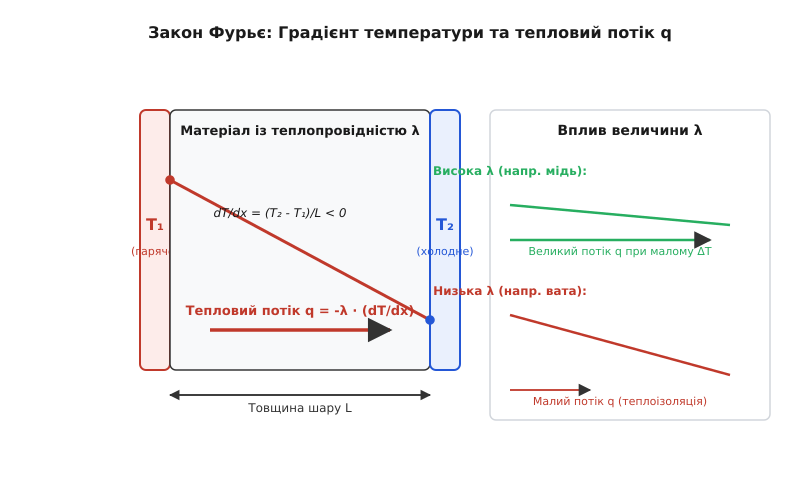
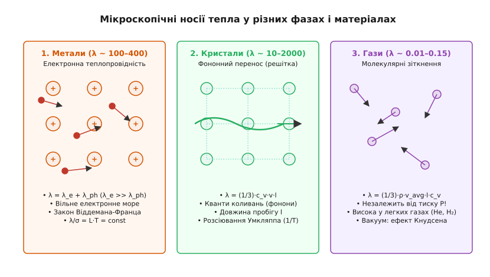
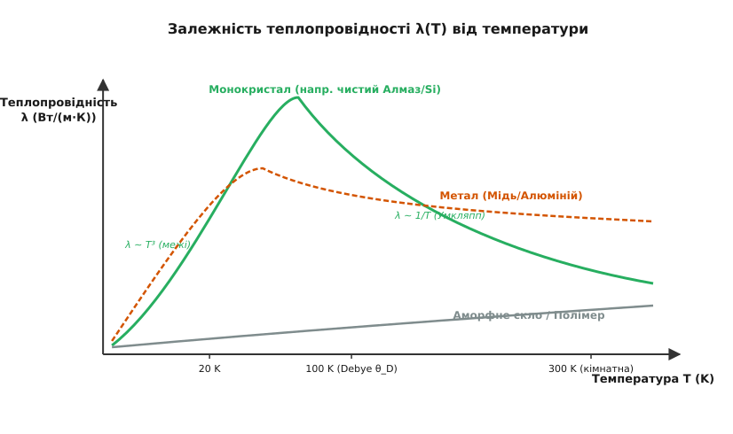
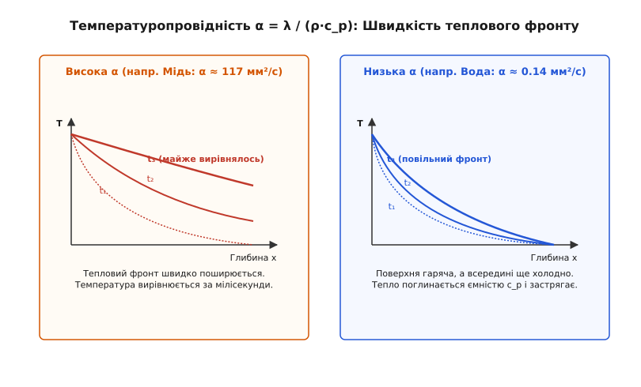
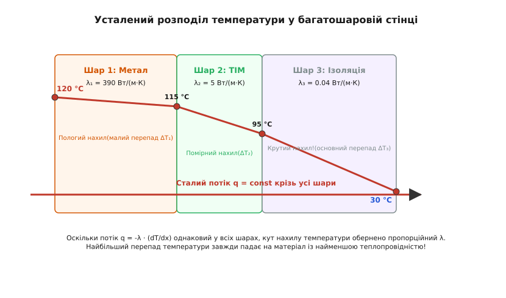

# Теплопровідність матеріалів (λ)

<preknowlist>
- [Закон Джоуля-Ленца](book:physics/joule-heating) — перетворення електричної енергії на тепловий потік у тілі провідника.
- [Електричний опір](book:physics/resistance) — протидія матеріалу проходженням носіїв заряду.
- [Тепловий опір](book:physics/thermal-statistical/thermal-resistance) — еквівалент електричного опору для теплових потоків (°C/Вт).
- [Дрейф електронів](book:physics/condensed-matter-physics/electron-drift) — хаотичний та спрямований рух носіїв заряду у твердому тілі.
</preknowlist>

Коли ви торкаєтеся металевої ложки, зануреної у гарячий чай, пальці миттєво відчувають пекуче тепло. Якщо ж у той самий чай занурити дерев'яну паличку або пластмасову ложку, її протилежний кінець годинами залишається холодним. Хоча обидва предмети перебувають в однакових зовнішніх умовах, швидкість переносу теплової енергії крізь їхню речовину відрізняється у тисячі разів. Описом цієї фундаментальної властивості матерії займається **теплопровідність** — мікроскопічний процес переносу кінетичної енергії хаотичного руху частинок від більш нагрітих ділянок тіла до менш нагрітих без макроскопічного переміщення самої речовини. 

Кількісною мірою цієї здатності є коефіцієнт теплопровідності `λ` (у зарубіжній науковій літературі позначуваний як `k` або `κ`). Розуміння механізмів теплопровідності є межею між успіхом і катастрофою у сучасній інженерії: від нього залежить, чи витримає кристал силового процесора колосальний тепловий потік у сотні ват на квадратний сантиметр, чи розплавиться космічний апарат при вході в щільні шари атмосфери і чи збереже житловий будинок тепло у лютий мороз.

---

### Невидимий річковий потік енергії: Закон Фурьє

Щоб зрозуміти, як тепло пересувається всередині твердого тіла, уявимо різницю температур `ΔT = T₁ - T₂` між двома паралельними площинами, віддаленими на відстань `L`. Температура у кожній точці є мірою середньої кінетичної енергії мікроскопічного руху частинок. Гаряча стінка має високоенергетичні, збуджені частинки, а холодна — повільні. Через неперервну міжчастинкову взаємодію енергія вищого ступеня збудження неминуче передається сусідам, утворюючи спрямований потік тепла.


*Закон Фурьє: густина теплового потоку q спрямована проти градієнта температури dT/dx. У матеріалах із високою теплопровідністю λ (наприклад, у міді) великий потік протікає при незначному перепаді температур, тоді як в ізоляторах (наприклад, у ваті) для створення аналогічного потоку потрібен величезний градієнт.*

У 1807 році французький математик і фізик Жозеф Фур'є сформулював векторний закон, що описує цей процес (детальніше про драматичну історію цього відкриття та суперечки Фур'є з Лапласом і Лагранжем читайте у 📜 [Відкритті закону теплопровідності](book:physics/thermal-statistical/thermal-conductivity/hist-fourier-law.md)): **густина теплового потоку `q` (кількість тепла, що проходить крізь одиницю площі за одиницю часу, Вт/м²) прямо пропорційна градієнту температури `∇T`**:

```
q = -λ · ∇T
```

В одновимірному випадку для плоского шару завтовшки `L` із перепадом температур `ΔT = T₁ - T₂` (де `T₁ > T₂`) закон Фурьє набуває простого скалярного вигляду:

```
q = -λ · (dT/dx) = λ · (T₁ - T₂) / L
```

Знак «мінус» у фундаментальному рівнянні має глибокий фізичний зміст: тепловий потік завжди спрямований **проти** вектора градієнта температури — тобто від гарячого до холодного, у бік зменшення температурного потенціалу. Якщо помножити густину потоку `q` на площу поперечного перерізу `A`, ми отримаємо повну теплову потужність `Q/t = P` у ватах (Дж/с):

```
P = Q / t = λ · A · (T₁ - T₂) / L
```

Звідси легко виразити одиницю вимірювання коефіцієнта теплопровідності `λ` в Міжнародній системі одиниць (SI):

```
[λ] = [P] · [L] / ( [A] · [ΔT] )
= Вт · м / ( м² · К )
= Вт / (м·К)
```

Фізичний зміст коефіцієнта `λ` такий: **чисельно він дорівнює тепловій потужності у ватах, яка проходить крізь куб матеріалу з ребром 1 метр при різниці температур між протилежними гранями в 1 кельвін (або 1 °C)**. Якщо матеріал має `λ = 400 Вт/(м·К)` (як мідь), це означає, що при градієнті 1 °C на метр крізь кожен квадратний метр протікає потік у 400 ват. Якщо ж `λ = 0.04 Вт/(м·К)` (як мінеральна вата), той самий градієнт викличе потік лише у 0.04 вати.

---

### Три стовпи мікросвіту: хто розносить тепло у матерії

Різниця у значеннях `λ` для різних речовин вражає своїми масштабами: вона охоплює понад сім порядків — від `0.005 Вт/(м·К)` у вакуумно-пористих панелях до `5000 Вт/(м·К)` у моношаровому графені. Така колосальна різниця пояснюється тим, що у різних фазових станах і матеріальних структурах працюють кардинально різні **мікроскопічні носії тепла**.


*Мікроскопічні носії тепла: у металах домінує вільний електронний газ (електронна провідність); у діелектричних кристалах — кванти решіткових коливань (фонони); у газах — пружні зіткнення хаотичних молекул на довжині вільного пробігу l.*

#### 1. Метали: море вільних електронів (`λ_e`)

У металах атоми віддають свої валентні електрони у спільне користування, утворюючи кристалічну ґратку з позитивних іонів, занурену у вироджений [газ вільних електронів](book:physics/condensed-matter-physics/electron-drift). Коли один кінець металевої деталі нагрівається, електрони у цій зоні отримують додаткову кінетичну енергію і починають рухатися з високими ферміївськими швидкостями (`v_F ≈ 10⁶ м/с`). Вони стрімко дифундують у холодну зону, де під час зіткнень з іонами решітки передають їм свою енергію.

Оскільки ті самі вільні електрони відповідають і за перенос електричного заряду, існує прямий зв'язок між теплопровідністю `λ` та питомою електричною провідністю `σ`. У 1853 році німецькі фізики Густав Віддеман та Франц Франц емпірично виявили, а Людвіґ Лоренц у 1872 році теоретично обґрунтував **закон Віддемана-Франца**:

```
λ / σ = L · T
```

де `T` — абсолютна температура в кельвінах, а `L` — теоретична константа, звана **числом Лоренца**:

```
L = (π² / 3) · (k_B / e)² ≈ 2.44 × 10⁻⁸ Вт·Ом/К²
```

Сумарний тепловий опір металів описується правилом Маттейссена: результуючий електронний тепловий опір `W_e = 1 / λ_e` складається з решіткового розсіювання електронів на фононах `W_ph` та розсіювання на домішках і дефектах `W_imp`:

```
1 / λ_e = W_e = W_ph + W_imp
```

Завдяки електронному морю метали є неперевершеними провідниками тепла: срібло (`λ ≈ 429 Вт/(м·К)`), мідь (`λ ≈ 401 Вт/(м·К)`), золото (`λ ≈ 318 Вт/(м·К)`) та алюміній (`λ ≈ 237 Вт/(м·К)`). Проте впровадження домішок у метал руйнує періодичність решітки й створює додаткові центри розсіювання для електронів, що різко знижує як `σ`, так і `λ`. Наприклад, чисте залізо має `λ ≈ 80 Вт/(м·К)`, легована вуглецева сталь — `λ ≈ 50 Вт/(м·К)`, а високолегована нержавіюча сталь 316L — лише `λ ≈ 15 Вт/(м·К)`.

Крім того, число Лоренца `L(T)` незначно відхиляється від теоретичного значення при середніх температурах (40–150 K). Це пояснюється тим, що непружне низькокутове розсіювання електронів на довгохвильових фононах ефективно руйнує електричний струм (змінює напрямок руху електрона), але майже не змінює його енергію, через що електричний опір зростає швидше за тепловий.

#### 2. Діелектричні кристали: фононний газ (`λ_ph`)

У діелектриках немає вільних електронів, але жорстко зв'язані атоми кристалічної решітки знаходяться у постійному коливальному русі довкола положень рівноваги. Зсув одного атома через пружні зв'язки викликає зсув сусіднього — по кристалу поширюються збудження у вигляді акустичних і оптичних хвиль. У квантовій фізиці ці колективні зміщення решітки описуються як квазічастинки — **фонони**.

Перенос тепла у діелектричному кристалі можна розглядати як рух **фононного газу**, до якого застосовна кінетична формула Больцмана:

```
λ_ph = (1/3) · c_v · v · l
```

де `c_v` — об'ємна теплоємність решітки [Дж/(м³·К)], `v` — середня швидкість звуку у кристалі (`v ≈ 3000 – 12000 м/с`), а `l` — середня довжина вільного пробігу фононів між зіткненнями.

Якщо кристал має надзвичайно жорсткі ковалентні зв'язки, малу атомну масу складників та високу періодичну впорядкованість, швидкість звуку `v` стає величезною, а довжина пробігу `l` досягає мікронів. Саме тому монокристалічний **алмаз** (`λ ≈ 2000 – 2300 Вт/(м·К)`) перевершує за теплопровідністю срібло у п'ять разів, залишаючись при цьому ідеальним електричним ізолятором! Аналогічно високопровідними діелектриками є карбід кремнію (4H-SiC, `λ ≈ 370–490 Вт/(м·К)`) та нітрид алюмінію (AlN, `λ ≈ 200 Вт/(м·К)`).

Крім того, шаруваті кристалічні структури демонструють вражаючу **анізотропію теплопровідності**. У **графіті** та **графені** сильні ковалентні sp²-зв'язки у площині шару забезпечують високу поздовжню теплопровідність `λ_in-plane ≈ 2000 – 5000 Вт/(м·К)`, тоді як між шарами діють слабкі ван-дер-ваальсові сили, через що поперечна теплопровідність становить лише `λ_cross-plane ≈ 5 – 10 Вт/(м·К)` (анізотропія у 500 разів!).

#### 3. Гази: хаотичні молекулярні зіткнення (`λ_gas`)

У газах відстані між молекулами значно більші за їхні власні розміри. Молекули хаотично рухаються зі середньою тепловою швидкістю `v_avg = √(8·k_B·T / (π·m))`. Коли виникає градієнт температури, молекули з гарячої області пролітають середню довжину вільного пробігу `l = 1 / (√2 · π · d² · n)` і під час зіткнень передають надлишок своєї кінетичної енергії холоднішим молекулам.

Кінетична теорія газів дає для їхньої теплопровідності формулу:

```
λ_gas = (1/3) · ρ · v_avg · l · c_v
```

Звідси випливає знаменитий **парадокс Максвелла**: *теплопровідність ідеального газу за кімнатної температури НЕ залежить від його тиску та густини!* При підвищенні тиску густина газу `ρ` зростає прямо пропорційно `P`, але довжина вільного пробігу `l` падає обернено пропорційно `P`, тому їхній добуток `ρ · l` залишається сталим. Повітря за тиску 0.1 атм і за тиску 10 атм проводить тепло абсолютно однаково (`λ ≈ 0.026 Вт/(м·К)`).

Ця незалежність порушується лише тоді, коли тиск падає настільки низько (вакуум), що довжина вільного пробігу `l` стає більшою за розміри самого судини `D` (режим Кнудсена). Тоді молекули літають від стінки до стінки без міжмолекулярних зіткнень, і теплопровідність починає падати прямо пропорційно тиску `P` — на цьому принципі базуються вакуумна ізоляція термосів та вакуумні індикаторні датчики Пірані.

Крім того, оскільки теплова швидкість `v_avg` обернено пропорційна квадратному кореню з маси молекули `√M`, легкі гази мають набагато вищу теплопровідність, ніж важкі:
- Водень (H₂, `M = 2`): `λ ≈ 0.182 Вт/(м·К)`
- Гелій (He, `M = 4`): `λ ≈ 0.151 Вт/(м·К)`
- Повітря (`M ≈ 29`): `λ ≈ 0.026 Вт/(м·К)`
- Ксенон (Xe, `M = 131`): `λ ≈ 0.0057 Вт/(м·К)`

#### 4. Аморфні речовини та полімери

У полімерах, пластмасах та силікатному склі відсутній далекий порядок розташування атомів. Фонони не можуть вільно поширюватися у вигляді струнких хвиль і розсіюються на кожному просторовому нерозумінні решітки. Довжина вільного пробігу фононів падає до міжатомних відстаней (`l ≈ 0.5 – 1 нм`). Як наслідок, аморфні речовини мають вкрай низьку теплопровідність: віконне скло `λ ≈ 0.96 Вт/(м·К)`, текстоліт `λ ≈ 0.23 Вт/(м·К)`, поліетилен `λ ≈ 0.33 Вт/(м·К)`.

---

### Температурна залежність λ(T): від абсолютного нуля до плавлення

Теплопровідність не є застиглою константою матеріалу — вона суттєво змінюється при зміні температури. Характер цієї залежності `λ(T)` дозволяє фізикам точнісінько визначити, який саме механізм розсіювання носіїв домінує у даному температурному діапазоні.


*Температурний хід λ(T) для монокристала, металу та аморфного скла. У чистих монокристалах спостерігається високий пік теплопровідності при низьких температурах (20–100 K), зумовлений переходом від межового розсіювання фононів (λ ~ T³) до процесів Умкляппа (λ ~ 1/T).*

#### А. Кристалічні діелектрики: трьохзональний хід

1. **Низькотемпературний режим (`T → 0 K`):** За температур, набагато нижчих за температуру Дебая (`T << θ_D`), кількість фононів мала, і вони майже не зіштовхуються один з одним. Довжина вільного пробігу `l` обмежується виключно геометричними розмірами самого зразка `L_specimen` або межами зерен кристала (`l ≈ L_specimen = const`). Оскільки решіткова теплоємність за законом Дебая зростає як `c_v ∝ T³`, теплопровідність діелектрика при наближенні до абсолютного нуля зростає за кубічним законом:
   ```
   λ_ph(T) ∝ T³        (при T → 0 K)
   ```
2. **Область піку (20 – 100 K):** Зі зростанням температури теплоємність досягає насичення, а довжина пробігу фононів все ще залишається великою. На цьому інтервалі `λ(T)` досягає гігантського піку. Для надчистого ізотопно збагаченого монокристала алмазу (99.99% ¹²C) при 80 K теплопровідність сягає фантастичного значення **10 000 – 40 000 Вт/(м·К)**!
3. **Високотемпературний режим (`T > θ_D`):** При високих температурах концентрація фононів стає настільки високою, що починають домінувати **процеси Умкляппа** (*Umklapp scattering*) — зіткнення трьох фононів із результуючим вектором імпульсу, що виходить за межі першої зони Бріллюена і розвертає потік енергії назад. Кількість фононів-розсіювачів пропорційна `T`, тому довжина вільного пробігу спадає як `l ∝ 1/T`. Оскільки теплоємність при високих температурах є сталою (законом Дюлонга-Пті), теплопровідність кристала спадає обернено пропорційно температурі:
   ```
   λ_ph(T) ∝ 1 / T     (при T > θ_D)
   ```

#### Б. Метали: боротьба електронно-фононного розсіювання

У чистих металах за високих температур (`T > θ_D`) електронна теплопровідність залишається майже постійною (`λ_e ≈ const`), оскільки зростання температури збільшує електричний опір `ρ_e ∝ T`, що у формулі Віддемана-Франца `λ = L·T / ρ_e` взаємно компенсаційно скорочує `T`. При кріогенних температурах (10–30 K) у металах також спостерігається пік теплопровідності (для чистої міді — до `10 000 Вт/(м·К)`), де розсіювання електронів на імпульсах решітки стає мінімальним.

---

### Фізика наноструктур та термоелектричний парадокс

При зменшенні розмірів кристала до нанометрових масштабів (нанонитки, тонкі плівки, надрешітки) виникають нові квантові та геометричні ефекти переносу тепла.

Коли товщина нанонитки `D_wire` стає меншою за середню довжину вільного пробігу фононів у об'ємному матеріалі `l_bulk` (для кремнію `l_bulk ≈ 300 нм` при 300 K), фонони починають неперервно розсіюватися на зовнішніх межах нанонитки:

```
l_eff ≈ D_wire
```

Це спричиняє так зване **межове розсіювання фононів**, через яке теплопровідність кремнієвої нанонитки діаметром 20 нм падає зі значення `148 Вт/(м·К)` до всього лише **`2 – 5 Вт/(м·К)`** (падіння у 50 разів!).

Цей ефект виявився грандіозним проривом для **термоелектрики**. Безрозмірний коефіцієнт термоелектричної якості матеріалу `ZT` обчислюється за формулою:

```
ZT = ( S² · σ · T ) / λ
```

де `S` — коефіцієнт Зеєбека, `σ` — електрична провідність, а `λ = λ_e + λ_ph` — сумарна теплопровідність. У звичайних кристалах спроба підвищити `σ` неминуче збільшує `λ_e` за законом Віддемана-Франца. Проте у наноструктурованих матеріалах науковці навчилися вибірково пригнічувати решіткову складову `λ_ph` за рахунок межового розсіювання фононів, **не погіршуючи при цьому електронну провідність `σ`**. 

Концепція «фононного скла та електронного кристала» (*Phonon-Glass Electron-Crystal, PGEC*), втілена у скуттерудитах та клатратах, дозволяє створювати високоефективні генератори струму, що перетворюють вихлопне тепло двигунів та космічних радіоізотопних джерел (РІТЕГ) безпосередньо на електрику.

---

### Динаміка теплового фронту: Теплопровідність (λ) проти Температуропровідності (α)

У багатьох практичних задачах температура поверхні зміщується неперервно у часі (наприклад, під час імпульсного нагріву лазером, при пуску двигуна чи при включенні транзистора). Тут одного лише коефіцієнта теплопровідності `λ` стає недостатньо для опису процесу.


*Порівняння поширення теплового фронту для матеріалів з однаковою теплопровідністю, але різною температуропровідністю α = λ / (ρ·c_p). Матеріал із високим α (мідь) миттєво проводить теплову хвилю углиб, тоді як матеріал із низьким α (вода/дерево) поглинає тепло поверхневим шаром.*

Складемо диференціальний баланс збереження енергії для малого об'єму матеріалу. Швидкість зміни температури у часі `∂T/∂t` залежить від відношення теплового потоку, що зайшов у об'єм, до об'ємної теплоємності матеріалу `C_v = ρ · c_p` (де `ρ` — густина, кг/м³, а `c_p` — питома теплоємність, Дж/(кг·К)). Це відношення називається **коефіцієнтом температуропровідності `α`**:

```
α = λ / (ρ · c_p)      [м²/с  або  мм²/с]
```

Звідси випливає тривимірне диференціальне рівняння теплопровідності (детальне виведення та математичні властивості граничних умов дивіться у 🧮 [Виведенні рівняння теплопровідності](book:physics/thermal-statistical/thermal-conductivity/math-heat-equation.md)):

```
∂T/∂t = α · ∇²T + q_gen / (ρ · c_p)
```

Розкриємо фундаментальну відмінність між `λ` та `α`:

- **Теплопровідність `λ` [Вт/(м·К)]** показує, **яку теплову потужність** здатний пропустити матеріал у стаціонарному режимі (коли температура в кожній точці вже перестала змінюватися у часі).
- **Температуропровідність `α` [мм²/с]** показує **швидкість поширення температурної хвилі (зміни температурного поля)** у нестаціонарних перехідних процесах.

Розглянемо яскравий порівняльний приклад: **мідь проти води**.

| Матеріал | Теплопровідність λ [Вт/(м·К)] | Густина ρ [кг/м³] | Питома теплоємність c_p [Дж/(кг·К)] | Об'ємна теплоємність ρ·c_p [МДж/(м³·К)] | Температуропровідність α [мм²/с] |
| :--- | :--- | :--- | :--- | :--- | :--- |
| **Мідь** | 401 | 8940 | 385 | 3.44 | **116.6** |
| **Вода рідка** | 0.606 | 1000 | 4184 | 4.18 | **0.145** |

Мідь має температуропровідність `α ≈ 117 мм²/с`, а вода — `α ≈ 0.145 мм²/с`. Відношення температуропровідностей становить **800 разів**! Це означає, що при раптовому прикладанні тепла до поверхні мідного бруса тепловий фронт пошириться на глибину 10 см за лічені частки секунди. У воді ж через її колосальну питому теплоємність (`c_p = 4184 Дж/(кг·К)`) подане тепло миттєво «поглинається» поверхневим шаром, і внутрішні шари тривалий час залишаються холодними.

Характерний час `τ` прогрівання шару матеріалу завтовшки `L` обчислюється через безрозмірне чисельне число Фур'є `Fo = α · τ / L² ≈ 1`:

```
τ ≈ L² / α
```

Характерний глибинний шар проникання теплової хвилі `δ_T` за час `t` оцінюється як:

```
δ_T ≈ √(α · t)
```

Якщо вам потрібно створити систему, яка швидко реагує на зміну температури (наприклад, датчик термопари чи тепловідвідний радіатор), матеріал мусить мати **максимальне `α`**. Якщо ж потрібен акумулятор тепла, який повільно віддає енергію, вибирають матеріал із великим `ρ·c_p` та малим `α`.

---

### Тепловий опір шарів та багатошарові стінки

Перенесемо інтуїцію електротехніки на теплові процеси. Уявимо стаціонарне проходження тепла крізь плоску стінку площею `A` і завтовшки `L`. Переписавши закон Фурьє `P = λ · A · ΔT / L` у формі, аналогічній [закону Ома](book:physics/resistance) `I = V / R`, маємо:

```
ΔT = P · [ L / (λ · A) ] = P · R_θ
```

Величина `R_θ = L / (λ · A)` називається **тепловим опором шару** і вимірюється у градусах Цельсія на ват (°C/Вт) або кельвінах на ват (К/Вт). Вона описує, на скільки градусів підніметься температура гарячої сторони при проходженні теплового потоку в 1 ват (більш детально розрахунки радіаторів та контактних опорів викладено у [Тепловому опорі](book:physics/thermal-statistical/thermal-resistance)).


*Температурний профіль крізь багатошарову стінку із трьох матеріалів при сталому тепловому потоці q. Кут нахилу лінії температури dT/dx = -q/λ у кожному шарі обернено пропорційний його теплопровідності: найкрутіше падіння температури спостерігається на шарі з найменшим λ (ізоляторі).*

Якщо тепло долає кілька послідовних шарів матеріалів із товщинами `L₁, L₂, L₃` та теплопровідностями `λ₁, λ₂, λ₃`, загальний тепловий опір дорівнює сумі опорів окремих шарів:

```
R_θ_total = R_θ₁ + R_θ₂ + R_θ₃ = (L₁ / (λ₁·A)) + (L₂ / (λ₂·A)) + (L₃ / (λ₃·A))
```

Оскільки у стаціонарному режимі через усі послідовні шари протікає **один і той самий сталий тепловий потік `q = const`**, із закону Фурьє випливає важливе правило: **градієнт температури `|dT/dx| = q / λ` у кожному шарі обернено пропорційний його коефіцієнту теплопровідності**.

- У шарі з високою теплопровідністю (металева пластина, `λ₁ = 390 Вт/(м·К)`) нахил температури є майже пласким (`dT/dx ≈ 0`): перепад температур `ΔT₁` мінімальний.
- У шарі з низькою теплопровідністю (теплоізоляційна мінеральна вата, `λ₃ = 0.04 Вт/(м·К)`) падіння температури є надзвичайно крутим: майже весь загальний перепад температур падає саме на цей шар.

Для практичного моделювання таких складних багатьохшарових систем використовують чисельні сіткові методи (для ознайомлення з алгоритмами та готовим кодом симуляції мовами C та C++ дивіться ⚙️ [Чисельне моделювання теплопровідності у складеному стрижні](book:physics/thermal-statistical/thermal-conductivity/proj-thermal-sim.md)).

---

### Інженерна майстерність: як приборкати або затримати тепло

У практичній інженерії виникають дві протилежні задачі: **максимально прискорити відведення тепла** (охолодження мікропроцесорів, силових транзисторів, світлодіодів, двигунів) або **максимально заблокувати витоки тепла** (термоізоляція будинків, кріогенних баків, космічних апаратів, авіаційних турбін).

#### 1. Боротьба за нановисоку провідність: Охолодження електроніки

Сучасний кристал процесора площею 1–2 см² виділяє понад 250 ват електричної потужності ([джоулів нагрів](book:physics/joule-heating)). Густина теплового потоку на поверхні кристала досягає `q ≈ 200 Вт/см² = 2 × 10⁶ Вт/м²`, що перевищує потік на поверхні сонця! 

Щоб відвести це тепло до алюмінієвого або мідного радіатора, інженери стикаються з критичною перепоною — **мікроскопічною шорсткістю торців корпусу**. Коли металевий корпус притискають до радіатора, реальний контакт відбувається лише у 1–2% площі через поодинокі виступи. Решта 98% зазору товщиною 10–50 мкм заповнені повітрям. Оскільки повітря має `λ ≈ 0.026 Вт/(м·К)`, цей шар створює гігантський тепловий опір `R_θ ≈ 1 – 3 °C/Вт`, і кристал миттєво згоряє.

Рішенням є використання **термоінтерфейсів** (*Thermal Interface Materials*, TIM):
- **Термопасти:** силіконові або синтетичні масла, виповнені мікрочастинками оксиду алюмінію, нітриду бору або срібла (`λ ≈ 1.5 – 12 Вт/(м·К)`). Їхнє завдання — вигнати повітря з мікрощілин.
- **Рідкий метал:** сплави індію, галію та олова (галінстан) із `λ ≈ 30 – 70 Вт/(м·К)`. Вони забезпечують найнижчий опір, але є електропровідними й агресивними до алюмінію.
- **Підкладки з AlN та SiC:** у силових модулях (IGBT) кристал припаюють до керамічних пластин з нітриду алюмінію, що поєднують високу `λ ≈ 200 Вт/(м·К)` із ізоляційною стійкістю до 10 кВ.
- **Матеріали з фазовим переходом (Phase Change Materials, PCM):** спеціальні прокладки на основі парафіну, які розм'якшуються при підвищенні температури до 50–55 °C, досконало заповнюючи найменші каверни під тиском.
- **Графенові та графітові теплорозподільники (Heat Spreaders):** використовують екстремальну анізотропну теплопровідність у площині (`λ_in-plane ≈ 1500 Вт/(м·К)`) у тонких смартфонах і планшетах для швидкого "розтягування" теплової плями від процесора по всій площі задньої кришки.

> 🔧 **Навіщо це:** Нанесення термопасти товстим шаром є класичною помилкою початківців. Термопаста має теплопровідність `λ ≈ 5 Вт/(м·К)`, що у 80 разів гірше за мідь (`λ = 400 Вт/(м·К)`). Товстий шар пасти перетворюється з провідника на тепловий ізолятор! Пасту слід наносити мінімально тонким прозорим шаром — лише для заповнення мікроповітряних каверн, притискаючи метал до металу із максимальним зусиллям.

#### 2. Боротьба за нанонизьку провідність: Суперізоляція та аерогелі

Щоб створити ідеальний теплоізолятор, необхідно одночасно перекрити всі три канали теплообміну: теплопровідність твердого каркасу, молекулярну теплопровідність газу та радіаційне випромінювання.

1. **Кремнеземний Аерогель (Silica Aerogel):** Це найлегша тверда речовина на Землі (густина `ρ ≈ 1 – 8 кг/м³`), яка на 99.8% складається з повітря, ув'язненого у нанопористій сітці диоксиду кремнію. Розмір пор аерогелю становить `d_pore ≈ 10 – 40 нм`. Оскільки розмір пор менший за середній вільний пробіг молекул повітря (`l_air ≈ 68 нм`), молекули газу не можуть зіштовхуватися між собою всередині пори (ефект Кнудсена). Теплопровідність аерогелю становить **`λ ≈ 0.013 – 0.018 Вт/(м·К)`**, що суттєво нижче за теплопровідність вільного повітря!
2. **Вакуумні ізоляційні панелі (VIP):** Це герметичні оболонки, всередині яких розміщено пористий наповнювач і відкачано повітря до тиску менше 1 Па. У відсутність газів теплопровідність VIP-панелей досягає рекордно низьких значень **`λ ≈ 0.004 – 0.006 Вт/(м·К)`**, що робить їх у 10 разів ефективнішими за звичайний пінопласт.
3. **Екранно-вакуумна теплоізоляція (EVTI / MLI):** У космічних вакуумних умовах застосовують пакети з сотень шарів алюмінізованої майларової плівки, розділених шовковими сітками. Вакуум повністю усуває провідність і конвекцію, а дзеркальні алюмінієві шари відбивають 99% інфрачервоного випромінювання.
4. **Термобар'єрні керамічні покриття (Thermal Barrier Coatings, TBC):** На лопатки авіаційних газових турбін методом плазмового напилення наносять тонкий шар кераміки з діоксиду цирконію, стабілізованого оксидом ітрію (YSZ, `λ ≈ 1.0 – 2.0 Вт/(м·К)`). Плівка завтовшки 200 мкм створює перепад температур у 150–200 °C, рятуючи жароміцний нікелевий сплав лопатки від розплавлення у гарячому газовому потоці при 1400 °C.

Повний систематизований масив числових даних щодо теплопровідності металів, газів, рідин, будівельних матеріалів та критеріїв ISO/ASTM наведено у 📋 [Довіднику теплофізичних властивостей матеріалів](book:physics/thermal-statistical/thermal-conductivity/api-thermal-data.md).

---

### Підсумковий синтез

Теплопровідність `λ` [Вт/(м·К)] — це фундаментальна кінетична характеристика речовини, яка описує інтенсивність мікроскопічного переносу хаотичної теплової енергії під дією градієнта температури. Вона визначається фізичною природою основного носія тепла у даній фазі:

- У металах домінує **електронний газ** (`λ_e`), що пов'язує теплопровідність із електропровідністю через закон Віддемана-Франца.
- У кристалічних діелектриках перенос здійснюють **фонони** (`λ_ph`), де чистота й жорсткість решітки дозволяють алмазу й нітриду алюмінію досягати найвищих показників.
- У газах перенос зумовлений **молекулярними зіткненнями** (`λ_gas`), де теплопровідність не залежить від тиску, але обернено пропорційна масі молекул.
- У нестаціонарних процесах динаміка температурного фронту визначається **температуропровідністю `α = λ / (ρ·c_p)`**, яка враховує не лише здатність проводити тепло, а й об'ємну ємність матеріалу щодо накопичення енергії.

Знання цих законів дозволяє інженерам будувати високоефективні системи охолодження у мікроелектроніці та створювати наноструктуровану ізоляцію для збереження енергії у масштабах всієї цивілізації.
