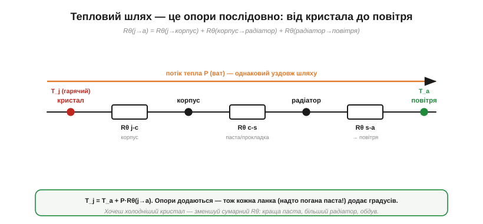
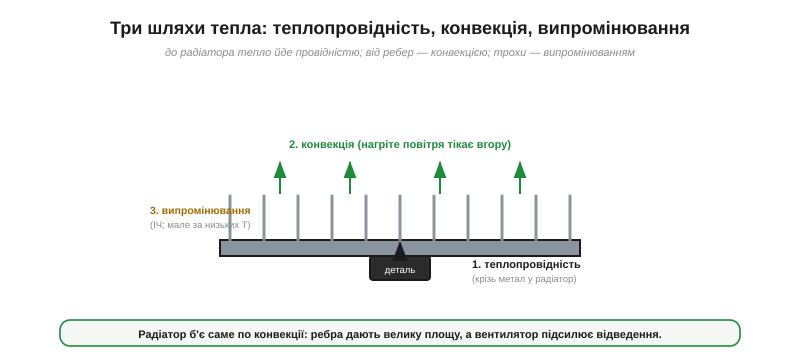

# Тепловий опір і радіатор (°C/Вт): куди подіти ват

Навіть справна деталь гріється: будь-яка [спожита потужність](topic:physics/joule-heating) (P = I²R чи інша) стає теплом просто в її тілі, і це тепло треба кудись відвести. Постає питання: **наскільки гарячою** стане сама деталь — і як не дати їй звариться? Виявляється, тепло «тече» крізь матеріали майже за тими самими правилами, що й струм крізь [опір](topic:physics/resistance), тож уся ця інтуїція переноситься на тепло один в один. Ключове поняття — **тепловий опір**, виміряний у градусах на ват.

### Тепло мусить кудись піти


*Спожита потужність стає теплом просто в деталі; її температура росте, аж поки приплив тепла не зрівняється з відпливом. Якщо тепло не встигає стікати, кристал переходить межу (~150 °C) і гине. Тема — про те, як цей відплив порахувати й забезпечити.*

Спожита потужність не зникає — вона [стає теплом](topic:physics/joule-heating) просто в тілі деталі (у кристалі транзистора, у плівці резистора). Це тепло гріє деталь, і її температура **росте**, поки приплив тепла не зрівняється з відпливом у довкілля (усталений режим). Біда в тому, що в кремнію є межа: кристал зазвичай гине десь біля **150 °C**, а надійно працює зі значним запасом — нижче. Якщо тепло не встигає стікати, температура переходить межу — і деталь помирає, тихо деградуючи або одразу. Тож інженер мусить уміти **передбачити** температуру деталі за відомої потужності — і, якщо вона зависока, **прокласти тепловий шлях** назовні.

І шкодить не лише раптовий перегрів. Навіть нижче за межу зайве тепло **скорочує життя** деталі: грубе правило надійності каже, що кожні зайві ~10 °C приблизно **вдвічі** прискорюють старіння електроніки (хімія псування пришвидшується з температурою). Тож охолодження — це не лише «не згоріти зараз», а й «прослужити роки»; холодний пристрій — надійний пристрій, і це окремий, дуже практичний привід не шкодувати на радіатор.

### Тепловий опір: ΔT = P·Rθ

Тут і вступає краса аналогії. Подумаймо, що штовхає тепло: різниця **температур**. Гаряче віддає холодному; що більша різниця, то швидший потік. Це точнісінько як напруга, що жене струм.


*Тепловий опір — точний близнюк електричного. Як напруга жене струм крізь опір (V = I·R), так різниця температур жене потік тепла крізь тепловий опір: ΔT = P·Rθ. Відповідності: ΔT ↔ V, P ↔ I, Rθ ↔ R.*

Складімо відповідності: **різниця температур ΔT** грає роль напруги; **потік тепла P** (у ватах — а ват і є джоуль за секунду) грає роль струму; а їхнє відношення — **тепловий опір Rθ** (*thermal resistance*) — грає роль електричного опору. І закон той самий, що [Ом](topic:electronics/ohms-law), лише в теплових одиницях:

```
ΔT = P · Rθ        Rθ — у °C/Вт (градусів на ват)
```

Читається просто: помнож потужність (ват) на тепловий опір (°C/Вт) — і дістанеш, на скільки градусів нагріється деталь над довкіллям. «Rθ = 20 °C/Вт» означає: кожен ват підніме температуру на 20 градусів. Уся інтуїція [електричного опору](topic:physics/resistance) — послідовне додавання, «вузьке місце гріється», важливість запасу — переноситься на тепло без змін.

> 🔧 **Навіщо це.** Тепловий опір — це не теорія, а **число з даташита**, з якого починається кожен розрахунок охолодження. Бачите в описі мікросхеми «Rθ(JA) = 60 °C/Вт» — це прямо каже: у цьому корпусі без радіатора кожен ват розсіюваної потужності нагріє кристал на 60 градусів над платою. Звідси одразу видно, скільки ват деталь стерпить без радіатора, а коли він стає обов'язковим.

Від чого ж залежить сам Rθ? Точнісінько так, як електричний опір ([R = ρL/A](topic:physics/resistivity)): тепловий опір шару тим **менший**, чим він **тонший**, чим **ширша** його площа й чим краще матеріал **проводить тепло**. Тонка широка пластина доброго провідника (мідь, алюміній) — малий тепловий опір; товстий вузький шматок поганого (пластик, а надто повітря) — великий. Тому тепловий шлях прокладають **коротким, широким і з добрих провідників**, а повітря в ньому — головний ворог, бо його тепловий опір величезний. Це той самий R = ρL/A, лише поставлений на службу теплу.

### Тепловий шлях — це опори послідовно

Тепло від кристала до повітря долає не один бар'єр, а кілька **поспіль**, і кожен має свій тепловий опір.


*Тепло долає кілька бар'єрів поспіль: кристал → корпус → паста → радіатор → повітря. Їхні теплові опори додаються (як резистори послідовно), а температура кристала = температура повітря + P × сумарний Rθ.*

Спершу тепло пробивається з кристала крізь корпус деталі — це **Rθ(j→корпус)** (*junction-to-case*, дається в даташиті). Тоді — крізь стик корпусу з радіатором, **Rθ(корпус→радіатор)**. Нарешті — з радіатора в повітря, **Rθ(радіатор→повітря)**. Ці опори **додаються послідовно**, точно як [електричні опори в ряд](topic:electronics/series-connection):

```
Rθ(j→повітря) = Rθ(j→к) + Rθ(к→р) + Rθ(р→п)
T_кристала = T_повітря + P · Rθ(j→повітря)
```

Звідси й видно стратегію охолодження: щоб кристал був холодніший, зменшують **сумарний** Rθ — а отже, будь-яку з ланок. Найбільша зазвичай — остання (радіатор→повітря), тож саме її й атакують радіатором.

Корисний наслідок: на кожному тепловому опорі «падає» своя частка перепаду температури — пропорційно до його Rθ, точнісінько як [напруга ділиться між послідовними резисторами](topic:electronics/voltage-divider) (тепловий **подільник**). Тож якщо більшість перепаду «падає» на стику корпус–радіатор, винна погана паста; якщо на самому радіаторі — він замалий. Дивлячись, **де** просіла температура, одразу видно, яку ланку лагодити.

### Приклад: радіатор рятує деталь


*Той самий ват, та сама деталь. Без радіатора (Rθ ≈ 20 °C/Вт) кристал нагрівся б до 125 °C — на межі. Радіатор знижує опір «до повітря», сумарний Rθ падає до ~8 °C/Вт, і температура — безпечні 65 °C.*

**Приклад (з радіатором і без).** Деталь розсіює P = 5 Вт, повітря довкола 25 °C. Без радіатора її повний тепловий опір до повітря Rθ ≈ 20 °C/Вт:

```
T = T_повітря + P·Rθ = 25 + 5×20 = 125 °C
```

Сто двадцять п'ять градусів — небезпечно близько до межі 150 °C; запасу майже немає, а в теплий день деталь перейде межу. Тепер пригвинтимо радіатор, що знижує опір «до повітря» так, що сумарний Rθ ≈ 8 °C/Вт:

```
T = 25 + 5×8 = 65 °C
```

Шістдесят п'ять градусів — тепло, але безпечно. Той самий ват, та сама деталь — лише тепловий шлях став ширшим. Ось чому без радіатора лінійний стабілізатор чи силовий транзистор, що розсіює кілька ват, просто згоряє, а з радіатором працює роками.

### Що таке радіатор і чому в нього ребра

Радіатор (*heat sink*) — це шматок металу (зазвичай алюмінію), пригвинчений до деталі, із великою **площею поверхні**. Його завдання — віддати тепло повітрю, а повітря забирає тепло **конвекцією**: нагріта поверхня гріє прилеглий шар повітря, той розширюється, легшає й тікає вгору, поступаючись місцем холодному. Що **більша площа** контакту з повітрям, то швидше це відведення — тому радіатор роблять **ребристим**: ребра дають велику площу в малому об'ємі. Більший радіатор → менший Rθ(радіатор→повітря). А **вентилятор** жене повітря силоміць (примусова конвекція), зриваючи нагрітий шар, — і Rθ падає ще в рази.

Дрібниці теж важать. Радіатор без обдуву (природна конвекція) працює в рази гірше, ніж із вентилятором, — тому в тісних чи потужних пристроях обдув майже обов'язковий. Орієнтація ребер уздовж потоку нагрітого повітря (вертикально за природної конвекції) допомагає тому тікати вгору. А чорне матове **анодування** трохи додає віддачі **випромінюванням** — звідси й чорний колір багатьох радіаторів.

А там, де окремого радіатора нема, його роль бере на себе сама **плата**. Виливок міді (полігон), до якого припаяна деталь, розтікає тепло по платі й віддає його повітрю — по суті, плаский радіатор. Тому під гарячими деталями лишають широкі мідні площини, а крізь плату ведуть **теплові перехідні отвори** (*thermal vias*), що зливають тепло на протилежний бік. Часом грамотна мідь на платі рятує не гірше за невеликий радіатор.

> 🔧 **Навіщо це.** Звідси й знайомий вигляд техніки. Процесор розсіює десятки ват — тому несе на собі великий ребристий радіатор **плюс** вентилятор (інакше за секунди дійде до межі й сам себе пригальмує). Силовий стабілізатор у корпусі TO-220 без радіатора тримає десь до ват — більше треба прикручувати до металу. А якщо ваша деталь «занадто гаряча, щоб тримати палець» (це вже за 60 °C) — це сигнал перевірити тепловий розрахунок: можливо, бракує радіатора, площі міді на платі чи обдуву.

### Термопаста: вигнати повітря зі стику

Є підступна ланка, яку легко зіпсувати, — **стик** корпусу деталі з радіатором. На вигляд обидві поверхні гладенькі, та під мікроскопом вони шорсткі, і між ними лишаються **мікроскопічні кишені повітря**. А повітря — **поганий** провідник тепла; ці кишені різко підвищують Rθ(корпус→радіатор), і тепло застрягає, хоч радіатор начебто є.


*Стик корпусу з радіатором лише на вигляд гладенький: між шорсткими поверхнями застрягає повітря — поганий провідник тепла. Термопаста заповнює ці зазори (не «проводить краще за метал», а лише виганяє повітря), тому її кладуть тонко.*

Рятує **термоінтерфейс** (*thermal interface material*, TIM) — термопаста чи термопрокладка. Вона **не** проводить тепло краще за метал; її єдине завдання — **заповнити повітряні зазори** речовиною, що проводить ліпше за повітря. Тому пасту кладуть **тонко**: товстий шар сам стає бар'єром. Правильно — ледь помітна плівка, що тільки виганяє повітря, а деталь притиснута гвинтами щільно до радіатора. Повне меню [радіаторів, термопаст і термопрокладок](topic:electronics/heatsink) — паста, прокладка, фазозмінний матеріал, клей, типи самих радіаторів і що читати в їхньому Rθ, а ще підступ кріплення TO-220, коли пластина деталі під напругою й потрібна ізоляція, — варте окремого огляду.

### Три шляхи тепла

Щоб картина була повна, назвімо три способи, якими тепло взагалі рухається.


*Три способи руху тепла. До радіатора воно йде теплопровідністю крізь метал; від ребер — конвекцією в рухоме повітря (її підсилює вентилятор); трохи — випромінюванням (за низьких температур мало). Радіатор б'є саме по конвекції.*

**Теплопровідність** (*conduction*) — крізь тверде тіло, від частинки до частинки; саме нею тепло йде з кристала крізь корпус у радіатор (метали проводять чудово, пластмаси — погано). **Конвекція** (*convection*) — забір тепла рухомою рідиною чи газом; нею ребра віддають тепло повітрю, і її підсилює вентилятор. **Випромінювання** (*radiation*) — інфрачервоне світло, що його випромінює будь-яке нагріте тіло; за невисоких температур електроніки воно дає небагато, тож головні гравці — провідність (до радіатора) і конвекція (від радіатора). Знаючи, який шлях головний, ви знаєте, де тиснути: до радіатора — добрий контакт і паста; від радіатора — площа й обдув.

До речі, чому метали так добре проводять **і** струм, **і** тепло — не випадковість: переносить і те, й те одне й те саме [море вільних електронів](topic:physics/electron-drift). Розігнані теплом, вони розносять його по металу швидко, тож добрий електричний провідник майже завжди й добрий тепловий. Ось чому радіатори роблять із металу, а не з пластику, і чому товста мідь на платі — це ще й тепловідвід.

### Усталений режим, інерція й запас

Ще одне, що варто тримати в голові. Усе сказане — про **усталений режим**: температуру, до якої деталь зрештою прийде за сталої потужності. Та нагрівається вона **не миттєво**: у деталі й радіатора є теплова **інерція** (теплоємність), тож короткий потужний імпульс може й не встигнути перегріти кристал — так само, як заряд не встигає за надто коротким струмом. А на практиці завжди беруть **запас**: цілять не у 150 °C, а помітно нижче, бо й довкілля буває гарячим, і паста з часом підсихає, і потужність стрибає. Холодніша деталь — деталь, що живе довше.

> 🧮 **Скільки часу гріється.** Що таке теплова стала часу τ = Rθ·Cθ, чому температура росте по експоненті (як заряд конденсатора), і чому короткий імпульс у рази понад норму деталь переживає, а тривала менша потужність — ні, — з формулами у вставці [Теплова RC-модель](topic:physics/thermal-resistance/math-thermal-rc.md).

Звідси прояснюється й тонкість [допустимої потужності резистора](topic:electronics/resistor). Коли на резисторі написано «0.25 Вт», це не священна стала, а **обіцянка за певних умов охолодження** — зазвичай у вільному повітрі за кімнатної температури. Запхайте той самий резистор у тісний гарячий корпус, обкладений сусідами, — і його реальний тепловий опір до повітря зросте, тож безпечна потужність **упаде**. Тому в гарячих чи щільних місцях рейтинг по потужності беруть із подвійним запасом: «скільки витримає деталь» і «як її охолоджують» — нероздільні.

Тут ховається й практична пастка вимірювання. Гаряча насправді — **серцевина кристала** (*junction*), а от термопарою чи пальцем ви дістаєтеся хіба до **корпусу** (*case*). Між ними лежить Rθ(j→корпус), тож кристал завжди **гарячіший** за те, що ви намацали, — інколи на десятки градусів за великої потужності. Тому в розрахунку відштовхуються від **температури кристала** (її межа — у даташиті), а виміряну температуру корпусу лише використовують, додавши P·Rθ(j→к), щоб оцінити справжню.

І ще про небезпеку зворотного зв'язку. У декого втрати **ростуть** із нагрівом ([опір змінюється з температурою](topic:physics/resistance-temperature) — як у лампи розжарення — чи ростуть витоки напівпровідника); тоді гаряча деталь гріється ще дужче й може піти в **тепловий розгін**, аж до загибелі. Добре охолодження тут не розкіш, а умова стійкості: воно розриває цю петлю, не даючи температурі розкрутитися.

**Приклад (який радіатор треба).** Хай деталь розсіює 3 Вт, безпечна межа кристала — 125 °C, повітря — до 40 °C, а Rθ від кристала до корпусу й через пасту разом ≈ 3 °C/Вт. Який радіатор шукати?

```
дозволений перепад:       ΔT = 125 − 40 = 85 °C
дозволений сумарний Rθ:    Rθ = ΔT/P = 85/3 ≈ 28 °C/Вт
з них на кристал + пасту:  3 °C/Вт
→ на радіатор лишається:   28 − 3 ≈ 25 °C/Вт
```

Тобто згодиться навіть скромний радіатор на 25 °C/Вт чи менше (менше — холодніше, із запасом). Саме так, від кінця (потрібної температури) до початку (вибору радіатора), і рахують охолодження на практиці.

### Спротив потоку — двічі

Суть така: тепло тече, як струм, за законом ΔT = P·Rθ; теплові опори **додаються поспіль** (кристал → корпус → паста → радіатор → повітря); щоб деталь не згоріла, зменшують сумарний Rθ — добрим контактом, пастою, великим ребристим радіатором та обдувом. І за всім цим стоїть одна красива симетрія: [електричний опір](topic:physics/resistance) і опір тепловий — це одна й та сама ідея **«спротиву потоку»**, застосована двічі, до струму й до тепла. Опанувавши її, інженер уміє не лише рахувати струм, напругу й потужність у деталі, а й **тримати її живою** — не давати теплу її вбити.

---
