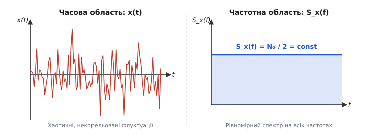
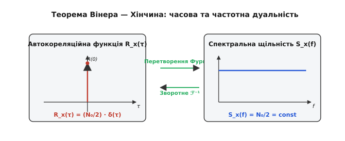
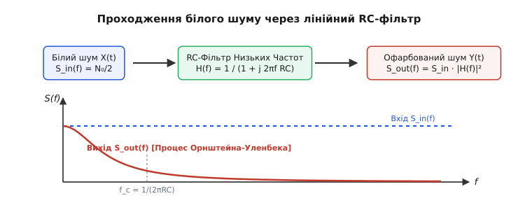
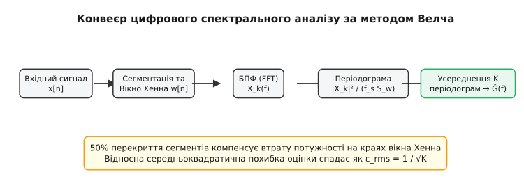

# Білий шум і спектральна щільність

<preknowlist>
- [Тепловий шум](book:physics/thermal-noise) — флуктуації напруги на опорі та фундаментальна межа вимірювань.
- [Похідна та інтеграл](book:math/derivative) — математичний апарат неперервного аналізу.
- [Перетворення Фурьє](book:math/fourier-transform) — розклад сигналів на гармонічні складові.
</preknowlist>

Підключіть надчутливий осцилограф до входу високочастотного підсилювача без подачі корисного сигналу, і на екрані з'явиться хаотична, дрібнозубчаста «трава». Якщо спрямувати цей сигнал на аудіодинамік, ви почуєте характерне рівномірне шипіння — звук, що не має ні визначеної висоти тону, ні ритму, ні розрізнюваної гармонійної структури. Вимірювання показують, що миттєві значення напруги флуктують навколо нуля, а амплітуди цих флуктуацій підпорядковуються нормальному розподілу Гаусса. Проте найважливіша властивість цього хаосу криється не у часовій формі хвилі, а в тому, як його енергія розподілена за частотами.

Якщо виміряти шумову потужність у вузькій смузі шириною `1 Гц` біля частоти `100 Гц`, а потім повторити це вимірювання біля `1 кГц`, `100 кГц` чи `10 МГц`, прилад покаже абсолютно однакову величину. Сама ця рівномірність і визначає поняття **білого шуму** (*white noise*). Назва виникла за аналогією з оптикою: біле світло утворене змішуванням електромагнітних хвиль усіх видимих кольорів із однаковою інтенсивністю. Білий шум — це випадковий процес, чия спектральна густина потужності є абсолютно постійною на всіх частотах спектра.


*Хаотичні флуктуації білого шуму в часі (ліворуч) та його плоский спектр у частотній області (праворуч). У часовій області значення в сусідні моменти часу повністю незалежні, а в частотній області спектральна щільність потужності S(f) зберігає постійне значення N₀/2 на будь-якій частоті.*

У фізиці білий шум виникає скрізь, де спостерігається сума величезної кількості хаотичних, дискретних мікроскопічних подій. У радіоелектронному резисторі це хаотичні зіткнення електронів провідності з атомами кристалічної ґратки під дією тепла. У вакуумному діоді чи напівпровідниковому p-n переході це дискретні прольоти поодиноких носіїв заряду через потенціальний бар'єр (дробовий шум Шотткі). У рідині чи газі це безперервні удари молекул об мікроскопічну завислу частинку, що породжують броунівський рух. У кожному з цих випадків окрема мікроскопічна подія триває мізерно малий час, а сумарний відгук системи є сумою мільярдів незалежних коротких імпульсів.

Однак за простою аналогією з оптикою прихована глибока фізична й математична парадоксальність. Якщо спектральна щільність потужності є константою на всіх частотах від нуля до нескінченності, то повна середня потужність такого сигналу, обчислена як інтеграл за всіма частотами, виявляється нескінченно великою. Жодна фізична система не здатна згенерувати чи переносити нескінченну енергію. Це означає, що ідеальний білий шум є математичною абстракцією — такою ж концептуальною моделлю, як матеріальна точка, абсолютно тверде тіло чи дельта-функція Дірака. У реальному світі будь-який шум залишається «білим» лише у обмеженій смузі частот, за межами якої інерційність фізичних процесів чи квантові ефекти неминуче зрізають його спектр.

Розуміння математичної моделі білого шуму та меж її застосовності є фундаментальною основою радіотехніки, статистичної фізики, теорії інформації та системи вимірювань. Щоб аналізувати випадкові сигнали так само строго, як і детерміновані функції, фізика використовує центральне поняття спектрального аналізу — **спектральну щільність потужності** (*power spectral density*, PSD).

---

### Спектральна щільність потужності: як виміряти розподіл енергії хаосу

Для детермінованого сигналу `x(t)` (наприклад, синусоїди з фіксованою амплітудою чи суми гармонік) розклад у ряд або інтеграл Фурьє дає чіткі й відтворювані значення амплітуди й фази на кожній частоті. Для випадкового процесу спроба прямого застосування перетворення Фурьє зазнає краху: інтеграл від випадкової функції на нескінченному інтервалі не збігається у звичайному сенсі, а фази гармонійних складових міняються хаотично від одного вимірювання до іншого. Проте, хоча ми не можемо передбачити конкретні миттєві значення `x(t)`, статистичні характеристики хаосу виявляються дивовижно стабільними й відтворюваними.

Замість амплітуди окремої гармоніки досліджують середню потужність, яку процес виділяє у різних частотних інтервалах. Для цього застосовують апарат математичного усереднення. Припустимо, що випадковий процес `X(t)` спостерігається на обмеженому часовому інтервалі тривалістю `T` (від `-T/2` до `T/2`). Зрізаний процес `X_T(t)` має скінченну енергію, тому для нього існує пряме комплексне перетворення Фурьє:

```
F_T(f) = ∫_{-T/2}^{T/2} X(t) · e^{-j·2·π·f·t} dt
```

Відповідно до теореми Парсеваля, повна енергія зрізаного сигналу в часовій області дорівнює інтегралу від квадрата модуля його спектра у частотній області:

```
∫_{-T/2}^{T/2} |X_T(t)|² dt = ∫_{-∞}^{+∞} |F_T(f)|² df
```

Щоб отримати середню потужність, поділимо енергію на час спостереження `T`. Оскільки `F_T(f)` залежить від конкретної випадкової реалізації сигналу, усереднимо результат за нескінченним ансамблем усіх можливих реалізацій процесу (математичне сподівання `E[...]`). Переходячи до границі при `T → ∞`, отримуємо строге математичне означення **двосторонньої спектральної щільності потужності** `S_x(f)`:

```
S_x(f) = lim_{T → ∞} E[ |F_T(f)|² / T ]
```

Для стаціонарних та ергодичних випадкових процесів усереднення за ансамблем реалізацій `E[...]` дорівнює усередненню за безперервним часом для однієї тривалої реалізації. Це надзвичайно важливо для фізичних експериментів, адже це означає, що ми можемо виміряти спектральну щільність шуму, спостерігаючи за однією фізичною системою протягом достатньо довгого часу.

Розмірність спектральної щільності потужності залежить від фізичної природи досліджуваного сигналу `X(t)`:
* Якщо `X(t)` — напруга у вольтах (`В`), то `S_x(f)` має розмірність `В²/Гц`.
* Якщо `X(t)` — струм в амперах (`А`), то розмірність дорівнює `А²/Гц`.
* Якщо `X(t)` — швидкість механічних коливань у `м/с`, спектральна щільність вимірюється у `(м/с)²/Гц`.
* У теоретичній фізиці сигналом часто слугує безрозмірна флуктуація густини або фази, і тоді спектральна щільність вимірюється в `1/Гц` або `с`.

У математиці та теоретичній фізиці зручно використовувати **двостороннє спектральне представлення**, де частота `f` змінюється від `-∞` до `+∞` (або кутова частота `ω = 2·π·f` від `-∞` до `+∞`). Оскільки для дійсних фізичних сигналів спектр симетричний `S_x(f) = S_x(-f)`, від'ємні частоти є зручним математичним інструментом.

В інженерній практиці та специфікаціях вимірювальних приладів використовують **односторонню спектральну щільність потужності** `G_x(f)`, визначену лише для реальних додатних частот `f ≥ 0`. Вона об'єднує потужності додатних та від'ємних частот:

```
G_x(f) = 2 · S_x(f)      [при f > 0]
G_x(0) = S_x(0)          [при f = 0]
```

Повна середня потужність випадкового процесу `P_ср` (що відповідає дисперсії `σ²` для процесу з нульовим середнім значенням) визначається шляхом інтегрування спектральної щільності по всьому частотному діапазону:

```
P_ср = E[X²(t)] 
= ∫_{-∞}^{+∞} S_x(f) df 
= ∫_{0}^{+∞} G_x(f) df
```

Ідеальний білий шум за означенням має постійну двосторонню спектральну щільність на всіх частотах:

```
S_x(f) = N₀ / 2
```

Відповідно, його одностороння спектральна щільність дорівнює `G_x(f) = N₀`. Константа `N₀` є фундаментальною характеристикою інтенсивності шуму. Наприклад, для [теплового шуму Джонсона—Найквіста](book:physics/thermal-noise) в електричному резисторі з опором `R` при абсолютній температурі `T` одностороння спектральна щільність шумової напруги становить `G_U(f) = 4 · k_B · T · R`, де `k_B ≈ 1.38 × 10⁻²³ Дж/К` — стала Больцмана.

> 🔧 **Навіщо це.** Фізичний зміст спектральної щільності `S_x(f)` полягає у тому, що площа під її графіком у довільному частотному інтервалі від `f₁` до `f₂` дорівнює реальній шумовій потужності, яка потрапляє у цей інтервал. Це дозволяє інженеру розрахувати рівень шуму на виході будь-якої складної вимірювальної системи, знаючи лише спектральну щільність на вході та частотну характеристику системи.

---

### Автокореляційна функція та теорема Вінера — Хінчина

Частотна область описує, як енергія шуму розподілена за гармоніками, але нічого не говорить безпосередньо про взаємозв'язок між значеннями сигналу у різні моменти часу. Для опису часової структури випадкового процесу використовують **автокореляційну функцію** `R_x(τ)`.

Для стаціонарного випадкового процесу з нульовим середнім значенням автокореляційна функція вимірює статистичний зв'язок між значенням сигналу у момент часу `t` та його значенням через проміжок часу `τ` (часовий зсув або лаг):

```
R_x(τ) = E[ X(t) · X(t + τ) ]
```

Властивості автокореляційної функції відображають внутрішню часову пам'ять процесу:
1. При `τ = 0` автокореляційна функція дорівнює середньому квадрату сигналу, тобто його повній середній потужності (дисперсії): `R_x(0) = E[X²(t)] = σ²`.
2. Функція є парною відносно часового зсуву: `R_x(-τ) = R_x(τ)`.
3. Для будь-якого `τ` виконується нерівність `|R_x(τ)| ≤ R_x(0)`.

Зі зростанням часового зсуву `|τ|` значення `R_x(τ)` для більшості фізичних процесів спадає до нуля, оскільки зв'язок між віддаленими за часом подіями втрачається через хаотичні зіткнення та флуктуації.

Фундаментальний місток між часовим описом (автокореляцією) та частотним описом (спектральною щільністю) будує **теорема Вінера — Хінчина**. Доведена незалежно американським математиком Норбертом Вінером у 1930 році та радянським математиком Олександром Хінчиним у 1934 році, ця теорема стверджує, що для стаціонарного випадкового процесу автокореляційна функція та спектральна щільність потужності утворюють **пару взаємних перетворень Фурьє**:

```
S_x(f) = ∫_{-∞}^{+∞} R_x(τ) · e^{-j·2·π·f·τ} dτ
R_x(τ) = ∫_{-∞}^{+∞} S_x(f) · e^{+j·2·π·f·τ} df
```

Якщо використовувати кутову частоту `ω = 2·π·f`, теорема записується у симетричній формі:

```
S_x(ω) = ∫_{-∞}^{+∞} R_x(τ) · e^{-j·ω·τ} dτ
R_x(τ) = (1 / (2·π)) · ∫_{-∞}^{+∞} S_x(ω) · e^{+j·ω·τ} dω
```

Строге математичне виведення цієї теореми, аналіз умов збіжності та її узагальнення на нестаціонарні процеси наведено у вставці [математичне виведення теореми Вінера — Хінчина](book:physics/white-noise-spectrum/math-wiener-khinchin.md). Історію того, як зв'язок між автокореляцією та спектром виник на перетині оптичних досліджень спектрів і статистичної механіки, викладено у хроніці [історія концепції білого шуму](book:physics/white-noise-spectrum/hist-white-noise.md).


*Зв’язок між часовою та частотною областями відповідно до теореми Вінера — Хінчина. Для ідеального білого шуму автокореляційна функція є дельта-функцією Дірака R(τ) = (N₀/2)·δ(τ), що відповідає плоскому спектру S(f) = N₀/2.*

Застосуємо теорему Вінера — Хінчина до білого шуму. Оскільки двостороння спектральна щільність білого шуму є сталою величиною `S_x(f) = N₀ / 2`, зворотне перетворення Фурьє константи дає:

```
R_x(τ) = ∫_{-∞}^{+∞} (N₀ / 2) · e^{j·2·π·f·τ} df
= (N₀ / 2) · δ(τ)
```

де `δ(τ)` — **дельта-функція Дірака** (символічна функція, яка дорівнює нулю скрізь, крім `τ = 0`, де вона прямує до нескінченності так, що інтеграл від неї дорівнює одиниці).

Цей результат розкриває глибинний фізичний і статистичний зміст моделі білого шуму:
1. При `τ ≠ 0` значення `R_x(τ) = 0`. Це означає, що значення білого шуму у будь-які два різні моменти часу, наскільки б близько вони не стояли одне до одного, є **абсолютно некорельованими**. Процес миттєво «забуває» свій попередній стан — він має нульовий час пам'яті.
2. При `τ = 0` автокореляція вироджується в дельта-функцію, що відповідає нескінченній дисперсії `R_x(0) = ∞`. Це повністю узгоджується з тим, що плоский спектр у нескінченній смузі частот містить нескінченну шумову потужність.

Якщо розглядати випадковий процес з нормальним (гауссовим) розподілом ймовірностей, відсутність кореляції між значеннями у різні моменти часу означає їхню повну **статистичну незалежність**. Такий процес називають **гауссовим білим шумом**. Це найважливіша модель математичної фізики: завдяки Центральній Граничній Теоремі сума величезної кількості дрібних незалежних флуктуацій завжди прямує до гауссового білого шуму.

#### Ланжевенівська динаміка та стохастичні диференціальні рівняння

Найяскравішим фізичним застосуванням моделі гауссового білого шуму є **рівняння Ланжевена** (1908 рік), яке описує броунівський рух частинки масою `m` у в'язкому середовищі з коефіцієнтом тертя `γ`. Рівняння руху частинки має вигляд стохастичного диференціального рівняння:

```
m · (d v(t) / dt) = -γ · v(t) + F_ш(t)
```

де `-γ · v(t)` — сила макроскопічного в'язкого тертя Стокса, а `F_ш(t)` — випадкова сила хаотичних ударів молекул середовища.

Поль Ланжевен припустив, що випадкова сила `F_ш(t)` має нульове середнє `E[F_ш(t)] = 0` та моделюється гауссовим білим шумом із дельта-корельованою автокореляційною функцією:

```
E[ F_ш(t) · F_ш(t + τ) ] = 2 · D_F · δ(τ)
```

де `D_F` — інтенсивність шумової сили.

Розв'язок рівняння Ланжевена для швидкості частинки `v(t)` отримують методом варіації довільних сталих:

```
v(t) = v(0) · e^{-(γ/m)·t} + (1/m) · ∫_{0}^{t} e^{-(γ/m)·(t - s)} · F_ш(s) ds
```

Обчисливши автокореляційну функцію швидкості `R_v(τ) = E[v(t)·v(t+τ)]` у стаціонарному режимі, отримуємо експоненційний спад:

```
R_v(τ) = [ D_F / (m · γ) ] · e^{-(γ / m) · |τ|}
```

З іншого боку, згідно з теоремою рівнорозподілу термодинаміки, середня кінетична енергія теплового руху частинки на один ступінь вільності становить `(1/2) · m · E[v²] = (1/2) · k_B · T`. Знаючи, що `E[v²] = R_v(0) = D_F / (m · γ)`, отримуємо фундаментальне співвідношення для інтенсивності шумової сили:

```
D_F = γ · k_B · T
```

Таким чином, двостороння автокореляція Ланжевенівської білої сили дорівнює `E[F_ш(t)·F_ш(t+τ)] = 2 · γ · k_B · T · δ(τ)`. Подивіться на цей вирази: інтенсивність шуму `D_F` прямо пропорційна коефіцієнту тертя `γ` та температурі `T`. Це історично перший приклад **флуктуаційно-дисипативної теореми**: в'язке тертя (дисипація) та хаотичні штовханини (флуктуації) мають єдину мікроскопічну природу і нерозривно пов'язані між собою через температурний масштаб `k_B · T`. 

Варто підкреслити: хоча сама сила `F_ш(t)` є білим шумом із плоским спектром і дельта-кореляцією, швидкість частинки `v(t)` на виході інерційної системи має експоненційну автокореляцію `R_v(τ) ∝ e^{-|τ|/τ_r}` з часом релаксації `τ_r = m / γ`. Спектральна щільність швидкості `S_v(f)` стає Лоренцовою кривою `S_v(f) ∝ 1 / [ 1 + (2·π·f·τ_r)² ]` — тобто забарвленим (червоним) шумом.

---

### Фільтрація білого шуму та еквівалентна шумова смуга

Коли білий шум подається на вхід лінійної стаціонарної системи (фільтра, підсилювача, датчика чи механічного осцилятора), система змінює його спектральний склад. Оскільки різні частотні складові підсилюються або послаблюються по-різному, шум на виході втрачає свій «білий» характер і стає **забарвленим (кольоровим) шумом** (*colored noise*).

Нехай лінійна система має комплексну передавальну функцію `H(f)` (або амплітудно-частотну характеристику `|H(f)|`). Якщо на вхід подано стаціонарний випадковий процес із двосторонньою спектральною щільністю `S_in(f)`, то спектральна щільність процесу на виході `S_out(f)` визначається фундаментальним співвідношенням теорії лінійних систем:

```
S_out(f) = S_in(f) · |H(f)|²
```

Якщо вхідним сигналом є білий шум з односторонньою спектральною щільністю `G_in(f) = N₀`, спектральна щільність на виході набуває форми квадрата модуля передавальної функції системи:

```
G_out(f) = N₀ · |H(f)|²
```


*Проходження плоского спектра білого шуму G_in(f) через лінійний фільтр із характеристикою |H(f)|². На виході формується забарвлений шум G_out(f), площа під яким визначає скінченну шумову потужність.*

Повна середня потужність шуму на виході системи `P_out` стає скінченною величиною і обчислюється як інтеграл від вихідного спектра по всіх додатних частотах:

```
P_out = ∫_{0}^{+∞} G_out(f) df 
= N₀ · ∫_{0}^{+∞} |H(f)|² df
```

Цей інтеграл дозволяє ввести надзвичайно зручне інженерне поняття — **еквівалентну шумову смугу частот** `B_n` (*equivalent noise bandwidth*). Припустимо, що реальний фільтр із складною частотною характеристикою `H(f)` та максимальним коефіцієнтом підсилення `K_max = max|H(f)|` ми хочемо замінити ідеальним прямокутним фільтром із коефіцієнтом передачі `K_max` у смузі `B_n` та нульовим передаванням поза нею. Щоб обидва фільтри пропускали однакову потужність білого шуму, площі під їхніми квадратами АЧХ повинні бути рівними:

```
K_max² · B_n = ∫_{0}^{+∞} |H(f)|² df
```

Звідси отримуємо загальну формулу для еквівалентної шумової смуги:

```
B_n = (1 / K_max²) · ∫_{0}^{+∞} |H(f)|² df
```

Розглянемо два класичних інженерних приклади розрахунку `B_n`.

#### Приклад 1. RC-фільтр низьких частот першого порядку

Аналоговий RC-фільтр складається з резистора `R` та конденсатора `C`. Його передавальна функція дорівнює `H(f) = 1 / (1 + j · 2 · π · f · R · C)`. Квадрат модуля передавальної функції:

```
|H(f)|² = 1 / [ 1 + (2 · π · f · R · C)² ]
```

Максимальне підсилення досягається на постійному струмі `f = 0` і дорівнює `K_max = 1`. Обчислимо еквівалентну шумову смугу `B_n`:

```
B_n = ∫_{0}^{+∞} df / [ 1 + (2 · π · f · R · C)² ]
```

Використовуючи заміну змінної `x = 2 · π · f · R · C` (звідси `df = dx / (2 · π · R · C)`), інтеграл зводиться до табличного:

```
B_n = [ 1 / (2 · π · R · C) ] · ∫_{0}^{+∞} dx / (1 + x²)
= [ 1 / (2 · π · R · C) ] · [ arctan(x) ]_{0}^{+∞}
= [ 1 / (2 · π · R · C) ] · (π / 2)
= 1 / (4 · R · C)
```

Смуга пропускання RC-фільтра за рівнем `-3 дБ` (половинної потужності) дорівнює `f_{-3dB} = 1 / (2 · π · R · C)`. Отже, еквівалентна шумова смуга пов'язана зі смугою `-3 дБ` співвідношенням:

```
B_n = (π / 2) · f_{-3dB} ≈ 1.571 · f_{-3dB}
```

Еквівалентна шумова смуга виявилася на `57%` ширшою за смугу половинної потужності. Це пояснюється повільним спаданням АЧХ фільтра першого порядку (`-20 дБ` на декаду чи `6 дБ` на октаву), через що повільно згасаючий «хвіст» АЧХ пропускає значну кількість високочастотного білого шуму.

Обчислимо тепер середньоквадратичну напругу теплового шуму `U_rms` на виході цього RC-кола. Вхідним білим шумом є тепловий шум самого резистора `R` із односторонньою спектральною щільністю `G_U(f) = 4 · k_B · T · R`. Помноживши спектральну щільність на еквівалентну шумову смугу `B_n`, отримуємо:

```
U_rms² = G_U(f) · B_n
= (4 · k_B · T · R) · [ 1 / (4 · R · C) ]
= (k_B · T) / C
```

Взявши квадратний корінь, отримуємо фундаментальний результат статистичної физики:

```
U_rms = √( k_B · T / C )
```

Цей вираз називають **формулою k_B T / C шуму**. Подивіться на нього уважно: з остаточної формули **повністю зник опір R**. Якщо збільшити опір `R`, це зробить спектральну щільність білого шуму `G_U = 4·k_B·T·R` вищою, але водночас пропорційно звузить смугу пропускання `B_n = 1/(4·R·C)`. Обидва ефекти точнісінько компенсують один одного. Повна шумова накопичена енергія конденсатора `E_нак = (1/2) · C · U_rms² = (1/2) · k_B · T` визначається виключно ємністю `C` та температурою `T`. Це не що інше, як прямий прояв **теореми рівнорозподілу енергії**: на один електричний ступінь вільності (конденсатор) припадає середня теплова енергія `(1/2)·k_B·T`.

#### Приклад 2. Коливальний контур другий порядку (RLC-фільтр)

Для двополюсного фільтра низьких частот другого порядку з резонансною частотою `f₀` та добротністю `Q` квадрат модуля передавальної функції дорівнює:

```
|H(f)|² = 1 / [ (1 - (f / f₀)²)² + (f / (Q · f₀))² ]
```

Інтегрування цієї характеристики дає еквівалентну шумову смугу:

```
B_n = (π / 2) · Q · f₀
```

Для високодобротних систем (`Q >> 1`) крутизна спаду АЧХ на високих частотах становить `-40 дБ` на декаду, тому «хвіст» спадає значно швидше. Співвідношення між еквівалентною шумовою смугою та смугою за рівнем `-3 дБ` наближається до `B_n ≈ 1.11 · f_{-3dB}` для фільтра Баттерворта другого порядку та `B_n ≈ 1.05 · f_{-3dB}` для фільтра четвертого порядку. Чим вищий порядок фільтра, тим ближча його шумова смуга до ідеальної прямокутної смуги.

---

### Фізичні межі білого шуму: чому нескінченний спектр неможливий

Парадокс нескінченної потужності ідеального білого шуму розв'язується тим, що у реальних фізичних системах мікроскопічні механізми генерації шуму мають скінченний **час кореляції** `τ_c`.

У металевому провіднику тепловий шум створюється хаотичним рухом електронів провідності. Проте електрон не змінює свій напрямок руху миттєво: між двома послідовними зіткненнями з атомами кристалічної ґратки минає середній час вільного пробігу `τ_e ≈ 10⁻¹³...10⁻¹⁴ секунди` (при кімнатній температурі). На часових інтервалах, менших за `τ_e`, рух електрона є інерційним, а отже, його швидкості в сусідні моменти часу корелюють між собою.

Відповідно до класичної електронної теорії Друде, високочастотна провідність металу залежить від частоти: `σ(ω) = σ₀ / (1 + j · ω · τ_e)`. Спектральна щільність теплового шуму, розрахована з урахуванням часу вільного пробігу `τ_e`, має вигляд Лоренцового профілю:

```
G_U(f) = (4 · k_B · T · R₀) / [ 1 + (2 · π · f · τ_e)² ]
```

При низьких частотах `f << 1 / (2·π·τ_e)` знаменник близький до одиниці, і ми маємо класичний плоский білий шум `4·k_B·T·R₀`. Проте на частотах `f >> f_c = 1 / (2·π·τ_e) ≈ 10 THz` спектральна щільність спадає як `1 / f²`. Для металів частота зрізу `f_c` лежить в терагерцовому та інфрачервоному діапазонах. На всіх практично досяжних радіочастотах (до сотень гігагерц) ми перебуваємо глибоко всередині пласкої ділянки, тому модель білого шуму працює з колосальною точністю.

Другим фундаментальним обмеженням є **квантова природа випромінювання та речовини**. У 1928 році Гаррі Найквіст, виводячи формулу теплового шуму, вже передбачив її квантове узагальнення. Повна квантова формула Найквіста для спектральної щільності шуму резистора враховує енергію нульових флуктуацій (zero-point energy) та квантову статистику Планка:

```
G_U(f) = 4 · R · [ (h · f / 2) + (h · f) / (e^{h·f / (k_B·T)} - 1) ]
```

де `h ≈ 6.626 × 10⁻³⁴ Дж·с` — стала Планка.

Перший доданок `h · f / 2` описує квантові нульові флуктуації вакууму, які існують навіть при абсолютному нулі температури (`T = 0 К`). Другий доданок описує теплові збудження фотонів та фононів.

У класичному ліміті, коли квантова енергія фотона значно менша за теплову енергію `h · f << k_B · T`, розклад експоненти в ряд Тейлора `e^x ≈ 1 + x` дає перехід до класичної формули білого шуму:

```
e^{h·f / (k_B·T)} - 1 ≈ h · f / (k_B·T)
G_U(f) ≈ 4 · R · [ (h·f/2) + k_B·T ] ≈ 4 · k_B · T · R
```

При кімнатній температурі (`T = 300 К`) межа між класичним білим шумом та квантовим регіоном відповідає частоті:

```
f_квант ≈ k_B · T / h ≈ (1.38×10⁻²³ · 300) / (6.626×10⁻³⁴) ≈ 6.25 THz
```

На частотах вище за `6 THz` тепловий шум перестає бути «білим»: експоненційний член у знаменнику пригнічує теплові флуктуації, запобігаючи «ультрафіолетовій катастрофі» для шумової потужності, аналогічно до випромінювання абсолютно чорного тіла у формулі Планка.

Іншим фундаментальним прикладом фізичного білого шуму є **дробовий шум** (*shot noise*), який виникає при проходженні електричного струму через потенціальний бар'єр (наприклад, у p-n переході діода чи транзистора, або у фотодіоді при підрахунку фотонів). Струм утворений дискретними носіями заряду — електронами з зарядом `q ≈ 1.602 × 10⁻¹⁹ Кл`. Потік електронів описується пуассонівським процесом: кожен електрон перетинає бар'єр випадково й незалежно від інших. Одностороння спектральна щільність флуктуацій дробового струму описується формулою Вальтера Шотткі (1918 рік):

```
G_I(f) = 2 · q · I
```

де `I` — постійний середній струм. Дробовий шум є ідеальним білим шумом на всіх частотах, менших за обернений час прольоту електрона через бар'єр `1 / τ_проль`.

---

### Практичне оцінювання та чисельне моделювання

При обчислювальному моделюванні та цифровому аналізі сигналів ми завжди маємо справу з дискретизованими послідовностями відліків `x[n] = x(n · Δt)`, взятими з частотою дискретизації `f_s = 1 / Δt`.

Шум у дискретній системі моделюють послідовністю незалежних однаково розподілених випадкових величин (i.i.d.) з нульовим середнім і скінченною дисперсією `σ_d²`. Автокореляційна функція дискретного білого шуму дорівнює:

```
R_d[k] = E[ x[n] · x[n + k] ] = σ_d² · δ[k]
```

де `δ[k]` — символ Кронекера (`1` при `k = 0` та `0` при `k ≠ 0`).

Відповідно до теореми Котельникова — Шеннона (Найквіста), дискретизація обмежує частотний діапазон найвищою частотою Найквіста `f_N = f_s / 2`. Уся шумова потужність дискретного сигналу `σ_d²` виявляється рівномірно розподіленою у смузі від `0` до `f_s / 2`. Це дає фундаментальний зв'язок між параметрами дискретного та аналогового білого шуму:

```
G_x(f) = σ_d² / (f_s / 2) = (2 · σ_d²) / f_s
σ_d² = G_x · (f_s / 2) = G_x · f_N
```

Ця формула має вирішальне значення для комп'ютерного моделювання фізичних систем: якщо досліджуваний процес має аналогову спектральну щільність шуму `G_x` (наприклад, `В²/Гц`), то дискретні відліки генератора випадкових чисел повинні мати дисперсію `σ_d² = G_x · f_s / 2`. Якщо ми збільшуємо частоту дискретизації `f_s`, дисперсія окремого дискретного відліку має пропорційно зростати, щоб зберегти постійну аналогову спектральну щільність.


*Схема оцінювання спектральної щільності потужності за допомогою методу Велча. Сигнал ділиться на перекриті сегменти, до кожного застосовується віконна функція та ДПФ, після чого квадрати модулів спектрів усереднюються для зменшення дисперсії оцінки.*

На практиці перед інженером часто стоїть зворотне завдання: маючи виміряну дискретну реалізацію реального шуму тривалістю `N` відліків, обчислити його спектральну щільність. Пряме застосування Швидкого Перетворення Фурьє (FFT) дає **періодограму**:

```
P(f_k) = (1 / (N · f_s)) · | ∑_{n=0}^{N-1} x[n] · e^{-j·2·π·k·n / N} |²
```

Проте періодограма має суттєвий недолік: вона є **неузгодженою статистичною оцінкою**. Збільшення довжини запису `N` підвищує частотну роздільність, але дисперсія флуктуацій самого графіка періодограми навколо істинного значення не зменшується і залишається на рівні 100%! Графік сирої періодограми білого шуму виглядає як дика хаотична «гребінка».

Щоб отримати гладку й статистично стійку оцінку спектральної щільності, застосовують **метод Велча** (*Welch's method*):
1. Тривалий часовий сигнал ділять на `K` частково перекритих сегментів довжиною `L` (типово застосовують `50%` перекриття).
2. Кожен сегмент множать на згладжувальне вікно `w[n]` (наприклад, вікно Хенна або Хеммінга) для пригнічення бокових пелюсток і розтікання спектра.
3. Для кожного взваженого вікном сегмента обчислюють періодограму через БПФ.
4. Отримані `K` періодограм усереднюють між собою.

Усереднення `K` незалежних періодограм зменшує дисперсію оцінки спектральної щільності у `K` разів (а середньоквадратичну похибку вимірювання — у `√K` разів). Детальний алгоритм, вибір віконних функцій та практичний C/C++ код наведено у вставках [чисельне моделювання та спектральний аналіз](book:physics/white-noise-spectrum/proj-spectral-estimation.md) та [довідник параметрів спектрального аналізу](book:physics/white-noise-spectrum/api-spectral-analysis.md).

---

### Шумові густини напруги й струму в інженерних розрахунках

В радіотехніці та схемотехніці вимірювальних систем користуватися квадратичними одиницями спектральної щільності (`В²/Гц` або `А²/Гц`) буває незручно, оскільки інженерні розрахунки проводять безпосередньо у вольтах та амперах. Тому широко використовують **спектральну густину шумової напруги** `e_n(f)` та **спектральну густину шумового струму** `i_n(f)`:

```
e_n(f) = √( G_U(f) )     [вимірюється у В/√Гц або нВ/√Гц]
i_n(f) = √( G_I(f) )     [вимірюється у А/√Гц або пА/√Гц]
```

Для класичного теплового шуму резистора `R` при кімнатній температурі (`T = 300 К`, при цьому `4 · k_B · T ≈ 1.65 × 10⁻²⁰ Дж`):

```
e_n = √( 4 · k_B · T · R ) 
≈ 0.128 · √( R )  [нВ/√Гц, де R в омах]
```

Цей простий практичний орієнтир корисно пам'ятати кожному розробнику аналогової та вимірювальної електроніки:
* Резистор `100 Ом` має шумову густину `e_n ≈ 1.28 нВ/√Гц`.
* Резистор `1 кОм` дає `e_n ≈ 4.0 нВ/√Гц`.
* Резистор `10 кОм` шумить з густиною `e_n ≈ 12.8 нВ/√Гц`.
* Резистор `100 кОм` дає `e_n ≈ 40.5 нВ/√Гц`.
* Резистор `1 МОм` має шумові флуктуації `e_n ≈ 128 нВ/√Гц`.

Якщо резистор `10 кОм` працює в аудіотракті зі смугою `B = 20 кГц`, то повна середньоквадратична шумова напруга становить:

```
U_rms = e_n · √( B ) 
= (12.8 × 10⁻⁹ В/√Гц) · √( 20000 Гц ) 
≈ 1.81 мкВ
```

Будь-який реальний операційний підсилювач чи малошумний транзистор у специфікації описується двома параметрами вхідного шуму: вхідною шумовою напругою `e_n` та вхідним шумовим струмом `i_n`. Загальна еквівалентна спектральна густина шуму на вході підсилювача, під'єднаного до джерела сигналу з внутрішнім опором `R_s`, обчислюється шляхом квадратичного додавання всіх некорельованих шумових компонент:

```
e_total(f) = √( e_ns² + e_n² + (i_n · R_s)² )
```

де `e_ns = √(4 · k_B · T · R_s)` — власний тепловий шум опору джерела.

Ця формула розкриває важливий інженерний компроміс:
* При малих опорах джерела `R_s` домінує шумова напруга підсилювача `e_n`.
* При великих опорах джерела `R_s` домінує падіння напруги від шумового струму `(i_n · R_s)`.

Існує **оптимальний опір джерела** `R_opt = e_n / i_n`, при якому коефіціент шуму схеми мінімальний, а відношення сигнал/шум — максимальне.

---

### Порівняльна характеристика моделей шуму

У природі й техніці білий шум є лише одним із представників великого сімейства випадкових процесів. Фізичні механізми з пам'яттю, релаксацією, накопиченням або дифузією формують спектри, чия спектральна щільність залежить від частоти за степеневим законом `S(f) ∝ 1 / f^α`. У таблиці наведено порівняння основних типів шуму, прийнятих у фізиці й інженерії:

| Тип шуму | Спектральна щільність `S(f)` | Залежність автокореляції `R(τ)` | Фізичне джерело та механізм виникнення |
| :--- | :--- | :--- | :--- |
| **Білий шум** | `S(f) = const` (`α = 0`) | `R(τ) = (N₀/2)·δ(τ)` (імпульс) | Тепловий шум (Найквіст), дробовий шум (Шотткі). Незалежні мікроскопічні події. |
| **Рожевий шум** (флікер-шум) | `S(f) ∝ 1 / f` (`α = 1`) | `R(τ) ∝ -ln|τ|` (повільний спад) | Захоплення носіїв у напівпровідниках, дефектах, контактах. Процеси з багатьма масштабами часу. |
| **Коричневий (червоний) шум** | `S(f) ∝ 1 / f²` (`α = 2`) | `R(τ)` — броунівський процес | Інтегрування білого шуму. Випадкове блукання, дифузія частинок у середовищі. |
| **Синій шум** | `S(f) ∝ f` (`α = -1`) | Негативна кореляція суміжних відліків | Диференціювання білого шуму. Сіткові алгоритми (дизеринг у комп'ютерній графіці). |
| **Фіолетовий шум** | `S(f) ∝ f²` (`α = -2`) | Сильна від'ємна кореляція | Подвійне диференціювання білого шуму. Акустичний шум просторових градуйованих середовищ. |

Математична краса й потужність моделі білого шуму полягає у тому, що вона слугує «будівельним блоком» для всіх інших випадкових процесів. Відповідно до теорії лінійних систем, будь-який забарвлений шум із довільною спектральною щільністю `S_y(f)` можна сформувати, пропустивши гауссів білий шум через лінійний фільтр із відповідним коефіцієнтом передачі `|H(f)| = √(S_y(f))`.

Саме тому білий шум залишається універсальною мовою та вихідною точкою відліку, за допомогою якої фізика, теорія інформації та інженерія описують фундаментальний хаос Всесвіту.
