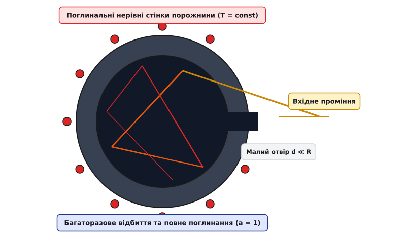
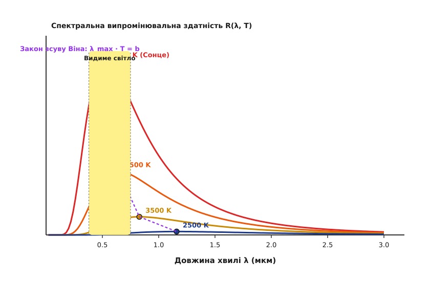
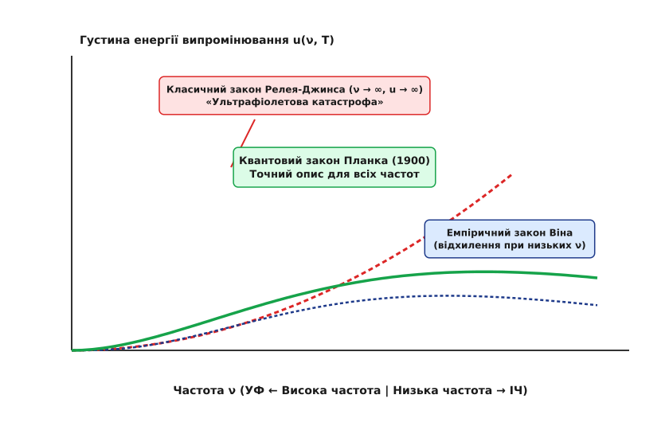

# Випромінювання абсолютно чорного тіла (закон Планка)

<preknowlist>
- [Закон збереження енергії](book:physics/energy-conservation) — фундаментальний баланс між поглинутою, відбитою та випроміненою енергією.
- [Теорема рівнорозподілу енергії](book:physics/equipartition-theorem) — класичне уявлення про середню енергію `k_B · T` на кожен ступінь вільності осцилятора.
- [Електромагнітні хвилі та спектр](book:physics/electromagnetic-waves) — стоячі хвилі в замкненій порожнині та зв'язок частоти з довжиною хвилі.
</preknowlist>

Якщо подивитися крізь крихітний отвір у внутрішність замкненої високотемпературної печі, поверхні будь-яких предметів усередині — чи то порцелянова чашка, чи то залізний брусок — здаються однаково яскравими і повністю втрачають свої візуальні обриси та колірні відмінності. За класичними уявленнями електродинаміки кінця XIX століття електромагнітне поле у такій порожнині містить нескінченну кількість стоячих хвиль із дедалі коротшою довжиною хвилі. Якщо кожен тип коливань отримує в середньому однакову теплову енергію `k_B · T` (як того вимагає класична статистична механіка), сумарна випромінювана потужність у галузі високих частот має ставати нескінченно великою. Це парадоксальне передбачення — «ультрафіолетова катастрофа» — означало б, що будь-який нагрітий кухонний чайник чи піч повинні були б миттєво випроменити всю свою внутрішню теплову енергію у вигляді смертоносного гамма- та ультрафіолетового спалаху. Насправді реальні тіла випромінюють скінченну потужність із виразним спектральним максимумом, а для пояснення цього спостереження знадобилася фундаментальна квантова революція.

---

## 1. Фізична модель абсолютно чорного тіла та закон Кірхгофа

Будь-яке тіло, температура якого перевищує абсолютний нуль (`T > 0 K`), безперервно випромінює електромагнітні хвилі за рахунок енергії хаотичного теплового руху своїх атомів та молекул. У діелектриках випромінювання виникає внаслідок теплових коливань заряджених іонів кристалічної ґратки та полярних молекулярних груп. У металах основними джерелами випромінювання є прискорений рух вільних електронів провідності під час зіткнень із ґраткою. Водночас тіло поглинає частину електромагнітного випромінювання, що падає на нього з навколишнього середовища.

Для кількісного опису процесу теплового випромінювання у фізиці використовують дві основні спектральні характеристики:
1. **Спектральна випромінювальна здатність `e(ν, T)`** (або `R(λ, T)`) — потік енергії, що випромінюється одиницею площі поверхні тіла в одиничному інтервалі частот `dν` (або довжин хвиль `dλ`) за одиницю часу у напівпростір `2·π` стерадіан. Вимірюється в одиницях Вт / (м² · Гц) або Вт / (м² · м).
2. **Спектральна поглинальна здатність `a(ν, T)`** — безрозмірний коефіцієнт, що показує, яка частка падаючої енергії електромагнітного випромінювання частоти `ν` поглинається поверхнею тіла за даної температури (`0 ≤ a(ν, T) ≤ 1`).

**Абсолютно чорне тіло** (*black body*, нім. *schwarzer Körper*) — це фізична ідеалізація, що позначає тіло, яке повністю поглинає все падаюче на нього електромагнітне випромінювання будь-якої частоти, напрямку кута падіння та поляризації за будь-якої температури:

```
a(ν, T) = 1    (для всіх частот ν та температур T)
```

Реальні макроскопічні речовини завжди відбивають або пропускають частину падаючого променя. Наприклад, звичайна сажа поглинає близько 95% падаючого видимого світла (`a ≈ 0.95`), платинова чернь — до 98%, а шар свіжого випавшого снігу у видимому діапазоні є білим (`a ≈ 0.1`), але у далекому інфрачервоному діапазоні поводиться як майже ідеальне чорне тіло (`a ≈ 0.98`). Сучасні нанотехнологічні матеріали, такі як покриття з вертикально орієнтованих масивів вуглецевих нанотрубок (Vantablack), досягають коефіцієнта поглинання понад 99.96% за рахунок багаторазового внутрішнього перевідбиття світла між наноструктурами.


*_Модель порожнини Кірхгофа: світловий промінь, потрапляючи крізь малий отвір у непрозору замкнену порожнину, зазнає багаторазових відбиттів від стінок і практично повністю поглинається._*

Ідеальне абсолютно чорне тіло фізично моделюється у вигляді непрозорої замкненої порожнини з малим отвором, діаметр якого `d` значно менший за внутрішні геометричні розміри порожнини `R`. Світловий промінь, потрапляючи всередину крізь отвір, зазнає багаторазових відбиттів від внутрішніх шорстких стінок. При кожному відбитті частина енергії поглинається стінками, і після кількох відбиттів ймовірність виходу променя назад крізь малий отвір стає знехтувно малою. Ззовні такий отвір виглядає абсолютно чорним.

Якщо стінки порожнини підтримуються за постійної температури `T`, усередині порожнини встановлюється термодинамічна рівновага між речовиною стінок та електромагнітним випромінюванням. Таке випромінювання називається **рівноважним (або чорним) випромінюванням**.

У 1859 році німецький фізик Густав Кірхгоф сформулював фундаментальний закон теплового випромінювання: **відношення спектральної випромінювальної здатності тіла до його спектральної поглинальної здатності не залежить від хімічної природи, форми чи стану поверхні тіла, а є універсальною функцією лише частоти `ν` та температури `T`**:

```
e(ν, T) / a(ν, T) = E(ν, T)
```

Для абсолютно чорного тіла `a(ν, T) = 1`, тому `e_чорне(ν, T) = E(ν, T)`. Це означає, що універсальна функція Кірхгофа `E(ν, T)` є спектральною випромінювальною здатністю абсолютно чорного тіла. 

З закону Кірхгофа випливає важливий фізичний висновок: **тіло, яке сильніше поглинає випромінювання на певній частоті, за тієї ж температури інтенсивніше випромінює на цій же частоті**. Тіла, які зовсім не поглинають світло (ідеально прозорі або дзеркальні, `a = 0`), не здатні випромінювати власне теплове світло (`e = 0`).

Спектральна випромінювальна здатність поверхні чорного тіла `R(ν, T)` прямо пов'язана зі спектральною густиною об'ємної енергії випромінювання `u(ν, T)` усередині порожнини:

```
R(ν, T) = (c / 4) · u(ν, T)
```

де `c ≈ 2.998 × 10⁸` м/с — швидкість світла у вакуумі. Множник `c / 4` отримують шляхом інтегрування потоку фотонів, що хаотично рухаються в усіх напрямках усередині напівпростору `2·π` стерадіан під різними кутами до поверхні.

---

## 2. Класичні закони випромінювання та тупик Релея-Джинса

До відкриття квантової теорії фізики намагалися встановити вигляд універсальної функції `u(ν, T)`, застосовуючи класичну термодинаміку та електродинаміку Максвелла.

### Закон Стефана-Больцмана
У 1879 році австрійський фізик Йозеф Стефан на основі аналізу експериментальних даних Джонса Тіндаля припустив, що повна випромінювальна здатність тіла пропорційна четвертому степеню температури. У 1884 році Людвіг Больцман строго вивів цю залежність для абсолютно чорного тіла з законів класичної термодинаміки.

Больцман розглядав електромагнітне випромінювання у порожнині як робоче тіло теплової машини. Згідно з теорією Максвелла, випромінювання чинить тиск `P` на стінки порожнини, який дорівнює третині об'ємної густини енергії:

```
P = u / 3
```

Застосовуючи перше та друге начала термодинаміки `dS = (dU + P dV) / T` та термодинамічне співвідношення Максвелла `(∂S/∂V)_T = (∂P/∂T)_V`, Больцман отримав диференціальне рівняння:

```
u = T · (du / dT) - u / 3
=> 4 / 3 · u = T · (du / dT)               [перенесення u/3 у ліву частину: u + u/3 = 4/3 u]
=> du / u = 4 · dT / T                     [розділення змінних u та T]
```

Інтегрування цього рівняння дає **закон Стефана-Больцмана**:

```
R_total(T) = ∫₀^∞ R(λ, T) dλ = σ · T⁴
```

де **константа Стефана-Больцмана** `σ ≈ 5.670 × 10⁻⁸` Вт / (м² · К⁴). Інтегральна потужність випромінювання АЧТ зростає надзвичайно стрімко з підвищенням температури: при подвоєнні температури випромінювана потужність збільшується у `2⁴ = 16` разів.

### Закон зсуву Віна
У 1893 році німецький фізик Вільгельм Він дослідив адіабатичне стискання сферичної порожнини з дзеркальними стінками. Внаслідок ефекту Доплера при відбитті світла від рухомих стінок довжина хвилі кожного електромагнітного коливання змінюється пропорційно радіусу порожнини, а температура випромінювання зростає.

Він довів, що спектральна густина енергії повинна мати функціональний вигляд:

```
u(λ, T) = (1 / λ⁵) · f(λ · T)
```

З цієї загальної формули випливає **закон зсуву Віна**: довжина хвилі `λ_max`, на яку припадає максимум спектральної випромінювальної здатності абсолютно чорного тіла, обернено пропорційна його абсолютній температурі:

```
λ_max · T = b
```

де `b ≈ 2.8978 × 10⁻³` м · К — стала зсуву Віна.


*_Спектри випромінювання абсолютно чорного тіла за різних температур. Зі зростанням температури площа під кривою (повний потік) зростає пропорційно T⁴, а пік випромінювання зсувається у короткохвильову область (пунктирна лінія Віна)._*

При нагріванні тіла колір його випромінювання змінюється від темно-червоного (при ~800 K) до яскраво-жовтого (~3000 K) і сліпучо-білого (~6000 K). Для Сонця з температурою фотосфери `T ≈ 5778 K` максимум випромінювання припадає на довжину хвилі `λ_max ≈ 500` нм, що відповідає зеленому діапазону видимого спектра.

### Ультрафіолетова катастрофа Релея-Джинса
У 1900–1905 роках Лорд Релей та Джеймс Джинс спробували вивести явний вигляд функції `f(λ·T)`. Вони підрахували кількість стоячих хвиль (мод) у тривимірній порожнині та застосували класичну теорему рівнорозподілу енергії по ступенях вільності.

Кількість мод електромагнітного поля на одиницю об'єму в інтервалі частот від `ν` до `ν + dν` дорівнює:

```
g(ν) dν = (8 · π · ν² / c³) dν
```

Оскільки кожна мода являє собою гармонічний осцилятор із двома ступенями вільності (кінетична та потенціальна енергія), середня енергія кожної моди у класичній статистиці Больцмана дорівнює `<E> = k_B · T`.

Множення кількості мод на середню енергію дає **закон Релея-Джинса**:

```
u(ν, T) = (8 · π · ν² / c³) · k_B · T
```


*_Порівняння законів випромінювання: класичний закон Релея-Джинса (червоний пунктир) нескінченно зростає при високих частотах (ультрафіолетова катастрофа); формула Віна (синій пунктир) хибить при низьких частотах; квантовий закон Планка (зелена суцільна крива) точний у всьому спектрі._*

Закон Релея-Джинса добре узгоджувався з експериментом у довгохвильовій (інфрачервоній) області, але призводив до повного абсурду при високих частотах `ν → ∞`. Оскільки густина мод зростає пропорційно `ν²`, інтегрування по всьому спектру дає нескінченно велику об'ємну густину енергії `u_total = ∞`. 

Цей теоретичний глухий кут німецький фізик Пауль Еренфест назвав **«ультрафіолетовою катастрофою»**. Класична фізика Ньютона та Максвелла виявилася нездатною пояснити факт існування термодинамічної рівноваги між речовиною та випромінюванням.

---

## 3. Квантова гіпотеза Планка та формула спектра

Упродовж осені 1900 року в Фізико-Технічному Імперському Інституті (PTR) у Берліні Генріх Рубенс та Фердинанд Курльбаум провели унікальні вимірювання в далекому інфрачервоному діапазоні (до 51 мкм). Вони виявили, що емпірична формула Віна, яка чудово працювала у короткохвильовій області, розходиться з дослідом при низьких частотах (докладніше історичні деталі викладено у вставці 📜 [Історія квантової кризи та гіпотези Планка](book:physics/thermodynamics/black-body-radiation/hist-planck-quanta.md)).

19 жовтня 1900 року німецький фізик Макс Планк запропонував феноменологічну інтерполяцію між формулою Віна та формулою Релея-Джинса. Проте для її фізичного обґрунтування йому довелося піти на революційний крок.

### Гіпотеза дискретних квантів
Планк припустив, що стінки порожнини складаються з атомарних осциляторів, які випромінюють та поглинають електромагнітну енергію не безперервно (як вимагала класична електродинаміка), а **виключно дискретними порціями — квантами енергії `ε`**:

```
ε = n · h · ν    (де n = 0, 1, 2, 3, ...)
```

де `h ≈ 6.626 × 10⁻³⁴` Дж · с — фундаментальна фізична стала, названа **квантом дії (сталою Планка)**.

### Розрахунок середньої енергії квантового осцилятора
Якщо енергія осцилятора може набувати лише дискретних значень `E_n = n · h · ν`, середня енергія за канонічним розподілом Больцмана обчислюється як дискретна сума:

```
<E> = ∑_{n=0}^∞ (n · h · ν) · exp(-n · h · ν / (k_B · T)) / ∑_{n=0}^∞ exp(-n · h · ν / (k_B · T))
```

Ввівши позначення `x = h · ν / (k_B · T)`, знаменник являє собою суму нескінченно спадної геометричної прогресії `Z = 1 / (1 - exp(-x))`. Чисельник є мінус похідною від `Z` за змінною `x`. 

Проводячи точні алгебраїчні перетворення (детальний вивід наведено у вставці 🧮 [Математичне виведення закону Планка](book:physics/thermodynamics/black-body-radiation/math-planck-derivation.md)), отримуємо вираз для середньої енергії квантового осцилятора:

```
<E> = h · ν / (exp(h · ν / (k_B · T)) - 1)
```

При низьких частотах (`h · ν ≪ k_B · T`) розклад експоненти дає `<E> ≈ k_B · T`. Проте при високих частотах (`h · ν ≫ k_B · T`) середня енергія експоненційно спадає до нуля, оскільки ймовірність збудження високоенергетичного кванта `h · ν` стає нескінченно малою.

### Формули закону Планка
Множачи кількість мод `g(ν) = 8 · π · ν² / c³` на середню енергію квантової моди `<E>`, отримуємо **закон Планка для спектральної об'ємної густини енергії**:

```
u(ν, T) = (8 · π · h · ν³ / c³) · 1 / (exp(h · ν / (k_B · T)) - 1)
```

У термінах довжини хвиль `λ` (використовуючи співвідношення `u(λ, T) dλ = u(ν, T) dν`, де `ν = c / λ` та `|dν/dλ| = c / λ²`):

```
u(λ, T) = (8 · π · h · c / λ⁵) · 1 / (exp(h · c / (λ · k_B · T)) - 1)
```

Спектральна випромінювальна здатність поверхні чорного тіла `R(λ, T) = (c / 4) · u(λ, T)` виражається як:

```
R(λ, T) = (2 · π · h · c² / λ⁵) · 1 / (exp(h · c / (λ · k_B · T)) - 1)
```

---

## 4. Граничні переходи та вивід фундаментальних констант

Закон Планка є універсальним співвідношенням, із якого в граничних випадках випливають усі раніше відкриті класичні закони випромінювання.

### Граничний перехід до закону Релея-Джинса (низькі частоти)
При низьких частотах або високих температурах (`h · ν ≪ k_B · T`) безрозмірний параметр `x = h · ν / (k_B · T) ≪ 1`. Розкладаючи експоненту в ряд Тейлора `exp(x) - 1 ≈ 1 + x - 1 = x`:

```
u(ν, T) ≈ (8 · π · h · ν³ / c³) · 1 / (h · ν / (k_B · T))
        = (8 · π · ν² / c³) · k_B · T
```

Квантовий закон Планка тотожно переходить у класичний закон Релея-Джинса.

### Граничний перехід до закону Віна (високі частоти)
При високих частотах або низьких температурах (`h · ν ≫ k_B · T`) одиницею в знаменнику можна знехтувати порівняно з великою експонентою `exp(h · ν / (k_B · T)) ≫ 1`:

```
u(ν, T) ≈ (8 · π · h · ν³ / c³) · exp(-h · ν / (k_B · T))
```

Позначивши константи `C₁ = 8 · π · h / c³` та `C₂ = h / k_B`, отримуємо емпіричний закон Віна.

### Строгий вивід константи Стефана-Больцмана
Інтегрування випромінювальної здатності Планка по всьому спектру довжин хвиль від `0` до `∞` за допомогою заміни змінної `x = h · c / (λ · k_B · T)` зводиться до визначеного інтеграла:

```
R_total(T) = ∫₀^∞ (2 · π · h · c² / λ⁵) · (1 / (exp(h · c / (λ · k_B · T)) - 1)) dλ
           = (2 · π · k_B⁴ · T⁴ / (h³ · c²)) · ∫₀^∞ (x³ / (exp(x) - 1)) dx
```

Значення інтеграла обчислюється через розклад у ряд та дзета-функцію Рімана `ζ(4) = π⁴ / 90`:

```
∫₀^∞ (x³ / (exp(x) - 1)) dx = 6 · ζ(4) = 6 · (π⁴ / 90) = π⁴ / 15
```

Підставляючи це значення, отримуємо теоретичний вираз для константи Стефана-Больцмана через фундаментальні сталі:

```
σ = 2 · π⁵ · k_B⁴ / (15 · c² · h³) ≈ 5.670374 × 10⁻⁸ Вт / (м² · К⁴)
```

### Строгий вивід константи зсуву Віна
Знаходження максимуму спектральної функції `dR(λ, T) / dλ = 0` приводить до трансцендентного рівняння для змінної `x = h · c / (λ_max · k_B · T)`:

```
5 · (1 - exp(-x)) = x
```

Чисельний розв'язок дає корінь `x_max ≈ 4.965114`. Звідси стала зсуву Віна обчислюється як:

```
b = λ_max · T = h · c / (k_B · x_max) ≈ 2.897772 × 10⁻³ м · К
```

Точні формули, величини констант CODATA та варіанти фотонного потоку зібрані у вставці 📋 [Довідник фундаментальних констант та формул спектрометрії](book:physics/thermodynamics/black-body-radiation/api-radiation-constants.md).

---

## 5. Термодинаміка фотонного газу та флуктуації Ейнштейна

У сучасній квантовій статистичній фізиці рівноважне випромінювання чорного тіла розглядається як рівноважний **фотонний газ** — газ безмасових бозонів зі спіном 1 (які мають два незалежні стани поляризації).

### Термодинамічний потенціал та хімічний потенціал фотонів
Оскільки фотони можуть безперервно випромінюватися та поглинатися стінками порожнини, їх загальне число у системі не зберігається (`N ≠ const`). Умова термодинамічної рівноваги за постійних об'єму `V` та температури `T` вимагає мінімуму вільної енергії Гельмгольца `F`:

```
(∂F / ∂N)_{T, V} = 0 => μ = 0
```

**Хімічний потенціал фотонного газу строго дорівнює нулю (`μ = 0`).**

Вільна енергія Гельмгольца `F` фотонного газу обчислюється через інтегрування за станами:

```
F = - (8 · π⁵ · k_B⁴ · V / (45 · c³ · h³)) · T⁴ = - (1 / 3) · u · V
```

Звідси отримуємо основні термодинамічні величини фотонного газу:
- **Внутрішня енергія:** `U = F - T · (∂F/∂T)_V = a · V · T⁴` (де `a = 4 · σ / c ≈ 7.566 × 10⁻¹⁶` Дж / (м³ · К⁴)).
- **Ентропія фотонного газу:** `S = - (∂F/∂T)_V = (4 / 3) · a · V · T³`.
- **Тиск випромінювання:** `P = - (∂F/∂V)_T = (1 / 3) · a · T⁴ = u / 3`.
- **Теплоємність фотонного газу:** `C_v = (∂U/∂T)_V = 4 · a · V · T³`.
- **Адіабатичний процес для випромінювання:** при адіабатичному розширенні порожнини (`S = const`) зберігається комбінація `V · T³ = const`, а тиск підпорядковується рівнянню адіабати `P · V^(4/3) = const` (показник адіабати `γ = 4/3`).

### Флуктуації Ейнштейна та корпускулярно-хвильовий дуалізм (1909)
У 1909 році Альберт Ейнштейн проаналізував флуктуації енергії випромінювання чорного тіла у малому об'ємі. Використовуючи формулу Больцмана для флуктуацій ентропії `⟨(ΔU)²⟩ = k_B · T² · (dU/dT)`, Ейнштейн розрахував середньоквадратичну флуктуацію енергії у вузькому інтервалі частот `dν`:

```
⟨(ΔU_ν)²⟩ = h · ν · U_ν + (c³ / (8 · π · ν² · V · dν)) · U_ν²
```

Ця формула містить два доданки, які мають глибинний фізичний зміст:
1. **Перший доданок `h · ν · U_ν`** відповідає флуктуаціям числа дискретних класичних частинок (фотонів), що підпорядковуються статистиці Пуассона `⟨(ΔN)²⟩ = ⟨N⟩`.
2. **Другий доданок `∝ U_ν²`** відповідає хвильовим флуктуаціям інтерференції випадкових електромагнітних хвиль у порожнині.

**Флуктуаційна формула Ейнштейна вперше явно продемонструвала корпускулярно-хвильовий дуалізм світла:** електромагнітне випромінювання одночасно проявляє як властивості дискретних частинок (фотонів), так і властивості неперервних хвиль.

---

## 6. Принцип детального балансу Айнштайна (1917)

У 1917 році Альберт Ейнштейн запропонував елегантний вивід закону Планка з розгляду мікроскопічних процесів взаємодії випромінювання з дворевневою атомарною системою. 

Нехай `N₁` та `N₂` — населеності атомних рівнів із енергіями `E₁` та `E₂` (`E₂ - E₁ = h·ν`). У системі відбуваються три типи квантових процесів:
1. **Спонтанне випромінювання:** атом переходить із верхнього рівня 2 на нижній рівень 1 самочинно незалежно від зовнішнього поля зі швидкістю `A₂₁ · N₂`.
2. **Вимушене (стимульоване) випромінювання:** атом падає з рівня 2 під дією зовнішнього електромагнітного поля густини `u(ν)` зі швидкістю `B₂₁ · N₂ · u(ν)`, випромінюючи фотон, тотожний падаючому за частотою, фазою та напрямком.
3. **Поглинання:** атом піднімається з рівня 1 на рівень 2, поглинаючи квант із поля, зі швидкістю `B₁₂ · N₁ · u(ν)`.

У стані термодинамічної рівноваги кількість прямих і зворотних переходів дорівнює одна одній:

```
A₂₁ · N₂ + B₂₁ · N₂ · u(ν) = B₁₂ · N₁ · u(ν)
```

Враховуючи розподіл Больцмана для населеностей рівнів `N₂ / N₁ = exp(-h·ν / (k_B·T))` та вимогу, щоб при нескінченній температурі `T → ∞` густина випромінювання прямувала до нескінченності `u(ν) → ∞`, отримуємо два фундаментальні співвідношення між коефіцієнтами Айнштайна: 

```
B₁₂ = B₂₁
A₂₁ / B₂₁ = 8 · π · h · ν³ / c³
```

Розв'язуючи рівняння детального балансу відносно `u(ν)`, негайно отримуємо квантовий закон Планка. Співвідношення Айнштайна для вимушеного випромінювання через сорок років стало фізичною основою для створення квантових генераторів світла — лазерів та мазерів.

---

## 7. Сірі тіла, коефіцієнт чорноти та реальні поверхні

Реальні макроскопічні об'єкти відхиляються від ідеальної моделі абсолютно чорного тіла. Для опису випромінювання реальних тіл вводять **спектральний коефіцієнт чорноти (випромінюваність) `ε(λ, T)`**:

```
ε(λ, T) = R_реальне(λ, T) / R_АЧТ(λ, T)
```

Залежно від характеру функції `ε(λ, T)` випромінювачі класифікують:
- **Селективні випромінювачі:** коефіцієнт чорноти `ε(λ)` сильно залежить від довжини хвилі (наприклад, поліровані метали мають високий коефіцієнт відбиття у ІЧ-діапазоні та `ε ≈ 0.02 - 0.1`, тоді як оксиди металів мають `ε ≈ 0.6 - 0.9`).
- **Сірі тіла:** коефіцієнт чорноти є сталим у розглянутому спектральному діапазоні (`ε(λ) = ε = const < 1`). Для сірого тіла закон Стефана-Больцмана набуває вигляду `R_total = ε · σ · T⁴`.

### Закон Ламберта
Більшість шорстких реальних поверхонь та отвори печей випромінюють дифузно, підпорядковуючись **закону косинуса Ламберта**: яскравість випромінювання `B` не залежить від кута спостереження `θ`, а сила світла `I(θ)` пропорційна косинусу кута до нормалі поверхні:

```
I(θ) = I₀ · cos(θ)
```

Завдяки закону Ламберта розжарена куля або циліндр (наприклад, Сонце або нитка лампи) здається однаково яскравим по всьому своєму видимому диску, без потемніння до країв.

---

## 8. Застосування у науці, метеорології та приладобудуванні

Закон Планка є фундаментальним інструментом у сучасній фізиці, астрономії та приладобудуванні:

1. **Астрофізика та спектрометрія зірок:**
   Випромінювання зоряних фотосфер із високою точністю описується спектром Планка. За виміряним максимумом випромінювання `λ_max` (законом Віна) або за відношенням інтенсивностей у різних світлофільтрах обчислюють ефективну температуру зірок (чисельний алгоритм підгонки зоряних спектрів мовами C та C++ наведено у вставці ⚙️ [Чисельне моделювання спектра ЧТ](book:physics/thermodynamics/black-body-radiation/proj-blackbody-sim.md)).

2. **Космічне реліктове випромінювання (CMB):**
   Всесвіт заповнений фоновим мікрохвильовим випромінюванням, що збереглося з епохи рекомбінації первинної плазми (через 380 тисяч років після Великого Вибуху). Вимірювання космічних обсерваторій COBE, WMAP та Planck довели, що спектр реліктового випромінювання є найідеальнішим спектром чорного тіла, коли-небудь виміряним у природі, з температурою `T = 2.72548 ± 0.00057 K`.

3. **Оптична пірометрія та інфрачервона термографія:**
   Безконтактні вимірювачі температури (пірометри та тепловізори) реєструють потік інфрачервоного випромінювання від поверхні об'єкта. Знаючи спектральний діапазон чутливості матриці (наприклад, LWIR 8–14 мкм для кімнатних температур ~300 K), прилад обчислює температуру поверхні на основі закону Планка та заданого коефіцієнта чорноти `ε`.

> 🔧 **Навіщо це.**
> Знання спектрального розподілу Планка є критичним для розрахунку теплового балансу космічних апаратів (де скидання тепла відбувається виключно через радіаційне випромінювання у вакуум), проектитування сонячних фотоелектричних панелей (для узгодження ширини забороненої зони напівпровідника з максимумом сонячного спектра), а також для розробки калібрувальних еталонних джерел АЧТ, які використовуються при метрологічній атестації промислових тепловізорів та медичних термометрів.
