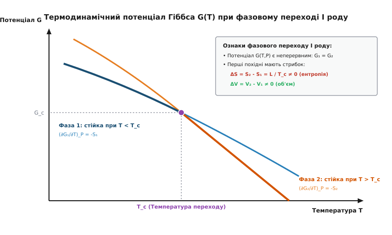
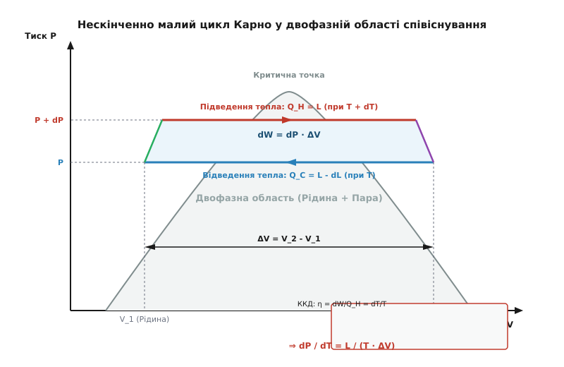
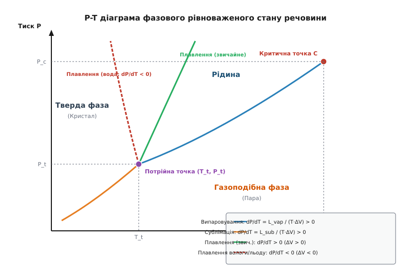

# Рівняння Клапейрона — Клаузіуса для фазових переходів першого роду

<preknowlist>
- [Перший закон термодинаміки](book:physics/thermodynamics/first-law-thermodynamics) — збереження енергії, зв'язок між підведеною теплотою, виконаною роботою та зміною внутрішньої енергії (`dQ = dU + dW`).
- [Другий закон термодинаміки](book:physics/thermodynamics/second-law-thermodynamics) — незворотність процесів, зростання ентропії та вираз для прихованого тепла через стрибок ентропії (`L = T · ΔS`).
- [Хімічний потенціал](book:physics/thermodynamics/chemical-potential) — молярна енергія Гіббса, умова міжфазової рівноваги через рівність потенціалів (`μ_1(T, P) = μ_2(T, P)`).
- [Правило фаз Гіббса](book:physics/thermodynamics/gibbs-phase-rule) — термодинамічні ступені вільності гетерогенної системи (`f = C - P + 2`), де однокомпонентна двофазна система має одну вільну змінну (`f = 1`).
</preknowlist>

Кожен, хто спостерігав за кипінням води у гірській місцевості або за таненням льоду під ковзанами, зіштовхувався з фундаментальною особливістю фазових рівноваг: температура, при якій речовина змінює свій агрегатний стан, не є застиглою стаціонарною константою. На вершині Евересту при атмосферному тиску близько `33 кПа` вода закипає вже при `71 °C`, що унеможливлює зварювання їжі у відкритій посудині, а в інженерній скороварці під тиском `200 кПа` температура кипіння зростає до `120 °C`. З іншого боку, звичайний кристал льоду під дією колосального механічного тиску тане при температурі, нижчій за нуль градусів Цельсія.

Ці різноманітні феномени підпорядковуються єдиному фундаментальному закону термодинаміки — **рівнянню Клапейрона — Клаузіуса**. Воно дає строгий математичний зв'язок між зміною тиску фазового переходу, зміною температури, поглинутою або виділеною прихованою теплотою та зміною молярного об'єму речовини.

## Термодинамічна природа фазових переходів першого роду

У термодинаміці фазовим переходом називають стрибкоподібну зміну фізичних властивостей макроскопічної системи при безперервній зміні зовнішніх параметрів, таких як температура `T` або тиск `P`. За класифікацією Пауля Еренфеста (Paul Ehrenfest), фазові переходи поділяють за порядком похідних потенціалу Гіббса `G`, які зазнають розриву.

При **фазовому переході першого роду** сам термодинамічний потенціал Гіббса `G(T, P)` залишається неперервною функцією, однак його перші частинні похідні по температурі та тиску мають стрибкоподібний розрив:

```
(∂G / ∂T)_P = -S,    (∂G / ∂P)_T = V
```

Оскільки перші похідні відповідають ентропії `S` та об'єму `V`, під час фазового переходу I роду спостерігаються два обов'язкові макроскопічні ефекти:
1. **Стрибок ентропії `ΔS = S_2 - S_1 ≠ 0`**, що означає обов'язкове поглинання або виділення **прихованої теплоти переходу** `L = T · ΔS`.
2. **Стрибок молярного об'єму `ΔV = V_2 - V_1 ≠ 0`**, що означає зміну густини речовини при перебудові її структури.


*Потенціал Гіббса G(T) двох фаз при постійному тиску. У точці переходу T_c потенціали рівні (G_1 = G_2), але нахили кривих (dG/dT = -S) різко відрізняються, що породжує стрибок ентропії ΔS та приховану теплоту L.*

На графіку потенціалу Гіббса `G(T)` для двох фаз стійкою при даній температурі є та фаза, яка має менше значення `G`. При температурі переходу `T_c` криві `G_1(T)` та `G_2(T)` перетинаються, тобто `G_1(T_c, P) = G_2(T_c, P)`. Оскільки нахил кривої `G_2` для високотемпературної фази (наприклад, пари) є крутішим, ніж для низькотемпературної фази (наприклад, рідини), ентропія другої фази є більшою (`S_2 > S_1`).

З мікроскопічної точки зору фазовий перехід I роду супроводжується якісною перебудовою міжмолекулярної структури речовини:
* **Плавлення:** Руйнується далекий порядок кристалічної ґратки. Кінетична енергія теплових коливань досягає порогу, при якому атомні вузли виходять зі своїх потенціальних ям;
* **Випаровування:** Долаються міжмолекулярні сили притягання (ван-дер-ваальсові сили або водневі зв'язки), і молекули переходять у стан хаотичного вільного руху газоподібної фази;
* **Сублімація:** Молекули переходять безпосередньо з кристалічної ґратки в газоподібну фазу, минаючи рідкий стан.

Підведена прихована теплота `L` витрачається на дві чіткі фізичні потреби: на зміну внутрішньої потенціальної енергії взаємодії молекул (розрив зв'язків) та на виконання зовнішньої роботи розширення `P · ΔV` проти зовнішніх сил тиску.

Детальний аналіз формування перших уявлень про приховану теплоту та історичних дискусій навколо теорії теплороду у XIX столітті подано в [історичному нарисі](book:physics/thermodynamics/clapeyron-clausius-equation/hist-clapeyron-clausius.md).

## Мікроскопічна картина фазової рівноваги

На мікроскопічному рівні фазова рівновага на межі «рідина — пара» або «кристал — рідина» є не статичним заціпенінням, а **динамічним балансом протилежно спрямованих молекулярних потоків**.

У рідкій фазі молекули утримуються міжмолекулярним потенціалом притягання Леннард-Джонса або водневими зв'язками. Завдяки розподілу Максвелла за швидкостями окремі молекули з хвоста високоенергетичного розподілу володіють кінетичною енергією, що перевищує потенціальний бар'єр виходу з рідини `E_esc`. Ці молекули долають поверхневий шар і вилітають у газову фазу — відбувається випаровування.

Одночасно молекули з газової фази внаслідок хаотичних теплових зіткнень вдаряються про поверхню рідини, віддають імпульс і захоплюються міжмолекулярними силами рідкої фази — відбувається конденсація. 

Стан рівноваги при даній температурі `T` досягається тоді, коли густина газової фази (тиск `P`) зростає до значення, при якому чисельність молекул, що конденсуються за секунду на одиницю площі, строго дорівнює чисельності молекул, що випаровуються. Якщо підвищити температуру `T`, середня кінетична енергія молекул зростає, експоненційно більша частка молекул отримує енергію `E > E_esc`, і потік випаровування зростає. Щоб відновити баланс потоків, рівноважний тиск пари `P` також мусить зрости за експоненційним законом.

## Умова термодинамічної рівноваги та виведення рівняння

Розглянемо дві фази однієї речовини (наприклад, рідину `1` та пару `2`), які перебувають у стані термодинамічної рівноваги у закритій посудині при тиску `P` і температурі `T`.

Згідно з правилом фаз Гіббса, кількість ступенів вільності такої однокомпонентної двофазної системи дорівнює:

```
f = C - P + 2 = 1 - 2 + 2 = 1
```

Це означає, що ми можемо довільно змінювати лише один параметр (наприклад, температуру `T`), після чого тиск `P`, при якому обидві фази співіснують у рівновазі, визначається однозначно. Функція `P(T)` називається **фазовою кривою рівноваги** або кривою тиску насичення.

Умовою міжфазової рівноваги є рівність молярних хімічних потенціалів обох фаз:

```
μ_1(T, P) = μ_2(T, P)
```

Зі співвідношення Гіббса — Дюгема відомо, що для кожного моля фази зміна хімічного потенціалу виражається через молярну ентропію `s` та молярний об'єм `v`:

```
dμ = -s·dT + v·dP
```

Якщо ми змістимо температуру вздовж кривої рівноваги на нескінченно малу величину `dT`, тиск неминуче зміниться на `dP`. Щоб система залишилася у стані рівноваги, хімічні потенціали у новій точці `(T + dT, P + dP)` мусять знову збігатися:

```
dμ_1 = dμ_2
```

Підставляючи диференціали хімічних потенціалів:

```
-s_1·dT + v_1·dP = -s_2·dT + v_2·dP
```

Згрупуємо члени з одинаковими диференціалами в лівій та правій частинах рівняння:

```
(v_2 - v_1)·dP = (s_2 - s_1)·dT
```

Розділивши обидві частини на `dT` та `(v_2 - v_1)`, отримуємо відношення зміни тиску до зміни температури вздовж ліній рівноваги:

```
dP / dT = (s_2 - s_1) / (v_2 - v_1) = Δs / Δv
```

Оскільки зміна ентропії під час рівноважного ізотермічного переходу виражається через молярну приховану теплоту `L` як `Δs = L / T`, підстановка дає канонічну форму **рівняння Клапейрона — Клаузіуса**:

```
dP / dT = L / (T · (v_2 - v_1)) = L / (T · Δv)
```

Де:
* `dP / dT` — похідна тиску по температурі (нахил дотичної до кривої фазової рівноваги на `P-T` діаграмі);
* `L` — питома або молярна прихована теплота фазового переходу (Дж/кг або Дж/моль);
* `T` — абсолютна температура фазового переходу (Кельвін);
* `Δv = v_2 - v_1` — зміна питомого або молярного об'єму речовини при переході з фази `1` у фазу `2` (м³/кг або м³/моль).


*Нескінченно малий цикл Карно, виконаний у двофазній області між температурами T та T + dT. Зіставлення механічної роботи dW = dP · ΔV та підведеного тепла Q_H = L через ККД Карно (η = dT / T) дає альтернативний доказ рівняння Клапейрона — Клаузіуса.*

Строгі альтернативні виведення цього рівняння через нескінченно малий цикл Карно та співвідношення Максвелла подано у [математичному аналізі](book:physics/thermodynamics/clapeyron-clausius-equation/math-derivation.md).

## Аналіз трьох типів фазових переходів

Знак та величина нахилу `dP/dT` на `P-T` діаграмі повністю визначаються знаками прихованої теплоти `L` та зміни об'єму `Δv`. Оскільки перехід у більш високотемпературну фазу завжди супроводжується поглинанням тепла (`L > 0`), вирішальним чинником стає знак зміни об'єму `Δv`.


*P-T діаграма фазових станів. Криві випаровування та сублімації завжди мають додатний нахил (dP/dT > 0). Крива плавлення для більшості речовин нахилена праворуч (dP/dT > 0), тоді як для води та льоду спостерігається аномальний лівий нахил (dP/dT < 0).*

### 1. Випаровування (Рідина → Пара) та Сублімація (Тверде тіло → Пара)

При випаровуванні рідини або сублімації твердого тіла речовина переходить у газоподібний стан. Оскільки середня відстань між молекулами газу при нормальних тисках у десятки разів перевищує розміри самих молекул, молярний об'єм пари `v_gas` на кілька порядків більший за молярний об'єм condensed фази `v_liq` або `v_sol`:

```
v_gas ≫ v_liq  ⇒  Δv = v_gas - v_liq > 0
```

Оскільки `L > 0` та `Δv > 0`, нахил кривих випаровування та сублімації є **завжди строго додатним**:

```
dP / dT > 0
```

Це означає, що при зростанні температури тиск насиченої пари монотонно підвищується. Якщо тиск над рідиною зростає, температура її кипіння також підвищується.

Далеко від критичної точки об'ємом рідини можна знехтувати (`Δv ≈ v_gas`), а пару розглядати як ідеальний газ (`v_gas = R·T / P`). Підставляючи це в рівняння Клапейрона — Клаузіуса, отримуємо диференціальне рівняння:

```
dP / dT ≈ (L_vap · P) / (R · T²)  ⇒  d(ln P) / dT = L_vap / (R · T²)
```

Інтегруючи це рівняння у припущенні, що прихована теплота `L_vap` слабо залежить від температури, маємо експоненційний закон залежності тиску насиченої пари від температури:

```
P(T) = P_0 · exp( - (L_vap / R) · (1/T - 1/T_0) )
```

Ця формула пояснює, чому тиск насиченої пари зростає надзвичайно стрімко (за експонентою) при нагріванні рідини.

### 2. Звичайне плавлення (Тверде тіло → Рідина)

Для переважної більшості речовин (парафін, залізо, свинець, метан, вуглекислий газ) тепловий рух при плавленні руйнує впорядковану кристалічну ґратку, причому середня відстань між частинками у рідині стає трохи більшою, ніж у кристалі. Отже, питомий об'єм рідини є більшим за питомий об'єм твердого тіла:

```
v_liq > v_sol  ⇒  Δv = v_liq - v_sol > 0
```

Оскільки `L_melt > 0` та `Δv > 0`, похідна `dP/dT` є додатною:

```
dP / dT > 0
```

Звідси випливає, що для звичайних речовин **підвищення зовнішнього тиску збільшує температуру плавлення**. Щоб розплавити речовину під високим тиском, її необхідно нагріти до вищої температури, оскільки зовнішнє стискання перешкоджає розширенню речовини при переході в рідку фазу.

### 3. Аномальне плавлення (Вода / Лід, Бісмут, Ґалій, Силіцій)

Деякі речовини володіють унікальною фізичною аномалією: при таненні їхній об'єм не зростає, а скорочується. Найвідомішим прикладом є вода.

Кристалічна ґратка звичайного льоду `I_h` утримується ажурною сіткою водневих зв'язків, які формують пухку гексагональну структуру з великими порожнечами. При таненні кристалічна ґратка руйнується, частина водневих зв'язків рветься, і молекули води упаковуються щільніше. В результаті питомий об'єм рідкої води при `0 °C` (`1.0001 см³/г`) є меншим за питомий об'єм льоду (`1.0907 см³/г`):

```
v_вода < v_лід  ⇒  Δv = v_вода - v_лід = -0.0906 см³/г < 0
```

Підставляючи від'ємний стрибок об'єму `Δv < 0` та додатну теплоту плавлення `L_melt = 333.5 кДж/кг` у рівняння Клапейрона — Клаузіуса, отримуємо **від'ємний нахил кривої плавлення**:

```
dP / dT = L / (T · Δv) < 0  ⇒  dT / dP < 0
```

Це означає, що **підвищення зовнішнього тиску знижує температуру танення льоду**.

Для води обчислений нахил кривої плавлення становить:

```
dT / dP ≈ -0.0075 °C / атм
```

Кожна додаткова атмосфера тиску знижує температуру танення льоду на `0.0075 °C`. Щоб знизити температуру плавлення льоду до `-1 °C`, необхідний тиск близько `133 атмосфер`.

Цей ефект відіграє колосальну роль у природі та техніці:
* **Регеляція (переплавлення):** Коли два шматки льоду здавлюють один з одним, тиск у місці контакту знижує точку танення, лід підплавляється, а після зняття тиску вода миттєво замерзає знову, міцно зварюючи шматки;
* **Динаміка льодовиків:** Колосальний тиск багатокілометрової товщі льоду на дні льодовика знижує температуру танення, утворюючи тонку плівку рідкої води. Це рідке мастило дозволяє льодовикам повільно ковзати по скельному ложу;
* **Підльодовикові озера:** Озеро Восток в Антарктиді існує у рідкому стані під чотирикілометровим шаром льоду при температурі близько `-3 °C` завдяки високому тиску товщі льоду.

### 4. Поліморфні фази льоду при високих тисках

Цікаво зазначити, що аномальний від'ємний нахил `dP/dT < 0` притаманний лише звичайній модифікації льоду `I_h` при тисках до `210 МПа` (`2100 атмосфер`). При вищих тисках кристалічна структура льоду перебудовується у більш щільні поліморфні модифікації (лід `III`, лід `V`, лід `VI`, лід `VII`). 

Для цих високотискових фаз густина льоду стає більшою за густину рідкої води (`v_лід < v_вода`), тому стрибок об'єму повертається до додатного знаку (`Δv > 0`), і нахил кривої плавлення знову стає **додатним** (`dP/dT > 0`).

> 🔧 **Навіщо це.**
> Здатність розраховувати нахил фазових кривих `dP/dT` за допомогою рівняння Клапейрона — Клаузіуса є базовим інструментом при проектуванні холодильних машин, теплових насосів, кріогенних систем та технологій сублімаційної сушки (ліофілізації). Наприклад, у холодильному циклі компресор стискає фреон чи аміак до тиску, при якому температура конденсації пари стає вищою за температуру навколишнього середовища, дозволяючи скинути теплоту в кімнату. Потім рідкий холодоагент дроселюється через капілярну трубку в випарник, де тиск різко падає; згідно з рівнянням Клапейрона — Клаузіуса температура кипіння падає нижче нуля, і холодоагент інтенсивно відбирає тепло з морозильної камери.

## Порівняльний аналіз термодинамічних параметрів речовин

Фізичний зміст рівняння Клапейрона — Клаузіуса наочно розкривається при порівнянні термодинамічних характеристик фазових переходів різних речовин при атмосферному тиску `101.3 кПа`:

```
Речовина   | T_плав (°C) | L_плав (кДж/кг) | Δv_плав (см³/г) | dP/dT (атм/°C)
-----------+-------------+-----------------+-----------------+---------------
Вода (H₂O) |      0.0    |      333.5      |     -0.0906     |     -133.3
Бензол     |      5.5    |      126.3      |     +0.1310     |      +31.5
Свинець    |    327.5    |       23.0      |     +0.0034     |     +305.0
Аргон      |   -189.3    |       29.5      |     +0.0880     |      +38.2
```

З наведених даних видно, що для води від'ємний стрибок об'єму `Δv < 0` дає від'ємне значення `dP/dT`, тоді як для бензолу, свинцю та аргону нахил `dP/dT` є строго додатним.

## Вплив кривизни поверхні: Рівняння Кельвіна

При розгляді фазової рівноваги макроскопічно пласкої межі розділу тиск насиченої пари залежить лише від температури `P_sat(T)`. Проте якщо рідка фаза перебуває у вигляді дрібних крапель радіуса `r` (або пористих капілярів), викривлення поверхні створює додатковий лапласівський тиск:

```
ΔP = 2·γ / r
```

Де `γ` — коефіцієнт поверхневого натягу рідини.

Виходячи з рівності хімічних потенціалів пару над викривленою поверхнею та над пласкою поверхнею, Вільям Томсон (Лорд Кельвін) отримав **рівняння Кельвіна**:

```
P_r = P_sat · exp( (2·γ·v_liq) / (r·R·T) )
```

З рівняння Кельвіна випливає:
* Над дрібними опуклими краплями тиск насиченої пари `P_r` є **вищим**, ніж над пласкою поверхнею (`P_r > P_sat`). Дрібні краплі є метастабільними і прагнуть випаруватися, віддаючи речовину більшим краплям (ефект Оствальдівського дозрівання);
* У вузьких увігнутих капілярах тиск насиченої пари є **нижчим** (`P_r < P_sat`), що викликає ефект **капілярної конденсації** пари при відносній вологості, меншій за `100%`.

## Атмосферна фізика та метеорологія

Рівняння Клапейрона — Клаузіуса є головним математичним рушієм атмосферних процесів, утворення хмар та випадіння опадів.

Коли вологе повітря піднімається вгору в атмосфері, воно розширюється через падіння атмосферного тиску та адіабатично охолоджується. Температура повітряного об'єму знижується, що згідно з рівнянням Клапейрона — Клаузіуса призводить до стрімкого експоненційного падіння граничного тиску насиченої водяної пари `P_sat(T)`.

Коли фактичний парціальний тиск водяної пари досягає значення `P_sat(T)` (відносна вологість дорівнює `100%`), повітря досягає **точки роси**. Подальше охолодження змушує надлишкову пару конденсуватися у мікроскопічні краплі води чи кристали льоду, формуючи хмари та туман.

Виділення прихованої теплоти конденсації (`L_vap ≈ 2.5 МДж/кг`) при утворенні хмар істотно сповільнює дальше охолодження повітря при підйомі:
* **Сухоадіабатичний градієнт:** Охолодження сухого повітря становить `9.8 °C` на кожен кілометр підйому;
* **Вологоадіабатичний градієнт:** Завдяки виділенню прихованої теплоти конденсації вологе повітря охолоджується лише на `5.0–6.5 °C` на кілометр.

Ця різниця градієнтів породжує потужну конвективну нестійкість атмосфери, підживлюючи грозові хмари, тропічні циклони та урагани.

## Промислова ректифікація та кріогенна техніка

У хімічній промисловості рівняння Клапейрона — Клаузіуса лежить в основі розрахунку процесів розділення рідких сумішей у ректифікаційних колонах. Тиск насиченої пари кожного компонента рідкої суміші визначається його прихованою теплотою випаровування `L_i` та температурою. Різниця тисків насичених парів (леткість) дозволяє ефективно розділяти нафтові фракції, спирти та зріджені гази.

У кріогенній техніці це рівняння описує поведінку зріджених газів (азоту, кисню, водню, гелію). Наприклад, для досягнення наднизьких температур нижче `4.2 K` у фізичних експериментах застосовують вакуумну відкачку пари над поверхнею рідкого гелію-4. Згідно з рівнянням Клапейрона — Клаузіуса, зниження тиску пари `P` відкачуванням компресора автоматично знижує температуру кипіння рідкого гелію, дозволяючи досягати температур аж до лямбда-точки (`2.17 K`) і нижче, переводячи гелій у надплинний стан.

## Критична та потрійна точки на фазовій діаграмі

Криві фазової рівноваги на `P-T` діаграмі перетинаються та обриваються у двох особливих точках:

1. **Потрійна точка (`T_t, P_t`):** Точка на площині станових змінних, де одночасно співіснують у рівновазі три фази — тверда, рідка та газоподібна. Для чистої води потрійна точка фіксована строго при `T_t = 273.16 К` (`0.01 °C`) та тиску `P_t = 611.65 Па` (`4.58 мм рт. ст.`). В цій точці сходяться всі три криві фазових переходів (сублімації, випаровування та плавлення), причому з кутів нахилу випливає співвідношення прихованих теплот:
```
L_sub = L_melt + L_vap      [сума прихованих теплот у потрійній точці]
```
2. **Критична точка (`T_c, P_c`):** Точка, у якій крива випаровування «рідина — пара» **безпосередньо обривається**. При наближенні до критичної температури густина рідини зменшується за рахунок теплового розширення, а густина насиченої пари зростає через підвищення тиску. У критичній точці межа між рідиною та парою зникає, стрибок об'єму дорівнює нулю (`Δv = 0`), а прихована теплота випаровування перетворюється на нуль (`L_vap = 0`). Речовина переходить у стан **надкритичної флюїдної фази**.

Важливо підкреслити фундаментальну відмінність: **крива плавлення кристала ніколи не закінчується критичною точкою**. Рідина та газ володіють однаковою ізотропною симетрією (відсутність далекого порядку), тому між ними можливий безперервний перехід вище критичної точки. Натомість кристалічна ґратка володіє дискретною просторовою симетрією, яка або є, або відсутня. Оскільки симетрію не можна змінити «наполовину», фазова межа між кристалом та рідиною не може безперервно зникнути, і крива плавлення прямує у область високих тисків необмежено.

## Чисельне моделювання та приклад коду

Для точного інженерного розрахунку кривих фазової рівноваги необхідно враховувати залежність прихованої теплоти `L(T)` від температури та відхилення стисливості реального газу від закону ідеального газу.

У [програмному модулі](book:physics/thermodynamics/clapeyron-clausius-equation/proj-phase-boundary-sim.md) наведено повний алгоритм інтегрування рівняння Клапейрона — Клаузіуса методом Рунге — Кутти 4-го порядку (RK4) з порівнянням результатів проти емпіричної формули Антуана для водяної пари.

Чисельне інтегрування диференціального рівняння:

```
dP / dT = L(T) / (T · (v_gas(P, T) - v_liq))
```

дозволяє отримати лінію насичення водяної пари з високою точністю (похибка менше `0.8%`) від потрійної точки до `100 °C` та вище.

Завдяки рівнянню Клапейрона — Клаузіуса термодинаміка отримала універсальний міст, який пов'язує макроскопічні вимірювання тиску та температури із мікроскопічними перебудовами речовини та енергетикою міжмолекулярних зв'язків.
