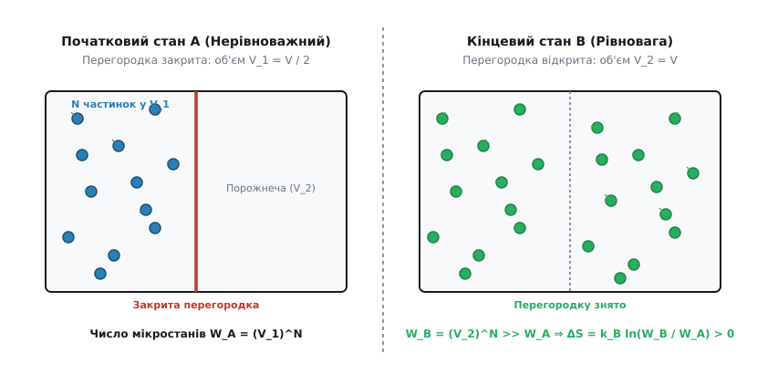
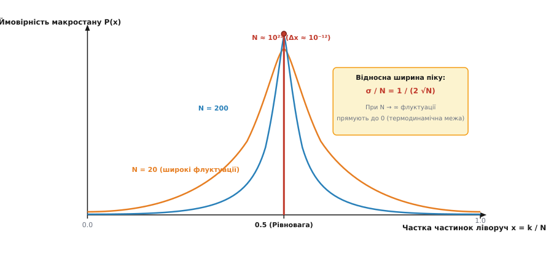
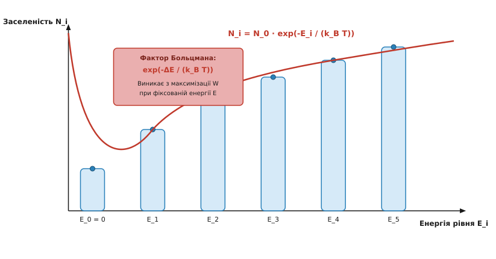

# Статистичне означення ентропії Больцмана (S = k_B ln W)

<preknowlist>
- [Перше начало термодинаміки](topic:physics/thermodynamics/first-law-thermodynamics) — поняття роботи, внутрішньої енергії, тепла та стану термодинамічної рівноваги.
- [Рівняння стану ідеального газу](topic:physics/thermal-statistical/ideal-gas-law) — зв'язок тиску, об'єму, температури та кількості речовини.
- [Комбінаторика та ймовірність](topic:math/combinatorics) — поняття перестановок, біноміальних коефіцієнтів та класичного визначення ймовірності.
</preknowlist>

При адіабатичному вільному розширенні ідеального газу у порожнечу (дослід Ґей-Люссака — Джоуля) газ не виконує зовнішньої роботи (`dW = 0`) і не отримує тепла від навколишнього середовища (`dQ = 0`). Формула Клаузіуса `dS = dQ / T` дає нульовий приріст тепла, але ентропія газу в результаті розширення від об'єму `V_1` до `V_2` підтверджено зростає на величину `ΔS = N · k_B · ln(V_2 / V_1) > 0`. Класична феноменологічна термодинаміка описувала цей факт як емпіричне правило Другого начала, проте була принципово нездатна пояснити його мікроскопічну природу: чому газ самочинно заповнює весь наданий об'єм, чому теплота завжди передається від більш нагрітого тіла до менш нагрітого і чому зворотні процеси ніколи не спостерігаються у макроскопічному світі. Людвіг Больцман розв'язав цю фундаментальну загадку, створивши статистичну фізику та показавши, що ентропія є мірою мікроскопічної ймовірності макроскопічного стану — пропорційною логарифму числа доступних мікростанів `S = k_B · ln W`.

---

## Мікростани, макростани та фазовий простір

Для побудови зв'язку між макроскопічними спостережуваними величинами (тиск `P`, об'єм `V`, температура `T`, внутрішня енергія `E`) та рухом окремих частинок статистична фізика розділяє поняття макростану та мікростану.

**Макростан** системи визначається невеликим набором макроскопічних термодинамічних параметрів, які можна безпосередньо виміряти приладами у лабораторній практиці. Наприклад, макростан одного моля газу в балоні задається об'ємом `V`, температурою `T` та кількістю речовини `N`.

**Мікростан** класичної системи з `N` частинок визначається точним заданням `3N` просторових координат `q_1, q_2, ..., q_{3N}` та `3N` імпульсів `p_1, p_2, ..., p_{3N}` абсолютно всіх частинок у конкретний момент часу. Математичним простором для опису мікростанів є `6N`-вимірний **фазовий простір** (простір Гіббса). Точка у цьому просторі задає миттєвий мікростан системи, а еволюція системи з часом описується рухом фазової точки уздовж фазової траєкторії згідно з рівняннями Гамільтона:

```
dq_i / dt = ∂H / ∂p_i
dp_i / dt = - ∂H / ∂q_i
```

Згідно з теоремою Ліувілля, елементарний фазовий об'єм нестисливої неспряженої гамільтонової системи зберігається вздовж траєкторій руху: `dΓ = d³N q · d³N p = const`.

У суто класичній механіці координати та імпульси змінюються безперервно, тому число можливих точок у фазовому просторі є нескінченним і незліченним. Щоб зробити число мікростанів `W` скінченним і зліченним величиною, фазовий простір розбивають на елементарні комірки. Згідно з квантовою механікою (принципом невизначеності Гейзенберга `Δq · Δp ≥ h`), фундаментальний мінімальний об'єм однієї комірки у фазовому просторі однієї частинки дорівнює `h³` (де `h` — стала Планка), а для системи з `N` частинок — `h^(3N)`.

Крім того, оскільки однакові квантові частинки (наприклад, електрони або атоми гелію) є принципово нерозрізнюваними, перестановка двох однакових частинок місцями не створює нового мікростану. Для врахування цієї квантової нерозрізнюваності повний фазовий об'єм класичної системи додатково ділиться на `N!`.

**Термодинамічна вага `W`** (або число мікростанів) — це кількість різних мікроскопічних конфігурацій частинок (комірок фазового простору), які реалізують один і той самий макроскопічний стан. Слід чітко розрізняти термодинамічну вагу `W` та математичну ймовірність `P`:

1. Математична ймовірність `P` завжди є безрозмірним числом у діапазоні від `0` до `1` (`0 ≤ P ≤ 1`).
2. Термодинамічна вага `W` є цілим додатним числом (`W ≥ 1`), яке задає число доступних мікростанів (або безрозмірний об'єм у фазовому просторі, виміряний у одиницях `h^(3N) · N!`).

В основі статистичної механіки лежить **постулат про рівну ймовірність мікростанів** (ергодична гіпотеза): для замкненої ізольованої системи з фіксованою енергією `E`, об'ємом `V` та числом частинок `N` всі доступні мікростани є рівноймовірними. Це означає, що при тривалому русі система проводить однаковий час у кожній доступній комірці фазового простору.


*Макростан A відповідає стиснутому газу у ліві половині з малою кількістю доступних мікростанів W_A, тоді як макростан B описує рівноважне розширення по всьому об'єму з колосально більшою кількістю мікростанів W_B >> W_A.*

Оскільки кожний окремий мікростан реалізується з однаковою ймовірністю, ймовірність виявити систему у певному макростані прямо пропорційна кількості мікростанів `W`, що відповідають цьому макростану. Система самочинно еволюціонує від макростанів із малим `W` до макростанів із колосально більшим `W`, тому що останні охоплюють пригнічувальну більшість фазового об'єму.

---

## Дискретна комбінаторна модель на прикладі 4 частинок

Щоб отримати точну математичну інтуїцію щодо відмінності між мікростанами та макростанами, розглянемо простий дискретний приклад: 4 розрізнювані частинки (позначені літерами `A, B, C, D`), які можна розмістити у двох половинах коробки (лівій `L` та правій `R`).

Загальна кількість можливих мікростанів для 4 частинок дорівнює `2⁴ = 16`. Розподілимо ці 16 мікростанів по макростанах, які визначаються кількістю частинок у лівій половині `k = N_L`:

1. **Макростан `k = 4` (всі ліворуч):** лише 1 мікростан `{ABCD | -}`. Термодинамічна вага `W(4) = 1`. Відносна ймовірність `P = 1 / 16 = 6.25%`.
2. **Макростан `k = 3` (3 ліворуч, 1 праворуч):** 4 мікростани `{ABC | D}`, `{ABD | C}`, `{ACD | B}`, `{BCD | A}`. Вага `W(3) = 4`. Ймовірність `P = 4 / 16 = 25.0%`.
3. **Макростан `k = 2` (рівномірний розподіл, 2 ліворуч, 2 праворуч):** 6 мікростанів `{AB | CD}`, `{AC | BD}`, `{AD | BC}`, `{BC | AD}`, `{BD | AC}`, `{CD | AB}`. Вага `W(2) = 6`. Ймовірність `P = 6 / 16 = 37.5%`.
4. **Макростан `k = 1` (1 ліворуч, 3 праворуч):** 4 мікростани `{A | BCD}`, `{B | ACD}`, `{C | ABD}`, `{D | ABC}`. Вага `W(1) = 4`. Ймовірність `P = 4 / 16 = 25.0%`.
5. **Макростан `k = 0` (всі праворуч):** лише 1 мікростан `{- | ABCD}`. Вага `W(0) = 1`. Ймовірність `P = 1 / 16 = 6.25%`.

З цього розрахунку видно: рівноважний стан `k = 2` має найбільшу термодинамічну вагу `W = 6` і найвищу ймовірність `37.5%`. Для 4 частинок флуктуації ще великі: ймовірність знайти всі частинки в одній половині становить `6.25% + 6.25% = 12.5%`. Проте для макроскопічного газу з `N = 10²³` частинок вага рівноважного стану `k = N / 2` переважає всі інші макростани у `10^(10²³)` разів, що перетворює ймовірність рівноважного стану на абсолютну практичну неминучість.

---

## Функціональне виведення формули Больцмана

Зв'язок між макроскопічною ентропією `S` та мікроскопічним числом станів `W` виводиться з двох фундаментальних вимог: аддитивності ентропії та мультиплікативності чисел мікростанів для незалежних систем.

Розглянемо дві підсистеми `A` та `B`, які є термодинамічно незалежними (енергією взаємодії на межі розділу можна знехтувати порівняно з об'ємною енергією).

Нехай подія перебування системи `A` у певному макростані реалізується `W_A` мікростанами, а системи `B` — `W_B` мікростанами. З комбінаторного правила добутку випливає, що кожному мікростану системи `A` відповідає будь-який із `W_B` мікростанів системи `B`. Отже, загальне число мікростанів об'єднаної системи `A + B` дорівнює добутку:

```
W_AB = W_A · W_B
```

З іншого боку, термодинамічна ентропія є аддитивною величиною станційного типу. Ентропія всієї системи дорівнює сумі ентропій її частин:

```
S_AB = S_A + S_B
```

Шукаємо зв'язок у вигляді функціональної залежності `S = S(W)`. Підставляючи співвідношення для `W_AB` та `S_AB`, отримуємо функціональне рівняння:

```
S(W_A · W_B) = S(W_A) + S(W_B)
```

Єдиною неперервною функцією, яка перетворює добуток аргументів у суму їхніх значень, є логарифмічна функція. Для строгості продиференціюємо це рівняння спочатку за `W_A`, а потім за `W_B`:

```
dS(W_A · W_B) / dW_A = S'(W_A · W_B) · W_B = S'(W_A)
dS(W_A · W_B) / dW_B = S'(W_A · W_B) · W_A = S'(W_B)
```

Множачи перше рівняння на `W_A`, а друге на `W_B`, отримуємо:

```
S'(W_A · W_B) · (W_A · W_B) = S'(W_A) · W_A = S'(W_B) · W_B
```

Ліва частина залежить від добутку `W_A · W_B`, а праві частини залежать лише від `W_A` та лише від `W_B` відповідно. Це можливо лише тоді, коли вираз `S'(W) · W` є однаковою універсальною сталою величиною `k_B` для будь-якої фізичної системи:

```
S'(W) · W = k_B   ⇒   dS = k_B · (dW / W)
```

Інтегруючи цей вираз, отримуємо фундаментальну формулу Больцмана:

```
S = k_B · ln W
```

Стала інтегрування покладена рівною нулю відповідно до третього начала термодинаміки (теореми Нернста-Планка): при абсолютному нулю температур `T = 0 K` система перебуває у єдиному основному квантовому стані з `W = 1`, звідки `S(1) = k_B · ln(1) = 0`.

Детальне крок-за-кроком математичне виведення функціонального рівняння та його розв'язку винесено у математичну вставку 🧮 [Математичне виведення формули Больцмана та розподілу Максвелла-Больцмана](topic:physics/entropy-boltzmann/math-stirling-microstates.md).

### Фізичний зміст сталої Больцмана `k_B`

Стала Больцмана `k_B = 1.380649 · 10⁻²³ Дж / К` є фундаментальною фізичною константою. За своїм фізичним змістом вона слугує мостом між макроскопічною температурою `T` (вимірюваною у кельвінах) та середньою мікроскопічною кінетичною енергією теплового руху однієї частинки `E_kin ≈ k_B · T`.

Стала Больцмана пов'язана з універсальною газовою сталою `R` та числом Авогадро `N_A` співвідношенням:

```
k_B = R / N_A
```

Вибір логарифма при фундаментальному означенні ентропії забезпечує дві критичні властивості:
1. **Масштабованість:** При збільшенні числа частинок у системі в `10` разів число мікростанів зростає експоненціально `W → W¹⁰`, тоді як ентропія `S` зростає строго лінійно у `10` разів `S → 10 S`, що робить її повноцінною аддитивною термодинамічною величиною.
2. **Зручність обчислень:** Логарифм перетворює колосальні числові значення `W ~ 10^(10²³)` на зручні макроскопічні числа порядків `1...100 Дж / К`.

---

## Приклад: розширення ідеального газу у здвоєній судині

Щоб наочно продемонструвати еквівалентність статистичного означення Больцмана та класичної термодинаміки Клаузіуса, розглянемо розширення ідеального газу з `N` частинок.

Нехай судина об'ємом `V` розділена перегородкою на дві рівні частини об'ємом `V_1 = V / 2`. Спочатку всі `N` частинок знаходяться у ліві половині `V_1`.

### Обчислення числа мікростанів

Ймовірність того, що одна конкретна частинка випадково опиниться у лівій половині судини після видалення перегородки, дорівнює `p = V_1 / V = 1 / 2`. Оскільки частинки ідеального газу є незалежними, ймовірність того, що всі `N` частинок одночасно опиняться у лівій половині, становить:

```
P_A = (1 / 2)^N = 2⁻ᴺ
```

Число способів `W(k)` розмістити `k` частинок у лівій половині та `(N - k)` частинок у правій половині задається біноміальним коефіцієнтом:

```
W(k) = N! / (k! · (N - k)!)
```

Загальна кількість усіх можливих конфігурацій розподілу частинок по двох половинах дорівнює сумі біноміальних коефіцієнтів:

```
W_total = ∑_{k=0}^{N} (N! / (k! · (N - k)!)) = 2ᴺ
```


*Зі зростанням числа частинок N від 20 до 10²³ розподіл ймовірності макростанів перетворюється на нескінченно гостру дельта-функцію навколо рівноважного значення x = 0.5.*

У початковому стані `A` (всі частинки ліворуч, `k = N`):
```
W_A = N! / (N! · 0!) = 1
S_A = k_B · ln(1) = 0
```

У кінцевому рівноважному стані `B` частинки вільно заповнюють увесь об'єм `V_2 = V`. Повна кількість доступних просторових мікростанів системи зростає пропорційно об'єму в ступені `N`:

```
W_B / W_A = (V_2 / V_1)^N
```

Зміна ентропії за формулою Больцмана дорівнює:

```
ΔS = S_B - S_A
= k_B · ln(W_B / W_A)       [за формулою Больцмана для двох станів]
= k_B · ln((V_2 / V_1)^N)   [підстановка відношення мікростанів W_B / W_A]
= N · k_B · ln(V_2 / V_1)   [за властивістю логарифма степеня]
```

Переходячи від кількості частинок `N` до кількості молей `n = N / N_A` та використовуючи `R = N_A · k_B`, отримуємо:

```
ΔS = n · R · ln(V_2 / V_1)
```

Цей результат повністю й математично точно збігається з формулою для зміни ентропії при ізотермічному розширенні ідеального газу, виведеною у класичній феноменологічній термодинаміці з першого та другого начал!

---

## Рівняння Закура-Тетроде та парадокс Гіббса

Строгий розрахунок числа мікростанів `W(E, V, N)` у мікроканонічному ансамблі для одноатомного ідеального газу виконується через обчислення об'єму `3N`-вимірної гіперсфери у просторі імпульсів.

Повна кінетична енергія `N` частинок обмежує імпульси умовою `∑_{i=1}^{3N} p_i² = 2mE`. Об'єм такої сфери у `3N`-вимірному просторі пропорційний `(2mE)^(3N / 2)`.

Інтегруючи по просторових координатах `V^N` та по імпульсному простору з урахуванням квантування комірок `h^(3N)` та квантової нерозрізнюваності `N!`, отримуємо точний вираз для числа мікростанів:

```
W(E, V, N) = (1 / N!) · (V^N / h^(3N)) · ((2π m E)^(3N / 2) / Γ(3N / 2 + 1))
```

Застосовуючи формулу Стірлінга `ln N! ≈ N ln N - N` та беручи логарифм `S = k_B ln W`, отримуємо знамените **рівняння Закура-Тетроде** (Sackur-Tetrode equation) для ентропії ідеального газу:

```
S = N · k_B · (ln( (V / N) · (4π m E / (3 h² N))^(3/2) ) + 5 / 2)
```

### Парадокс Гіббса та нерозрізнюваність частинок

Якщо не поділити фазовий об'єм на `N!`, при змішуванні двох однакових газів з однаковими температурами та тисками розрахована ентропія зростала б на величину `2 N k_B ln 2`. Проте експериментально змішування однакових газів не змінює термодинамічного стану і `ΔS_mix = 0`.

Усічні фактора `1 / N!` під логарифмом гарантує, що аргумент логарифма містить питомий об'єм `V / N` та питому енергію `E / N`. Завдяки цьому ентропія стає строго екстенсивною величиною: `S(λE, λV, λN) = λ S(E, V, N)`. Це був перший історичний сигнал квантової механіки у класичній статистичній фізиці.

---

## Комбінаторика енергетичних рівнів та розподіл Максвелла-Больцмана

Статистичний підхід Больцмана дозволяє не лише обчислювати ентропію, а й виводити фундаментальні квантові та класичні розподіли частинок за енергіями.

Розглянемо систему з `N` однакових розрізнюваних частинок з повною енергією `E`. Нехай простір станів розбито на дискретні енергетичні рівні `E_1, E_2, ..., E_m`. Позначимо через `N_i` кількість частинок на `i`-му енергетичному рівні.

Число способів `W`, якими можна розподілити `N` частинок по рівнях так, щоб на рівні `E_i` опинилося точно `N_i` частинок, задається мультиноміальним коефіцієнтом:

```
W = N! / (N_1! · N_2! · ... · N_m!) = N! / ∏_{i=1}^{m} N_i!
```

Застосовуючи асимптотичну формулу Стірлінга `ln K! ≈ K · ln K - K` для макроскопічних `N >> 1`, отримуємо вираз для логарифма термодинамічної ваги:

```
ln W ≈ N · ln N - ∑_{i=1}^{m} N_i · ln N_i
```


*Експоненціальний спад заселеності дискретних енергетичних рівнів виникає як прямий результат максимізації комбінаторної ваги W за умови збереження повної енергії.*

Згідно з другим началом термодинаміки, рівноважному макростану відповідає максимум ентропії `S`, а отже — максимум величини `ln W`. Пошук максимуму `ln W` за умов збереження загальної кількості частинок `∑ N_i = N` та збереження загальної енергії `∑ N_i · E_i = E` здійснюється методом невизначених множників Лагранжа.

Результатом максимізації є класичний розподіл Максвелла-Больцмана для заселеності енергетичних рівнів:

```
N_i = A · exp(- E_i / (k_B · T))
```

де експоненціальний множник `exp(- E_i / (k_B · T))` називається **фактором Больцмана**. Він визначає відносну ймовірність того, що частинка у стані теплової рівноваги при температурі `T` володітиме енергією `E_i`.

---

## Статистичне визначення температури та від'ємні абсолютні температури

У статистичній фізиці абсолютна температура `T` визначається не через розширення ртуті чи тиск газу, а як похідна від ентропії по внутрішній енергії при постійному об'ємі та числі частинок:

```
1 / T = (∂S / ∂E)_{V, N}
```

У більшості звичайних систем (вільні частинки, газ, коливання ґратки) з підвищенням енергії `E` число доступних мікростанів `W(E)` монотонно і необмежено зростає (`W ~ E^(3N/2)`). У цьому випадку похідна `∂S / ∂E > 0`, а температура `T > 0 K` є завжди додатною.

Проте для систем із обмеженим верхнім порогом енергетичного спектра (наприклад, система ядерних спінів у зовнішньому магнітному полі або робоче середовище оптичних лазерів) число мікростанів `W(E)` досягає максимуму при середині спектра, після чого починає зменшуватися при наближенні до максимальної енергії.

У цій області вищих енергій похідна `∂S / ∂E < 0`, що формально відповідає **від'ємній абсолютній температурі (`T < 0 K`)**. Стан із `T < 0 K` відповідає інверсії заселеностей енергетичних рівнів, де на верхніх енергетичних рівнях перебуває більше частинок, ніж на нижніх. З термодинамічної точки зору стан із від'ємною температурою є «гарячішим» за будь-який стан із додатною температурою `T = +∞ K`.

---

## Термодинамічна стріла часу, незворотність та флуктуації

Формула Больцмана надала глибоке фізичне роз'яснення поняття **незворотності** та **стріли часу**.

У класичній механіці Ньютона всі рівняння руху є часово-симетричними: якщо замінити час `t` на `-t` і змінити напрямки всіх швидкостей частинок на протилежні, система почне рухатися у зворотному напрямку за тими самими законами. Чому ж тоді розбита чашка ніколи самочинно не збирається з уламків, а випущений у кімнату газ ніколи самостійно не збирається назад у балон?

Больцман довів, що незворотність є наслідком колосальної асиметрії чисел мікростанів:

1. **Нерівноважні стани** (наприклад, всі частинки у лівому кутку судини) відповідають нікчемно малій кількості мікростанів `W_non-eq`.
2. **Рівноважні стани** (частинки рівномірно розподілені по всьому об'єму) відповідають астрономічно великому числу мікростанів `W_eq`.

Відношення чисел мікростанів для двох станів одного моля газу (`N = 6 · 10²³`) при зміні об'єму вдвічі дорівнює:

```
W_eq / W_non-eq = 2ᴺ = 2^(6 · 10²³) ≈ 10^(1.8 · 10²³)
```

Це число настільки велетенське, що самочинний перехід системи з рівноважного стану у нерівноважний є не фізично неможливим, а **імовірнісно нездійсненним** на часових масштабах існування Всесвіту. Час чекання подібної випадкової флуктуації (час повернення Пуанкаре) незмірно перевищує `10^(10²⁰)` років.

Детальний історичний аналіз наукової боротьби Больцмана з опонентами (парадокс Лошмідта, парадокс Цермело, критика Ернста Маха) та історія створення формули наведено у 📜 [Драма Больцмана та народження статистичної термодинаміки](topic:physics/entropy-boltzmann/hist-boltzmann-tragedy.md).

### Рівноважні флуктуації та флуктуаційні теореми

Оскільки Другий закон термодинаміки має статистичний характер, макроскопічні параметри рівноважної системи не є строго фіксованими статичними величинами, а зазнають неперервних малих **флуктуацій**.

Відносна величина флуктуації будь-якої макроскопічної величини `X` у термодинамічній системі з `N` частинок є зворотно пропорційною квадратному кореню з числа частинок:

```
δX / X ≈ 1 / √N
```

- Для макроскопічних систем (`N ~ 10²³`) відносна флуктуація становить `1 / √(10²³) ≈ 10⁻¹¹`, що знаходиться далеко за межами чутливості будь-яких вимірювальних приладів. Тому термодинамічні закони виглядають для нас абсолютно строгими та детермінованими.
- Для мікроскопічних систем (наночастинки, молекули білків, вузли напівпровідникових мікросхем, де `N ~ 10²...10⁴`), флуктуації становлять від `1%` до `10%` від середнього значення. Це вимагає використання статистичних моделей при розрахунку нанопристроїв.

Сучасна нерівноважна статистична фізика узагальнює Друге начало термодинаміки для наносистем через **флуктуаційну теорему Іванса-Сьорлза** та **рівність Яржинського**:

```
⟨exp(- W_work / (k_B T))⟩ = exp(- ΔF / (k_B T))
```

Ця рівність показує, що хоча пересічно робота `W_work ≥ ΔF` зростає, на мікроскопічних часових інтервалах можливі тимчасові від'ємні флуктуації роботи, при яких ентропія мікросистеми локально зменшується.

Прикладами реальних вимірюваних флуктуацій є **броунівський рух** мікрочастинок у рідині та **тепловий шум Джонсона-Найквіста** в електричних резисторах, зумовлений флуктуаціями густини носіїв заряду.

---

## Обчислювальне моделювання та ґратчастий газ

Для чисельного дослідження еволюції ентропії `S(t)` та підрахунку мікростанів у процесі дифузійного розширення використовується обчислювальне моделювання на дискретних ґратках.

У такій моделі простір розбивається на ґратку комірок, а процес теплового руху частинок замінюється випадковим блуканням (методом Монте-Карло). На кожному часовому кроці обчислюється поточний розподіл частинок по комірках та розраховується ентропія за формулою Больцмана через логарифми гамма-функцій `lgamma()`, що запобігає переповненню числових типів при великих `N`.

Повний вихідний код симулятора ґратчастого газу мовами C, C++ та Python із розбором алгоритмів підрахунку станів наведено у проектній вставці ⚙️ [Моделювання розширення ґратчастого газу та підрахунок мікростанів](topic:physics/entropy-boltzmann/proj-lattice-gas-entropy.md).

---

## Зв'язок із теорією інформації Шеннона, принципом Ландауера та квантовою статистикою

У 1948 році американський математик та інженер Клод Шеннон (Claude Shannon) увів поняття **інформаційної ентропії** `H` для вимірювання неозначеності джерела повідомлень:

```
H = - ∑_{i=1}^{W} p_i · log_2 p_i
```

де `p_i` — ймовірність отримання `i`-го повідомлення (або перебування системи у `i`-му стані).

Якщо всі `W` можливих мікростанів системи є рівноймовірними (`p_i = 1 / W`), то інформаційна ентропія Шеннона набуває вигляду:

```
H = - ∑_{i=1}^{W} (1 / W) · log_2(1 / W) = log_2 W
```

Помноживши інформаційну ентропію на `k_B · ln 2`, ми отримуємо фізичну ентропію Больцмана:

```
S = k_B · ln 2 · H = k_B · ln W
```

Це свідчить про те, що ентропія Больцмана є фізичною мірою **нестачі інформації** про точний мікроскопічний стан системи при відомому макроскопічному стані. Збільшення ентропії при термодинамічному розширенні відповідає втраті інформації про початкові координати та швидкості окремих молекул.

### Принцип Ландауера та демони Максвелла

У 1961 році фізики Рольф Ландауер (Rolf Landauer) та Чарльз Беннетт (Charles Bennett) розв'язали парадокс демона Максвелла, зв'язавши обробку інформації з фізичною ентропією.

Згідно з **принципом Ландауера**, скидання або стирання одного біта інформації у будь-якому обчислювальному пристрої є термодинамічно незворотним процесом, який обов'язково виділяє у навколишнє середовище мінімальну кількість тепла:

```
Q_min = k_B · T · ln 2
```

Це фундаментальна фізична межа енергоефективності для майбутніх суперкомп'ютерів та нанопроцесорів.

### Квантове узагальнення Гіббса та фон Неймана

У квантовій статистичній механіці стан системи описується не точкою у фазовому просторі, а матрицею густини (оператором стану) `ρ`. Квантово-механічна ентропія фон Неймана виражається через матричний логарифм:

```
S = - k_B · Tr(ρ · ln ρ)
```

Якщо система перебуває у змішаному стані, який є діагональним у базисі власних станів із ймовірностями `p_i`, ентропія фон Неймана переходить у формулу Гіббса для мікроканонічного або канонічного ансамблю:

```
S = - k_B · ∑ p_i · ln p_i
```

При рівній ймовірності всіх доступних квантових станів `p_i = 1 / W` ця формула повертається до вихідного статистичного означення Больцмана `S = k_B · ln W`.

> 🔧 **Навіщо це.** Статистичне означення ентропії Больцмана є фундаментальним інструментом у багатьох галузях сучасної науки та інженерії:
>
> 1. **Фізика напівпровідників та мікроелектроніка:** Розподіл Максвелла-Больцмана та його квантове узагальнення Фермі-Дірака використовуються для розрахунку концентрації вільних носіїв заряду (електронів та дірок) у p-n переходах, польових транзисторах та сонячних елементах.
> 2. **Обчислювальне матеріалознавство:** Алгоритми Монте-Карло та молекулярної динаміки обчислюють конфігураційну ентропію Больцмана для прогнозування фазових переходів, розчинності сплавів та термодинамічної стабільності нових матеріалів.
> 3. **Теорія інформації та стиснення даних:** Принципи зв'язку ентропії Больцмана та Шеннона лежать в основі оптимального кодування інформації (алгоритми Гаффмана, арифметичне кодування) та теорії квантових обчислень.
