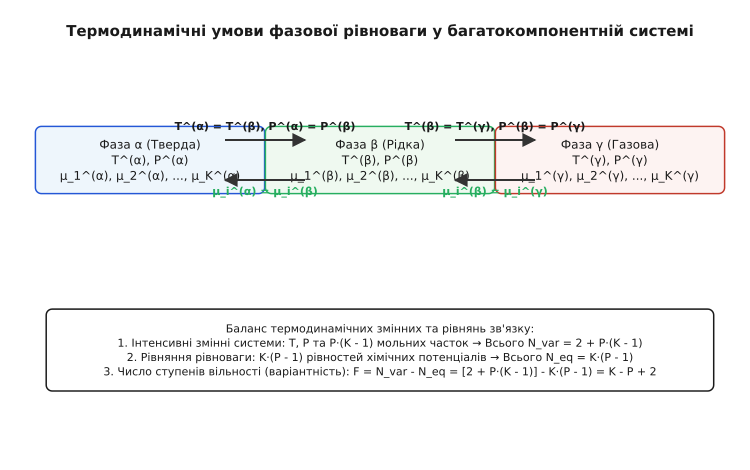
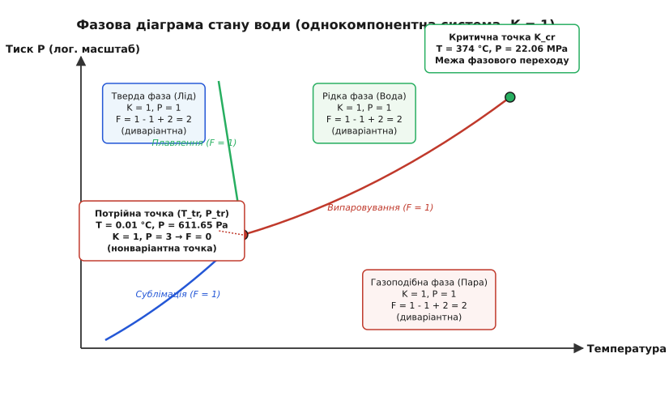
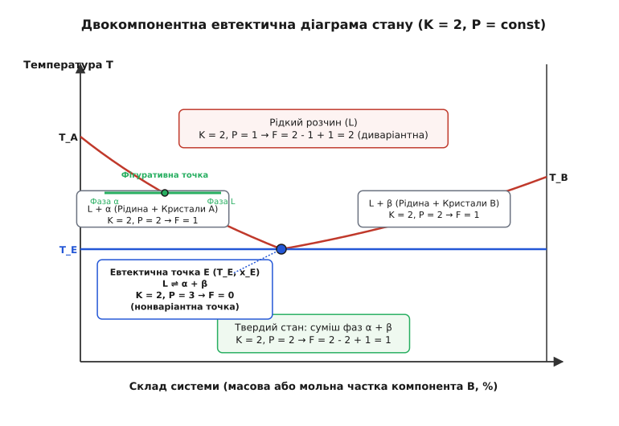

# Правило фаз Гіббса та термодинаміка фазових рівноваг

<preknowlist>
- [Хімічний потенціал](topic:physics/thermodynamics/chemical-potential)
- [Перше та друге начала термодинаміки](topic:physics/thermodynamics/first-second-laws)
- [Термодинамічні потенціали](topic:physics/thermodynamics/thermodynamic-potentials)
</preknowlist>

У промисловому паровому когенераційному котлі при тиску `10 МПа` та температурі `311 °C` співіснують кипляча рідка вода та насичена водяна пара. Доки у посудині залишаються обидві фази, будь-яка спроба підвести додаткову теплоту не збільшує температуру суміші: вся енергія витрачається на фазове перетворення рідкої води у пару, а тиск і температура залишаються строго зафіксованими вздовж моноваріантної кривої насичення. Як тільки остання крапля води випаровується і система стає однофазним перегрітим газом, фіксація температури зникає, і для задання стану котла стає необхідним незалежне вимірювання як тиску, так і температури.

Ця зміна обчислювальної свободи описується фундаментальним термодинамічним співвідношенням — правилом фаз Гіббса. Воно пов'язує кількість співіснуючих фаз, число незалежних хімічних компонентів та число ступенів вільності (варіантність) гетерогенної системи.

## 1. Фундаментальні поняття: фаза, компонент та варіантність

Аналіз гетерогенних фізико-хімічних систем спирається на три базові поняття термодинаміки:

```
[Фаза]       — макроскопічно однорідна частина системи, відокремлена межею поділу
[Компонент]  — хімічно незалежна речовина, необхідна для побудови всіх фаз
[Варіантність] — число інтенсивних змінних, які можна змінювати незалежно
```

### 1.1 Поняття фази та її термодинамічні межі

Фазою називається сукупність усіх однорідних частин гетерогенної системи, які мають однакові фізичні й хімічні властивості, однаковий склад і термодинамічний стан та скачкоподібно відокремлені від інших частин фізичною поверхнею поділу. На цій міжфазній межі відбувається стрибкоподібна зміна густини, мольного об'єму, хімічного складу, термодинамічних потенціалів, оптичного коефіцієнта заломлення або поверхневого електричного потенціалу.

Суміш будь-якої кількості газів завжди утворює одну газову фазу завдяки нескінченній взаємній розчинності газів при помірних тисках. Незмішувані рідини (наприклад, система вода-бензол або ртуть-вода) утворюють дві окремі рідкі фази. Суміш твердих кристалчиків заліза та графіту становить дві окремі тверді фази.

Термодинамічне поняття фази зберігає точність доти, доки розмір просторових областей (кристалітів, крапель, бульбашок) суттєво перевищує радіус дії міжмолекулярних сил (`> 100 нм`). У високодисперсних розчинах, наночастинках та колоїдах надлишкова поверхнева енергія `σ · A` починає суттєво впливати на загальну вільну енергію Гіббса, що вимагає врахування капілярного тиску Лапласа та викривлення міжфазних меж.

### 1.2 Незалежні компоненти Гіббса та хімічна незалежність

Компонентами називаються найменші за кількістю хімічно незалежні складові частини системи, за допомогою мольних мас яких можна сформувати хімічний склад кожної співіснуючої фази системи.

Слід чітко розрізняти загальну кількість хімічних речовин (сполук) `N[spec]` у системі та кількість незалежних компонентів `K`:
- Для нереагуючої системи без хімічних перетворень число компонентів дорівнює числу речовин: `K = N[spec]`. У системі вода-етанол присутні дві речовини і немає хімічних реакцій, тому `K = 2`.
- Для реагуючої системи ранг стехіометричної матриці `R = rank(A)` визначає число незалежних хімічних рівнянь. Кількість компонентів зменшується за співвідношенням `K = N[spec] - R - q`, де `q` — додаткові початкові обмеження складів або умови електронетральності розчинів.

### 1.3 Варіантність (число ступенів вільності)

Варіантністю `F` гетерогенної системи називається кількість термодинамічно незалежних інтенсивних змінних (таких як температура `T`, тиск `P` та мольні частки компонентів у фазах `x[i]`), які можна довільно змінювати у певних межах без зміни кількості та фазового стану співіснуючих фаз.

За значенням варіантності системи класифікують так:
1. **Диваріантні системи (`F = 2`)**: Можна незалежно вибирати як температуру, так і тиск (наприклад, однофазний перегрітий газ або однорідний рідкий розчин).
2. **Моноваріантні системи (`F = 1`)**: Задавши лише одну змінну (наприклад, температуру), тиск та склади фаз визначаються автоматично вздовж лінії фазової рівноваги.
3. **Нонваріантні (інваріантні) системи (`F = 0`)**: Співіснування фаз можливе лише у єдиній строго визначеній точці на діаграмі стану (потрійна точка чистої речовини чи евтектична ізотерма бінарного сплаву).

### 1.4 Вплив зовнішніх полів та розширене правило фаз

Якщо гетерогенна система перебуває під впливом зовнішніх фізичних полів (гравітаційного, електричного чи магнітного) або якщо поверхневі явища чи деформаційні напруження виступають незалежними інтенсивними факторами стану, кількість зовнішніх змінних збільшується.

Узагальнена формула варіантності набирає вигляду:
```
F = K - P + env                            [Узагальнене правило фаз Гіббса]
```
де `env` — кількість інтенсивних параметрів навколишнього середовища. У звичайних умовах, коли система характеризується тільки температурою та тиском, `env = 2`. Для конденсованих систем при постійному тиску (`P = const`) `env = 1`. Якщо ж у системі додатково враховується напруженість зовнішнього електричного поля `E` або поверхневий натяг `σ`, значення `env` зростає до 3 або 4.

Історичний процес побудови цієї теорії від праць Джозаї Вілларда Гіббса до геохімічних досліджень Віктора Гольдшмідта детально описано у матеріалі [Історія відкриття правила фаз Гіббса](topic:physics/gibbs-phase-rule/hist-gibbs-phase-rule.md).

## 2. Термодинамічні умови гетерогенної рівноваги

Розглянемо ізольовану гетерогенну систему, яка складається з `P` фаз та `K` незалежних компонентів.


*Умови термодинамічної, механічної та хімічної рівноваги у багатофазній гетерогенній системі.*

З Другого начала термодинаміки випливає, що у стані термодинамічної рівноваги при постійних температурі `T` та тиску `P` ізольована система досягає мінімуму вільної енергії Гіббса `G = min`. Для будь-якого віртуального нескінченно малого переходу речовини між фазами `δG = 0`.

Для досягнення повної термодинамічної рівноваги мають виконуватися три види рівноваг між усіма співіснуючими фазами:

1. **Термічна рівновага**: Температури всіх співіснуючих фаз повинні бути однаковими:
```
T^(1) = T^(2) = ... = T^(P) = T            [рівність температур фаз]
```
Якщо температура фази 1 вища за температуру фази 2 (`T^(1) > T^(2)`), виникає самодовільний потік теплоти від фази 1 до фази 2.

2. **Механічна рівновага**: За відсутності жорстких півпроникних перегородок або міжфазного поверхневого натягу тиски у всіх фазах мають бути однаковими:
```
P^(1) = P^(2) = ... = P^(P) = P            [рівність тисків фаз]
```
Якщо тиск фази 1 вищий за тиск фази 2 (`P^(1) > P^(2)`), виникає механічна деформація та зсув міжфазної межі у бік фази 2.

3. **Хімічна рівновага**: Хімічний потенціал кожної `i`-ї речовини повинен мати однакове значення у кожній співіснуючій фазі:
```
μ[i]^(1) = μ[i]^(2) = ... = μ[i]^(P) = μ[i]  [рівність хімічних потенціалів]
```
Якщо хімічний потенціал речовини `i` у фазі 1 вищий, ніж у фазі 2 (`μ[i]^(1) > μ[i]^(2)`), виникає спонтанний масоперенос речовини `i` з першої фази у другу до повного вирівнювання хімічних потенціалів.

### 2.1 Критерії термодинамічної стійкості фаз та принцип Ле Шательє-Брауна

Для забезпечення стійкості кожної співіснуючої фази відносно малих внутрішніх флуктуацій повинні виконуватися термодинамічні нерівності стійкості:
- **Термічна стійкість**: Ізобарна теплоємність фази має бути строго додатною (`C[p] > 0`), тобто підведення теплоти завжди збільшує температуру.
- **Механічна стійкість**: Ізотермічна стисливість має бути додатною (`κ[T] = -1/V · (dV/dP)[T] > 0`), тобто підвищення тиску завжди зменшує об'єм.
- **Хімічна стійкість**: Похідна хімічного потенціалу по мольній частці компонента має бути додатною (`(dμ[i]/dx[i])[T,P] > 0`).

При порушенні умов хімічної стійкості однофазний розчин стає абсолютно нестійким і зазнає спінодального розпаду.

## 3. Математичне виведення правила фаз Гіббса

Побудуємо точний алгебраїчний підрахунок кількості незалежних інтенсивних змінних та зв'язуючих рівнянь термодинамічної рівноваги.

### 3.1 Крок 1: Загальна кількість інтенсивних змінних

Стан кожної фази `j` описується її температурою `T^(j)`, тиском `P^(j)` та мольними частками компонентів `x[1]^(j), x[2]^(j), ..., x[K]^(j)`.

Оскільки мольні частки за визначенням задовольняють умову нормування складів:
```
∑ [ x[i]^(j) ] = 1                         [умова нормування мольних часток]
```
то незалежних мольних часток у одній фазі міститься `K - 1`.

Для `P` співіснуючих фаз загальне число інтенсивних змінних складів дорівнює `P · (K - 1)`. Додаючи дві загальні зовнішні змінні (температуру `T` та тиск `P`), отримуємо загальне число інтенсивних змінних системи:
```
N[var] = P · (K - 1) + 2                   [загальне число інтенсивних змінних]
```

### 3.2 Крок 2: Кількість термодинамічних рівнянь зв'язку

Умови рівності хімічних потенціалів дають для кожного з `K` компонентів ланцюжок з `P - 1` незалежних алгебраїчних рівнянь:
```
μ[i]^(1)(T, P, x^(1)) = μ[i]^(2)(T, P, x^(2))
μ[i]^(2)(T, P, x^(2)) = μ[i]^(3)(T, P, x^(3))
...
μ[i]^(P-1)(T, P, x^(P-1)) = μ[i]^(P)(T, P, x^(P))
```

Для `K` незалежних компонентів це дає загальну кількість рівнянь рівноваги:
```
N[eq] = K · (P - 1)                        [загальне число рівнянь рівноваги]
```

### 3.3 Крок 3: Рівняння Гіббса-Дюгема та виведення варіантності

Кожна співіснуюча фаза задовольняє фундаментальне рівняння Гіббса-Дюгема, яке пов'язує диференціали хімічних потенціалів, температури та тиску:

```
S^(j) · dT - V^(j) · dP + ∑ [ N[i]^(j) · dμ[i] ] = 0  [Рівняння Гіббса-Дюгема]
```

Розділивши на загальну мольну кількість речовини у фазі, отримуємо `P` додаткових фундаментальних термодинамічних співвідношень.

Варіантність `F` визначається різницею між числом незалежних змінних та числом зв'язуючих рівнянь:
```
F = N[var] - N[eq]                         [визначення варіантності]

F = [ P · (K - 1) + 2 ] - [ K · (P - 1) ]
F = P · K - P + 2 - K · P + K
F = K - P + 2                              [класичне правило фаз Гіббса]
```

Цей результат становить фундаментальний закон термодинаміки гетерогенних систем:

```
F = K - P + 2                              [Правило фаз Гіббса]
```

Оскільки число ступенів вільності не може бути від'ємним (`F >= 0`), з правила фаз випливає важливе обмеження на максимальну кількість співіснуючих фаз:
```
P <= K + 2                                 [максимальна кількість фаз]
```
У однокомпонентній системі (`K = 1`) не може співіснувати більше ніж 3 фази. У бінарній системі (`K = 2`) не може співіснувати більше ніж 4 фази.

### 3.4 Геометричний зміст варіантності та розмірність фазових елементів

З математичної точки зору варіантність `F` визначає геометричну розмірність множини термодинамічних станів у багатовимірному просторі інтенсивних змінних:
- `F = 2`: Область фазової рівноваги утворює двовимірну поверхню або об'ємний 2D-симплекс у 2D/3D діаграмі.
- `F = 1`: Лінія фазової рівноваги становить одновимірну криву (1D-лінію).
- `F = 0`: Нонваріантний стан відповідає нульвимірній точці (0D-точки стику).

Детальні математичні кроки виведення, співвідношення Гіббса-Дюгема та аналіз термодинамічних матриць наведено у матеріалі [Строге математичне виведення правила фаз](topic:physics/gibbs-phase-rule/math-gibbs-phase-derivation.md).

## 4. Однокомпонентні системи (`K = 1`)

Для системи з однієї чистої речовини (наприклад, води `H2O` або сірки `S`) правило фаз набуває вигляду `F = 1 - P + 2 = 3 - P`.


*Діаграма стану однокомпонентної системи води у координатах тиск — температура.*

Розглянемо фазові області діаграми стану води:

### 4.1 Однофазні області (`P = 1`)

У внутрішній частині площинних областей існування льоду, рідкої води або пари число фаз дорівнює `P = 1`.

Варіантність системи:
```
F = 3 - 1 = 2 (диваріантна область)
```
Це означає, що у межах цієї області можна незалежно вибирати як температуру `T`, так і тиск `P`. Точка стану системи може вільно переміщатися по двох координатах поверхні без зміни однофазного стану.

### 4.2 Двофазні лінії рівноваги (`P = 2`) та рівняння Клапейрона-Клаузіуса

На лініях випаровування (рідка вода ⇌ пара), плавлення (лід ⇌ рідка вода) та сублімації (лід ⇌ пара) співіснують дві фази (`P = 2`).

Варіантність системи:
```
F = 3 - 2 = 1 (моноваріантна лінія)
```
Задавши певну температуру `T`, тиск насиченої пари `P` визначається однозначно рівнянням Клапейрона-Клаузіуса:

```
dP / dT = ΔH[vap] / (T · ΔV)              [Рівняння Клапейрона-Клаузіуса]
```

Система має лише один ступінь вільності, а точка стану може рухатися лише вздовж відповідної лінії.

Нахил лінії плавлення льоду на діаграмі води є від'ємним (`dP/dT < 0`), що є термодинамічною аномалією води: мольний об'єм льоду більший за мольний об'єм рідкої води (`V[ice] > V[water]`). Підвищення тиску знижує температуру плавлення льоду.

### 4.3 Потрійна точка (`P = 3`)

У потрійній точці води (`T = 0.01 °C = 273.16 K`, `P = 611.65 Па`) співіснують одночасно три фази: лід, рідка вода та пара (`P = 3`).

Варіантність системи:
```
F = 3 - 3 = 0 (нонваріантна точка)
```
Система не має жодного ступеня вільності. Ні температура, ні тиск не можуть бути змінені без зникнення однієї з фаз. При підведенні або відведенні теплоти відбувається лише зміна відносних масових часток фаз при строго постійних `T` і `P`.

### 4.4 Поліморфізм сірки, льоду та надкритичний стан

Для елементарної сірки (`S`) мікроструктурний аналіз виявляє дві тверді поліморфні модифікації: ромбічну сірку `S[α]` та моноклінну сірку `S[β]`. 

У такій системі виникають чотири можливі фази: `S[α]`, `S[β]`, рідка сірка `S[L]` та парова фаза `S[V]`. Оскільки для `K = 1` максимальне число фаз дорівнює `P[max] = 3`, усі чотири фази не можуть співіснувати в одній точці. На діаграмі сірки виникають три окремі потрійні точки (`F = 0`), кожна з яких описує співіснування трьох відповідних фаз.

У високих тисках лід виявляє понад 19 кристалічних модифікацій (лід I, II, III, V, VI, VII, VIII, IX, X тощо). Кожна межа між двома твердими фазами є моноваріантною лінією (`F = 1`), а точки стику трьох модифікацій — нонваріантними потрійними точками (`F = 0`).

Лінія випаровування рідкої води завершується у критичній точці (`T[c] = 373.95 °C`, `P[c] = 22.06 МПа`). Вище критичної точки зникає фізична межа поділу між рідиною та парою, густини обох фаз стають рівними, і речовина переходить у стан однофазного надкритичного флюїду (`P = 1`, `F = 2`).

## 5. Двокомпонентні (бінарні) системи (`K = 2`)

У бінарних системах (`K = 2`, наприклад, сплави `Fe-C`, `Pb-Sn` або водно-сольові розчини `вода-соль`) правило фаз набуває вигляду `F = 2 - P + 2 = 4 - P`.

Якщо тиск у системі зафіксовано (наприклад, при відкритому атмосферному плавленні `P = 1 атм`), число зовнішніх параметрів зменшується на одиницю. Приведене правило фаз для конденсованих систем визначається формулою:

```
F[cond] = K - P + 1                        [Приведене правило фаз]
```


*Діаграма стану двокомпонентної евтектичної системи A-B при постійному тиску.*

### 5.1 Аналіз фазових областей евтектичної діаграми

Розглянемо бінарну систему з компонентами `A` та `B`, які повністю розчинні у рідкому стані і нерозчинні у твердому стані:

1. **Однофазний рідкий розчин `L` (`P = 1`)**:
```
F[cond] = 2 - 1 + 1 = 2 (диваріантна область)
```
Необхідно задати дві змінні: температуру `T` та концентрацію металу `x[B]`.

2. **Двофазні області `L + A(s)` та `L + B(s)` (`P = 2`)**:
```
F[cond] = 2 - 2 + 1 = 1 (моноваріантна область)
```
Задавши температуру `T`, рівноважний склад рідкого розчину `x[L]` визначається лінією ліквідусу.

3. **Трифазна евтектична горизонталь (`P = 3`)**:
На лінії евтектичної температури `T[E]` співіснують три фази: рідкий розчин складу `E`, тверді кристали `A` та тверді кристали `B`.
```
F[cond] = 2 - 3 + 1 = 0 (нонваріантна точка)
```
Кристалізація евтектичного сплаву перебігає при суворо постійній температурі `T[E]` та постійних складах усіх трьох фаз до повного затвердіння рідкої фази. На кривій охолодження сплаву виникає площадка постійної температури (температурна затримка).

### 5.2 Інші типи нонваріантних бінарних рівноваг: перитектика та евтектоїд

Окрім евтектичного перетворення, у бінарних металевих та мінеральних системах виникають інші нонваріантні ізотермічні перетворення:

1. **Перитектична рівновага (`L + α ⇌ β`)**:
При перитектичній температурі рідка фаза `L` взаємодіє з раніше викристалізованою твердою фазою `α` з утворенням нової твердої фази `β`. У системі співіснують 3 фази (`P = 3`), тому `F[cond] = 0`. Така рівновага спостерігається у сталях при `1495 °C` (`L + δ-Fe ⇌ γ-Fe`).

2. **Евтектоїдна рівновага (`γ ⇌ α + Fe3C`)**:
Відбувається повністю у твердому стані: тверда фаза `γ` (аустеніт) при охолодженні розпадається на високодисперсну суміш двох нових твердих фаз `α` (феррит) та `Fe3C` (цементит). При `727 °C` у сталях співіснують 3 тверді фази (`P = 3`, `F[cond] = 0`).

3. **Монотективна рівновага (`L1 ⇌ L2 + α`)**:
Рідка фаза `L1` при охолодженні розпадається на нову рідку фазу `L2` іншого складу та тверду фазу `α`.

### 5.3 Зонна плавка та фракційна кристалізація

Залежність складів рідкої та твердої фаз у моноваріантній двофазній області `L + S` виражається коефіцієнтом розподілу домішки `k[d] = x[S] / x[L]`.

У технології вирощування монокристалів кремнію надвисокої чистоти для напівпровідникової мікроелектроніки використовується метод зонної плавки. Оскільки `k[d] < 1`, домішки переважно залишаються у рухомій рідкій зоні плавлення, що дозволяє очищувати кремній до рівня 99.9999999% чистоти на основі керованого зсуву фазової рівноваги.

### 5.4 Правило важеля (Lever Rule) та побудова конод

У будь-якій двофазній області розрахунок відносних масових часток співіснуючих фаз виконується за допомогою геометричного правила важеля:

```
w[L] = (x[B]^(0) - x[B]^(α)) / (x[B]^(L) - x[B]^(α))   [масова частка рідини]

w[α] = (x[B]^(L) - x[B]^(0)) / (x[B]^(L) - x[B]^(α))   [масова частка твердої фази]
```

Точка валового складу `x[B]^(0)` слугує опорною точкою коноди (ізотермічного відрізка tie-line), а довжини протилежних плечей важеля пропорційні масам відповідних фаз.

### 5.5 Термічний аналіз та криві охолодження

У практичній металургії побудова фазових діаграм виконується методом термічного аналізу. При охолодженні рідкого сплаву записується залежність температури від часу `T(t)`:
- У диваріантній однофазній області (`L`, `F[cond] = 2`) крива охолодження показує монотонне зниження температури.
- При перетині лінії ліквідусу та переході у двофазну область (`L + S`, `F[cond] = 1`) на кривій виникає злам (зміна нахилу) через виділення прихованої теплоти кристалізації.
- При досягненні нонваріантного евтектичного горизонту (`F[cond] = 0`) крива охолодження зупиняється на горизонтальну площадку (`T = const`) до повного затвердіння сплаву.

### 5.6 Спінодальний розпад та обмежена розчинність рідин

У системах з обмеженою розчинністю компонентів у рідкому або твердому стані (наприклад, суміш фенол-вода або сплави `Cu-Ni-Fe`) виникає купоподібна область розшарування (бінодаль).

Усередині бінодалі виділяється крива спінодалі, на якій друга похідна вільної енергії Гіббса дорівнює нулю (`d2G/dx2 = 0`):
- У метастійкій області між бінодаллю та спінодаллю розшарування перебігає через механізм зарошування та росту кристалів.
- Усередині спінодалі відбувається спінодальний розпад — спонтанне безбар'єрне розшарування фаз за рахунок висхідної дифузії проти градієнта концентрації.

### 5.7 Взаємна розчинність у твердому стані: впорядковані фази

У багатьох металевих сплавах при зниженні температури відбувається перехід від хаотичного твердого розчину до впорядкованої надструктури (фазовий перехід порядок-безладок, наприклад у сплавах `CuAu` та `Cu3Au`). Ці перетворення описуються фазовими діаграмами з точки Кюрі та супроводжуються скачкоподібною зміною теплоємності й електричного опору.

## 6. Трикомпонентні (потрійні) системи (`K = 3`)

Для трикомпонентних систем (`K = 3`, наприклад, геологічні системи `SiO2 - Al2O3 - CaO` чи водно-сольові розчини `H2O - NaCl - KCl`) приведене правило фаз при `P = const` дорівнює:
```
F[cond] = 3 - P + 1 = 4 - P
```

Максимальне число співіснуючих фаз у нонваріантній точці (`F[cond] = 0`) дорівнює `P = 4` (наприклад, рідка фаза та три твердих кристалогідрати).

Склад трикомпонентної системи зображується усередині рівностороннього трикутника Гіббса-Розебома. Кожна вершина відповідає чистому компоненту (100%), сторони — двокомпонентним системам, а внутрішні точки — трикомпонентним складам.

Геометричні властивості трикутника Гіббса:
- Сума перпендикулярних відстаней від будь-якої внутрішньої точки до трьох сторін дорівнює висоті трикутника (100%).
- Лінії, паралельні одній зі сторін трикутника, є лініями постійної концентрації відповідного компонента.
- Промені, що виходять з вершини, описують системи з постійним співвідношенням двох інших компонентів.

У трьохфазній області потрійної системи (`P = 3`) при `P = const` варіантність `F[cond] = 4 - 3 = 1`. Склади всіх трьох співіснуючих фаз утворюють вершини конформного конодного трикутника (tie-triangle), який переміщується у межах потрійної діаграми при зміні температури.

### 6.2 Ізотермічні перерізи та псевдобінарні ізоплети

Для аналізу трикомпонентних діаграм стану застосовують два методи перерізів:
1. **Ізотермічні перерізи**: Фіксується температура `T = const`, і діаграма зображує фазові області у координатах трикутника Гіббса.
2. **Ізоплети (псевдобінарні перерізи)**: Фіксується постійне співвідношення двох компонентів або переріз між двома складними хімічними сполуками (наприклад, переріз `Fe3C - FeSi` у системі `Fe - C - Si`).

## 7. Реагуючі системи та ранг стехіометричної матриці

Якщо між сполуками гетерогенної системи перебігають хімічні реакції, компоненти Гіббса не збігаються з числом речовин.

Нехай у системі є `N[spec]` хімічних речовин, між якими перебігають `R[tot]` хімічних реакцій. Запишемо стехіометричну матрицю `A` розміром `R[tot] × N[spec]`, у якій коефіцієнти реагентів від'ємні, а продуктів — додатні.

Загальне правило фаз для реагуючих систем набирає узагальненого вигляду:

```
F = (N[spec] - R - q) - P + 2              [Правило фаз для реагуючих систем]
```

де:
- `R = rank(A)` — ранг стехіометричної матриці (кількість лінійно незалежних хімічних реакцій);
- `q` — кількість додаткових початкових обмежень складів (наприклад, рівність вихідних мольних часток `x[N2] : x[H2] = 1 : 3` чи умова електронетральності розчину `∑ z[i] · C[i] = 0`).

### Чотири практичні приклади розрахунку реагуючих систем

1. **Термічний розклад карбонату кальцію (`CaCO3(s) ⇌ CaO(s) + CO2(g)`)**:
   - Кількість речовин: `N[spec] = 3` (`CaCO3`, `CaO`, `CO2`).
   - Перебігає одна хімічна реакція: `R = 1`.
   - Кількість компонентів Гіббса: `K = 3 - 1 = 2` (компоненти `CaO` та `CO2`).
   - Число співіснуючих фаз: `P = 3` (дві тверді фази `CaCO3` та `CaO`, одна газова фаза `CO2`).
   - Варіантність: `F = 2 - 3 + 2 = 1` (моноваріантна система). Тиск дисоціації `P[CO2]` залежить тільки від температури.

2. **Сублімація хлориду амонію (`NH4Cl(s) ⇌ NH3(g) + HCl(g)`)**:
   - Речовини `N[spec] = 3` (`NH4Cl`, `NH3`, `HCl`), `R = 1`.
   - Початкове стехіометричне обмеження: `x[NH3] = x[HCl]` у газовій фазі (`q = 1`).
   - Кількість компонентів: `K = 3 - 1 - 1 = 1` (чистий `NH4Cl`).
   - При двох фазах (`P = 2`: твердий `NH4Cl` та газова суміш) варіантність `F = 1 - 2 + 2 = 1`.

3. **Паровий реформінг метану**:
   - Присутні 5 газів (`CH4`, `H2O`, `CO`, `CO2`, `H2`) та 2 незалежні реакції (`R = 2`).
   - Компоненти `K = 5 - 2 = 3` (`C`, `H`, `O`). При однофазному газовому стані (`P = 1`) варіантність `F = 3 - 1 + 2 = 4`.

4. **Розчин електроліту `NaCl` у воді**:
   - Присутні іони `Na⁺`, `Cl⁻`, `H⁺`, `OH⁻`, молекули `H2O`.
   - Реакція автопротолізу води `H2O ⇌ H⁺ + OH⁻` (`R = 1`).
   - Обмеження електронетральності `[Na⁺] + [H⁺] = [Cl⁻] + [OH⁻]` та рівності `[Na⁺] = [Cl⁻]` (`q = 2`).
   - Число компонентів Гіббса `K = 5 - 1 - 2 = 2` (вода та сіль `NaCl`).

Приклад розрахунку алгоритму зведення матриці та практичні комп'ютерні симуляції наведено у матеріалі [Практична реалізація алгоритму обчислення варіантності](topic:physics/gibbs-phase-rule/proj-phase-diagram-solver.md).

## 8. Прикладні застосування та крайові випадки

Правило фаз Гіббса слугує фундаментальним інструментом у матеріалознавстві, металургії, геології та хімічній інженерії.

### 8.1 Металургія та термообробка сталей

У діаграмі стану залізо-вуглець (`Fe-C`) правило фаз точно описує фазові перетворення у сталях та чавунах:
- При евтектичній температурі `1148 °C` співіснують рідкий чавун, аустеніт та цементит (`P = 3`, `F[cond] = 2 - 3 + 1 = 0`).
- При евтектоїдній температурі `727 °C` відбудеться розпад аустеніту на суміш ферриту та цементиту (перліт) при строго фіксованій температурі.

### 8.2 Мінералогічне правило фаз Гольдшмідта

Австрійський геохімік Віктор Гольдшмідт сформулював спрощене правило фаз для гірських порід, що утворилися у земній корі:
```
P <= K                                     [Мінералогічне правило фаз Гольдшмідта]
```
У природних метаморфічних умовах температура та тиск змінюються незалежно (`F >= 2`). З правила фаз `F = K - P + 2 >= 2` випливає, що число співіснуючих мінералів у поріді не може перевищувати кількості незалежних компонентів `K`.

### 8.3 Нафтохімія та азеотропна ректифікація

У процесах розділення азеотропних сумішей (наприклад, етанол-вода з вмістом 95.6% спирту) виникає екстремум на кривій тиску пари. В азеотропній точці склади рідкої та парової фаз повністю збігаються (`x[V] = x[L]`), що накладає додаткове зв'язуюче обмеження.

Внаслідок цього бінарна азеотропна система при двофазній рівновазі втрачає один ступінь вільності (`F = 2 - 2 + 2 - 1 = 1`), і кипіння азеотропу відбувається при строго постійній температурі, аналогічно чистому однокомпонентному чиннику. Для розділення таких сумішей застосовують азеотропну ректифікацію із додаванням третього компонента (розділюючого агента циклогексану) або розділення при підвищеному тиску.

### 8.4 Фармацевтична термодинаміка та поліморфізм ліків

У фармацевтичній технології активні лікарські речовини (API — Active Pharmaceutical Ingredients) здатні викристалізовуватись у різних поліморфних модифікаціях (наприклад, противірусний препарат Ритонавір має метастійку Форму I та термодинамічно стійку Форму II).

Оскільки метастійка форма володіє вищим хімічним потенціалом `μ[meta] > μ[stable]`, її розчинність та швидкість всмоктування у шлунково-кишковому тракті суттєво більша. За допомогою приведеного правила фаз розраховуються інтервали температурної стійкості поліморфів та евтектичні умови утворення сумішей для транпостачання ліків крізь шкіру.

### 8.5 Астрофізика та кріогенна термодинаміка крижаних супутників

У планетології та астрофізиці правило фаз застосовується для моделювання внутрішньої будови крижаних супутників Юпітера та Сатурна (Енцелада, Європи, Ганімеда):
- У підповерхневому океані Європи під тиском колосальних льодовикових товщ (`P > 100 МПа`) співіснують підповерхнева солона вода, лід I та вищі модифікації льоду (лід V, VI).
- На поверхні Тітана співіснують рідкі метан-етанові озера та газова азотно-метанова атмосфера, де моноваріантний стан `F = 1` регулює кругообіг вуглеводневих дощів та випаровування при температурі `-179 °C`.

### 8.6 Кристалізація солей та літієва інженерія

У технологіях видобутку літію з високоминералізованої ропи солончаків (наприклад, солончак Уюні в Болівії) аналіз фазових рівноваг багатокомпонентних водно-сольових систем `Li⁺, Na⁺, K⁺, Mg²⁺ || Cl⁻, SO4²⁻ - H2O` регулює послідовність фракційного осадження галіту, сильвіну та карбонату літію. Правило фаз Гіббса визначає оптимальні сезонні температурні точки для максимізації виходу акумуляторного сорту карбонату літію `Li2CO3`.

### 8.7 Застосування у суперкритичній флюїдній екстракції

Суперкритична екстракція вуглекислотою (`scCO2`, `T[c] = 31.1 °C`, `P[c] = 7.38 МПа`) широко використовується у харчовій та фармацевтичній промисловості для декофеїнізації кави та виділення ефірних олій. Поблизу критичної точки розчинність сполук у флюїді скачкоподібно змінюється навіть при незначному зміщенні тиску на `0.1 МПа`. Аналіз варіантності за правилом фаз забезпечує точне програмування циклів виділення та регенерації екстрагенту у трифазному сепараторі.

### 8.8 Термодинаміка надпровідних фазових переходів

У фізиці конденсованого стану перехід металу або кераміки у надпровідний стан описується як фазовий перехід другого роду. На фазовій діаграмі у координатах `H - T` (магнітне поле — температура) межа між нормальним та надпровідним станом утворює моноваріантну лінію `H[c](T)`. На цій кривій співіснують нормальна та надпровідна електронні фази при відсутності прихованої теплоти перетворення, що описується фундаментальними рівняннями Рутгерса та законами термодинаміки фазових рівноваг Гіббса.

Для високотемпературних надпровідників на основі купратів (`YBa2Cu3O[7-x]`) фазовий стан додатково залежить від вмісту кисню `x`, тому варіантність надпровідного стану описується розширеним бінарним правилом фаз.

Детальний довідник програмного коду для розрахунку гетерогенних рівноваг наведено у матеріалі [Довідник програмного інтерфейсу розрахунку фазових рівноваг](topic:physics/gibbs-phase-rule/api-phase-rule-calc.md).
