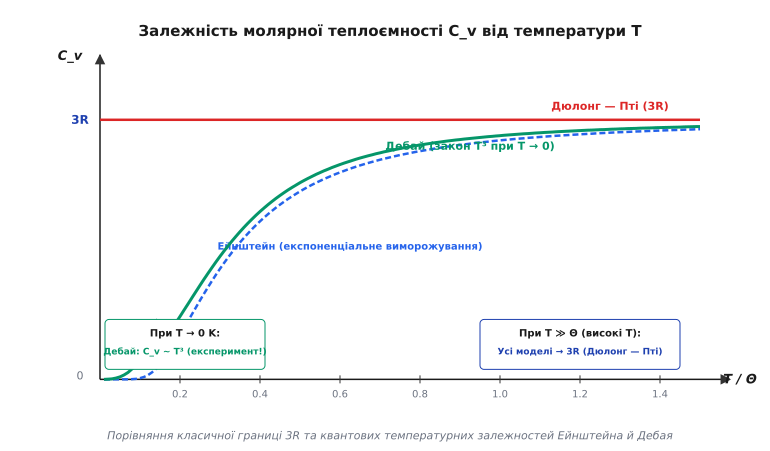
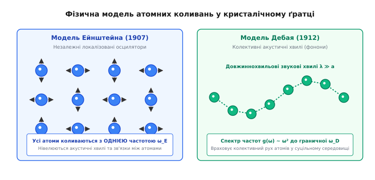
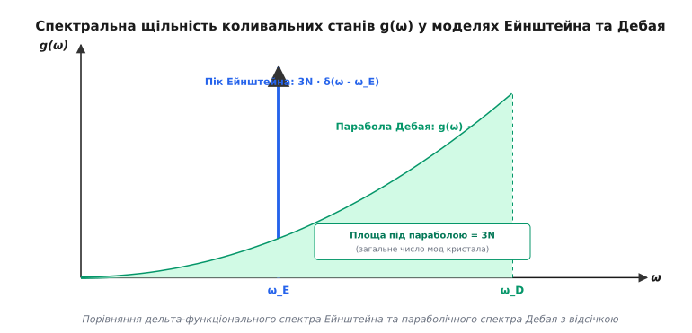

# Закон Дюлонга — Пті та квантова теорія теплоємності Ейнштейна — Дебая

<preknowlist>
- [Перший закон термодинаміки](topic:physics/first-law-thermodynamics) — зв'язок між внутрішньою енергією, теплотою та виконаною роботою.
- [Теорема рівнорозподілу енергії](topic:physics/equipartition-theorem) — класичний розподіл енергії по 1/2 k_B T на кожен квадратичний ступінь вільності.
- [Теплоємність](topic:physics/heat-capacity) — визначення питомої та молярної теплоємностей при постійному об'ємі C_v та тиску C_p.
</preknowlist>

Коли одинаковий за масою та кількістю речовини шматок свинцю та алмазу поглинають однакову кількість теплової енергії за кімнатної температури, їхня температура змінюється кардинально по-різному. Для нагрівання одного моля свинцю на один градус Кельвіна потрібно приблизно `26.4 Дж` енергії, тоді як один моль алмазу вимагає лише `6.1 Дж`. Проте якщо нагріти свинець та алмаз до високих температур, енергія, необхідна для підвищення температури на один градус, для обох речовин стає практично однаковою — близько `24.9 Дж/(моль·К)`. З іншого боку, якщо охолодити обидві речовини до кріогенного абсолютного нуля, здатність накопичувати теплове рушення в обох кристалах зникає повністю.

Цей фізичний феномен відображає фундаментальну еволюцію наших уявлень про будову речовини: від класичного закону рівнорозподілу енергії Дюлонга — Пті до квантових моделей Ейнштейна та Дебая.

## Класичний закон Дюлонга — Пті: рівнорозподіл у кристалічній ґратці

У класичній статистичній фізиці просте тверде тіло розглядається як регулярна тривимірна кристалічна ґратка, у вузлах якої розташовані однакові атоми масою `m`. Кожен атом утримується у своєму положенні рівноваги пружними міжатомними силами взаємодії із сусідніми атомами. При підвищенні температури атоми починають здійснювати малі хаотичні коливання навколо положень рівноваги.

У гармонічному наближенні потенціальну енергію взаємодії атомів розкладають у степеневий Тейлорівський ряд за зміщеннями атомів біля мінімуму потенціальної ями. Нехтуючи членами вищих порядків (кубічними та четвертичними), міжатомний потенціал вважають строго квадратичним щодо зміщення. Це означає, що невеликий тепловий рух кожного атома у тривимірному просторі розпадається на три незалежні ортогональні гармонічні коливання уздовж декартових осей `x`, `y` та `z`.

Отже, кристалічна ґратка з `N` атомів еквівалентна закритій динамічній системі з `3N` незалежних одновимірних класичних гармонічних осциляторів. Гамільтоніан одного такого осцилятора має вигляд:

```
H_1 = p² / (2m) + (1/2) m ω² x²
```

де `p` — механічний імпульс атома, `x` — його зміщення з положення рівноваги, а `ω` — власна колова частота коливань.

Вираз для Гамільтоніана містить точно два квадратичні члени: один для кінетичної енергії `p² / (2m)` і один для потенціальної енергії `(1/2) m ω² x²`. Взаємодію системи з термостатом описують канонічним розподілом Гіббса за фазовим простором імпульсів та координат `dΓ = dp dx`:

```
ρ(p, x) = (1 / Z_1) · exp(-H_1 / (k_B T))
```

Згідно з класичною теоремою Больцмана про рівнорозподіл енергії за ступенями вільності, у стані термодинамічної рівноваги за температури `T` на кожен квадратичний член у виразі Гамільтоніана припадає середня теплова енергія `(1/2) k_B T`, де `k_B ≈ 1.3806 × 10⁻²³ Дж/К` — стала Больцмана (нім. *Boltzmann Constant*).

Звідси випливає, що середня енергія одного тривимірного атомного осцилятора становить:

```
<E_1> = 3 · [ (1/2) k_B T + (1/2) k_B T ] = 3 k_B T
```

Половина цієї енергії припадає на кінетичний рух атомів, а друга половина — на потенціальну енергію стиску та розтягування міжатомних пружних зв'язків. У цьому полягає фундаментальна відмінність твердого тіла від одноатомного ідеального газу: в ідеальному газі потенціальна взаємодія між молекулами відсутня, тому молярна теплоємність газу становить лише `(3/2) R`, тоді як у кристалі наявність потенціальної енергії подвоює це значення до `3R`.

Для одного моля речовини, що містить число Авогадро `N_A ≈ 6.022 × 10²³` атомів, повна внутрішня енергія кристалічної ґратки `U` дорівнює:

```
U = 3 N_A k_B T = 3 R T
```

де `R = N_A k_B ≈ 8.314 Дж/(моль·К)` — універсальна газова стала.

Молярна теплоємність при постійному об'ємі `C_v` визначається як швидкість зміни внутрішньої енергії при зміні температури:

```
C_v = (∂U / ∂T)_V = ∂ / ∂T [ 3 R T ] = 3 R ≈ 24.94 Дж/(моль·К)
```

Цей результат становить зміст **закону Дюлонга — Пті** (установленого емпірично французькими вченими П'єром Дюлонгом та Алексісом Пті у 1819 році): молярна теплоємність усіх простих кристалічних твердих тіл є універсальною константою `3R`, незалежною ані від температури, ані від хімічної природи елемента. детальний історичний шлях від емпіричних вимірювань XIX століття до квантового перевороту описано у вставці [Історія відкриття закону Дюлонга — Пті та розвиток квантових концепцій](topic:physics/heat-capacity-dulong-petit/hist-dulong-einstein.md).


*Залежність молярної теплоємності C_v від температури T у класиційній моделі Дюлонга — Пті (3R) та квантових моделях Ейнштейна й Дебая*

### Геометрична розмірність ґратки та розширення закону

Закон Дюлонга — Пті у формі `C_v = 3R` строго прив'язаний до тривимірного простору (`d = 3`). Якщо розглянути низьковимірні структури:
- **Двовимірний кристал (наприклад, окремий шар графену)**: атом має 2 вільності для поздовжніх коливань у площині та 1 для вигинистих коливань. Класичний граничний внесок становить `C_v = 2R` або `3R` залежно від урахування позаплощинних мод.
- **Одновимірний атомний ланцюжок**: має лише один напрямок коливань, тому класична молярна теплоємність дорівнює `C_v = 1R`.

### Термодинамічна різниця між `C_p` та `C_v`

У лабораторних експериментах вимірюють теплоємність при постійному тиску `C_p`, оскільки утримувати об'єм твердого тіла строго незмінним при нагріванні технічно складно через теплове розширення. Закони термодинаміки дають суворий зв'язок між `C_p` та `C_v`:

```
C_p - C_v = (α² · V · T) / B_T
```

де `α = (1/V) (∂V/∂T)_p` — коефіцієнт об'ємного теплового розширення, `V` — молярний об'єм, а `B_T = - (1/V) (∂V/∂p)_T` — ізотермічна стисливість матеріалу.

Для більшості твердих тіл при кімнатній температурі різниця `C_p - C_v` становить лише `2...5%`, тому класичний закон Дюлонга — Пті чудово узгоджується з експериментальними вимірюваннями `C_p` для важких металів (міді, заліза, свинцю, срібла) за нормальних умов.

Однако класичний вивід Дюлонга — Пті містить фундаментальне передбачення: молярна теплоємність мусить залишатися строго рівною `3R` при будь-яких температурах — аж до абсолютного нуля.

## Кріогенна криза класичної фізики

Розвиток кріогенної фізики наприкінці XIX та початку XX століть створив нездоланне протиріччя між класичною теорією та експериментом. Завдяки роботам Джеймса Дьюара, Гейке Камерлінг-Оннеса та Вальтера Нернста вдалося виміряти теплоємність речовин при температурах рідкого водню (`20 K`) та рідкого гелію (`4.2 K`). Для проведення цих вимірювань використовувалися адіабатичні калориметри, у яких зразок ізолювався у глибокому вакуумі, а зміна температури `dT` вимірювалася чутливими термопарами під дією точних електричних імпульсів теплоти `dQ`.

Експериментальні дані категорично спростували класичний закон Дюлонга — Пті:

1. **Загальний спад до нуля**: При охолодженні речовини до абсолютного нуля молярна теплоємність усіх без винятку твердих тіл монотонно зменшується і спрямовується до нуля: `C_v → 0` при `T → 0 K`. Це узгоджується з третім началом термодинаміки (теоремою Нернста).
2. **Кімнатна аномалія легких елементів**: Для елементів із малими атомними масами та високою твердістю (алмаз, берилій, бор, кремній) молярна теплоємність за кімнатної температури `300 K` є значно меншою за `3R`. Наприклад, для алмазу `C_v(300 K) ≈ 6.1 Дж/(моль·К)`, що становить менше `25%` від класичного значення. Для берилію `C_v ≈ 16.4 Дж/(моль·К)`, а для кремнію — `19.9 Дж/(моль·К)`.

З точки зору класичної статистичної механіки спад теплоємності означає «зникнення» або «заморожування» ступенів вільності атомів. У класичній фізиці кожен гармонічний осцилятор здатний поглинати як завгодно малі порції енергії `dE`, оскільки фазовий простір координат та імпульсів є неперервним. Тому класична механіка принципово не має механізму для плавного «вимкнення» атомних коливань при зниженні температури.

Ця суперечність стала одним із головних стимулів для перегляду фундаментальних уявлень про природу механічного руху на атомному рівні.

## Квантова модель Ейнштейна (1907): квантування осциляторів

У 1907 році Альберт Ейнштейн запропонував першу квантову теорію теплоємності твердих тіл, застосувавши гіпотезу Макса Планка про квантування енергії світлового випромінювання до механічних коливань атомів у кристалі.


*Модель Ейнштейна з незалежними монохроматичними осциляторами проти моделі Дебая з колективними звуковими хвилями у кристалічній ґратці*

Ейнштейн прийняв два спрощувальні припущення:
- Кристал складається з `N` атомів, які коливаються як `3N` незалежних квантових гармонічних осциляторів.
- Усі `3N` осциляторів коливаються з однаковою фіксованою характеристичною частотою `ω_E` (частота Ейнштейна).

За квантовою механікою, енергія квантового гармонічного осцилятора не може набувати довільних значень, а є дискретною:

```
E_n = (n + 1/2) ℏ ω_E,    де n = 0, 1, 2, ...
```

де `ℏ = h / (2π)` — зведена стала Планка. Член `(1/2) ℏ ω_E` відповідає **нульовим коливанням** (англ. *Zero-point energy*), які зберігаються навіть при `T = 0 K` через співвідношення невизначеностей Гейзенберга. Оскільки енергія нульових коливань не залежить від температури, вона не бере участі в теплообміні й не дає внеску в теплоємність.

Середня теплова енергія квантового осцилятора у стані термодинамічної рівноваги визначається квазічастинковим розподілом Планка:

```
<E> = ℏ ω_E / (exp(ℏ ω_E / (k_B T)) - 1)
```

Цей вираз математично збігається з середньою енергією фотонів у випромінюванні чорного тіла, оскільки кванти механічних коливань є бозонами з нульовим хімічним потенціалом `μ = 0`.

Внутрішня енергія моля кристала за Ейнштейном становить:

```
U(T) = 3 R Θ_E / (exp(Θ_E / T) - 1)
```

де `Θ_E = ℏ ω_E / k_B` — **температура Ейнштейна**, яка характеризує енергетичний масштаб кванта коливань для даної речовини.

Диференціюючи внутрішню енергію за температурою `C_v = ∂U / ∂T`, отримуємо формулу теплоємності Ейнштейна:

```
C_v = 3 R · (Θ_E / T)² · [ exp(Θ_E / T) / (exp(Θ_E / T) - 1)² ]
```

Строгий математичний вивід усіх проміжних кроків та асимптотик подано у вставці [Математичний вивід моделей Ейнштейна та Дебая](topic:physics/heat-capacity-dulong-petit/math-einstein-debye.md).

### Граничні випадки та аналіз моделі Ейнштейна:

1. **Високі температури (`T ≫ Θ_E`)**:
   Коли теплова енергія набагато більша за квант коливань (`k_B T ≫ ℏ ω_E`), розклад експоненти `exp(Θ_E / T) ≈ 1 + Θ_E / T` дає:

```
C_v ≈ 3 R · (Θ_E / T)² · [ (1 + Θ_E / T) / (Θ_E / T)² ] ≈ 3 R
```

   Модель Ейнштейна естетично й точно відтворює класичний закон Дюлонга — Пті при високих температурах.

2. **Низькі температури (`T ≪ Θ_E`)**:
   Коли `k_B T ≪ ℏ ω_E`, теплової енергії середовища недостатньо для збудження навіть першого квантового рівня `n = 1`. Знаменник розкладу визначається великою експонентою `exp(Θ_E / T) ≫ 1`:

```
C_v ≈ 3 R · (Θ_E / T)² · exp(-Θ_E / T)
```

Теплоємність за Ейнштейном прямує до нуля за експоненціальним законом. Це фізично пояснило явище «виморожування» ступенів вільності: при низьких температурах ймовірність того, що атомний осцилятор отримає порцію енергії `ℏ ω_E`, є експоненціально малою `P_1 / P_0 ≈ exp(-ℏ ω_E / (k_B T))`. Осцилятори залишаються в основному квантовому стані `n = 0` і не беруть участі у поглинанні теплоти.

Модель Ейнштейна також блискуче пояснила аномалію алмазу. Завдяки винятковій жорсткості ковалентних зв'язків C-C частота коливань атомів вуглецю `ω_E` є дуже високою. Відповідно, температура Ейнштейна для алмазу становить `Θ_E ≈ 1450 K`. Оскільки кімнатна температура `300 K` є значно меншою за `1450 K`, за кімнатної температури алмаз знаходиться у глибокому квантовому режимі виморожування мод, що і пояснює його малу теплоємність (`6.1 Дж/(моль·К)`).

Проте модель Ейнштейна містила принциповий недолік: при `T → 0 K` експериментальна теплоємність реальних кристалів спадає до нуля набагато повільніше — за степеневим законом `C_v ~ T³`, а не за експоненціальним законом `exp(-Θ_E / T)`.

## Квантова модель Дебая (1912): фонони та закон кубу температури

У 1912 році Петер Дебай усунув недолік моделі Ейнштейна, відмовившись від припущення про незалежність атомних осциляторів. У реальному кристалі атоми зв'язані міжатомними силами, тому зміщення одного атома передається сусіднім у вигляді пружної хвилі.

Дебай запропонував розглядати теплові коливання кристалічної ґратки як сукупність колективних пружних акустичних хвиль (звукових хвиль), що поширюються у суцільному середовищі зі швидкістю звуку `v`. Кванти цих пружних хвиль називаються **фононами** (грец. *φωνή* — звук).


*Спектральна щільність коливальних станів g(ω): монохроматичний дельта-пік Ейнштейна проти параболічного спектра Дебая з межею відсічки ω_D*

У пружному суцільному середовищі можуть поширюватися дві поперечні акустичні хвилі зі швидкістю `v_T` та одна поздовжня акустична хвиля зі швидкістю `v_L`. Поздовжні хвилі пов'язані з модулем об'ємного стиску `K` та модулем зсуву `G`: `v_L = √((K + 4G/3) / ρ)`, тоді як поперечні хвилі пов'язані лише з модулем зсуву `v_T = √(G / ρ)`. Ефективна середня швидкість звуку `v_m` визначається усередненням за поляризаціями:

```
3 / v_m³ = 1 / v_L³ + 2 / v_T³
```

У тривимірній ґратці кількість акустичних хвиль із частотою від `ω` до `ω + dω` задається параболічною спектральною щільністю станів:

```
g(ω) = (3 V ω²) / (2 π² v_m³)
```

Оскільки кристал складається з скінченного числа атомів `N`, загальна кількість коливальних мод не може перевищувати `3N`. Дебай ввів верхню граничну частоту відсічки — **частоту Дебая** `ω_D`, яка визначається з умови нормування:

```
∫₀^(ω_D) g(ω) dω = 3 N  ⇒  ω_D = v_m · [ (6 π² N) / V ]^(1/3)
```

Характеристична **температура Дебая** становить:

```
Θ_D = ℏ ω_D / k_B
```

Внутрішня енергія кристала обчислюється як інтеграл за всіма частотами фононного спектра від `0` до `ω_D`:

```
U(T) = ∫₀^(ω_D) [ ℏ ω / (exp(ℏ ω / (k_B T)) - 1) ] · [ (9 N ω²) / ω_D³ ] dω
```

Диференціюючи внутрішню енергію за температурою, отримуємо **формулу Дебая для молярної теплоємності**:

```
C_v = 9 R · (T / Θ_D)³ · ∫₀^(Θ_D/T) [ (x⁴ exp(x)) / (exp(x) - 1)² ] dx
```

де `x = ℏ ω / (k_B T)` — безрозмірна частота.

### Закон кубу температури Дебая (`T³`)

При дуже низьких температурах (`T ≪ Θ_D`) верхня межа інтегрування `x_D = Θ_D / T` прямує до нескінченності. Визначений інтеграл стає числовою константою:

```
∫₀^∞ [ (x⁴ exp(x)) / (exp(x) - 1)² ] dx = 4 · ∫₀^∞ [ x³ / (exp(x) - 1) ] dx = 4 · (π⁴ / 15) = (4 π⁴) / 15
```

Підставляючи це значення у вираз для теплоємності, отримуємо знаменитий **закон кубу температури Дебая**:

```
C_v = (12 π⁴ / 5) R · (T / Θ_D)³ ≈ 234.5 R · (T / Θ_D)³
```

Фізична причина закону `T³` полягає у колективній природі фононів. На відміну від моделі Ейнштейна з єдиною частотою `ω_E`, у фононній моделі Дебая завжди присутні низькочастотні (довгохвильові) акустичні фонони з `ω → 0`. Для цих мод квант енергії `ℏ ω` є як завгодно малим, тому вони не виморожуються навіть при кріогенних температурах. Зниження температури зменшує об'єм фазового простору збуджених фононів пропорційно `k³ ~ T³`.

При високих температурах (`T ≫ Θ_D`) модель Дебая, як і модель Ейнштейна, дає класичну границю Дюлонга — Пті: `C_v → 3R`.

Обчислювальний алгоритм, чисельне інтегрування методом Сімпсона та програмні модулі мовами C++ і Python для порівняння всіх трьох моделей наведено у вставці [Чисельне моделювання теплоємності за Ейнштейном та Дебаєм](topic:physics/heat-capacity-dulong-petit/proj-heat-capacity-sim.md).

## Реальні кристали: електронна теплоємність металів та дисперсійні гілки

Модель Дебая є ідеальною для діелектричних кристалів, однако у реальних речовинах виникають додаткові фізичні ефекти:

1. **Електронна теплоємність металів (Теорія Зоммерфельда)**:
   У металевих провідниках поруч із фононами ґратки існує газ вільних електронів. Оскільки електрони підкоряються статистиці Фермі — Дірака з високою енергією Фермі `E_F` (температура Фермі `T_F ~ 10⁴...10⁵ K`), у тепловому русі бере участь лише мала частка електронів порядку `T / T_F`. Це приводить до строго лінійного за температурою внеску в теплоємність:

```
C_el = γ · T
```

   де `γ = (1/3) π² k_B² g(E_F)` — коефіцієнт Зоммерфельда. Загальна теплоємність металу в кріогенному діапазоні становить:

```
C_v = γ · T + A · T³
```

   При температурах нижче `1...4 K` лінійний електронний член `γ T` починає переважати над кубічним фононним членом `A T³`.

2. **Акустичні та оптичні гілки у складних кристалах**:
   Якщо елементарна комірка кристала містить `p > 1` атомів, фононний спектр містить 3 акустичні гілки (описуються моделлю Дебая) та `3p - 3` оптичні гілки (описуються моделлю Ейнштейна). В оптичних гілках сусідні різнойменні атоми комірки коливаються у протифазі, що створює високі частоти з малою дисперсією. Комбінована модель Дебая — Ейнштейна дає точний опис теплоємності складних напівпровідників та оксидів.

3. **Дисперсія Борна — Кармана на межі зони Бріллюена**:
   У дискретній кристалічній ґратці лінійний закон дисперсії `ω = v k` виконується лише для довгих хвиль (`k a ≪ 1`). На межі першої зони Бріллюена (`k = π / a`) закон дисперсії загинається за синусоїдою `ω(k) = 2 (v/a) |sin(k a / 2)|`, що викликає появу так званих особливостей Ван Хова у спектральній щільності станів `g(ω)`.

4. **Аморфні речовини та стекла**:
   В неупорядкованих аморфних тілах та стеклах при наднизьких температурах (`T < 1 K`) теплоємність спадає не за законом кубів `T³`, а лінійно `C_v ~ T`. Це пояснюється наявністю атомарних двоуровневих систем (англ. *Two-Level Systems, TLS*), у яких атоми або їхні групи можуть тунелювати між двома близькими мінімумами конфігураційного потенціалу (модель Філіпса — Андерсона).

Експериментальні значення температур Дебая `Θ_D`, Ейнштейна `Θ_E`, коефіцієнтів Зоммерфельда `γ` та температурних меж застосовності закону Дюлонга — Пті для різних матеріалів зведено у вставці [Довідкові параметри кристалів та температурні межі](topic:physics/heat-capacity-dulong-petit/api-debye-tables.md).

## Порівняльний аналіз трьох моделей теплоємності

Для систематизації знань про класичну та квантову теорії теплоємності твердих тіл зведемо їхні фундаментальні риси у порівняльну таблицю:

| Фізична характеристика | Модель Дюлонга — Пті (1819) | Модель Ейнштейна (1907) | Модель Дебая (1912) |
| :--- | :--- | :--- | :--- |
| **Фізичне уявлення** | Незалежні класичні осцилятори | Незалежні квантові осцилятори | Колективні пружні звукові хвилі (фонони) |
| **Частотний спектр g(ω)** | Неперервна класична енергія | Одночастотний пік 3N·δ(ω - ω_E) | Параболічний спектр ~ ω² до відсічки ω_D |
| **Поведінка при T ≫ Θ** | C_v = 3R (константа) | C_v → 3R | C_v → 3R |
| **Поведінка при T → 0 K** | C_v = 3R (суперечить дослідженню) | C_v ~ exp(-Θ_E / T) (надто швидкий спад) | C_v ~ T³ (точний збіг з експериментом) |
| **Сфера застосування** | Важкі метали при високих T | Наближення для оптичних фононів | Звукові акустичні фонони в кристалах |

Як видно з порівняння, кожна наступна модель розширювала межі нашого розуміння фізики твердого тіла, зберігаючи попередню теорію як відповідний граничний випадок.

## Ангармонізм та теплове розширення при високих температурах

При підвищенні температури вище температури Дебая (`T > Θ_D`) молярна теплоємність реальних матеріалів починає повільно зростати, перевищуючи класичну границю Дюлонга — Пті `3R`. Цей ефект не є суперечністю з квантовою теорією, а виникає внаслідок відхилення міжатомної взаємодії від ідеального гармонічного потенціалу.

У реальному кристалі потенціальна енергія міжатомного зв'язку має асиметричну форму (наприклад, потенціал Леннард-Джонса або Морзе). При великих амплітудах теплових коливань стають відчутними кубічні та четвертичні члени розкладу потенціалу — це явище називається **ангармонізмом коливань**.

Ангармонізм приводить до двох основних наслідків:
1. **Теплове розширення ґратки**: середня відстань між атомами зростає з температурою, що зменшує жорсткість зв'язків та знижує ефективні частоти коливань.
2. **Прямий ангармонічний внесок у теплоємність**: дає додатковий поправковий член, пропорційний першому степеню температури: `C_v = 3R (1 + α_A T)`.

Крім того, при температурах, близьких до точки плавлення кристала, починає відігравати роль термічна генерація точкових дефектів (вакансій за Шотткі та дефектів міжвузлів за Френкелем). Утворення кожної вакансії вимагає енергії утворення `E_v`, що дає додатковий експоненціальний внесок у теплоємність `C_vac ~ exp(-E_v / (k_B T))`.

> 🔧 **Навіщо це.** Знання меж застосовності закону Дюлонга — Пті та фононних моделей Дебая — Ейнштейна є критичним для теплового розрахунку сучасних електронних пристроїв, кріогенних систем та космічних апаратів. При проектуванні напівпровідникових чипів (Si, GaAs), силової кераміки (SiC, Al2O3) чи надпровідних магнітів використання класичної константи `3R` замість квантового закону Дебая приведе до катастрофічних помилок у розрахунку теплопровідності та охолодження пристроїв.
