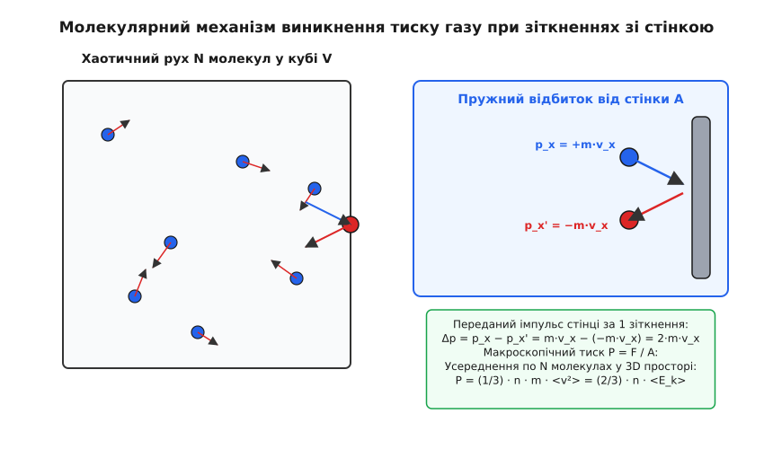
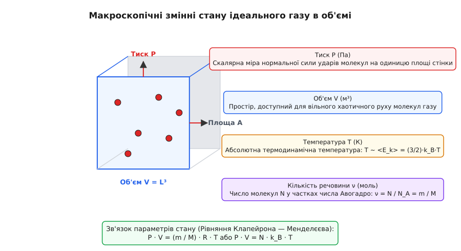
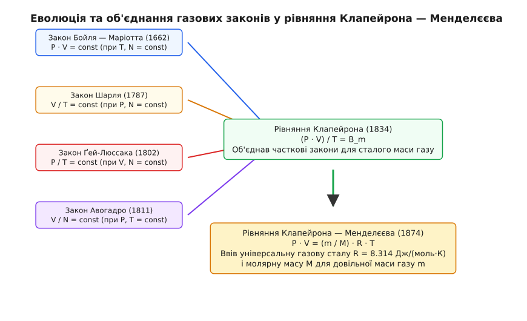
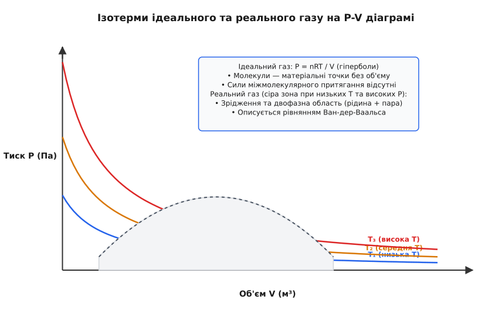

# Рівняння стану ідеального газу Клапейрона — Менделєєва

<preknowlist>
- [Тиск](topic:physics/pressure) — скалярна фізична величина, що визначається відношенням нормальної сили до площі поверхні.
- [Кінетична енергія](topic:physics/kinetic-energy) — енергія механічного руху тіла `E_k = m · v² / 2`.
- [Імпульс](topic:physics/momentum) — векторна міра механічного руху `p = m · v` та закон його збереження при зіткненнях.
- [Ступені вільності](topic:physics/degrees-of-freedom) — кількість незалежних координат, необхідних для повного опису стану системи.
</preknowlist>

Коли повітря стискається впорскуванням у велосипедний насос, воно помітно нагрівається, а тиск усередині циліндра стрімко зростає. Спроба стиснути газ у закритій судині за сталої температури вимагає пропорційного збільшення зовнішнього зусилля, тоді як нагрівання газу в жорсткому замкненому баку призводить до зростання сили його тиску на стінки. Усі ці макроскопічні явища обумовлені єдиною фізичною причиною — хаотичним тепловим рухом мільярдів молекул, які безперервно бомбардують навколишні поверхні. Рівняння стану ідеального газу Клапейрона — Менделєєва дає точний математичний зв'язок між тиском, об'ємом, температурою та масою речовини, поєднуючи мікроскопічну динаміку частинок із практичними термодинамічними процесами.

## 1. Фізична сутність та модель ідеального газу

Для опису газоподібного стану речовини у термодинаміці використовують фізичну модель — **ідеальний газ**. Реальні гази (азот, кисень, гелій) складаються з молекул складної форми, які мають скінченні розміри та взаємодіють між собою міжмолекулярними силами ван-дер-ваальсового притягання й відштовхування. Проте за помірних тисків та високих температур середня відстань між молекулами в сотні разів перевищує їхні власні лінійні розміри. Це дозволяє ввести спрощену теоретичну модель, яка зберігає всі фундаментальні властивості газоподібного стану.

Модель ідеального газу спирається на чотири ключові припущення:

1. **Матеріальні точки без власного об'єму.** Власний об'єм усіх молекул газу `V_{mol}` вважається знехтовно малим порівняно з повним об'ємом `V` посудини, у якій міститься газ (`V_{mol} << V`).
2. **Відсутність дальнодіючої взаємодії.** Молекули не зазнають дії сил притягання або відштовхування на відстані. Потенціальна енергія міжмолекулярної взаємодії дорівнює нулю (`U_{int} = 0`), а вся внутрішня енергія ідеального газу складається виключно з кінетичної енергії хаотичного руху його частинок.
3. **Абсолютно пружні зіткнення.** Зіткнення молекул між собою та зі стінками посудини відбуваються за законами абсолютного пружного удару класичної механіки. Сумарна кінетична енергія та імпульс системи частинок під час зіткнень зберігаються, а час контакту вважається миттєвим.
4. **Ізотропність руху.** Рух молекул є хаотичним (браунівським): у просторі немає жодного переважного напрямку швидкості. Для великого ансамблю частинок `N >> 10²⁰` середні квадрати проєкцій швидкостей на координатні осі `x`, `y`, `z` є абсолютно однаковими.


*Передача імпульсу Δp = 2mv_x при пружному зіткненні хаотичних молекул зі стінкою посудини.*

Завдяки цим спрощенням ідеальний газ виступає поверхово простою, але надзвичайно потужною математичною системою: його термодинамічний стан повністю описується всього чотирма макроскопічними змінними.

## 2. Макроскопічні параметри стану та їхній мікроскопічний зміст

Макроскопічний стан термодинамічної системи в умовах рівноваги однозначно фіксується чотирма основними величинами: **тиском `P`**, **об'ємом `V`**, **абсолютною температурою `T`** та **кількістю речовини `ν`** (або масою `m`).


*Взаємозв'язок макроскопічних величин P, V, T та кількості речовини N у термодинамічній системі.*

Кожен із цих макроскопічних параметрів має суворий мікроскопічний зміст у рамках молекулярно-кінетичної теорії:

- **Об'єм `V` (м³):** Це геометрія простору, доступного для вільного переміщення частинок. Об'єм ідеального газу дорівнює об'єму посудини, оскільки молекули рівномірно заповнюють увесь наданий їм простір.
- **Тиск `P` (Па):** Скалярна величина, що виникає внаслідок усереднення густини потоку імпульсу, який передається стінці посудини при мільярдах щосекундних пружних ударів молекул. Поодинокий удар створити тиск не здатний, але величезна частота зіткнень макроскопічного ансамблю формує сталу нормальну силу `F`, що діє на одиницю площі `A`.
- **Температура `T` (К):** Абсолютна термодинамічна температура за шкалою Кельвіна є прямою мірою середньої кінетичної енергії поступального руху молекул. Температура описує інтенсивність теплового хаосу: при `T = 0 К` (абсолютний нуль) припиняється будь-який поступальний рух молекул.
- **Кількість речовини `ν` (моль) або маса `m` (кг):** Характеризує дискретне число частинок `N` у системі через число Авогадро `N_A = 6.02214076 · 10²³ моль⁻¹`:

```
ν = N / N_A = m / M
```

де `M` — молярна маса речовини (кг/моль), тобто маса одного моля даного газу.

## 3. Статистичний розподіл Максвелла та середні швидкості

Хоча середня кінетична енергія молекул фіксується температурою `T`, індивідуальні швидкості частинок суттєво відрізняються через постійні хаотичні зіткнення. У стані термодинамічної рівноваги розподіл молекул за швидкостями описується статистичним **розподілом Максвелла**:

```
f(v) = 4 · π · (m / (2 · π · k_B · T))^(3/2) · v² · exp(−(m · v²) / (2 · k_B · T))
```

З цього розподілу випливають три характерні швидкості теплового руху:

1. **Найімовірніша швидкість `v_p`:** Швидкість, якій відповідає максимум функції розподілу `f(v)`. При цій швидкості знаходиться найбільша частка молекул ансамблю:

```
v_p = √(2 · k_B · T / m) = √(2 · R · T / M)
```

2. **Середня арифметична швидкість `<v>`:** Середнє значення модуля швидкості всіх частинок системи:

```
<v> = √(8 · k_B · T / (π · m)) = √(8 · R · T / (π · M))
```

3. **Середня квадратна швидкість `v_rms`:** Квадратний корінь із середнього квадрата швидкості `<v²>`, який безпосередньо визначає середню кінетичну енергію та макроскопічний тиск газу:

```
v_rms = √<v²> = √(3 · k_B · T / m) = √(3 · R · T / M)
```

Співвідношення між цими трьома швидкостями є строго фіксованим для будь-якої температури: `v_p : <v> : v_rms = 1.00 : 1.13 : 1.22`. Наприклад, для молекул азоту `N₂` (молярна маса `M = 0.028 кг/моль`) при кімнатній температурі `T = 300 K` найімовірніша швидкість становить `422 м/с`, середня арифметична — `476 м/с`, а середня квадратна — `517 м/с` (що перевищує швидкість звуку у повітрі `343 м/с`).

## 4. Довжина вільного пробігу та частота зіткнень

У реальному газі молекули безперервно зіштовхуються одна з одною. Середня відстань, яку долає молекула між двома послідовними зіткненнями, називається **середньою довжиною вільного пробігу `λ`**:

```
λ = 1 / (√2 · π · d² · n)
```

де `d` — ефективний діаметр молекули, а `n = N / V` — числова концентрація частинок.

Підставляючи вираз концентрації з рівняння ідеального газу `n = P / (k_B · T)`, отримуємо пряму залежність довжини вільного пробігу від температури та тиску:

```
λ = (k_B · T) / (√2 · π · d² · P)
```

Частота зіткнень однієї молекули з іншими частинками `ν_{coll}` дорівнює відношенню середньої швидкості до довжини вільного пробігу:

```
ν_{coll} = <v> / λ = √2 · π · d² · n · <v>
```

За нормальних атмосферних умов (`P = 101325 Па`, `T = 293.15 K`) середня довжина вільного пробігу молекул повітря становить приблизно `68 нанометрів` (`68 · 10⁻⁹ м`), що в сотні разів більше за діаметр молекули (`d ≈ 0.3 нм`). При цьому кожна молекула зазнає близько `7 мільярдів зіткнень за секунду` (`ν_{coll} ≈ 7 · 10⁹ с⁻¹`). У високому вакуумі при тиску `P = 10⁻⁴ Па` довжина вільного пробігу зростає до десятків метрів, і молекули частіше зіштовхуються зі стінками вакуумної камери, ніж між собою.

## 5. Синтез емпіричних законів у рівняння Клапейрона — Менделєєва

Протягом XVII–XIX століть фізики досліджували поведінку газів експериментально, змінюючи пару параметрів за сталих інших. Це дало чотири часткові емпіричні закони:

1. **Закон Бойля — Маріотта (1662 / 1676):** При сталій температурі `T` та незмінній масі газу `m` добуток тиску на об'єм є величиною сталою:

```
P · V = const    [при T = const, m = const]
```

2. **Закон Шарля (1787):** При сталому тиску `P` об'єм газу зростає лінійно з температурою (або прямо пропорційно абсолютній температурі `T`):

```
V / T = const    [при P = const, m = const]
```

3. **Закон Ґей-Люссака (1802):** При сталому об'ємі `V` тиск газу прямо пропорційний абсолютній температурі `T`:

```
P / T = const    [при V = const, m = const]
```

4. **Закон Авогадро (1811):** Рівні об'єми будь-яких газів за однакових тиску та температури містять однакову кількість молекул `N`:

```
V / N = const    [при P = const, T = const]
```


*Еволюція від окремих законів Бойля — Маріотта, Шарля, Ґей-Люссака та Авогадро до єдиного рівняння Клапейрона — Менделєєва.*

Детальний перебіг наукових суперечок та експериментів, що привели до відкриття цих законів, винесено в окремий історичний матеріал: 📜 [Історія відкриття газових законів та створення рівняння Клапейрона — Менделєєва](topic:physics/ideal-gas-law/hist-gas-laws.md).

У 1834 році Еміль Клапейрон об'єднав закони Бойля — Маріотта та Ґей-Люссака, встановивши, що для фіксованої маси газу відношення добутку тиску та об'єму до температури є константою `(P · V) / T = B_m`. Проте константа `B_m` залишалася специфічною для кожної проби газу.

У 1874 році Дмитро Менделєєв ввів у співвідношення молярну масу `M` та універсальну газову сталу `R`, надавши рівнянню остаточного вигляду для довільної маси газу `m`:

```
P · V = (m / M) · R · T
```

де `R = 8.314462618 Дж / (моль · К)` — універсальна газова стала.

Якщо переписати маса-молярне відношення через кількість молей `ν = m / M`, рівняння набуває компактної термодинамічної форми:

```
P · V = ν · R · T
```

Застосовуючи постійну Больцмана `k_B = R / N_A = 1.380649 · 10⁻²³ Дж / К` та повне число молекул `N = ν · N_A`, отримуємо **мікроскопічну формалізацію**:

```
P · V = N · k_B · T
```

Поділивши обидві частини на об'єм `V` та ввівши концентрацію молекул `n = N / V`, маємо вираз тиску через концентрацію та температуру:

```
P = n · k_B · T
```

Ці три форми — `P·V = (m/M)·R·T`, `P·V = N·k_B·T` та `P = n·k_B·T` — є абсолютно еквівалентними виразами рівняння стану ідеального газу Клапейрона — Менделєєва.

## 6. Молекулярно-кінетичний механізм та статистичне виведення

Макроскопічне рівняння Клапейрона — Менделєєва не просто узгоджується з дослідами — воно строго виводиться з законів механіки Ньютона для ансамблю молекул.

Розглянемо потік частинок масою `m`, що рухаються зі швидкістю `v_x` перпендикулярно до стінки площею `A`. При пружному відбитку молекула змінює імпульс від `+m·v_x` до `-m·v_x`. Переданий імпульс стінці за один удар дорівнює:

```
Δp = m · v_x − (−m · v_x) = 2 · m · v_x
```

Сумування ударів усіх частинок за часовий крок `Δt` дає сумарну силу `F` та відповідний тиск `P = F / A`. Враховуючи рівнорозподіл руху по трьох вимірах `x`, `y`, `z` (`<v_x²> = (1/3) · <v²>`), отримуємо **основне рівняння молекулярно-кінетичної теорії (МКТ)**:

```
P = (1 / 3) · n · m · <v²> = (2 / 3) · n · <E_k>
```

де `<v²>` — середній квадрат швидкості молекул, а `<E_k> = (m · <v²>) / 2` — середня кінетична енергія поступального руху однієї молекули.

Зіставивши МКТ-вираз тиску `P = (2/3) · n · <E_k>` з термодинамічною формою `P = n · k_B · T`, отримуємо фундаментальний зв'язок між температурою та кінетичною енергією:

```
<E_k> = (3 / 2) · k_B · T
```

Повний математичний розрахунок із простеженням імпульсів та усередненням по об'єму наведено у вставці: 🧮 [Молекулярно-кінетичне виведення рівняння стану ідеального газу](topic:physics/ideal-gas-law/math-kinetic-derivation.md).

## 7. Внутрішня енергія, ступені вільності та співвідношення Майєра

Внутрішня енергія ідеального газу `U` визначається сумою кінетичних енергій хаотичного руху всіх його молекул. За теоремою про рівнорозподіл енергії, на кожен ступінь вільності молекули припадає середня енергія `(1/2) · k_B · T`.

Число ступенів вільності `i` залежить від атомарної структури молекули:
- **Одноатомний газ (`i = 3`):** Гелій `He`, аргон `Ar`, неон `Ne`. Молекула має тільки 3 поступальні ступені вільності.
- **Двохатомний газ (`i = 5`):** Азот `N₂`, кисень `O₂`, водень `H₂`. При нормальних температурах додаються 2 обертальні ступені вільності навколо двох взаємно перпендикулярних осей.
- **Багатоатомний газ (`i = 6`):** Вуглекислий газ `CO₂`, метан `CH₄`, водяна пара `H₂O`. Задействовані 3 поступальні та 3 обертальні ступені вільності.

Молярна внутрішня енергія `U_m` та молярні теплоємності при сталому об'ємі `C_v` і сталому тиску `C_p` виражаються через число ступенів вільності `i`:

```
U_m = (i / 2) · R · T
```

```
C_v = (∂U_m / ∂T)_V = (i / 2) · R
```

При нагріванні газу за сталого тиску `P` газ розширюється і виконує роботу проти зовнішніх сил `W = P · ΔV = R · ΔT`. Тому теплоємність `C_p` завжди більша за `C_v` на величину універсальної газової сталої `R` (**співвідношення Майєра**):

```
C_p = C_v + R = ((i + 2) / 2) · R
```

Відношення теплоємностей утворює **показник адіабати `γ` (індекс Пуассона)**:

```
γ = C_p / C_v = (i + 2) / i
```

Для одноатомного газу `γ = 5 / 3 ≈ 1.67`, для двохатомного — `γ = 7 / 5 = 1.40`, для багатоатомного — `γ = 8 / 6 ≈ 1.33`.

## 8. Термодинамічні потенціали та ентропійні співвідношення

У термодинаміці повний опис ідеального газу досягається через чотири фундаментальні термодинамічні потенціали: внутрішню енергію `U`, ентальпію `H = U + P·V`, вільну енергію Гельмгольца `F = U − T·S` та потенціал Ґіббса `G = H − T·S`.

Диференціали термодинамічних потенціалів для ідеального газу виражаються фундаментальним рівнянням термодинаміки `T · dS = dU + P · dV`:

1. **Ентальпія `H`:** Характеризує повний тепловий вміст газу при ізобарних процесах:

```
H = U + P · V = (i / 2) · ν · R · T + ν · R · T = ((i + 2) / 2) · ν · R · T = ν · C_p · T
```

2. **Вільна енергія Гельмгольца `F`:** Визначає максимальну механічну роботу, яку газ може виконати при ізотермічному процесі:

```
F(T, V) = −ν · R · T · ln(V / V₀) − ν · C_v · T · ln(T / T₀)
```

3. **Термодинамічний потенціал Ґіббса `G`:** Визначає умови фазової рівноваги та хімічного потенціалу `μ`:

```
G(T, P) = ν · R · T · ln(P / P₀) − ν · C_p · T · ln(T / T₀)
```

Хімічний потенціал ідеального газу `μ = (∂G / ∂ν)_{T,P}` логарифмічно залежить від тиску:

```
μ(T, P) = μ₀(T) + R · T · ln(P / P₀)
```

## 9. Квантово-механічні межі застосовності та теплова довжина де Бройля

Класичне рівняння Клапейрона — Менделєєва спирається на припущення, що молекули є помітними класичними частинками з неперервним спектром координат та імпульсів. Проте при зниженні температури або підвищенні концентрації квантово-механічна хвильова природа частинок починає відігравати вирішальну роль.

Квантові властивості молекули масою `m` характеризуються **тепловою довжиною хвилі де Бройля `λ_{dB}`**:

```
λ_{dB} = h / √(2 · π · m · k_B · T)
```

де `h = 6.62607015 · 10⁻³⁴ Дж · с` — стала Планка.

Критерієм застосовності класичного рівняння ідеального газу є умова, за якої середня відстань між молекулами `r_avg = n⁻¹/³` набагато більша за теплову довжину хвилі де Бройля (параметр виродження менший за одиницю):

```
n · λ_{dB}³ << 1    [умова класичного ідеального газу]
```

Якщо ця умова порушується (`n · λ_{dB}³ ≥ 1`), газ стає **квантово-виродженим**:
- Для частинок із напівцілим спіном (ферміони: електрони, протони, атоми гелію-3) застосовується **статистика Фермі — Дірака** (газ не стискається нижче тиску виродження через принцип заборони Паулі).
- Для частинок із цілим спіном (бозони: фотони, атоми гелію-4) застосовується **статистика Бозе — Ейнштейна** (при наднизьких температурах відбувається бозе-конденсація).

Для повітря за нормальних умов `λ_{dB} ≈ 0.02 нм`, тоді як `r_avg ≈ 3.3 нм`, тому `n · λ_{dB}³ ≈ 2 · 10⁻⁶ << 1`, що повністю виправдовує класичну модель Клапейрона — Менделєєва.

## 10. Ізопроцеси як часткові випадки рівняння стану

Рівняння Клапейрона — Менделєєва є фундаментальним рівнянням стану, з якого випливають усі класичні ізопроцеси — термодинамічні зміни, у яких маса газу та один із параметрів (`T`, `P`, `V` або ентропія `S`) залишаються сталими.

```
┌─────────────────┬───────────────────┬───────────────────────────────┬───────────────────────────┐
│ Ізопроцес       │ Фіксована умова   │ Закономерність стану          │ Графічний вигляд на P-V   │
├─────────────────┼───────────────────┼───────────────────────────────┼───────────────────────────┤
│ Ізотермічний    │ T = const         │ P · V = const                 │ Гіпербола (ізотерма)      │
│ Ізобарний       │ P = const         │ V / T = const                 │ Горизонтальна пряма       │
│ Ізохорний       │ V = const         │ P / T = const                 │ Вертикальна пряма         │
│ Адіабатний      │ Q = 0 (dS = 0)    │ P · V^γ = const               │ Крутіша гіпербола         │
└─────────────────┴───────────────────┴───────────────────────────────┴───────────────────────────┘
```

1. **Ізотермічний процес (`T = const`):** Внутрішня енергія ідеального газу не змінюється (`ΔU = 0`). Усе підведене тепло повністю витрачається на виконання механічної роботи розширення (`Q = W`).
2. **Ізобарний процес (`P = const`):** Нагрівання газу призводить до розширення. Підведене тепло ділиться між збільшенням внутрішньої енергії та виконанням роботи: `Q = ΔU + P·ΔV`.
3. **Ізохорний процес (`V = const`):** Газ не виконує механічної роботи (`W = 0`). Уся підведена теплота йде виключно на збільшення внутрішньої енергії та підйом тиску: `Q = ΔU`.
4. **Адіабатний процес (`Q = 0`):** Відбувається без теплообміну із зовнішнім середовищем. Розширення газу здійснюється за рахунок зменшення його внутрішньої енергії, що викликає охолодження. Зв'язок параметрів описується рівнянням Пуассона:

```
P · V^γ = const    [де γ = C_p / C_v — показник адіабати]
```

Зміна ентропії ідеального газу `ΔS` при переході зі стану `(T₁, V₁)` у стан `(T₂, V₂)` розраховується за формулою:

```
ΔS = ν · C_v · ln(T₂ / T₁) + ν · R · ln(V₂ / V₁)
```

## 11. Суміші ідеальних газів та закон Дальтона

У реальних інженерних та атмосферних задачах зазвичай розглядають не чистий однорідний газ, а суміш декількох газів (наприклад, сухе повітря складається з азоту `N₂`, кисню `O₂`, аргону `Ar` та вуглекислого газу `CO₂`).

Якщо гази не вступають у хімічні реакції між собою, кожен компонент суміші поводиться незалежно і заповнює увесь об'єм `V`, чинячи власний **парціальний тиск `P_i`**:

```
P_i = (m_i / M_i) · (R · T / V) = n_i · k_B · T
```

За **законом Дальтона (1801)**, загальний тиск суміші ідеальних газів `P_{total}` дорівнює сумі парціальних тисків усіх її компонентів:

```
P_{total} = ∑_{i=1}^{K} P_i = P₁ + P₂ + ... + P_K
```

Парціальний тиск компонента `P_i` прямо пов'язаний із його мольною часткою `y_i = ν_i / ν_{total}`:

```
P_i = y_i · P_{total}
```

Середня молярна маса газової суміші `M_{mix}` обчислюється через мольні частки компонентів:

```
M_{mix} = ∑_{i=1}^{K} (y_i · M_i)
```

Для сухого повітря біля поверхні Землі склад є наступним: `78.08% N₂` (`M = 28.01 г/моль`), `20.95% O₂` (`M = 32.00 г/моль`), `0.93% Ar` (`M = 39.95 г/моль`) та `0.04% CO₂` (`M = 44.01 г/моль`). Підстановка цих часток дає середню молярну масу повітря:

```
M_{air} = 0.7808 · 28.01 + 0.2095 · 32.00 + 0.0093 · 39.95 + 0.0004 · 44.01 = 28.96 г/моль
```

## 12. Барометрична формула та розподіл у полі тяжіння

У полі земного тяжіння тиск та густина газу зменшуються з висотою `z`. Умова гідростатичної рівноваги елементарного шару газу товщиною `dz` має вигляд:

```
dP = −ρ · g · dz
```

де `ρ` — густина газу, а `g = 9.81 м/с²` — прискорення вільного падіння.

Виразимо густину газу з рівняння Клапейрона — Менделєєва: `P · V = (m / M) · R · T ⇒ ρ = m / V = (P · M) / (R · T)`. Підставляємо `ρ` у вираз рівноваги:

```
dP = −((P · M · g) / (R · T)) · dz
```

Розділивши змінні `dP / P = −((M · g) / (R · T)) · dz` та зінтегрувавши від висоти `z = 0` (де тиск `P₀`) до висоти `z` за умови сталої температури `T = const`, отримуємо **ізотермічну барометричну формулу**:

```
P(z) = P₀ · exp(−(M · g · z) / (R · T))
```

або у мікроскопічній формі через масу однієї молекули `m_0 = M / N_A`:

```
n(z) = n₀ · exp(−(m_0 · g · z) / (k_B · T))
```

Характерний масштаб висоти `H = (R · T) / (M · g)`, на якому тиск зменшується в `e ≈ 2.718` разів, для повітря при `T = 288 K` становить:

```
H = (8.314 · 288) / (0.02896 · 9.81) ≈ 8400 метрів  (8.4 км)
```

Барометрична формула є окремим випадком фундаментального розподілу Больцмана в зовнішньому потенціальному полі `U(z) = m_0 · g · z`.

## 13. Межі застосовності та відхилення реальних газів

Рівняння Клапейрона — Менделєєва ідеально описує розріджені гази за нормальних умов (тиск близько `1 атм`, температура близько `20 °C`). Проте при високих тисках (`P > 10–50 атм`) або низьких температурах, близьких до точки зрідження, реальний газ починає суттєво відхилятися від ідеальної моделі.


*Криві ізотермічного стиснення P(V) для ідеального газу та фазовий розрив реального газу при низьких температурах.*

Головні причини відхилення від ідеальності:
1. **Власний об'єм молекул:** При високому тиску об'єм самих молекул `b` стає порівнянним із загальним об'ємом посудини `V`, що зменшує вільний простір для руху.
2. **Міжмолекулярне притягання:** Молекули в товщі газу притягують пристінкові молекули назад, зменшуючи ефективну силу їхнього удару об стінку. Це створює додатковий внутрішній тиск `a / V_m²`.

Для врахування цих ефектів голландський фізик Йоганнес Ван-дер-Ваальс у 1873 році запропонував поправкове рівняння стану для одного моля реального газу:

```
(P + a / V_m²) · (V_m − b) = R · T
```

де `a` — коефіцієнт міжмолекулярного притягання, а `b` — чотирикратний власний об'єм моля молекул.

Для інженерних розрахунків стискуваності реальних газів використовують відношення **Z (Factor of Compressibility)**:

```
Z = (P · V) / (ν · R · T)
```

Для ідеального газу `Z ≡ 1.0`. Для реальних газів залежно від тиску та температури `Z` може відхилятися від `0.3` до `2.0`. Таблиці коефіцієнтів Ван-дер-Ваальса для технічних газів та специфікацію розрахункового програмного інтерфейсу (API) зібрано у вставці: 📋 [Інтерфейс та параметри розрахунку термодинамічного стану газу](topic:physics/ideal-gas-law/api-gas-state.md).

## 14. Чисельне моделювання та молекулярна динаміка

Для прямої візуалізації та чисельної перевірки рівняння Клапейрона — Менделєєва застосовують метод молекулярної динаміки. Комп'ютерна програма моделює `N` частинок у 2D або 3D області, інтегрує рівняння руху Ньютона, розраховує траєкторії та реєструє кожен контакт частинки зі стінкою.

Накопичуючи сумарний імпульс `∑ Δp`, переданий стінкам за час `t`, програма обчислює чисельний тиск `P_{sim} = F / A`, а за середнім квадратом швидкостей — чисельну температуру `T_{sim}`. Результати моделювання показують, що навіть для `N = 1000` частинок коефіцієнт `Z = (P · V) / (N · k_B · T)` з високою точністю прямує до `1.00`, підтверджуючи фундаментальну правильність рівняння стану.

Робочу реалізацію симулятора мовами C та C++ подано у проектному матеріалі: ⚙️ [Моделювання ідеального та реального газу методом молекулярної динаміки](topic:physics/ideal-gas-law/proj-gas-simulation.md).

> 🔧 **Навіщо це.**
> Рівняння Клапейрона — Менделєєва є основою теплотехніки, аеродинаміки, кріогеніки та хімічної технології. Без нього неможливо розрахувати робочий цикл двигуна внутрішнього згоряння, встановити режим роботи компресорних станцій магістральних газопроводів, спроектувати системи пневматичного гальмування поїздів чи розрахувати параметри барокамер та вакуумних технологічних установок для мікроелектроніки. У метеорології воно дозволяє будувати барометричну формулу розподілу тиску в атмосфері Землі та розраховувати підіймальну силу аеростатів і куль-зондів.
