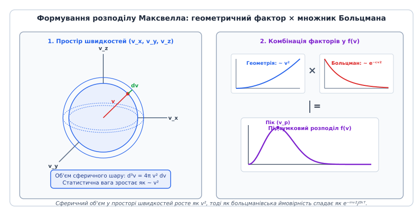
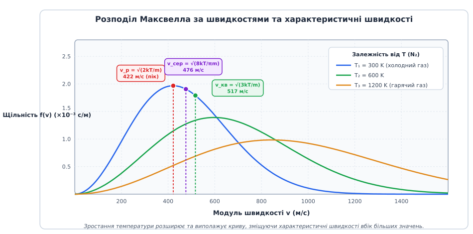

# Розподіл Максвелла — Больцмана за швидкостями та енергіями

<preknowlist>
- [Рівняння стану ідеального газу](topic:physics/thermal-statistical/ideal-gas-law) — макроскопічний зв'язок тиску, об'єму та температури для хаотичного газу.
- [Перший закон термодинаміки](topic:physics/first-law-thermodynamics) — внутрішня енергія системи та її макроскопічний енергетичний баланс.
- [Теорема про рівнорозподіл](topic:physics/equipartition-theorem) — розподіл середньої кінетичної енергії по 1/2 kT на ступінь вільності.
- [Кінетична енергія](topic:physics/kinetic-energy) — квадратична залежність енергії руху тіла від швидкості.
- [Число Кнудсена](topic:physics/knudsen-number) — критерій суцільності середовища та відношення довжини вільного пробігу до розмірів системи.
</preknowlist>

У балоні зі стисненим азотом за кімнатної температури 300 кельвінів і тиску 100 атмосфер молекули рухаються зі середньою швидкістю близько 500 метрів за секунду — що перевищує швидкість звуку в повітрі й дорівнює швидкості кулі. Проте це лише усереднений показник: частина молекул у той самий момент летить удвічі повільніше, а окремі поодинокі частинки несуться зі швидкостями понад 1500 метрів за секунду. Саме ці нечисленні надшвидкі молекули забезпечують випаровування води при кімнатній температурі, розривають хімічні зв'язки у реакціях і долають гравітацію планет у верхніх шарах атмосфери. Як саме кінетична енергія ділиться між трильйонами хаотичних частинок після мільярдів пружних зіткнень на секунду і яка частка молекул має швидкість у заданому інтервалі, описує класичний фундаментальний закон статистичної фізики — **розподіл Максвелла — Больцмана**.

---

### 1. Мікроскопічна картина теплового руху та статистична гіпотеза

Макроскопічне тіло в класичній термодинаміці описується невеликим набором параметрів: тиском `P`, об'ємом `V` та температурою `T`. Проте з мікроскопічного погляду газ є колосальним ансамблем частинок (близько `10²³` молекул у кожному молі речовини), які безперервно рухаються, хаотично змінюють свої траєкторії та обмінюються імпульсом під час зіткнень.

У класичній кінетичній модель ідеального газу припускається, що:
1. Власний об'єм усіх молекул є зникаюче малим порівняно з повним об'ємом посудини.
2. Міжмолекулярні сили притягання та відштовхування на відстані відсутні (молекули взаємодіють лише під час безпосередніх короткочасних пружних зіткнень).
3. Зіткнення частинок між собою та зі стінками посудини підпорядковуються законам класичної механіки Ньютона зі збереженням імпульсу та кінетичної енергії.

Якщо у початковий момент часу задати абсолютно однакові швидкості всім частинкам газу (наприклад, розганяти їх прискореним електричним полем у лазерній пастці чи інжектувати моноенергетичним пучком), то перше ж хаотичне зіткнення розіб'є цю однорідність. У разі лобового чи дотичного зіткнення одна молекула гальмується, віддаючи частину своєї кінетичної енергії сусідові, а інша, навпаки, прискорюється. Внаслідок гігантської частоти зіткнень (у повітрі за нормальних умов кожна молекула зазнає близько 5 мільярдів зіткнень щосекунди) у системі встановлюється динамічна статистична рівновага. Значення швидкості кожної окремої частинки безперервно та стрибкоподібно змінюється від мікросекунди до мікросекунди, але **загальна частка молекул**, які мають швидкості в певному інтервалі від `v` до `v + dv`, залишається суворо постійною і незмінною в часі.

Цей стаціонарний стан і є станом термодинамічної рівноваги, а функція, що визначає ймовірність виявлення молекули з певним значенням швидкості чи енергії, називається **щільністю розподілу ймовірностей**.

Частота зіткнень безпосередньо пов'язана з **довжиною вільного пробігу** `λ = 1 / (√2 · π · d² · n)`, де `d` — ефективний діаметр молекули, а `n` — їхня числова концентрація. При нормальному тиску довжина вільного пробігу становить лише близько `68 нанометрів`, що у сотні разів менше за розмір будь-якої лабораторної посудини. У цьому режимі (суцільне середовище, [число Кнудсена](topic:physics/knudsen-number) `Kn ≪ 1`) хаотичні зіткнення відбуваються надзвичайно інтенсивно, забезпечуючи миттєву локальну максвеллізацію газу. Натомість у глибокому вакуумі чи у космічному просторі, де `Kn ≫ 1` (балістичний режим), молекули долають десятки метрів без жодного зіткнення, зберігаючи свій розподіл швидкостей від самого моменту випаровування чи ефузії.

Важливо підкреслити, що розподіл Максвелла — Больцмана не залежить від геометричної форми посудини чи матеріалу її стінок. Він є внутрішньою фундаментальною властивістю хаотичного руху частинок. Припустімо, що ми виділили у великому об'ємі газу довільний уявний кубик: кількість молекул, що влітають у цей кубик із різними швидкостями за одиницю часу, строго врівноважується кількістю молекул, що вилітають із нього після зіткнень. Статистична рівновага виникає завдяки тому, що процес прямого зіткнення двох молекул зі швидкостями `(v₁, v₂)` та зворотний процес зіткнення частинок зі швидкостями `(v₁', v₂')` відбуваються з однаковою ймовірністю у макроскопічному масштабі.

Ця властивість рівноваги прямо випливає з принципу детального балансу: у стаціонарному стані кількість переходів із будь-якої пари мікростанів `A → B` за секунду строго дорівнює кількості зворотних переходів `B → A`. Завдяки цьому макроскопічні характеристики середовища (температура, тиск, густина кінетичної енергії) залишаються незмінними, хоча на мікрорівні не припиняється неперервний коловорот зіткнень. Навіть якщо локально створити збурення (наприклад, подати акустичний імпульс чи створити градієнт температури), міжмолекулярні зіткнення швидко релаксують систему назад до максвеллівського розподілу за час порядку кількох часів вільного пробігу.

Докладніше про те, як Джеймс Клерк Максвелл у 1860 році першим застосував теорію ймовірностей для опису хаосу, а Людвіг Больцман довів незворотне прагнення системи до цього стану через H-теорему, розказано у розділі [📜 Історія формування кінетичної теорії: від Максвелла до Больцмана](topic:physics/maxwell-boltzmann-distribution/hist-maxwell-boltzmann.md).

---

### 2. Розподіл за проєкціями швидкості (одновимірний розподіл Ґаусса)

Щоб побудувати математичний вираз розподілу, спочатку розглянемо не самий модуль швидкості, а одну з її декартових проєкцій, наприклад `v_x`. Вектор швидкості молекули у тривимірному просторі складається з трьох взаємно перпендикулярних компонент: `v⃗ = (v_x, v_y, v_z)`.

Завдяки повністю хаотичному характеру руху жоден із напрямків у просторі не має переваги. Це означає, що середня значення проєкції швидкості за будь-якою віссю дорівнює нулю:
```
⟨v_x⟩ = 0,   ⟨v_y⟩ = 0,   ⟨v_z⟩ = 0
```
Молекули з однаковою ймовірністю рухаються як праворуч (`v_x > 0`), так і ліворуч (`v_x < 0`). Якби середня проєкція `⟨v_x⟩` була відмінною від нуля, це означало б, що весь газ як єдине ціле макроскопічно рухається вздовж осі `X` зі швидкістю течії, а не перебуває у спокої.

Максвелл висунув дві фундаментальні статистичні гіпотези:
1. **Ізотропність**: Функція розподілу за трьома компонентами залежить лише від квадрата модуля швидкості `v² = v_x² + v_y² + v_z²`.
2. **Незалежність ортогональних компонент**: Подія, яка полягає у тому, що проєкція `v_x` має певне значення, є незалежною від значень проєкцій `v_y` та `v_z`.

З цих двох вихідних положень строго випливає, що щільність ймовірності того, що проєкція швидкості молекули лежить в інтервалі від `v_x` до `v_x + dv_x`, описується класичним **одномірним розподілом Ґаусса (нормальним законом)**:

```
f₁(v_x) = √(m / (2 · π · k_B · T)) · exp(-m · v_x² / (2 · k_B · T))
```

Де:
- `m` — маса однієї молекули (кг),
- `k_B` — постійна Больцмана (`1.380649 × 10⁻²³ Дж/К`),
- `T` — абсолютна температура системи (К).

```
f₁(v_x)
= A · exp(-λ · v_x²)                               [загальна форма Ґаусса]
= √(m / (2 · π · k_B · T)) · exp(-m · v_x² / (2 · k_B · T)) [нормування ∫₋∞⁺∞ f₁(v_x) dv_x = 1]
```

Фізичний зміст цього результату полягає у тому, що хаотичні зіткнення діють як природне джерело нормального статистичного шуму. Дисперсія одномірного розподілу дорівнює `σ² = ⟨v_x²⟩ = k_B · T / m`. Зі зростанням температури `T` симетричний гауссів дзвін розширюється, а його вершина в точці `v_x = 0` знижується, що відображає зростання амплітуди хаотичних теплових коливань. При наближенні температури до абсолютного нуля (`T → 0 К`) розподіл прямує до дельта-функції Дірака, коли всі частинки повністю зупиняють свій поступальний рух.

Розподіл за проєкціями має безпосереднє значення для оптичної спектроскопії. Коли атоми чи молекули випромінюють світло, їхній тепловий рух уздовж лінії спостереження спричиняє **доплерівське розширення спектральних ліній** (*Doppler broadening*). Оскільки проєкції швидкості випромінювачів підпорядковуються гауссовому розподілу `f₁(v_x)`, випромінена спектральна лінія набуває строго гауссового профілю з півшириною:

```
Δν_D = ν₀ · √(8 · k_B · T · ln(2) / (m · c²))
```

Де `ν₀` — центральна частота переходу, а `c` — швидкість світла. Вимірюючи ширину спектральної лінії за допомогою спектрометра високої роздільної здатності, астрофізики точно визначають температуру плазми далеких зірок, хромсфери Сонця та міжзоряних газових хмар, навіть якщо самі об'єкти віддалені на тисячі світлових років.

---

### 3. Розподіл за модулем швидкості (3D геометрія простору швидкостей)

На практиці вимірювальні прилади та фізичні явища (тиск на стінку, випаровування, хімічна реакція, вихід частинок із судини) визначають не окрему проєкцію, а абсолютне значення — **модуль швидкості** `v = √(v_x² + v_y² + v_z²)`.

Щоб перейти від тривимірного декартового розподілу `f(v_x, v_y, v_z) = f₁(v_x) · f₁(v_y) · f₁(v_z)` до розподілу за модулем `f(v)`, необхідно врахувати геометрію простору швидкостей.

Тривимірна ймовірність виявлення вектора швидкості у нескінченно малому кубику `dv_x dv_y dv_z` дорівнює:
```
dP(v_x, v_y, v_z) = (m / (2 · π · k_B · T))^(3/2) · exp(-m · (v_x² + v_y² + v_z²) / (2 · k_B · T)) dv_x dv_y dv_z
```

У тривимірній системі координат з осями `(v_x, v_y, v_z)` геометричним місцем точок із однаковим модулем швидкості `v` є **сфера радіуса `v`**. Множина всіх векторів, чий модуль лежить у вузькому інтервалі від `v` до `v + dv`, утворює тонкий сферичний шар радіуса `v` та товщини `dv`.


*Сферичний шар 4πv² dv у 3D просторі швидкостей задає зростання статистичної ваги (~v²), тоді як множник Больцмана задає експоненційне згасання e⁻ᵐᵛ²/²ᵏᵀ.*

Об'єм цього сферичного шару дорівнює добутку площі поверхні сфери `4 · π · v²` на її товщину `dv`:
```
d³v = 4 · π · v² dv
```

За теоремою Ліувілля про збереження фазового об'єму, густина мікростанів у елементі фазового простору `dΓ = d³r d³p / h³` залишається постійною вздовж фазових траєкторій. Оскільки число станів зі швидкостями в інтервалі `[v, v + dv]` є пропорційним об'єму сферичного шару `4·π·v² dv`, геометрія фазового простору безпосередньо формує вигляд статистичного розподілу.

Таким чином, підсумкова ймовірність `dP(v) = f(v) dv` того, що модуль швидкості молекули лежить у межах від `v` до `v + dv`, утворюється внаслідок **перемноження двох протилежних факторів**:
1. **Геометричний фактор (статистична вага) `4 · π · v²`**: кількість можливих комбінацій проєкцій `(v_x, v_y, v_z)`, які дають один і той самий модуль `v`, зростає пропорційно квадрату радіуса сфери `v²`. При `v → 0` об'єм сферичного шару прямує до нуля, тому ймовірність знайти молекулу з абсолютно нульовою швидкістю дорівнює нулю.
2. **Больцманівський експоненційний фактор `exp(-m · v² / (2 · k_B · T))`**: ймовірність зайняти стан із високою кінетичною енергією спадає за експоненційним законам. При `v → ∞` цей множник стрімко прямує до нуля.

Множачи тривимірний гауссів фактор на геометричну площу сферичного шару, одержуємо підсумкову **формулу Максвелла за модулем швидкості**:

```
f(v) = 4 · π · (m / (2 · π · k_B · T))^(3/2) · v² · exp(-m · v² / (2 · k_B · T))
```

Функція `f(v)` задовольняє умову нормування: інтеграл від `f(v)` за всіма можливими значеннями модуля швидкості від `0` до `+∞` строго дорівнює одиниці (`∫₀∞ f(v) dv = 1`). Фізично це означає, що кожна молекула обов'язково має якусь швидкість у діапазоні від нуля до нескінченності.


*Розподіл Максвелла за швидкостями для трьох температур та розташування найімовірнішої (v_p), середньої арифметичної (v_сер) та середньої квадратичної (v_кв) швидкостей.*

На графіку видно асиметричну криву, яка починається з нуля, зростає за параболою `v²`, досягає максимуму при певному значенні `v_p`, а потім асимптотично наближається до нуля вздовж довгого високоенергетичного хвоста.

Аналіз залежності кривої від маси та температури виявляє дві важливі регулярності:
- **Вплив температури `T`**: При нагріванні газу максимум кривої зміщується праворуч убік більших швидкостей, а сама крива розплющується й стає ширшою. Площа під кривою завжди залишається строго рівною одиниці, тому розширення кривої по осі `v` супроводжується зменшенням її висоти в максимумі.
- **Вплив маси молекули `m`**: За однакової температури легкі гази (гелій `He`, водень `H₂`) мають значно ширший розподіл із великими швидкостями, тоді як важкі гази (аргон `Ar`, ксенон `Xe`) згруповані у вузькому піку при малих швидкостях.

---

### 4. Характеристичні швидкості системи

Оскільки крива розподілу Максвелла є асиметричною, у статистичній фізиці використовують три різні значення, кожне з яких має свій чіткий фізичний зміст та застосування.

```
+------------------------------------+----------------------------+-----------------------+
| Назва швидкості                    | Формульний вираз           | Коефіцієнт (відносний)|
+------------------------------------+----------------------------+-----------------------+
| 1. Найімовірніша швидкість (v_p)   | √(2 · k_B · T / m)         | 1.000 (відправна)     |
| 2. Середня арифметична (v_сер)     | √(8 · k_B · T / (π · m))   | 1.128  (на 12.8% вища) |
| 3. Середня квадратична (v_кв)      | √(3 · k_B · T / m)         | 1.225  (на 22.5% вища) |
+------------------------------------+----------------------------+-----------------------+
```

#### 1. Найімовірніша швидкість (`v_p` / *most probable speed*)
Це швидкість, що відповідає **максимуму** функції розподілу `f(v)`. Біля цього значення зосереджена найбільша кількість молекул газу. Якщо випадковим чином вибрати одну молекулу з судини, то найімовірніше її швидкість виявиться близькою до `v_p`.

Для знаходження `v_p` беруть першу похідну від `f(v)` за `v` і прирівнюють її до нуля:
```
d/dv [f(v)] = 0  ⇒  v_p = √(2 · k_B · T / m)
```

#### 2. Середня арифметична швидкість (`v_сер` / *mean speed*)
Це математичне сподівання модуля швидкості по всьому ансамблю частинок:
```
v_сер = ⟨v⟩ = ∫₀∞ v · f(v) dv = √(8 · k_B · T / (π · m))
```
Саме середня арифметична швидкість визначає потік частинок через поверхню або дірочку в посудині (ефузію), середня кількість зіткнень молекули з іншими частинками за секунду та коефіцієнти дифузії й теплопровідності газу.

#### 3. Середня квадратична швидкість (`v_кв` / *root-mean-square speed*)
Це корінь квадратний із математичного сподівання квадрата швидкості:
```
v_кв = √(⟨v²⟩) = √(∫₀∞ v² · f(v) dv) = √(3 · k_B · T / m)
```
Середня квадратична швидкість є найважливішою для термодинаміки: саме вона безпосередньо пов'язана з середня кінетичною енергією поступального руху молекул `⟨E_k⟩ = (1/2) · m · ⟨v²⟩ = (3/2) · k_B · T` та визначає тиск газу на стінки посудини.

#### Чому середня квадратична швидкість більша за середню арифметичну?
Причиною цієї фундаментальної нерівності є асиметрія кривої Максвелла. У виразі для середня квадратичної швидкості `⟨v²⟩` надшвидкі молекули з правого хвоста розподілу входять із квадратичною вагою `v²`. Наприклад, одна рідкісна молекула зі потрійною швидкістю `3 · v` робить у квадрат швидкості такий самий внесок (`9 · v²`), як дев'ять звичайних молекул зі швидкістю `v`. Це штовхає середню квадратичну швидкість убік більших значень.

#### Співвідношення між характеристичними швидкостями
Для будь-якого газу за довільної температури ці швидкості перебувають у строгому постійному співвідношенні:

```
v_p : v_сер : v_кв = √2 : √(8 / π) : √3  ≈  1 : 1.128 : 1.225
```

Для ілюстрації наведемо розраховані значення характеристичних швидкостей для різних газів за кімнатної температури `T = 300 К` (`27 °C`):

```
+------------------+------------------+------------------+------------------+------------------+
| Газ              | Маса m (10⁻²⁶ кг)| v_p (м/с)        | v_сер (м/с)      | v_кв (м/с)       |
+------------------+------------------+------------------+------------------+------------------+
| Водень (H₂)      | 0.334            | 1572             | 1773             | 1925             |
| Гелій (He)       | 0.665            | 1116             | 1259             | 1367             |
| Водяна пара (H₂O)| 2.99             | 526              | 593              | 644              |
| Азот (N₂)        | 4.65             | 422              | 476              | 517              |
| Кисень (O₂)      | 5.31             | 395              | 446              | 484              |
| Аргон (Ar)       | 6.63             | 354              | 399              | 433              |
| Вуглекислий (CO₂)| 7.31             | 337              | 380              | 412              |
| Ксенон (Xe)      | 21.80            | 195              | 220              | 239              |
+------------------+------------------+------------------+------------------+------------------+
```

З цієї таблиці випливає важливий практичний висновок: за тієї самої температури молекули легкого водню рухаються у 8 разів швидше за атоми важкого ксенону. Це безпосередньо впливає на швидкість витоків газів крізь мікротріщини, швидкість звуку в середовищі та коефіцієнт теплопроводності.

При зміні температури від криогенних значень `100 K` до екстремальних нагрівів `3000 K` у розжарених камерах згоряння реактивних двигунів характеристичні швидкості зростають у `√30 ≈ 5.47` разів. Для молекули азоту `N₂` при `3000 K` середня квадратична швидкість сягає `1635 м/с`, що вимагає врахування ефектів високошвидкісного дисоціативного розпаду молекул.

Повний алгебраїчний вивід усіх трьох інтегралів та доведення характеристичних швидкостей наведено у розділі [🧮 Виведення розподілу Максвелла — Больцмана та його характеристичних швидкостей](topic:physics/maxwell-boltzmann-distribution/math-maxwell-derivation.md).

---

### 5. Розподіл за кінетичною енергією

Модуль швидкості залежить від маси частинки: за однакової температури легкі молекули гелію рухаються значно швидше за важкі молекули ксенону. Проте якщо перейти від швидкості `v` до **поступальної кінетичної енергії** `E = (1/2) · m · v²`, картина набуває універсального характеру.

Здійснюючи заміну змінної у виразі Максвелла (`v = √(2·E/m)`, `dv = dE / √(2·m·E)`), одержуємо **розподіл за кінетичною енергією**:

```
f_E(E) = (2 / √π) · (1 / (k_B · T))^(3/2) · √E · exp(-E / (k_B · T))
```

Де `f_E(E) dE` визначає частку молекул, кінетична енергія яких лежить в інтервалі від `E` до `E + dE`.

#### Фундаментальна властивість енергетичного розподілу:
У формулі `f_E(E)` **повністю відсутня маса молекули `m`**. Це означає, що при даній температурі `T` енергетичний розподіл є абсолютно однаковим для будь-яких газів — незалежно від того, це легкий водень `H₂`, кисень `O₂` чи суміш багатьох газів різної маси. У термодинамічній рівновазі суміш газів за певної температури автоматично самоорганізується так, що важкі молекули рухаються повільніше, а легкі — швидше, але їхній енергетичний спектр описується єдиною універсальною кривою.

Енергетичний розподіл так само асиметричний:
- При `E → 0` щільність прямує до нуля як `√E` (завдяки геометрії фазового простору).
- Максимум енергетичного розподілу досягається при найімовірнішій енергії `E_p = (1/2) · k_B · T`.
- Середня кінетична енергія поступального руху дорівнює `⟨E⟩ = (3/2) · k_B · T`, що повністю узгоджується з класичною теоремою про рівнорозподіл.

Велич `k_B · T` задає природний енергетичний масштаб теплового руху. За кімнатної температури `T = 300 К` теплова енергія становить:
```
k_B · T ≈ 4.14 × 10⁻²¹ Дж ≈ 0.0257 еВ (електронвольт)
```

Високоенергетична частина розподілу прямує до нуля як `exp(-E / (k_B · T))`. Цей експоненційний «хвіст» відіграє вирішальну роль у фізиці та хімії, оскільки саме він визначає кількість частинок, здатних подолати енергетичні бар'єри, які в десятки разів перевищують середню теплову енергію `k_B · T`.

---

### 6. Фізичні та прикладні наслідки розподілу

Розподіл Максвелла — Больцмана є не просто теоретичною формулою, а робочим інструментом для пояснення природних явищ і проектування технічних систем.

```
+--------------------------------------+----------------------------------------------------+
| Явище / Застосування                 | Фізичний механізм Максвелла — Больцмана            |
+--------------------------------------+----------------------------------------------------+
| 1. Випаровування рідин               | Виліт «надшвидких» молекул з хвоста f(v)           |
| 2. Дисипація атмосфер планет (Джинс)| Втрата легких газів з v > v_втечі у хвості f(v)    |
| 3. Хімічна кінетика (Арреніус)       | Частка молекул з E > E_активації ~ exp(-E_a / kT)  |
| 4. Термоелектронна емісія            | Електрони у металі з кінетичною енергією E > Φ     |
| 5. Тепловий шум Найквіста             | Флуктуації напруги в провіднику через рух носіїв   |
| 6. Барометричний розподіл             | Зменшення концентрації газу у полі тяжіння z       |
| 7. Ефузія та закон Ґрема             | Витікання газу крізь малий отвір у вакуум          |
| 8. Охолодження випаровуванням атомів | Захоплення атомарного газу в оптичних пастках     |
| 9. Фізика плазми та дебаївський екра | Дебаївський радіус і термоядерний синтез (Ґамов)   |
+--------------------------------------+----------------------------------------------------+
```

#### 1. Охолодження рідини при випаровуванні
Випаровування води відбуваються за будь-якої температури (навіть при `0 °C`). Механізм полягає в тому, що з поверхні рідини вилітають лише ті молекули, чия кінетична енергія перевищує роботу виходу (потенціальний бар'єр міжмолекулярного притягання). Ці частинки беруться виключно з правого хвоста розподілу Максвелла. Оскільки рідину залишають лише «найгарячіші» молекули зі швидкістю `v ≫ v_сер`, середня кінетична енергія частинок, що залишилися, падає — і рідина охолоджується.

#### 2. Дисипація планетних атмосфер (дисипація Джинса)
Чому атмосфера Землі багата на азот і кисень, але практично позбавлена водню та гелію, тоді як гіганти Юпітер і Сатурн утримали свої газові оболонки?

Відповідь дає порівняння кривої Максвелла з **другою космічною швидкістю (швидкістю втечі)** `v_esc`. Для Землі `v_esc ≈ 11.2 км/с`.
- Для важких молекул азоту `N₂` середня швидкість становить `~ 0.5 км/с`, і частка частинок із `v > 11.2 км/с` у хвості Максвелла є зникаюче малою (`10⁻⁵⁰`).
- Для легких молекул водню `H₂` за тієї самої температури верхніх шарів атмосфери (екзосфери, `T ~ 1000 К`) середня швидкість сягає `~ 3.5 км/с`. Частка частинок із `v > 11.2 км/с` стає помітною. Протягом мільярдів років водень постійно «протікав» у відкритий космос через високоенергетичний хвіст розподілу.

#### 3. Хімічна кінетика та закон Арреніуса
Щоб відбулася хімічна реакція між двома молекулами, вони повинні не просто зіткнутися, а мати сумарну кінетичну енергію, більшу за **енергію активації** `E_a`. Інтегрування хвоста розподілу Максвелла — Больцмана від `E_a` до `∞` дає знамениту залежність константи швидкості реакції `k` від температури:

```
k = A · exp(-E_a / (k_B · T))                      [закон Арреніуса]
```

Невелике підвищення температури (наприклад, на 10 градусів) лише трохи змінює середню швидкість `v_сер`, але **експоненційно помножує** кількість надшвидких частинок у хвості — тому швидкість багатьох хімічних реакцій зростає у кілька разів.

#### 4. Термоелектронна емісія (закон Річардсона — Дешмана)
У металах вільні електрони провідності утворюють електронний газ. Щоб електрон зміг вирватися з металу у вакуум, його кінетична енергія повинна перевищувати роботу виходу `Φ` (зазвичай `2 – 5 еВ`). При кімнатній температурі теплова енергія `k_B · T ≈ 0.026 еВ` є занадто малою, тому емісія відсутня. Проте при розжаренні катода до `2000 – 2500 К` високоенергетичний хвіст електронного розподілу заселяється електронами з `E > Φ`, утворюючи струм термоелектронної емісії у електронно-променевих трубках, рентгенівських апаратах та вакуумних підсилювачах.

#### 5. Тепловий шум Джонсона — Найквіста в електронних кола
Хаотичний тепловий рух вільних носіїв заряду (електронів) у будь-якому електричному опорі `R` створює флуктуючу різницю потенціалів на його затискачах. Середній квадрат флуктуацій напруги описується формулою Найквіста:
```
⟨U²⟩ = 4 · k_B · T · R · Δf
```
Цей тепловий шум визначає абсолютну межу чутливості будь-яких радіоприймачів, підсилювачів, медичних датчиків та оптичних фотодетекторів.

#### 6. Барометричний розподіл у полі тяжіння
У поєднанні з потенціальною енергією `U(z) = m · g · z` у однорідному полі тяжіння розподіл Максвелла — Больцмана дає класичну **барометричну формулу** для зменшення концентрації молекул `n(z)` та тиску `P(z)` з висотою:

```
n(z) = n₀ · exp(-m · g · z / (k_B · T))
```

Оскільки маса молекули `m` стоїть у показнику експоненти, важкі гази (вуглекислий газ `CO₂`, аргон `Ar`) з висотою спадають значно швидше, ніж легкі водень та гелій. Цей ефект зветься **бародифузійним розділенням** і використовується в ультрацентрифугах для розділення ізотопів урану (`²³⁵U` та `²³⁸U`) у газовій фазі гексафториду `UF₆`.

#### 7. Ефузія газів та розділення за законом Ґрема
Якщо у стінці посудини зробити мікроскопічний отвір, діаметр якого значно менший за довжину вільного пробігу молекул, витікання газу у вакуум відбувається у режимі **молекулярної ефузії**. Потік частинок, що вилітають через отвір за секунду, дорівнює `J = (1/4) · n · v_сер`. 

Оскільки середня арифметична швидкість `v_сер` є обернено пропорційною квадратному кореню з маси молекули `√(m)`, легкий газ витікає крізь пористу перегородку швидше за важкий. Ця залежність становить основу **закону ефузії Ґрема**:

```
J₁ / J₂ = √(m₂ / m₁)
```

Газодифузійне розділення крізь тисячі послідовних пористих мембран історично було першим промисловим методом одержання збагаченого урану для ядерної енергетики.

#### 8. Лазерне та випаровувальне охолодження атомарних газів
У сучасних фізичних експериментах з одержання бозе-ейнштейнівського конденсату атоми лужних металів (`⁸⁷Rb`, `²³Na`) охолоджують до нанокельвінових температур за допомогою двох послідовних етапів. На першому етапі лазерне охолодження уповільнює атоми до швидкостей порядку `10 см/с`. На другому етапі застосовується **випаровувальне охолодження** (*evaporative cooling*): потенціальні стінки магнітооптичної пастки знижують, дозволяючи найгарячішим атомам із максвеллівського хвоста вилетіти з пастки. Залишок атомів після міжатомних зіткнень максвеллізується за значно нижчої температури.

#### 9. Термоядерний синтез та пік Ґамова
У термоядерних реакціях (наприклад, синтезі дейтерію та тритію `D + T → ⁴He + n`) два позитивно заряджені ядра мусять підійти на відстань дії ядерних сил, здолавши кулонівський бар'єр відштовхування `E_c ~ 100 кеВ`. Середня теплова енергія плазми у реакторі токамака за `T = 100 млн К` становить лише `k_B · T ≈ 8.6 кеВ`. Реакція здійснюється виключно завдяки поєднанню високоенергетичного хвоста Максвелла — Больцмана `exp(-E / (k_B · T))` та квантовомеханічного тунелювання крізь бар'єр `exp(-b / √E)`. Перемноження цих двох експонент утворює вузьке енергетичне вікно — **пік Ґамова** (*Gamow peak*), у якому й відбуваються всі термоядерні реакції у надрах Сонця та земних реакторах.

> 🔧 **Навіщо це в реальній інженерії.**
> - **Вакуумні системи та турбомолекулярні насоси**: Проектування вакуумних технологічних камер напівпровідникового виробництва вимагає розрахунку прольоту молекул через роторні диски насоса. Швидкість обертання лопаток повинна порівнюватися з найімовірнішою швидкістю газу `v_p`.
> - **Аеродинаміка космічного апарату при вході в атмосферу**: При обчисленні теплового захисту спускається апарата у верхніх розріджених шарах атмосфери класичні рівняння Суцільного середовища Нав'є — Стокса ламаються. Обчислення виконуються методом прямого статистичного моделювання Монте-Карло (DSMC) на основі локального розподілу Максвелла.
> - **Напівпровідникові прилади**: Гарячі електрони у транзисторах під дією сильних полів відхиляються від максвеллівської рівноваги, що викликає деградацію підзатворного діелектрика та обмеження часових параметрів чипів.

Перевірити еволюцію газу від моноенергетичного стану до рівноважного розподілу за допомогою чисельного моделювання методом парних зіткнень мовами C та C++ можна у розділі [⚙️ Моделювання молекулярного руху та перевірка розподілу](topic:physics/maxwell-boltzmann-distribution/proj-maxwell-simulation.md).

---

### 7. Межі застосовності та квантові поправки

Розподіл Максвелла — Больцмана є **класичним наближенням**, яке чудово працює за двох умов:
1. **Нерелятивістські швидкості**: Швидкості частинок значно менші за швидкість світла (`v ≪ c`). При напіврелятивістських температурах (`k_B · T ~ m · c²`, наприклад, у надрах релятивістських зірок або плазмі токамаків) розподіл Максвелла переходить у релятивістський розподіл Максвелла — Юттнера (*Maxwell–Jüttner distribution*).
2. **Відсутність квантового виродження**: Середня відстань між частинками `d ~ (V / N)^(1/3)` значно більша за **довжину хвилі де Бройля** `λ_dB` для теплового руху молекули:

```
λ_dB = h / √(3 · m · k_B · T) ≪ (V / N)^(1/3)
```

Коли температура стає дуже низькою або густина частинок надзвичайно високою, хвильові функції сусідніх частинок починають перекриватися. У цьому разі квантово-механічна нерозрізнюваність частинок та спінова статистика кардинально змінюють вигляд розподілу:

- **Ферміони (частинки з напівцілим спіном, наприклад електрони у металах)**: підпорядковуються принципу заборони Паулі та описуються **розподілом Фермі — Дірака**. Навіть при `T = 0 К` електрони не зупиняються, а заповнюють усі енергетичні рівні аж до енергії Фермі `E_F`.
- **Бозони (частинки з цілим спіном, наприклад атоми гелію-4 чи фотони)**: описуються **розподілом Бозе — Ейнштейна**. При наднизьких температурах відбувається квантовий фазовий перехід — **бозе-ейнштейнівська конденсація**, коли макроскопічна кількість частинок випадає в єдиний основний квантовий стан із нульовим імпульсом.

Утім, для звичайних газів (азоту, кисню, аргону) за нормальних температур та тисків квантова довжина хвилі `λ_dB ~ 10⁻¹¹ м` є на три порядки меншою за відстань між молекулами `d ~ 3 × 10⁻⁹ м`. Тому класичний розподіл Максвелла — Больцмана залишається ідеально точним та фундаментальним законом термодинаміки речовини.
