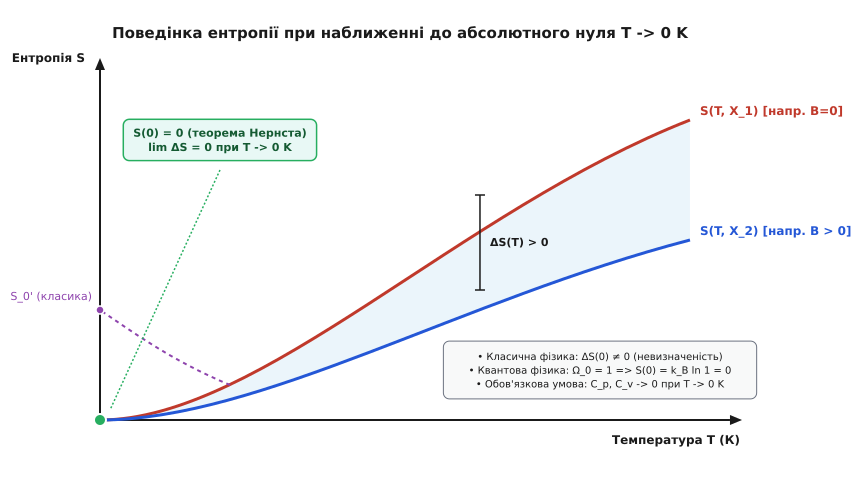
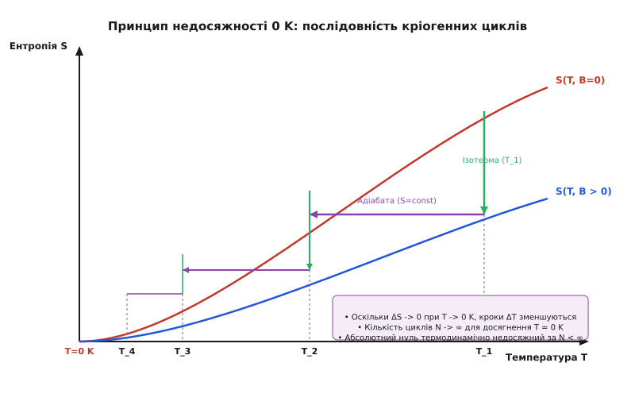
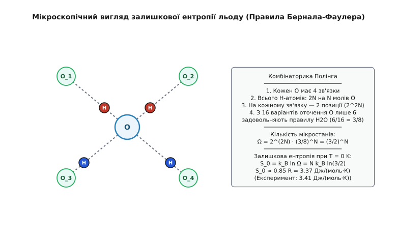

# Третій закон термодинаміки (теорема Нернста)

<preknowlist>
- [Другий закон термодинаміки](book:physics/second-law-thermodynamics) — визначення ентропії `dS = dQ / T` та її незворотне зростання у замкнених системах.
- [Статистичний зміст ентропії](book:physics/entropy-boltzmann) — зв'язок ентропії з кількістю доступних мікростанів `S = k_B · ln Ω`.
- [Теплоємність твердих тіл](book:physics/heat-capacity-dulong-petit) — класичний закон Дюлонга — Пті `C = 3R` та його фундаментальний злам при низьких температурах.
</preknowlist>

Класична термодинаміка, розроблена у XIX столітті видатними фізиками Саді Карно, Рудольфом Клаузіусом, Вільямом Томсоном (лордом Кельвіном) та Джозайєю Віллардом Ґіббсом, визначила ентропію `S` через феноменологічне диференціальне співвідношення `dS = dQ / T`. Такий фундаментальний математичний підхід давав змогу розраховувати виключно *зміни* ентропії `ΔS` під час обернених чи незворотних термодинамічних процесів. При цьому абсолютна величина ентропії у рамках Першого та Другого законів залишалася визначеною лише з точністю до довільної невідомої константи інтегрування `S_0`.

У макроскопічній теплотехніці та розрахунках теплових двигунів (парових турбін, двигунів внутрішнього згоряння) ця довільність не створювала практичних ускладнень. Механічна робота, що виконується робочим тілом у циклі Карно чи Ренкіна, визначається виключно різницею термодинамічних потенціалів між двома станами. Проте у фізичній хімії невизначеність константи `S_0` призвела до принципової кризи: вона унеможливила теоретичний розрахунок констант хімічної рівноваги `K_p` та хімічної спорідненості `ΔG = ΔH - T·ΔS` без проведення виснажливих експериментальних вимірювань для кожної конкретної реакції при різних температурах.

Фундаментальне розв'язання цієї проблеми було знайдене на межі класичної термодинаміки, квантової механіки та статистичної фізики у вигляді **Третього закону термодинаміки**, також відомого як **теорема Нернста** та **постулат Планка**.

## 1. Парадокс класичної термодинаміки та витоки ідеї Нернста

Головною задачею фізичної хімії на початку XX століття було передбачення константи рівноваги хімічних реакцій на основі суто калориметричних вимірювань. Зміна вільної енергії Ґіббса `ΔG` визначає максимальну корисну роботу реакції при сталому тиску і температурі:

```
ΔG = ΔH - T·ΔS
```

Зв'язок між вільною енергією `ΔG` та тепловим ефектом реакції `ΔH` (зміною ентальпії) задається фундаментальним термодинамічним рівнянням Ґіббса — Ґельмгольца:

```
ΔG = ΔH + T · (∂ΔG / ∂T)_p
```

Порівняння двох наведених виразів показує, що температурний коефіцієнт вільної енергії безпосередньо зв'язаний зі зміною ентропії співвідношенням:

```
(∂ΔG / ∂T)_p = -ΔS
```

Щоб обчислити залежність вільної енергії від температури `ΔG(T)`, необхідно проінтегрувати рівняння Ґіббса — Ґельмгольца. Проте інтегрування дає невизначену константу, значення якої вимагає знання ентропії `ΔS` при `T = 0 K`. 

Класична термодинаміка не містила жодних обмежень на значення `ΔS` при абсолютному нулю. Хіміки мали змогу легко виміряти тепловий ефект `ΔH` за допомогою калориметра при одній температурі, але не мали жодного теоретичного шляху для обчислення константи рівноваги `K_p = exp(-ΔG / (R·T))` без проведення складних вимірювань рівноваги при різних температурах.

Аналізуючи експериментальні дані про хімічні реакції у конденсованих фазах (твердих тілах та рідинах) при низьких температурах, німецький фізико-хімік Вальтер Нернст у 1905–1906 роках зробив вирішальне спостереження. Він помітив, що при наближенні температури до absolute нуля (`T → 0 K`) криві змінення вільної енергії `ΔG(T)` та ентальпії `ΔH(T)` не просто прямують до однієї точки, а асимптотично торкаються одна одної під нульовим кутом.

Детальний історичний опис цього наукового відкриття, наукові суперечки навколо нього та роль Сольвеївського конгресу 1911 року наведено в історичній вставці [Історія відкриття третього закону](book:physics/thermodynamics/nernst-theorem/hist-nernst-discovery.md).

Математично спостереження Нернста означало, що перші похідні функцій `ΔG(T)` та `ΔH(T)` за температурою прямують до нуля при `T → 0 K`:

```
lim_{T → 0} (∂ΔG / ∂T)_p = lim_{T → 0} (∂ΔH / ∂T)_p = 0
```

Оскільки `(∂ΔG / ∂T)_p = -ΔS`, Нернст сформулював своє фундаментальне припущення, відоме як **теплова теорема Нернста**:

> *Зміна ентропії `ΔS` у будь-якій ізотермічній оберненій трансформації суцільних конденсованих систем прямує до нуля при наближенні температури до absolute нуля.*

```
lim_{T → 0} ΔS = 0
```

Це спостереження було справжнім науковим проривом. Воно означало, що ізотерми та адіабати на `S-T` діаграмі зливаються в одну точку при `T = 0 K`. Завдяки цьому константа інтегрування для ентропії хімічної реакції ставала дорівнювати нулю, що дозволило хімікам розраховувати хімічні рівноваги суто за калориметричними даними.


*Графік зближення ентропійних кривих різних станів систем S(T, X_1) та S(T, X_2) при наближенні до T = 0 K. Згідно з теоремою Нернста, різниця ентропій ΔS прямує до нуля, на відміну від класичної екстраполяції.*

## 2. Постулат Планка та шкала абсолютної ентропії

У 1911 році видатний німецький фізик-теоретик Макс Планк зробив наступний логічний крок в узагальненні результату Нернста. 

Якщо зміна ентропії `ΔS = S_2 - S_1` для будь-якого фізичного чи хімічного процесу між рівноважними станами прямує до нуля при `T → 0 K`, це означає, що ентропія *кожної окремої* чистої конденсованої речовини при абсолютному нулю прямує до однієї й тієї самої універсальної константи `S_0`.

Планк запропонував покласти цю універсальну константу рівною нулю для всіх хімічно однорідних речовин у досконалому кристалічному стані:

> *Ентропія будь-якої однорідної системи, що перебуває у стані внутрішньої термодинамічної рівноваги, прямує до нуля при наближенні абсолютної температури до нуля.*

```
lim_{T → 0} S(T) = 0
```

Це формулювання отримало назву **постулату Планка** або сучасного формулювання **Третього закону термодинаміки**. Завдяки Планку ентропія перетворилася з відносної величини на абсолютну фізичну характеристику стану речовини.

Наявність абсолютної шкали ентропії дає змогу визначити **абсолютну ентропію** речовини при довільній температурі `T` шляхом безпосереднього інтегрування виміряної питомої теплоємності від `0 K`:

```
S(T) = ∫_0^T (C_p(T') / T') dT'
```

Якщо в інтервалі від `0` до `T` речовина зазнає фазових переходів (наприклад, плавлення при `T_m` з теплотою `ΔH_m` або випаровування при `T_b` з теплотою `ΔH_b`), абсолютна ентропія обчислюється як сума інтегралів по кожній фазі та скачків ентропії фазових переходів:

```
S(T) = ∫_0^{T_m} (C_{p, solid} / T') dT' + (ΔH_m / T_m) + ∫_{T_m}^{T_b} (C_{p, liquid} / T') dT' + (ΔH_b / T_b) + ∫_{T_b}^T (C_{p, gas} / T') dT'
```

Визначення абсолютної ентропії повністю усунуло довільні константи з усіх термодинамічних потенціалів. Вільна енергія Гельмгольца `F = U - T·S` та потенціал Ґіббса `G = H - T·S` стали фундаментально визначеними величинами, які можна розрахувати для будь-якої речовини.

## 3. Мікроскопічна та квантова природа Третього закону

Класична статистична механіка (базована на розподілі Максвелла — Больцмана та законі рівнорозподілу енергії) зазнає неминучого краху при спробі опису систем при `T → 0 K`. 

У класичній фізиці фазовий простір є суцільним і безперервним. При зниженні температури середня кінетична енергія частинок прямує до нуля, і об'єм доступного фазового простору стискається у точку. За класичною формулою Саккура — Тетроде для ідеального газу ентропія прямує до мінус нескінченності:

```
S_class(T) = N·k_B · [ ln( (V/N) · (2·π·m·k_B·T / h²)^(3/2) ) + 5/2 ] → -∞    при T → 0 K
```

Ця суперечність показує, що Третій закон термодинаміки неможливо вивести з класичної механіки. Його корені лежать у квантовій структурі матерії.

За статистичною формулою Больцмана ентропія визначається кількістю мікростанів `Ω`, якими може бути реалізований даний макроскопічний стан системи:

```
S = k_B · ln Ω
```

Згідно з квантовою механікою, енергетичний спектр будь-якої макроскопічної системи у скінченному об'ємі є дискретним: `E_0 < E_1 < E_2 < ...`. Ймовірність `w_i` знаходження системи у `i`-му квантовому стані визначається канонічним розподілом Ґіббса:

```
w_i = (1 / Z) · exp(-E_i / (k_B · T))
```

де `Z = ∑ exp(-E_i / (k_B · T))` — статистична сума системи.

При наближенні температури до абсолютного нуля (`T → 0 K`) теплова енергія `k_B · T` стає набагато меншою за інтервал між основним станом `E_0` та першим збудженим станом `E_1` (`k_B · T ≪ E_1 - E_0`).

Внаслідок цього ймовірність перебування системи у будь-якому збудженому квантовому стані експоненційно вимерзає до нуля:

```
w_i / w_0 = exp(-(E_i - E_0) / (k_B · T)) → 0    при T → 0 K
```

Система з ймовірністю `100%` опускається у свій квантовий основний стан (ground state) з мінімальною можливою енергією `E_0`.

Якщо основний квантовий стан системи є **невиродженим** (тобто існує лише одна квантово-механічна хвильова функція `Ψ_0` з енергією `E_0`), то кількість доступних мікростанів дорівнює `Ω = 1`. 

За формулою Больцмана:

```
S(0) = k_B · ln(1) = 0
```

Якщо ж основний стан має кратне виродження `g_0 > 1`, то ентропія при `T = 0 K` дорівнює:

```
S_0 = k_B · ln g_0
```

У макроскопічних систем (де кількість частинок `N ~ 10²³`) кратність виродження основного стану `g_0` може зростати лише пропорційно кількості частинок або її невеликому степеню. Тоді питома молярна ентропія становить:

```
S_0 / N = (k_B / N) · ln g_0 → 0    при N → ∞
```

Таким чином, макроскопічна питома ентропія будь-якої рівноважної системи при абсолютному нулю завжди строго дорівнює нулю.

### Поведінка квантових рідин та газів при T → 0 K

Яскравим підтвердженням квантової природи Третього закону є поведінка квантових рідин — рідких ізотопів гелію `⁴He` та `³He`:
- **Бозе-рідина (`⁴He`):** Атоми ⁴He є бозонами. При температурі `T_λ = 2.17 K` відбувається Бозе-Ейнштейнівська конденсація, і рідкий гелій переходить у надплинний стан (гелій II). При `T → 0 K` усі атоми опиняються у єдиному квантовому когерентному стані з нульовою ентропією `S = 0`.
- **Фермі-рідина (`³He`):** Атоми ³He є ферміонами зі спіном 1/2. При охолодженні вони утворюють вироджений газ Фермі. При наднизьких температурах (`T < 2.5 мК`) атоми ³He об'єднуються у куперівські пари та переходять у надплинний стан, ентропія якого також прямує до нуля згідно з Третім законом.

## 4. Фундаментальні термодинамічні наслідки

З теореми Нернста та постулату Планка випливає низка математично строгих наслідків для фізичних властивостей усіх речовин при наднизьких температурах. Повний математичний вивід цих наслідків наведено у вставці [Математичний вивід термодинамічних наслідків](book:physics/thermodynamics/nernst-theorem/math-thermodynamic-consequences.md).

### Обов'язкове зникнення теплоємностей (C_p → 0, C_v → 0)

Щоб інтеграл ентропії `S(T) = ∫_0^T (C(T') / T') dT'` збігався на нижній межі `T' = 0`, необхідно, щоб теплоємність системи `C(T)` прямувала до нуля при `T → 0 K`:

```
lim_{T → 0} C_p(T) = 0    та    lim_{T → 0} C_v(T) = 0
```

Цей наслідок пояснює, чому класичний закон Дюлонга — Пті (`C_v = 3R`) обов'язково зазнає зламу при низьких температурах. У діелектричних кристалах теплоємність згасає за законом кубів Дебая (`C_v ~ T³`), у металах електронна теплоємність прямує до нуля лінійно (`C_v ~ T`), а у надпровідниках — експоненційно `C_es ~ exp(-Δ / (k_B·T))`.

### Зникнення коефіцієнта теплового розширення (α → 0)

Використовуючи співвідношення Максвелла `(∂V / ∂T)_p = -(∂S / ∂p)_T`, отримуємо, що оскільки ентропія при `T = 0 K` не залежить від тиску `p`, то:

```
lim_{T → 0} (∂V / ∂T)_p = 0
```

Отже, ізобарний коефіцієнт об'ємного теплового розширення `α = (1 / V) · (∂V / ∂T)_p` строго прямує до нуля:

```
lim_{T → 0} α(T) = 0
```

При абсолютному нулю термодинамічні тіла повністю припиняють змінювати свій об'єм під час нагрівання або охолодження.

### Зникнення термічного коефіцієнта тиску (γ → 0)

З іншого співвідношення Максвелла `(∂p / ∂T)_V = (∂S / ∂V)_T` випливає, що ізохорний коефіцієнт тиску `γ = (∂p / ∂T)_V` також прямує до нуля при `T → 0 K`:

```
lim_{T → 0} (∂p / ∂T)_V = 0
```

При наближенні до absolute нуля зміна температури у фіксованій посудині не створює жодного додаткового тиску.

### Пригнічення термоелектричних та магнітних явищ

З Третього закону випливає також прямування до нуля диференціальної термо-ЕРС (коефіцієнта Зеєбека `S_Seeback → 0`), коефіцієнта Пельтьє, а також температурних похідних намагнічуваності `(∂M / ∂T)_H → 0` та поляризації `(∂P / ∂T)_E → 0`.

## 5. Принцип недосяжності абсолютного нуля

З Третього закону термодинаміки випливає важливий практичний і теоретичний висновок, відомий як **Принцип недосяжності абсолютного нуля** (принцип Нернста — Саймона):

> *Неможливо знизити температуру будь-якої системи до точного значення `T = 0 K` за скінченне число термодинамічних операцій.*

Процес охолодження будь-якої кріогенної установки (наприклад, методом адіабатичного розмагнічування або випаровувального охолодження) складається з послідовності двох типів кроків:
1. **Ізотермічний крок** (зменшення ентропії за рахунок зовнішнього поля `B` чи тиску `p` при `T = const`).
2. **Адіабатичний крок** (зниження температури при сталій ентропії `S = const` під час зняття поля чи розширення).


*Динаміка кріогенного охолодження на S-T діаграмі. Оскільки криві ентропії S(T, B=0) та S(T, B > 0) зливаються в одній точці при T = 0 K, температурні кроки ΔT між ізотермами та адіабатами геометрично зменшуються, вимагаючи нескінченного числа циклів N -> ∞.*

Як видно з діаграми, оскільки криві ентропії `S(T, B_1)` та `S(T, B_2)` зливаються в одну точку `S = 0` при `T = 0 K`, відстань між ними по осі ентропії `ΔS(T)` зменшується при зниженні температури.

Внаслідок цього кожен наступний адіабатичний крок дає все менший і менший температурний перепад `ΔT_k = T_k - T_{k+1}`. Температура на `N`-му кроці охолодження зменшується за законами спадної геометричної прогресії:

```
T_N = T_0 · qᴺ    (де q < 1)
```

Щоб отримати `T_N = 0`, необхідно виконати нескінченне число кроків `N → ∞`. Абсолютний нуль є асимптотичною межею, до якої можна наближатися як завгодно близько (сучасні лабораторні рекорди становлять нанокельвіни і пікокельвіни), але яку неможливо перетнути або досягти за скінченний час.

### Поняття від'ємних абсолютних температур (T < 0 K)

У деяких спеціальних фізичних системах з обмеженим зверху енергетичним спектром (наприклад, система спінів у зовнішньому магнітному полі або інверсна заселеність рівнів у лазерах) можна створити стани з інверсією заселеності, де більшість частинок знаходиться на верхніх енергетичних рівнях.

Формальний розрахунок температури за формулою `1 / T = (∂S / ∂E)_V` для таких станів дає від'ємне значення `T < 0 K`. 

Важливо розуміти, що від'ємні абсолютні температури **не є нижчими за абсолютний нуль**. Навпаки, системи з `T < 0 K` є «гарячішими за нескінченність» (`T = +∞` переходять у `T = -∞`, а далі до `T = -0 K`). При контакті системи з від'ємною температурою з будь-яким звичайним тілом з `T > 0 K` теплота завжди перетікає від від'ємної температури до додатної. Процес створення таких станів не проходить через `T = 0 K`, а досягається інверсією полів через нескінченну температуру, тому це не порушує Третій закон.

## 6. Залишкова ентропія та уявні порушення закону

Іноді в експериментах спостерігається, що при екстраполяції виміряної ентропії до `T = 0 K` виходить ненульове значення `S(0) = S_0 > 0`. Це явище називають **залишковою ентропією** (residual entropy).

Залишкова ентропія **не є порушенням** Третього закону термодинаміки, оскільки сувора умова теореми Нернста вимагає, щоб система перебувала у стані **внутрішньої термодинамічної рівноваги**.

### Залишкова ентропія кристалічного льоду (Модель Полінга)

Класичним прикладом речовини із залишковою ентропією є гексагональний лід `H_2 O` (фаза I_h).


*Тетраедричне оточення Оксигену в кристалі льоду. Протони H задовольняють правилам Бернала — Фаулера, утворюючи заморожену конфігураційну геометричну фрустрацію.*

У кристалі льоду атоми Оксигену утворюють впорядковану тетраедричну решітку. Проте водень розміщений несиметрично згідно з правилами Бернала — Фаулера: біля кожного Оксигену знаходяться 2 ковалентно зв'язаних протони і 2 далеких (водневі зв'язки).

Лауреатом Нобелівської премії Лайнусом Полінгом у 1935 році було доведено, що кількість комбінаторних способів розташувати протони без порушення структури `H_2 O` становить `Ω = (3/2)ᴺ`. Звідси залишкова ентропія льоду дорівнює:

```
S_0 = R · ln(1.5) ≈ 3.37 Дж/(моль·К)
```

Ця ентропія залишається замороженою навіть при `T → 0 K`, оскільки час релаксації для переорієнтації водневих зв'язків у твердому льоді при низьких температурах прямує до нескінченності. Система застрягає у метастабільному конфігураційному стані.

### Скло та аморфні речовини

При швидкому охолодженні рідини (загартуванні) молекули не встигають перебудуватися у впорядковану кристалічну ґратку і застрягають у безладному стані скла. Аморфне скло володіє значною залишковою ентропією `S_glass(0) > 0`. Скло є метастабільною системою, яка повільно релаксує до кристалу, тому до нього формально не застосовується термодинаміка рівноважних станів.

Аналогічний заморожений безпорядок спостерігається у дипольних кристалах (`CO`, `N_2 O`), сумішах ізотопів та спінових стеклах. Числові таблиці та порівняльний аналіз залишкової ентропії реальних речовин наведено у довіднику [Константи кріогенних параметрів речовин](book:physics/thermodynamics/nernst-theorem/api-cryogenic-benchmarks.md).

## 7. Практичні застосування та кріогенна техніка

> 🔧 **Навіщо це.**
> Третій закон термодинаміки має фундаментальне значення для сучасної інженерії та квантових технологій.
>
> 1. **Хімічна термодинаміка та розрахунок рівноваг:** Завдяки абсолютній ентропії інженери-хіміки розраховують вихід реакцій синза-газу, аміаку, полімерів та паливних елементів суто з калориметричних баз даних без проведення реакцій на дослідних установках.
> 2. **Магнітне охолодження (АДР):** На принципі розмагнічування парамагнітних солей та ядерних спінів будуються кріостати наднизьких температур, що охолоджують детектори космічного випромінювання (супутники James Webb, Planck).
> 3. **Квантові обчислення:** Надпровідникові кубіти (IBM, Google) вимагають охолодження до `~10–15 мК` за допомогою рефрижераторів розчинення `³He/⁴He`. При вищих температурах теплові кванти `k_B · T` викликають дефазування та руйнують квантову суперпозицію кубітів.

Симуляцію математичного алгоритму адіабатичного розмагнічування та обрахунок еволюції ентропії спінів реалізовано у практичному проєкті [Симуляція адіабатичного розмагнічування](book:physics/thermodynamics/nernst-theorem/proj-cooling-simulation.md).

Третій закон термодинаміки завершив побудову класичної термодинамічної теорії та проклав міст до квантової статистичної фізики, довівши, що макроскопічні теплові властивості речовини при низьких температурах повністю визначаються квантовою структурою її основного стану.
