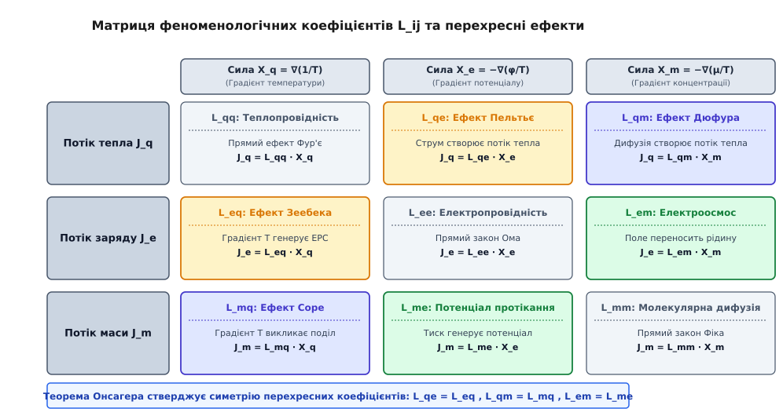
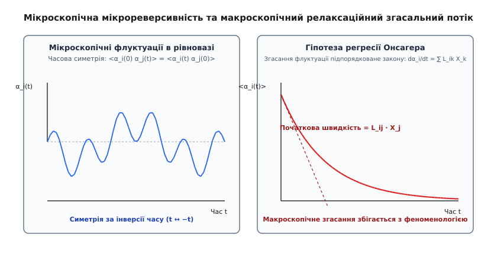
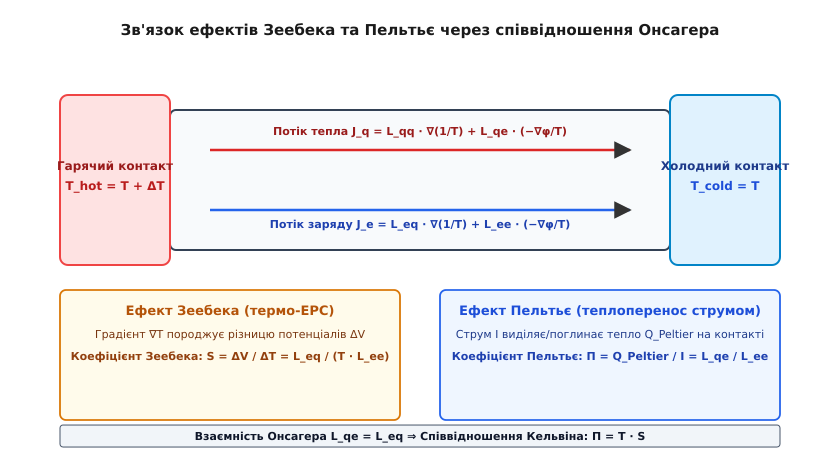

# Співвідношення взаємності Онсагера у нерівноважній термодинаміці

<preknowlist>
- [Другий закон термодинаміки](topic:physics/second-law-thermodynamics) — ентропія замкненої системи зростає у незворотних процесах і досягає максимуму в рівновазі.
- [Статистична ентропія Больцмана](topic:physics/entropy-boltzmann) — зв'язок ентропії з ймовірністю мікростанів та флуктуаціями навколо рівноваги.
- [Теорема флуктуацій і дисипації](topic:physics/fluctuation-dissipation) — лінійний відгук системи на зовнішнє збурення визначений рівноважними флуктуаціями.
</preknowlist>

Коли у провіднику одночасно виникають різниця температур у кілька десятків кельвінів та електричне поле, перенос тепла і перенос заряду припиняють бути незалежними: тепловий потік генерує електричний струм, а електричний струм виділяє й переносить тепло. Класична рівноважна термодинаміка виявляється безсилою перед цим перехресним явищем, оскільки її закони сформульовані лише для статичних станів, а емпіричні коефіцієнти переносу Фур'є та Ома не містять жодної вказівки на зв'язок між собою. Спроба описати такі сполучені процеси довільною матрицею коефіцієнтів вимагає вимірювання дев'яти незалежних величин для трьох потоків, що робить інженерний розрахунок термоелектричних чи електрокінетичних систем надзвичайно громіздким. Фундаментальний розв'язок дає співвідношення взаємності Онсагера — універсальний принцип нерівноважної термодинаміки, який виводить строгу симетрію перехресних коефіцієнтів із мікроскопічної симетрії інверсії часу.

## 1. Від рівноваги до незворотних процесів: термодинамічні сили та потоки

Класична термодинаміка XIX століття, збудована працями Саді Карно, Рудольфа Клаузіуса, Вільяма Томсона та Джозаї Вілларда Гіббса, описує рівноважні стани за допомогою макроскопічних функцій стану: внутрішньої енергії `U`, ентропії `S`, ентальпії `H` та вільної енергії Гіббса `G`. У стані повної термодинамічної рівноваги у системі відсутні просторові градієнти макроскопічних величин, усі потоки речовини, енергії чи заряду дорівнюють нулю, а ентропія замкненої системи досягає свого максимально можливого значення.

Проте будь-яка реальна фізична, хімічна, геофізична чи біологічна система є нерівноважною: вона перебуває під дією зовнішніх впливів або внутрішніх неоднорідностей, які викликають незворотні процеси переносу. Для математичного опису таких систем у рамках феноменологічної термодинаміки незворотних процесів використовується гіпотеза про **локальну термодинамічну рівновагу**. Згідно з цією гіпотезою, хоча система в цілому є нерівноважною, кожен її макроскопічно малий елемент об'єму (який водночас містить величезну кількість окремих молекул чи частинок, `N ~ 10¹⁵...10¹⁸`) перебуває у стані, близькому до рівноваги. Це дає змогу локально використовувати стандартні термодинамічні поняття температури `T(r, t)`, тиску `P(r, t)`, хімічного потенціалу `μ(r, t)` та густини ентропії `s(r, t)`.

Для квантифікації процесів переносу вводиться два фундаментальних поняття:

- **Термодинамічні потоки `Jᵢ`** (від латинського *fluxus* — течія, потік) — макроскопічні вектора чи скаляри, що характеризують швидкість переносу фізичних величин через одиницю площі за одиницю часу. Типовими прикладами є:
  - Густина теплового потоку `J_q` (Вт/м²);
  - Густина електричного струму `J_e` (А/м²);
  - Дифузійний потік маси `J_m` (кг/(м²·с));
  - Швидкість хімічної реакції `J_r` (моль/(м³·с)).

- **Термодинамічні сили `Xᵢ`** (від грецького *therme* — тепло та *dynamis* — сила) — просторові градієнти або термодинамічні сродства, які виводять систему з рівноважного стану та є першопричиною виникнення відповідних потоків. Прикладами є:
  - Градієнт оберненої температури `X_q = ∇(1/T) = −(1/T²) · ∇T`;
  - Градієнт приведеного електричного потенціалу `X_e = −∇(φ/T)`;
  - Градієнт приведеного хімічного потенціалу `X_m = −∇(μ/T)`;
  - Хімічне сродство реакції `X_r = A / T`.

Центральною базовою величиною нерівноважної термодинаміки є **швидкість утворення ентропії в одиниці об'єму `σ`** (або ентропійна дисипативна функція). Рівняння балансу ентропії для елемента об'єму має вигляд:

```
∂s / ∂t = −∇ · J_s + σ
```

де `s` — об'ємна густина ентропії, `J_s` — потік ентропії через межі об'єму, а `σ` — внутрішнє джерело утворення ентропії за рахунок незворотних процесів.

Згідно з Другим законом термодинаміки, у будь-якій реальній системі швидкість утворення ентропії є строго невід'ємною величиною:

```
σ ≥ 0
```

Рівність `σ = 0` досягається виключно у стані повної термодинамічної рівноваги. Онсагер довів, що внутрішнє джерело ентропії завжди подається як білінійна форма від добутків спряжених термодинамічних потоків `Jᵢ` на відповідні термодинамічні сили `Xᵢ`:

```
σ = ∑ᵢ Jᵢ · Xᵢ ≥ 0
```

Вибір спряженої пари `(Jᵢ, Xᵢ)` не є довільним: добуток кожної пари у сумі обов'язково повинен мати фізичну розмірність швидкості утворення ентропії на одиницю об'єму (Дж/(м³·с·К) або Вт/(м³·К)).

## 2. Феноменологічні рівняння переносу та сполучені явища

У стані повної термодинамічної рівноваги всі термодинамічні сили дорівнюють нулю (`Xᵢ = 0`), і відповідно всі потоки зникають (`Jᵢ = 0`). Для слабо нерівноважних систем, коли відхилення від стану рівноваги є малими (малі градієнти температури, концентрації чи потенціалу), макроскопічні потоки `Jᵢ` можна розкласти в багатовимірний ряд Тейлора за силами `Xⱼ` поблизу точки рівноваги `X = 0`.

Обмежуючись першим лінійним членом розкладу, отримуємо **систему лінійних феноменологічних рівнянь переносу**:

```
Jᵢ = ∑ⱼ Lᵢⱼ · Xⱼ
```

де `Lᵢⱼ` — феноменологічні кінетичні коефіцієнти (коефіцієнти переносу Онсагера).

Матриця `L` розмірністю `N × N` містить два фундаментально різних типи елементів:

1. **Діагональні коефіцієнти `Lᵢᵢ` (прямі ефекти переносу):** описують прямий відгук системи, коли сила `Xᵢ` викликає свій власний потік `Jᵢ`. Вони відповідають класичним емпіричним законам фізики XIX століття:
   - **Закон Фур'є для теплопровідності:**
     `J_q = L_qq · ∇(1/T) = −(L_qq / T²) · ∇T = −λ · ∇T`, де `λ = L_qq / T²` — коефіцієнт теплопровідності;
   - **Закон Ома для проходження струму:**
     `J_e = L_ee · (−∇(φ/T)) = (L_ee / T) · (−∇φ) = σ_el · E`, де `σ_el = L_ee / T` — питома електропровідність;
   - **Закон Фіка для молекулярної дифузії:**
     `J_m = L_mm · (−∇(μ/T)) = −D · ∇c`, де `D` — коефіцієнт дифузії.

2. **Позадіагональні коефіцієнти `Lᵢⱼ` при `i ≠ j` (перехресні або сполучені ефекти):** описують явища, коли термодинамічна сила одного фізичного типу `Xⱼ` породжує потік зовсім іншого типу `Jᵢ`.


*Матриця кінетичних коефіцієнтів L_ij, де діагональні елементи відповідають прямим законам переносу, а симетричні позадіагональні елементи описують перехресні явища.*

Розглянемо складну нерівноважну систему, у якій одночасно відбуваються перенос тепла `J_q`, електричного заряду `J_e` та маси речовини `J_m`. У матричній формі система феноменологічних рівнянь має вигляд:

```
⎡ J_q ⎤   ⎡ L_qq  L_qe  L_qm ⎤   ⎡ X_q ⎤
⎢ J_e ⎥ = ⎢ L_eq  L_ee  L_em ⎥ · ⎢ X_e ⎥
⎣ J_m ⎦   ⎣ L_mq  L_me  L_mm ⎦   ⎣ X_m ⎦
```

Підставивши феноменологічні рівняння переносу у вираз для швидкості утворення ентропії `σ`, отримуємо квадратичну форму від термодинамічних сил:

```
σ = ∑ᵢ ∑ⱼ Lᵢⱼ · Xᵢ · Xⱼ ≥ 0
```

Оскільки швидкість виробітку ентропії повинна бути невід'ємною для будь-яких можливих комбінацій сил `Xᵢ`, математичний аналіз вимагає, щоб матриця коефіцієнтів `L` була додатно напіввизначеною. Звідси випливають суворі термодинамічні нерівності:

```
L_qq ≥ 0,   L_ee ≥ 0,   L_mm ≥ 0         [діагональні елементи завжди додатні]
L_qq · L_ee − L_qe · L_eq ≥ 0            [обмеження на величину перехресних членів]
```

Проте сама по собі класична макроскопічна термодинаміка рівноваги нічого не каже про співвідношення між позадіагональними коефіцієнтами `Lᵢⱼ` та `Lⱼᵢ`. З точки зору суто класичної фізики, коефіцієнт `L_qe` (як електричний струм викликає потік тепла) та коефіцієнт `L_eq` (як градієнт температури викликає електричний струм) могли б бути абсолютно незалежними величинами.

## 3. Мікроскопічний фундамент: теорема Онсагера та регресія флуктуацій

У 1931 році норвезько-американський фізико-хімік Ларс Онсагер довів фундаментальну теорему, яка встановила сувору симетрію між позадіагональними коефіцієнтами переносу. Детальний опис драматичного шляху цього відкриття та його визнання Нобелівською премією 1968 року наведено в історичній вставці [📜 Історія відкриття співвідношень Онсагера та Нобелівська премія 1968 року](topic:physics/onsager-reciprocal-relations/hist-onsager-reciprocity.md).

**Теорема Онсагера (Співвідношення взаємності):**
Якщо термодинамічні потоки `Jᵢ` та сили `Xᵢ` вибрано так, що швидкість утворення ентропії задається формулою `σ = ∑ᵢ Jᵢ Xᵢ`, то за відсутності зовнішніх магнітних полів та обертання системи феноменологічні коефіцієнти переносу задовольняють співвідношення взаємності:

```
Lᵢⱼ = Lⱼᵢ
```

Це означає, що перехресний вплив сили `Xⱼ` на потік `Jᵢ` є абсолютно тотожним перехресному впливу сили `Xᵢ` на потік `Jⱼ`.

### Мікроскопічна зворотність часу

Чому макроскопічні незворотні процеси виявляють таку сувору симетрію? Джерело симетрії Онсагера лежить у мікроскопічному світі. Рівняння руху окремих частинок (як класичні рівняння Гамільтона, так і квантове рівняння Шредінгера) є симетричними відносно інверсії часу `t → −t`. Якщо замінити напрямок руху всіх молекул системи на протилежний, вона пройде у зворотному напрямку точно таку саму послідовність мікростанів.

Розглянемо флуктуації термодинамічних параметрів `αᵢ(t)` та `αⱼ(t)` навколо рівноважного стану. З мікроскопічної зворотності часу випливає, що часова автокореляційна функція двох параметрів у рівновазі є симетричною відносно зсуву часу:

```
< αᵢ(0) · αⱼ(t) > = < αᵢ(t) · αⱼ(0) >
```

Ця рівність означає: ймовірність того, що за флуктуацією параметра `αᵢ` через час `t` виникне флуктуація параметра `αⱼ`, строго дорівнює ймовірності того, що за флуктуацією `αⱼ` через час `t` виникне флуктуація `αᵢ`.


*Зв'язок між мікроскопічною симетрією рівноважних флуктуацій за інверсії часу та макроскопічним законам згасання нерівноважного стану.*

### Гіпотеза регресії флуктуацій

Для того щоб перейти від мікроскопічних флуктуацій до макроскопічних рівнянь переносу, Онсагер висунув фундаментальну **гіпотезу регресії флуктуацій**:

> *Спонтанна мікроскопічна флуктуація, що виникла у рівноважній системі, згасає (регресує) у середньому за тими самими макроскопічними законами, що й нерівноважний стан, створений зовнішніми макроскопічними силами.*

Комбінуючи статистичний розподіл флуктуацій Ейнштейна `W(α) ∝ exp(ΔS / k_B)`, симетрію кореляційних функцій та феноменологічні рівняння переносу `dαᵢ/dt = ∑ₖ Lᵢₖ Xₖ`, Онсагер математично вивів симетрію `Lᵢⱼ = Lⱼᵢ`. Покрокове математичне доведення цієї теореми із застосуванням ентропійної матриці та диференціювання автокореляцій наведено у розбірній вставці [🧮 Математичне виведення співвідношень взаємності з гіпотези регресії флуктуацій](topic:physics/onsager-reciprocal-relations/math-onsager-fluctuations.md).

## 4. Варіаційний принцип мінімуму дисипації та принцип Пригожина

Співвідношення взаємності Онсагера слугують фундаментом для формулювання екстремальних принципів нерівноважної термодинаміки, які описують поведінку систем у стаціонарних нерівноважних станах.

### Варіаційний принцип Онсагера (Принцип найменшої дисипації енергії)

Онсагер показав, що для лінійних незворотних процесів можна ввести **функцію дисипації Релея `Ψ(J, J)`**, яка дорівнює половині швидкості утворення ентропії, помноженій на температуру:

```
Ψ(J, J) = (1/2) · T · σ = (1/2) · ∑ᵢ ∑ⱼ Rᵢⱼ · Jᵢ · Jⱼ
```

де `Rᵢⱼ = (L⁻¹)ᵢⱼ` — матриця феноменологічних опорів, обернена до матриці Онсагера `L`.

Згідно з варіаційним принципом Онсагера, при заданих термодинамічних силах `Xᵢ` справжні макроскопічні потоки `Jᵢ` забезпечують максимум потенціальної функції `W(J) = ∑ᵢ Xᵢ Jᵢ − Ψ(J, J)`. Варіювання цієї функції по потоках `∂W / ∂Jᵢ = 0` виводить лінійні закони переносу `Xᵢ = ∑ⱼ Rᵢⱼ Jⱼ`. Симетрія матриці `Rᵢⱼ = Rⱼᵢ` є прямим наслідком симетрії Онсагера `Lᵢⱼ = Lⱼᵢ`.

### Принцип мінімуму виробітку ентропії Пригожина

У 1945 році бельгійський фізико-хімік Ілля Пригожин довів фундаментальну теорему про стаціонарні нерівноважні стани:

> *Якщо нерівноважна система перебуває у лінійній області (де діють співвідношення Онсагера `Lᵢⱼ = Lⱼᵢ`), а зовнішні умови (наприклад, температура чи концентрація на межах) утримуються сталими, то стаціонарний стан системи відповідає МІНІМУМУ швидкості утворення ентропії `σ`.*

```
dσ / dt ≤ 0           [наближення до стаціонарного стану]
dσ / dt = 0           [у стаціонарному стані σ = min]
```

Принцип Пригожина пояснює дивовижну стійкість стаціонарних нерівноважних станів: якщо стаціонарну систему злегка вивести з цього стану внутрішньою флуктуацією, виробіток ентропії зросте (`σ > σ_min`), і виникаючі потоки негайно повернуть систему назад у стан із мінімальною дисипацією.

## 5. Практичні прояви перехресних процесів

Співвідношення взаємності Онсагера мають колосальне значення для фізики та техніки, оскільки вони пов'язують між собою явища, які раніше вважалися абсолютно незалежними.

### Термоелектричні явища: Зеебек, Пельтьє та Томсон

Розглянемо провідник, у якому одночасно протікають потік тепла `J_q` та потік електричного заряду `J_e` під дією термодинамічних сил `X_q = ∇(1/T)` та `X_e = −∇(φ/T)`:

```
J_q = L_qq · X_q + L_qe · X_e
J_e = L_eq · X_q + L_ee · X_e
```

Ця система описує три знаменитих термоелектричних ефекти:
1. **Ефект Зеебека (1821 рік):** якщо до провідника прикласти градієнт температури `∇T` у розімкненому колі (`J_e = 0`), виникає електричне поле та різниця потенціалів `ΔV`. Коефіцієнт Зеебека (термо-ЕРС) дорівнює:
   ```
   S = (∇φ / ∇T)_{J_e=0} = L_eq / (T · L_ee)
   ```
2. **Ефект Пельтьє (1834 рік):** якщо через ізотермічний провідник (`∇T = 0`) пропустити електричний струм `J_e`, на контактах виділяється або поглинається додаткове тепло `J_q`. Коефіцієнт Пельтьє дорівнює:
   ```
   Π = (J_q / J_e)_{∇T=0} = L_qe / L_ee
   ```
3. **Ефект Томсона (1854 рік):** при проходженні струму `J_e` уздовж провідника з градієнтом температури `∇T` виділяється додаткове тепло Томсона `q_T = −τ · J_e · ∇T`, де `τ` — коефіцієнт Томсона.


*Схема взаємозв'язку між різницею температур та електричним потенціалом у провіднику, що ілюструє співвідношення Кельвіна.*

Застосовуючи теорему Онсагера `L_qe = L_eq`, ми миттєво отримуємо **друге співвідношення Кельвіна**:

```
Π = S · T
```

Крім того, перше співвідношення Кельвіна пов'язує коефіцієнт Томсона з коефіцієнтом Зеебека: `τ = T · (dS / dT)`. Лорд Кельвін отримав ці формули в 1854 році за допомогою евристичних міркувань, але лише Онсагер дав їм строге фізичне обґрунтування. Чисельне моделювання термоелектричних модулів Пельтьє з використанням матриці Онсагера мовами C та C++ розібрано у прикладній вставці [⚙️ Моделювання термоелектричних ефектів на основі матриці Онсагера](topic:physics/onsager-reciprocal-relations/proj-coupled-transport.md).

### Термодифузія: ефекти Соре та Дюфура

У бінарній суміші газів або рідин спостерігається сполучення між переносом маси та переносом тепла:
- **Ефект Соре (термодифузія, 1879 рік):** градієнт температури `∇T` викликає потік маси та градієнт концентрації `∇c`. Компоненти суміші розділяються: важчі або більші молекули зазвичай накопичуються на холодному кінці.
- **Ефект Дюфура (дифузійно-тепловий ефект, 1872 рік):** градієнт концентрації `∇c` при змішуванні двох газів викликає потік тепла та локальну різницю температур `∇T`.

Феноменологічні рівняння для потоку тепла `J_q` та потоку маси `J_m` мають вигляд:

```
J_q = L_qq · ∇(1/T) − L_qm · ∇(μ/T)
J_m = L_mq · ∇(1/T) − L_mm · ∇(μ/T)
```

Співвідношення Онсагера стверджує строгу рівність перехресних коефіцієнтів: `L_qm = L_mq`. Це дає змогу розрахувати коефіцієнт Дюфура за виміряним значенням коефіцієнта термодифузії Соре, що має величезне значення для розділення ізотопів та фізичної хімії розчинів.

### Електрокінетичні явища: відносини Саксена

У пористих мембранах, ґрунтах та капілярах спостерігається взаємодія між рухом рідини (потік об'єму `J_v`) та електричним струмом `J_e` під дією перепаду тиску `ΔP` та електричної напруги `ΔV`:
- **Електроосмос:** електричне поле `ΔV` викликає перекачування рідини через пористу мембрану (`J_v`).
- **Потенціал протікання (Streaming potential):** продавлювання рідини тиском `ΔP` генерує електричну різницю потенціалів `ΔV`.

Співвідношення Онсагера для електрокінетики приводять до **відносин Саксена (Saxén's relations)**, які пов'язують коефіцієнт електроосмотичного тиску з коефіцієнтом потенціалу протікання:

```
(ΔP / ΔV)_{J_v=0} = −(J_e / J_v)_{ΔV=0}
```

### Хімічна кінетика поблизу рівноваги

Для хімічної реакції з перебігом `∑ νᵢ Aᵢ ⇄ ∑ ν'ⱼ Bⱼ` термодинамічною силою є хімічне сродство `A = −∑ νᵢ μᵢ`, а потоком — швидкість реакції `J_r = dξ / dt`. Поблизу хімічної рівноваги (`A << R T`) швидкість реакції лінійно залежить від сродства: `J_r ≈ (r₀ / (R T)) · A`, де `r₀` — рівноважна швидкість прямої та зворотної реакцій. У складних багатоетапних хімічних мережах співвідношення Онсагера `L_ij = L_ji` забезпечують симетрію між перехресними швидкостями паралельних і послідовних стадій.

## 6. Межі застосовності та узагальнення Онсагера — Казимира

Незважаючи на універсальність співвідношень взаємності Онсагера, вони мають чітко окреслені межі застосовності:

1. **Лінійний режим переносу:** сили `Xᵢ` повинні бути достатньо малими, щоб відгук системи залишався лінійним (`Jᵢ = ∑ Lᵢⱼ Xⱼ`). У сильно нерівноважних умовах (ударні хвилі, сильне турбулентне перемішування, високі інтенсивності випромінювання) з'являються нелінійні члени `Lᵢⱼₖ Xⱼ Xₖ`, і симетрія Онсагера в загальному випадку втрачається.
2. **Локальна термодинамічна рівновага:** елементарний макроскопічний об'єм системи повинен містити достатню кількість частинок, щоб термодинамічні параметри (температура, тиск, хімічний потенціал) мали чіткий статистичний зміст.

### Вплив магнітного поля та обертання: Співвідношення Онсагера — Казимира

Якщо система перебуває у зовнішньому магнітному полі `B` або обертається з кутовою швидкістю `Ω`, сила Лоренца та сила Коріоліса змінюють знак при інверсії часу (`t → −t`). Для збереження мікроскопічної зворотності необхідно одночасно змінити напрямок полів: `B → −B` та `Ω → −Ω`.

У 1945 році Гендрік Казимир розширив теорему Онсагера. **Співвідношення Онсагера — Казимира** враховують також парність термодинамічних змінних відносно інверсії часу:

```
Lᵢⱼ(B, Ω) = εᵢ · εⱼ · Lⱼᵢ(−B, −Ω)
```

де `εᵢ = +1` для парних змінних (густина, температура, концентрація) і `εᵢ = −1` для непарних змінних (імпульс, макроскопічна швидкість, магнітна індукція).

Наприклад, для гальваномагнітних та термомагнітних явищ (ефект Холла, ефект Нернста — Еттінгсгаузена) співвідношення Онсагера — Казимира дають:

```
L_xy(B) = L_yx(−B)
```

Компонента тензора провідності `L_xy` в магнітному полі `B` дорівнює транспонованій компоненті `L_yx` у протилежному полі `−B`.

> 🔧 **Навіщо це.**
> Співвідношення взаємності Онсагера зменшують кількість незалежних експериментальних коефіцієнтів, необхідних для повного опису системи з `N` сполученими потоками, з `N²` до `N(N + 1) / 2`. Для трикомпонентної системи це означає скорочення вимірювань з 9 до 6. У розробці термоелектричних генераторів та охолоджувачів Пельтьє теорія Онсагера дає змогу точним чином оптимізувати коефіцієнт добротності матеріалу `Z T = S² σ T / κ`, пов'язуючи термо-ЕРС та теплопровідність. У мікрофлюїдиці, мембранних технологіях зворотного осмосу та аналізі біофізичних клітинних мембран симетрія Онсагера слугує базовим критерієм перевірки фізичної коректності чисельних моделей та експериментальних даних.
